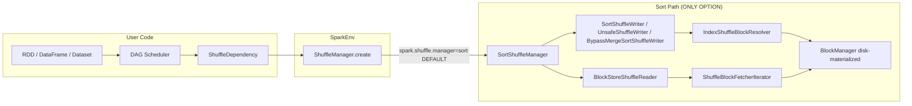
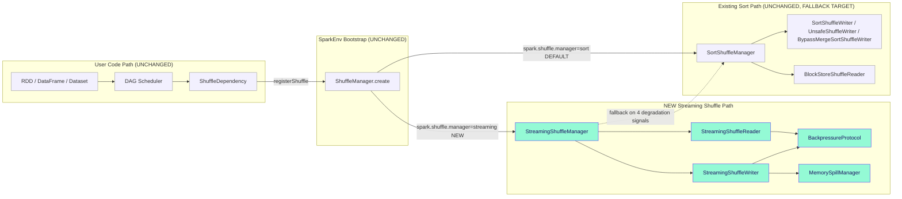
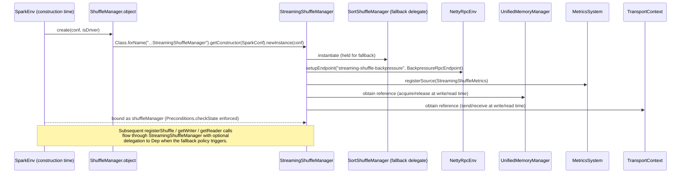
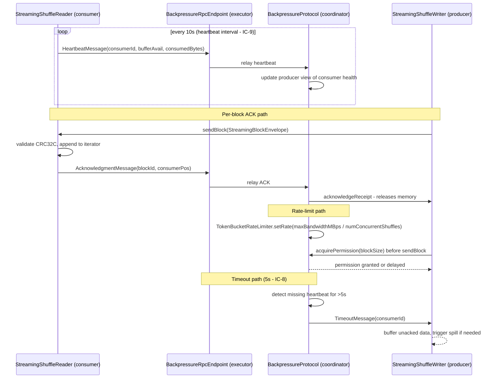
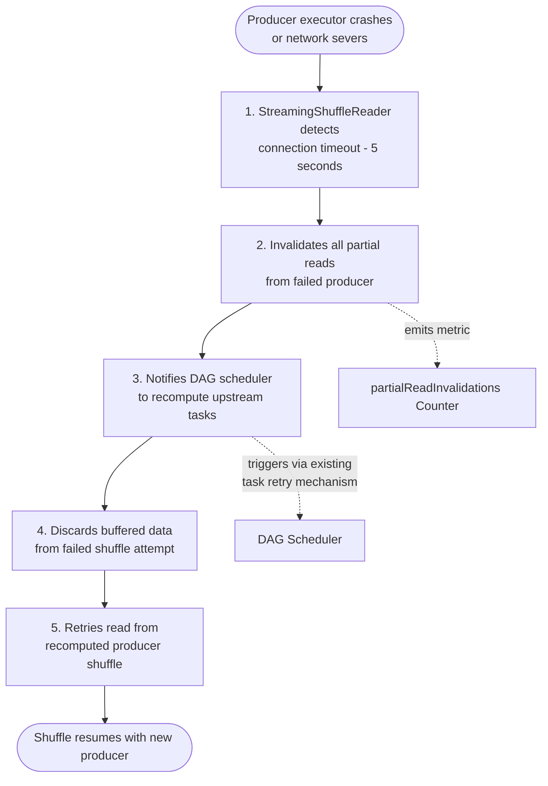
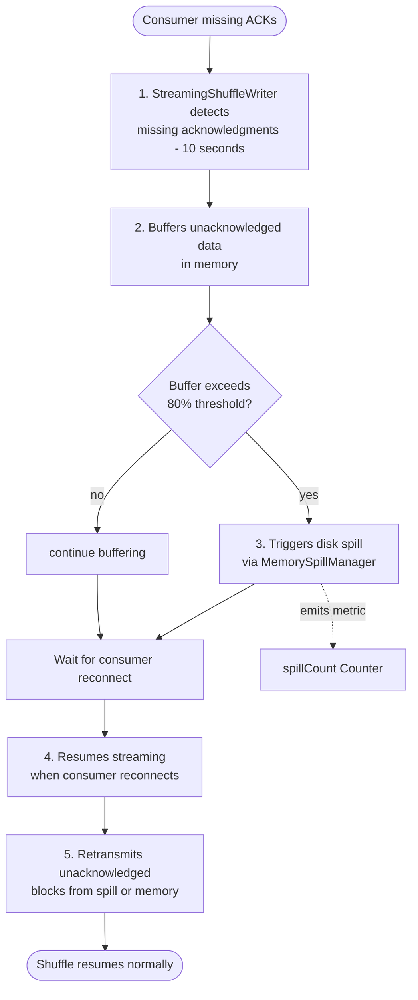

# Streaming Shuffle — Architecture & Coexistence Topology

This document is the primary architectural reference for the Streaming Shuffle
feature added to Apache Spark 4.2.0-SNAPSHOT. It captures the coexistence
topology, runtime wiring, backpressure loop, failure-handling flows, automatic
fallback conditions, component inventory, and configuration reference. Sibling
documents cross-link back to specific sections here:

- [streaming-shuffle-decision-log.md](./streaming-shuffle-decision-log.md) —
  rationale and alternatives for every non-trivial decision.
- [streaming-shuffle-traceability.md](./streaming-shuffle-traceability.md) —
  bidirectional requirement-to-code-to-test traceability matrix.
- [streaming-shuffle-dashboard-template.json](./streaming-shuffle-dashboard-template.json) —
  Grafana dashboard template for the four `shuffle.streaming.*` metrics.
- [streaming-shuffle-executive-summary.html](./streaming-shuffle-executive-summary.html) —
  reveal.js executive summary that embeds these Mermaid diagrams.

## Feature Summary

The Streaming Shuffle feature adds a *streaming shuffle capability* to Apache
Spark 4.2.0-SNAPSHOT as an **opt-in, coexisting alternative** to the existing
sort-based shuffle engine. The feature eliminates shuffle materialization
latency by streaming map-output bytes directly from producer executors to
consumer executors with in-memory buffering, consumer-driven backpressure, and
graceful disk spill, while preserving the production-stable
`SortShuffleManager` path as the default and the automatic fallback target.

*(Paragraph reproduced from AAP §0.1.1 "Core Feature Objective".)*

## Success Criteria

The five user-specified success criteria are binding acceptance targets for the
feature and are validated by the test suites catalogued in
[streaming-shuffle-traceability.md](./streaming-shuffle-traceability.md):

1. **30-50% end-to-end latency reduction** for shuffle-heavy workloads
   (100MB+ data, 10+ partitions).
2. **5-10% improvement for CPU-bound workloads** through reduced scheduler
   overhead.
3. **Zero performance regression** for memory-bound workloads (automatic
   fallback validation).
4. **Zero data loss** under all failure scenarios including producer crashes,
   consumer failures, network partitions.
5. **Memory exhaustion prevention** through 80% threshold spill trigger with
   <100ms response time.

*(Criteria reproduced verbatim from AAP §0.1.1.)*

## Before — Sort-Only Shuffle Topology

**Diagram Title**: Sort-Only Shuffle Topology (Baseline, Apache Spark ≤ 4.1).

**Legend**:
- Solid arrow (`-->`) = synchronous call at runtime.
- Rectangular boxes = Scala / Java classes.
- Grouped subgraphs = architectural layers (user code, SparkEnv, sort path).
- "DEFAULT" on the selector edge = the only selection possible in the baseline.

In the baseline topology, every shuffle is materialized to local disk via
`IndexShuffleBlockResolver` before any reduce-side fetch can begin; the
reduce side polls `ShuffleBlockFetcherIterator` against already-committed
blocks. There is no in-flight path from producer to consumer.

## After — Streaming + Sort Coexistence Topology

**Diagram Title**: Streaming Shuffle Coexistence Topology (Post-Feature,
Apache Spark 4.2.0+ with opt-in).

**Legend**:
- Teal (`#94FAD5`) boxes = new components introduced by this feature.
- Lavender (`#F2F0FE`) boxes = existing components preserved without
  modification.
- Solid arrows (`-->`) = runtime selection at `SparkEnv` construction.
- Dashed arrow (`-.->`) = fallback redirection when one of the four
  degradation signals fires at `registerShuffle` time.

The `spark.shuffle.manager` selector remains the single integration seam —
`"sort"` (default) and `"tungsten-sort"` continue to resolve to
`SortShuffleManager`, while the newly registered `"streaming"` short name
resolves to `StreamingShuffleManager`. Per-shuffle fallback keeps the blast
radius of streaming-path degradation bounded to the individual shuffle rather
than the executor or the application.

## Runtime Bootstrap and Wiring

**Diagram Title**: Streaming Shuffle — Executor Bootstrap and Runtime Wiring.

**Legend**:
- Solid arrows (`->>`) = direct synchronous calls during `SparkEnv`
  construction.
- Dashed arrows (`-->>`) = reference retained for later invocation on the hot
  path.
- Participants ordered top-to-bottom in approximate construction order.

The bootstrap is idempotent and one-shot —
`SparkEnv.initializeShuffleManager()` enforces single initialization via
`Preconditions.checkState(null == _shuffleManager)`, making streaming
shuffle's lifecycle identical to that of `SortShuffleManager` from the
executor's point of view. The `BackpressureRpcEndpoint` is registered only on
executors (driver-guarded) to keep the driver's RPC surface unchanged.

## Backpressure Loop

**Diagram Title**: Consumer-Driven Backpressure Flow Across Heartbeat,
Acknowledgment, and Rate-Limit Channels.

**Legend**:
- Participants ordered left-to-right from the consumer side (reader) to the
  producer side (writer), with the backpressure coordinator in between.
- Solid arrows (`->>`) = RPC or synchronous invocations.
- Dashed arrows (`-->>`) = asynchronous responses or notifications.
- `loop` block = periodic heartbeat every 10 seconds (IC-9).
- `Note over` blocks label the three functional sub-paths (ACK, rate-limit,
  timeout).
- Time axis flows top-to-bottom.

The backpressure loop is the central coordination construct for streaming
shuffle. It enforces three invariants simultaneously:

1. **Memory reclamation** — producer memory is released only after the
   consumer acknowledges receipt, never speculatively.
2. **Bounded egress** — the per-executor token bucket caps outbound bandwidth
   at `maxBandwidthMBps / numConcurrentShuffles`, enforcing the 80% link
   capacity limit across concurrent shuffles.
3. **Liveness detection** — a 10-second heartbeat (IC-9) plus a 5-second
   connection timeout (IC-8) yield deterministic failure detection without
   relying on TCP RST semantics.

## Producer Failure Detection Flow

**Diagram Title**: Producer Failure Detection — Consumer-Side Recovery Flow.

**Legend**:
- Numbered nodes (`S1`..`S5`) = sequential steps reproduced verbatim from AAP
  §0.1.2.
- Solid arrows (`-->`) = sequential flow.
- Dashed arrows (`-.->`) = side-effects to other subsystems (metrics, DAG
  scheduler).
- Rounded stadium nodes (`([...])`) = entry / exit states.

The flow implements atomic partial-read invalidation (IC-12): all bytes
received from the failed producer are discarded in a single critical section
so that no partial record ever surfaces to downstream iterators. Recomputation
is triggered through the existing DAG scheduler path — no new recovery
machinery is introduced, honoring the Absolute Preservation invariants on
lineage tracking and fault recovery.

## Consumer Failure Detection Flow

**Diagram Title**: Consumer Failure Detection — Producer-Side Buffering and
Retransmission Flow.

**Legend**:
- Numbered nodes (`S1`..`S5B`) = sequential steps reproduced verbatim from
  AAP §0.1.2.
- Solid arrows (`-->`) = sequential flow.
- Dashed arrow (`-.->`) = side-effect to the metrics subsystem.
- Diamond node (`{ ... }`) = decision point (buffer-threshold evaluation).
- Rounded stadium nodes (`([...])`) = entry / exit states.

The consumer-side flow inverts the producer-side flow: rather than discarding
bytes, the producer persists them (initially in memory, then on disk once the
80% threshold is crossed) and replays them when the consumer returns. Because
spill uses the existing `BlockManager.putBytes` path under standard
`ShuffleBlockId` naming, spilled buffers are discoverable by the
`BlockManager`'s decommissioning and migration machinery without any
streaming-specific integration.

## Automatic Fallback Conditions

The streaming shuffle path falls back to sort-based shuffle at per-shuffle
granularity by delegating to the held `SortShuffleManager` instance when any
of the four conditions below fires. Fallback is evaluated by
`StreamingShuffleFallbackPolicy` at `StreamingShuffleManager.registerShuffle()`
time and is logged with a structured `reason` field (logging key introduced
alongside `StreamingShuffleFallbackPolicy` in a later checkpoint; not part of
the four CP1 `LogKey` additions `BUFFER_UTILIZATION_PERCENT`, `SPILL_COUNT`,
`BACKPRESSURE_EVENTS`, `PARTIAL_READ_INVALIDATIONS`).

| # | Trigger Condition (verbatim from AAP §0.1.2) | Detection Method | Response | Metric Emission |
|---|------------------------------------------------|------------------|----------|-----------------|
| 1 | Consumer sustained 2x slower than producer for >60 seconds | `BackpressureProtocol` rolling window comparing `consumedBytes` rate vs. `producedBytes` rate per shuffle | Mark shuffle for fallback; subsequent `getWriter` / `getReader` calls for this `shuffleId` return sort-path implementations | `backpressureEvents` counter incremented with `reason=consumer-slow` label |
| 2 | Memory pressure prevents buffer allocation (OOM risk) | `MemorySpillManager` detects `acquireExecutionMemory` returns less than requested, OR `UnifiedMemoryManager` reports >= `spillThreshold` for >10s | Mark shuffle for fallback; log structured `reason=memory-pressure` | `backpressureEvents` counter incremented with `reason=memory-pressure` label |
| 3 | Network saturation exceeds 90% link capacity | `BackpressureProtocol` token-bucket rate hitting consistently over 90% of `maxBandwidthMBps` | Mark shuffle for fallback; throttle remaining streaming shuffles | `backpressureEvents` counter incremented with `reason=network-saturation` label |
| 4 | Producer/consumer version mismatch (compatibility check) | Version handshake at `openConsumerStream` fails (envelope schema version mismatch) | Mark shuffle for fallback immediately; log structured `reason=version-mismatch` | `backpressureEvents` counter incremented with `reason=version-mismatch` label |

Fallback is **sticky per `shuffleId`** — once a shuffle has been routed to the
sort path it remains there for its entire lifetime. New shuffles registered
after the triggering condition clears are re-evaluated from scratch. This
policy preserves the five-layer fault escalation invariant (Task → Stage →
Executor → Driver → Application) and keeps the DAG scheduler and task
lifecycle untouched per the Absolute Preservation list.

## Component Inventory

This section enumerates every new source class introduced by the Streaming
Shuffle feature, grouped by functional role. Method-level mapping to
requirements is maintained in
[streaming-shuffle-traceability.md](./streaming-shuffle-traceability.md).

### Core Feature Classes (AAP §0.2.3.1)

| Class | Location | Responsibility |
|-------|----------|----------------|
| `StreamingShuffleManager` | `core/src/main/scala/org/apache/spark/shuffle/streaming/StreamingShuffleManager.scala` | Implements the `ShuffleManager` trait; factory for writer and reader; delegates to a held `SortShuffleManager` instance on fallback; owns the RPC endpoint registration and the metrics source registration. |
| `StreamingShuffleHandle` | `core/src/main/scala/org/apache/spark/shuffle/streaming/StreamingShuffleHandle.scala` | `private[spark]` marker subclass of `BaseShuffleHandle` identifying streaming-mode shuffles so the manager can type-match on dispatch without an extra field. |
| `StreamingShuffleWriter` | `core/src/main/scala/org/apache/spark/shuffle/streaming/StreamingShuffleWriter.scala` | Map-side writer. Per-partition buffers sized `(executorMemory * bufferSizePercent) / numPartitions`; network pipelining via `StreamingShuffleTransport`; spill at the 80% threshold; CRC32C checksums per block capped at 2 MB. |
| `StreamingShuffleReader` | `core/src/main/scala/org/apache/spark/shuffle/streaming/StreamingShuffleReader.scala` | Reduce-side reader. Iterator adapter; producer polling for in-progress blocks; connection-timeout detection; checksum validation and retransmission-request on corruption. |

### Flow Control and Memory Classes (AAP §0.2.3.2)

| Class | Location | Responsibility |
|-------|----------|----------------|
| `BackpressureProtocol` | `core/src/main/scala/org/apache/spark/shuffle/streaming/BackpressureProtocol.scala` | Stateful coordinator holding the token-bucket rate limiter, acknowledgment tables, heartbeat timers, and priority arbitration by partition count and data volume. |
| `BackpressureRpcEndpoint` | `core/src/main/scala/org/apache/spark/shuffle/streaming/BackpressureRpcEndpoint.scala` | `ThreadSafeRpcEndpoint` bound to `NettyRpcEnv` at `"streaming-shuffle-backpressure"`; handles `HeartbeatMessage`, `AcknowledgmentMessage`, `RateLimitMessage`, `TimeoutMessage`. Driver-guarded — executors only. |
| `MemorySpillManager` | `core/src/main/scala/org/apache/spark/shuffle/streaming/MemorySpillManager.scala` | 100 ms polling thread (`streaming-shuffle-memory-poll`); LRU eviction of the largest buffered partition at 80% threshold; `BlockManager.putBytes` for spill persistence; records spill frequency, volume, latency. |
| `StreamingShuffleFallbackPolicy` | `core/src/main/scala/org/apache/spark/shuffle/streaming/StreamingShuffleFallbackPolicy.scala` | Evaluates the four fallback conditions; returns a decision at `registerShuffle` time so that fallback is sticky per `shuffleId`. |

### Network Envelope Classes (AAP §0.2.3.3)

| Class | Location | Responsibility |
|-------|----------|----------------|
| `StreamingBlockEnvelope` | `core/src/main/scala/org/apache/spark/shuffle/streaming/network/StreamingBlockEnvelope.scala` | Serializable frame carrying `(shuffleId, mapId, reduceId, sequenceNumber, checksum, payloadBytes)` encoded via Netty `ByteBuf`; payload size capped at 2 MB per IC-7. |
| `StreamingShuffleTransport` | `core/src/main/scala/org/apache/spark/shuffle/streaming/network/StreamingShuffleTransport.scala` | Wraps existing `TransportContext` usage. Exposes `sendBlock(BlockManagerId, StreamingBlockEnvelope)` and `openConsumerStream(BlockManagerId, shuffleId, reduceRange)`. TCP keepalive enabled with 5-second interval per IC-6. |
| `TokenBucketRateLimiter` | `core/src/main/scala/org/apache/spark/shuffle/streaming/network/TokenBucketRateLimiter.scala` | Thin wrapper around Guava `RateLimiter` with `setRate(maxBandwidthMBps * 1024 * 1024 / numConcurrentShuffles)`; enforces the 80% link-capacity cap and refreshes dynamically as concurrency changes. |

### Metrics and Observability Classes (AAP §0.2.3.4)

| Class | Location | Responsibility |
|-------|----------|----------------|
| `StreamingShuffleMetrics` | `core/src/main/scala/org/apache/spark/shuffle/streaming/StreamingShuffleMetrics.scala` | Dropwizard `Source` under the `shuffle.streaming` namespace exposing `bufferUtilizationPercent` (`Gauge[Double]`), `spillCount`, `backpressureEvents`, and `partialReadInvalidations` (each a `Counter`). |

## Configuration Reference

Streaming shuffle is configured via five new keys registered in
`core/src/main/scala/org/apache/spark/internal/config/package.scala` —
colocated after the existing `SHUFFLE_MANAGER` block. The canonical
user-facing reference lives in `docs/configuration.md`; the table below is the
feature-local summary.

| Property | Default | Range | Description | Since |
|----------|---------|-------|-------------|-------|
| `spark.shuffle.manager` | `sort` | `sort`, `tungsten-sort`, `streaming`, or FQCN | Selects the ShuffleManager implementation. Set to `streaming` to activate the feature. | pre-4.2 (extended) |
| `spark.shuffle.streaming.enabled` | `false` | boolean | Master switch for streaming logic; honored by `StreamingShuffleManager` at `registerShuffle` time. When `false`, every shuffle falls back to the held `SortShuffleManager`. Opt-in default (`false`) preserves the production-stable sort path for existing applications. | 4.2.0 |
| `spark.shuffle.streaming.bufferSizePercent` | `20` | `1`-`50` | Per-executor memory percentage allocated to streaming shuffle buffers (IC-1). | 4.2.0 |
| `spark.shuffle.streaming.spillThreshold` | `80` | `50`-`95` | Buffer utilization percentage triggering spill (IC-2). | 4.2.0 |
| `spark.shuffle.streaming.maxBandwidthMBps` | `0` (unlimited) | non-negative integer; `0` = unlimited | Maximum outbound bandwidth per executor for streaming shuffle; fed to the token-bucket `setRate`. Setting `0` disables the rate limiter entirely. | 4.2.0 |
| `spark.shuffle.streaming.debug` | `false` | boolean | Enables DEBUG-level logging for the `org.apache.spark.shuffle.streaming` logger (IC-17). | 4.2.0 |

**Operational note**: Changes to these keys require an executor restart
(IC-13). No dynamic reconfiguration is supported in v1 — this matches the
single-initialization contract enforced by
`SparkEnv.initializeShuffleManager()` via
`Preconditions.checkState(null == _shuffleManager)`.

## Traceability

Complete bidirectional mapping of user requirements, implementing classes, and
validating tests is maintained in
[streaming-shuffle-traceability.md](./streaming-shuffle-traceability.md) with
100% coverage across:

- 5 success criteria (SC-1 through SC-5).
- 24 component responsibilities (CR-*).
- 17 implementation constraints (IC-1 through IC-17).
- 8 absolute preservation invariants (AP-1 through AP-8).
- 5 implementation discipline directives (ID-1 through ID-5).
- 10 failure handling protocol steps (FH-P-1..5 and FH-C-1..5).
- 4 automatic fallback conditions (FB-1 through FB-4).

Design decisions with alternatives, rationale, and risks are logged in
[streaming-shuffle-decision-log.md](./streaming-shuffle-decision-log.md).
Observability artefacts (metric sinks, dashboard definition) live in
[streaming-shuffle-dashboard-template.json](./streaming-shuffle-dashboard-template.json).
An executive-level overview with embedded Mermaid diagrams is available at
[streaming-shuffle-executive-summary.html](./streaming-shuffle-executive-summary.html).
