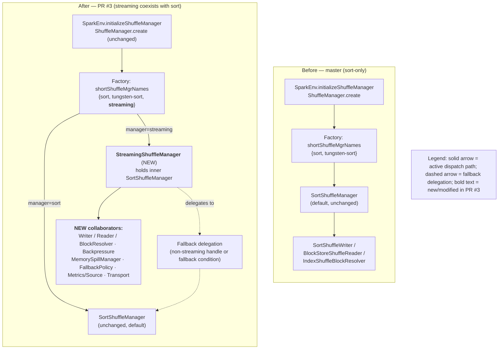
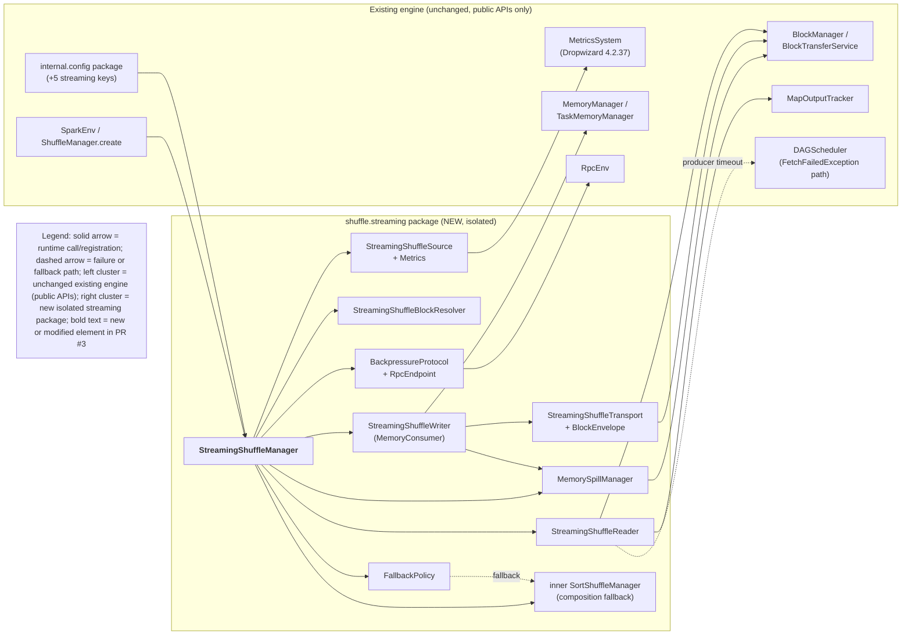
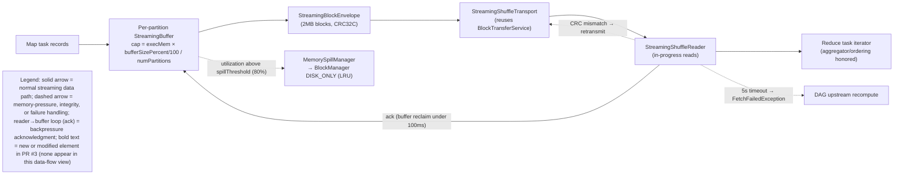

# Streaming Shuffle Architecture

Streaming shuffle is an **opt-in** `ShuffleManager` that **coexists with** the
default `SortShuffleManager` rather than replacing it. It is wired in through the
existing shuffle SPI by **composition**: the `StreamingShuffleManager` holds an
inner `SortShuffleManager` instance and delegates every non-streaming handle and
every fallback condition to it. Because the production-stable sort path is always
present and is used verbatim for anything the streaming path cannot serve, the
feature guarantees **zero regression** — if streaming is not eligible, or any
fallback condition trips, the shuffle simply runs on sort exactly as it does on
`master`.

All new production code is isolated in a dedicated package,
`org.apache.spark.shuffle.streaming` (with a `network/` subpackage), so there is
**zero cross-contamination** with existing shuffle code paths. Only **two**
existing Scala files are modified, and both edits are surgical and additive:

- `core/src/main/scala/org/apache/spark/shuffle/ShuffleManager.scala` — a single
  new entry (`"streaming"`) is added to the `shortShuffleMgrNames` factory map.
- `core/src/main/scala/org/apache/spark/internal/config/package.scala` — five new
  `spark.shuffle.streaming.*` `ConfigEntry` definitions are appended next to the
  existing `SHUFFLE_MANAGER` entry.

Everything else the feature needs — writer, reader, block resolver, buffering,
spill, backpressure, transport, metrics, and fallback policy — is net-new,
isolated code that integrates with the engine exclusively through public APIs and
the pluggable SPI. The remainder of this page shows the current (`master`) and
target (PR&nbsp;#3) architectures, the runtime component interactions, the
producer&nbsp;&rarr;&nbsp;consumer data flow, and every integration touchpoint.

## Figure 1 — Shuffle Manager Selection: Before (master) vs. After (PR #3)

The diagram below shows **both** the current state (`master`, sort-only) and the
target state (PR&nbsp;#3, streaming coexists with sort). Bold labels mark the
elements newly created or modified by this feature.

**Legend.** Solid arrows denote the active dispatch path; dashed arrows denote
fallback delegation to the sort path; **bold** labels denote elements newly
created or modified by this feature.

The **only** change on the active dispatch path is adding the `"streaming"` alias
to the `shortShuffleMgrNames` map in `ShuffleManager.scala`. The
`SparkEnv.initializeShuffleManager` factory call `ShuffleManager.create(conf,
isDriver)` and the `SortShuffleManager` implementation are **untouched** — the
factory is already driven entirely by the `spark.shuffle.manager` value, so
registering the alias is sufficient to wire the new manager. Selection of the
streaming backend requires the **dual activation gate**:
`spark.shuffle.manager=streaming` **and** `spark.shuffle.streaming.enabled=true`
must both hold; otherwise the shuffle runs on the unchanged sort path. See
[Configuration](configuration.md) for the full key reference.

## Figure 2 — Component Interaction

This diagram shows how the new, isolated streaming package (right cluster)
attaches to the unchanged existing engine (left cluster). Every touchpoint is a
public API or the pluggable SPI; there are no private-contract changes. The two
edits to existing code appear only as the `internal.config (+5 streaming keys)`
node and the factory alias implicit in `SparkEnv / ShuffleManager.create`.

**Legend.** Solid arrows are runtime calls or registrations; dashed arrows are
failure or fallback paths. The left cluster is the unchanged existing engine,
accessed only through public APIs; the right cluster is the new, isolated
streaming package. **Bold** labels denote elements newly created or modified by
this feature (for example, `StreamingShuffleManager`). Note the two dashed
edges: the reader raises the standard `FetchFailedException` to the
`DAGScheduler` on producer timeout, and the `FallbackPolicy` routes to the inner
`SortShuffleManager` when any fallback condition trips.

## Figure 3 — Data Flow (Producer → Consumer)

This diagram traces the end-to-end record path from a producing map task to a
consuming reduce task, including the backpressure acknowledgment loop, the
memory-pressure spill deviation, and the integrity/failure handling paths.

**Legend.** Solid arrows trace the normal streaming data path and the
reader&rarr;buffer acknowledgment loop; dashed arrows show memory-pressure
handling (spill), integrity handling (CRC mismatch), and failure handling
(producer timeout). The reader&rarr;buffer acknowledgment edge is the
backpressure mechanism that reclaims buffer memory within 100&nbsp;ms of consumer
acknowledgment. **Bold** labels denote elements newly created or modified by
this feature; this data-flow view contains none, as every node is a data-path
step rather than a component. Each per-partition buffer is bounded by
`(executorMemory × bufferSizePercent / 100) / numPartitions`; when utilization
rises above the **80% spill threshold** the `MemorySpillManager` evicts the
largest/LRU partitions to disk via `BlockManager` `DISK_ONLY` — this keeps the
shuffle **streaming** (it does not fall back to sort). On a CRC32C mismatch the
block is retransmitted, and on a 5&nbsp;second producer connection timeout the
reader invalidates the partial read and throws the standard
`FetchFailedException`, which the existing DAG scheduler resolves by recomputing
the upstream stage.

## Composition-based coexistence and fallback

The `StreamingShuffleManager` decides how to service each request by
**pattern-matching on the handle type** returned from `registerShuffle`. When a
shuffle is eligible for streaming, `registerShuffle` returns a
`StreamingShuffleHandle`; otherwise it returns a plain base handle. On the
executor, `getWriter` and `getReader` inspect the handle:

- A **`StreamingShuffleHandle`** is served by the streaming writer/reader.
- **Any other handle**, or **any** of the four fallback conditions below, is
  **delegated to the inner `SortShuffleManager`** held by composition.

Because the inner sort manager is the unchanged, production-stable implementation
and is used verbatim for every case the streaming path does not serve, this
composition model is exactly why the feature guarantees **zero regression**.

The manager automatically reverts a shuffle to the sort-based path when any of
these **four fallback conditions** hold:

1. **Slow consumer** — the consumer is sustained at **≥2× slower** than the
   producer for **more than 60 seconds**.
2. **Memory pressure / OOM risk** — buffer allocation would risk out-of-memory
   (utilization above **~95%**).
3. **Network saturation** — sustained network utilization above **~90%** of link
   capacity.
4. **Version mismatch** — a producer/consumer streaming-protocol
   **version mismatch** fails the compatibility check.

These fallback conditions are **distinct** from the **80% spill threshold**.
Crossing the spill threshold triggers the `MemorySpillManager` to move buffered
partitions to disk **while remaining on the streaming path** — spilling is a
normal memory-management response, not a fallback. Only the four conditions above
switch a shuffle **off** streaming and **onto** the sort path.

## Integration points (public APIs / SPI only)

The new subsystem attaches to the engine exclusively through public APIs and the
pluggable SPI. Everything listed here is **unmodified** except the two existing
files explicitly called out — `ShuffleManager.scala` (the factory alias) and
`internal/config/package.scala` (the five config keys) are the **only**
existing-code changes for the entire feature.

- **`ShuffleManager` SPI + companion factory** — the streaming backend registers
  by adding the `"streaming"` alias to `shortShuffleMgrNames`, mapping to the
  fully-qualified class name
  `org.apache.spark.shuffle.streaming.StreamingShuffleManager`. The
  `SparkEnv → ShuffleManager.create` factory call is unchanged.
- **`MemoryConsumer` / `TaskMemoryManager`** — per-partition buffer allocation is
  tracked through the existing execution-memory interface via `MemoryConsumer`;
  there is no redesign of the executor memory model.
- **`BlockManager.putBytes(..., DISK_ONLY)` + `BlockTransferService.fetchBlockSync`**
  — spill persistence writes to block storage as `DISK_ONLY`, and block transfer
  reuses the executor-scoped `BlockTransferService`. No new `TransportContext` is
  instantiated.
- **`MetricsSystem` via `metrics.source.Source`** — a `StreamingShuffleSource`
  registers with the `MetricsSystem`, so telemetry fans out to every configured
  sink (JMX, Prometheus, CSV, Slf4j) with no sink-specific wiring. See
  [Observability](observability.md).
- **`RpcEnv`** — backpressure signaling binds an executor-only
  `ThreadSafeRpcEndpoint` named `"streaming-shuffle-backpressure"` on the existing
  `RpcEnv`.
- **`MapOutputTracker`** — the reduce-side reader resolves producer locations
  through the existing `MapOutputTracker` SPI, unmodified.
- **Standard `FetchFailedException` path** — on a 5&nbsp;second producer
  connection timeout the reader atomically invalidates the partial read and throws
  `FetchFailedException`; the existing DAG scheduler then recomputes the upstream
  stage. No scheduler code is modified.
- **`MigratableResolver` delegation** — the `StreamingShuffleBlockResolver`
  delegates decommission block migration to the sort path's
  `IndexShuffleBlockResolver`, so shuffle-block migration during decommissioning
  continues to work unchanged.

## Key constants

- **Block size:** 2&nbsp;MB maximum per pipelined block.
- **Checksum:** CRC32C, via JDK&nbsp;17 `java.util.zip.CRC32C` (zero third-party
  CRC dependency).
- **Producer connection timeout:** 5&nbsp;seconds (producer failure detection).
- **Consumer heartbeat interval:** 10&nbsp;seconds (consumer liveness).
- **Backpressure scan interval:** 1&nbsp;second.
- **Spill polling / ack-reclaim window:** 100&nbsp;ms (buffer memory reclaimed
  within 100&nbsp;ms of consumer acknowledgment).
- **Retry policy:** exponential backoff starting at 1&nbsp;second, maximum
  5&nbsp;attempts.
- **TCP keepalive:** enabled at a 5&nbsp;second interval.

## Related pages

- [Configuration](configuration.md) — the `spark.shuffle.streaming.*` keys and the
  dual activation gate.
- [Observability](observability.md) — streaming-shuffle metrics, the MDC logging
  schema, and Prometheus/Grafana wiring.
- [Decision Log](decision-log.md) — the rationale, alternatives, and risks behind
  the composition-fallback model and the other design decisions.
