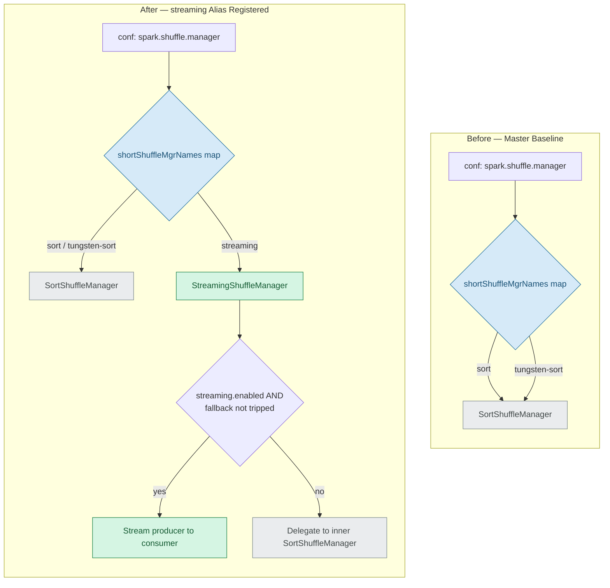
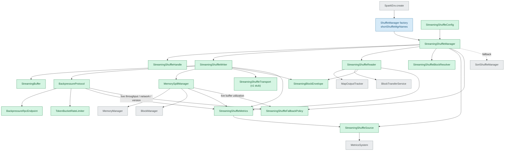
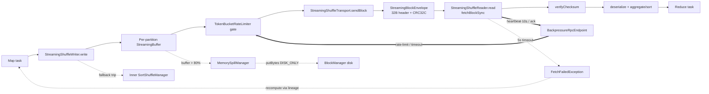

# Architecture

This page explains how the **streaming shuffle** backend plugs into Spark's `ShuffleManager` abstraction, how its components interact, and how a shuffle block flows from a producer (map-side) executor to a consumer (reduce-side) executor under backpressure, disk spill, and automatic fallback. Three Mermaid diagrams describe the design: **Diagram 1 — Shuffle Manager Selection: Before vs. After (Factory Modification)** shows the single factory change that makes the backend selectable; **Diagram 2 — Streaming Shuffle Component Interaction** shows the new classes and the existing Spark Core services they consume; and **Diagram 3 — Producer-to-Consumer Streaming Data Flow with Backpressure, Spill, and Fallback** traces one shuffle block end to end. Throughout, the streaming backend **coexists with and falls back to** the existing sort-based shuffle (`SortShuffleManager`), so the default behavior of every existing Spark deployment is unchanged.

## Diagram 1 — Shuffle Manager Selection: Before vs. After (Factory Modification)

**Diagram 1 — Shuffle Manager Selection: Before vs. After (Factory Modification)** shows that registering the `"streaming"` alias in the `ShuffleManager` factory's `shortShuffleMgrNames` map is the only API-surface change required for backend selection. `SparkEnv` continues to reflectively instantiate whichever manager the `spark.shuffle.manager` configuration names, so no scheduler, DAG, executor-lifecycle, or user-facing API is touched. When `"streaming"` is selected, the new `StreamingShuffleManager` either streams producer→consumer or delegates to its inner `SortShuffleManager`, while `sort` and `tungsten-sort` continue to resolve to `SortShuffleManager` exactly as before.

**Legend:** green = new streaming class (CREATE); blue = modified existing file (MODIFY); gray = referenced/unchanged component.

## Diagram 2 — Streaming Shuffle Component Interaction

**Diagram 2 — Streaming Shuffle Component Interaction** shows how `StreamingShuffleManager` constructs the streaming handle, writer, reader, block resolver, metrics source, and fallback policy, and how those collaborators in turn consume existing Spark Core services. The map-side `StreamingShuffleWriter` drives the `StreamingBuffer`, `BackpressureProtocol`, `MemorySpillManager`, the v1 `StreamingShuffleTransport`, and the `StreamingBlockEnvelope`, while the reduce-side `StreamingShuffleReader` consumes the unchanged `MapOutputTracker` and `BlockTransferService`. Telemetry from the writer, reader, backpressure, and spill paths flows into `StreamingShuffleMetrics`, which `StreamingShuffleSource` publishes to the existing `MetricsSystem`. The `BackpressureProtocol` and `MemorySpillManager` loops additionally feed **live measurements** — producer/consumer throughput, network utilization, peer protocol version, and buffer utilization — into `StreamingShuffleFallbackPolicy`, which is what lets the four revert conditions trip from genuine runtime state rather than remaining a structural-only capability. In this diagram, **solid arrows denote construction/usage** and the single **dashed arrow denotes fallback delegation** from `StreamingShuffleManager` to the inner `SortShuffleManager`.

**Legend:** green = new streaming class (CREATE); blue = modified existing file (MODIFY); gray = referenced/unchanged Spark Core component; solid arrow = construction/usage; dashed arrow = fallback delegation.

## Diagram 3 — Producer-to-Consumer Streaming Data Flow with Backpressure, Spill, and Fallback

**Diagram 3 — Producer-to-Consumer Streaming Data Flow with Backpressure, Spill, and Fallback** traces a single shuffle block from a map task through `StreamingShuffleWriter.write`, a per-partition `StreamingBuffer`, and the `TokenBucketRateLimiter` gate, onto the wire as a `StreamingBlockEnvelope` (a 32-byte header plus CRC32C), and into `StreamingShuffleReader.read`, where the checksum is verified before deserialization and aggregation/sort feed the reduce task. The control path runs the other way: the reader's 10 s heartbeats and acks reach the `BackpressureRpcEndpoint`, which applies rate-limit and timeout decisions back at the producer's rate limiter. When a partition buffer exceeds 80% it is spilled to disk through the `BlockManager`; on a 5 s connection timeout the reader raises a `FetchFailedException` that drives recompute via lineage; and a fallback trip routes the writer to the inner `SortShuffleManager`.

**Legend:** solid arrows = data path; thick arrows (`==>`) = backpressure/control; dotted arrows (`-.->`) = spill, failure, or fallback.

## Coexistence with sort-based shuffle

The streaming backend is additive and isolated; it never replaces the sort-based path.

- **Factory alias.** The `ShuffleManager` factory alias `"streaming"` resolves to `org.apache.spark.shuffle.streaming.StreamingShuffleManager`, while `sort` and `tungsten-sort` still resolve to `org.apache.spark.shuffle.sort.SortShuffleManager`. `SparkEnv` instantiates the configured manager reflectively, so there are no scheduler, DAG, executor-lifecycle, or user-facing API changes.
- **Lazy inner fallback.** `StreamingShuffleManager` holds a **lazy inner `SortShuffleManager`** and **delegates** to it whenever streaming is disabled or any fallback condition trips. The sort path is **composed unchanged** and is **never bypassed** under fallback, which is what provides the zero-regression guarantee.
- **Dual-flag activation.** Streaming engages only when **both** `spark.shuffle.manager=streaming` **and** `spark.shuffle.streaming.enabled=true`; both default off, so the default behavior of every existing deployment is byte-for-byte unchanged. See [Configuration](configuration.md) for the full key reference.

## Fallback conditions

`StreamingShuffleFallbackPolicy` evaluates four revert-to-sort conditions, each **fed from live runtime measurements** so the policy reflects genuine execution state rather than a static default. `StreamingShuffleManager` reads the policy's `shouldFallback` decision at `registerShuffle`; when **any** condition has tripped, it registers a sort handle and routes **both** the writer and the reader for that shuffle to its inner `SortShuffleManager`:

1. **Slow consumer** — consumer sustained **2× slower** than the producer for **> 60 s**. *Fed by the `BackpressureProtocol` 1 s scan, which records live producer/consumer throughput into the policy.*
2. **Memory pressure** prevents buffer allocation / OOM risk (**> 95%** utilization). *Fed by the `MemorySpillManager` 100 ms poll, which updates live buffer utilization into the policy.*
3. **Network saturation > 90%** of link capacity. *Fed by the same `BackpressureProtocol` scan, which derives utilization from live throughput against the configured bandwidth cap.*
4. **Producer/consumer version mismatch**. *Fed by `BackpressureProtocol.recordPeerProtocolVersion`, driven by the additive `PeerVersion` backpressure RPC message.*

Because the backend is **pinned per shuffle at registration**, a fallback condition that trips mid-application affects only shuffles registered *afterward*; a shuffle already registered streaming keeps a consistent streaming write/read path end to end (and likewise for sort), which is what eliminates the format-mismatch hazard of mixing sort and streaming bytes for one shuffle. The cross-executor *emission* of `PeerVersion` is deferred to the v2 transport (see the [decision log](decision-log.md)); the **detection** path is fully wired and unit-tested in v1.

## Operational invariants

The streaming backend honors the following protocol and operational invariants:

| Invariant | Value |
|-----------|-------|
| Block checksum | **CRC32C** (per block) |
| Block size | **2 MB** |
| Connection timeout | **5 s** |
| Heartbeat interval | **10 s** |
| Retry backoff | **exponential**, 1 s start, **max 5 attempts** |
| Rate limiting | **token-bucket** (1 permit = 1 byte) |
| Spill / reclaim SLA | **~100 ms** |

Telemetry overhead is kept below **1% of executor CPU** and streaming log volume below **10 MB/hour/executor**; both are detailed in [Observability](observability.md).

## See also

- [Configuration](configuration.md) — the five `spark.shuffle.streaming.*` keys and the `spark.shuffle.manager=streaming` activation alias.
- [Observability](observability.md) — the four `shuffle.streaming.*` metrics, structured logging, and the dashboard template.
- Back to the streaming shuffle [overview](index.md).
