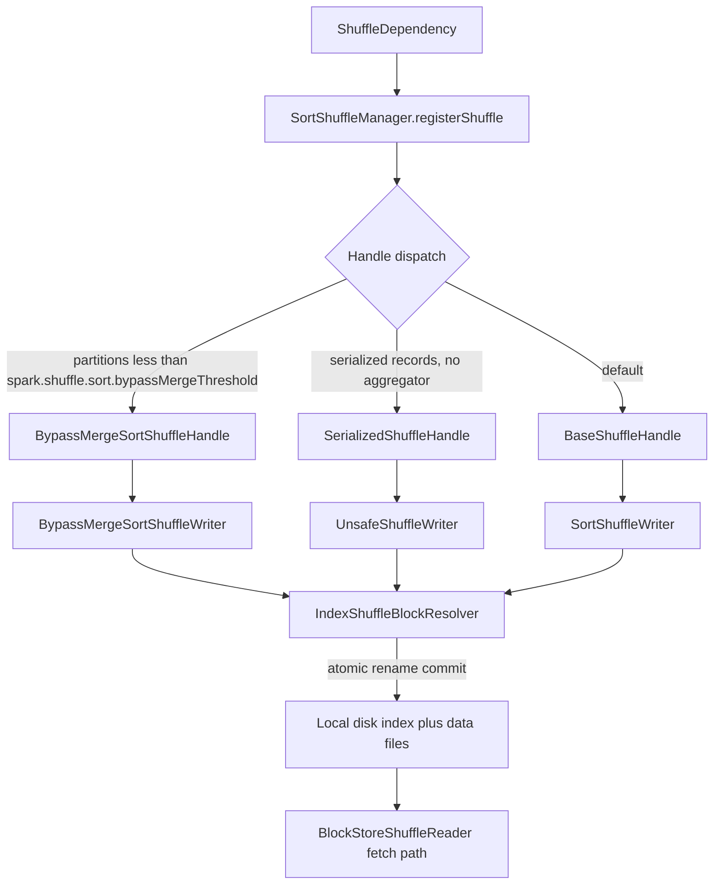
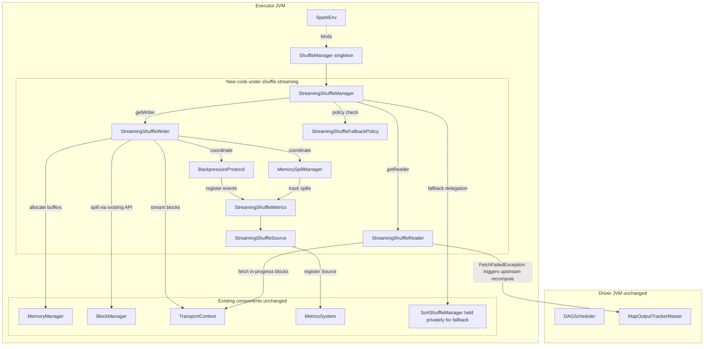
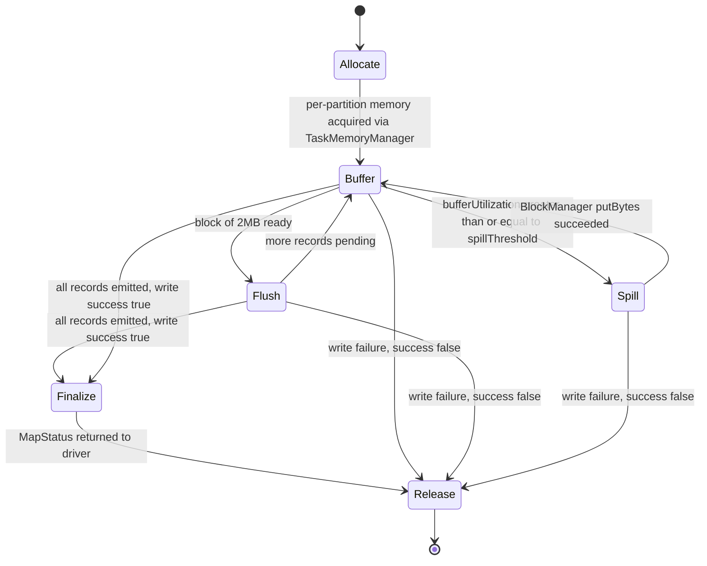
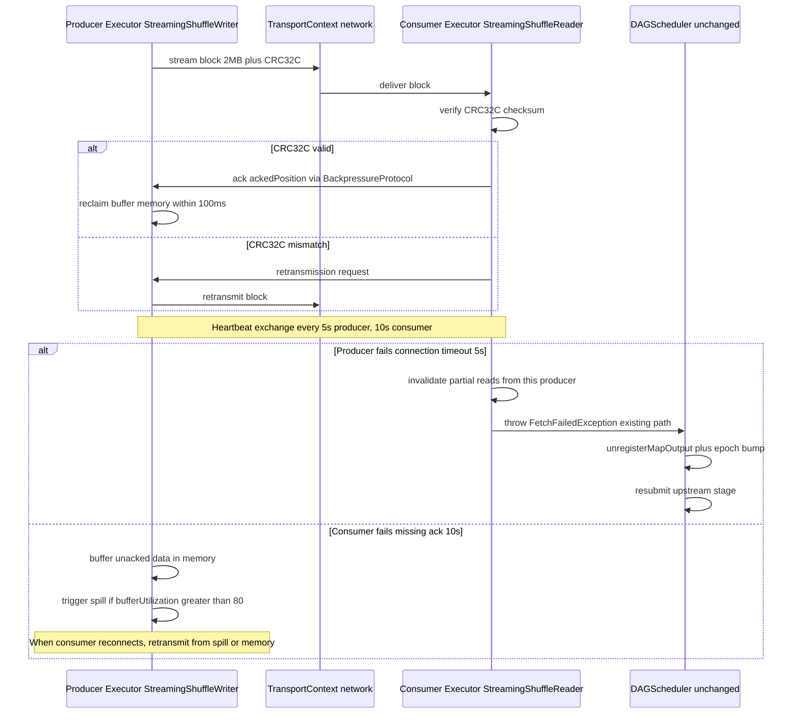

<!--
Licensed to the Apache Software Foundation (ASF) under one or more
contributor license agreements.  See the NOTICE file distributed with
this work for additional information regarding copyright ownership.
The ASF licenses this file to You under the Apache License, Version 2.0
(the "License"); you may not use this file except in compliance with
the License.  You may obtain a copy of the License at

   http://www.apache.org/licenses/LICENSE-2.0

Unless required by applicable law or agreed to in writing, software
distributed under the License is distributed on an "AS IS" BASIS,
WITHOUT WARRANTIES OR CONDITIONS OF ANY KIND, either express or implied.
See the License for the specific language governing permissions and
limitations under the License.
-->

# Streaming Shuffle Architecture

Streaming shuffle is implemented as an opt-in `ShuffleManager` named `StreamingShuffleManager` that coexists with the production-stable `SortShuffleManager`. This page documents the component interactions, write-path state machine, read-path sequence, and the existing sort-shuffle path (shown for contrast). The four diagrams together establish the complete architectural picture: the BEFORE state (existing sort path), the AFTER state (new streaming path), the writer lifecycle, and the producer-consumer protocol exchange.

All diagrams use Mermaid 11.4.0 syntax — the version pinned in `executive-summary.html` and configured by the `mermaid2` MkDocs plugin in `mkdocs.yml`. The four diagrams below are titled, referenced by name in accompanying prose, and include both the existing-state (sort-shuffle) and target-state (streaming-shuffle) views per the project's Visual Architecture Documentation rule (AAP §0.7.5). Node labels use square brackets and avoid parentheses to ensure clean parsing across renderers; edge labels use the `|...|` syntax for inline annotation.

## Diagram 1: Existing Sort Shuffle Path (Reference, Unchanged)

The diagram below — *Existing Sort Shuffle Path (Reference, Unchanged)* — shows the production-stable sort-shuffle dispatch unchanged. `SortShuffleManager` examines the `ShuffleDependency` characteristics and selects one of three handles: `BypassMergeSortShuffleHandle`, `SerializedShuffleHandle`, or `BaseShuffleHandle`. Each handle drives a corresponding writer that produces output through `IndexShuffleBlockResolver` for atomic-rename commit. This BEFORE state is preserved verbatim; streaming shuffle adds a parallel path without altering this dispatch. Source: tech-spec §5.2.11.2.

*Legend:* The diamond `{Handle dispatch}` represents the three-way decision inside `SortShuffleManager.registerShuffle`. Edge labels on the dispatch arrows describe the predicate that selects each handle. The terminal node `BlockStoreShuffleReader fetch path` is the consumer-side counterpart that reads via the existing `OneForOneBlockFetcher` plus External Shuffle Service when enabled. None of the boxes shown in this diagram are modified by the streaming-shuffle feature.

## Diagram 2: Component-Interaction Diagram (Streaming Shuffle Path)

The diagram below — *Component-Interaction Diagram (Streaming Shuffle Path)* — shows the new components introduced by this feature inside the dashed `StreamingPath` subgraph and their interaction with existing executor components (kept unchanged). All arrows crossing into existing components use already-public APIs, satisfying the AAP §0.7.1 directive "Isolate streaming logic in dedicated classes with zero cross-contamination into existing shuffle code paths." This is the AFTER state; together with Diagram 1, it satisfies the project rule "both before and after states MUST be shown." Source: AAP §0.4.2.

*Legend:* The `StreamingPath` subgraph contains all eight new classes added by this feature; every arrow leaving `StreamingPath` targets a public method on an existing component, never an internal field. The dotted `binds` arrow from `SparkEnv` to `ShuffleManager singleton` denotes the volatile lazy-initialization at line 76 of `SparkEnv.scala`. The `Existing` subgraph holds the `SortShuffleManager` instance privately referenced by `StreamingShuffleManager` for fallback delegation — the `SortShuffleManager` source itself is not edited. The `FetchFailedException` arrow from `StreamingShuffleReader` to `MapOutputTrackerMaster` rides the existing `DAGScheduler.handleTaskCompletion` path; no new RPC or recovery semantics are introduced.

## Diagram 3: Write-Path State Diagram

The diagram below — *Write-Path State Diagram* — captures the lifecycle of `StreamingShuffleWriter`. The writer transitions through `Allocate` → `Buffer` → `Flush` → optionally `Spill` → `Finalize` → `Release`. Transition guards are shown as the text following each `:` separator. The `bufferUtilization greater than or equal to spillThreshold` guard reflects the user's specification of an 80% default spill trigger (configurable 50–95% via `spark.shuffle.streaming.spillThreshold`). The block-ready guard reflects the user-specified 2 MB block size for pipelining efficiency.

*Legend:* The `[*]` symbol denotes the start and end pseudo-states (Mermaid stateDiagram-v2 convention). The three `Release` transitions on `write failure` represent the `stop(success = false)` invocation path triggered by task abort, executor shutdown, or unrecoverable error inside `write(records)`. In every case, `Release` performs unconditional buffer reclamation through `TaskMemoryManager.releaseExecutionMemory(long size, MemoryConsumer consumer)` (or, equivalently, `MemoryConsumer.freeMemory(long size)` from the consumer side) before exiting, ensuring zero retained heap per the AAP §0.7.2.2 memory-leak prevention requirement.

## Diagram 4: Read-Path Sequence Diagram

The diagram below — *Read-Path Sequence Diagram* — shows producer-consumer streaming with backpressure heartbeats. The 5-second producer-failure timeout drives `FetchFailedException` propagation to the DAG scheduler for upstream recomputation. The 10-second consumer-failure timeout triggers buffer retention on the producer side. CRC32C verification occurs on every block receive, with retransmission requested on mismatch. The two `alt` blocks correspond to AAP §0.4.3.1 (producer failure) and §0.4.3.2 (consumer failure) failure-handling flows.

*Legend:* Solid arrows denote synchronous network frames or local in-process method calls. The first `alt` block enumerates the two outcomes of CRC32C verification on each block receive. The second `alt` block enumerates the two failure modes detected by `BackpressureProtocol` heartbeat timers — producer connection timeout (5 seconds) and consumer acknowledgment timeout (10 seconds). The producer-failure branch reuses the existing `FetchFailedException` recovery path inside `DAGScheduler.handleTaskCompletion`; no new recovery RPC is introduced. The consumer-failure branch defers data via in-memory buffer plus optional disk spill, retransmitting on consumer reconnect.

## Diagram Coverage Matrix

The four diagrams above collectively satisfy the AAP §0.7.5 minimum required set:

| AAP §0.7.5 Required Diagram | Provided By |
|---|---|
| Component-interaction diagram showing the streaming-path subgraph | Diagram 2 |
| Data-flow diagram for producer to consumer streaming | Diagram 4 (success-path branch) |
| Failure-handling sequence diagram for producer failure | Diagram 4 (producer-fails branch) |
| Failure-handling sequence diagram for consumer failure | Diagram 4 (consumer-fails branch) |
| Both before-state and after-state shown together | Diagram 1 (BEFORE) and Diagram 2 (AFTER) |
| Writer lifecycle state machine | Diagram 3 |

Every diagram has a descriptive title, a referencing prose paragraph that names it, and a legend explaining symbology. Together with the [Coexistence at the `ShuffleManager` SPI](index.md#component-interaction-at-a-glance) diagram on the overview page, the streaming-shuffle feature ships a complete visual architecture specification.

## See Also

- [Feature overview](index.md) — Introduction, quick-start activation, and what's new.
- [Configuration reference](configuration.md) — All five `spark.shuffle.streaming.*` keys with defaults, ranges, and descriptions.
- [Decision log](decision-log.md) — Eight non-trivial implementation decisions plus the bidirectional traceability matrix mapping each user-prompt requirement to source files.
- [Observability](observability.md) — Metrics table, MDC schema, dashboard layout, four-metric runbook, and local-verification commands.
- [Executive summary slide deck](executive-summary.html) — 16-slide reveal.js executive presentation for non-technical audiences.
