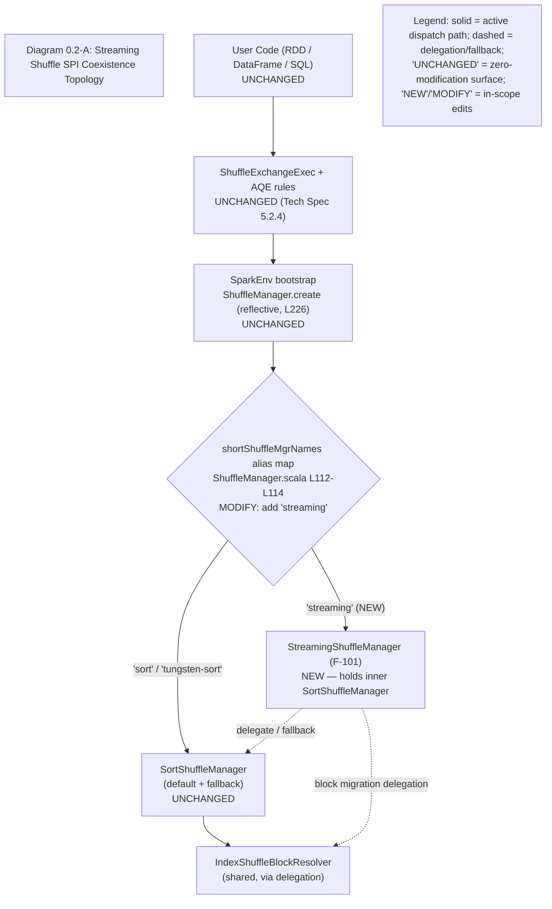
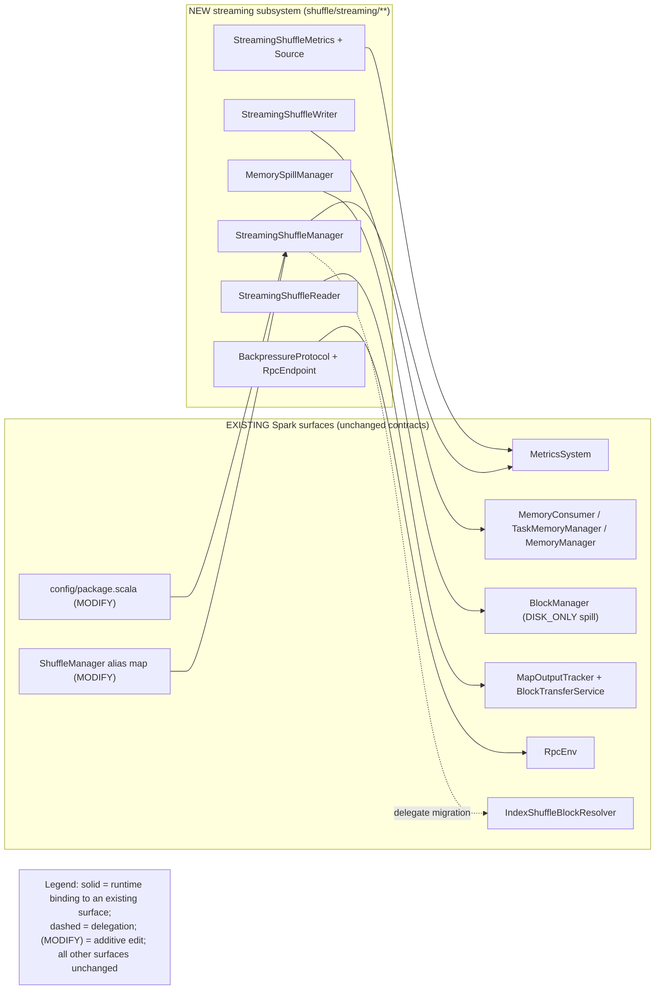
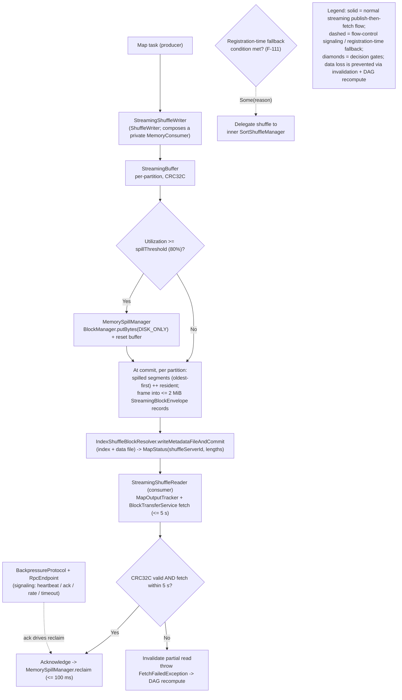

# Streaming Shuffle Architecture

The streaming shuffle subsystem is an opt-in, pluggable `ShuffleManager` SPI implementation that streams shuffle data directly from producer (map) tasks to consumer (reduce) tasks through bounded in-memory buffers governed by a backpressure protocol, eliminating the write-to-disk-then-fetch materialization barrier that characterizes the default sort-based shuffle. It coexists with — and never replaces — the default `SortShuffleManager`: it is selected only under the dual-flag activation contract (`spark.shuffle.manager=streaming` **and** `spark.shuffle.streaming.enabled=true`), holds an inner `SortShuffleManager` by composition, and degrades gracefully back to that sort-based path whenever a fallback condition is met. The configuration surface is documented in [configuration.md](configuration.md).

This page is the component and protocol overview for the subsystem. It mirrors the three canonical architecture diagrams — each titled, legended, and referenced by name — then enumerates the sixteen production classes and the protocols and timing that bind them together.

## SPI coexistence topology

**Diagram 0.2-A — Streaming Shuffle SPI Coexistence Topology** shows how the new manager plugs into the unchanged dispatch boundary and coexists with the sort path. The user-facing API, `ShuffleExchangeExec` and the Adaptive Query Execution (AQE) rules, the `SparkEnv` bootstrap, and the reflective `ShuffleManager.create` factory are all unchanged; only the `shortShuffleMgrNames` alias map gains the `"streaming"` short name.

The solid edges are the active dispatch path: `"sort"` / `"tungsten-sort"` resolve to the unchanged `SortShuffleManager`, while the new `"streaming"` alias resolves to `StreamingShuffleManager`. The dashed edges show that the streaming manager delegates to — and falls back to — the inner `SortShuffleManager`, and delegates block-migration calls to the shared `IndexShuffleBlockResolver`.

## Integration touchpoints

**Diagram 0.4-A — Streaming Shuffle Integration Touchpoints** maps the new components (left) to the existing Spark surfaces they bind to (right). Every touchpoint reuses an existing contract; only the alias map and the configuration registry are edited (both additive), and every other surface is bound at runtime without modification.

`StreamingShuffleManager` reads the alias map and the configuration registry and registers its metrics `Source` with the `MetricsSystem`; the writer binds to `MemoryConsumer` / `TaskMemoryManager`; the spill manager spills through `BlockManager` with `DISK_ONLY`; the reader uses `MapOutputTracker` and `BlockTransferService`; and the backpressure endpoint registers with `RpcEnv`. None of these surfaces is modified — the alias map and `config/package.scala` carry the only (additive) edits.

## Producer-to-consumer data flow

**Diagram 0.5-A — Streaming Shuffle Producer-to-Consumer Data Flow** shows the runtime data flow including the spill, publication, and fallback branches. A map task writes records into per-partition in-memory buffers; at or above the spill threshold the spill manager offloads the largest buffers to disk (`DISK_ONLY`) and resets them to release heap. At task commit the writer assembles each partition's bytes (spilled segments oldest-first, followed by the resident buffer), frames them into ≤ 2 MiB `StreamingBlockEnvelope` records, and publishes them to a single shuffle data file through `IndexShuffleBlockResolver.writeMetadataFileAndCommit`. Because the v1 network transport is a logging-only stub (see [decision-log.md](decision-log.md)), the consumer does not receive a live socket stream; instead the reader fetches the published blocks through `MapOutputTracker` and `BlockTransferService`, exactly as the sort path does, and decodes the envelopes frame-by-frame. The backpressure protocol runs alongside this path as a flow-control signaling channel, and consumer acknowledgments drive buffer reclamation.

The load-bearing guarantee is **zero data loss**: a CRC32C check failure first triggers a bounded re-fetch of the affected block (exponential backoff, within the 5 s producer deadline); only a *persistent* checksum mismatch, a structural decode error, or an exceeded 5 s producer timeout causes the reader to invalidate the partial read and throw `FetchFailedException`, so the existing DAG scheduler recomputes the lost map output — no scheduler change is required. Fallback is evaluated when the shuffle is registered: if `StreamingShuffleManager.registerShuffle` detects a fallback condition (memory pressure, consumer lag, network saturation, or a producer/consumer version mismatch), it returns a sort handle so that shuffle uses the inner `SortShuffleManager` end-to-end rather than the streaming path.

## Components

The streaming subsystem comprises sixteen production classes (F-101–F-116) plus the package documentation and metrics template (F-118), all under `core/src/main/scala/org/apache/spark/shuffle/streaming/` (the wire and transport classes live in the `network/` subpackage).

| Feature | Class | Responsibility |
|---------|-------|----------------|
| F-101 | `StreamingShuffleManager` | SPI entry point; dispatch and lifecycle. Composes an inner `SortShuffleManager` for delegation/fallback; registers `StreamingShuffleSource` with the `MetricsSystem` when `SparkEnv.get != null`; performs an ordered `stop()` (Backpressure → Spill → inner Sort → clear ids). |
| F-102 | `StreamingShuffleHandle` | A `BaseShuffleHandle` subtype carrying `bufferSizePercent` / `spillThreshold` / `maxBandwidthMBps`; the dispatch discriminator on which `getWriter` / `getReader` pattern-match to route the streaming versus the delegated path. |
| F-103 | `StreamingShuffleWriter` | Implements `ShuffleWriter[K, V]` and composes a private `MemoryConsumer` for execution-memory accounting; per-partition buffer sizing (`perPartitionBudget = executorMemory × bufferSizePercent / 100 / numPartitions`, 2 MB block size); spills at the configured threshold; generates CRC32C checksums; at commit, frames each partition into `StreamingBlockEnvelope` records and publishes them via `IndexShuffleBlockResolver` so the output is fetchable through the standard map-output path. |
| F-104 | `StreamingShuffleReader` | Mirrors `BlockStoreShuffleReader.read` (honors the aggregator, key ordering, and map-side combine); fetches published shuffle blocks through `MapOutputTracker` and `BlockTransferService` with a bounded await; decodes `StreamingBlockEnvelope` frames with bounded allocation and validates a CRC32C per block, re-fetching a corrupt block (bounded retransmission) within the producer deadline; on a persistent CRC32C mismatch, a structural decode error, or a 5 s producer timeout it invalidates partial reads and throws `FetchFailedException` so the existing DAG scheduler recomputes (no scheduler change). |
| F-105 | `StreamingShuffleBlockResolver` | Maintains a 3-level block index; implements `MigratableResolver` by delegating to the existing `IndexShuffleBlockResolver` to preserve block migration/decommission. |
| F-106 | `StreamingBuffer` | Per-partition buffer built on a `ByteArrayOutputStream` with CRC32C, LRU eviction, and atomic counters. |
| F-107 | `BackpressureProtocol` | Token-bucket plus 5 s heartbeat flow control; lock-free `AtomicLong` token accounting; per-stream monotonic acknowledgment merge keyed by `(shuffleId, partitionId, attemptId, executorId)`; a 10 s consumer-liveness / missing-ack detector. |
| F-108 | `BackpressureRpcEndpoint` | A `ThreadSafeRpcEndpoint` named `streaming-shuffle-backpressure`, executor-only (refuses to register on the driver); carries heartbeat / ack / rate / timeout messages. |
| F-109 | `MemorySpillManager` | Polls buffer utilization every 100 ms; spills the largest partitions (LRU) to disk via `BlockManager.putBytes(..., DISK_ONLY)` at the 80% threshold; reclaims buffers within 100 ms of acknowledgment; tracks metrics. |
| F-110 | `network/TokenBucketRateLimiter` | A Guava `RateLimiter` wrapper (1 permit = 1 byte) capped at 80% of link capacity. |
| F-111 | `StreamingShuffleFallbackPolicy` | Encapsulates the four fallback conditions enumerated below. |
| F-112 | `StreamingShuffleMetrics` | The four metrics emitted under the `shuffle.streaming.` namespace. |
| F-113 | `StreamingShuffleSource` | Implements `org.apache.spark.metrics.source.Source`, registered under the source name `streamingShuffle`. |
| F-114 | `StreamingShuffleConfig` | Typed configuration accessors; `validate()` range checking; effective-bandwidth (80%-factor) computation. |
| F-115 | `network/StreamingShuffleTransport` | The v1 logging-only transport stub; reuses the executor's existing `BlockTransferService` and introduces no new `TransportContext`. This is an intentional, documented v1 stub — see [decision-log.md](decision-log.md). |
| F-116 | `network/StreamingBlockEnvelope` | Self-describing wire envelope: a 32-byte big-endian header + a payload of ≤ 2 MiB + CRC32C verification. |
| F-118 | `package.scala` + `metrics.properties.template` | Package Scaladoc plus the metrics template at `core/src/main/resources/org/apache/spark/shuffle/streaming/metrics.properties.template`. |

Two architectural guarantees are load-bearing across these classes. **Coexistence:** `StreamingShuffleManager` (F-101) never displaces the sort path — it composes an inner `SortShuffleManager` that serves as both delegate and fallback, and both share the same `IndexShuffleBlockResolver` for block migration. **Zero data loss:** a *transient* CRC32C mismatch is first repaired in-band by a bounded re-fetch within the producer deadline; any failure that cannot be repaired that way — an exceeded 5 s producer timeout, a *persistent* checksum mismatch, a structural decode error, or a consumer crash — invalidates the partial read cleanly and defers to Spark's existing recomputation machinery (`FetchFailedException` → DAG recompute).

## Protocols & Timing

### Backpressure protocol

The backpressure protocol (F-107) provides consumer-to-producer flow control using a token bucket combined with a 5-second heartbeat. Token accounting is lock-free via `AtomicLong`, and acknowledgments are merged monotonically **per stream** — keyed by `(shuffleId, partitionId, attemptId, executorId)` — so that an out-of-order, duplicate, or out-of-scope ack can never regress another stream's reclamation watermark. A separate 10-second consumer-liveness / missing-ack detector identifies a stalled consumer. The protocol runs over the executor-only `BackpressureRpcEndpoint` (F-108) — a `ThreadSafeRpcEndpoint` registered under the name `streaming-shuffle-backpressure` that refuses to register on the driver — carrying heartbeat, acknowledgment, rate, and timeout messages; the endpoint validates message identity (ids, sequence numbers, executor/attempt identity) and bounds and sanitizes free-text reason fields before routing each ack to its corresponding per-stream state. The bucket is capped at 80% of link capacity by `TokenBucketRateLimiter` (F-110), where one permit equals one byte.

### Memory and spill loop

`MemorySpillManager` (F-109) polls buffer utilization every 100 ms. When utilization reaches the 80% `spillThreshold`, it spills the largest partitions (LRU) to disk through the existing `BlockManager.putBytes(..., DISK_ONLY)` API — reusing the storage contract rather than altering it — and resets the spilled buffer so its heap is released immediately; the spilled bytes are tracked in a per-partition ordered ledger and folded back (oldest-first) into the published output at commit. Writer-created buffers are registered with the manager, and a consumer acknowledgment routed from the reader triggers reclamation within 100 ms; on `stop()` any still-registered buffers are reset before the registry is cleared. Spill and reclaim events feed the metrics surface described in [observability.md](observability.md).

### Wire envelope

On-the-wire blocks use `StreamingBlockEnvelope` (F-116): a self-describing frame of a 32-byte big-endian header followed by a payload of at most 2 MiB, protected by a CRC32C checksum that the reader verifies before accepting a block.

### Network transport (v1 stub)

`StreamingShuffleTransport` (F-115) ships in v1 as a logging-only stub. It reuses the executor's existing `BlockTransferService` and introduces no new `TransportContext`. This is an intentional, documented v1 deviation, recorded in [decision-log.md](decision-log.md); the full Netty data-plane transport is deferred beyond v1.

### Fallback conditions

`StreamingShuffleFallbackPolicy` (F-111) triggers automatic reversion to the sort-based shuffle under any of the following conditions:

1. Consumer sustained 2× slower than producer for > 60 s.
2. Memory pressure prevents buffer allocation (OOM risk).
3. Network saturation > 90% link capacity.
4. Producer/consumer version mismatch.

### Timing semantics

The subsystem uses four distinct, non-overlapping timers:

| Timer | Value | Role |
|-------|-------|------|
| Producer connection timeout | 5 s | Producer-failure detection → partial-read invalidation |
| Backpressure heartbeat | 5 s | Flow-control liveness signal |
| Consumer liveness / missing-ack | 10 s | Consumer-failure detection |
| Retry backoff | start 1 s, max 5 attempts (exponential) | Transient transport retry |

### Zero-modification boundary

The subsystem is strictly additive at the SPI boundary. `ShuffleExchangeExec`, all AQE rules, the `DAGScheduler`, the `SparkEnv` reflective factory (`ShuffleManager.create`), and `SortShuffleManager` itself are **unchanged**. Only two existing production files are edited, both additively: the `shortShuffleMgrNames` alias map in `ShuffleManager.scala` (adding the `"streaming"` short name) and the configuration registry in `internal/config/package.scala` (adding the `spark.shuffle.streaming.*` entries). All streaming logic is isolated in the `shuffle/streaming/` package.

## See also

- [configuration.md](configuration.md) — the five `spark.shuffle.streaming.*` keys and the dual-flag activation contract.
- [observability.md](observability.md) — metrics, MDC correlation fields, and dashboards.
- [decision-log.md](decision-log.md) — architecture decisions (including the v1 transport stub) and the requirement-to-source-to-test traceability matrix.
