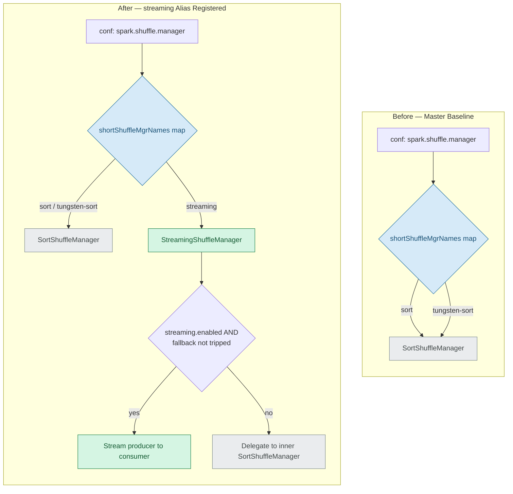
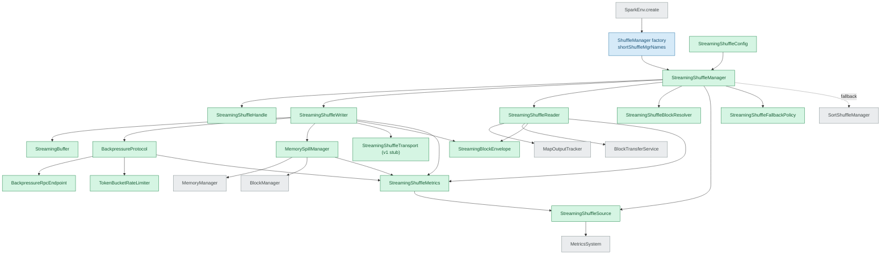
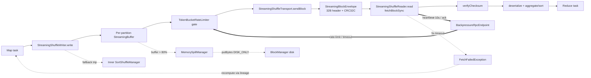

# Architecture

This page explains how the streaming shuffle backend plugs into Spark's `ShuffleManager` abstraction, how its components interact, and how a single shuffle block flows from a producer (map-side) executor to a consumer (reduce-side) executor under backpressure, spill, and fallback control. Three Mermaid diagrams tell the story: **Diagram 1 — Shuffle Manager Selection: Before vs. After (Factory Modification)** shows the single factory change that selects the backend; **Diagram 2 — Streaming Shuffle Component Interaction** shows the new classes and the existing Spark Core services they consume; and **Diagram 3 — Producer-to-Consumer Streaming Data Flow with Backpressure, Spill, and Fallback** traces a block end to end. Throughout, the streaming backend **coexists with and automatically falls back to** the sort-based shuffle, so the default behavior of every existing Spark deployment is unchanged.

## Diagram 1 — Shuffle Manager Selection: Before vs. After (Factory Modification)

**Diagram 1** shows that backend selection changes in exactly one place: registering the `"streaming"` alias in the `ShuffleManager` factory's `shortShuffleMgrNames` map. This alias registration is the only API-surface change required to select the backend — `sort` and `tungsten-sort` continue to resolve to `SortShuffleManager`, while `streaming` resolves to `StreamingShuffleManager`. `SparkEnv` then reflectively instantiates whichever manager the configuration names, so no scheduler, DAG, or executor-lifecycle code is touched.

**Legend:** green = new streaming class (CREATE); blue = modified existing file (MODIFY); gray = referenced/unchanged component.

## Diagram 2 — Streaming Shuffle Component Interaction

**Diagram 2** shows the new `org.apache.spark.shuffle.streaming` classes (green) and the existing Spark Core services they consume (gray), entered through the modified `ShuffleManager` factory (blue). `StreamingShuffleManager` constructs the handle, writer, reader, block resolver, metrics source, and fallback policy; the writer drives the per-partition buffer, backpressure protocol, spill manager, transport, and block envelope, while the reader consumes the unchanged `MapOutputTracker` and `BlockTransferService`. In this diagram, **solid arrows denote construction or usage** and the **dashed arrow denotes fallback delegation** from `StreamingShuffleManager` to the inner `SortShuffleManager`.

**Legend:** green = new streaming class (CREATE); blue = modified existing file (MODIFY); gray = referenced/unchanged Spark Core component; solid arrow = construction/usage; dashed arrow = fallback delegation.

## Diagram 3 — Producer-to-Consumer Streaming Data Flow with Backpressure, Spill, and Fallback

**Diagram 3** traces a single shuffle block from a map task through `StreamingShuffleWriter` into a per-partition `StreamingBuffer`, past the token-bucket rate gate and transport, across the wire as a CRC32C-checked `StreamingBlockEnvelope`, and into `StreamingShuffleReader`, where it is verified, deserialized, aggregated/sorted, and handed to the reduce task. The control path shows the reader heartbeating the `BackpressureRpcEndpoint`, which feeds rate-limit and timeout decisions back to the producer's rate gate; the spill path shows the buffer overflowing to disk via `MemorySpillManager` once it exceeds 80% utilization; and the failure path shows a 5 s connection timeout raising `FetchFailedException` so lineage recompute can recover the lost output. The fallback path shows the writer reverting to the inner `SortShuffleManager` when a fallback condition trips.

**Legend:** solid arrows = data path; thick arrows (`==>`) = backpressure/control; dotted arrows (`-.->`) = spill, failure, or fallback.

## Coexistence with sort-based shuffle

The streaming backend is designed to live alongside the existing sort-based shuffle without disturbing it:

- **Factory alias.** The `ShuffleManager` factory alias `"streaming"` resolves to `org.apache.spark.shuffle.streaming.StreamingShuffleManager`, while `sort` and `tungsten-sort` continue to resolve to `SortShuffleManager`. `SparkEnv` instantiates the configured manager reflectively, so there are no changes to the scheduler, the DAG, executor-lifecycle management, or any user-facing RDD/DataFrame/Dataset API.
- **Lazy inner fallback.** `StreamingShuffleManager` holds a **lazy inner `SortShuffleManager`** and **delegates** to it whenever streaming is disabled or any fallback condition trips. The sort path is **composed unchanged** and is **never bypassed** under fallback, which is what guarantees zero regression for workloads that are not a good fit for streaming.
- **Dual-flag activation.** Streaming engages only when **both** `spark.shuffle.manager=streaming` **and** `spark.shuffle.streaming.enabled=true`. Both flags default to off, so the default cluster behavior is byte-for-byte unchanged. See [Configuration](configuration.md) for the full set of keys and their ranges.

## Fallback conditions

When the streaming path is active, `StreamingShuffleFallbackPolicy` continuously evaluates four revert-to-sort conditions. If **any** of them trips, the manager delegates the shuffle to the inner `SortShuffleManager`:

1. Consumer sustained **2× slower** than producer for **> 60 s**.
2. **Memory pressure** prevents buffer allocation / OOM risk (**> 95%**).
3. **Network saturation > 90%** link capacity.
4. **Producer/consumer version mismatch**.

## Operational invariants

The streaming backend holds the following protocol and operational invariants:

| Invariant | Value |
| --- | --- |
| Block-level checksum | CRC32C |
| Block size | 2 MB |
| Connection timeout | 5 s |
| Heartbeat interval | 10 s |
| Retry policy | Exponential backoff, 1 s start, max 5 attempts |
| Rate limiting | Token-bucket |
| Spill / reclaim SLA | ~100 ms |

Telemetry overhead is kept below 1% of executor CPU and log volume below 10 MB/hour/executor; these observability budgets are detailed in [Observability](observability.md).

## See also

- [Configuration](configuration.md) — the five `spark.shuffle.streaming.*` keys and the activation alias.
- [Observability](observability.md) — metrics, structured logging, and the dashboard template.
- Back to the streaming shuffle [overview](index.md).
