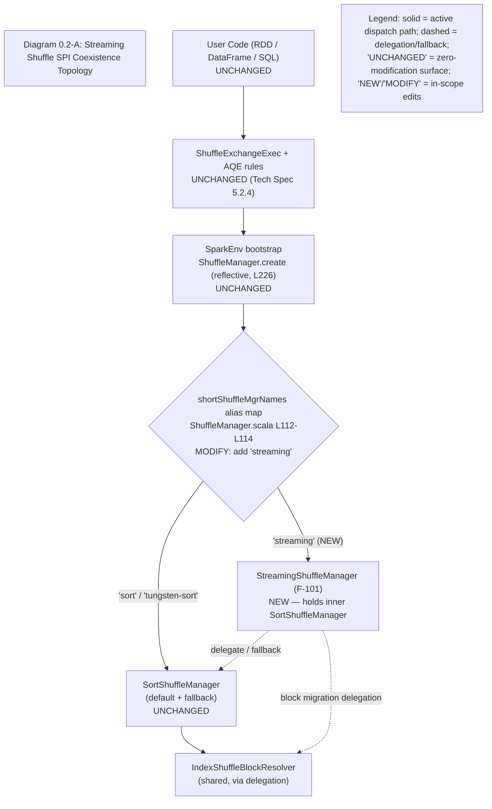

# Streaming Shuffle for Apache Spark

Streaming shuffle is an **opt-in**, pluggable `ShuffleManager` that streams shuffle data directly from producer (map) tasks to consumer (reduce) tasks through bounded in-memory buffers governed by a backpressure protocol, eliminating the write-to-disk-then-fetch materialization barrier of the default sort-based shuffle. It is designed to deliver a **30–50% end-to-end latency reduction** for shuffle-heavy workloads (**≥ 100 MB** of shuffle data across **≥ 10 partitions**) and a **5–10% improvement** for CPU-bound workloads, while guaranteeing **zero regression** for memory-bound workloads through automatic graceful degradation back to the sort-based path.

The subsystem is built around two load-bearing invariants. **Zero data loss** holds under all failure scenarios: a *transient* checksum mismatch is first repaired in-band by a bounded re-fetch within the producer deadline, and any failure that cannot be repaired that way — a producer timeout, a *persistent* checksum mismatch, a structural decode error, or a consumer crash — invalidates the partial read cleanly and defers to Spark's existing recomputation machinery (`FetchFailedException` → DAG recompute). **Memory-exhaustion prevention** is enforced by an **80% buffer-utilization spill threshold** that offloads the largest partitions to disk with a **sub-100 ms** response and reclaims buffers within 100 ms of consumer acknowledgment.

## Activation

Streaming shuffle engages **only under a dual-flag activation contract** — both of the following must be set:

- `spark.shuffle.manager=streaming`
- `spark.shuffle.streaming.enabled=true`

If either flag is absent, the default `SortShuffleManager` handles all shuffle exactly as before. The default of `spark.shuffle.manager` remains **`sort`** and is **unchanged** by this feature, so existing applications observe no behavioral difference unless they explicitly opt in. See [configuration.md](configuration.md) for the full configuration surface — the five `spark.shuffle.streaming.*` keys plus the manager selector.

## SPI coexistence topology

**Diagram 0.2-A — Streaming Shuffle SPI Coexistence Topology** shows how the new manager plugs into the unchanged dispatch boundary and coexists with the sort path. The user-facing API, `ShuffleExchangeExec` and the AQE rules, the `SparkEnv` bootstrap, and the reflective `ShuffleManager.create` factory are all unchanged; only the `shortShuffleMgrNames` alias map gains the `"streaming"` short name, and the new `StreamingShuffleManager` holds an inner `SortShuffleManager` for delegation and fallback.

The solid edges are the active dispatch path: `"sort"` / `"tungsten-sort"` resolve to the unchanged `SortShuffleManager`, while the new `"streaming"` alias resolves to `StreamingShuffleManager`. The dashed edges show that the streaming manager delegates to — and falls back to — the inner `SortShuffleManager`, and delegates block-migration calls to the shared `IndexShuffleBlockResolver`. The full component and protocol overview, including the integration-touchpoint and data-flow diagrams, lives in [architecture.md](architecture.md).

## Failure Scenarios (Zero Data Loss)

The following **ten** failure-injection scenarios — listed in the exact order they appear as tests in `StreamingShuffleFailureInjectionSuite` (F-121) — are the user-facing proof of the zero-data-loss guarantee. Each resolves either by repairing a transient fault in-band (bounded re-fetch), by invalidating the partial read and deferring to the DAG scheduler's existing recomputation, or by degrading gracefully to the sort-based path; no scenario loses or corrupts shuffle data.

| # | Failure scenario (the matching `StreamingShuffleFailureInjectionSuite` test) | Expected behavior (zero data loss) |
|---|-------------------------------------------------------------------------------|------------------------------------|
| 1 | **Producer connection timeout (> 5 s) invalidates and throws `FetchFailedException`** | The deadline-bounded fetch expires with no response; the reader invalidates the partial read, increments `partialReadInvalidations`, and throws `FetchFailedException` so the DAG scheduler recomputes. |
| 2 | **CRC32C checksum mismatch invalidates and throws `FetchFailedException`** | A corrupt block is first re-fetched (bounded retransmission within the producer deadline); a *persistent* mismatch then invalidates the read and throws `FetchFailedException` → recompute. |
| 3 | **Consumer crash mid-read surfaces as `FetchFailedException`** | The failure surfaces as `FetchFailedException` — never a silent or truncated partial result — and the stage recomputes. |
| 4 | **Partial-read invalidation does not return any records** | An invalidated read yields zero records (no partial or torn output) before `FetchFailedException` propagates. |
| 5 | **RPC ack / heartbeat loss does not corrupt the ack watermark** | A dropped or stale acknowledgment leaves the per-stream ack watermark monotonic; flow-control state is never corrupted. |
| 6 | **Spill-under-pressure preserves data (spilled blocks still readable)** | Blocks spilled to disk remain readable and the reassembled partition is byte-for-byte complete; `spillCount` increments. |
| 7 | **Producer/consumer version mismatch triggers fallback** | `StreamingShuffleFallbackPolicy.VersionMismatch` triggers registration-time fallback to `SortShuffleManager`. |
| 8 | **Network saturation > 90% triggers fallback** | `StreamingShuffleFallbackPolicy.NetworkSaturation` triggers registration-time fallback to sort. |
| 9 | **Memory pressure (cannot allocate buffer) triggers fallback** | `StreamingShuffleFallbackPolicy.MemoryPressure` triggers registration-time fallback to sort — no OOM, no data loss. |
| 10 | **End-to-end: an injected fetch failure is recoverable via recomputation** | A real active-streaming job with a deterministic one-time injected `FetchFailedException` recovers via DAG recomputation to the exact, complete output. |

Scenarios 7–9 are three of the four automatic fallback conditions documented in [decision-log.md](decision-log.md) (the fourth, consumer lag, is covered by `StreamingShuffleFallbackPolicySuite`); scenarios 1–6 and 10 are handled within the streaming data path itself.

## Documentation

In this section:

- [configuration.md](configuration.md) — configuration reference: the five `spark.shuffle.streaming.*` keys (plus the `spark.shuffle.manager` selector) and the dual-flag activation contract.
- [architecture.md](architecture.md) — component and protocol overview, including the three Mermaid architecture diagrams.
- [observability.md](observability.md) — metrics, the MDC correlation schema, JMX/Prometheus exposition, and the dashboard.
- [decision-log.md](decision-log.md) — the architecture decision (ADR) table and the requirement → source → test traceability matrix.
- [executive-summary.html](executive-summary.html) — the reveal.js executive presentation deck.
- [dashboard.json](dashboard.json) — the Grafana dashboard template.
