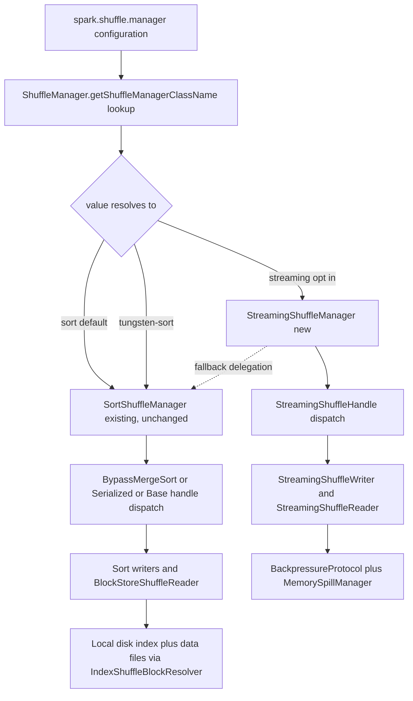

<!--
Licensed to the Apache Software Foundation (ASF) under one or more
contributor license agreements.  See the NOTICE file distributed with
this work for additional information regarding copyright ownership.
The ASF licenses this file to You under the Apache License, Version 2.0
(the "License"); you may not use this file except in compliance with
the License.  You may obtain a copy of the License at

   http://www.apache.org/licenses/LICENSE-2.0

Unless required by applicable law or agreed to in writing, software
distributed under the License is distributed on an "AS IS" BASIS,
WITHOUT WARRANTIES OR CONDITIONS OF ANY KIND, either express or implied.
See the License for the specific language governing permissions and
limitations under the License.
-->

# Streaming Shuffle for Apache Spark

Streaming Shuffle is an opt-in capability that pipelines data directly from map-side producer executors to reduce-side consumer executors with in-memory buffering, backpressure control, and graceful disk-spill fallback. The capability extends — rather than replaces — the baseline sort-based shuffle via Spark's existing pluggable extension point: the `ShuffleManager` trait. The default `spark.shuffle.manager=sort` remains untouched for production safety; users opt in by setting `spark.shuffle.manager=streaming`.

Target outcomes include a **30–50% end-to-end latency reduction** for shuffle-heavy workloads (≥100 MB data, ≥10 partitions) and a **5–10% improvement** for CPU-bound workloads, with **zero regression** for memory-bound workloads via the automatic `StreamingShuffleFallbackPolicy` that delegates to `SortShuffleManager` when consumer slowdown, memory pressure, network saturation, or version mismatch is detected. Failure handling spans 10 enumerated scenarios with zero data loss validated through the failure-injection test suite.

Streaming Shuffle coexists with the production-stable `SortShuffleManager`. The new `StreamingShuffleManager` holds a private `SortShuffleManager` instance for transparent fallback delegation. No RDD/DataFrame/Dataset user-facing API, DAG scheduler, task lifecycle, executor memory model, or `BlockManager` storage interface is modified. All new code lives under the `org.apache.spark.shuffle.streaming` package, satisfying the "zero cross-contamination" directive.

## Component Interaction at a Glance

The diagram below — *Coexistence at the `ShuffleManager` SPI* — shows how the existing `SortShuffleManager` and the new `StreamingShuffleManager` are dispatched by the same `getShuffleManagerClassName` companion-object method based on the `spark.shuffle.manager` configuration. This single-source dispatch is the only modification to existing shuffle code; both paths coexist as parallel options. Per AAP §0.7.5, the BEFORE state (existing) and AFTER state (new) appear together in this diagram.



*Legend:* Solid arrows denote the primary dispatch path for each `spark.shuffle.manager` value. The dotted arrow from `StreamingShuffleManager` to `SortShuffleManager` represents transparent fallback delegation invoked by `StreamingShuffleFallbackPolicy` when one of the four fallback conditions is detected at runtime.

## What's New

Streaming shuffle introduces five new core components, four new metrics, and five new configuration keys — all opt-in.

### New Core Components

- `StreamingShuffleManager` — the opt-in `ShuffleManager` SPI implementation.
- `StreamingShuffleWriter` — pipelined producer-side writer with in-memory buffering and CRC32C integrity.
- `StreamingShuffleReader` — consumer-side reader with partial-block consumption and `FetchFailedException` propagation on producer timeout.
- `BackpressureProtocol` — heartbeat-based flow control, token-bucket rate limiting, priority arbitration.
- `MemorySpillManager` — 100 ms polling spill manager with LRU eviction and `BlockManager.putBytes`-backed persistence.
- `StreamingShuffleFallbackPolicy` — decision class for the four fallback conditions (consumer slow, memory pressure, network saturation, version mismatch).

### New Metrics (under shuffle.streaming.*)

- `shuffle.streaming.bufferUtilizationPercent` — Gauge[Int]
- `shuffle.streaming.spillCount` — Counter
- `shuffle.streaming.backpressureEvents` — Counter
- `shuffle.streaming.partialReadInvalidations` — Counter

### New Configuration Keys

- `spark.shuffle.streaming.enabled` (Boolean, default `false`)
- `spark.shuffle.streaming.bufferSizePercent` (Int 1–50, default `20`)
- `spark.shuffle.streaming.spillThreshold` (Int 50–95, default `80`)
- `spark.shuffle.streaming.maxBandwidthMBps` (Int, default `-1` = unlimited)
- `spark.shuffle.streaming.debug` (Boolean, default `false`, internal)

## Quick-Start Activation

To enable streaming shuffle, set `spark.shuffle.manager=streaming` along with the opt-in flag:

```bash
bin/spark-shell \
  --conf spark.shuffle.manager=streaming \
  --conf spark.shuffle.streaming.enabled=true
```

See [configuration.md](configuration.md) for the full configuration reference. Configuration changes require executor restart; no dynamic reconfiguration in v1.

## Read Next

- [Configuration reference](configuration.md) — All five `spark.shuffle.streaming.*` keys with defaults, ranges, and descriptions.
- [Architecture and Mermaid diagrams](architecture.md) — Component interaction, write-path state, read-path sequence, plus existing-state sort-shuffle reference.
- [Decision log and traceability matrix](decision-log.md) — Eight decision-log entries plus a 22-row bidirectional traceability matrix mapping every user-prompt requirement to its source files.
- [Observability — metrics, MDC, dashboard, runbook](observability.md) — Metrics table, MDC schema, dashboard layout, four-metric runbook with normal/warning/critical thresholds, and local-verification commands.
- [Grafana dashboard JSON template](dashboard.json) — Import-ready Grafana dashboard with four panels (buffer utilization, spill count, backpressure events, partial-read invalidations).
- [Executive summary slide deck](executive-summary.html) — 16-slide reveal.js executive presentation suitable for non-technical audiences.

## What This Feature Does NOT Change

Streaming Shuffle is intentionally narrow in scope. It does NOT modify:

- RDD / DataFrame / Dataset user-facing APIs.
- DAG scheduler or task lifecycle management.
- Executor memory model or unified memory accounting (uses `MemoryManager` as a collaborator only).
- `BlockManager` storage interface contracts.
- `SortShuffleManager`, `BlockStoreShuffleReader`, `IndexShuffleBlockResolver`, or any existing shuffle implementation.
- External Shuffle Service, push-based shuffle, or shuffle-block migration.
- Network transport (`TransportContext`, `TransportClient`, `TransportServer`) — reused as-is.
- Build infrastructure (`pom.xml`, `project/SparkBuild.scala`, CI workflows).

See the [decision log](decision-log.md) for the full bidirectional traceability matrix mapping every user-prompt requirement to its implementing source file(s).
