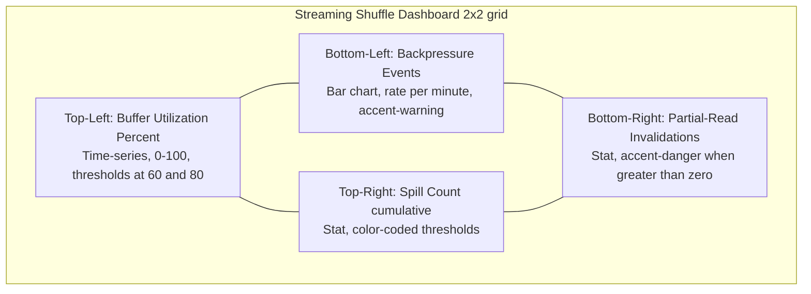

<!--
Licensed to the Apache Software Foundation (ASF) under one or more
contributor license agreements.  See the NOTICE file distributed with
this work for additional information regarding copyright ownership.
The ASF licenses this file to You under the Apache License, Version 2.0
(the "License"); you may not use this file except in compliance with
the License.  You may obtain a copy of the License at

   http://www.apache.org/licenses/LICENSE-2.0

Unless required by applicable law or agreed to in writing, software
distributed under the License is distributed on an "AS IS" BASIS,
WITHOUT WARRANTIES OR CONDITIONS OF ANY KIND, either express or implied.
See the License for the specific language governing permissions and
limitations under the License.
-->

# Streaming Shuffle Observability

Streaming shuffle is observable through four Dropwizard metrics registered into the existing Spark `MetricsSystem`, structured logging via the existing `Logging` trait with MDC correlation IDs, and a Grafana dashboard template (`dashboard.json` in this folder). All metrics propagate automatically to the JMX, CSV, Slf4j, and Graphite/Prometheus sinks already configured in Spark, satisfying the AAP requirement that "JMX metrics MUST be exposed for external monitoring integration."

## Metrics

The four metrics below are registered through the `StreamingShuffleSource` class (extending `org.apache.spark.metrics.source.Source`) under the `streamingShuffle` source name. They appear automatically in the Spark Web UI's Executors tab, in JMX MBeans, and in any sink configured via `spark.metrics.conf`.

### JMX ObjectName composition

Spark's `MetricsSystem.buildRegistryName` (see `core/src/main/scala/org/apache/spark/metrics/MetricsSystem.scala`) composes the fully-qualified registry name as `<application>.<executor-id>.<source-name>`, where `<source-name>` is `streamingShuffle` for streaming-shuffle metrics. The metric key returned by `StreamingShuffleMetrics.getMetrics()` itself begins with the AAP-mandated `shuffle.streaming.` namespace prefix (verbatim, embedded in the metric key — see the Scaladoc on `core/src/main/scala/org/apache/spark/shuffle/streaming/StreamingShuffleMetrics.scala`). Combined, the final JMX ObjectName exposed by Dropwizard's `JmxReporter` (used by Spark's `JmxSink`) is:

```
metrics:name=<application>.<executor-id>.streamingShuffle.shuffle.streaming.<metric-name>,type=<gauges|counters>
```

The `<application>` and `<executor-id>` fragments are bound to `spark.app.id` and `spark.executor.id` at runtime; on the driver, the source is registered against the driver instance and `<executor-id>` resolves to `driver`. The `,type=<gauges|counters>` qualifier is appended automatically by Dropwizard's `JmxReporter` based on the metric's Java type — `Gauge` instances use `type=gauges` and `Counter` instances use `type=counters`.

### Metric reference

| Metric Name | Type | JMX ObjectName Pattern | Description |
|-------------|------|------------------------|-------------|
| `shuffle.streaming.bufferUtilizationPercent` | `Gauge[Int]` | `metrics:name=<application>.<executor-id>.streamingShuffle.shuffle.streaming.bufferUtilizationPercent,type=gauges` | Current streaming buffer utilization 0–100, sampled by `MemorySpillManager` at 100 ms intervals. |
| `shuffle.streaming.spillCount` | `Counter` | `metrics:name=<application>.<executor-id>.streamingShuffle.shuffle.streaming.spillCount,type=counters` | Cumulative count of spill events triggered by `MemorySpillManager` when buffer utilization meets or exceeds `spark.shuffle.streaming.spillThreshold`. |
| `shuffle.streaming.backpressureEvents` | `Counter` | `metrics:name=<application>.<executor-id>.streamingShuffle.shuffle.streaming.backpressureEvents,type=counters` | Cumulative count of backpressure events emitted by `BackpressureProtocol` (rate-limit triggered, heartbeat missed, priority arbitrated). |
| `shuffle.streaming.partialReadInvalidations` | `Counter` | `metrics:name=<application>.<executor-id>.streamingShuffle.shuffle.streaming.partialReadInvalidations,type=counters` | Cumulative count of producer-failure detection events from `StreamingShuffleReader` triggering partial-read invalidation and `FetchFailedException` propagation. |

When matching MBeans through tooling that supports wildcards (e.g., `jmxterm`, `jconsole` "search by name", JMX Exporter `pattern` rules), the simpler wildcard form `metrics:name=*.shuffle.streaming.<metric-name>,type=<gauges|counters>` selects every executor's instance of the named metric without enumerating `<application>` or `<executor-id>`.

All four metrics are populated lock-free or through amortized lock acquisition to honor the AAP §0.7.2.5 "Telemetry overhead MUST be < 1% of executor CPU utilization" budget. Histogram updates are batched to minimize hot-path overhead.

## Log MDC Schema

All log statements emitted from `StreamingShuffleWriter`, `StreamingShuffleReader`, `BackpressureProtocol`, and `MemorySpillManager` include the following MDC (Mapped Diagnostic Context) fields, leveraging the existing `org.apache.spark.internal.Logging` trait and the SLF4J 2.0.17 + Log4j 2.25.3 stack. Operators can configure `log4j2.properties` to include these fields in the layout pattern (e.g., `%X{shuffle_id}`).

| Field Name | Type | Description |
|------------|------|-------------|
| `shuffle_id` | Int | Global shuffle ID assigned by the driver at `ShuffleDependency` registration time. |
| `map_id` | Long | Task attempt ID of the map task producing this shuffle output. |
| `reduce_partition_range` | String | Reducer partition range covered by this writer, e.g., `"0-9"` for reducers 0 through 9. |
| `attempt_id` | Long | Current task attempt ID; correlates retries across the same shuffle. |

### Example log layout

```properties
# Example layout including streaming shuffle MDC fields
appender.rolling.layout.pattern = %d{yy/MM/dd HH:mm:ss} %p %c{1}: shuffle=%X{shuffle_id} map=%X{map_id} range=%X{reduce_partition_range} attempt=%X{attempt_id} %m%n
```

## Dashboard Template

A complete Grafana dashboard JSON is provided in `dashboard.json` (sibling file in this folder). The dashboard arranges four panels in a 2x2 grid as illustrated below.



*Legend:* Each lettered node corresponds to a single Grafana panel in the 2x2 grid. The undirected edges (`---`) denote spatial adjacency on the dashboard canvas — top row `A`/`B`, bottom row `C`/`D`, left column `A`/`C`, right column `B`/`D`. Node labels avoid parentheses to ensure clean Mermaid 11.4.0 parsing across renderers.

Import the dashboard via Grafana's *Dashboards → Import* flow with the `dashboard.json` file. Configure a Prometheus datasource referencing the Spark executor metrics scrape endpoint (see *Dashboard Prerequisites* below for the supported scrape topologies).

### Dashboard Panel Query Reference

The dashboard's four panel expressions match the Spark `PrometheusServlet` metric naming convention exactly. The mapping below reconciles the AAP-mandated metric key (left) with the exported Prometheus time-series name (right) so an operator can verify each panel manually before importing the dashboard.

| Metric Key | Prometheus Time-Series | Panel Expression |
|------------|------------------------|------------------|
| `shuffle.streaming.bufferUtilizationPercent` | `metrics_<app>_<exec>_streamingShuffle_shuffle_streaming_bufferUtilizationPercent_Value{type="gauges"}` | `metrics_.+_streamingShuffle_shuffle_streaming_bufferUtilizationPercent_Value{type="gauges"}` |
| `shuffle.streaming.spillCount` | `metrics_<app>_<exec>_streamingShuffle_shuffle_streaming_spillCount_Count{type="counters"}` | `sum(metrics_.+_streamingShuffle_shuffle_streaming_spillCount_Count{type="counters"})` |
| `shuffle.streaming.backpressureEvents` | `metrics_<app>_<exec>_streamingShuffle_shuffle_streaming_backpressureEvents_Count{type="counters"}` | `sum(rate(metrics_.+_streamingShuffle_shuffle_streaming_backpressureEvents_Count{type="counters"}[1m])) * 60` |
| `shuffle.streaming.partialReadInvalidations` | `metrics_<app>_<exec>_streamingShuffle_shuffle_streaming_partialReadInvalidations_Count{type="counters"}` | `sum(metrics_.+_streamingShuffle_shuffle_streaming_partialReadInvalidations_Count{type="counters"})` |

The `<app>` and `<exec>` fragments are replaced at runtime with the Spark application ID and executor ID respectively. Spark's `PrometheusServlet.normalizeKey` (see `core/src/main/scala/org/apache/spark/metrics/sink/PrometheusServlet.scala`) replaces every non-alphanumeric character (including the dots in `shuffle.streaming.<metric-name>`) with an underscore, then prepends `metrics_` and appends an underscore. Gauges add the `_Number` and `_Value` suffixes (with identical values per `PrometheusServlet` lines 71–72); counters add the `_Count` suffix.

### Dashboard Prerequisites

The dashboard is configured for two supported scrape topologies. Operators **must** select one before importing the dashboard.

#### Topology A: Direct scrape of Spark's `PrometheusServlet`

This is the simplest setup. Spark exposes a Prometheus-formatted endpoint at `/metrics/prometheus` on the driver UI (port 4040 by default) and on each executor's metrics port. Configure a Prometheus job with a single static target per Spark application or use Spark's discovery mechanisms (e.g., labels emitted by the Kubernetes/YARN cluster manager).

Configuration sample (`prometheus.yml` excerpt):

```yaml
scrape_configs:
  - job_name: 'spark-streaming-shuffle'
    metrics_path: '/metrics/prometheus'
    static_configs:
      - targets: ['driver-host:4040']
```

In this topology, the executor identifier is encoded directly into the metric NAME (the `<exec>` fragment of `metrics_<app>_<exec>_streamingShuffle_...`). The dashboard panel expressions use the regex wildcard `.+` across the application and executor segments to aggregate every executor's instance of each metric. Per-executor breakdown is achievable by editing each panel's `expr` to substitute a specific executor ID for the second `.+`, for example: `metrics_.+_42_streamingShuffle_shuffle_streaming_bufferUtilizationPercent_Value{type="gauges"}` for executor 42.

#### Topology B: JMX Exporter with relabeling

Operators who prefer Prometheus labels (rather than encoding the executor ID in the metric name) should deploy the [JMX Exporter](https://github.com/prometheus/jmx_exporter) as a Java agent on each Spark process and configure pattern rules that extract `app_id`, `executor`, and the metric name into separate label and name components.

Sample `jmx_exporter_config.yaml` excerpt for streaming shuffle:

```yaml
rules:
  - pattern: 'metrics<>(\\S+)_(\\S+)_streamingShuffle_shuffle_streaming_(\\S+)_(Value|Count)<>(\\S+)'
    name: 'spark_streaming_shuffle_$3'
    labels:
      app_id: '$1'
      executor: '$2'
      metric_kind: '$4'
      type: '$5'
```

After applying this relabeling, panels can use cleaner expressions such as `spark_streaming_shuffle_bufferUtilizationPercent{metric_kind="Value"}` with a per-executor `executor` label that supports a Grafana `executor` template variable. To use this topology with the included dashboard, replace each panel's `expr` with the corresponding short-form query and add the `executor` template variable back:

```json
{
  "name": "executor",
  "type": "query",
  "datasource": "${DS_PROMETHEUS}",
  "query": "label_values(spark_streaming_shuffle_bufferUtilizationPercent, executor)",
  "multi": true,
  "includeAll": true
}
```

Operators using only the upstream `JmxSink` (without the JMX Exporter) and external JMX-to-Prometheus bridges other than `PrometheusServlet` should consult their bridge's documentation for the exact name-and-label transformation.

## Runbook

For each of the four metrics, the following table documents the normal operating range, warning threshold, critical threshold, and incident-response guidance. Thresholds are engineering judgment derived from the AAP requirements (80% spill threshold, 5-second producer timeout, 10-second consumer timeout) and may be tuned per workload characteristics.

### `shuffle.streaming.bufferUtilizationPercent`

| Threshold | Value | Action |
|-----------|-------|--------|
| Normal | 0–60% steady state | None — healthy operation. |
| Warning | >80% sustained for 60s | Investigate consumer slowdown; check `partialReadInvalidations` for producer failures; consider increasing `spark.shuffle.streaming.bufferSizePercent`. |
| Critical | >95% sustained for 30s | Memory pressure imminent; spill should be active; verify `spillCount` is incrementing. If not, the `MemorySpillManager` may be unhealthy — check executor logs filtered on MDC `shuffle_id`. |

### `shuffle.streaming.spillCount`

| Threshold | Value | Action |
|-----------|-------|--------|
| Normal | <1 spill per shuffle | Healthy. |
| Warning | 1–10 spills per shuffle | Buffer is undersized for workload; consider raising `spark.shuffle.streaming.bufferSizePercent` toward its 50% upper bound. |
| Critical | >10 spills per shuffle | Workload is memory-bound; the `StreamingShuffleFallbackPolicy` should automatically delegate to `SortShuffleManager`. Verify fallback is occurring; if not, review fallback-policy configuration. |

### `shuffle.streaming.backpressureEvents`

| Threshold | Value | Action |
|-----------|-------|--------|
| Normal | <1 event per minute | Healthy steady state. |
| Warning | 1–10 events per minute | Network or consumer slowdown; inspect `bufferUtilizationPercent` correlation. |
| Critical | >10 events per minute | Producer is significantly faster than consumer; consider raising `spark.shuffle.streaming.maxBandwidthMBps` or investigating consumer-side bottleneck. |

### `shuffle.streaming.partialReadInvalidations`

| Threshold | Value | Action |
|-----------|-------|--------|
| Normal | 0 | No producer failures. |
| Warning | 1–5 cumulative | Sporadic producer failures; confirm DAG-scheduler upstream recomputation completed successfully. |
| Critical | >5 cumulative | Sustained producer instability; check executor health, network partition status, and consider rolling restart of unhealthy executors. |

## Local Verification

Per AAP §0.7.4, all observability surfaces MUST be exercisable from a local executor. The commands below validate metric registration, log MDC propagation, and dashboard data availability without a full cluster.

### Activate streaming shuffle locally

```bash
bin/spark-shell \
  --conf spark.shuffle.manager=streaming \
  --conf spark.shuffle.streaming.enabled=true \
  --conf "spark.metrics.conf.*.sink.jmx.class=org.apache.spark.metrics.sink.JmxSink"
```

### Inspect JMX MBeans

From a separate shell, attach `jconsole` (bundled with the JDK) to the Spark driver process, navigate to the *MBeans* tab, and expand the `metrics` domain. The four streaming-shuffle metrics appear under `streamingShuffle.*`. Alternatively, use `jmxterm`:

```bash
java -jar jmxterm-1.0.4-uber.jar
$> open localhost:JMX_PORT
$> domain metrics
$> beans -d metrics
```

### Run a sample shuffle

```scala
// In spark-shell after activation:
val data = spark.range(0, 1000000).repartition(10)
data.groupBy($"id" % 100).count().show()
// While running, watch JMX for streamingShuffle.* values changing.
```

### Verify log MDC fields

Configure `log4j2.properties` (in `conf/log4j2.properties`) to include the MDC pattern shown in the *Log MDC Schema* section above. After running a sample shuffle, `grep` for `shuffle=` in driver/executor logs to confirm the `shuffle_id`, `map_id`, `reduce_partition_range`, and `attempt_id` fields appear on every streaming-related log line.

## See Also

- [Feature overview](index.md)
- [Configuration reference](configuration.md)
- [Architecture diagrams](architecture.md)
- [Decision log and traceability matrix](decision-log.md)
- [Grafana dashboard JSON](dashboard.json)
- [Executive summary slide deck](executive-summary.html)
