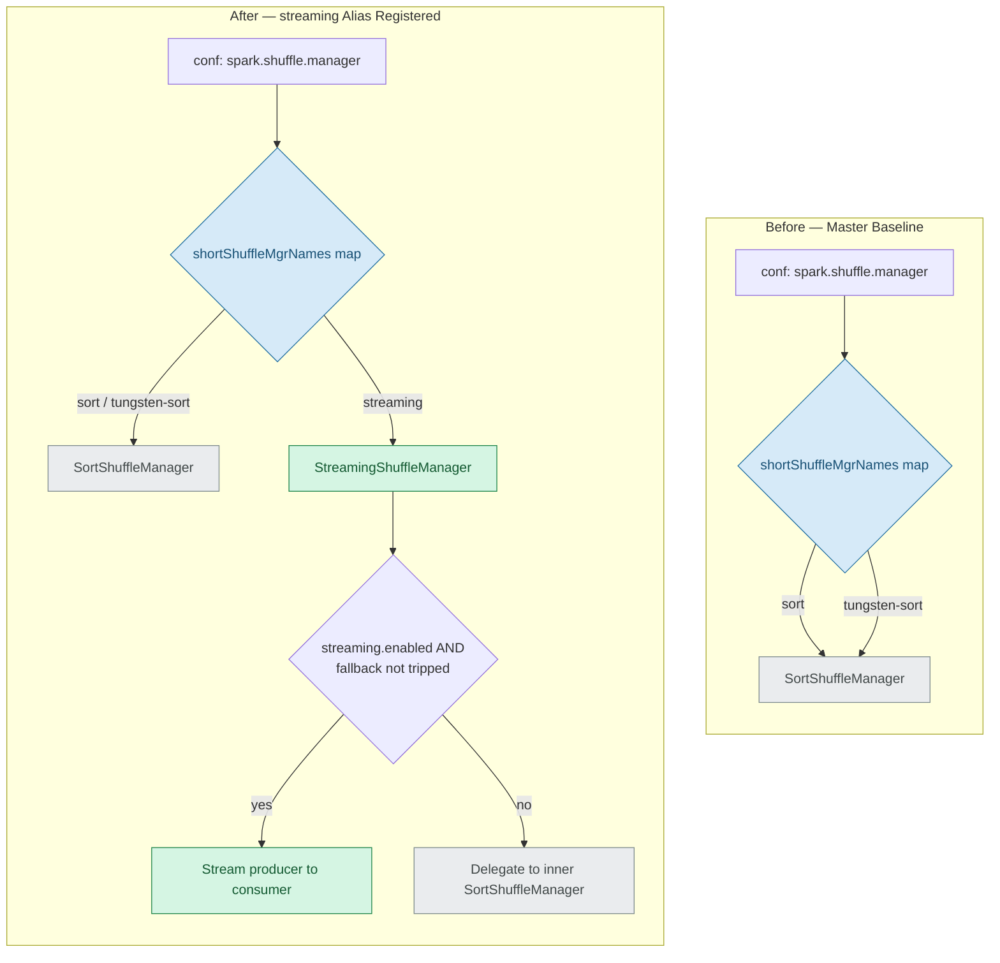
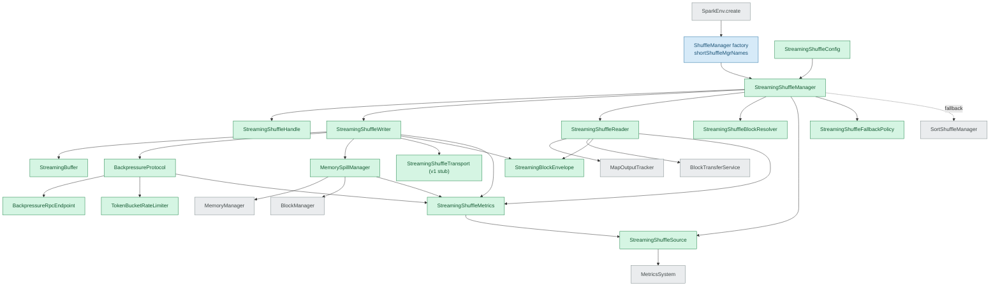
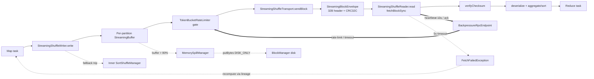

# Technical Specification

# 0. Agent Action Plan

## 0.1 Intent Clarification

This Agent Action Plan governs the addition of a **Streaming Shuffle** backend to Apache Spark Core (`blitzy-spark` fork, `spark-core_2.13` under `spark-parent_2.13:4.2.0-SNAPSHOT`). The plan is the authoritative interpretation layer between the user's intent and the concrete implementation, mapping every requirement to specific files and integration points within the existing `org.apache.spark.shuffle` subsystem. The feature is delivered as a self-contained, opt-in shuffle implementation that coexists with — and gracefully falls back to — the existing `SortShuffleManager` [core/src/main/scala/org/apache/spark/shuffle/sort/SortShuffleManager.scala].

### 0.1.1 Core Feature Objective

Based on the prompt, the Blitzy platform understands that the new feature requirement is to **introduce an opt-in streaming shuffle capability that eliminates shuffle-materialization latency by streaming intermediate data directly from producer (map-side) executors to consumer (reduce-side) executors through in-memory buffers and the existing network transport, governed by a backpressure protocol, while preserving the existing sort-based shuffle as an automatic fallback.**

The following feature requirements are restated with technical precision:

- **Opt-in activation** — The streaming backend is engaged only when an operator explicitly enables it. Activation requires two configuration signals: selecting the manager alias `spark.shuffle.manager=streaming` and setting the feature flag `spark.shuffle.streaming.enabled=true`. Both default to off, so the default cluster behavior is byte-for-byte unchanged.
- **Producer-to-consumer streaming** — Map-side output is buffered in memory and pipelined to reduce-side consumers via the existing `org.apache.spark.network` transport layer rather than being fully materialized to local disk before any fetch begins.
- **Memory buffering with bounded footprint** — Per-partition buffers are limited to a configurable percentage of executor memory (default 20%, range 1–50%), computed as `(executorMemory * bufferSizePercent / 100) / numPartitions` with a 2 MB floor.
- **Backpressure flow control** — A consumer-to-producer heartbeat and token-bucket rate-limiting protocol throttles producers so consumers are not overwhelmed, with per-executor bandwidth caps and priority arbitration across concurrent shuffles.
- **Graceful disk spill** — When buffer utilization reaches the spill threshold (default 80%, range 50–95%), the largest buffered partitions are spilled to disk via the existing `BlockManager`, reclaiming memory within a 100 ms SLA.
- **Partial-read invalidation on failure** — On producer failure (connection timeout), the reader atomically invalidates partial reads and surfaces a `FetchFailedException` so Spark's existing lineage/recompute machinery recovers the lost output.
- **Zero-regression guarantee via fallback** — Memory-bound or otherwise unsuitable workloads automatically revert to the sort-based path; the existing `SortShuffleManager` is composed unchanged and never bypassed when fallback conditions trip.

The prompt specifies the following measurable success criteria, restated verbatim in intent:

- 30–50% end-to-end latency reduction for shuffle-heavy workloads (≥ 100 MB data, ≥ 10 partitions).
- 5–10% improvement for CPU-bound workloads via reduced scheduler overhead.
- Zero regression for memory-bound workloads (through automatic fallback).
- Zero data loss under all failure scenarios.
- Memory-exhaustion prevention via an 80% threshold spill trigger with < 100 ms response time.

**Implicit requirements and prerequisites surfaced.** The feature description names five core components, but the `ShuffleManager` service-provider contract and the user's cross-cutting rules imply a larger, non-optional set of collaborators and integration obligations that are necessary for a working, observable backend:

- The `ShuffleManager` trait is abstract over `registerShuffle`, `getWriter`, two `getReader` overloads, `unregisterShuffle`, `shuffleBlockResolver`, and `stop()` [core/src/main/scala/org/apache/spark/shuffle/ShuffleManager.scala:L38-L99]. Satisfying it implies a concrete shuffle **handle** (extending `BaseShuffleHandle` [core/src/main/scala/org/apache/spark/shuffle/BaseShuffleHandle.scala]) and a concrete **block resolver** (extending `ShuffleBlockResolver` [core/src/main/scala/org/apache/spark/shuffle/ShuffleBlockResolver.scala]) — not just the manager/writer/reader trio.
- Configuration **registration** is implicit: the five `spark.shuffle.streaming.*` keys must be declared as `ConfigEntry` values, and a `"streaming"` alias must be wired into the manager factory's name map.
- Metrics **integration** is implicit: emitting `shuffle.streaming.*` telemetry requires a `org.apache.spark.metrics.source.Source` implementation registered with the executor `MetricsSystem`.
- Backpressure heartbeating implies an executor-scoped RPC endpoint on the existing `RpcEnv`.
- Automatic fallback implies an explicit decision/policy object and a lazily-instantiated inner `SortShuffleManager`.
- The user's rules mandate additional deliverables that are prerequisites for "done": structured logging with correlation IDs, a metrics dashboard template, a decision log, Mermaid architecture diagrams, a reveal.js executive presentation, and a `CODE_REVIEW.md` review artifact.

### 0.1.2 Special Instructions and Constraints

The prompt imposes a strict containment discipline that this plan treats as binding. These directives are preserved exactly as the user expressed them.

**Modification scope (ONLY these components may change):**

- The `org.apache.spark.shuffle.ShuffleManager` interface implementation.
- A `ShuffleWriter` streaming variant.
- A `ShuffleReader` with in-progress block-request support.
- The memory-management subsystem for buffer allocation and spill logic.
- The network transfer layer for streaming-protocol integration.
- The executor metrics telemetry for streaming-shuffle monitoring.

**Absolute preservation (ZERO modifications permitted):**

- RDD/DataFrame/Dataset user-facing APIs.
- The DAG scheduler and task-scheduling algorithms.
- Executor lifecycle management.
- The lineage-tracking and fault-recovery model.
- The existing `SortShuffleManager` implementation (it coexists as the fallback).
- Deployment infrastructure and external dependencies.
- Block manager storage interface contracts.
- Task serialization/deserialization protocols.

**Architectural directives (implementation discipline):** changes are confined to within the `ShuffleManager` abstraction boundary; streaming logic is isolated in dedicated classes with zero cross-contamination of existing code; the approach must choose the path of least modification to the executor memory model and network transport; and integration points must be documented with comments explaining coexistence with the sort-based path.

**User Example (configuration interface, preserved exactly as provided):**

- `spark.shuffle.streaming.enabled` (Boolean, default false, opt-in)
- `spark.shuffle.streaming.bufferSizePercent` (Integer 1-50, default 20, percent of executor memory)
- `spark.shuffle.streaming.spillThreshold` (Integer 50-95, default 80, percent buffer utilization)
- `spark.shuffle.streaming.maxBandwidthMBps` (Integer, default unlimited, per-executor rate limit)
- `spark.shuffle.streaming.debug` (Boolean, default false)

**User Example (fallback conditions for automatic revert to sort-based shuffle, preserved exactly):**

- Consumer sustained 2x slower than producer for > 60s.
- Memory pressure prevents buffer allocation (OOM risk).
- Network saturation > 90% link capacity.
- Producer/consumer version mismatch.

**User Example (failure-handling protocol, preserved exactly):**

- Producer failure flow: `StreamingShuffleReader` detects connection timeout (5s) → invalidates all partial reads from failed producer → notifies DAG scheduler to recompute upstream tasks → discards buffered data → retries read from recomputed producer.
- Consumer failure flow: `StreamingShuffleWriter` detects missing acks (10s) → buffers unacked data in memory → triggers disk spill if buffer > 80% → resumes streaming when consumer reconnects → retransmits unacked blocks from spill or memory.

**Operational and protocol invariants (must hold in the implementation):** CRC32C block-level checksums; 2 MB block size; 5 s connection timeout; 10 s heartbeat interval; retry with exponential backoff starting at 1 s, maximum 5 attempts; token-bucket rate limiting; telemetry overhead < 1% executor CPU; log volume < 10 MB/hour/executor; configuration immutable for the application lifetime (executor restart required — no dynamic reconfiguration in v1).

**Web search requirements.** No external research was mandated by the prompt to implement the feature; however, targeted research was conducted to validate the architectural direction against Spark's established shuffle ecosystem (documented in §0.2.2). The research informs design rationale only and introduces no new dependencies.

### 0.1.3 Technical Interpretation

These feature requirements translate to the following technical implementation strategy. Each requirement maps to a concrete create/modify/extend action against named components.

- To **activate the backend without touching `SparkEnv`**, we will modify the `ShuffleManager` companion object's `shortShuffleMgrNames` map to alias `"streaming"` to the new `StreamingShuffleManager` fully-qualified class name [core/src/main/scala/org/apache/spark/shuffle/ShuffleManager.scala:L112-L114]; `SparkEnv.create()` already reflectively instantiates the configured manager [core/src/main/scala/org/apache/spark/SparkEnv.scala:L226], so no scheduler or environment change is required.
- To **expose the five configuration keys**, we will register five `ConfigEntry` values via the existing `ConfigBuilder` DSL immediately after the `SHUFFLE_MANAGER` entry in the internal config registry [core/src/main/scala/org/apache/spark/internal/config/package.scala:L1744-L1748].
- To **implement the shuffle SPI**, we will create `StreamingShuffleManager` (implements `ShuffleManager`), `StreamingShuffleHandle` (extends `BaseShuffleHandle`), `StreamingShuffleWriter` (implements `ShuffleWriter`, extends `MemoryConsumer`), `StreamingShuffleReader` (implements `ShuffleReader`), and `StreamingShuffleBlockResolver` (extends `ShuffleBlockResolver`, implements `MigratableResolver`).
- To **buffer and spill under memory pressure**, we will create `StreamingBuffer` (per-partition in-memory buffer) and `MemorySpillManager`, integrating through the existing `MemoryConsumer`/`TaskMemoryManager` acquisition path and `BlockManager.putBytes(..., DISK_ONLY)` — with no redesign of the executor memory model.
- To **regulate flow with backpressure**, we will create `BackpressureProtocol`, an executor-only `BackpressureRpcEndpoint` (a `ThreadSafeRpcEndpoint` on the existing `RpcEnv`), and a `TokenBucketRateLimiter` (wrapping Guava's `RateLimiter`).
- To **frame and verify blocks on the wire**, we will create `StreamingBlockEnvelope` (a 32-byte header plus CRC32C-validated payload) and `StreamingShuffleTransport` (a v1 logging-only integration layer that reuses the existing `BlockTransferService`).
- To **degrade gracefully**, we will create `StreamingShuffleFallbackPolicy` evaluating the four revert conditions, and have `StreamingShuffleManager` hold a lazily-instantiated inner `SortShuffleManager` to which it delegates when fallback trips.
- To **deliver telemetry**, we will create `StreamingShuffleMetrics` (the four named metrics) and `StreamingShuffleSource` (an `org.apache.spark.metrics.source.Source`) registered with the executor `MetricsSystem`, plus `StreamingShuffleConfig` as the typed configuration accessor.
- To **prove correctness and performance**, we will create the F-121 test pattern — fourteen ScalaTest suites under the mirrored test package plus checked-in benchmark result files — targeting > 85% unit coverage.
- To **satisfy the cross-cutting rules**, we will create the observability dashboard template, the Explainability decision log, the Visual Architecture Mermaid diagrams, the reveal.js executive presentation, and the `CODE_REVIEW.md` review artifact.

## 0.2 Repository Scope Discovery

A systematic inspection of the `org.apache.spark.shuffle` subsystem establishes the complete set of files the feature touches. The indexed repository is at the **master baseline** (pre-feature): the shuffle package directory contains exactly seventeen existing `.scala` files plus a single `sort/` subfolder, and **no `streaming/` subpackage exists**. Consequently the streaming implementation is overwhelmingly additive — virtually every streaming artifact is a CREATE, and exactly two existing source files require a MODIFY.

### 0.2.1 Comprehensive File Analysis

**Existing files modified (exactly two).** These are the only edits to pre-existing source; both are surgical additions that leave existing entries untouched.

| File | Mode | Change | Locator |
|------|------|--------|---------|
| `core/src/main/scala/org/apache/spark/shuffle/ShuffleManager.scala` | MODIFY | Add `"streaming" -> "org.apache.spark.shuffle.streaming.StreamingShuffleManager"` to the `shortShuffleMgrNames` map in the companion object | [ShuffleManager.scala:L112-L114] |
| `core/src/main/scala/org/apache/spark/internal/config/package.scala` | MODIFY | Register five `spark.shuffle.streaming.*` `ConfigEntry` values immediately after the existing `SHUFFLE_MANAGER` entry | [config/package.scala:L1744-L1748] |

**Existing files referenced (consumed unchanged via inheritance, composition, or invocation).** These anchor the integration and are cited throughout the plan; none is modified.

| Reference Anchor | Role in Streaming Shuffle | Locator |
|------------------|---------------------------|---------|
| `ShuffleManager.scala` (trait + companion factory) | SPI implemented by `StreamingShuffleManager`; factory reflectively instantiates the configured manager | [shuffle/ShuffleManager.scala:L38-L119] |
| `SparkEnv.scala` (`ShuffleManager.create`) | Instantiation call site — unchanged | [core/src/main/scala/org/apache/spark/SparkEnv.scala:L226] |
| `sort/SortShuffleManager.scala` | Composed as the lazy inner fallback manager; preserved | [shuffle/sort/SortShuffleManager.scala] |
| `BaseShuffleHandle.scala` | Superclass of `StreamingShuffleHandle` | [shuffle/BaseShuffleHandle.scala] |
| `ShuffleWriter.scala` | `write`/`stop`/`getPartitionLengths` contract implemented by `StreamingShuffleWriter` | [shuffle/ShuffleWriter.scala] |
| `ShuffleReader.scala` | `read()` contract implemented by `StreamingShuffleReader` | [shuffle/ShuffleReader.scala] |
| `BlockStoreShuffleReader.scala` | Reference read path that `StreamingShuffleReader` mirrors | [shuffle/BlockStoreShuffleReader.scala] |
| `ShuffleBlockResolver.scala` | `getBlockData(BlockId)` contract extended by `StreamingShuffleBlockResolver` | [shuffle/ShuffleBlockResolver.scala] |
| `IndexShuffleBlockResolver.scala` | Delegate for fallback `.data`/`.index` resolution and migration | [shuffle/IndexShuffleBlockResolver.scala] |
| `MigratableResolver.scala` | `@Experimental` migration trait implemented by `StreamingShuffleBlockResolver` | [shuffle/MigratableResolver.scala] |
| `ShuffleChecksumUtils.scala` | CRC32C primitive reused for block checksums | [shuffle/ShuffleChecksumUtils.scala] |
| `metrics.scala` | `ShuffleReadMetricsReporter`/`ShuffleWriteMetricsReporter` traits used by reader/writer | [shuffle/metrics.scala] |
| `ShuffleWriteProcessor.scala` | Executor call site obtaining the writer from `SparkEnv.shuffleManager` — unchanged | [shuffle/ShuffleWriteProcessor.scala] |

**Integration point discovery.** The feature plugs into the existing platform at the following touchpoints:

- **ShuffleManager factory** — the only API surface that selects the backend. Aliasing `"streaming"` to the new manager is sufficient; `SparkEnv` resolves and instantiates it reflectively [SparkEnv.scala:L226].
- **Configuration registry** — five new `ConfigEntry` values in the internal config package [config/package.scala:L1744-L1748].
- **Executor metrics system** — `StreamingShuffleManager` registers a `StreamingShuffleSource` (an `org.apache.spark.metrics.source.Source`) with the `MetricsSystem`, gated on `SparkEnv.get != null` for local-mode safety. No change to the metrics framework itself.
- **RPC environment** — `BackpressureRpcEndpoint` registers on executors only via `rpcEnv.setupEndpoint("streaming-shuffle-backpressure", …)`; the driver returns `None`.
- **Memory manager / block manager** — buffer acquisition through `MemoryConsumer`/`TaskMemoryManager`; spill via `BlockManager.putBytes(..., StorageLevel.DISK_ONLY)`. Storage interface contracts are honored, not altered.
- **Map-output tracking and transport** — the reader uses the unchanged `MapOutputTracker` and `BlockTransferService.fetchBlockSync`.

### 0.2.2 Web Search Research Conducted

Targeted research validated the architectural direction against Spark's established shuffle ecosystem. The findings support the design rationale and confirm that no new libraries are required.

- **Best practices for opt-in, coexisting shuffle backends** — Apache Spark's Push-Based Shuffle (Project Magnet, SPARK-30602, GA in Spark 3.2.0) establishes the precedent of an opt-in shuffle optimization enabled by a boolean flag (`spark.shuffle.push.enabled`) that complements rather than replaces sort-based shuffle. This directly validates the prompt's coexistence-with-`SortShuffleManager` philosophy and the `spark.shuffle.streaming.enabled` flag pattern (sources: LinkedIn Engineering "Project Magnet"; the VLDB Magnet paper; community Spark-internals references).
- **Patterns for low-latency, non-materializing shuffle** — Published shuffle research describes implementations that bypass materializing intermediate data and push map output directly to reduce tasks for low latency — precisely the streaming-shuffle thesis. Databricks' Real-Time Mode (2026) similarly restructured the shuffle operator so reducers consume data as it becomes available, minimizing buffering — paralleling the in-progress block-request / partial-read design.
- **Security considerations for the network path** — Spark's shuffle traffic already inherits authentication (`spark.authenticate`/SASL) and TLS via the existing transport configuration; the streaming backend reuses these surfaces and introduces no new network endpoints beyond the executor-scoped backpressure RPC.
- **Library recommendations** — Research surfaced no new third-party dependency: token-bucket rate limiting and heartbeat liveness are standard distributed-systems patterns satisfiable with Guava's `RateLimiter` (already on the classpath), and CRC32C is available in the JDK. No external streaming or backpressure library is warranted.

### 0.2.3 New File Requirements

The feature creates a new `org.apache.spark.shuffle.streaming` package (with a `network/` subpackage) plus mirrored tests, configuration documentation, user documentation, and rule-mandated deliverables.

**New production source files** — `core/src/main/scala/org/apache/spark/shuffle/streaming/`:

| File | Purpose |
|------|---------|
| `StreamingShuffleManager.scala` | Implements `ShuffleManager`; returns streaming writer/reader/handle/resolver; registers metrics source; holds lazy inner `SortShuffleManager` for fallback; orchestrates teardown |
| `StreamingShuffleHandle.scala` | `BaseShuffleHandle` subtype carrying `bufferSizePercent`, `spillThreshold`, `maxBandwidthMBps` |
| `StreamingShuffleWriter.scala` | Streaming map-side writer; extends `MemoryConsumer`; per-partition buffering, backpressure detection, spill coordination, CRC32C block checksums |
| `StreamingShuffleReader.scala` | Reduce-side reader with in-progress block requests; CRC32C validation; partial-read invalidation → `FetchFailedException` |
| `StreamingShuffleBlockResolver.scala` | Extends `ShuffleBlockResolver`, implements `MigratableResolver`; tracks buffers and spilled files; delegates migration to `IndexShuffleBlockResolver` |
| `StreamingBuffer.scala` | Per-partition in-memory buffer with CRC32C, atomic counters, and LRU access tracking |
| `BackpressureProtocol.scala` | Token-bucket + heartbeat flow control; producer/consumer timeout state machine |
| `BackpressureRpcEndpoint.scala` | Executor-only `ThreadSafeRpcEndpoint` for heartbeat/ack/rate-limit/timeout messages |
| `MemorySpillManager.scala` | 100 ms-poll spill manager; LRU disk spill at threshold; 100 ms reclamation |
| `StreamingShuffleFallbackPolicy.scala` | Evaluates the four revert conditions to gate fallback |
| `StreamingShuffleMetrics.scala` | The four `shuffle.streaming.*` metrics (gauge + counters) |
| `StreamingShuffleSource.scala` | `org.apache.spark.metrics.source.Source` exposing the metrics via JMX/sinks |
| `StreamingShuffleConfig.scala` | Typed configuration accessor with validation and derived values |
| `package.scala` | Package-level Scaladoc for the streaming subsystem |

**New production source files** — `core/src/main/scala/org/apache/spark/shuffle/streaming/network/`:

| File | Purpose |
|------|---------|
| `TokenBucketRateLimiter.scala` | Wraps Guava `RateLimiter` (1 permit = 1 byte); per-concurrent-shuffle cap; unlimited when bandwidth ≤ 0 |
| `StreamingShuffleTransport.scala` | v1 logging-only integration layer reusing `BlockTransferService`; v2 hardening deferred |
| `StreamingBlockEnvelope.scala` | 32-byte big-endian header (shuffleId, mapId, reduceId, sequenceNumber, CRC32C, payloadLength) + ≤ 2 MB payload |

**New resource file:**

- `core/src/main/resources/org/apache/spark/shuffle/streaming/metrics.properties.template` — metrics configuration template.

**New test files** — `core/src/test/scala/org/apache/spark/shuffle/streaming/` (fourteen suites): `BackpressureProtocolSuite`, `BackpressureRpcEndpointSuite`, `MemorySpillManagerSuite`, `StreamingShuffleFailureInjectionSuite` (10 scenarios), `StreamingShuffleFallbackPolicySuite`, `StreamingShuffleHandleSuite`, `StreamingShuffleIntegrationSuite`, `StreamingShuffleIntegrationTest`, `StreamingShuffleManagerSuite`, `StreamingShuffleMetricsSuite`, `StreamingShufflePerformanceBenchmark` (extends `BenchmarkBase`), `StreamingShuffleReaderSuite`, `StreamingShuffleStressSuite` (5-minute, 10% failure), `StreamingShuffleWriterSuite`; plus checked-in benchmark artifacts `core/benchmarks/StreamingShuffleBenchmark-results.txt` and `core/benchmarks/StreamingShufflePerformanceBenchmark-results.txt`.

**New documentation and rule-mandated deliverables:**

- TechDocs under `blitzy-docs/streaming-shuffle/`: `index.md`, `configuration.md`, `architecture.md`, `observability.md`, `decision-log.md`, `executive-summary.html`, `dashboard.json`.
- Jekyll docs under `docs/`: `streaming-shuffle-architecture.md`, `streaming-shuffle-guide.md`, `streaming-shuffle-troubleshooting.md`, `streaming-shuffle-tuning.md`.
- Review artifact at the repository root: `CODE_REVIEW.md`.

## 0.3 Dependency Inventory and Integration Analysis

### 0.3.1 Package Registry and Dependency Changes

**No dependency changes are required.** This feature introduces **no additions, updates, or removals** to any dependency manifest (`pom.xml` at the repository root or `core/pom.xml`). Every library the streaming backend relies on is already a transitive dependency of Spark Core, and every concurrency, networking, metrics, and checksum primitive is satisfied either by those existing libraries or by internal Spark Core APIs. The build and runtime baseline is therefore unchanged: Scala 2.13.18, Java 17 minimum (Java 21 in CI), Maven 3.9.12, artifact `spark-core_2.13` under `spark-parent_2.13:4.2.0-SNAPSHOT`.

The following pre-existing libraries are reused (for reference only — none is added):

| Capability | Reused Library / API | Provenance |
|-----------|----------------------|------------|
| Rate limiting and buffer caching | Google Guava (`RateLimiter`, `Cache`) | Already on the Spark Core classpath (relocated/shaded) |
| Network block transfer | Netty via `BlockTransferService` / `TransportContext` | Existing `common/network-common` and `common/network-shuffle` |
| Metrics emission | Dropwizard (Codahale) Metrics 4.2.x via `MetricsSystem` + `metrics.source.Source` | Existing `org.apache.spark.metrics` |
| Block checksums | JDK 17 `java.util.zip.CRC32C` | Built-in; same primitive used by `ShuffleChecksumUtils` [shuffle/ShuffleChecksumUtils.scala] |
| RPC, threading, config | `RpcEnv`/`ThreadSafeRpcEndpoint`, `ThreadUtils`, `ConfigBuilder`, `MemoryConsumer`/`TaskMemoryManager` | Internal Spark Core APIs |

Test dependencies are likewise already present (ScalaTest 3.2.19, ScalaCheck 1.18.0, Mockito 5.12.0, JUnit Jupiter 6.0.1), so the F-121 test pattern requires no new test-scope dependency.

### 0.3.2 Import and Reference Updates

Because the implementation is additive and isolated in a new package, there is **no codebase-wide import-rewrite sweep** (in contrast with a refactor). Import changes are confined to:

- **New files** — intra-package imports across the new `org.apache.spark.shuffle.streaming` and `…streaming.network` packages, plus standard `org.apache.spark.*` imports of the reference anchors (e.g., `org.apache.spark.shuffle.{ShuffleManager, BaseShuffleHandle, ShuffleBlockResolver}`, `org.apache.spark.memory.MemoryConsumer`, `org.apache.spark.metrics.source.Source`).
- **`config/package.scala`** — no new import is needed; the five new `ConfigEntry` values use the `ConfigBuilder` DSL already imported in the file [config/package.scala:L1744-L1748].
- **`ShuffleManager.scala`** — no new import is needed; the map entry stores a fully-qualified class-name string, instantiated reflectively by the existing factory path [shuffle/ShuffleManager.scala:L106-L118].

External reference updates (configuration templates, build files, CI workflows) are limited to the new `metrics.properties.template` resource and the new documentation files; no existing build or CI file requires modification.

### 0.3.3 Existing Code Touchpoints

Direct modifications are limited to exactly two existing source files; all other integration is achieved through runtime composition from inside the new manager, with no modification to the collaborator's source.

**Direct modifications required:**

- `core/src/main/scala/org/apache/spark/shuffle/ShuffleManager.scala` — extend the `shortShuffleMgrNames` map in the companion object to register the `"streaming"` alias [ShuffleManager.scala:L112-L114]. This is the complete factory change; the existing `create` and `getShuffleManagerClassName` logic and `config.SHUFFLE_MANAGER` lookup are reused unchanged [ShuffleManager.scala:L106-L118].
- `core/src/main/scala/org/apache/spark/internal/config/package.scala` — register five new `ConfigEntry` values (`spark.shuffle.streaming.enabled`, `…bufferSizePercent`, `…spillThreshold`, `…maxBandwidthMBps`, `…debug`) immediately after the existing `SHUFFLE_MANAGER` entry [config/package.scala:L1744-L1748]. The existing `SHUFFLE_MANAGER` entry is left unchanged.

**Runtime composition wiring (no collaborator source modified):**

- **Metrics registration** — `StreamingShuffleManager` calls `metricsSystem.registerSource(new StreamingShuffleSource(…))`, gated on `SparkEnv.get != null`.
- **RPC registration** — `BackpressureRpcEndpoint` is registered via `rpcEnv.setupEndpoint(...)` on executors only.
- **Memory and storage** — `StreamingShuffleWriter` extends `MemoryConsumer`; `MemorySpillManager` reads `MemoryManager.maxOnHeapStorageMemory` and writes via `BlockManager.putBytes(..., DISK_ONLY)`.
- **Read path** — `StreamingShuffleReader` uses `MapOutputTracker` and `BlockTransferService.fetchBlockSync` unchanged.

**Activation gate (coexistence contract):** the streaming path engages only when `spark.shuffle.manager=streaming` AND `spark.shuffle.streaming.enabled=true`; otherwise `StreamingShuffleManager` delegates to its lazy inner `SortShuffleManager`. Because both flags default off, the default behavior of every existing Spark deployment is unchanged.

## 0.4 Technical Implementation

### 0.4.1 File-by-File Execution Plan

Every file below is either created or modified; referenced files are listed for traceability but are not changed. Files are grouped by concern.

**Group 1 — Shuffle SPI Core (CREATE)**

| File | Mode |
|------|------|
| `core/src/main/scala/org/apache/spark/shuffle/streaming/StreamingShuffleManager.scala` | CREATE |
| `core/src/main/scala/org/apache/spark/shuffle/streaming/StreamingShuffleHandle.scala` | CREATE |
| `core/src/main/scala/org/apache/spark/shuffle/streaming/StreamingShuffleWriter.scala` | CREATE |
| `core/src/main/scala/org/apache/spark/shuffle/streaming/StreamingShuffleReader.scala` | CREATE |
| `core/src/main/scala/org/apache/spark/shuffle/streaming/StreamingShuffleBlockResolver.scala` | CREATE |

**Group 2 — Buffering and Memory (CREATE)**

| File | Mode |
|------|------|
| `core/src/main/scala/org/apache/spark/shuffle/streaming/StreamingBuffer.scala` | CREATE |
| `core/src/main/scala/org/apache/spark/shuffle/streaming/MemorySpillManager.scala` | CREATE |

**Group 3 — Backpressure and Flow Control (CREATE)**

| File | Mode |
|------|------|
| `core/src/main/scala/org/apache/spark/shuffle/streaming/BackpressureProtocol.scala` | CREATE |
| `core/src/main/scala/org/apache/spark/shuffle/streaming/BackpressureRpcEndpoint.scala` | CREATE |
| `core/src/main/scala/org/apache/spark/shuffle/streaming/network/TokenBucketRateLimiter.scala` | CREATE |
| `core/src/main/scala/org/apache/spark/shuffle/streaming/StreamingShuffleFallbackPolicy.scala` | CREATE |

**Group 4 — Network Wire (CREATE)**

| File | Mode |
|------|------|
| `core/src/main/scala/org/apache/spark/shuffle/streaming/network/StreamingShuffleTransport.scala` | CREATE |
| `core/src/main/scala/org/apache/spark/shuffle/streaming/network/StreamingBlockEnvelope.scala` | CREATE |

**Group 5 — Observability and Config (CREATE)**

| File | Mode |
|------|------|
| `core/src/main/scala/org/apache/spark/shuffle/streaming/StreamingShuffleMetrics.scala` | CREATE |
| `core/src/main/scala/org/apache/spark/shuffle/streaming/StreamingShuffleSource.scala` | CREATE |
| `core/src/main/scala/org/apache/spark/shuffle/streaming/StreamingShuffleConfig.scala` | CREATE |
| `core/src/main/scala/org/apache/spark/shuffle/streaming/package.scala` | CREATE |
| `core/src/main/resources/org/apache/spark/shuffle/streaming/metrics.properties.template` | CREATE |

**Group 6 — Integration (MODIFY — exactly two existing files)**

| File | Mode | Locator |
|------|------|---------|
| `core/src/main/scala/org/apache/spark/shuffle/ShuffleManager.scala` | MODIFY | [ShuffleManager.scala:L112-L114] |
| `core/src/main/scala/org/apache/spark/internal/config/package.scala` | MODIFY | [config/package.scala:L1744-L1748] |

**Group 7 — Tests and Benchmarks (CREATE)**

- `core/src/test/scala/org/apache/spark/shuffle/streaming/*Suite.scala` and `*Test.scala` — fourteen suites enumerated in §0.2.3.
- `core/benchmarks/StreamingShuffleBenchmark-results.txt`, `core/benchmarks/StreamingShufflePerformanceBenchmark-results.txt`.

**Group 8 — Documentation (CREATE)**

- `blitzy-docs/streaming-shuffle/{index,configuration,architecture,observability,decision-log}.md`, `blitzy-docs/streaming-shuffle/executive-summary.html`, `blitzy-docs/streaming-shuffle/dashboard.json`.
- `docs/streaming-shuffle-{architecture,guide,troubleshooting,tuning}.md`.

**Group 9 — Rule-Mandated Review Artifact (CREATE)**

- `CODE_REVIEW.md` (repository root).

### 0.4.2 Implementation Approach per File

The approach favors composition and isolation: the new package implements the `ShuffleManager` SPI and consumes existing platform services through their public APIs, with no edits to those services.

- **`StreamingShuffleManager`** — Implements the `ShuffleManager` trait. `registerShuffle` returns a `StreamingShuffleHandle`; `getWriter`/`getReader` return the streaming writer/reader; `shuffleBlockResolver` returns the streaming resolver. It registers `StreamingShuffleSource` with the `MetricsSystem` and lazily constructs collaborators, all gated on `SparkEnv.get != null` for local-mode safety. It holds a lazy inner `SortShuffleManager` and delegates to it whenever `StreamingShuffleFallbackPolicy` trips or streaming is disabled. `stop()` tears down in a defined order (backpressure → spill → inner sort → clear shuffle ids).
- **`StreamingShuffleHandle`** — Extends `BaseShuffleHandle`, additionally carrying `bufferSizePercent`, `spillThreshold`, and `maxBandwidthMBps` so the writer/reader receive their tuning without re-reading config.
- **`StreamingShuffleWriter`** — Extends `MemoryConsumer` to participate in the executor memory model. Allocates a per-partition `StreamingBuffer` sized `(executorMemory * bufferSizePercent / 100) / numPartitions` with a 2 MB floor, frames output into 2 MB blocks, generates CRC32C checksums, applies backpressure, and coordinates spill. It maintains a dual-channel wire/persist format invariant so spilled and streamed bytes are interchangeable.
- **`StreamingShuffleReader`** — Mirrors `BlockStoreShuffleReader.read` semantics, honoring `aggregator`, `keyOrdering`, and `mapSideCombine` from the dependency. It uses the unchanged `MapOutputTracker` and `BlockTransferService.fetchBlockSync`, validates each 2 MB block's CRC32C, and on a 5 s connection timeout increments `partialReadInvalidations` and raises `FetchFailedException`.
- **`StreamingShuffleBlockResolver`** — Extends `ShuffleBlockResolver` and implements `MigratableResolver`, tracking buffers and spilled files in concurrent maps keyed by shuffle/map/partition, and delegating migration concerns to `IndexShuffleBlockResolver`.
- **`StreamingBuffer` / `MemorySpillManager`** — The buffer holds bytes with CRC32C and LRU access tracking; the spill manager polls at 100 ms, spills the largest buffers via `BlockManager.putBytes(..., DISK_ONLY)` when the threshold is reached, and reclaims within 100 ms of acknowledgment. The spill denominator is `MemoryManager.maxOnHeapStorageMemory`.
- **`BackpressureProtocol` / `BackpressureRpcEndpoint` / `TokenBucketRateLimiter`** — A lock-free token-bucket and heartbeat state machine (5 s producer timeout, 10 s consumer timeout, 1 s scan) drives flow control over an executor-only `ThreadSafeRpcEndpoint`; the rate limiter wraps Guava `RateLimiter` (1 permit = 1 byte) and is unlimited when `maxBandwidthMBps ≤ 0`.
- **`StreamingShuffleTransport` / `StreamingBlockEnvelope`** — The transport is a v1 logging-only integration layer that reuses `BlockTransferService` for the actual data plane; the envelope defines a 32-byte big-endian header (shuffleId, mapId, reduceId, sequenceNumber, CRC32C, payloadLength) plus a payload capped at 2 MB, with canonical checksum verification.
- **`StreamingShuffleFallbackPolicy`** — Evaluates the four revert conditions (slow consumer > 60 s, memory > 95%, network saturation, version mismatch) using lock-free counters.
- **`StreamingShuffleMetrics` / `StreamingShuffleSource` / `StreamingShuffleConfig`** — The metrics holder exposes `bufferUtilizationPercent` (gauge) and `spillCount` / `backpressureEvents` / `partialReadInvalidations` (counters); the source implements `org.apache.spark.metrics.source.Source` and surfaces them via JMX and configured sinks; the config object provides typed accessors, validation, and the effective (80%-factored) bandwidth.
- **The two MODIFY edits** — add the `"streaming"` alias to `shortShuffleMgrNames` [ShuffleManager.scala:L112-L114] and register the five `ConfigEntry` values after `SHUFFLE_MANAGER` [config/package.scala:L1744-L1748]. Both edits include comments explaining coexistence with the sort-based path, as the prompt directs.
- **Documentation files referencing the Figma URL** — none; no Figma URLs were provided (see §0.7). The reveal.js `executive-summary.html` embeds the Blitzy brand theme inline (the canonical theme referenced by the Executive Presentation rule is a Blitzy-internal template, not part of this repository).

### 0.4.3 Visual Architecture

Per the Visual Architecture Documentation rule, the architecture is communicated with Mermaid diagrams. Because the change modifies the existing `ShuffleManager` factory, both the before and after states are shown.

**Diagram 1 — Shuffle Manager Selection: Before vs. After (Factory Modification).** This diagram shows how backend selection changes when the `"streaming"` alias is registered. Legend: green = new streaming class (CREATE); blue = modified existing file (MODIFY); gray = referenced/unchanged component.

**Diagram 2 — Streaming Shuffle Component Interaction.** This diagram shows the new classes and the existing Spark Core services they consume. Legend: green = new streaming class (CREATE); blue = modified existing file (MODIFY); gray = referenced/unchanged Spark Core component. Solid arrows denote construction/usage; the dashed arrow denotes fallback delegation.

**Diagram 3 — Producer-to-Consumer Streaming Data Flow with Backpressure, Spill, and Fallback.** This diagram traces a shuffle block from a map task to a reduce task and shows the control, spill, failure, and fallback paths. Legend: solid arrows = data path; thick arrows = backpressure/control; dotted arrows = spill, failure, or fallback.

### 0.4.4 Validation and Quality Gates

Implementation is validated against the prompt's success criteria and the F-121 test pattern; the quality gates below are the merge bar (this sub-section is the authoritative location for the > 85% coverage gate referenced elsewhere in this specification as the streaming-shuffle coverage requirement).

- **Unit coverage** — > 85% line coverage across the new streaming components.
- **Functional correctness** — all fourteen suites pass; the 10-scenario `StreamingShuffleFailureInjectionSuite` demonstrates zero data loss; the 5-minute `StreamingShuffleStressSuite` (10% failure injection) shows zero retained heap (validated under `spark.unsafe.exceptionOnMemoryLeak=true`).
- **Performance** — `StreamingShufflePerformanceBenchmark` (extends `BenchmarkBase`) demonstrates 30–50% latency reduction for shuffle-heavy workloads, 5–10% improvement for CPU-bound workloads, and zero regression for memory-bound workloads via fallback; benchmark result files are committed for reproducible deltas.
- **Static analysis and build** — compiles with zero errors and zero warnings; Scalastyle/Scalafmt, Checkstyle, and MiMa (additive-only) gates pass with zero violations.
- **Designed v1 stub disclosure** — `StreamingShuffleTransport` intentionally returns a completed `Future` from `sendBlock` and `Iterator.empty` from `openConsumerStream` in v1, because the real data plane is the existing `BlockTransferService`/`fetchBlockSync` path. This is documented, intended v1 behavior — not a placeholder defect — and is recorded in the decision log so the Segmented PR Review pre-flight does not misclassify it as an unfinished stub.

### 0.4.5 User Interface Design Applicability

User Interface design is **not applicable** to this feature. The streaming shuffle backend is a backend-only Spark Core change and introduces no new Web UI tabs, pages, or static assets (per §7.12). Streaming-shuffle telemetry surfaces through the existing `MetricsSystem`: the four `shuffle.streaming.*` metrics appear via the existing Stages-tab shuffle columns, the Prometheus endpoint (`/metrics/executors/prometheus`), and an external Grafana dashboard provisioned from the new `dashboard.json` template. No Figma designs were provided and no design-system/component-library alignment applies.

## 0.5 Scope Boundaries

### 0.5.1 Exhaustively In Scope

The following paths constitute the complete in-scope surface. Trailing wildcards denote whole-group inclusion.

- **Streaming production source** — `core/src/main/scala/org/apache/spark/shuffle/streaming/*.scala` and `core/src/main/scala/org/apache/spark/shuffle/streaming/network/*.scala` (the sixteen new classes plus `package.scala`).
- **Resource template** — `core/src/main/resources/org/apache/spark/shuffle/streaming/metrics.properties.template`.
- **Integration edits (exactly two existing files)** — `core/src/main/scala/org/apache/spark/shuffle/ShuffleManager.scala` (alias registration at [ShuffleManager.scala:L112-L114]) and `core/src/main/scala/org/apache/spark/internal/config/package.scala` (five `ConfigEntry` values after [config/package.scala:L1744-L1748]).
- **Tests and benchmarks** — `core/src/test/scala/org/apache/spark/shuffle/streaming/*Suite.scala`, `core/src/test/scala/org/apache/spark/shuffle/streaming/*Test.scala`, `core/src/test/scala/org/apache/spark/shuffle/streaming/StreamingShufflePerformanceBenchmark.scala`, and `core/benchmarks/StreamingShuffle*-results.txt`.
- **TechDocs** — `blitzy-docs/streaming-shuffle/*.md`, `blitzy-docs/streaming-shuffle/executive-summary.html`, `blitzy-docs/streaming-shuffle/dashboard.json`.
- **Jekyll docs** — `docs/streaming-shuffle-*.md`.
- **Configuration keys** — the five `spark.shuffle.streaming.*` keys and the `spark.shuffle.manager=streaming` activation alias.
- **Rule-mandated cross-cutting deliverables** — `CODE_REVIEW.md` (repository root); the Explainability decision log (`blitzy-docs/streaming-shuffle/decision-log.md`); the Executive Presentation (`blitzy-docs/streaming-shuffle/executive-summary.html`); the Observability dashboard template (`blitzy-docs/streaming-shuffle/dashboard.json`); and the Visual Architecture Mermaid diagrams embedded in the architecture documentation.

This inventory provides complete coverage of the streaming feature catalog (the sixteen production classes, the resource template, the two integration edits, the fourteen test suites and two benchmark artifacts, and all documentation) plus the five rule-mandated deliverables, with no gaps.

### 0.5.2 Explicitly Out of Scope

The following are explicitly excluded. The first two groups restate the prompt's absolute-preservation and out-of-scope directives; the third lists components confirmed unaffected by inspection.

**Absolute preservation (zero modifications):**

- RDD/DataFrame/Dataset user-facing APIs.
- DAG scheduler and task-scheduling algorithms.
- Executor lifecycle management.
- Lineage tracking and the fault-recovery model.
- The existing `SortShuffleManager` implementation (composed unchanged as the fallback).
- Deployment infrastructure and external dependencies.
- Block manager storage interface contracts.
- Task serialization/deserialization protocols.

**Prompt-declared out of scope:**

- DAG optimization heuristics.
- Query-planning modifications.
- Executor memory-model redesign.
- External system integrations.
- Dynamic reconfiguration (configuration is immutable for the application lifetime in v1; an executor restart is required to change it).

**Confirmed unaffected by inspection:**

- The SQL exchange operator `sql/core/src/main/scala/org/apache/spark/sql/execution/exchange/ShuffleExchangeExec.scala` and the Adaptive Query Execution rules — unchanged.
- `SparkEnv.scala` — referenced at the instantiation call site [SparkEnv.scala:L226] but not edited.
- Push-based shuffle (`ShuffleBlockPusher`) and the sort-shuffle internals — untouched.
- v2 network-transport hardening (real Netty data plane, `SO_KEEPALIVE`, full retry/backoff wiring) — deferred beyond the v1 logging-only transport layer.
- PySpark, SparkR, and JavaScript/Web UI surfaces — no language-binding or UI changes (backend Scala only).

## 0.6 Rules for Feature Addition

### 0.6.1 Feature-Specific Constraints

The user emphasized the following feature-specific rules, which the implementation must observe:

- **Integrate within the `ShuffleManager` abstraction boundary** — all changes are confined to the shuffle SPI; the DAG scheduler, task lifecycle, and user-facing APIs are never modified.
- **Preserve sort-based shuffle as fallback** — the existing `SortShuffleManager` is composed unchanged and is the automatic destination when any of the four fallback conditions trips.
- **Least-modification approach** — choose the approach with the least change to the executor memory model and network transport; reuse `MemoryConsumer`/`TaskMemoryManager` and `BlockTransferService` rather than introducing parallel machinery.
- **Isolation and zero cross-contamination** — streaming logic lives entirely in the new `org.apache.spark.shuffle.streaming` package; the two integration edits are surgical and annotated with coexistence comments.
- **Protocol and operational invariants** — CRC32C checksums; 2 MB block size; 5 s connection timeout; 10 s heartbeat; exponential backoff (1 s start, max 5 attempts); token-bucket rate limiting; telemetry overhead < 1% executor CPU; log volume < 10 MB/hour/executor; 100 ms spill/reclaim SLA.
- **Security reuse** — the streaming path inherits Spark's existing shuffle security (authentication/SASL, TLS) and introduces no new dedicated security suites; the backpressure RPC endpoint is rejected on the driver and registered on executors only.

### 0.6.2 Mandated Cross-Cutting Deliverables

The project defines five user rules, each of which mandates concrete deliverables that are in scope for this feature.

- **Observability** — Ship observability with the implementation. Reuse Spark's existing SLF4J/Log4j2 logging and `MetricsSystem`; add streaming-specific structured logging with correlation IDs (MDC keys `shuffle_id`, `map_id`, `reduce_partition_range`, `attempt_id`), the four `shuffle.streaming.*` metrics surfaced through the existing metrics endpoints (JMX and Prometheus), readiness via the existing executor health surface, and a Grafana **dashboard template** (`dashboard.json`, a 2×2 grid of four panels). The observability documentation records what was reused versus what was added, and the implementation verifies metric emission in the local development environment.
- **Explainability** — Deliver a **decision log** as a Markdown table (`blitzy-docs/streaming-shuffle/decision-log.md`) capturing, for each non-trivial decision, what was decided, the alternatives, the rationale, and the risk; it includes a bidirectional traceability matrix mapping each requirement to its source and test files. The intentional v1 transport-stub behavior (§0.4.4) is recorded here as an explicit, justified deviation. Rationale lives in the decision log, not in code comments.
- **Visual Architecture Documentation** — All visual documentation uses Mermaid. The feature provides at least a component-interaction diagram and a data-flow diagram (see §0.4.3, Diagrams 2 and 3), and — because the change modifies the existing `ShuffleManager` factory — a before/after view (Diagram 1). Every diagram carries a descriptive title and a legend and is referenced by name in the accompanying documentation.
- **Executive Presentation** — Deliver a single self-contained `reveal.js` executive summary (`executive-summary.html`) for non-technical leadership, covering scope, business value, architectural change, risks/mitigations, and onboarding. It targets 12–18 slides (target 16), uses the Blitzy brand theme embedded inline, pins CDN versions (reveal.js 5.1.0, Mermaid 11.4.0, Lucide 0.460.0), embeds Mermaid diagrams, uses Lucide SVG icons (no emoji), and ensures every slide carries at least one non-text visual.
- **Segmented PR Review** — A multi-phase review produces `CODE_REVIEW.md` at the repository root. It begins with a pre-flight gate (all deliverables present at their specified paths; zero-error/zero-warning build; tests pass; static analysis clean; no production-path placeholder stubs other than the documented v1 transport behavior). It partitions every changed file into exactly one sequential domain phase (Infrastructure/DevOps, Security, Backend Architecture, QA/Test Integrity, Business/Domain, Frontend, or Other SME), each resolving to exactly `APPROVED` or `BLOCKED`, with a final reviewer re-verifying the delivered state. `CODE_REVIEW.md` is committed before the first phase, re-committed on every phase transition and the final verdict, and present in the pull request's final commit.

## 0.7 Attachments

No attachments were provided for this project.

- **File attachments** — None. No PDFs, images, or supporting documents accompany the prompt.
- **Figma designs** — None. No Figma frames or URLs were provided; consequently there is no design-to-component mapping and no design-system alignment to perform (the feature is backend-only — see §0.4.5).

The only externally referenced artifact across all inputs is the canonical Blitzy `reveal.js` theme cited by the Executive Presentation rule (`blitzy-deck/references/blitzy-reveal-theme.css`). This is a Blitzy-internal tooling template and is not part of this repository; its full brand CSS variable set is enumerated in the rule itself, so the `executive-summary.html` deliverable embeds the theme inline (see §0.6.2) without depending on any external file.

