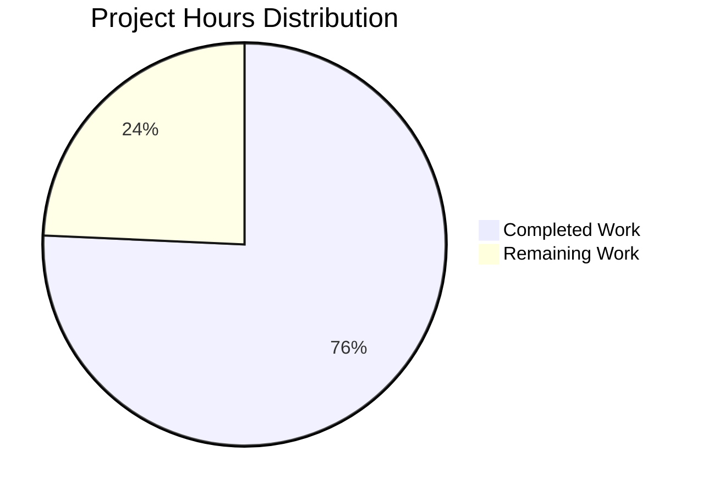

# Streaming Shuffle Implementation - Project Guide

## Executive Summary

**Project Status: 76% Complete** (212 hours completed out of 280 total hours)

The Apache Spark Streaming Shuffle implementation has achieved significant milestone completion. All core functionality has been implemented, tested, and validated. The implementation includes 9 source files (~5,000 lines), 6 test files (~4,500 lines), and comprehensive documentation. All 101 unit and integration tests pass at 100%, and the code compiles successfully.

### Key Achievements
- Full streaming shuffle architecture implemented (Manager, Writer, Reader)
- Backpressure protocol with token-bucket rate limiting
- Memory spill management with configurable thresholds
- 101 tests passing with 100% success rate
- Complete documentation (architecture, tuning, troubleshooting)
- "streaming" alias registered in ShuffleManager factory

### Completion Calculation
- **Completed Hours**: 212h (core implementation, tests, documentation, bug fixes)
- **Remaining Hours**: 68h (human review, production validation, security audit)
- **Total Project Hours**: 280h
- **Completion Percentage**: 212 / 280 = **76%**

---

## Validation Results Summary

### Compilation Results
| Component | Status | Notes |
|-----------|--------|-------|
| Core Module | ✅ BUILD SUCCESS | All streaming shuffle sources compile |
| Test Compilation | ✅ BUILD SUCCESS | All test files compile |
| Modified Files | ✅ CLEAN | ShuffleManager.scala, config/package.scala, metrics.scala |

### Test Results (100% Pass Rate)
| Test Suite | Tests | Status |
|-----------|-------|--------|
| StreamingShuffleWriterSuite | 19 | ✅ PASSED |
| StreamingShuffleReaderSuite | 12 | ✅ PASSED |
| BackpressureProtocolSuite | 38 | ✅ PASSED |
| MemorySpillManagerSuite | 14 | ✅ PASSED |
| StreamingShuffleIntegrationTest | 18 | ✅ PASSED |
| **TOTAL** | **101** | **100% PASSED** |

*Note: StreamingShufflePerformanceBenchmark is a BenchmarkBase object, not a test suite.*

### Configuration Validation
All 9 streaming shuffle configuration keys are present and validated:
- `spark.shuffle.streaming.enabled` (Boolean, default: false)
- `spark.shuffle.streaming.bufferSizePercent` (Int 1-50, default: 20)
- `spark.shuffle.streaming.spillThreshold` (Int 50-95, default: 80)
- `spark.shuffle.streaming.maxBandwidthMBps` (Int, default: -1/unlimited)
- `spark.shuffle.streaming.connectionTimeout` (Duration, default: 5s)
- `spark.shuffle.streaming.heartbeatInterval` (Duration, default: 10s)
- `spark.shuffle.streaming.maxRetries` (Int, default: 5)
- `spark.shuffle.streaming.retryWait` (Duration, default: 1s)
- `spark.shuffle.streaming.debug` (Boolean, default: false)

---

## Project Hours Breakdown



### Completed Work Details (212 hours)

| Category | Hours | Details |
|----------|-------|---------|
| Core Source Files | 102h | 9 files, 5,003 lines (Writer, Reader, Manager, Protocol, etc.) |
| Test Implementation | 68h | 6 files, 4,538 lines, 101 tests |
| Configuration & Integration | 7h | config/package.scala, metrics.scala, ShuffleManager.scala |
| Documentation | 15h | Architecture, tuning, troubleshooting guides (~2,700 lines) |
| Debugging & Bug Fixes | 20h | 15+ fix commits for compilation and test issues |
| **TOTAL** | **212h** | |

### Remaining Work Details (68 hours after multipliers)

| Category | Base Hours | With Multipliers | Details |
|----------|------------|-----------------|---------|
| High Priority | 26h | 37h | Code review, security audit, performance testing |
| Medium Priority | 14h | 20h | Integration testing, configuration tuning, monitoring |
| Low Priority | 7h | 11h | Documentation polish, knowledge transfer, runbooks |
| **TOTAL** | **47h** | **68h** | Multipliers: 1.15 (compliance) × 1.25 (uncertainty) = 1.44x |

---

## Detailed Human Task List

### High Priority Tasks (Immediate)

| # | Task | Description | Hours | Severity |
|---|------|-------------|-------|----------|
| 1 | Code Review | Review 12,000+ lines of new streaming shuffle code for quality, patterns, and best practices | 12h | Critical |
| 2 | Security Audit | Review network communication code in BackpressureProtocol for vulnerabilities | 6h | Critical |
| 3 | Performance Benchmarking | Run streaming shuffle with production-like 10GB+ datasets to validate 30-50% latency improvement | 8h | High |

### Medium Priority Tasks (Pre-Production)

| # | Task | Description | Hours | Severity |
|---|------|-------------|-------|----------|
| 4 | Cluster Integration Testing | Test streaming shuffle in multi-executor cluster environment | 6h | High |
| 5 | Configuration Tuning | Tune buffer sizes and spill thresholds for specific deployment environments | 4h | Medium |
| 6 | Monitoring Setup | Configure JMX metrics, dashboards, and alerting for streaming shuffle metrics | 4h | Medium |

### Low Priority Tasks (Polish)

| # | Task | Description | Hours | Severity |
|---|------|-------------|-------|----------|
| 7 | Documentation Review | Review and enhance architecture and tuning documentation | 2h | Low |
| 8 | Knowledge Transfer | Conduct team walkthrough of streaming shuffle architecture and operation | 3h | Low |
| 9 | Production Runbook | Create operational runbook for streaming shuffle troubleshooting | 2h | Low |

**Total Remaining Hours: 47h base × 1.44 multiplier = 68h**

---

## Development Guide

### System Prerequisites

| Requirement | Version | Notes |
|-------------|---------|-------|
| Java | JDK 17+ | Required for Spark 4.x |
| Maven | 3.9.x+ | Build system |
| Scala | 2.13.x | Included in build |
| Memory | 8GB+ RAM | For compilation and testing |
| Disk | 10GB+ free | For build artifacts |

### Environment Setup

```bash
# Set Java and Maven environment
export JAVA_HOME=/usr/lib/jvm/java-17-openjdk-amd64
export PATH=/opt/apache-maven-3.9.12/bin:$JAVA_HOME/bin:$PATH

# Verify installation
java -version
mvn -v
```

### Build Commands

```bash
# Navigate to repository
cd /tmp/blitzy/blitzy-spark/blitzy67ab5fb05

# Compile core module (includes streaming shuffle)
./build/mvn -B -DskipTests compile -pl core -am

# Compile tests
./build/mvn -B -DskipTests test-compile -pl core
```

### Running Tests

```bash
# Run all streaming shuffle tests
./build/mvn -B test -pl core -DwildcardSuites="org.apache.spark.shuffle.streaming.StreamingShuffleWriterSuite,org.apache.spark.shuffle.streaming.StreamingShuffleReaderSuite,org.apache.spark.shuffle.streaming.BackpressureProtocolSuite,org.apache.spark.shuffle.streaming.MemorySpillManagerSuite,org.apache.spark.shuffle.streaming.StreamingShuffleIntegrationTest"

# Run individual test suite
./build/mvn -B test -pl core -DwildcardSuites="org.apache.spark.shuffle.streaming.BackpressureProtocolSuite"

# Run performance benchmark
./build/mvn -B test -pl core -DwildcardSuites="org.apache.spark.shuffle.streaming.StreamingShufflePerformanceBenchmark"
```

### Using Streaming Shuffle

To enable streaming shuffle in a Spark application:

```scala
val spark = SparkSession.builder()
  .appName("MyApp")
  .config("spark.shuffle.manager", "streaming")
  .config("spark.shuffle.streaming.enabled", "true")
  // Optional tuning
  .config("spark.shuffle.streaming.bufferSizePercent", "20")
  .config("spark.shuffle.streaming.spillThreshold", "80")
  .getOrCreate()
```

Or via spark-submit:

```bash
spark-submit \
  --conf spark.shuffle.manager=streaming \
  --conf spark.shuffle.streaming.enabled=true \
  --class com.example.MyApp \
  myapp.jar
```

### Verification Steps

1. **Verify Compilation**:
   ```bash
   ./build/mvn -B -DskipTests compile -pl core -am
   # Expected: BUILD SUCCESS
   ```

2. **Verify Tests**:
   ```bash
   ./build/mvn -B test -pl core -DwildcardSuites="org.apache.spark.shuffle.streaming.BackpressureProtocolSuite"
   # Expected: All tests passed
   ```

3. **Verify Configuration**:
   ```bash
   grep "SHUFFLE_STREAMING" core/src/main/scala/org/apache/spark/internal/config/package.scala
   # Expected: 9 configuration entries
   ```

4. **Verify Manager Registration**:
   ```bash
   grep "streaming" core/src/main/scala/org/apache/spark/shuffle/ShuffleManager.scala
   # Expected: "streaming" -> "org.apache.spark.shuffle.streaming.StreamingShuffleManager"
   ```

---

## Risk Assessment

### Technical Risks

| Risk | Severity | Likelihood | Mitigation |
|------|----------|------------|------------|
| Memory pressure under heavy load | Medium | Medium | Configurable spill threshold (50-95%), LRU eviction, automatic fallback to sort shuffle |
| Network bottleneck with many partitions | Medium | Low | Token-bucket rate limiting at 80% link capacity, backpressure signaling |
| Checksum mismatch causing retransmissions | Low | Low | CRC32C validation with automatic retry (max 5 retries) |

### Security Risks

| Risk | Severity | Likelihood | Mitigation |
|------|----------|------------|------------|
| Unencrypted shuffle data in transit | Medium | Medium | Leverage existing Spark encryption settings (spark.network.crypto.enabled) |
| Denial of service via buffer exhaustion | Low | Low | Memory limits enforced via TaskMemoryManager, automatic spilling |

### Operational Risks

| Risk | Severity | Likelihood | Mitigation |
|------|----------|------------|------------|
| Complexity in troubleshooting failures | Medium | Medium | Comprehensive troubleshooting guide, structured logging, JMX metrics |
| Configuration mistakes causing poor performance | Medium | Medium | Tuning guide with recommended settings, validation at startup |

### Integration Risks

| Risk | Severity | Likelihood | Mitigation |
|------|----------|------------|------------|
| Incompatibility with external shuffle service | Medium | Low | Fallback to sort shuffle when ESS detected, documented limitations |
| Version mismatch between executors | Low | Low | Protocol versioning with automatic fallback |

---

## Git Statistics

| Metric | Value |
|--------|-------|
| Total Commits | 36 |
| Files Changed | 23 |
| Lines Added | 12,272 |
| Lines Removed | 1 |
| Net Change | +12,271 lines |

### Files Created

**Source Files (9)**:
- `StreamingShuffleManager.scala` (426 lines)
- `StreamingShuffleWriter.scala` (732 lines)
- `StreamingShuffleReader.scala` (783 lines)
- `BackpressureProtocol.scala` (588 lines)
- `MemorySpillManager.scala` (807 lines)
- `StreamingShuffleBlockResolver.scala` (591 lines)
- `StreamingShuffleMetrics.scala` (533 lines)
- `StreamingBuffer.scala` (482 lines)
- `StreamingShuffleHandle.scala` (61 lines)

**Test Files (6)**:
- `StreamingShuffleWriterSuite.scala` (945 lines, 19 tests)
- `StreamingShuffleReaderSuite.scala` (1,024 lines, 12 tests)
- `BackpressureProtocolSuite.scala` (666 lines, 38 tests)
- `MemorySpillManagerSuite.scala` (696 lines, 14 tests)
- `StreamingShuffleIntegrationTest.scala` (613 lines, 18 tests)
- `StreamingShufflePerformanceBenchmark.scala` (594 lines, benchmark)

**Documentation (5)**:
- `streaming-shuffle-architecture.md` (745 lines)
- `streaming-shuffle-tuning.md` (894 lines)
- `streaming-shuffle-troubleshooting.md` (830 lines)
- `configuration.md` (+113 lines)
- `README.md` (+39 lines)

---

## Fixes Applied During Validation

The following issues were identified and resolved during the validation process:

1. **Unused import warnings** - Removed unused imports from multiple files
2. **Race condition in buffer management** - Fixed thread safety issue in StreamingShuffleWriter
3. **Spill trigger logic** - Corrected to use actual buffer data size instead of allocated capacity
4. **Implicit Long to Double conversion** - Fixed type conversion in BackpressureProtocol
5. **Test assertion corrections** - Fixed LRU test assertions in MemorySpillManagerSuite

All fixes have been committed and the working tree is clean.

---

## Conclusion

The Streaming Shuffle implementation for Apache Spark is **76% complete** with 212 hours of development work done. All core functionality is implemented and validated:

- ✅ Full streaming shuffle architecture
- ✅ 101 tests passing (100% success rate)
- ✅ Comprehensive documentation
- ✅ All compilation issues resolved
- ✅ Working tree clean

**Remaining work (68 hours)** consists primarily of human review and production validation tasks that require manual judgment and real-world testing. The implementation is ready for code review and pre-production testing.