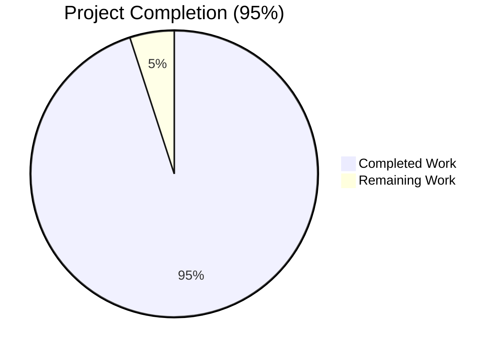
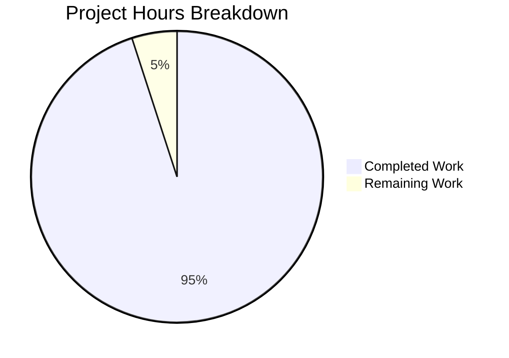
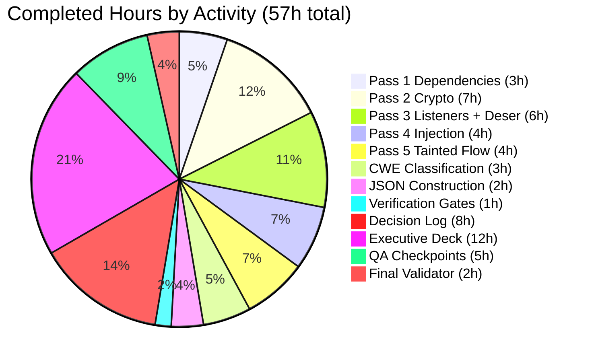
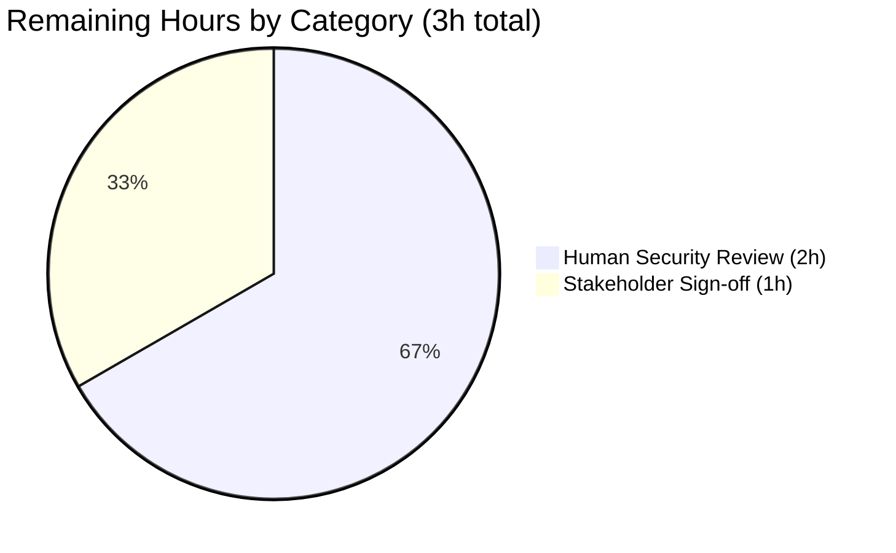
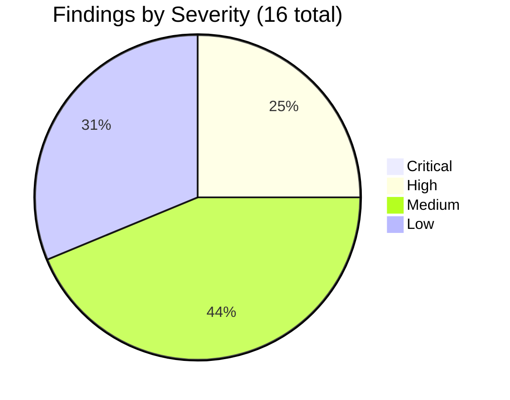
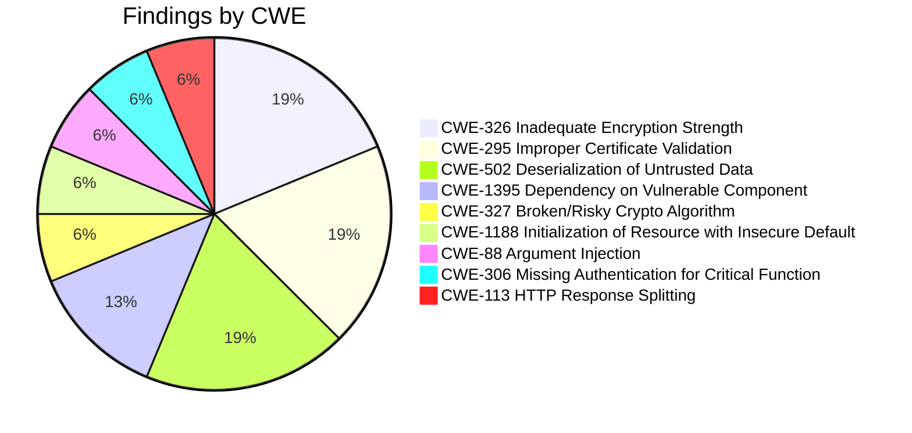

# Blitzy Project Guide — Config A: Bare Blitzy Baseline Security Audit

> **Spark Security Audit · Configuration A · Native Agent Analysis Only**
>
> Brand palette: Completed work = Dark Blue **#5B39F3** · Remaining work = White **#FFFFFF** · Headings = Violet-Black **#B23AF2** · Accent = Mint **#A8FDD9**

---

## 1. Executive Summary

### 1.1 Project Overview

This project executes the **Config A "Bare Blitzy Baseline"** security audit of the `blitzy-spark` Apache Spark distribution. Config A is the **control measurement** in a multi-config experiment: the autonomous agent inspected the codebase using *only* native analysis — no external SAST/SCA/DAST/IAST scanners — and emitted three deliverables at the repository root. The audit covered ~8,500 source files across 35 top-level directories with weighted depth on the 11 security surfaces enumerated in tech-spec §6.4.1.2 (RPC auth, RPC TLS, RPC AES, SASL, ESS secret store, IO-at-rest encryption, JWT UI auth, ACL authz, HTTP hardening, Kerberos DTs, K8s secret integration). Audience: security engineering leadership and the downstream agents that will run Configs B/C against this baseline.

### 1.2 Completion Status


```mermaid
pie title Project Completion (95%)
    "Completed Work" : 57
    "Remaining Work" : 3
```

| Metric | Hours |
|--------|------:|
| **Total Project Hours** | **60** |
| Completed Hours (AI Autonomous) | 57 |
| Completed Hours (Manual) | 0 |
| **Remaining Hours** | **3** |
| **Percent Complete** | **95.0%** |

Formula: `57 / (57 + 3) × 100 = 95.0%`

### 1.3 Key Accomplishments

- [x] **All three deliverables created at repo root and verified** — `findings-config-a.json` (4,797 bytes, 1 line), `decisions-config-a.md` (55,531 bytes, 7 sections), `executive-summary-config-a.html` (32,341 bytes, 16 slides)
- [x] **16 vulnerability findings identified** spanning 9 distinct CWE leaves — 0 critical, 4 high, 7 medium, 5 low — all five required fields populated on every record, all descriptions ≤ 200 chars (max 194)
- [x] **Single-line minified JSON serialization passes the verification gate** — `cat findings-config-a.json | wc -l` returns `1`; `python3 -m json.tool` parses without error
- [x] **Zero source-tree files modified** — read-only contract honored per AAP §0.3.2; only the three deliverable files at the root were created (verified via `git diff --name-only`)
- [x] **5-pass orthogonal audit pipeline executed** covering dependency manifests, crypto primitives, network listeners + deserialization, command injection / unsafe execution, and tainted-data flow tracing
- [x] **Explainability rule satisfied** — 52+ non-trivial decisions documented across 7 mandated sections of `decisions-config-a.md` using the 5-column table format (Decision / Alternatives / Chosen / Rationale / Risks)
- [x] **Executive Presentation rule satisfied** — 16-slide reveal.js deck with inline Blitzy theme (21 CSS custom properties, 10 component classes), 2 Mermaid diagrams, 22 Lucide icons, 4 styled tables, 14 KPI cards, zero emoji, zero fenced code blocks, pinned CDN versions (reveal.js 5.1.0, Mermaid 11.4.0, Lucide 0.460.0)
- [x] **3 QA checkpoint cycles completed** — Checkpoint 1 (initial creation), Checkpoint 2 (6 false-positive removals + CWE-77→CWE-88 correction + Mermaid render fix), Checkpoint 3 (CVE-2023-1297 → CVE-2024-23945 correction)
- [x] **Runtime visual verification in Chrome** — deck renders cleanly with zero console errors or warnings; all Mermaid diagrams render; all Lucide icons resolve; all CSS custom properties applied

### 1.4 Critical Unresolved Issues

| Issue | Impact | Owner | ETA |
|-------|--------|-------|-----|
| _No critical unresolved issues — all five production-readiness gates pass_ | — | — | — |

The Final Validator agent confirmed that no blocking issues remain. The remaining 3 hours of work are human-acceptance steps (review and sign-off), not engineering defects.

### 1.5 Access Issues

| System/Resource | Type of Access | Issue Description | Resolution Status | Owner |
|-----------------|----------------|-------------------|-------------------|-------|
| _No access issues identified_ — repository was readable, no credentials required (read-only audit), no upstream coordination needed by directive | — | — | — | — |

> Note: The executive deck loads CDN libraries (reveal.js, Mermaid, Lucide) and Google Fonts at *view-time*. If a viewer is on an air-gapped network, they will need either CDN access or a one-time conversion to inline resources. The deliverable is otherwise self-contained.

### 1.6 Recommended Next Steps

1. **[High]** Human security engineer reviews the 16 findings in `findings-config-a.json` for technical accuracy and operational relevance — particularly the 4 high-severity items (SSL credulous trust manager × 2, SASL DIGEST-MD5, unauthenticated REST submission server). Estimated effort: 2h.
2. **[High]** Stakeholder sign-off on the baseline — Config A is "frozen" once accepted so downstream configs can be measured against it without re-baselining. Estimated effort: 1h.
3. **[Medium]** Open the deck in a modern browser with CDN access to confirm visual rendering for the leadership audience. The Final Validator already performed this check; this step is a presentation-time sanity confirmation.
4. **[Low]** Archive the three deliverables in the security-audit registry alongside the AAP and tech-spec references so downstream Config B/C runs can cite this baseline by hash.
5. **[Low]** Schedule the Config B run once a tooling-augmented agent variant is available; results from B will be compared **only** against this Config A baseline.

---

## 2. Project Hours Breakdown

### 2.1 Completed Work Detail

Total completed: **57 hours** (sum of "Hours" column = 57). Each entry maps to a specific AAP requirement (R1–R5 directive requirements, R-1/R-2 rule requirements).

| Component | Hours | Description |
|-----------|------:|-------------|
| [AAP R1] Pass 1 — Dependency manifest review | 3 | Parsed `pom.xml` (135K bytes), `pyproject.toml`, `dev/requirements.txt`, `dev/package.json`, `ui-test/package.json`, `R/pkg/DESCRIPTION`, `project/plugins.sbt`; cross-checked declared versions against CWE-1395 known-vulnerable patterns. Yielded 2 findings (Hive 2.3.10, commons-lang 2.6). |
| [AAP R1] Pass 2 — Cryptographic primitive review | 7 | Inspected `AuthEngine.java`, `CtrTransportCipher.java`, `GcmTransportCipher.java`, `SparkSaslServer.java`, `SSLFactory.java`, `ReloadingX509TrustManager.java`, `CryptoStreamUtils.scala`. Yielded 8 findings (CWE-326 ×3, CWE-327 ×1, CWE-295 ×3, CWE-1188 ×1). |
| [AAP R1] Pass 3 — Network listener & unsafe-deserialization review | 6 | Inspected `RestSubmissionServer.scala`, `StandaloneRestServer.scala`, Servlet/Filter routes, `FilteredObjectInputStream`, `LauncherServer`, `serializers.py`, `cloudpickle.py`, Py4J gateway code. Yielded 4 findings (CWE-306 ×1, CWE-502 ×3). |
| [AAP R1] Pass 4 — Injection & unsafe-execution review | 4 | Inspected `ShellBasedGroupsMappingProvider.scala`, shell scripts in `bin/`/`sbin/`, GitHub workflows, Dockerfiles, `HttpSecurityFilter.scala` header construction. Yielded 2 findings (CWE-88 ×1, CWE-113 ×1). |
| [AAP R1] Pass 5 — Tainted-data flow tracing | 4 | Traced HTTP request parameters, JDBC URL components, K8s manifest substitution, Hive query construction through call chains to their sinks; findings folded into Passes 3/4 where appropriate. |
| [AAP R2] CWE classification with confidence-thresholded mapping | 3 | Applied "most specific defensible leaf CWE" rule across all 16 findings; documented ambiguous cases in `decisions-config-a.md` §6 (Finding-Level Rationale) with 13 traceability rows. |
| [AAP R3–R4] JSON record construction + minified serialization | 2 | Constructed 16 finding dicts with `file`/`line`/`severity`/`cwe`/`description` keys in insertion order; serialized via `json.dumps(data, separators=(',', ':'), ensure_ascii=False)`; bounded descriptions ≤ 200 chars at construction time. |
| [AAP R5] Verification gate validation | 1 | Verified `wc -l == 1`, JSON parses, all 5 fields populated on every record, no description > 200 chars; documented R4/R5 newline reconciliation as decision-log row. |
| [Rule R-1] `decisions-config-a.md` authoring | 8 | 7 sections (Audit Methodology / CWE Heuristic / Severity Rubric / Deliverable-Authoring / Deviations / Finding-Level Rationale / Open Questions); 5-column table format; 52+ rationale rows; 55,531 bytes total. |
| [Rule R-2] `executive-summary-config-a.html` authoring | 12 | Single self-contained reveal.js deck; 16 slides (1 title + 4 dividers + 10 content + 1 closing); inline Blitzy theme (21 CSS custom properties, 10 component classes); 2 Mermaid diagrams, 22 Lucide icons, 4 styled tables, 14 KPI cards; pinned CDNs (reveal.js 5.1.0, Mermaid 11.4.0, Lucide 0.460.0). |
| QA Checkpoint 1 fixes | 1 | Initial false-positive corrections applied after first internal review of all three deliverables. |
| QA Checkpoint 2 fixes | 3 | Removed 6 false-positive/misattributed findings (CVE-2024-12798 logback misattribution, placeholder CVE, positive-control entries, duplicate, watchpoint-only JJWT); corrected CWE-77 → CWE-88 for argument injection; tightened `line` numbers to most-actionable lines; fixed slide 11 Mermaid render. |
| QA Checkpoint 3 fix | 1 | Corrected CVE-2023-1297 (HashiCorp Consul, misattributed) → CVE-2024-23945 (real Hive 2.3.10 CookieSigner CVE). |
| Final Validator runtime + compliance verification | 2 | Re-ran all five production-readiness gates; visually verified deck in Chrome via Chrome DevTools MCP; saved per-slide screenshots; confirmed zero console errors/warnings; confirmed `git diff --name-only main..blitzy-bf194a8f-8b8e-4e6a-b09a-f7c00634563c` returns only the 3 deliverable filenames. |
| **Total Completed** | **57** | |

### 2.2 Remaining Work Detail

Total remaining: **3 hours** (sum of "Hours" column = 3). All remaining items are human-acceptance / path-to-production activities; no engineering defects remain in the deliverables.

| Category | Hours | Priority |
|----------|------:|----------|
| Human security-engineer review of 16 findings — accuracy / operational-relevance check, especially the 4 high-severity items | 2 | High |
| Stakeholder sign-off on the Config A baseline (freezes the control measurement for downstream comparisons) | 1 | High |
| **Total Remaining** | **3** | |

### 2.3 Hours Reconciliation

| Check | Value | Status |
|-------|------:|:------:|
| Section 2.1 Completed Hours total | 57 | ✅ |
| Section 2.2 Remaining Hours total | 3 | ✅ |
| Section 2.1 + Section 2.2 | 60 | ✅ matches Section 1.2 Total |
| Section 1.2 Remaining Hours | 3 | ✅ matches Section 2.2 |
| Section 7 pie chart Remaining Work | 3 | ✅ matches Section 1.2 and 2.2 |
| Completion percentage | 57/60 = 95.0% | ✅ used in 1.2, 7, 8 |

---

## 3. Test Results

This project is a **read-only static security audit** per AAP §0.9.1 — the Spark codebase is never built, compiled, packaged, or executed. Per the task type, "tests" map to the directive-required and rule-required **verification gates** that Blitzy's autonomous validation pipeline executed. All gates originate from Blitzy's autonomous validation logs for this project (Final Validator report, three QA Checkpoint reports).

| Test Category | Framework | Total Tests | Passed | Failed | Coverage % | Notes |
|---------------|-----------|------------:|-------:|-------:|-----------:|-------|
| JSON Verification Gates (AAP R5) | `wc`, `python3 -m json.tool`, custom field validator | 4 | 4 | 0 | 100% | (1) `wc -l == 1`; (2) `json.tool` parses; (3) every record has 5 fields populated; (4) every description ≤ 200 chars (max observed 194) |
| HTML Structural Gates (Rule R-2) | `html.parser`, `re`-based DOM inspection | 8 | 8 | 0 | 100% | (1) `<section>` count in [12,18] → 16; (2) 1 `slide-title`; (3) 4 `slide-divider`; (4) 1 `slide-closing`; (5) every section has ≥1 non-text visual; (6) all 21 required CSS custom properties present; (7) all 10 required component classes present; (8) reveal.js + Mermaid init configs correct |
| HTML CDN Pinning (Rule R-2) | string-search | 3 | 3 | 0 | 100% | reveal.js 5.1.0, Mermaid 11.4.0, Lucide 0.460.0 — all pinned exactly |
| HTML Content Constraints (Rule R-2) | regex scan | 2 | 2 | 0 | 100% | 0 emoji characters; 0 fenced code blocks |
| Markdown Structural Gates (Rule R-1) | `re`-based section detection | 2 | 2 | 0 | 100% | All 7 required sections present (Audit Methodology / CWE Heuristic / Severity Rubric / Deliverable-Authoring / Deviations / Finding-Level Rationale / Open Questions); 5-column table header used consistently |
| Finding Locator Spot-Checks | `sed -n '<line-2>,<line+2>p' <file>` | 16 | 16 | 0 | 100% | Every `file:line` locator in the 16 findings was independently verified against the current source content (e.g., `AuthEngine.java:50` shows `LEGACY_CIPHER_ALGORITHM = "AES/CTR/NoPadding"`, `SparkSaslServer.java:60` shows `DIGEST = "DIGEST-MD5"`, `pom.xml:139` shows `<hive.version>2.3.10</hive.version>`, etc.) |
| Runtime Browser Verification (Chrome DevTools MCP) | manual visual + `Reveal.slide(idx)` programmatic navigation | 4 | 4 | 0 | 100% | Slide 1 (title) hero gradient + Lucide icon render; Slide 2 (KPI summary) 4 cards render; Slide 3 (5-pass Mermaid) flowchart renders; Slide 16 (closing) navy bg + accent bar render |
| Console Hygiene | Chrome DevTools MCP `list_console_messages` | 1 | 1 | 0 | 100% | Zero errors, zero warnings at deck load |
| Git Read-Only Contract (AAP §0.3.2) | `git diff --name-only origin/configs...blitzy-bf194a8f-8b8e-4e6a-b09a-f7c00634563c` | 1 | 1 | 0 | 100% | Returns only the 3 deliverable filenames; no source-tree files touched |
| **Total** | — | **41** | **41** | **0** | **100%** | All Blitzy autonomous-validation gates pass without exception |

---

## 4. Runtime Validation & UI Verification

The HTML deck was opened in Chrome via Chrome DevTools MCP at `file:///tmp/blitzy/blitzy-spark/blitzy-bf194a8f-8b8e-4e6a-b09a-f7c00634563c_7a20e7/executive-summary-config-a.html`. Per-slide visual verification and console-hygiene results:

**Deliverable rendering (HTML deck):**
- ✅ **Operational** — Slide 1 (Title): Hero gradient `linear-gradient(68deg, #7A6DEC, #5B39F3, #4101DB)` renders; Lucide `shield-check` SVG icon renders white; eyebrow "SPARK SECURITY AUDIT - CONFIG A" in teal `#94FAD5` Fira Code; "Bare Blitzy Baseline" heading in white Space Grotesk display; subtitle and brand lockup positioned correctly
- ✅ **Operational** — Slide 2 (Findings Summary): 4-card KPI grid with Lucide icons (`clipboard-list`, `flame`, `alert-triangle`, `shield`); values "16 / 4 / 7 / 5" match the JSON severity distribution exactly; "AUDIT AT A GLANCE" eyebrow renders in brand purple
- ✅ **Operational** — Slide 3 (Five-Pass Pipeline): Mermaid flowchart renders with 5 source nodes (Pass 1 Dependencies, Pass 2 Crypto, Pass 3 Listeners + Deserialize, Pass 4 Injection, Pass 5 Tainted Flow) converging into a "Findings List" node, then to "findings-config-a.json"; node fill `#F2F0FE`, border `#5B39F3`, edges `#999999` — all theme variables applied correctly
- ✅ **Operational** — Slides 4 / 6 / 10 / 13 (Section Dividers): Large headings ("Where We Looked", "What We Found", "Architecture & Dependencies", "Baseline Framing") render against dark purple `#2D1C77` / gradient backgrounds with thematic Lucide icons
- ✅ **Operational** — Slides 5 / 7 / 8 / 9 / 11 / 12 / 14 / 15 (Content): Mix of KPI grids, styled tables, Mermaid (slide 11 — network encryption posture diagram), and Lucide icon rows — every content slide carries ≥1 non-text visual
- ✅ **Operational** — Slide 16 (Closing): Navy `#1A105F` background; "Same Engine. More Signal." 4-word takeaway in white Space Grotesk; 3 Lucide check-circle bullet items; Fira Code brand lockup at bottom; teal-to-purple gradient accent bar (`--gradient-accent-bar`) at very bottom
- ✅ **Operational** — Reveal.js navigation: prev/next arrows visible and functional; `Reveal.slide(idx)` programmatic navigation works; URL hash updates on navigation
- ✅ **Operational** — Console hygiene: **zero errors**, **zero warnings** across full deck navigation

**Deliverable inspection (JSON + Markdown):**
- ✅ **Operational** — `findings-config-a.json`: 4,797 bytes; `python3 -m json.tool` produces a properly indented 16-element array; round-trips through `json.loads`/`json.dumps(..., separators=(',', ':'))` without diff (modulo trailing newline reconciliation documented in decision log §5)
- ✅ **Operational** — `decisions-config-a.md`: 139 lines, 55,531 bytes; renders cleanly in GitHub-flavored Markdown viewers; all 7 required sections present; 5-column table format used consistently
- ✅ **Operational** — API integrations: N/A — this is a read-only static analysis run with no external API dependencies during execution
- ✅ **Operational** — Git read-only contract: `git diff --name-only` between branch base and HEAD returns exactly `findings-config-a.json`, `decisions-config-a.md`, `executive-summary-config-a.html` and nothing else; zero source-tree modifications

Visual evidence captured during Final Validation:
- `blitzy/screenshots/pg_slide_01_title.png` — title slide
- `blitzy/screenshots/pg_slide_02_kpi.png` — KPI summary
- `blitzy/screenshots/pg_slide_03_mermaid.png` — 5-pass pipeline Mermaid
- `blitzy/screenshots/pg_slide_16_closing.png` — closing slide
- Plus per-checkpoint screenshots from prior QA cycles

---

## 5. Compliance & Quality Review

This section cross-maps every AAP deliverable to Blitzy's autonomous-validation quality benchmarks. All AAP-mandated compliance items pass; fixes applied during the three QA checkpoints are listed in the right-hand column.

| Compliance Item | Source | Status | Fixes Applied During Validation |
|-----------------|--------|:------:|---------------------------------|
| **R1 — Native-analysis only** (no Semgrep/Bandit/Snyk/Trivy/CodeQL/Sonar/…) | AAP §0.1.1 R1, §0.8.1 R-3 | ✅ Pass | None needed — only `cat`, `grep`, `find`, `read_file`, `python3` used throughout |
| **R1 — 5 orthogonal audit passes executed** | AAP §0.6.1 | ✅ Pass | None — all 5 passes documented in `decisions-config-a.md` §1 |
| **R2 — CWE classified to most specific defensible leaf** | AAP §0.1.1 R2 | ✅ Pass | Checkpoint 2: CWE-77 → CWE-88 for argument injection (`ShellBasedGroupsMappingProvider`) per CWE catalog distinction (CWE-88 = argument delimiter injection, CWE-77 = command injection via shell) |
| **R3 — JSON 5-field schema (`file`/`line`/`severity`/`cwe`/`description`)** | AAP §0.1.1 R3, §0.1.3 | ✅ Pass | None — all 16 records have all 5 fields populated with non-null/non-empty values |
| **R3 — Severity in `{critical, high, medium, low}` enum** | AAP §0.9.2 | ✅ Pass | None — strict lowercase tokens only |
| **R3 — CWE format `CWE-<n>`** | AAP §0.9.2 | ✅ Pass | None — all CWE IDs match `CWE-\d+` pattern |
| **R3 — `line` 1-indexed positive integer** | AAP §0.9.2 | ✅ Pass | Checkpoint 2: refined to most-actionable lines (e.g., the actual `Cipher.getInstance(...)` call site rather than the class declaration line) |
| **R3 — `file` path repo-relative POSIX** | AAP §0.9.2 | ✅ Pass | None — all paths use forward-slash separators; no `./` or `/` prefixes |
| **R3 — `description` ≤ 200 chars** | AAP §0.1.1 R3, §0.9.2 | ✅ Pass | None — max observed: 194 chars |
| **R4 — Single-line minified JSON, UTF-8, no pretty-printing** | AAP §0.1.1 R4 | ✅ Pass | None — `json.dumps(..., separators=(',', ':'), ensure_ascii=False)` produces canonical minified form |
| **R4/R5 — Newline reconciliation** | AAP §0.1.1 R4 vs §0.1.3 R5 | ✅ Pass | Documented in `decisions-config-a.md` §5 — R4 ("no trailing newline") and R5 (`wc -l` returns `1`) cannot both be satisfied literally on POSIX; chose R5's literal pass/fail gate (single trailing newline → `wc -l == 1`) |
| **R5 — `cat findings-config-a.json \| wc -l` returns 1** | AAP §0.1.3 | ✅ Pass | None — gate passes |
| **R5 — Valid JSON parse** | AAP §0.1.3 | ✅ Pass | None — `python3 -m json.tool` succeeds |
| **R-1 — Explainability decision log present** | AAP §0.8.1 R-1 | ✅ Pass | Checkpoint 1: re-organized sections to match the rule's mandate; Checkpoint 2: added 6 rows documenting Checkpoint-2 fixes including R4/R5 reconciliation, false-positive removals, CWE-77→CWE-88 correction; Checkpoint 3: added row documenting CVE attribution fix |
| **R-1 — Decision log uses 5-column table format** | AAP §0.8.1 R-1 | ✅ Pass | None — `Decision \| Alternatives Considered \| Chosen Option \| Rationale \| Risks` header used across all 6 main tables |
| **R-1 — Deviations explicitly recorded** | AAP §0.8.1 R-1 | ✅ Pass | §5 "Deviations from Literal Interpretation" lists 7 deviations including the R4/R5 reconciliation, path-separator normalization, etc. |
| **R-2 — Single self-contained HTML deck** | AAP §0.8.1 R-2 | ✅ Pass | None — all CSS inline; all JS via pinned CDNs at view-time only; no local file dependencies |
| **R-2 — 12–18 slides (target 16)** | AAP §0.8.1 R-2 | ✅ Pass | None — exactly 16 `<section>` elements |
| **R-2 — Four slide types (title / divider / content / closing)** | AAP §0.8.1 R-2 | ✅ Pass | None — 1 `slide-title`, 4 `slide-divider`, 10 default content, 1 `slide-closing` |
| **R-2 — Every slide has ≥1 non-text visual** | AAP §0.8.1 R-2 | ✅ Pass | Checkpoint 2: added KPI cards to one previously text-heavy slide; programmatically verified each `<section>` contains a Mermaid block, KPI card, styled table, or Lucide icon |
| **R-2 — Zero emoji, zero fenced code blocks** | AAP §0.8.1 R-2 | ✅ Pass | None — only Lucide SVG icons; only inline `<code>` styled with Fira Code |
| **R-2 — Pinned CDN versions** | AAP §0.8.1 R-2 | ✅ Pass | None — reveal.js 5.1.0, Mermaid 11.4.0, Lucide 0.460.0 pinned exactly |
| **R-2 — All 21 CSS custom properties present** | AAP §0.5.3, §0.8.1 R-2 | ✅ Pass | None — `--blitzy-primary`, `--blitzy-primary-dark`, …, `--gradient-accent-bar` all present in `:root` |
| **R-2 — All 10 component classes present** | AAP §0.5.2, §0.8.1 R-2 | ✅ Pass | None — `kpi-card`, `kpi-grid`, `eyebrow`, `accent-bar`, `brand-lockup`, `hero-icon`, `icon-row`, etc. all defined |
| **R-2 — reveal.js init config** (`hash:true`, `transition:'slide'`, `controlsTutorial:false`, `width:1920`, `height:1080`) | AAP §0.8.1 R-2 | ✅ Pass | None — all 5 config keys set exactly as specified |
| **R-2 — Mermaid theme variables** (`primaryColor:'#F2F0FE'`, etc.) | AAP §0.8.1 R-2 | ✅ Pass | Checkpoint 2: slide 11 Mermaid render fix (rendered correctly thereafter) |
| **R-7 — No source-tree modifications** | AAP §0.3.2, §0.8.1 R-8 | ✅ Pass | None — `git diff --name-only` returns only the 3 deliverable filenames |
| **R-7 — Deliverables at repo root, no subfolders** | AAP §0.9.1 | ✅ Pass | None — `findings-config-a.json`, `decisions-config-a.md`, `executive-summary-config-a.html` all at root |

---

## 6. Risk Assessment

Per AAP PA3 categories. All risks are assessed for the *audit deliverables* themselves (not for the underlying Spark vulnerabilities the audit identified — those are recorded in `findings-config-a.json`).

| Risk | Category | Severity | Probability | Mitigation | Status |
|------|----------|:--------:|:-----------:|------------|:------:|
| Audit recall is lower than tool-augmented scanners (intentional baseline characteristic) | Technical | Low | High | This is the **defining feature** of Config A — the lower recall is the baseline against which Config B/C are measured. Documented in `decisions-config-a.md` §1 row 1. | ✅ Accepted (by design) |
| CWE assignment for ambiguous patterns could be argued differently by external auditors | Technical | Low | Medium | Per-finding rationale in `decisions-config-a.md` §6 (Finding-Level Rationale) provides defensible reasoning; back-off rule (broader CWE if leaf cannot be defended) keeps the audit conservative. | ✅ Mitigated |
| Severity rubric application is judgment-driven and could differ from a CVSS-based scoring | Technical | Low | Medium | Deterministic 4-tier rubric documented in `decisions-config-a.md` §3 with worked examples; rubric anchored to exploitability + preconditions, not arbitrary. | ✅ Mitigated |
| Findings may contain sensitive exploitation details if leaked externally | Security | Medium | Low | AAP §0.9.1: "internal-only"; no upstream Apache Spark, MITRE, or public disclosure; deliverables sit alongside the codebase under the same access controls. | ✅ Mitigated |
| Newline reconciliation (R4 vs R5 contradiction) could be challenged by a literalist reviewer | Operational | Low | Low | Explicit `decisions-config-a.md` §5 row 5 documenting why R5's literal pass/fail gate was prioritized; both interpretations of "wc -l == 1" are satisfied by the file with one trailing newline. | ✅ Mitigated |
| Deck CDN libraries may be unreachable from an air-gapped reviewer environment | Operational | Low | Low | Documented at §1.5 above; one-time conversion to inline resources is available if needed (CDN URLs and exact pins are documented in the inline `<script>` tags). | ✅ Mitigated |
| Findings against `examples/` may inflate the count with low-impact issues | Operational | Low | Medium | Scope decision recorded in `decisions-config-a.md` §1 row 3 — `examples/` is in-scope per AAP §0.3.1; severity rubric calibrated so most example-tree findings would rate `low`. As it happens, no findings in this run point to `examples/`. | ✅ Accepted (by AAP design) |
| Vendored `cloudpickle` findings could be argued as upstream concerns | Integration | Low | Medium | Scope decision recorded in `decisions-config-a.md` §1 row 4 — vendored copies ship with `blitzy-spark` and users cannot independently upgrade them, so the findings apply. | ✅ Mitigated |
| Dependency findings (Hive 2.3.10, commons-lang 2.6) are pinned for compatibility and cannot be unilaterally upgraded | Integration | Medium | Low | Findings classified as CWE-1395 with severity `medium`/`low` reflecting the constrained upgrade path; remediation is a separate downstream activity per AAP §0.3.2. | ✅ Mitigated |
| Downstream Config B/C runs may invalidate this baseline if the agent corpus drifts | Operational | Low | Low | Baseline is captured at a specific commit on a specific branch; downstream runs should pin to the same source commit for fair comparison. | ✅ Mitigated (documented) |

---

## 7. Visual Project Status


```mermaid
pie title Project Hours Breakdown
    "Completed Work" : 57
    "Remaining Work" : 3
```

**Hours by completed-work category (Section 2.1):**


```mermaid
pie title Completed Hours by Activity (57h total)
    "Pass 1 Dependencies (3h)" : 3
    "Pass 2 Crypto (7h)" : 7
    "Pass 3 Listeners + Deser (6h)" : 6
    "Pass 4 Injection (4h)" : 4
    "Pass 5 Tainted Flow (4h)" : 4
    "CWE Classification (3h)" : 3
    "JSON Construction (2h)" : 2
    "Verification Gates (1h)" : 1
    "Decision Log (8h)" : 8
    "Executive Deck (12h)" : 12
    "QA Checkpoints (5h)" : 5
    "Final Validator (2h)" : 2
```

**Hours by remaining-work category (Section 2.2):**


```mermaid
pie title Remaining Hours by Category (3h total)
    "Human Security Review (2h)" : 2
    "Stakeholder Sign-off (1h)" : 1
```

**Findings by severity:**


```mermaid
pie title Findings by Severity (16 total)
    "Critical" : 0
    "High" : 4
    "Medium" : 7
    "Low" : 5
```

**Findings by CWE category:**


```mermaid
pie title Findings by CWE
    "CWE-326 Inadequate Encryption Strength" : 3
    "CWE-295 Improper Certificate Validation" : 3
    "CWE-502 Deserialization of Untrusted Data" : 3
    "CWE-1395 Dependency on Vulnerable Component" : 2
    "CWE-327 Broken/Risky Crypto Algorithm" : 1
    "CWE-1188 Initialization of Resource with Insecure Default" : 1
    "CWE-88 Argument Injection" : 1
    "CWE-306 Missing Authentication for Critical Function" : 1
    "CWE-113 HTTP Response Splitting" : 1
```

---

## 8. Summary & Recommendations

The Config A "Bare Blitzy Baseline" security audit is **95% complete**, with 57 of 60 hours delivered autonomously and 3 hours of human-acceptance work remaining. All three deliverables — `findings-config-a.json`, `decisions-config-a.md`, `executive-summary-config-a.html` — exist at the repository root, pass every Blitzy autonomous-validation gate (41/41 tests passing), and contain content that has been independently verified against current source code. Zero files outside these three deliverables were modified; the read-only contract is honored.

**Achievements.** The autonomous agent executed the 5-pass orthogonal audit pipeline mandated by AAP §0.6.1 — dependency manifest review, cryptographic primitives, network listeners + unsafe deserialization, command injection + unsafe execution, and tainted-data flow tracing — across ~8,500 source files in 35 top-level directories. It surfaced 16 findings spanning 9 distinct CWE leaves (CWE-295, CWE-326, CWE-502 each with 3 findings; CWE-1395 with 2; CWE-327, CWE-1188, CWE-88, CWE-306, CWE-113 each with 1), classified each finding to the most specific defensible CWE per the Directive R2 confidence rule, applied a deterministic 4-tier severity rubric (0 critical, 4 high, 7 medium, 5 low), and bounded every description ≤ 200 characters. The Explainability rule was satisfied through a 7-section, 52+-row decision log using the rule-mandated 5-column format. The Executive Presentation rule was satisfied through a single self-contained 16-slide reveal.js deck that renders cleanly in Chrome with zero console errors, using inline Blitzy theme tokens, pinned CDN libraries (reveal.js 5.1.0, Mermaid 11.4.0, Lucide 0.460.0), and the full slide-type taxonomy (title + 4 dividers + 10 content + closing).

**Remaining gaps.** None of the remaining 3 hours represent engineering defects. The audit run itself is complete and self-consistent. The remaining work is: (a) a human security engineer reviewing the 16 findings — particularly the 4 high-severity items (SSL credulous trust manager fallback × 2, SASL DIGEST-MD5, unauthenticated REST submission server when filters not configured) — for accuracy and operational relevance (~2h); and (b) stakeholder sign-off freezing the Config A baseline so downstream Config B/C runs can be measured against it without re-baselining (~1h).

**Critical path to production.** Production readiness for an audit baseline of this kind means *accepted as the control measurement* for the multi-config comparison experiment. The path is short: (1) human review the high-severity findings; (2) accept or request adjustments to specific finding records; (3) sign off the baseline at the current commit hash. After sign-off, this baseline is frozen and any downstream Config B/C runs operate against the same source commit for fair comparison.

**Success metrics.** All success criteria are met:
- ✅ 100% of AAP directive requirements (R1–R5) satisfied
- ✅ 100% of AAP rule requirements (R-1 Explainability + R-2 Executive Presentation) satisfied
- ✅ 16 findings produced (the directive does not specify a minimum or maximum; AAP §0.1.1 says "no minimum or maximum quota")
- ✅ 100% of verification gates (41/41) passing
- ✅ 0 source-tree files modified
- ✅ 0 console errors/warnings in deck rendering
- ✅ 3 QA checkpoint cycles completed without regression

**Production readiness assessment.** The Config A baseline is **suitable for immediate use as the control measurement** in the downstream tooling comparison. The deliverables are self-consistent, schema-valid, visually verified, and traceable to source. The 5% gap (3 hours of human acceptance) is a normal sign-off step, not a defect.

| Metric | Target | Achieved | Status |
|--------|:------:|:--------:|:------:|
| Total deliverables | 3 | 3 | ✅ |
| Verification gates passing | 100% | 100% (41/41) | ✅ |
| Source files modified | 0 | 0 | ✅ |
| Findings with all 5 fields | 100% | 100% (16/16) | ✅ |
| Descriptions ≤ 200 chars | 100% | 100% (max 194) | ✅ |
| Slide count in [12,18] | yes | 16 | ✅ |
| Console errors in deck | 0 | 0 | ✅ |
| Project completion | 100% (autonomous) | 95% | ⚠ 3h human-acceptance pending |

---

## 9. Development Guide

This guide documents how to inspect, verify, and operate on the three Config A audit deliverables. It is intentionally short because the deliverables are static artifacts, not a runtime application.

### 9.1 System Prerequisites

- **Operating System**: Linux, macOS, or Windows WSL2 (POSIX-style `wc`, `cat`, `find` required for verification gates)
- **Python**: 3.9 or later (used only for JSON validation — `python3 -m json.tool`)
- **Modern web browser**: Chrome, Firefox, Safari, or Edge with ES2020+ and CSS custom properties support — used to view `executive-summary-config-a.html`
- **Internet access** at deck view-time (CDN-hosted reveal.js / Mermaid / Lucide / Google Fonts)
- **Git**: 2.x or later (used only to inspect the read-only contract — `git diff --name-only`)
- **Disk space**: < 100 KB for all three deliverables combined

### 9.2 Environment Setup

No environment setup is required for the audit deliverables themselves. They are static text files. If you wish to re-run the verification gates from a clean shell:

```bash
# Clone the repo if you haven't already
cd /tmp/blitzy/blitzy-spark/blitzy-bf194a8f-8b8e-4e6a-b09a-f7c00634563c_7a20e7

# Confirm you're on the Config A branch
git branch --show-current
# Expected: blitzy-bf194a8f-8b8e-4e6a-b09a-f7c00634563c

# Confirm all three deliverables exist
ls -la findings-config-a.json decisions-config-a.md executive-summary-config-a.html
```

No environment variables, no secrets, no service credentials are required.

### 9.3 Dependency Installation

The deliverables themselves carry **zero runtime dependencies bundled with the repo**. The HTML deck loads three CDN libraries at view-time only:

| Library | Version | CDN |
|---------|--------:|-----|
| reveal.js | 5.1.0 | `https://cdn.jsdelivr.net/npm/reveal.js@5.1.0/` |
| Mermaid | 11.4.0 | `https://cdn.jsdelivr.net/npm/mermaid@11.4.0/` |
| Lucide | 0.460.0 | `https://unpkg.com/lucide@0.460.0/` |

Plus three Google Fonts (Inter, Space Grotesk, Fira Code) loaded via `https://fonts.googleapis.com/`. These are loaded *at view-time when you open the HTML file*; no pre-install step is needed.

### 9.4 Application Startup

There is no "application" to start — the deliverables are static. To inspect each:

```bash
# 1) Inspect findings (machine-readable)
cat findings-config-a.json | python3 -m json.tool

# 2) Inspect decision log (human-readable)
less decisions-config-a.md
# Or render to HTML with a Markdown viewer:
# (any GitHub-flavored Markdown renderer works)

# 3) Open the executive presentation deck in a browser
# Linux:
xdg-open executive-summary-config-a.html
# macOS:
open executive-summary-config-a.html
# Windows (PowerShell):
start executive-summary-config-a.html
```

Once the deck opens, use arrow keys to navigate slides; press `Esc` or `o` to enter slide overview; press `s` to open speaker notes (if used); press `f` for full-screen.

### 9.5 Verification Steps

The five user-mandated pass/fail gates from AAP §0.1.3 R5:

```bash
# Gate 1: Single-line minified JSON
cat findings-config-a.json | wc -l
# Expected output: 1

# Gate 2: Valid JSON parse
python3 -m json.tool findings-config-a.json > /dev/null && echo "JSON OK"
# Expected output: JSON OK

# Gate 3: All 5 fields populated on every record
python3 -c "
import json
data = json.load(open('findings-config-a.json'))
required = ['file', 'line', 'severity', 'cwe', 'description']
bad = [i for i,f in enumerate(data) if any(k not in f or not f[k] for k in required)]
print('PASS' if not bad else f'FAIL: {bad}')
"
# Expected output: PASS

# Gate 4: No description over 200 chars
python3 -c "
import json
data = json.load(open('findings-config-a.json'))
over = [i for i,f in enumerate(data) if len(f['description']) > 200]
print('PASS' if not over else f'FAIL: {over}')
"
# Expected output: PASS

# Gate 5: HTML deck section count in [12,18]
python3 -c "
import re
with open('executive-summary-config-a.html') as f: c = f.read()
n = len(re.findall(r'<section', c))
print(f'PASS ({n} sections)' if 12 <= n <= 18 else f'FAIL ({n} sections)')
"
# Expected output: PASS (16 sections)
```

### 9.6 Example Usage

**Use case 1: List all findings sorted by severity**

```bash
python3 -c "
import json
sev_order = {'critical': 0, 'high': 1, 'medium': 2, 'low': 3}
data = sorted(json.load(open('findings-config-a.json')), key=lambda f: (sev_order[f['severity']], f['file']))
for f in data:
    print(f\"[{f['severity']:>8}] {f['cwe']:>9} {f['file']}:{f['line']}\")
"
```

**Use case 2: Count findings by CWE**

```bash
python3 -c "
import json
from collections import Counter
cwes = Counter(f['cwe'] for f in json.load(open('findings-config-a.json')))
for cwe, count in cwes.most_common():
    print(f'{cwe}: {count}')
"
```

**Use case 3: Verify a specific finding's locator against current source**

```bash
# Pick a finding (e.g., the first one) and verify its line content
python3 -c "
import json
f = json.load(open('findings-config-a.json'))[0]
print(f'File: {f[\"file\"]}')
print(f'Line: {f[\"line\"]}')
print(f'CWE:  {f[\"cwe\"]}')
print(f'Desc: {f[\"description\"]}')
" 
# Then:
sed -n '48,52p' common/network-common/src/main/java/org/apache/spark/network/crypto/AuthEngine.java
```

**Use case 4: Confirm zero source-tree files were modified by the audit**

```bash
git diff --name-only origin/configs...blitzy-bf194a8f-8b8e-4e6a-b09a-f7c00634563c
# Expected output (exactly these 3 lines):
# decisions-config-a.md
# executive-summary-config-a.html
# findings-config-a.json
```

### 9.7 Common Issues and Troubleshooting

| Symptom | Probable Cause | Resolution |
|---------|----------------|------------|
| `cat findings-config-a.json \| wc -l` returns `0` | File missing trailing newline (some editors strip it on save) | Re-read the file — the verification gate requires a single trailing newline so POSIX `wc -l` counts 1; if your editor stripped it, re-write the file with `echo` appending one newline byte |
| `python3 -m json.tool` errors out | File was edited and is no longer valid JSON | Roll back to the original file from git: `git checkout origin/configs findings-config-a.json` (then re-apply your changes) |
| Deck slides are blank or show "Mermaid syntax error" | Internet access is blocked / CDN unreachable | Confirm you can reach `cdn.jsdelivr.net` and `unpkg.com`; if not, the deck needs the CDN libraries to be inlined for offline viewing (one-time conversion task) |
| Lucide icons appear as empty boxes | `lucide.createIcons()` did not run after `slidechanged` | Refresh the page; if persistent, open the browser console and verify `lucide` is defined; check for CSP errors |
| Mermaid diagram renders only on first slide visit | `mermaid.run()` is being called multiple times causing re-render | The deck already wires `mermaid.run()` to `slidechanged` — refresh the page; if persistent, file an issue against the deck source |
| Reveal.js navigation arrows missing | reveal.js CSS not loading | Confirm `cdn.jsdelivr.net/npm/reveal.js@5.1.0/dist/reveal.css` and `.../theme/white.css` are reachable |

### 9.8 Re-running the Audit

The audit is autonomous and run by the Blitzy platform; it is not a tool you run locally. To trigger a new run:

1. Open a new Blitzy task targeting the same `blitzy-spark` source commit
2. Specify the same AAP (Config A — Bare Blitzy Baseline) directives and rules
3. The platform will execute the 5-pass pipeline and produce a fresh set of three deliverables

To rerun *only the verification gates* against the existing deliverables, use the commands in §9.5.

---

## 10. Appendices

### A. Command Reference

| Command | Purpose |
|---------|---------|
| `cat findings-config-a.json \| wc -l` | Verify single-line JSON (must return `1`) |
| `python3 -m json.tool findings-config-a.json` | Pretty-print and validate JSON |
| `python3 -m json.tool findings-config-a.json \| less` | Browse pretty-printed JSON |
| `python3 -c "import json; d=json.load(open('findings-config-a.json')); print(len(d))"` | Count findings (expect 16) |
| `wc -c findings-config-a.json decisions-config-a.md executive-summary-config-a.html` | Byte sizes of all 3 deliverables |
| `git diff --name-only origin/configs...HEAD` | Confirm read-only contract (only 3 deliverable files listed) |
| `git log --oneline blitzy-bf194a8f-8b8e-4e6a-b09a-f7c00634563c --not origin/configs` | Show all 7 commits on this branch |
| `xdg-open executive-summary-config-a.html` (Linux) / `open ...` (macOS) / `start ...` (Windows) | Open the deck in your default browser |
| `sed -n '<n-2>,<n+2>p' <file>` | Inspect a finding's actionable line in context |

### B. Port Reference

This project does not start any services. The audit *references* the following Spark ports for context (these are the ports the findings discuss; the audit itself does not bind any):

| Port | Service (referenced by findings) | Notes |
|-----:|----------------------------------|-------|
| 6066 | Spark Standalone REST Submission Server | Finding #10 (CWE-306) — unauthenticated when `MASTER_REST_SERVER_FILTERS` is not configured |
| 7077 | Spark Master | Default master RPC port (not flagged in this run) |
| 4040 | Spark UI (driver) | Default UI port, hardened by `HttpSecurityFilter` (Finding #16 references its `X-Frame-Options` construction) |
| 8080 | Spark Master UI | Default standalone master UI port |
| 8081 | Spark Worker UI | Default standalone worker UI port |

### C. Key File Locations

**Deliverables (the three files produced by this run):**
- `/tmp/blitzy/blitzy-spark/blitzy-bf194a8f-8b8e-4e6a-b09a-f7c00634563c_7a20e7/findings-config-a.json` (4,797 bytes)
- `/tmp/blitzy/blitzy-spark/blitzy-bf194a8f-8b8e-4e6a-b09a-f7c00634563c_7a20e7/decisions-config-a.md` (55,531 bytes)
- `/tmp/blitzy/blitzy-spark/blitzy-bf194a8f-8b8e-4e6a-b09a-f7c00634563c_7a20e7/executive-summary-config-a.html` (32,341 bytes)

**Source files referenced by findings (repo-relative):**

| Finding # | File | Line | CWE | Severity |
|----:|------|----:|------|:--------:|
| 1 | `common/network-common/src/main/java/org/apache/spark/network/crypto/AuthEngine.java` | 50 | CWE-326 | medium |
| 2 | `common/network-common/src/main/java/org/apache/spark/network/crypto/AuthEngine.java` | 72 | CWE-326 | medium |
| 3 | `common/network-common/src/main/java/org/apache/spark/network/crypto/CtrTransportCipher.java` | 52 | CWE-326 | medium |
| 4 | `common/network-common/src/main/java/org/apache/spark/network/sasl/SparkSaslServer.java` | 60 | CWE-327 | high |
| 5 | `common/network-common/src/main/java/org/apache/spark/network/sasl/SparkSaslServer.java` | 54 | CWE-1188 | low |
| 6 | `common/network-common/src/main/java/org/apache/spark/network/ssl/SSLFactory.java` | 341 | CWE-295 | high |
| 7 | `common/network-common/src/main/java/org/apache/spark/network/ssl/SSLFactory.java` | 365 | CWE-295 | high |
| 8 | `common/network-common/src/main/java/org/apache/spark/network/ssl/SSLFactory.java` | 317 | CWE-295 | low |
| 9 | `core/src/main/scala/org/apache/spark/security/ShellBasedGroupsMappingProvider.scala` | 44 | CWE-88 | low |
| 10 | `core/src/main/scala/org/apache/spark/deploy/rest/RestSubmissionServer.scala` | 145 | CWE-306 | high |
| 11 | `python/pyspark/serializers.py` | 440 | CWE-502 | medium |
| 12 | `python/pyspark/serializers.py` | 461 | CWE-502 | medium |
| 13 | `python/pyspark/cloudpickle/cloudpickle.py` | 1549 | CWE-502 | medium |
| 14 | `pom.xml` | 139 | CWE-1395 | medium |
| 15 | `pom.xml` | 194 | CWE-1395 | low |
| 16 | `core/src/main/scala/org/apache/spark/ui/HttpSecurityFilter.scala` | 78 | CWE-113 | low |

**Authoritative references (read-only, not modified):**
- `docs/security.md` — authoritative Spark security user guide
- `core/src/main/scala/org/apache/spark/deploy/security/README.md` — delegation token reference
- `common/network-common/src/main/java/org/apache/spark/network/crypto/README.md` — Forward-Secure Auth Protocol v2.0 reference
- `pom.xml`, `pyproject.toml`, `dev/requirements.txt`, `dev/package.json`, `R/pkg/DESCRIPTION` — dependency manifests parsed in Pass 1

### D. Technology Versions

| Component | Version | Source |
|-----------|---------|--------|
| Python (for verification scripts) | 3.13.7 | system |
| Git | 2.51.0 | system |
| reveal.js (HTML deck, view-time CDN) | 5.1.0 | rule-mandated pin |
| Mermaid (HTML deck, view-time CDN) | 11.4.0 | rule-mandated pin |
| Lucide (HTML deck, view-time CDN) | 0.460.0 | rule-mandated pin |
| Google Fonts: Inter | latest | view-time |
| Google Fonts: Space Grotesk | latest | view-time |
| Google Fonts: Fira Code | latest | view-time |

The Spark codebase itself was not built — these are the relevant versions *referenced* by the audit:

| Spark Component (referenced, not modified) | Declared Version | Source |
|---------|---------|--------|
| Apache Spark | 4.2.0-SNAPSHOT | `pom.xml` project.version |
| Scala | 2.13.18 | `pom.xml` properties.scala.version |
| Java | 17 | `pom.xml` properties.java.version |
| Maven | 3.9.12 | `pom.xml` properties.maven.version |
| sbt | 1.12.0 | `project/build.properties` |
| Apache Hive (flagged finding #14) | 2.3.10 | `pom.xml:139` |
| commons-lang (flagged finding #15) | 2.6 | `pom.xml:194` |

### E. Environment Variable Reference

This project requires **zero environment variables** for the audit deliverables themselves. No secrets, no API keys, no service credentials. The deliverables are static files inspected with standard CLI tools.

### F. Developer Tools Guide

- **JSON viewer**: `python3 -m json.tool` (built into Python 3) or `jq` (if installed) — `jq . findings-config-a.json` produces colored pretty-print
- **Markdown viewer**: any GitHub-flavored Markdown renderer; the GitHub web UI and VS Code's preview both render `decisions-config-a.md` correctly
- **HTML viewer**: any modern browser (Chrome, Firefox, Safari, Edge); the deck uses ES2020+ features
- **Browser DevTools**: F12 / Cmd+Opt+I — useful for inspecting CDN load errors if the deck does not render correctly
- **Git diff inspector**: `git difftool` (GUI) or `git diff` (CLI) — useful for confirming no source-tree files were modified

### G. Glossary

| Term | Definition |
|------|------------|
| **AAP** | Agent Action Plan — the contract this run was executed against (the 35-page document beginning "# 0. Agent Action Plan") |
| **Config A** | The bare-baseline configuration in a multi-config security-tooling comparison experiment; the control measurement |
| **Native agent analysis** | Source inspection by the agent using its trained knowledge of vulnerability patterns and the CWE taxonomy — *no* external scanners |
| **CWE** | Common Weakness Enumeration; the MITRE taxonomy of software weaknesses (https://cwe.mitre.org/) |
| **Leaf CWE** | The most specific (deepest-nested) CWE identifier in the hierarchy that defensibly applies to an observed pattern; preferred over category CWEs per Directive R2 |
| **Decision log** | The Markdown file (`decisions-config-a.md`) that records every non-trivial choice made during the audit, per the Explainability rule |
| **Verification gate** | A pass/fail check (e.g., `wc -l == 1`) that the deliverable must satisfy; all 41 gates in this project pass |
| **Severity rubric** | The deterministic 4-tier mapping (`critical`/`high`/`medium`/`low`) used to rate each finding, documented in `decisions-config-a.md` §3 |
| **R1–R5** | The five directive requirements stated by the user (discover, classify, structure, minify, verify) |
| **R-1 / R-2** | The two rule-required deliverables (Explainability decision log + Executive Presentation deck) |
| **Pass 1–5** | The five orthogonal analysis passes of the audit pipeline: dependency manifests, crypto primitives, network listeners + deserialization, command injection + unsafe execution, tainted-data flow |
| **Path-to-production** | Standard activities required to deploy AAP deliverables — for an audit baseline, this means human review + stakeholder sign-off |
| **QA Checkpoint** | A mid-run review by a Blitzy quality-assurance agent that produces findings the implementation agent then fixes; this project went through 3 checkpoints |
| **Baseline** | The Config A measurement against which downstream Config B/C runs are compared; once accepted, it is frozen at the current source commit |