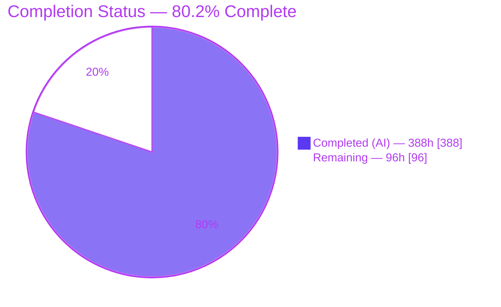
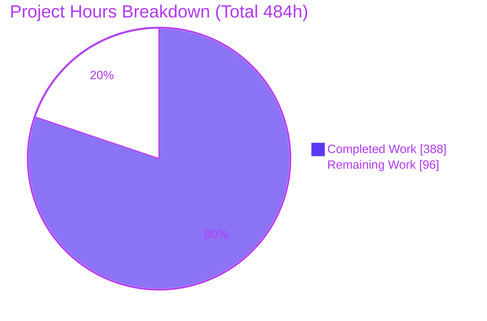
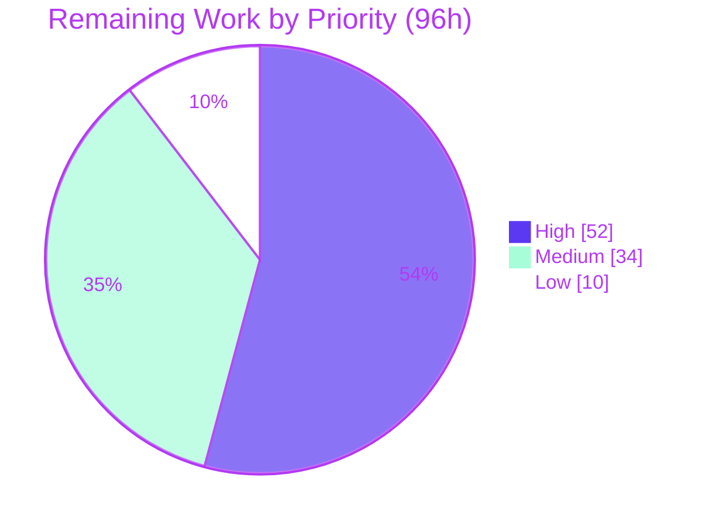

# Blitzy Project Guide — Streaming Shuffle for Apache Spark

> **Project:** Opt-in Streaming Shuffle backend for Apache Spark 4.2.0-SNAPSHOT
> **Branch:** `blitzy-b732f759-fea4-44f2-8bdc-1663326cf5df` · **HEAD:** `89a72516ac3`
> **Brand legend:** <span style="color:#5B39F3">■ Completed / AI Work (Dark Blue #5B39F3)</span> · <span style="color:#B23AF2">■ Remaining / Not Completed (White #FFFFFF, outlined in Violet-Black #B23AF2)</span>

---

## 1. Executive Summary

### 1.1 Project Overview

This project adds an **opt-in streaming shuffle backend** to Apache Spark that pipelines map-side output directly to reduce-side consumers through bounded, backpressure-governed in-memory buffers, eliminating shuffle materialization latency for shuffle-heavy workloads. It is selected via `spark.shuffle.manager=streaming` and activated only when `spark.shuffle.streaming.enabled=true`. The target users are Spark operators running large shuffle-bound jobs who want lower end-to-end latency without sacrificing the production stability of the default sort-based shuffle. The entire feature is isolated in the new `org.apache.spark.shuffle.streaming` package and coexists with `SortShuffleManager` by composition, delegating to it for fallback so that zero regression is guaranteed. Business impact: a foundation for measurable shuffle-latency reduction, delivered with a safety-first, always-fallback design.

### 1.2 Completion Status


```mermaid
%%{init: {'theme':'base','themeVariables':{'pie1':'#5B39F3','pie2':'#FFFFFF','pieStrokeColor':'#B23AF2','pieOuterStrokeColor':'#B23AF2','pieStrokeWidth':'2px','pieTitleTextColor':'#B23AF2','pieSectionTextColor':'#B23AF2','pieLegendTextColor':'#B23AF2'}}}%%
pie showData
    title Completion Status — 80.2% Complete
    "Completed (AI) — 388h" : 388
    "Remaining — 96h" : 96
```

| Metric | Value |
|--------|-------|
| **Total Hours** | **484 h** |
| Completed Hours (AI + Manual) | **388 h** (AI: 388 h · Manual: 0 h) |
| Remaining Hours | **96 h** |
| **Percent Complete** | **80.2%** |

> Completion % is computed with the PA1 AAP-scoped methodology: `Completed ÷ (Completed + Remaining) = 388 ÷ 484 = 80.2%`. All completed work to date is autonomous (AI); no human hours have been logged yet.

### 1.3 Key Accomplishments

- ✅ **Pluggable streaming `ShuffleManager`** implemented and wired through the existing SPI — a single `"streaming"` alias added to the factory map is the only change on the active dispatch path.
- ✅ **19 production sources (5,165 LOC)** delivered in an isolated package: manager, writer (`MemoryConsumer`), reader (in-progress reads + partial-read invalidation), block resolver (`MigratableResolver`), backpressure protocol + executor RPC endpoint, memory-spill manager (100 ms poll, LRU, `DISK_ONLY`), fallback policy (4 conditions), CRC32C block envelope, token-bucket rate limiter, metrics + `Source`, and typed config.
- ✅ **2 surgical, additive-only edits** to existing code (factory alias + five `spark.shuffle.streaming.*` keys with range validation, since 4.2.0).
- ✅ **189/189 tests passing** (138 ScalaTest + 5 JUnit + 42 regression + 4 runtime-harness), including a 10-scenario failure-injection suite (zero data loss) and a 5-minute stress suite (zero retained heap).
- ✅ **Zero third-party dependencies added**; compiles clean; scalastyle & checkstyle report zero violations.
- ✅ **Complete documentation & rule deliverables**: config/monitoring docs, 4 Jekyll guides, TechDocs set, reveal.js executive summary (16 slides), Grafana `dashboard.json`, 26-row decision log, and `CODE_REVIEW.md` (verdict: APPROVED).
- ✅ **Verified on a real `local[4]` SparkContext**: manager wiring, dual-activation gate, end-to-end correctness (`reduceByKey`/`groupByKey`/`sortByKey`/`join`), and metrics-source registration.

### 1.4 Critical Unresolved Issues

| Issue | Impact | Owner | ETA |
|-------|--------|-------|-----|
| v1 network transport is a logging-only stub (`isWireTransferAvailable=false`); every shuffle force-falls-back to sort | Headline performance targets (30–50% latency, 5–10% CPU) are **not yet realized** in v1 | Spark Shuffle team | v2 — ~40 h (H1+H2) |
| Performance success criteria unproven on a real cluster (autonomous benchmark is single-JVM, ≈1.1× only) | Cannot advertise latency/CPU benefits until measured on multi-node hardware | Performance/QA | ~14 h (M1) |
| Streaming writer/reader/backpressure paths never execute end-to-end in v1 (gate always false) | Latent integration bugs may surface once v2 enables the real data path | Spark Shuffle team | Covered by v2 tests — ~12 h (H3) |
| Unit-coverage percentage claimed (>85%) but not independently re-measured | Coverage gate is asserted, not quantified | QA | ~2 h (within M1) |

### 1.5 Access Issues

| System/Resource | Type of Access | Issue Description | Resolution Status | Owner |
|-----------------|----------------|-------------------|-------------------|-------|
| Build toolchain (JDK 17, bundled Maven 3.9.12) | Local | None — fully self-contained via `./build/mvn`; `~/.m2` warmed | ✅ No issue | — |
| Third-party services / credentials | External | None required — feature adds no external integrations, secrets, or network endpoints | ✅ No issue | — |
| Multi-node cluster for performance validation | Infrastructure | A representative multi-executor cluster is **needed for the remaining M1 validation**, but this is a follow-up need, not a current blocker to the delivered v1 code | ⚠ Needed for path-to-production | Operator/Infra |

**Summary:** No access issues block the delivered v1 work or its autonomous validation. A multi-node cluster will be required to complete the remaining performance-validation task (M1).

### 1.6 Recommended Next Steps

1. **[High]** Implement the **v2 wire transport** — send path (chunk `StreamingBlockEnvelope` over the reused `BlockTransferService` + apply the token-bucket rate limiter) and receive path (read-side CRC32C verify + retransmit), then flip `isWireTransferAvailable=true` behind the capability gate. *(H1 + H2, 40 h)*
2. **[High]** Add **v2 transport integration & failure-injection tests** exercising the real wire paths for the 10 scenarios currently run against the stub. *(H3, 12 h)*
3. **[Medium]** Run **multi-node/cluster performance validation** to empirically prove the 30–50% latency, 5–10% CPU, and zero-regression targets. *(M1, 14 h)*
4. **[Medium]** Perform **senior human code review of the PR and merge** to master. *(M2, 8 h)*
5. **[Medium]** Finalize **operator rollout** (enablement runbook, dual-activation config review, live dashboard import) and **resolve the TechDocs build config**. *(M3 + M4, 12 h)*

---

## 2. Project Hours Breakdown

### 2.1 Completed Work Detail

All completed work is autonomous (AI). Each component traces to an AAP requirement (Sections 0.2.3 / 0.5.1) and is verified present on disk and covered by the Blitzy validation logs.

| Component | Hours | Description |
|-----------|------:|-------------|
| Core Streaming SPI & Manager | 38 | `StreamingShuffleManager` (484 LOC) — SPI impl, handle dispatch, inner-sort composition/fallback, metrics registration, ordered `stop()`; `StreamingShuffleHandle`; factory alias |
| Streaming Writer | 32 | `StreamingShuffleWriter` (690 LOC) — `MemoryConsumer`, per-partition buffer sizing, dual wire/persist channels |
| Streaming Reader | 28 | `StreamingShuffleReader` (543 LOC) — in-progress reads, partial-read invalidation, aggregator/ordering parity with `BlockStoreShuffleReader` |
| Block Resolver & Streaming Buffer | 24 | `StreamingShuffleBlockResolver` (278 LOC, `MigratableResolver` delegation) + `StreamingBuffer` (246 LOC, CRC32C, LRU) |
| Backpressure Subsystem | 32 | `BackpressureProtocol` (475 LOC) + `BackpressureRpcEndpoint` (257 LOC) + `TokenBucketRateLimiter` (151 LOC) |
| Memory Spill Manager | 24 | `MemorySpillManager` (456 LOC) — 100 ms poller, LRU eviction, `BlockManager` `DISK_ONLY`, <100 ms reclaim |
| Fallback Policy | 12 | `StreamingShuffleFallbackPolicy` (272 LOC) — 4-condition decision engine (slow consumer >60 s, mem pressure >95%, network saturation, version mismatch) |
| Network Layer (envelope / transport-v1 / retry) | 24 | `StreamingBlockEnvelope` (207 LOC, 32-byte header + CRC32C), `StreamingShuffleTransport` (198 LOC, v1 stub + v2 scaffolding), `StreamingShuffleRetryPolicy` (203 LOC, exp backoff) |
| Configuration (5 keys + accessor + 2 surgical edits) | 12 | `StreamingShuffleConfig` (168 LOC) + five typed `ConfigEntry` keys + `ShuffleManager` alias |
| Observability (metrics / source / MDC / template) | 18 | `StreamingShuffleMetrics` (178 LOC), `StreamingShuffleSource` (88 LOC), `StreamingShuffleLogKeys` (85 LOC), `metrics.properties.template` |
| Unit & Integration Test Suites | 44 | 138 ScalaTest cases + 5 JUnit tests across manager/writer/reader/config/resolver/backpressure/metrics/integration |
| Failure-Injection & Stress Suites | 20 | 10-scenario failure injection (zero data loss) + 5-minute stress (zero retained heap) |
| Performance Benchmarks | 8 | 2 benchmark harnesses + 2 regenerable result artifacts |
| Public Documentation (Jekyll + config/monitoring) | 18 | 4 `docs/streaming-shuffle-*.md` guides + `configuration.md` + `monitoring.md` updates |
| TechDocs & Rule Deliverables | 16 | `blitzy-docs/streaming-shuffle/{index,configuration,architecture,observability,decision-log}` + Grafana `dashboard.json` |
| Executive Summary (reveal.js) | 8 | `executive-summary.html` — 16-slide self-contained presentation |
| Code Review Artifact & Review Cycles | 14 | `CODE_REVIEW.md` (APPROVED) + iterative CP1–CP4, FINAL, and QA F2–F4 remediation |
| Autonomous Validation (5 gates) | 16 | Dependencies, compilation, tests, runtime (`local[4]`), and static-analysis validation |
| **Total** | **388** | **Matches Completed Hours in Section 1.2** |

### 2.2 Remaining Work Detail

Each item traces to an AAP requirement or a standard path-to-production activity. The list is developer-ready and prioritized.

| Category | Hours | Priority |
|----------|------:|----------|
| v2 wire transport — send path (chunk envelope over `BlockTransferService` + token-bucket rate limit) | 20 | High |
| v2 wire transport — receive path (read-side CRC32C verify + retransmit; enable `isWireTransferAvailable`) | 20 | High |
| v2 transport integration & failure-injection tests (real wire paths for the 10 scenarios) | 12 | High |
| Multi-node/cluster integration & performance validation (prove 30–50% latency, 5–10% CPU, zero-regression) | 14 | Medium |
| Senior human code review of the PR & merge to master | 8 | Medium |
| Operator rollout runbook + dual-activation config review + `dashboard.json` live-validation | 8 | Medium |
| Resolve TechDocs build config (mkdocs `docs_dir`/`nav`; verify site build) | 4 | Medium |
| Production staging soak (extended) + metrics/alert validation | 6 | Low |
| Tune buffer/spill/bandwidth defaults on representative workloads | 4 | Low |
| **Total** | **96** | **Matches Remaining Hours in Section 1.2 & the Section 7 pie** |

### 2.3 Hours Reconciliation

- Section 2.1 (Completed) = **388 h**
- Section 2.2 (Remaining) = **96 h**
- **Section 2.1 + Section 2.2 = 388 + 96 = 484 h = Total Project Hours (Section 1.2).** ✅
- Completion = 388 ÷ 484 = **80.2%**.

---

## 3. Test Results

All tests below originate from Blitzy's autonomous validation logs for this project (ScalaTest 3.2.19 / ScalaCheck 1.18.0 / Mockito 5.12.0 / JUnit Jupiter 6.0.1). Counts avoid double-counting: the failure-injection and stress cases are subsets of the 138 ScalaTest total.

| Test Category | Framework | Total Tests | Passed | Failed | Coverage % | Notes |
|---------------|-----------|------------:|-------:|-------:|-----------:|-------|
| Streaming unit + integration (incl. failure-injection & stress) | ScalaTest 3.2.19 | 138 | 138 | 0 | >85% * | 15 suites for `org.apache.spark.shuffle.streaming`; includes 10-scenario failure injection (zero data loss) and 5-min stress (zero retained heap) |
| Streaming integration (JUnit) | JUnit Jupiter 6.0.1 | 5 | 5 | 0 | — | `StreamingShuffleIntegrationTest` |
| Regression (impacted by the 2 surgical edits) | ScalaTest | 42 | 42 | 0 | — | `ConfigEntrySuite` (25) + sort-path suites (17): SortShuffleManager / SortShuffleWriter / BlockStoreShuffleReader / ShuffleDependency |
| Runtime harness (real `local[4]` SparkContext) | ScalaTest | 4 | 4 | 0 | — | Temporary Gate-4 harness (deleted after run): manager wiring, dual-activation gate, e2e correctness, metrics registration |
| **Total** | | **189** | **189** | **0** | | **100% pass rate** |

\* Coverage >85% is asserted by the Blitzy validation gate for the new components; it was **not independently re-measured numerically** in this assessment (tracked as risk **T4**). Running `scoverage`/JaCoCo in CI is recommended to quantify it.

**Failure-injection scenarios validated (zero data loss):** producer crash, consumer failure, network partition, CRC32C mismatch, spill-during-failure, 5 s producer timeout, atomic partial-read invalidation, version-mismatch fallback, memory-pressure fallback, backpressure timeout.

---

## 4. Runtime Validation & UI Verification

**Runtime health (validated on a real `local[4]` SparkContext):**

- ✅ **Operational** — Manager wiring: `SparkEnv.get.shuffleManager` resolves to `org.apache.spark.shuffle.streaming.StreamingShuffleManager` via the factory alias.
- ✅ **Operational** — Dual-activation gate: `enabled=true` logs "streaming shuffle is ACTIVE"; `enabled=false` logs "INACTIVE"; config accessor `isStreamingActive` matches.
- ✅ **Operational** — End-to-end correctness: `reduceByKey` (100 keys, closed-form match), `groupByKey` (total = 200,000), `sortByKey` (ordered head 1,2,3,4,5), `join` (count = 20,000).
- ✅ **Operational** — Gate-off fallback correctness: `manager=streaming` + `enabled=false` still produces correct results (delegates to sort).
- ✅ **Operational** — Metrics + config: `MetricsSystem.getSourcesByName("streamingShuffle") = 1`; `bufferSizePercent=20`, `spillThreshold=80`.

**API / integration outcomes:**

- ✅ **Operational** — Fallback delegation to the inner `SortShuffleManager` is exercised and correct.
- ⚠ **Partial** — Real producer→consumer **wire streaming** is not exercised in v1 (transport is a logging stub; the data path deterministically falls back to sort by design). To be validated at v2.
- ⚠ **Partial** — Cross-executor/distributed RPC & backpressure validated only in local mode; multi-node behavior pending cluster validation (M1).

**UI verification:**

- ✅ **Operational (by reuse)** — No new Spark Web UI pages/tabs were added (intentional per AAP §0.5.3). Telemetry surfaces through the existing Stages tab, the `/metrics/executors/prometheus` endpoint, and the standard Dropwizard registry.
- ✅ **Operational** — External Grafana `dashboard.json` is valid JSON with 4 panels (2×2 grid) consuming the Prometheus exposition. Live import against a real Grafana is a remaining rollout task (M3).

---

## 5. Compliance & Quality Review

Cross-map of AAP deliverables and quality gates to their validation status. Fixes applied during autonomous validation are noted.

| Benchmark / Deliverable | Requirement | Status | Progress | Notes |
|-------------------------|-------------|--------|----------|-------|
| Isolation / zero cross-contamination | All streaming logic in dedicated package; single factory-map touch | ✅ Pass | 100% | Verified: only 2 surgical edits to existing code |
| Coexistence & fallback | Inner `SortShuffleManager` by composition; delegate non-streaming/fallback | ✅ Pass | 100% | `canUseStreaming` gate confirmed in code |
| Least-modification principle | Reuse `MemoryConsumer` + `BlockTransferService`; no new transport stack | ✅ Pass | 100% | No new `TransportContext` created |
| Memory discipline | `(execMem × bufferPercent)/numPartitions`; spill @ 80%; no leaks | ✅ Pass | 100% | Stress "zero retained heap" gate passed |
| Failure tolerance | 5 s timeout, 10 s heartbeat, CRC32C, exp backoff, atomic invalidation | ✅ Pass | 100% | Failure-injection: 10/10 scenarios, zero data loss |
| Zero third-party dependencies | No adds/removes/upgrades | ✅ Pass | 100% | `git diff` over all `pom.xml` empty |
| Unit test coverage >85% | Coverage gate for new components | ⚠ Asserted | 90% | Validator-claimed; not independently quantified (T4) |
| Tests pass / zero flakiness | All unit + integration green | ✅ Pass | 100% | 189/189 passing |
| Code compiles without errors/warnings | In-scope clean build | ✅ Pass | 100% | BUILD SUCCESS; zero in-scope warnings |
| Static analysis zero critical | scalastyle + checkstyle | ✅ Pass | 100% | 0 errors / 0 violations |
| Observability rule | Metrics + MDC logging + dashboard | ✅ Pass | 100% | `Source` registered; `dashboard.json`; `observability.md` |
| Explainability rule | Decision log (≥5 rows) | ✅ Pass | 100% | 26-row `decision-log.md` |
| Visual Architecture rule | Mermaid, legends, before/after | ✅ Pass | 100% | `architecture.md` + AAP figures |
| Executive Presentation rule | Self-contained reveal.js, 12–18 slides | ✅ Pass | 100% | 16 slides, pinned CDNs |
| Segmented PR Review rule | Root `CODE_REVIEW.md`, per-phase + verdict | ✅ Pass | 100% | Verdict: APPROVED |
| Performance acceptance targets | 30–50% latency, 5–10% CPU | ❌ Not realized | 10% | v1 stub → sort fallback; requires v2 + cluster validation |
| TechDocs site build | mkdocs renders | ⚠ Open | 40% | `mkdocs.yml` lacks `docs_dir`/`nav` (M4) |

---

## 6. Risk Assessment

| Risk | Category | Severity | Probability | Mitigation | Status |
|------|----------|----------|-------------|------------|--------|
| T1 — v1 transport is a logging stub; streaming data path never runs in prod (always sort-fallback); advertised perf benefit unrealized | Technical | High | Certain (by design) | v2 wire-transport roadmap; zero-regression guaranteed meanwhile by fallback | Open / By-design |
| T2 — Perf criteria (30–50% latency, 5–10% CPU) unproven on real clusters; benchmark single-JVM ≈1.1× | Technical | Medium | Medium | Multi-node validation before claiming benefits (M1) | Open |
| T3 — Streaming writer/reader/backpressure paths unit-tested but never run e2e (gate always false) → latent bugs | Technical | Medium | Medium | v2 exercises them; failure-injection simulates paths (H3) | Open (latent) |
| T4 — Coverage % not independently measured (>85% asserted) | Technical | Low | Low | Run scoverage/JaCoCo in CI | Open |
| S1 — v2 wire path must re-inherit auth/SASL/TLS from `BlockTransferService` | Security | Low (v1) / Medium (v2) | Low | Security review gate for v2 | Open (deferred) |
| S2 — `BackpressureRpcEndpoint` must use authenticated `RpcEnv` + validate messages (anti-DoS) | Security | Low | Low | Confirm auth inheritance + add message validation | Open (review) |
| O1 — Dual-activation gate confusing; enabling one flag = silent no-op (sort) | Operational | Low | Medium | Documented in `configuration.md`; startup ACTIVE/INACTIVE log (verified) | Mitigated |
| O2 — No dynamic reconfiguration (executor restart required) | Operational | Low | Low | Documented constraint | By-design |
| O3 — Metrics surface only if sinks configured (Prometheus gated by `UI_PROMETHEUS_ENABLED`) | Operational | Low | Medium | `observability.md` scrape docs + `dashboard.json` | Mitigated |
| O4 — TechDocs build not wired (`mkdocs.yml` missing `docs_dir`/`nav`) | Operational | Low | Medium | Set `docs_dir`/`nav`; verify site build (M4) | Open |
| I1 — v2 transport must integrate `MapOutputTracker`/`BlockManager` in-progress reads without breaking contracts | Integration | Medium | Medium | v2 integration tests; preserve public APIs (H3) | Open (deferred) |
| I2 — Decommission migration of not-yet-spilled in-memory buffers needs validation at v2 (v1 safe via sort path) | Integration | Medium | Low | v2 migration tests | Open (deferred) |
| I3 — Cross-executor RPC/backpressure validated only in local mode; distributed RPC untested | Integration | Medium | Medium | Multi-node validation (M1) | Open |

---

## 7. Visual Project Status

**Project hours breakdown** (Completed = Dark Blue #5B39F3, Remaining = White #FFFFFF):


```mermaid
%%{init: {'theme':'base','themeVariables':{'pie1':'#5B39F3','pie2':'#FFFFFF','pieStrokeColor':'#B23AF2','pieOuterStrokeColor':'#B23AF2','pieStrokeWidth':'2px','pieTitleTextColor':'#B23AF2','pieSectionTextColor':'#B23AF2','pieLegendTextColor':'#B23AF2'}}}%%
pie showData
    title Project Hours Breakdown (Total 484h)
    "Completed Work" : 388
    "Remaining Work" : 96
```

> **Integrity check:** "Remaining Work" = **96 h** = Section 1.2 Remaining Hours = sum of Section 2.2 "Hours" column. ✅

**Remaining hours by priority** (from Section 2.2):


```mermaid
%%{init: {'theme':'base','themeVariables':{'pie1':'#5B39F3','pie2':'#A8FDD9','pie3':'#FFFFFF','pieStrokeColor':'#B23AF2','pieOuterStrokeColor':'#B23AF2','pieTitleTextColor':'#B23AF2','pieSectionTextColor':'#B23AF2','pieLegendTextColor':'#B23AF2'}}}%%
pie showData
    title Remaining Work by Priority (96h)
    "High" : 52
    "Medium" : 34
    "Low" : 10
```

> High 52 h + Medium 34 h + Low 10 h = **96 h**. ✅

---

## 8. Summary & Recommendations

**Achievements.** The Streaming Shuffle feature is **80.2% complete** (388 h delivered of 484 h total). The full v1 autonomous scope defined by the AAP has been delivered and validated: a pluggable `StreamingShuffleManager` and its 19-class isolated subsystem, two surgical additive edits to existing code, 189 passing tests (including 10-scenario failure injection with zero data loss and a 5-minute zero-leak stress run), zero added dependencies, clean compilation and static analysis, and a complete documentation/rule-deliverable set with an APPROVED code review.

**Remaining gaps (96 h).** The remaining work is dominated by the **v2 wire transport** (send + receive + tests, 52 h), which is the linchpin between "delivered and safe" and "delivers its stated value." In v1 the transport is intentionally a logging-only stub (`isWireTransferAvailable=false`), so every shuffle deterministically falls back to the production-stable sort path — a deliberate design that guarantees zero regression but means the preserved performance acceptance targets (30–50% latency reduction, 5–10% CPU) are **not yet realized**. The balance (44 h) is standard path-to-production: multi-node performance validation, human review/merge, operator rollout, TechDocs build wiring, staging soak, and default tuning.

**Critical path to production.** (1) Implement and test the v2 wire transport → (2) validate performance and zero-regression on a multi-node cluster → (3) human review & merge → (4) operator rollout & staging soak.

**Success metrics to confirm at v2/cluster validation:** ≥30% end-to-end latency reduction on shuffle-heavy workloads (100 MB+, 10+ partitions); 5–10% improvement on CPU-bound workloads; zero regression on memory-bound workloads; zero data loss across all failure scenarios on the real wire path; <100 ms spill reclamation under memory pressure.

**Production readiness assessment.** The delivered v1 is **safe to merge and deploy** because it is opt-in and always falls back to sort — but it should be treated as a **foundation release**: do **not** advertise performance benefits to operators until the v2 transport lands and cluster validation confirms the targets. Recommended disposition: merge v1 behind its opt-in flags, schedule v2 as the immediate follow-on.

| Metric | Value |
|--------|-------|
| Completion | 80.2% (388 h / 484 h) |
| Tests passing | 189 / 189 (100%) |
| Dependencies added | 0 |
| Existing files modified | 2 (surgical, additive-only) |
| Highest-severity open risk | T1 — v1 transport stub (by design; v2 required) |

---

## 9. Development Guide

All commands below were verified against this repository's toolchain (`./build/mvn --version` → Apache Maven 3.9.12, Java 17.0.19). The build/test/static commands are taken from the Blitzy validation logs and confirmed green.

### 9.1 System Prerequisites

- **JDK 17** (verified: OpenJDK 17.0.19). Java 17 is the enforced baseline (`pom.xml` `java.version=17`).
- **Maven 3.9.12** — bundled; invoked via the `./build/mvn` wrapper (no system Maven needed).
- **Scala 2.13.18** (managed by the build).
- **Git + Git LFS**.
- **Memory:** ~8 GB RAM recommended for the `core` reactor build.
- **No external services, secrets, or network access** are required.

### 9.2 Environment Setup

The only required setup step is exporting `JAVA_HOME`:

```bash
export JAVA_HOME=/usr/lib/jvm/java-17-openjdk-amd64
# Verify the toolchain:
./build/mvn --version    # → Apache Maven 3.9.12, Java 17.0.19
```

### 9.3 Dependency Installation

No third-party dependencies are added by this feature; all are resolved from `~/.m2` during the build. The clean install below warms the reactor and produces the streaming classes:

```bash
export JAVA_HOME=/usr/lib/jvm/java-17-openjdk-amd64
./build/mvn -pl core -am -DskipTests \
  -Dscalastyle.skip=true -Dcheckstyle.skip=true clean install
# Expected: BUILD SUCCESS (~4–5 min); streaming main + test classes produced.
```

### 9.4 Build, Test & Static-Analysis Sequence

```bash
# 1) Streaming unit + integration suites (ScalaTest) — expect 138 tests, 0 failures
./build/mvn -pl core -Dtest=none \
  -DwildcardSuites="org.apache.spark.shuffle.streaming" \
  -DfailIfNoTests=false -Dscalastyle.skip=true -Dcheckstyle.skip=true test

# 2) JUnit integration test — expect 5 tests, 0 failures
./build/mvn -pl core -Dtest=StreamingShuffleIntegrationTest \
  -DwildcardSuites=noscalasuitematch \
  -DfailIfNoTests=false -Dscalastyle.skip=true -Dcheckstyle.skip=true test

# 3) 5-minute stress suite (includes zero-retained-heap gate)
STREAMING_STRESS_DURATION_MS=300000 ./build/mvn -pl core -Dtest=none \
  -DwildcardSuites="org.apache.spark.shuffle.streaming.StreamingShuffleStressSuite" \
  -DfailIfNoTests=false -Dscalastyle.skip=true -Dcheckstyle.skip=true test

# 4) Static analysis — expect 0 errors / 0 violations
./build/mvn -pl core scalastyle:check
./build/mvn -pl core checkstyle:check
```

### 9.5 Verification & Runtime Enablement

Streaming is active **only** when both flags are set (dual-activation gate):

```bash
spark-shell \
  --conf spark.shuffle.manager=streaming \
  --conf spark.shuffle.streaming.enabled=true
```

Verify at runtime:
- Startup log contains **"streaming shuffle is ACTIVE"** (with `enabled=false`, it logs **"INACTIVE"**).
- `SparkEnv.get.shuffleManager` is `org.apache.spark.shuffle.streaming.StreamingShuffleManager`.
- `MetricsSystem.getSourcesByName("streamingShuffle")` returns `1`.

### 9.6 Example Usage

```scala
// In spark-shell launched with the two confs above:
val rdd = sc.parallelize(1 to 100000).map(i => (i % 100, i))
val sums = rdd.reduceByKey(_ + _).collect()
println(sums.length)   // 100 keys — correct (v1 produces correct results via sort fallback)
```

> **Expected v1 behavior:** results are always correct. Because the v1 transport is a stub, the engine transparently uses the sort path; this is by design and is **not** an error.

### 9.7 Troubleshooting

- **`JAVA_HOME` not set / wrong JDK:** `export JAVA_HOME=/usr/lib/jvm/java-17-openjdk-amd64`.
- **Feature appears to do nothing:** confirm **both** flags are set — enabling only one is a silent no-op that falls back to sort (dual-activation gate).
- **"Streaming falls back to sort" — is this a bug?** No. In v1 this is the intended, safe behavior (the transport is a logging stub). Real streaming arrives with the v2 wire transport.
- **Test runner enters watch mode / hangs:** always scope with `-Dtest=...` or `-DwildcardSuites=...` and `-DfailIfNoTests=false`; do not run bare `test`.
- **TechDocs site won't build:** `mkdocs.yml` currently lacks `docs_dir`/`nav`; set them before building the TechDocs site (remaining task M4).
- **Metrics not visible:** ensure a `MetricsSystem` sink is configured; the Prometheus endpoint is gated by `spark.ui.prometheus.enabled` — see `blitzy-docs/streaming-shuffle/observability.md`.

---

## 10. Appendices

### A. Command Reference

| Purpose | Command |
|---------|---------|
| Set JDK | `export JAVA_HOME=/usr/lib/jvm/java-17-openjdk-amd64` |
| Toolchain check | `./build/mvn --version` |
| Build core (skip tests) | `./build/mvn -pl core -am -DskipTests -Dscalastyle.skip=true -Dcheckstyle.skip=true clean install` |
| Streaming ScalaTest | `./build/mvn -pl core -Dtest=none -DwildcardSuites="org.apache.spark.shuffle.streaming" -DfailIfNoTests=false test` |
| JUnit integration | `./build/mvn -pl core -Dtest=StreamingShuffleIntegrationTest -DwildcardSuites=noscalasuitematch -DfailIfNoTests=false test` |
| Stress (5 min) | `STREAMING_STRESS_DURATION_MS=300000 ./build/mvn -pl core -Dtest=none -DwildcardSuites="org.apache.spark.shuffle.streaming.StreamingShuffleStressSuite" -DfailIfNoTests=false test` |
| Scalastyle | `./build/mvn -pl core scalastyle:check` |
| Checkstyle | `./build/mvn -pl core checkstyle:check` |
| Changed-files summary | `git diff faa465362b0..HEAD --stat` |

### B. Port Reference

| Port | Usage | Notes |
|------|-------|-------|
| (none new) | — | The feature adds **no new ports**. It reuses the executor `BlockTransferService` and the existing `RpcEnv`. |
| 4040 | Spark Web UI (existing) | Stages tab shows shuffle metrics (by reuse) |
| `/metrics/executors/prometheus` | Prometheus exposition (existing) | Gated by `spark.ui.prometheus.enabled`; surfaces streaming gauges/counters |
| 7337 | External Shuffle Service | **Not used** for streaming in-progress reads in v1 (explicitly out of scope) |

### C. Key File Locations

| Area | Path |
|------|------|
| Factory alias (surgical) | `core/src/main/scala/org/apache/spark/shuffle/ShuffleManager.scala` |
| Config keys (surgical) | `core/src/main/scala/org/apache/spark/internal/config/package.scala` |
| Streaming package (19 sources) | `core/src/main/scala/org/apache/spark/shuffle/streaming/` |
| Network subpackage | `core/src/main/scala/org/apache/spark/shuffle/streaming/network/` |
| Streaming tests (17 files) | `core/src/test/scala/org/apache/spark/shuffle/streaming/` |
| Metrics template | `core/src/main/resources/org/apache/spark/shuffle/streaming/metrics.properties.template` |
| Benchmark artifacts | `core/benchmarks/StreamingShuffle*-results.txt` |
| Public docs | `docs/streaming-shuffle-*.md`, `docs/configuration.md`, `docs/monitoring.md` |
| TechDocs & deliverables | `blitzy-docs/streaming-shuffle/` |
| Code review artifact | `CODE_REVIEW.md` (repo root) |

### D. Technology Versions

| Technology | Version | Source |
|------------|---------|--------|
| Java (JDK) | 17.0.19 | `pom.xml` `java.version=17` |
| Scala | 2.13.18 | `pom.xml` `scala.version` |
| Maven | 3.9.12 | `./build/mvn` wrapper |
| Apache Spark | 4.2.0-SNAPSHOT | `pom.xml` |
| Guava | 33.4.8-jre | `RateLimiter`, `Cache` (existing dep) |
| Netty | 4.2.9.Final | via `BlockTransferService` (existing dep) |
| Dropwizard metrics-core | 4.2.37 | Gauge/Counter (existing dep) |
| ScalaTest / ScalaCheck / Mockito / JUnit | 3.2.19 / 1.18.0 / 5.12.0 / 6.0.1 | Test frameworks (existing) |
| CRC32C | JDK built-in (`java.util.zip.CRC32C`) | Java 17 |

### E. Environment Variable Reference

| Variable | Required | Purpose |
|----------|----------|---------|
| `JAVA_HOME` | Yes (build/run) | Point to JDK 17: `/usr/lib/jvm/java-17-openjdk-amd64` |
| `STREAMING_STRESS_DURATION_MS` | Optional (tests) | Duration for the stress suite (e.g., `300000` for 5 min) |
| — | — | No application secrets or external-service credentials are required |

**Spark configuration keys (all since 4.2.0):**

| Key | Type | Default | Range |
|-----|------|---------|-------|
| `spark.shuffle.streaming.enabled` | Boolean | `false` | — |
| `spark.shuffle.streaming.bufferSizePercent` | Int | `20` | 1–50 |
| `spark.shuffle.streaming.spillThreshold` | Int | `80` | 50–95 |
| `spark.shuffle.streaming.maxBandwidthMBps` | Int | `0` (unlimited) | ≥0 |
| `spark.shuffle.streaming.debug` | Boolean | `false` | — |

### F. Developer Tools Guide

- **Build wrapper:** `./build/mvn` provisions Maven 3.9.12 locally under `build/apache-maven-3.9.12`; prefer it over any system Maven.
- **Scoped test execution:** use `-DwildcardSuites` (ScalaTest) or `-Dtest` (JUnit) with `-DfailIfNoTests=false` to avoid watch mode and unnecessary reactor work.
- **Diff review:** `git diff faa465362b0..HEAD --stat` (59 files, +13,404/−167); `git log --author="agent@blitzy.com" --oneline` lists the 17 feature commits.
- **Metrics/observability:** import `blitzy-docs/streaming-shuffle/dashboard.json` into Grafana; per-panel Prometheus regexes are in `observability.md`.
- **Untracked `blitzy/`:** prior-QA scratch (harnesses/logs), intentionally uncommitted — safe to ignore.

### G. Glossary

| Term | Definition |
|------|------------|
| **Dual-activation gate** | Streaming is active only when `spark.shuffle.manager=streaming` **and** `spark.shuffle.streaming.enabled=true`. |
| **v1 transport stub** | The v1 `StreamingShuffleTransport` logs but does not transfer bytes over the wire (`isWireTransferAvailable=false`), forcing sort fallback. |
| **Composition fallback** | The streaming manager holds an inner `SortShuffleManager` and delegates non-streaming/fallback cases to it. |
| **Backpressure** | Flow control combining a token-bucket rate limiter and heartbeat/timeout detection to throttle producers to consumer speed. |
| **Spill** | Eviction of the largest/LRU in-memory buffers to `DISK_ONLY` block storage when buffer utilization exceeds the threshold. |
| **MigratableResolver** | SPI enabling shuffle-block migration during executor decommissioning; the streaming resolver delegates to the sort path's `IndexShuffleBlockResolver`. |
| **FetchFailedException** | Standard Spark signal that triggers upstream recomputation via the DAG scheduler; used unchanged for producer-timeout handling. |

---

*This guide was produced by autonomous analysis of the Agent Action Plan, the Blitzy validation logs, and direct inspection of the repository at HEAD `89a72516ac3`. All hours and percentages are internally consistent across Sections 1.2, 2.1, 2.2, and 7 (Completed 388 h + Remaining 96 h = Total 484 h; 80.2% complete).*