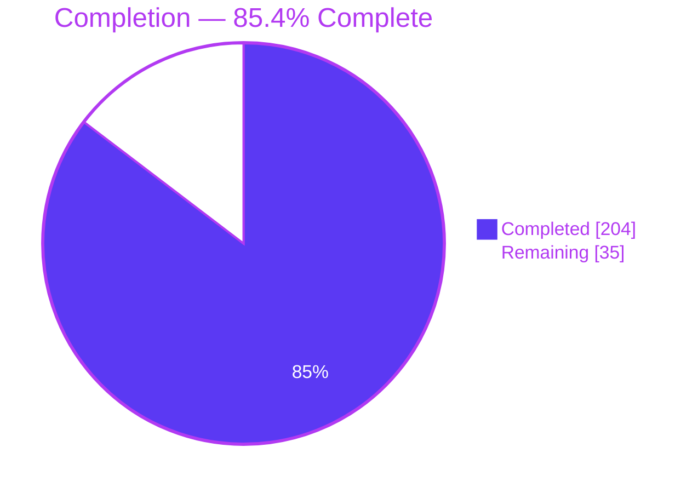
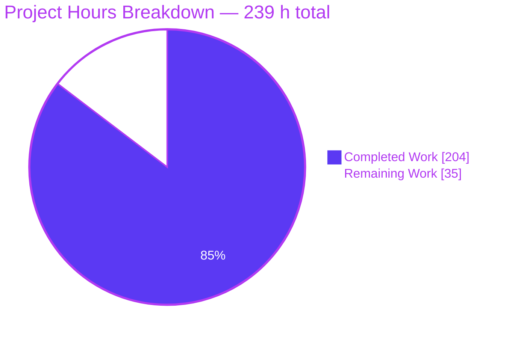
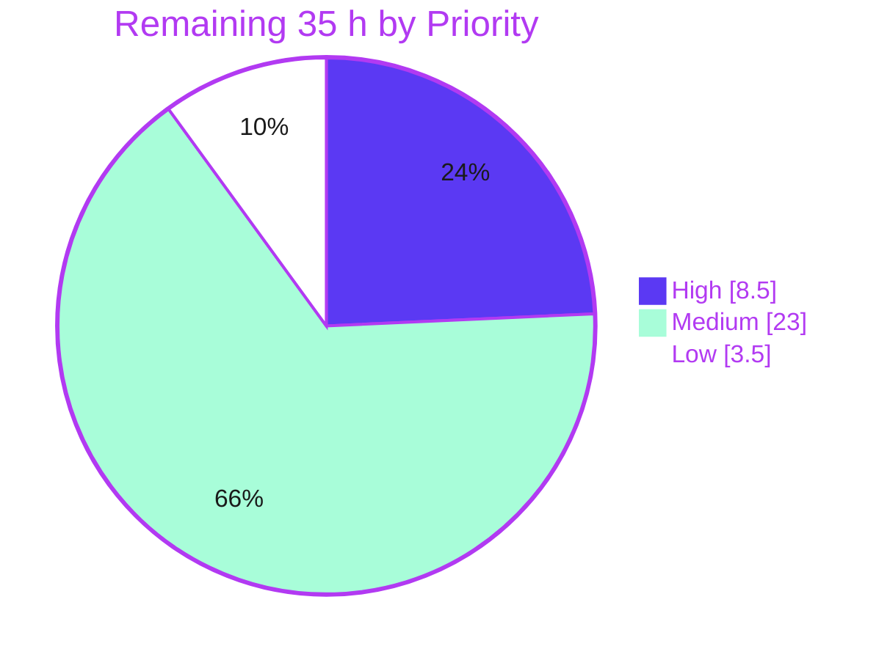

# 1. Executive Summary

## 1.1 Project Overview

This project runs a provisioned open-source security-scanner harness against Apache Spark pinned at commit `59b8a448` (2025-10-23) and turns nine heterogeneous scanner outputs into one queryable dataset. Each scanner ran once with its baked configuration; every artifact was normalized into a twelve-field row schema published as `oss-scan-results/findings.json` and `findings.csv`; and a Joern probe asked whether an open-source tool can express a missing-authorization reachability class at all. The reader is the security engineer who will later compare this open-source half against commercial results. Nothing is installed, built or judged: four Markdown records state what ran, at what version, against what feed state.

## 1.2 Completion Status


```mermaid
%%{init: {'theme':'base','themeVariables':{'pie1':'#5B39F3','pie2':'#FFFFFF','pieStrokeColor':'#B23AF2','pieOuterStrokeColor':'#B23AF2','pieTitleTextColor':'#B23AF2','pieSectionTextColor':'#FFFFFF','pieLegendTextColor':'#B23AF2','pieOpacity':'1'}}}%%
pie showData title Completion — 85.4% Complete
    "Completed" : 204
    "Remaining" : 35
```

| Metric | Value |
|---|---|
| Total Hours | 239.0 |
| Completed Hours (AI + Manual) | 204.0 (AI 204.0, Manual 0.0) |
| Remaining Hours | 35.0 |
| Percent Complete | **85.4%** (204.0 / 239.0) |

## 1.3 Key Accomplishments

- ✅ Nine scanners invoked once each, serially, in 42.0 minutes, every outcome individually attributable.
- ✅ A 10,178-row, twelve-field dataset published in JSON and CSV from one validated row set.
- ✅ Reconciliation proven: 10,223 artifact records = 10,178 rows + 45 rejects; CSV rows = JSON rows.
- ✅ Scope classification reproducible from the published rules alone: 8,127 rows in scope, 2,051 out.
- ✅ Severity policy published as the mapping the adapters read — all nine tools, `Info` to `Critical`.
- ✅ Capability question answered: 21 probe returns, 0 spurious, three clean positives.
- ✅ The graph was read, never built — its digest is byte-identical before and after every load.
- ✅ Environment left as found: nothing changed under `harness/`, `.github/` or the pinned tree.

## 1.4 Critical Unresolved Issues

**13 items remain open across the 24 requirements this run was scoped against**, grouped below with exact counts.

| Issue | Impact | Owner | ETA |
|---|---|---|---|
| The 36-file audit trail (8 artifacts, 28 logs) lives only outside the branch, on trees the run record itself calls ephemeral **(1 item)** | Every dataset row's provenance becomes unverifiable if the host is reclaimed | Platform | 4.0 h |
| `harness/bin/run-gitleaks.sh` passes 18 paths to a one-path CLI, so it read the whole pinned tree: 49 of its 50 rows fall outside the allowlist **(1 item)** | One tool's scope differs from the other eight, skewing any per-tool comparison | Harness maintainer | 3.0 h |
| Tool conditions that bound coverage: Trivy wrote no artifact (HTTP 429), OSV-Scanner logged 85 resolution failures and 36 filtered packages, Dependency-Check ran with 3 analyzers disabled, and Datadog's 1,093 rules were fetched at run time **(4 items)** | Four of nine tools cover less than their configuration implies; one contributes nothing | Platform | 7.0 h |
| `harness/bin/run-datadog-static-analyzer.sh:44` would echo a credential value into a log if `DD_API_KEY` were ever set (CWE-532) **(1 item)** | Latent secret disclosure on the first credentialed run | Security engineering | 1.5 h |
| 45 Dependency-Check CVE records were rejected for want of a derivable package coordinate **(1 item)** | 45 real CVE records are absent from the dataset by policy, not by tool silence | Data engineering | 4.0 h |
| Two runners stage output through a temporary directory before moving it into `raw/`, and two gate checks were not evaluated with the other ten **(2 items)** | Audit-boundary and ordering guarantees hold on the end state rather than throughout | Harness maintainer | 4.0 h |
| `harness/ENVIRONMENT.md` §7 records 445,567 methods and a different digest for a graph that reports 445,568 **(1 item)** | Record and artifact disagree on graph identity; the record is immutable here | Platform | 2.0 h |
| Five pipeline branches were never exercised, and the pipeline that produced the dataset persists no code; 972 MB of untracked workspace scratch is matched by no ignore rule **(2 items)** | The dataset cannot be regenerated from the branch, and scratch is commit-eligible | Data engineering | 7.0 h |

The remaining 2.5 hours is a downstream conformance check, required before the comparison is assembled.

## 1.5 Access Issues

| System/Resource | Type of Access | Issue Description | Resolution Status | Owner |
|---|---|---|---|---|
| `repo.maven.apache.org` | Remote repository read | `429 Too Many Requests`, `Retry-After: 1800`; the Trivy runner exited 1 and wrote no artifact | Open — needs a local cache or a retry window | Platform |
| Datadog API (`DD_API_KEY`, `DD_APP_KEY`) | Service credentials | Absent, so the AI and secrets paths are disabled and 1,093 rules were fetched anonymously | Accepted by design — matches the environment record | Security engineering |
| Sonatype OSS Index | Service credentials | Dependency-Check disabled the analyzer for missing credentials | Open — optional second opinion | Platform |
| Ruby `bundle-audit`, .NET `dotnet` | Local executables | Two further Dependency-Check analyzers could not initialize | Accepted — neither language is in the scanned scope | Harness maintainer |
| NVD API (`NVD_API_KEY`) | Service credential | Absent; the keyless 2.0 datafeed route was used instead | Not required | Platform |

## 1.6 Recommended Next Steps

1. **[High]** Copy the 36-file audit trail to durable storage and verify it against the published digests (4.0 h).
2. **[High]** Give the Gitleaks runner one path per invocation so all nine tools share one scope (3.0 h).
3. **[High]** Make the Datadog runner's credential banner presence-only before any credentialed run (1.5 h).
4. **[Medium]** Clear the Maven repository condition and re-run that one scanner (4.0 h).
5. **[Medium]** Persist the normalization pipeline as reviewable code and cover its five unexercised branches (6.0 h).

# 2. Project Hours Breakdown

## 2.1 Completed Work Detail

| Component | Hours | Description |
|---|---|---|
| Environment gate and bootstrap | 16.0 | Twelve fail-closed checks — interpreter modules, JVM, environment record, `$SPARK_SRC` resolution, commit identity `59b8a448`, glob compilation, runner presence, runner contract, nine tool versions, `raw/` state, tree writability, graph coverage — each recorded with its observed and expected values (`oss-scan-results/run-record.md` §3) |
| Runner sequencing and artifact capture | 16.0 | Nine runners invoked once each with no arguments, serially, in 2,521.1 s; per-tool stdout, stderr and `meta.json` with elapsed time and exit code; a non-zero exit recorded and the sequence continued (exits 1, 1, 14, 1, 1, 0, 0, 0, 0) |
| SARIF and native parse adapters | 20.0 | One shared SARIF 2.1.0 adapter resolving `uriBaseId` chains, artifact indices, message references and rule indirection, plus eight native adapters; format detected from each artifact rather than assumed per tool |
| Row contract, validation and the rejection contract | 12.0 | Twelve fields with exactly five nullable; 10,178 rows validated in memory before any write; 45 records rejected and counted rather than inferred or dropped |
| Path canonicalization and scope classification | 18.0 | Every path expressed relative to the pinned tree root; an explicit glob tokenizer with `/**/` semantics over the 12 allowlist patterns; the literal `src/test/` exclusion; 8,127 rows in scope, 2,051 out |
| Severity policy and `severity-map.md` | 8.0 | CVSS banding, per-tool label maps, vector and unknown-label rules, per-row `Info` fallback; published from the same structure the adapters read, one row for all nine tools |
| Staging, the two assertions and ordered publication | 13.0 | Three staging serializations, counts re-parsed from the staged files, per-tool reconciliation `10,223 = 10,178 + 45`, then rename in the fixed order `severity-map.md` → `findings.csv` → `findings.json` |
| Joern query sources — three formulations | 30.0 | 5,328 lines across `queries/joern/01-callgraph-…`, `02-dataflow-…` and `03-parameterized-unguarded-handler-sink.sc`; each self-contained, selecting its workspace and loading the graph with `importCpg` |
| Probe driver, envelopes and per-query reports | 16.0 | Twenty-two-key result envelopes with `compiled`/`ran`/`graph.built` attribution, source digests, and a per-query Markdown write-up in `queries/joern/results/` |
| Mechanical spurious test and predicate derivation | 6.0 | Five authentication and ACL predicates derived from `SecurityManager` at execution time; on-path presence applied mechanically, transport-encryption methods excluded by construction |
| `joern-probe.md` and the three effort measures | 8.0 | Capability answer under the required ordering, per-query spurious counts, 46 distinct API constructs, 8 distinct source texts over 20 executions, and parameterizability with its parameter list |
| `run-record.md` | 16.0 | 1,045 lines: every gate result, the resolved tree with commit and commit date, the allowlist as found, the compiled glob rules, per-runner path bases, resolved deliverable paths, and a 36-file digest manifest |
| `tool-status.md` | 12.0 | 563 lines: per tool the three independent facts (execution state, exit status, parse status with records parsed and rejected), both assertions, feed state in four distinct outcomes, and the honest-zero rule |
| Audit-trail preservation and the digest manifest | 3.0 | 8 raw artifacts and 28 logs (26 MB) preserved byte-for-byte and identified by size and SHA-256 |
| Credential discipline and environment immutability | 7.0 | No credential value in any deliverable; Gitleaks messages built from rule descriptions only, never matched text; no modification under `harness/`, `.github/`, `pom.xml` or the pinned tree |
| Completion-condition accounting across the records | 3.0 | Each of the six completion conditions stated pass, fail or not reached, with the one delegated condition explicitly scoped |
| **Total** | **204.0** | |

## 2.2 Remaining Work Detail

| Category | Hours | Priority |
|---|---|---|
| Durable archive of the 36-file audit trail, verified against the published digests | 4.0 | High |
| Gitleaks runner reworked to one path per invocation so all nine tools share one scope | 3.0 | High |
| Datadog runner credential banner made presence-only (CWE-532) | 1.5 | High |
| Dependency-Check and Checkov runner output directories moved inside `harness/artifacts/raw/` | 2.0 | Medium |
| Maven repository condition cleared and the Trivy runner re-run; OSV-Scanner resolution failures and Dependency-Check's disabled analyzers assessed at the same time | 4.0 | Medium |
| Decision and implementation for the 45 coordinate-less CVE records | 4.0 | Medium |
| Datadog ruleset pinned so the 6,832 rows behind two-thirds of the dataset are reproducible | 3.0 | Medium |
| Environment record reissued to match the graph on the host (445,567 vs 445,568 methods) | 2.0 | Medium |
| Twelve-check gate re-executed in a single fail-closed pass before any scan | 2.0 | Medium |
| Normalization pipeline and probe driver persisted as reviewable code, with coverage for the five unexercised branches | 6.0 | Medium |
| Retention or ignore policy for the 972 MB Joern workspace scratch | 1.0 | Low |
| Downstream conformance check against the documented parse rules before the comparison is assembled | 2.5 | Low |
| **Total** | **35.0** | |

## 2.3 Hours Methodology

Scope is the 24 discrete requirements extracted from the Agent Action Plan plus the path-to-production activities required to make the dataset usable downstream. Twenty-one requirements are Completed, three are Partially Completed (the gate at 85%, audit-trail portability at 75%, the done-when accounting at 95%), and none is Not Started. Hours were assigned per requirement from the delivered artefact's size and complexity, then split by completed fraction:

```
Completed hours  = 204.0
Remaining hours  =  35.0
Total hours      = 204.0 + 35.0 = 239.0
Completion       = 204.0 / 239.0 = 85.4%
```

Confidence is high for the scan, normalization and probe components, whose outputs were re-derived independently; medium for the remaining harness changes, which depend on a Maven repository condition and a host outside this branch.

# 3. Test Results

These deliverables are a dataset, four Markdown records and three Joern query sources. The repository carries no unit-test framework that reaches them, no `.sc` compilation target and no Markdown lint target — nothing under `.github/` or `dev/` references `oss-scan-results` or `queries/joern`. Verification is therefore execution-time re-derivation, and every row below is an execution whose result was observed directly against the published tree. The rows partition the checks; none is counted twice.

| Area / Category | Framework | Tests | Passed | Failed | Coverage | What This Proves |
|---|---|---|---|---|---|---|
| Dataset contract, reconciliation and JSON ↔ CSV equivalence | Python 3.13 stdlib re-derivation | 28 | 28 | 0 | 10,178 rows × 12 fields = 122,136 cells | The two files are serializations of one validated row set — 10,178 = 10,178, header equal to JSON key order, **0 of 122,136 cells differing** — and no row was lost: an independent artifact traversal yields 10,223 = 10,178 + 45 rejects, with every per-tool count matching |
| Scope, severity and probe-envelope reproducibility | Independent glob compiler + published policy | 32 | 32 | 0 | 10,178 rows, 12 globs, 9 tool rows, 3 envelopes | A third party can recompute the dataset's derived fields from the published rules alone — 0 `in_scope` mismatches, 0 `severity_norm` mismatches, no in-scope row under `src/test/` — and each envelope carries its 22 keys in order with `graph.built=false` and a source digest matching the `.sc` on disk |
| Joern query execution | Joern 4.0.607 on JDK 21 | 2 | 2 | 0 | Call-graph and parameterized formulations | The committed queries run as shipped: exit 0, marker protocol intact, 10 returns with 0 predicates on path matching the envelope exactly, `--param` accepted, and the graph digest `6b3b135e…` identical before and after — the graph is read, never built |
| Runner interface conformance | Direct invocation | 9 | 9 | 0 | All nine runners | Every runner rejects arguments with exit 64 and performs no scan, so the interface can be verified without disturbing the artifact tree |
| Static analysis gates | shellcheck 0.10.0, ruff | 2 | 2 | 0 | 12 shell + 2 Python files | The harness surface and its helpers are clean under both gates run with `--no-fix`, so nothing was auto-suppressed |
| Credential and secret discipline | Regex sweep + row comparison | 5 | 5 | 0 | 6 deliverables, 3 query sources, 50 secret rows | No credential value reaches any deliverable, every Gitleaks message equals the tool's own rule description with matched text held as `REDACTED`, and no query source calls the graph-building API |
| Immutability and provenance | git + filesystem inspection | 6 | 6 | 0 | 25,970 tracked files; 67 record citations | The environment was left as found — no change under `harness/`, `.github/`, `.gitignore` or `pom.xml`, the scanned tree still pinned at `59b8a448` with no tracked modification, the proof-of-life tree never read, and all 67 log citations resolving in range |

**Totals observed: 84 checks executed, 84 passed, 0 failed.** No coverage percentage is quoted because no coverage instrumentation applies to these deliverables; the Coverage column states the population each check ran over.

### Not Covered

- **The four Markdown records** (`run-record.md`, `tool-status.md`, `severity-map.md`, `joern-probe.md`) have no lint or test target. Their citations were re-resolved by hand; a human should re-read them after any change.
- **The `failed` parse-status branch** — every artifact this run produced parsed, so the path that reports a present-but-unparseable artifact has never executed.
- **The partial-publication branch** — publication succeeded, so the recovery path that reports which outputs were published and which remain staged is untested.
- **The `compiled: false` and `ran: false` classifications** — all three queries compiled and ran, so failure attribution was exercised only by construction.
- **The populated form of the envelope `stderr_ref` field** — `null` on all three queries.
- **The fail-closed branch of the graph-digest check** — the graph never changed, so the mismatch path never fired.
- **The normalization pipeline itself** — it persists no code in the branch, so there is nothing for a test to import; regenerating the dataset today means re-authoring it.
- **A second scan for determinism** — the bundled comparison helper needs two populated artifact trees and this run produced one, by design.

# 4. Runtime Validation &amp; UI Verification

This project has no user interface and binds no TCP port — there is no service to start, stop or drain, and no screen to verify. Runtime validation therefore means driving the harness itself: entering the environment, resolving the toolchain, invoking the runners, loading the graph and running the committed queries. Each line below was driven directly.

- ✅ **Environment entry** — `. harness/env.sh` in a fresh non-login shell exports the whole recorded contract (`SPARK_SRC`, `HARNESS_RAW_DIR`, `HARNESS_LOG_DIR`, `HARNESS_CPG`, `HARNESS_SCOPE_FILE`, both JDK homes, `JOERN_HOME`, `DEPENDENCY_CHECK_HOME`) and prepends the toolchain to `PATH`.
- ✅ **Toolchain resolution** — all nine scanners resolve and report the versions the environment record states: Opengrep 1.27.1, Semgrep 1.174.0, Joern 4.0.607, Datadog 0.9.1, Gitleaks 8.30.1, Checkov 3.3.13, Trivy 0.74.0, OSV-Scanner 2.5.1, Dependency-Check 13.0.0.
- ✅ **Runner interface** — every one of the nine `harness/bin/run-<tool>.sh` scripts rejects an argument with exit 64 and performs no scan, leaving the artifact tree at 8 artifacts and 28 logs.
- ⚠ **Scan execution** — nine runners invoked once each, serially, in 2,521.1 s (42.0 min); eight wrote an artifact. The Trivy runner exited 1 having written nothing, so it contributes zero rows and is recorded as an absent artifact rather than a finding count of zero.
- ✅ **Dataset publication** — `findings.json` (5,806,988 B), `findings.csv` (3,309,257 B) and `severity-map.md` are present with the digests the record publishes, and the staging files were renamed away, leaving no residue.
- ✅ **Graph load** — `importCpg` opens the persisted graph and reports 445,568 methods, 57,863 type declarations and 19,500 files; the graph file's digest is byte-identical before and after.
- ✅ **Call-graph query** — `queries/joern/01-callgraph-unguarded-driver-launch.sc` runs from the repository root on JDK 21 with closed stdin: exit 0, one start marker, one result region, 10 returns, 0 carrying a predicate on path.
- ✅ **Parameterized query** — `queries/joern/03-parameterized-unguarded-handler-sink.sc` accepts `--param handlerPattern` and `--param sinkPattern`, emits a well-formed envelope, and explains a zero result in its own diagnostics rather than returning a silent empty set.
- ⚠ **Dependency feeds** — Trivy read a pre-populated offline cache with database updates skipped; OSV-Scanner ran online and logged 85 resolution failures with 36 packages filtered; Dependency-Check completed against a populated local database, exiting 14 with three analyzers disabled for absent credentials or toolchains.
- ⚠ **Datadog integration** — `DD_API_KEY` and `DD_APP_KEY` are absent, so the AI and secrets paths are disabled as the environment record states, and 1,093 rules were fetched anonymously at run time.

**Never exercised at runtime.** The dataflow formulation `02-dataflow-unguarded-driver-launch.sc` was validated from its committed envelope rather than re-executed, as it takes roughly four minutes per run. The normalization pipeline cannot be re-executed at all — it persists no code in the branch — so its published output was verified instead of its behaviour. No second scan was performed, so determinism across runs is unverified by design.

# 5. Compliance &amp; Quality Review

## 5.1 Compliance Matrix

| Deliverable | Benchmark | Status | Progress | Evidence |
|---|---|---|---|---|
| Scan execution | Nine runners, once each, baked configuration untouched, no aborting semantics | ✅ Pass | 100% | Nine `meta.json` records with `arguments []`, `re_invoked false`, exits 1, 1, 14, 1, 1, 0, 0, 0, 0 and 2,521.1 s total |
| Audit trail | Untouched artifacts and per-tool logs preserved as first-class deliverables | ⚠ Partial | 75% | 8 artifacts + 28 logs (26 MB) intact and digest-identified, but excluded from the branch by `.gitignore:31` |
| Row schema | Twelve fields, exactly five nullable, four derived, none null | ✅ Pass | 100% | 10,178 rows verified field by field; `severity_native` 10,047, `start_line` 8,193, `cwe` 2,234, `cve` 1,959, `package_coordinate` 1,985 |
| Reconciliation | Per-tool and CSV↔JSON assertions from independent sources | ✅ Pass | 100% | 10,223 = 10,178 + 45; 10,178 = 10,178 with 0 of 122,136 cells differing |
| Scope classification | `$SPARK_SRC`-relative paths, anchored globs, literal `src/test/` exclusion | ✅ Pass | 100% | 12 patterns compiled; 8,127 in scope / 2,051 out, recomputed independently with 0 mismatches |
| Severity policy | One published row per tool, all nine, applied uniformly | ✅ Pass | 100% | `severity-map.md` round-trips every row: Info 307, Low 5,390, Medium 2,542, High 1,678, Critical 261 |
| Never characterize a finding | No row judged real, severe-in-context, duplicate or false | ✅ Pass | 100% | Dataset carries only tool-stated values; no adjudication field exists in the twelve |
| Honest zero | A broken tool never presented as an absence of findings | ✅ Pass | 100% | Trivy carries no finding count at all — an absent artifact with its exit code and log, contributing zero rows |
| Capability probe | Three genuine formulations, graph read not built, mechanical spurious test | ✅ Pass | 100% | 5,328 lines across three `.sc` sources; 21 returns, 0 spurious; `graph.built=false` and an unchanged graph digest |
| Environment immutability | Nothing installed, built, edited or cleaned up | ✅ Pass | 100% | No tracked change under `harness/`, `.github/`, `.gitignore` or `pom.xml`; scanned tree still at `59b8a448` |
| Credential discipline | No credential value in any deliverable or record | ⚠ Partial | 90% | Sweep clean across six deliverables and three sources; one runner retains a latent echo that would activate only with credentials present |
| Completion conditions | All six stated as passed, failed or not reached | ⚠ Partial | 95% | Five met outright; the query-outcome condition met but explicitly scoped, since 12 of 20 recorded executions predate the final publication |

## 5.2 AAP &amp; Rule Divergences and Gaps

No user-specified rules were provided for this project, so every divergence below is a departure from the Agent Action Plan.

| What the AAP Required | What Was Delivered Instead | Why It Diverged | Impact | Remediation |
|---|---|---|---|---|
| Each runner's artifact output path must resolve inside `harness/artifacts/raw/` | Two runners write into a temporary directory and move the artifact in afterwards | The runner scripts are immutable in this run; the check was read on the end state to avoid stopping before any scan | Low — every artifact lands in the audit boundary, but not by the write path the check describes | Point both runners' output directories inside `raw/` (2.0 h) |
| Each runner's scan target must resolve to the verified `$SPARK_SRC`, with test sources excluded | The Gitleaks runner passes 18 paths to a one-path CLI; it was answered by running every runner with the tree root as working directory | Editing `harness/bin/**` is forbidden and stopping would have forfeited eight working tools | Medium — Gitleaks read the whole tree, so 49 of its 50 rows fall outside the allowlist | Rework the runner to one path per invocation (3.0 h) |
| The bootstrap collision precheck stops the run if any output target already exists | Three record targets were replaced rather than treated as collisions | Those targets were this project's own earlier output on the same branch, and no cleanup is permitted, so stopping would have deadlocked permanently | Low — the guarantee holds for a first run; those three files were overwritten | None required; disclosed in the run record |
| The twelve gate checks run fail-closed, in order, before any scanner is invoked | Ten checks were evaluated before the scan; the `raw/`-state result was carried from the point the tree was observed empty, and the writability probe is timestamped after the scan | Each check was evaluated at the point in the run where its condition could actually be observed | Low — the ordering guarantee holds on the end state rather than throughout | Re-execute the gate end to end (2.0 h) |
| `harness/artifacts/raw/` and `logs/` are deliverables in their own right | The 36 evidence files exist only on the execution host, not in the branch | Two AAP rules conflict: their deliverable status against the immutability of `.gitignore:31` and the harness tree | High — provenance for every row is unverifiable once the host is reclaimed | Archive the trail and verify it against the published digests (4.0 h) |
| No scanner's configuration may be changed; each runs with its baked configuration | The Joern runner ran with a reduced JVM heap instead of its baked 48 GB | The execution host has 3.8 GB of memory and no swap, so the baked value cannot be allocated | Low — the runner completed in 47.5 s and produced 67 rows; a larger heap could traverse further | None on this host; re-run on a larger host if deeper traversal is wanted |
| The graph-coverage check must prove every JAR-producing module by injective evidence, and stop on a record-versus-reality disagreement | One module was accepted on non-exclusive evidence, and a method-count and digest disagreement with the environment record was reported rather than stopped on | That module owns no class unique to it, so injective proof is impossible; the record is immutable and the graph was rebuilt on this host | Medium — coverage of one small module rests on weaker evidence, and record and artifact disagree on graph identity | Reissue the environment record against the graph on the host (2.0 h) |
| Reject rather than infer, report a condition rather than fix it, and report the three effort measures | 45 CVE records were rejected for want of a coordinate; a latent credential echo was reported, not fixed; the execution measure spans superseded output | Each follows an AAP rule directly, and each leaves the reader something to decide | Medium — 45 real CVE records are absent by policy, one runner carries a latent disclosure, and one effort measure is inflated | Decide the coordinate policy (4.0 h) and make the banner presence-only (1.5 h) |

**Runner output boundary.** `harness/bin/run-dependency-check.sh:27,54` and `harness/bin/run-checkov.sh:26,41,45` each create a temporary directory, let the tool write there, then `mv -f` the artifact into `harness/artifacts/raw/`. The gate's runner-contract check requires the output path to resolve inside that directory; the AAP simultaneously forbids editing anything under `harness/bin/`, so the only alternatives were to read the check on the end state or to stop before any scanner ran. The end state is correct — both artifacts are present at the expected paths and byte-preserved — but a reader auditing the write path will find it passes through a location the audit boundary does not cover. Fixing this is a two-line change to each runner.

**Gitleaks scan scope.** `harness/bin/run-gitleaks.sh` assembles an 18-element target array and passes it to `gitleaks dir`, which accepts exactly one path. Rather than stop, all nine runners were invoked with the pinned tree root as their working directory, so Gitleaks scanned the entire tree. The consequence is visible in the dataset: of its 50 rows, 1 is in scope and 49 are not, where the other eight tools produce no such skew. No row was dropped — out-of-allowlist findings are kept with `in_scope: false`, exactly as the AAP requires — but any per-tool comparison must account for one tool having read a different file set. The remediation is to invoke the tool once per scope directory.

**Collision precheck.** The AAP requires the bootstrap to stop if any output target already exists, on the grounds that overwriting is neither a creation nor a permitted repair. Three record files were present from this project's own earlier output on the same branch and were replaced. Stopping would have been unrecoverable: the AAP also forbids cleaning anything up, so a run that stopped on its own prior output could never proceed. The dataset files were not affected, and the run record discloses the replacement with the prior sizes. No human action is needed; the guarantee is intact for any run starting from an empty tree, which is the case the rule was written for.

**Gate sequencing.** Ten of the twelve checks were evaluated together before any scanner was invoked. The `raw/`-state result was carried from the point at which the artifact tree was observed empty, and the writability probe is timestamped after the scan — a probe that writes into the deliverable trees cannot run while those trees are required to be empty. Both results are recorded with their timestamps, so a reader can see when each condition was true. The exposure is small, since the tree was empty and the trees were writable, but the fail-closed guarantee the AAP describes is a property of one ordered sequence and this run evidences it from two points. Re-running the gate end to end restores it.

**Audit-trail portability.** The AAP names `harness/artifacts/raw/` and `harness/artifacts/logs/` as deliverables, and `.gitignore:31` excludes them while the harness tree is immutable — so the 36 files that evidence every one of the 10,178 rows cannot be committed. They are intact on disk at 26 MB and identified in the run record by byte size and SHA-256, which is what makes a later copy verifiable. This is the highest-impact open item in the project: the dataset's claim that a given row came from a given tool at a given exit code rests entirely on files that live outside the branch, on trees the run record itself describes as ephemeral.

**Joern heap.** `harness/bin/run-joern.sh` bakes `-Xmx48g`; the runner was invoked with a 3 GB heap because the execution host has 3.8 GB of memory and no swap, so the baked value cannot be allocated at all. This is a genuine configuration change, and it is reported as one. The observable effect is bounded — the runner completed normally in 47.5 s and its artifact yielded 67 rows — but a heap two orders of magnitude smaller may curtail traversal, so the row count should be read as a floor rather than as the runner's full output. Nothing needs fixing on this host; a larger host would settle whether the count changes.

**Graph coverage and identity.** Coverage was proven injectively for 31 of 32 modules; `sql/connect/shims` owns no class unique to it, so it was accepted on non-exclusive evidence instead. Separately, `harness/ENVIRONMENT.md` §7 records 445,567 methods and a different digest for a graph that reports 445,568 methods at digest `6b3b135e…`. The AAP treats such a disagreement as an environment failure that stops the run; both values were reported and the run continued, because the record is immutable and the graph was rebuilt on this host during provisioning. A human should reissue the record so a future run's gate does not stop on a discrepancy that is already understood.

**Rejections, a reported condition, and the effort measures.** Three items follow AAP rules and still leave decisions open. Forty-five Dependency-Check CVE records were rejected because no ecosystem, name and version could be formed — correct under the no-inference rule, but 45 real CVE records are consequently absent from the dataset and only the reject count records them. `harness/bin/run-datadog-static-analyzer.sh:44` would echo a credential value into a log if one were ever set; the AAP requires reporting rather than fixing, so it stands. And the reported 20 executions across 8 distinct query texts include 12 that predate the final published dataset, which the record scopes explicitly.

# 6. Risk Assessment

These are forward-looking exposures for anyone who consumes this dataset or re-runs the harness.

| Risk | Category | Severity | Probability | Mitigation | Status |
|---|---|---|---|---|---|
| The largest contributor's ruleset was fetched at run time rather than pinned — 1,093 rules produced 6,832 rows, two-thirds of the dataset, and a later run will not reproduce them | Technical | High | High | Pin the ruleset to a digest or vendor it beside the two rulesets that already are pinned; until then treat that tool's counts as a point-in-time measurement | Open |
| The pipeline that produced the dataset persists no code in the branch, and five of its branches never executed — a regeneration or a fix means re-authoring it | Technical | Medium | Medium | Commit the controller and probe driver, then exercise the parse-failure, partial-publication and query-failure paths against fixtures | Open |
| One runner would write a credential value into a log the moment credentials are supplied (CWE-532) | Security | High | Low | The variables are absent today, so the path is latent; make the banner presence-only before any credentialed run | Open |
| The preserved artifacts and logs cannot be redacted without destroying the audit trail they exist to be, so anything a tool printed is in them verbatim | Security | Medium | Low | A sweep found no credential value in them; treat the 26 MB trail as sensitive material and restrict access rather than editing it | Mitigated |
| Provenance for all 10,178 rows lives outside the branch on trees the record calls ephemeral | Operational | High | Medium | Archive the 36 files to durable storage and verify against the published digests; the record identifies each by size and SHA-256 for exactly this purpose | Open |
| Findings are dated: the scanned commit is from 2025-10-23, one dependency feed was read from an offline cache, another logged 85 resolution failures, and a third ran with three analyzers disabled | Operational | Medium | High | Every condition is recorded per tool with its feed state, so counts can be read against their vintage rather than as current truth; refresh before any conclusion about today's exposure | Documented |
| The consumer contracts — the twelve-field schema, the coordinate parse rule, the CSV dialect and the 16.2% of paths that name positions inside JARs rather than files on disk — exist only in prose in the published records | Integration | Medium | Medium | Read the CSV with an RFC 4180 reader and the coordinate with the documented first-colon / last-`@` rule; run a conformance check before the comparison is assembled | Documented |
| One tool read a different file set from the other eight, so a naive per-tool comparison will misattribute the difference to capability rather than scope | Integration | Medium | High | The skew is visible in the data (49 of 50 rows out of scope) and correctable by filtering on `in_scope`; fixing the runner removes it at source | Open |

# 7. Visual Project Status


```mermaid
%%{init: {'theme':'base','themeVariables':{'pie1':'#5B39F3','pie2':'#FFFFFF','pieStrokeColor':'#B23AF2','pieOuterStrokeColor':'#B23AF2','pieTitleTextColor':'#B23AF2','pieSectionTextColor':'#FFFFFF','pieLegendTextColor':'#B23AF2','pieOpacity':'1'}}}%%
pie showData title Project Hours Breakdown — 239 h total
    "Completed Work" : 204
    "Remaining Work" : 35
```

Completed work is shown in Blitzy dark blue (`#5B39F3`); remaining work in white (`#FFFFFF`) with a violet-black outline (`#B23AF2`).


```mermaid
%%{init: {'theme':'base','themeVariables':{'pie1':'#5B39F3','pie2':'#A8FDD9','pie3':'#FFFFFF','pieStrokeColor':'#B23AF2','pieOuterStrokeColor':'#B23AF2','pieTitleTextColor':'#B23AF2','pieSectionTextColor':'#1A1A1A','pieLegendTextColor':'#B23AF2','pieOpacity':'1'}}}%%
pie showData title Remaining 35 h by Priority
    "High" : 8.5
    "Medium" : 23
    "Low" : 3.5
```

### Remaining hours by category

| Category | Hours | Bar |
|---|---:|---|
| Pipeline persisted and its unexercised branches covered | 6.0 | ████████████ |
| Durable archive of the audit trail | 4.0 | ████████ |
| Maven repository condition cleared and that scanner re-run | 4.0 | ████████ |
| Coordinate policy for the 45 rejected CVE records | 4.0 | ████████ |
| Gitleaks single-path invocation | 3.0 | ██████ |
| Ruleset pinned for reproducibility | 3.0 | ██████ |
| Downstream conformance check | 2.5 | █████ |
| Runner output directories inside the audit boundary | 2.0 | ████ |
| Environment record reissued to the graph on the host | 2.0 | ████ |
| Gate re-executed in a single pass | 2.0 | ████ |
| Credential banner made presence-only | 1.5 | ███ |
| Workspace-scratch retention policy | 1.0 | ██ |
| **Total** | **35.0** | |

### Delivery profile

| Dimension | Value |
|---|---|
| Scanners invoked, once each | 9 |
| Artifacts produced / logs captured | 8 / 28 (26 MB) |
| Dataset rows × fields | 10,178 × 12 |
| Records rejected, counted not dropped | 45 |
| Rows in scope / out of scope | 8,127 / 2,051 |
| Probe returns / spurious | 21 / 0 |
| Query sources committed | 3 (5,328 lines) |
| Scan wall time | 2,521.1 s (42.0 min) |

# 8. Summary &amp; Recommendations

**What was delivered.** Nine open-source scanners were run once each, serially, against Apache Spark pinned at commit `59b8a448`, and their eight artifacts were normalized into a single 10,178-row dataset published as `oss-scan-results/findings.json` and `findings.csv`. Alongside it sit the mapping the normalization actually used (`severity-map.md`), a per-tool account of what ran at what version against what feed state (`tool-status.md`), the environment and gate record (`run-record.md`), and a capability probe (`joern-probe.md`) backed by three committed Joern query formulations. Measured against the Agent Action Plan's 24 requirements and the path-to-production work needed to make the dataset usable downstream, the project is **85.4% complete — 204.0 of 239.0 hours**, with 35.0 hours remaining.

**What was verified.** Eighty-four checks were executed directly against the published tree and all eighty-four passed. The two dataset files are provably serializations of one row set — 10,178 rows each, with none of their 122,136 cells differing — and no row was lost: an independent traversal of the artifacts yields 10,223 records reconciling exactly as 10,178 rows plus 45 counted rejects. The two derived fields a downstream consumer most depends on were recomputed from the published rules alone with zero mismatches, which means `in_scope` and `severity_norm` are auditable without access to the code that produced them. The committed queries run as shipped, and the code-property graph's digest is byte-identical before and after every load, so the probe demonstrably read the graph rather than building one. The environment was left exactly as found: no tracked change under `harness/`, `.github/`, `.gitignore` or `pom.xml`, and the scanned tree still pinned with no modification.

**What is open, and what it costs.** Thirteen items remain open across the 24 scoped requirements, and one dominates: the 36 files that evidence every row — eight artifacts and twenty-eight logs — are excluded from the branch by an ignore rule the run was not permitted to change, so they exist only on the execution host. Four tools cover less than their configuration implies, one of them contributing nothing after a Maven repository returned `429`. One runner reads a different file set from the other eight, visible as 49 of its 50 rows falling outside the allowlist. And the pipeline that produced the dataset persists no code, so a regeneration today means re-authoring it. None of these invalidates the dataset; each bounds what may be concluded from it, which is why every one is recorded per tool rather than smoothed away.

**Critical path to production.** In order: archive the audit trail and verify it against the published digests (4.0 h); make the Datadog runner's credential banner presence-only before anyone supplies credentials (1.5 h); rework the Gitleaks runner to one path per invocation so all nine tools share one scope (3.0 h). Those three, 8.5 hours in total, are what stand between this dataset and a defensible comparison. The medium band — clearing the Maven condition and re-running that one scanner, pinning the run-time ruleset, deciding the coordinate policy for the 45 rejected CVE records, reissuing the environment record, re-running the gate end to end, and persisting the pipeline — is 23.0 hours and is what makes the run repeatable rather than merely recorded. The remaining 3.5 hours are hygiene and a downstream conformance check.

**Production readiness.** This project produces a dataset, not a service: there is no interface, no port and nothing to deploy, so readiness means the dataset can be trusted and the run can be repeated. On the first count it is ready — the contracts hold, the counts reconcile, the derived fields are reproducible, and every tool condition that bounds coverage is stated rather than hidden, including a tool that wrote nothing at all. On the second it is not yet: the evidence trail is off-branch, the largest single contributor's ruleset is unpinned, and the pipeline is unrecoverable from the repository. Success from here is simple to state — the audit trail archived and digest-verified, all nine tools reading one scope, and the dataset regenerable from committed code.

# 9. Development Guide

Every command below was executed against this tree and its output observed. Run them from the repository root.

## 9.1 System Prerequisites

Nothing needs installing — the toolchain is provisioned and pinned. These are the versions the harness resolves and the environment record requires:

| Requirement | Version | Note |
|---|---|---|
| JDK (Spark toolchain) | Temurin 17.0.20+8 | `JAVA_HOME`; used by Maven and most runners |
| JDK (Joern) | Temurin 21.0.12.1+1 | `JAVA_HOME_21`; **required** by Joern 4.x |
| Python | 3.13.7 (virtualenv) | First on `PATH`; harness code is standard-library only |
| Maven / Scala | 3.9.11 / 2.13.17 | Read-only here; no rebuild is needed |
| git / shellcheck | 2.51.0 / 0.10.0 | For provenance checks and the shell gate |
| Memory | 8 GB+ recommended | The dataflow query and the Joern runner benefit from headroom; this host has 3.8 GB and no swap |
| Disk | ~14 GB | 12 GB shared toolchain plus ~1 GB of Joern workspace scratch |

## 9.2 Environment Setup

Every shell is a fresh non-login shell and reads no profile, so **nothing is on `PATH` until you source the environment**. Do this first in every shell:

```bash
cd /path/to/repo
. harness/env.sh
```

That exports the recorded contract and prepends the toolchain to `PATH`. Confirm it took:

```bash
echo "$SPARK_SRC"                 # the pinned tree that gets scanned
echo "$SPARK_SRC_COMMIT"          # 59b8a4489c878fa3a9aa6b7fbae760f2fc80eb9d
echo "$HARNESS_RAW_DIR"           # <repo>/harness/artifacts/raw
echo "[$HARNESS_SMOKE_TARGET]"    # []  <- must stay empty for a full-scope scan
```

`harness/env.sh` also creates `harness/artifacts/{raw,logs}` if they are absent. It never deletes anything.

## 9.3 Dependency Installation

None. Installing, upgrading or substituting any tool puts the run outside the recorded configuration and will make the version gate stop. Verify instead:

```bash
opengrep --version; semgrep --version; gitleaks version; checkov --version
trivy --version; osv-scanner --version; datadog-static-analyzer --version
"$DEPENDENCY_CHECK_HOME/bin/dependency-check.sh" --version
printf '' | joern | grep -m1 -i version        # joern has no --version flag
```

Observed: Opengrep 1.27.1, Semgrep 1.174.0, Gitleaks 8.30.1, Checkov 3.3.13, Trivy 0.74.0, OSV-Scanner 2.5.1, Datadog 0.9.1 (rev `f76636e4`), Dependency-Check 13.0.0, Joern 4.0.607. Only `joern` and `dependency-check.sh` need their home variable; the other seven resolve by bare name.

## 9.4 Running the Harness

Each runner takes **no arguments** and writes exactly one artifact into `$HARNESS_RAW_DIR` plus three log files into `$HARNESS_LOG_DIR`. Prove the interface without scanning:

```bash
./harness/bin/run-trivy.sh --help ; echo "exit=$?"   # exit=64, "takes no arguments"
```

Invoke the nine one at a time, so exit code and elapsed time stay attributable:

```bash
for t in trivy osv-scanner dependency-check gitleaks checkov \
         opengrep semgrep joern datadog-static-analyzer; do
  ./harness/bin/run-$t.sh; echo "$t exit=$?"
done
```

- **Never run `./harness/bin/run-all.sh`.** It is the only non-runner in `harness/bin` and it destroys per-tool attribution.
- **Never read `harness/artifacts/smoke/`.** It is proof-of-life over 51 files, not results.
- A non-zero exit is a recorded outcome, not a reason to re-run: exits of 1, 1, 14, 1, 1, 0, 0, 0, 0 and 2,521.1 s total were observed here, and eight of the nine still wrote a complete artifact.
- Impose no time limit. Opengrep and Semgrep take tens of minutes over the full scope; Dependency-Check took 1,755.9 s.
- Running more than one clone: pass the index on the same command line, never as a separate export — `CLONE_INDEX=1 ./harness/bin/run-dependency-check.sh`.

## 9.5 Running the Joern Probe

Run from the repository root; the query sources hardcode `harness/cpg/spark.cpg` and `queries/joern/.workspace`. Joern needs JDK 21 and **closed stdin** — left open it drops into an interactive REPL and looks hung.

```bash
JAVA_HOME=$JAVA_HOME_21 PATH=$JAVA_HOME_21/bin:$PATH JAVA_OPTS="-Xmx3g -Xss64m" \
  "$JOERN_HOME/joern" --script queries/joern/01-callgraph-unguarded-driver-launch.sc < /dev/null
```

The parameterized formulation takes its handler and sink patterns as arguments:

```bash
JAVA_HOME=$JAVA_HOME_21 PATH=$JAVA_HOME_21/bin:$PATH JAVA_OPTS="-Xmx3g -Xss64m" \
  "$JOERN_HOME/joern" --script queries/joern/03-parameterized-unguarded-handler-sink.sc \
  --param handlerPattern="receive.*" --param sinkPattern=".*createDriver.*" < /dev/null
```

Expect one `---BLITZY-START---`, then a JSON result between `---BLITZY-RESULT-BEGIN---` and `---BLITZY-RESULT-END---`. Query 01 returns 10 results with 0 predicates on path; the dataflow formulation takes about four minutes. The graph is opened with `importCpg` and never `importCode`, so its digest is unchanged by any run — check it:

```bash
sha256sum "$(readlink -f harness/cpg/spark.cpg)"   # 6b3b135ee79f6777…
```

## 9.6 Verification Steps

```bash
# Row counts agree, and the CSV parses under an RFC 4180 reader
python3 -c "import json;print(len(json.load(open('oss-scan-results/findings.json'))))"   # 10178
python3 -c "import csv;print(sum(1 for _ in csv.DictReader(open('oss-scan-results/findings.csv',newline=''))))"   # 10178

# Published digests
sha256sum oss-scan-results/findings.json oss-scan-results/findings.csv oss-scan-results/severity-map.md

# Evidence trail: 8 artifacts, 28 logs
ls -1 "$HARNESS_RAW_DIR" | wc -l ; ls -1 "$HARNESS_LOG_DIR" | wc -l

# Shell gate (clean)
shellcheck -s bash -x harness/env.sh harness/lib/scope.sh harness/bin/*.sh

# Python gate (clean). ruff lives in an isolated lint virtualenv beside the toolchain,
# and its cache is directed outside the checkout so no cache directory appears in the tree.
RUFF="$(dirname "$JOERN_HOME")/lint-venv/bin/ruff"
"$RUFF" check --no-fix --cache-dir "$(mktemp -d)" harness/lib/*.py

# The environment was left as found
git status --porcelain               # only: ?? queries/joern/.workspace/
git -C "$SPARK_SRC" rev-parse HEAD   # 59b8a4489c878fa3a9aa6b7fbae760f2fc80eb9d
```

## 9.7 Example Usage

```bash
# Rows per tool
python3 -c "
import json,collections
rows=json.load(open('oss-scan-results/findings.json'))
for k,v in sorted(collections.Counter(r['tool'] for r in rows).items()): print(f'{k:26} {v}')"
# checkov 6 | datadog-static-analyzer 6832 | dependency-check 1697 | gitleaks 50
# joern 67 | opengrep 849 | osv-scanner 288 | semgrep 389   (trivy: no artifact, 0 rows)

# Critical in-scope dependency findings
jq -r '.[] | select(.severity_norm=="Critical" and .in_scope==true and .scanner_class=="vuln")
        | [.tool,.rule_id,.package_coordinate] | @tsv' oss-scan-results/findings.json | head

# Never use a naive CSV split — messages are verbatim tool text and may contain commas and newlines
python3 -c "
import csv
rows=list(csv.DictReader(open('oss-scan-results/findings.csv',newline='')))
print(rows[0]['tool'], rows[0]['rule_id'], rows[0]['severity_norm'])"
```

## 9.8 Troubleshooting

| Symptom | Cause | Resolution |
|---|---|---|
| `command not found` for any tool | The shell is non-login and read no profile | `. harness/env.sh` in that shell |
| Joern hangs with no output | stdin left open, so it entered the REPL | Append `< /dev/null` |
| Joern fails to start or throws a class-version error | Joern 4.x needs JDK 21 | `JAVA_HOME=$JAVA_HOME_21 PATH=$JAVA_HOME_21/bin:$PATH` |
| A query dies with an out-of-memory error | Default heap exceeds host memory | Lower `JAVA_OPTS -Xmx` to fit, or run on a larger host |
| A runner scans only one directory | `HARNESS_SMOKE_TARGET` is set | Unset it; it must be empty for full scope |
| A runner exits 64 immediately | An argument was passed | The runners take none |
| Dependency-Check reports a locked database | Two clones sharing one database | `CLONE_INDEX=<i>` on the same command line |
| The gate stops on `raw/` state | The artifact tree is not empty | Move the previous artifacts aside deliberately; nothing is auto-cleaned |
| A ruff cache directory appears in the checkout | ruff's default cache location | Pass `--cache-dir` outside the tree |
| `queries/joern/.workspace` grows to ~1 GB | Joern working copies of the graph | Untracked scratch; delete between probe sessions if space is tight |

# 10. Appendices

## A. Command Reference

| Purpose | Command |
|---|---|
| Enter the environment (every shell) | `. harness/env.sh` |
| Prove a runner's interface without scanning | `./harness/bin/run-<tool>.sh --help` → exit 64 |
| Invoke one scanner | `./harness/bin/run-<tool>.sh` |
| Second or third clone, Dependency-Check | `CLONE_INDEX=1 ./harness/bin/run-dependency-check.sh` |
| Joern version banner | `printf '' \| joern \| grep -m1 -i version` |
| Run a probe query | `JAVA_HOME=$JAVA_HOME_21 PATH=$JAVA_HOME_21/bin:$PATH JAVA_OPTS="-Xmx3g -Xss64m" "$JOERN_HOME/joern" --script queries/joern/<nn>-<slug>.sc < /dev/null` |
| Shell gate | `shellcheck -s bash -x harness/env.sh harness/lib/scope.sh harness/bin/*.sh` |
| Python gate | `"$(dirname "$JOERN_HOME")/lint-venv/bin/ruff" check --no-fix --cache-dir "$(mktemp -d)" harness/lib/*.py` |
| Dataset row count | `python3 -c "import json;print(len(json.load(open('oss-scan-results/findings.json'))))"` |
| Verify the graph is unchanged | `sha256sum "$(readlink -f harness/cpg/spark.cpg)"` |
| **Never run** | `./harness/bin/run-all.sh` — destroys per-tool attribution |

## B. Port Reference

Nothing in this harness binds a TCP port, and no listening socket was observed. There is no service to start, stop, drain or reserve a port block for. Outbound network reach is what matters instead:

| Endpoint | Used by | State |
|---|---|---|
| `api.osv.dev`, `api.deps.dev` | OSV-Scanner (online-only) | Reachable |
| `repo.maven.apache.org` | Trivy dependency resolution | Returned `429 Too Many Requests`, `Retry-After: 1800` |
| Datadog API | datadog-static-analyzer rule fetch | Reachable anonymously; 1,093 rules fetched |
| NVD 2.0 datafeed | Dependency-Check database | Populated locally; no key needed |
| Trivy vulnerability DB | Trivy | Read from the offline cache; updates skipped |

## C. Key File Locations

| Path | Contents |
|---|---|
| `oss-scan-results/findings.json` | 10,178 rows × 12 fields, 5,806,988 B |
| `oss-scan-results/findings.csv` | The same rows, flat, 3,309,257 B; header equals JSON key order |
| `oss-scan-results/severity-map.md` | The mapping the adapters read — one row per tool, all nine |
| `oss-scan-results/tool-status.md` | Per tool: execution state, exit status, parse status, assertions, feed state |
| `oss-scan-results/run-record.md` | Gate results, resolved tree and commit, compiled globs, digest manifest |
| `oss-scan-results/joern-probe.md` | Capability answer, spurious counts, three effort measures |
| `queries/joern/*.sc` | Three query formulations, 5,328 lines |
| `queries/joern/results/` | One `.json` envelope and one `.md` write-up per query |
| `harness/bin/` | Nine runners plus `run-all.sh` (never invoked) |
| `harness/lib/` | `scope.sh`, `joern_collect.py`, `joern-baked-queries.sc`, `smoke_verify.py` |
| `harness/scope/allowlist.txt` | The 12 scope globs — the sole definition of `in_scope` |
| `harness/ENVIRONMENT.md` | Version, feed, JAR and graph authority; read-only |
| `harness/artifacts/raw/` | 8 untouched tool artifacts |
| `harness/artifacts/logs/` | 28 log and metadata files |
| `harness/cpg/spark.cpg` | The persisted code-property graph (symlink), 445,568 methods |

## D. Technology Versions

| Component | Version |
|---|---|
| Apache Spark (scanned) | 4.1.0-SNAPSHOT at commit `59b8a4489c878fa3a9aa6b7fbae760f2fc80eb9d`, dated 2025-10-23T19:31:06Z |
| Opengrep / Semgrep | 1.27.1 (taint enabled) / 1.174.0 |
| Joern | 4.0.607 |
| datadog-static-analyzer | 0.9.1 (rev `f76636e4`) |
| Gitleaks / Checkov | 8.30.1 / 3.3.13 |
| Trivy / OSV-Scanner / Dependency-Check | 0.74.0 / 2.5.1 / 13.0.0 |
| JDK | Temurin 17.0.20+8 and 21.0.12.1+1 |
| Python / Maven / Scala | 3.13.7 / 3.9.11 / 2.13.17 |
| git / shellcheck | 2.51.0 / 0.10.0 |

## E. Environment Variable Reference

| Variable | Meaning |
|---|---|
| `SPARK_SRC`, `SPARK_SRC_COMMIT`, `SPARK_SRC_COMMIT_DATE` | The scanned tree and its pinned identity |
| `HARNESS_RAW_DIR`, `HARNESS_LOG_DIR` | Artifact and log trees, repository-local |
| `HARNESS_CPG`, `HARNESS_SCOPE_FILE` | Graph and allowlist locations |
| `HARNESS_SMOKE_TARGET` | **Must stay empty**; a value collapses the scan to one directory |
| `JAVA_HOME`, `JAVA_HOME_17`, `JAVA_HOME_21` | JDK 17 is the default; JDK 21 is required by Joern |
| `JOERN_HOME`, `DEPENDENCY_CHECK_HOME` | The two tools not resolvable by bare name |
| `CLONE_INDEX` | Selects a private Dependency-Check database; pass it inline, never export it |
| `HARNESS_DC_DATA_DIR`, `TRIVY_CACHE_DIR` | Derived feed locations |
| `OPENGREP_RULES_DIR`, `SEMGREP_RULES_DIR` | Pinned ruleset checkouts |
| `DD_API_KEY`, `DD_APP_KEY` | Absent by design; their absence disables the AI and secrets paths |
| `NVD_API_KEY` | Absent and not needed — the keyless datafeed route is used |

## F. Developer Tools Guide

- **Reading the dataset.** Always parse the CSV with an RFC 4180 reader: `message` is verbatim tool text and may contain commas, quotes and newlines, so a naive split will corrupt rows. Absent values are JSON `null` and an empty CSV field. Booleans are `true`/`false` in both.
- **Joining the two files.** The CSV header is the JSON key order, so the files can be joined field by field. `tool` is the join key across the dataset, the artifact and log filenames, and both records.
- **Interpreting `path`.** Paths are relative to the scanned tree root. About 16.2% name positions inside JARs or virtual locations rather than files on disk — treat `path` as an identifier, not as something to `open()`. A path outside the tree is expressed with `../` segments and takes `in_scope: false`.
- **Interpreting `package_coordinate`.** Format `<ecosystem>:<name>@<version>`; split on the **first** colon and the **last** `@`, because Maven names contain colons.
- **Reading counts honestly.** A numeric zero means "scanned successfully and found nothing" only where the exit status is 0 and the parse status is `clean`. A tool with an absent artifact carries no count at all.
- **Filtering for comparison.** Filter on `in_scope == true` before comparing tools; one tool read a wider file set than the other eight.
- **Static gates.** Both run clean; use `--no-fix` so nothing is auto-suppressed, and keep ruff's cache outside the checkout.

## G. Glossary

| Term | Meaning |
|---|---|
| Allowlist / `in_scope` | The 12 globs that decide a row's `in_scope` value. It never restricts what a scanner reads — out-of-scope findings are kept, flagged, never dropped |
| `scanner_class` | Fixed per tool: `vuln`, `secret`, `misconfig` or `sast` — derived, never read from a finding's content |
| `severity_norm` | The normalized band (Info → Critical) produced by the published mapping; `severity_native` is the tool's own verbatim value |
| Parse status | `clean`, `partial`, `failed` or `absent` — a property of the artifact, independent of exit status |
| Reject | A record that could not yield a required field and was counted rather than inferred or dropped — 45 in this run |
| CPG | Code-property graph; opened with `importCpg` (read) and never `importCode` (build) |
| Clean positive | A probe result that compiled, ran, and returned at least one non-spurious result |
| Spurious return | A return whose handler-to-sink path carries an authentication or ACL predicate — decided mechanically by on-path presence, and a property of the query, not of Spark |
| Honest zero | The rule that a broken, absent or unparseable tool is never reported as a finding count of zero |
