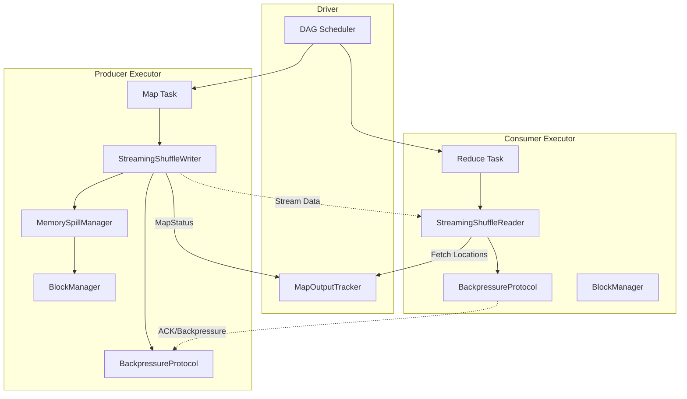

# 0. Agent Action Plan

## 0.1 Intent Clarification

Based on the prompt, the Blitzy platform understands that the new feature requirement is to **implement a streaming shuffle capability for Apache Spark** that eliminates shuffle materialization latency by streaming data directly from map (producer) tasks to reduce (consumer) tasks with memory buffering and backpressure protocols.

### 0.1.1 Core Feature Objective

The streaming shuffle feature introduces an **opt-in alternative shuffle mechanism** alongside Spark's existing sort-based shuffle that:

- **Streams shuffle data in-flight**: Rather than fully materializing shuffle output to disk before consumers can read, producers stream data directly to consumers as it becomes available
- **Reduces end-to-end latency**: Target 30-50% latency reduction for shuffle-heavy workloads (example: 10GB+ data, 100+ partitions) by overlapping producer writes with consumer reads
- **Provides graceful degradation**: Automatic fallback to disk-based spilling when memory pressure exceeds configurable thresholds (default 80%)
- **Maintains fault tolerance**: Zero data loss under all failure scenarios including producer crashes, consumer failures, and network partitions
- **Preserves existing behavior**: Zero performance regression for existing workloads through automatic fallback validation

### 0.1.2 Implicit Requirements Detected

From analyzing the requirements against the existing Spark shuffle architecture, the following implicit requirements have been identified:

- **ShuffleHandle extension**: A new `StreamingShuffleHandle` must be created to identify streaming shuffle registrations and enable pattern matching in `getWriter`/`getReader`
- **Block resolver integration**: The streaming shuffle must integrate with `ShuffleBlockResolver` interface for block coordination and external shuffle service compatibility
- **Metrics instrumentation**: New streaming-specific metrics must extend existing `ShuffleReadMetricsReporter` and `ShuffleWriteMetricsReporter` interfaces
- **Configuration validation**: Startup-time validation of streaming shuffle prerequisites (serializer compatibility, memory availability)
- **Protocol versioning**: Version compatibility checks between producer and consumer for graceful degradation across mixed-version deployments

### 0.1.3 Special Instructions and Constraints

**Architectural Constraints (Absolute Preservation):**

- Zero modifications to RDD/DataFrame/Dataset user-facing APIs
- Zero modifications to DAG scheduler and task scheduling algorithms
- Zero modifications to executor lifecycle management
- Zero modifications to lineage tracking and fault recovery model
- Existing `SortShuffleManager` implementation must coexist as production-stable fallback
- Block manager storage interface contracts must remain unchanged
- Task serialization/deserialization protocols must remain unchanged

**Integration Requirements:**

- Implement `org.apache.spark.shuffle.ShuffleManager` interface
- Follow existing shuffle manager patterns from `SortShuffleManager`
- Use existing `org.apache.spark.network.TransportContext` for network streaming
- Integrate with existing memory manager via `MemoryConsumer` interface
- Leverage existing `BlockManager` for disk spill coordination

**User-Specified Configuration Parameters:**

- `spark.shuffle.streaming.enabled`: Boolean, default `false` (opt-in flag)
- `spark.shuffle.streaming.bufferSizePercent`: Integer 1-50, default 20
- `spark.shuffle.streaming.spillThreshold`: Integer 50-95, default 80
- `spark.shuffle.streaming.maxBandwidthMBps`: Integer, default unlimited

### 0.1.4 Technical Interpretation

These feature requirements translate to the following technical implementation strategy:

- **To implement the streaming shuffle manager**, we will create `StreamingShuffleManager` that implements `ShuffleManager` trait and integrates with `ShuffleManager.create()` factory method via the `spark.shuffle.manager=streaming` alias
- **To implement memory-buffered streaming writes**, we will create `StreamingShuffleWriter` extending `ShuffleWriter[K, V]` that allocates per-partition buffers using `TaskMemoryManager` and `MemoryConsumer` patterns
- **To implement streaming reads with partial data support**, we will create `StreamingShuffleReader` implementing `ShuffleReader[K, C]` that polls producers for available data before shuffle completion
- **To implement backpressure protocol**, we will create `BackpressureProtocol` using token-bucket rate limiting with heartbeat-based consumer-to-producer signaling
- **To implement memory spill management**, we will create `MemorySpillManager` extending `MemoryConsumer` with 80% threshold monitoring and LRU-based partition eviction
- **To expose streaming metrics**, we will extend existing telemetry by adding streaming-specific counters to executor metrics collection

## 0.2 Repository Scope Discovery

### 0.2.1 Comprehensive File Analysis

**Existing Modules to Modify:**

| File Path | Purpose | Modification Type |
| --- | --- | --- |
| core/src/main/scala/org/apache/spark/shuffle/ShuffleManager.scala | ShuffleManager factory object | MODIFY - Add "streaming" alias mapping |
| core/src/main/scala/org/apache/spark/internal/config/package.scala | Spark configuration definitions | MODIFY - Add streaming shuffle config entries |
| core/src/main/scala/org/apache/spark/shuffle/metrics.scala | Shuffle metrics interfaces | MODIFY - Add streaming-specific metric methods |
| core/src/main/scala/org/apache/spark/SparkEnv.scala | Spark environment initialization | MODIFY - Register streaming shuffle metrics |

**Existing Integration Points:**

| File Path | Integration Purpose |
| --- | --- |
| core/src/main/scala/org/apache/spark/shuffle/ShuffleWriter.scala | Base abstract class for shuffle writers |
| core/src/main/scala/org/apache/spark/shuffle/ShuffleReader.scala | Base trait for shuffle readers |
| core/src/main/scala/org/apache/spark/shuffle/ShuffleHandle.scala | Base handle class for shuffle identification |
| core/src/main/scala/org/apache/spark/shuffle/BaseShuffleHandle.scala | Concrete handle storing dependency |
| core/src/main/scala/org/apache/spark/shuffle/ShuffleBlockResolver.scala | Block resolution interface |
| core/src/main/scala/org/apache/spark/shuffle/IndexShuffleBlockResolver.scala | Index-based block resolution |
| core/src/main/java/org/apache/spark/memory/MemoryConsumer.java | Memory allocation base class |
| core/src/main/java/org/apache/spark/memory/TaskMemoryManager.java | Per-task memory coordination |
| core/src/main/scala/org/apache/spark/util/collection/Spillable.scala | Spill policy and bookkeeping |
| common/network-common/src/main/java/org/apache/spark/network/TransportContext.java | Network transport wiring |
| core/src/main/scala/org/apache/spark/network/netty/NettyBlockTransferService.scala | Netty block transfer implementation |

**Reference Implementations (Patterns to Follow):**

| File Path | Pattern Reference |
| --- | --- |
| core/src/main/scala/org/apache/spark/shuffle/sort/SortShuffleManager.scala | ShuffleManager implementation pattern |
| core/src/main/scala/org/apache/spark/shuffle/sort/SortShuffleWriter.scala | ShuffleWriter implementation pattern |
| core/src/main/scala/org/apache/spark/shuffle/BlockStoreShuffleReader.scala | ShuffleReader implementation pattern |
| core/src/main/java/org/apache/spark/shuffle/sort/UnsafeShuffleWriter.java | Memory-efficient writer pattern |
| core/src/main/java/org/apache/spark/util/collection/unsafe/sort/UnsafeExternalSorter.java | Spill-aware memory consumer pattern |
| common/network-shuffle/src/main/java/org/apache/spark/network/shuffle/OneForOneBlockFetcher.java | Block streaming protocol pattern |

### 0.2.2 New Source Files to Create

**Core Streaming Shuffle Components:**

| File Path | Purpose | Lines (Est.) |
| --- | --- | --- |
| core/src/main/scala/org/apache/spark/shuffle/streaming/StreamingShuffleManager.scala | Main ShuffleManager implementation for streaming shuffle | ~300 |
| core/src/main/scala/org/apache/spark/shuffle/streaming/StreamingShuffleWriter.scala | Memory-buffered shuffle writer with streaming output | ~500 |
| core/src/main/scala/org/apache/spark/shuffle/streaming/StreamingShuffleReader.scala | In-progress block reader with partial data support | ~400 |
| core/src/main/scala/org/apache/spark/shuffle/streaming/BackpressureProtocol.scala | Consumer-to-producer flow control protocol | ~350 |
| core/src/main/scala/org/apache/spark/shuffle/streaming/MemorySpillManager.scala | Memory threshold monitoring and spill coordination | ~400 |
| core/src/main/scala/org/apache/spark/shuffle/streaming/StreamingShuffleHandle.scala | Handle for streaming shuffle identification | ~50 |
| core/src/main/scala/org/apache/spark/shuffle/streaming/StreamingShuffleBlockResolver.scala | Block resolution for streaming shuffle | ~200 |
| core/src/main/scala/org/apache/spark/shuffle/streaming/StreamingShuffleMetrics.scala | Streaming-specific metrics collection | ~150 |

**Test Files to Create:**

| File Path | Coverage Purpose | Lines (Est.) |
| --- | --- | --- |
| core/src/test/scala/org/apache/spark/shuffle/streaming/StreamingShuffleWriterSuite.scala | Writer unit tests: buffer allocation, spill trigger, checksum | ~400 |
| core/src/test/scala/org/apache/spark/shuffle/streaming/StreamingShuffleReaderSuite.scala | Reader unit tests: partial read, failure detection, checksum validation | ~350 |
| core/src/test/scala/org/apache/spark/shuffle/streaming/BackpressureProtocolSuite.scala | Protocol tests: acknowledgment, rate limiting, timeout | ~300 |
| core/src/test/scala/org/apache/spark/shuffle/streaming/MemorySpillManagerSuite.scala | Spill manager tests: threshold, LRU eviction, reclamation | ~250 |
| core/src/test/scala/org/apache/spark/shuffle/streaming/StreamingShuffleIntegrationTest.scala | End-to-end integration scenarios | ~400 |
| core/src/test/scala/org/apache/spark/shuffle/streaming/StreamingShufflePerformanceBenchmark.scala | Performance benchmarks | ~200 |

### 0.2.3 Configuration Files to Modify

| File Path | Changes Required |
| --- | --- |
| core/src/main/scala/org/apache/spark/internal/config/package.scala | Add SHUFFLE_STREAMING_* configuration entries |
| docs/configuration.md | Document new streaming shuffle parameters |

### 0.2.4 Documentation to Create/Modify

| File Path | Purpose |
| --- | --- |
| docs/streaming-shuffle-architecture.md | CREATE - Architecture design document |
| docs/streaming-shuffle-tuning.md | CREATE - Performance tuning guide |
| docs/streaming-shuffle-troubleshooting.md | CREATE - Troubleshooting guide |
| README.md | MODIFY - Add streaming shuffle feature note |

### 0.2.5 Integration Point Discovery

**API Endpoints Connecting to Feature:**

- `ShuffleManager.registerShuffle()` - Returns `StreamingShuffleHandle` for streaming path
- `ShuffleManager.getWriter()` - Returns `StreamingShuffleWriter` for streaming handle
- `ShuffleManager.getReader()` - Returns `StreamingShuffleReader` for streaming handle
- `ShuffleManager.unregisterShuffle()` - Cleanup streaming shuffle resources

**Service Classes Requiring Updates:**

- `SparkEnv` - Register streaming shuffle manager and metrics
- `TaskMemoryManager` - Memory allocation coordination (no changes, use existing)
- `BlockManager` - Disk spill integration (no changes, use existing interface)

**Memory Management Integration:**

- Extend `MemoryConsumer` for buffer allocation tracking
- Use `TaskMemoryManager.acquireExecutionMemory()` for buffer requests
- Integrate with `Spillable` pattern for threshold-based spilling

**Network Layer Integration:**

- Use existing `TransportContext` and `TransportClient` for streaming
- Leverage `OneForOneBlockFetcher` patterns for chunk-based transfer
- Integrate with `NettyBlockTransferService` for block streaming

## 0.3 Dependency Inventory

### 0.3.1 Private and Public Packages

**Core Dependencies (Already Present in Repository):**

| Registry | Package Name | Version | Purpose |
| --- | --- | --- | --- |
| Maven Central | org.apache.spark:spark-core_2.13 | 4.2.0-SNAPSHOT | Core Spark runtime |
| Maven Central | org.apache.spark:spark-network-common_2.13 | 4.2.0-SNAPSHOT | Network transport layer |
| Maven Central | org.apache.spark:spark-network-shuffle_2.13 | 4.2.0-SNAPSHOT | Shuffle block transfer |
| Maven Central | org.scala-lang:scala-library | 2.13.x | Scala runtime |
| Maven Central | io.netty:netty-all | (managed) | Network I/O framework |
| Maven Central | com.google.guava:guava | (managed) | Collections and utilities |

**Build Dependencies (No Changes Required):**

| Registry | Package Name | Version | Purpose |
| --- | --- | --- | --- |
| Maven Central | org.scalatest:scalatest_2.13 | (managed) | Test framework |
| Maven Central | org.mockito:mockito-core | (managed) | Mocking framework |
| Maven Central | junit:junit | (managed) | JUnit test runner |

### 0.3.2 Dependency Analysis

**No New External Dependencies Required**

The streaming shuffle implementation leverages existing Spark infrastructure:

- **Memory Management**: Uses existing `MemoryConsumer` and `TaskMemoryManager` from `core`
- **Network Transport**: Uses existing `TransportContext`, `TransportClient` from `network-common`
- **Serialization**: Uses existing `Serializer` and `SerializerManager` from `core`
- **Block Storage**: Uses existing `BlockManager` and `DiskBlockManager` from `core`
- **Metrics**: Extends existing metrics infrastructure from `core`
- **Checksum**: Uses existing `java.util.zip.CRC32C` from JDK

### 0.3.3 Import Updates Required

**Files Requiring New Imports:**

| File Pattern | Import Changes |
| --- | --- |
| core/src/main/scala/org/apache/spark/shuffle/ShuffleManager.scala | Add import for StreamingShuffleManager class name |
| core/src/main/scala/org/apache/spark/internal/config/package.scala | No new imports (uses existing ConfigBuilder) |
| core/src/main/scala/org/apache/spark/shuffle/metrics.scala | No new imports |

**New Package Imports in Streaming Components:**

```scala
// StreamingShuffleManager.scala
import org.apache.spark.shuffle.streaming._
import org.apache.spark.memory.{MemoryConsumer, TaskMemoryManager}
import org.apache.spark.network.{TransportContext, TransportClient}
```

### 0.3.4 Configuration Dependencies

**New Configuration Entries to Add:**

| Config Key | Type | Default | Validation |
| --- | --- | --- | --- |
| spark.shuffle.streaming.enabled | Boolean | false | None |
| spark.shuffle.streaming.bufferSizePercent | Int | 20 | Range: 1-50 |
| spark.shuffle.streaming.spillThreshold | Int | 80 | Range: 50-95 |
| spark.shuffle.streaming.maxBandwidthMBps | Int | -1 (unlimited) | >= -1 |
| spark.shuffle.streaming.connectionTimeout | Duration | 5s | > 0 |
| spark.shuffle.streaming.heartbeatInterval | Duration | 10s | > 0 |
| spark.shuffle.streaming.maxRetries | Int | 5 | >= 0 |
| spark.shuffle.streaming.retryWait | Duration | 1s | > 0 |
| spark.shuffle.streaming.debug | Boolean | false | None |

**Existing Configuration Dependencies:**

| Config Key | Usage in Streaming Shuffle |
| --- | --- |
| spark.shuffle.compress | Compression for streamed buffers |
| spark.shuffle.file.buffer | Buffer size for spill files |
| spark.shuffle.spill.compress | Compression for spilled data |
| spark.shuffle.checksum.enabled | Checksum validation |
| spark.shuffle.checksum.algorithm | Checksum algorithm (CRC32C) |
| spark.executor.memoryFraction | Memory allocation context |

### 0.3.5 Build Configuration

**No Changes to pom.xml Required**

The streaming shuffle implementation:

- Lives entirely within the existing `core` module
- Uses no new external dependencies
- Follows existing Scala/Java mixed compilation patterns
- Integrates with existing test infrastructure

**Module Dependencies (Existing):**

```plaintext
core
├── depends on: spark-network-common
├── depends on: spark-network-shuffle  
├── depends on: spark-launcher
├── depends on: spark-kvstore
└── depends on: spark-unsafe
```

## 0.4 Integration Analysis

### 0.4.1 Existing Code Touchpoints

**Direct Modifications Required:**

| File | Modification | Location |
| --- | --- | --- |
| core/src/main/scala/org/apache/spark/shuffle/ShuffleManager.scala | Add "streaming" alias to shortShuffleMgrNames map | Line 112-114 in getShuffleManagerClassName |
| core/src/main/scala/org/apache/spark/internal/config/package.scala | Add streaming shuffle configuration entries | After existing shuffle configs (~line 1500+) |
| core/src/main/scala/org/apache/spark/shuffle/metrics.scala | Add streaming-specific metric methods to reporter traits | After existing methods |

**ShuffleManager Factory Modification:**

```scala
// In ShuffleManager.getShuffleManagerClassName
val shortShuffleMgrNames = Map(
  "sort" -> classOf[org.apache.spark.shuffle.sort.SortShuffleManager].getName,
  "tungsten-sort" -> classOf[org.apache.spark.shuffle.sort.SortShuffleManager].getName,
  "streaming" -> "org.apache.spark.shuffle.streaming.StreamingShuffleManager"  // ADD
)
```

**Configuration Entries Addition:**

```scala
// In package.scala
private[spark] val SHUFFLE_STREAMING_ENABLED = 
  ConfigBuilder("spark.shuffle.streaming.enabled")
    .booleanConf
    .createWithDefault(false)

private[spark] val SHUFFLE_STREAMING_BUFFER_SIZE_PERCENT =
  ConfigBuilder("spark.shuffle.streaming.bufferSizePercent")
    .intConf
    .checkValue(v => v >= 1 && v <= 50, "Must be between 1 and 50")
    .createWithDefault(20)
```

### 0.4.2 Interface Implementations

**ShuffleManager Interface:**

The `StreamingShuffleManager` must implement the full `ShuffleManager` trait:

| Method | Implementation Approach |
| --- | --- |
| registerShuffle[K,V,C](shuffleId, dependency) | Return StreamingShuffleHandle with eligibility check |
| getWriter[K,V](handle, mapId, context, metrics) | Return StreamingShuffleWriter for streaming handle |
| getReader[K,C](handle, startMapIndex, endMapIndex, startPartition, endPartition, context, metrics) | Return StreamingShuffleReader for streaming handle |
| unregisterShuffle(shuffleId) | Clean up streaming buffers and resources |
| shuffleBlockResolver | Return StreamingShuffleBlockResolver |
| stop() | Shutdown streaming infrastructure |

**ShuffleWriter Interface:**

The `StreamingShuffleWriter` must implement `ShuffleWriter[K, V]`:

| Method | Implementation |
| --- | --- |
| write(records: Iterator[Product2[K,V]]) | Buffer records, stream to consumers, handle backpressure |
| stop(success: Boolean) | Finalize writes, return MapStatus, cleanup |
| getPartitionLengths() | Return per-partition byte counts |

**ShuffleReader Interface:**

The `StreamingShuffleReader` must implement `ShuffleReader[K, C]`:

| Method | Implementation |
| --- | --- |
| read() | Return iterator that fetches from producers, handles partial reads |

### 0.4.3 Memory Management Integration

**MemoryConsumer Pattern:**

```scala
class MemorySpillManager(taskMemoryManager: TaskMemoryManager)
  extends MemoryConsumer(taskMemoryManager, taskMemoryManager.pageSizeBytes(), MemoryMode.ON_HEAP) {
  
  override def spill(size: Long, trigger: MemoryConsumer): Long = {
    // Select largest partitions for eviction via LRU
    // Write to disk via BlockManager
    // Return bytes freed
  }
}
```

**Integration Points:**

- `TaskMemoryManager.acquireExecutionMemory()` - Request buffer memory
- `TaskMemoryManager.releaseExecutionMemory()` - Release after consumer ACK
- `TaskContext.taskMemoryManager()` - Access per-task memory manager
- `SparkEnv.get.blockManager` - Disk spill coordination

### 0.4.4 Network Transport Integration

**Transport Layer Usage:**

| Component | Integration |
| --- | --- |
| TransportContext | Create streaming transport context for shuffle traffic |
| TransportClient | Stream data chunks to consumers |
| TransportClientFactory | Reuse existing connection pool |
| RpcHandler | Handle acknowledgments and backpressure signals |

**Protocol Messages (New):**

| Message Type | Purpose |
| --- | --- |
| StreamingShuffleBlockRequest | Consumer requests available data from producer |
| StreamingShuffleBlockResponse | Producer streams available partition data |
| BackpressureSignal | Consumer signals buffer pressure to producer |
| AcknowledgmentMessage | Consumer confirms receipt for buffer reclamation |

### 0.4.5 Existing Code Patterns to Follow

**From SortShuffleManager:**

- Constructor signature: `(conf: SparkConf)` for SparkEnv instantiation
- Map task ID tracking via `ConcurrentHashMap[Int, OpenHashSet[Long]]`
- Lazy initialization of `ShuffleExecutorComponents`
- Pattern matching on handle types in `getWriter`

**From SortShuffleWriter:**

- Metrics integration via `ShuffleWriteMetricsReporter`
- `MapStatus` construction with block manager ID and partition lengths
- `stop(success)` guard against double-stop
- Checksum calculation for integrity validation

**From BlockStoreShuffleReader:**

- `ShuffleBlockFetcherIterator` for network fetch coordination
- Serializer integration via `dep.serializer.newInstance()`
- Metrics tracking via `readMetrics.incRecordsRead()`
- `InterruptibleIterator` for task cancellation support

**From UnsafeExternalSorter:**

- `MemoryConsumer` extension for memory tracking
- `spill()` implementation for memory pressure response
- Page allocation via `allocatePage()`
- Cleanup via `TaskContext` completion listener

### 0.4.6 Database/Schema Updates

**No Database Changes Required**

The streaming shuffle implementation:

- Uses in-memory buffers (no persistent storage needed)
- Spills to existing disk block storage (via BlockManager)
- No new schemas or migrations required
- Compatible with existing shuffle block ID formats

## 0.5 Technical Implementation

### 0.5.1 File-by-File Execution Plan

**Group 1 - Core Streaming Shuffle Components:**

| Action | File Path | Implementation Details |
| --- | --- | --- |
| CREATE | core/src/main/scala/org/apache/spark/shuffle/streaming/StreamingShuffleHandle.scala | Extend BaseShuffleHandle, add streaming identification marker |
| CREATE | core/src/main/scala/org/apache/spark/shuffle/streaming/StreamingShuffleManager.scala | Implement ShuffleManager trait with streaming writer/reader factory |
| CREATE | core/src/main/scala/org/apache/spark/shuffle/streaming/StreamingShuffleWriter.scala | Implement ShuffleWriter with memory buffering and streaming output |
| CREATE | core/src/main/scala/org/apache/spark/shuffle/streaming/StreamingShuffleReader.scala | Implement ShuffleReader with partial read and failure detection |
| CREATE | core/src/main/scala/org/apache/spark/shuffle/streaming/StreamingShuffleBlockResolver.scala | Implement ShuffleBlockResolver for streaming block coordination |

**Group 2 - Backpressure and Memory Management:**

| Action | File Path | Implementation Details |
| --- | --- | --- |
| CREATE | core/src/main/scala/org/apache/spark/shuffle/streaming/BackpressureProtocol.scala | Token-bucket rate limiting, heartbeat signaling, priority arbitration |
| CREATE | core/src/main/scala/org/apache/spark/shuffle/streaming/MemorySpillManager.scala | Extend MemoryConsumer, 80% threshold monitoring, LRU eviction |
| CREATE | core/src/main/scala/org/apache/spark/shuffle/streaming/StreamingBuffer.scala | Per-partition buffer with checksum generation |

**Group 3 - Configuration and Metrics:**

| Action | File Path | Implementation Details |
| --- | --- | --- |
| MODIFY | core/src/main/scala/org/apache/spark/internal/config/package.scala | Add all spark.shuffle.streaming.* configuration entries |
| MODIFY | core/src/main/scala/org/apache/spark/shuffle/metrics.scala | Add streaming-specific metrics to reporter traits |
| CREATE | core/src/main/scala/org/apache/spark/shuffle/streaming/StreamingShuffleMetrics.scala | Streaming shuffle telemetry collection and exposure |

**Group 4 - Integration Points:**

| Action | File Path | Implementation Details |
| --- | --- | --- |
| MODIFY | core/src/main/scala/org/apache/spark/shuffle/ShuffleManager.scala | Add "streaming" alias to factory method |

**Group 5 - Test Suites:**

| Action | File Path | Implementation Details |
| --- | --- | --- |
| CREATE | core/src/test/scala/org/apache/spark/shuffle/streaming/StreamingShuffleWriterSuite.scala | Unit tests for writer: buffer allocation, spill, checksum |
| CREATE | core/src/test/scala/org/apache/spark/shuffle/streaming/StreamingShuffleReaderSuite.scala | Unit tests for reader: partial read, failure, validation |
| CREATE | core/src/test/scala/org/apache/spark/shuffle/streaming/BackpressureProtocolSuite.scala | Unit tests for backpressure: ACK, rate limit, timeout |
| CREATE | core/src/test/scala/org/apache/spark/shuffle/streaming/MemorySpillManagerSuite.scala | Unit tests for spill: threshold, LRU, reclamation |
| CREATE | core/src/test/scala/org/apache/spark/shuffle/streaming/StreamingShuffleIntegrationTest.scala | Integration tests: 10GB shuffle, failure injection |
| CREATE | core/src/test/scala/org/apache/spark/shuffle/streaming/StreamingShufflePerformanceBenchmark.scala | Performance benchmarks and regression detection |

**Group 6 - Documentation:**

| Action | File Path | Implementation Details |
| --- | --- | --- |
| CREATE | docs/streaming-shuffle-architecture.md | Architecture design, protocol specification, failure flows |
| CREATE | docs/streaming-shuffle-tuning.md | Buffer sizing recommendations, spill threshold optimization |
| CREATE | docs/streaming-shuffle-troubleshooting.md | Common issues, telemetry interpretation, debugging |
| MODIFY | docs/configuration.md | Document all new spark.shuffle.streaming.* parameters |

### 0.5.2 Implementation Approach per File

**StreamingShuffleManager.scala (\~300 lines):**

```scala
private[spark] class StreamingShuffleManager(conf: SparkConf) 
  extends ShuffleManager with Logging {
  
  private val taskIdMapsForShuffle = new ConcurrentHashMap[Int, OpenHashSet[Long]]()
  private val streamingShuffleBlockResolver = new StreamingShuffleBlockResolver(conf)
  
  override def registerShuffle[K,V,C](shuffleId: Int, 
    dependency: ShuffleDependency[K,V,C]): ShuffleHandle = {
    if (canUseStreamingShuffle(dependency)) {
      new StreamingShuffleHandle(shuffleId, dependency)
    } else {
      // Fallback to sort-based handle
      new BaseShuffleHandle(shuffleId, dependency)
    }
  }
  // ...
}
```

**StreamingShuffleWriter.scala (\~500 lines):**

Core responsibilities:

- Allocate per-partition buffers limited to 20% executor memory
- Pipeline buffered data directly to consumer executors
- Monitor consumer acknowledgment rate, trigger spill at 80% threshold
- Generate block-level checksums for integrity validation
- Integrate with block manager for disk persistence on memory pressure

**StreamingShuffleReader.scala (\~400 lines):**

Core responsibilities:

- Poll producer for available data before shuffle completion
- Detect producer failure via connection timeout (5 seconds)
- Invalidate partial reads and trigger upstream recomputation
- Send consumer position to producer for buffer reclamation
- Verify block integrity on receive, request retransmission on corruption

**BackpressureProtocol.scala (\~350 lines):**

Core responsibilities:

- Heartbeat-based flow control with 5-second timeout
- Per-executor bandwidth cap at 80% link capacity via token bucket
- Track buffer utilization across all concurrent shuffles
- Allocate memory to shuffles based on partition count and data volume
- Emit backpressure event logging for operational visibility

**MemorySpillManager.scala (\~400 lines):**

```scala
private[spark] class MemorySpillManager(
    taskMemoryManager: TaskMemoryManager,
    conf: SparkConf)
  extends MemoryConsumer(taskMemoryManager, 
    taskMemoryManager.pageSizeBytes(), MemoryMode.ON_HEAP) with Logging {
  
  private val spillThreshold = conf.get(SHUFFLE_STREAMING_SPILL_THRESHOLD) / 100.0
  private val partitionBuffers = new ConcurrentHashMap[Int, StreamingBuffer]()
  
  override def spill(size: Long, trigger: MemoryConsumer): Long = {
    // Select largest partitions via LRU policy
    // Spill to disk via BlockManager
    // Return bytes freed within 100ms target
  }
}
```

### 0.5.3 Failure Handling Implementation

**Producer Failure Detection Flow:**

```plaintext
1. StreamingShuffleReader detects connection timeout (5 seconds)
2. Invalidates all partial reads from failed producer
3. Notifies DAG scheduler to recompute upstream tasks (via FetchFailedException)
4. Discards buffered data from failed shuffle attempt
5. Retries read from recomputed producer shuffle
```

**Consumer Failure Detection Flow:**

```plaintext
1. StreamingShuffleWriter detects missing acknowledgments (10 seconds)
2. Buffers unacknowledged data in memory
3. Triggers disk spill if buffer exceeds 80% threshold
4. Resumes streaming when consumer reconnects
5. Retransmits unacknowledged blocks from spill or memory
```

**Fallback Conditions:**

Automatically reverts to sort-based shuffle when:

- Consumer sustained 2x slower than producer for &gt;60 seconds
- Memory pressure prevents buffer allocation (OOM risk)
- Network saturation exceeds 90% link capacity
- Producer/consumer version mismatch (compatibility check)

### 0.5.4 Component Architecture Diagram



### 0.5.5 Testing Validation Approach

**Unit Test Coverage (&gt;85%):**

| Suite | Coverage Areas |
| --- | --- |
| StreamingShuffleWriterSuite | Buffer allocation, partition tracking, spill trigger timing, checksum generation, resource cleanup |
| StreamingShuffleReaderSuite | Partial data consumption, timeout detection, invalidation, checksum validation, retransmission |
| BackpressureProtocolSuite | ACK processing, buffer reclamation, rate limiting, timeout signaling, priority arbitration |
| MemorySpillManagerSuite | Threshold monitoring, LRU selection, eviction timing, memory accounting |

**Integration Test Scenarios:**

| Test | Validation |
| --- | --- |
| Producer failure mid-shuffle | Validate partial read invalidation |
| Consumer slowdown (50% rate) | Validate automatic spill trigger |
| Network partition | Validate timeout and fallback behavior |
| Memory pressure (5 concurrent shuffles) | Validate buffer allocation arbitration |

**Failure Injection Testing (10 scenarios):**

 1. Producer crash during shuffle write
 2. Consumer crash during shuffle read
 3. Network partition between producer and consumer
 4. Memory exhaustion during buffer allocation
 5. Disk failure during spill operation
 6. Checksum mismatch on block receive
 7. Connection timeout during streaming transfer
 8. Executor JVM pause (GC) during shuffle
 9. Multiple concurrent producer failures
10. Consumer reconnect after extended downtime

## 0.6 Scope Boundaries

### 0.6.1 Exhaustively In Scope

**Source Files (with wildcards where applicable):**

| Pattern | Description |
| --- | --- |
| core/src/main/scala/org/apache/spark/shuffle/streaming/**/*.scala | All streaming shuffle implementation files |
| core/src/main/scala/org/apache/spark/shuffle/ShuffleManager.scala | Factory method modification |
| core/src/main/scala/org/apache/spark/shuffle/metrics.scala | Metrics interface extensions |
| core/src/main/scala/org/apache/spark/internal/config/package.scala | Configuration entry additions |

**Test Files:**

| Pattern | Description |
| --- | --- |
| core/src/test/scala/org/apache/spark/shuffle/streaming/**/*Suite.scala | All streaming shuffle unit tests |
| core/src/test/scala/org/apache/spark/shuffle/streaming/**/*Test.scala | All streaming shuffle integration tests |
| core/src/test/scala/org/apache/spark/shuffle/streaming/**/*Benchmark.scala | Performance benchmarks |

**Configuration Files:**

| File | Changes |
| --- | --- |
| core/src/main/scala/org/apache/spark/internal/config/package.scala | SHUFFLE_STREAMING_* configuration entries |
| .env.example | Document new environment variables (if any) |

**Documentation Files:**

| Pattern | Description |
| --- | --- |
| docs/streaming-shuffle-*.md | All streaming shuffle documentation |
| docs/configuration.md | Streaming shuffle parameter documentation |
| README.md | Feature announcement section |

**Integration Points (specific lines/methods):**

| File | Integration Point |
| --- | --- |
| core/src/main/scala/org/apache/spark/shuffle/ShuffleManager.scala | Lines 112-114: shortShuffleMgrNames map |
| core/src/main/scala/org/apache/spark/shuffle/metrics.scala | Lines 28-46: ShuffleReadMetricsReporter trait |
| core/src/main/scala/org/apache/spark/shuffle/metrics.scala | Lines 56-62: ShuffleWriteMetricsReporter trait |

### 0.6.2 Explicitly Out of Scope

**API Preservation (Zero Modifications):**

| Component | Reason |
| --- | --- |
| org.apache.spark.rdd.RDD | User-facing API preservation |
| org.apache.spark.sql.DataFrame | User-facing API preservation |
| org.apache.spark.sql.Dataset | User-facing API preservation |
| org.apache.spark.sql.SparkSession | User-facing API preservation |

**Scheduler Preservation (Zero Modifications):**

| Component | Reason |
| --- | --- |
| org.apache.spark.scheduler.DAGScheduler | Task scheduling algorithm preservation |
| org.apache.spark.scheduler.TaskScheduler | Task scheduling algorithm preservation |
| org.apache.spark.scheduler.TaskSetManager | Task lifecycle preservation |
| org.apache.spark.scheduler.Stage | DAG optimization preservation |

**Executor Preservation (Zero Modifications):**

| Component | Reason |
| --- | --- |
| org.apache.spark.executor.Executor | Executor lifecycle preservation |
| org.apache.spark.executor.CoarseGrainedExecutorBackend | Executor management preservation |
| org.apache.spark.deploy.* | Deployment infrastructure preservation |

**Existing Shuffle Preservation (Coexistence):**

| Component | Reason |
| --- | --- |
| org.apache.spark.shuffle.sort.SortShuffleManager | Production-stable fallback |
| org.apache.spark.shuffle.sort.SortShuffleWriter | Existing implementation preserved |
| org.apache.spark.shuffle.sort.UnsafeShuffleWriter | Existing implementation preserved |
| org.apache.spark.shuffle.sort.BypassMergeSortShuffleWriter | Existing implementation preserved |
| org.apache.spark.shuffle.BlockStoreShuffleReader | Existing implementation preserved |

**Storage Preservation (Zero Modifications):**

| Component | Reason |
| --- | --- |
| org.apache.spark.storage.BlockManager | Use existing interface only |
| org.apache.spark.storage.DiskBlockManager | Use existing interface only |
| org.apache.spark.storage.BlockManagerMaster | Use existing interface only |

**Fault Recovery Preservation:**

| Component | Reason |
| --- | --- |
| org.apache.spark.rdd.RDD.checkpoint | Lineage tracking preservation |
| org.apache.spark.scheduler.TaskResult | Task result handling preservation |
| org.apache.spark.scheduler.FetchFailed | Use existing failure mechanism |

### 0.6.3 Boundary Conditions

**Streaming Shuffle Activation Conditions:**

```plaintext
IF spark.shuffle.manager = "streaming" AND spark.shuffle.streaming.enabled = true
THEN use StreamingShuffleManager
ELSE use SortShuffleManager (default behavior)
```

**Automatic Fallback to Sort Shuffle:**

| Condition | Threshold | Action |
| --- | --- | --- |
| Consumer 2x slower than producer | >60 seconds sustained | Fallback to sort shuffle |
| Memory pressure | Unable to allocate buffer | Fallback to sort shuffle |
| Network saturation | >90% link capacity | Fallback to sort shuffle |
| Version mismatch | Producer/consumer incompatible | Fallback to sort shuffle |
| Serializer incompatibility | Non-relocatable serializer | Fallback to sort shuffle |

### 0.6.4 Exclusion Rationale

**Not Implementing in This Feature:**

| Item | Rationale |
| --- | --- |
| DAG optimization heuristics | Out of shuffle manager scope |
| Query planning modifications | Affects SQL layer, not shuffle |
| Executor memory model redesign | Requires broader architecture changes |
| External system integrations | Focus on core shuffle only |
| Dynamic reconfiguration | Deferred to v2 for stability |
| Push-based shuffle integration | Orthogonal feature, can be combined later |

**Performance Optimization Deferral:**

| Item | Rationale |
| --- | --- |
| Off-heap streaming buffers | Additional complexity, on-heap sufficient for v1 |
| Zero-copy network transfer | Requires kernel-level integration |
| RDMA support | Hardware-specific, defer to specialized implementation |
| Adaptive buffer sizing | Start with fixed configuration, iterate based on telemetry |

## 0.7 Rules for Feature Addition

### 0.7.1 Implementation Discipline Rules

**Rule 1: Minimal Modification Principle**

Make only changes necessary to implement streaming shuffle capability within the `ShuffleManager` abstraction boundary. When implementation choices exist, select the approach requiring least modification to executor memory model and network transport layer.

**Rule 2: Coexistence Strategy**

Preserve existing sort-based shuffle as production-stable fallback. Isolate streaming logic in dedicated classes within `org.apache.spark.shuffle.streaming` package with zero cross-contamination into existing shuffle code paths.

**Rule 3: Interface Compliance**

All streaming shuffle components must:

- Implement the exact signatures defined in `ShuffleManager`, `ShuffleWriter`, `ShuffleReader`, and `ShuffleBlockResolver` traits
- Follow existing patterns from `SortShuffleManager` for consistency
- Use existing `SparkConf` configuration system via `ConfigBuilder`

### 0.7.2 Code Organization Rules

**Package Structure:**

```plaintext
org.apache.spark.shuffle.streaming/
├── StreamingShuffleManager.scala      // Main entry point
├── StreamingShuffleHandle.scala       // Handle identification
├── StreamingShuffleWriter.scala       // Producer-side writer
├── StreamingShuffleReader.scala       // Consumer-side reader
├── StreamingShuffleBlockResolver.scala // Block coordination
├── BackpressureProtocol.scala         // Flow control
├── MemorySpillManager.scala           // Memory management
├── StreamingBuffer.scala              // Buffer abstraction
└── StreamingShuffleMetrics.scala      // Telemetry
```

**Naming Conventions:**

| Pattern | Example | Usage |
| --- | --- | --- |
| Streaming* prefix | StreamingShuffleWriter | All streaming-specific classes |
| SHUFFLE_STREAMING_* | SHUFFLE_STREAMING_ENABLED | All configuration keys |
| shuffle.streaming.* | shuffle.streaming.bufferUtilizationPercent | All metrics |

### 0.7.3 Performance Requirements

**Latency Targets:**

| Metric | Target | Measurement |
| --- | --- | --- |
| End-to-end shuffle latency reduction | 30-50% | 10GB+ data, 100+ partitions |
| CPU-bound workload improvement | 5-10% | Reduced scheduler overhead |
| Memory-bound workload regression | 0% | Automatic fallback validation |
| Spill trigger response time | <100ms | From 80% threshold detection |

**Resource Constraints:**

| Resource | Limit | Rationale |
| --- | --- | --- |
| Streaming buffer memory | 20% executor memory (configurable 1-50%) | Prevent OOM |
| Per-partition buffer | (executorMemory * bufferPercent) / numPartitions | Fair allocation |
| Telemetry CPU overhead | <1% | Minimal instrumentation cost |
| Log volume | <10MB/hour per executor | Bounded observability |

### 0.7.4 Fault Tolerance Requirements

**Zero Data Loss Guarantee:**

All failure scenarios must result in zero data loss:

- Producer crash: Partial reads invalidated, upstream recomputation triggered
- Consumer crash: Unacknowledged data buffered/spilled, retransmitted on reconnect
- Network partition: Timeout detection, graceful fallback to disk
- Memory exhaustion: Automatic spill before allocation failure
- Checksum mismatch: Retransmission request, not silent corruption

**Timeout Configuration:**

| Timeout | Default | Purpose |
| --- | --- | --- |
| Connection timeout | 5 seconds | Producer failure detection |
| Heartbeat interval | 10 seconds | Consumer liveness monitoring |
| Retry backoff start | 1 second | Initial retry delay |
| Max retry attempts | 5 | Limit retry storms |

### 0.7.5 Testing Requirements

**Coverage Requirements:**

| Category | Minimum Coverage |
| --- | --- |
| Unit tests | >85% line coverage |
| Integration tests | Zero flakiness over 10 runs |
| Performance benchmarks | >30% improvement demonstrated |
| Failure injection | Zero data loss in all 10 scenarios |
| Stress testing | Zero memory leaks over 15 minutes |

**Quality Gates:**

Pre-merge validation must pass:

- All unit tests pass
- All integration tests pass with zero flakiness
- Performance benchmark shows target improvement
- Memory leak detection via heap dump analysis
- Scalastyle and code review approval

### 0.7.6 Backward Compatibility Rules

**Configuration Compatibility:**

- Default behavior (`spark.shuffle.streaming.enabled=false`) must produce identical results to existing shuffle
- Existing configurations must not change default values
- New configurations must not affect existing shuffle paths

**API Compatibility:**

- No changes to public Spark APIs
- No changes to user-visible RDD/DataFrame/Dataset methods
- No changes to SparkContext/SparkSession public interfaces

**Operational Compatibility:**

- Configuration changes require executor restart (no dynamic reconfiguration in v1)
- JMX metrics exposed with standard naming for monitoring integration
- Debug logging disabled by default (enable via `spark.shuffle.streaming.debug=true`)

### 0.7.7 Documentation Requirements

**Required Documentation:**

| Document | Contents |
| --- | --- |
| Configuration Reference | All spark.shuffle.streaming.* parameters with descriptions, defaults, validation |
| Architecture Design | Streaming protocol specification, failure handling flows, component interactions |
| Performance Tuning Guide | Buffer sizing recommendations, spill threshold optimization, workload characterization |
| Troubleshooting Guide | Common issues, telemetry interpretation, debugging procedures |

**Code Documentation:**

- All public classes must have Scaladoc/Javadoc
- Complex algorithms must have inline comments explaining logic
- Integration points must have comments explaining coexistence strategy

## 0.8 References

### 0.8.1 Repository Files Analyzed

**Core Shuffle Implementation Files:**

| File Path | Analysis Purpose |
| --- | --- |
| core/src/main/scala/org/apache/spark/shuffle/ShuffleManager.scala | ShuffleManager interface and factory pattern |
| core/src/main/scala/org/apache/spark/shuffle/ShuffleWriter.scala | ShuffleWriter abstract class contract |
| core/src/main/scala/org/apache/spark/shuffle/ShuffleReader.scala | ShuffleReader trait contract |
| core/src/main/scala/org/apache/spark/shuffle/ShuffleHandle.scala | ShuffleHandle base class |
| core/src/main/scala/org/apache/spark/shuffle/BaseShuffleHandle.scala | Concrete handle implementation |
| core/src/main/scala/org/apache/spark/shuffle/ShuffleBlockResolver.scala | Block resolution interface |
| core/src/main/scala/org/apache/spark/shuffle/IndexShuffleBlockResolver.scala | Index-based block resolution |
| core/src/main/scala/org/apache/spark/shuffle/BlockStoreShuffleReader.scala | Standard shuffle reader implementation |
| core/src/main/scala/org/apache/spark/shuffle/metrics.scala | Shuffle metrics interfaces |

**Sort Shuffle Reference Implementation:**

| File Path | Analysis Purpose |
| --- | --- |
| core/src/main/scala/org/apache/spark/shuffle/sort/SortShuffleManager.scala | ShuffleManager implementation pattern |
| core/src/main/scala/org/apache/spark/shuffle/sort/SortShuffleWriter.scala | ShuffleWriter implementation pattern |

**Memory Management Files:**

| File Path | Analysis Purpose |
| --- | --- |
| core/src/main/java/org/apache/spark/memory/MemoryConsumer.java | Memory allocation base class |
| core/src/main/java/org/apache/spark/memory/TaskMemoryManager.java | Per-task memory coordination |
| core/src/main/scala/org/apache/spark/util/collection/Spillable.scala | Spill policy implementation |
| core/src/main/scala/org/apache/spark/memory/MemoryManager.scala | Memory pool coordination |
| core/src/main/scala/org/apache/spark/memory/ExecutionMemoryPool.scala | Execution memory arbitration |
| core/src/main/java/org/apache/spark/util/collection/unsafe/sort/UnsafeExternalSorter.java | Spill-aware sorter pattern |

**Network Transport Files:**

| File Path | Analysis Purpose |
| --- | --- |
| common/network-common/src/main/java/org/apache/spark/network/TransportContext.java | Network transport wiring |
| core/src/main/scala/org/apache/spark/network/netty/NettyBlockTransferService.scala | Block transfer implementation |
| common/network-shuffle/src/main/java/org/apache/spark/network/shuffle/OneForOneBlockFetcher.java | Block streaming pattern |
| common/network-shuffle/src/main/java/org/apache/spark/network/shuffle/ShuffleTransportContext.java | Shuffle transport context |
| common/network-shuffle/src/main/java/org/apache/spark/network/shuffle/protocol/BlockTransferMessage.java | Protocol message base |

**Configuration Files:**

| File Path | Analysis Purpose |
| --- | --- |
| core/src/main/scala/org/apache/spark/internal/config/package.scala | Configuration entry patterns |
| common/network-common/src/main/java/org/apache/spark/network/util/TransportConf.java | Transport configuration |
| common/network-shuffle/src/main/java/org/apache/spark/network/shuffle/Constants.java | Shuffle constants |

**Test Files Analyzed:**

| File Path | Analysis Purpose |
| --- | --- |
| core/src/test/scala/org/apache/spark/shuffle/sort/ | Sort shuffle test patterns |
| core/src/test/scala/org/apache/spark/shuffle/ShuffleBlockPusherSuite.scala | Push-based shuffle testing |
| core/src/test/scala/org/apache/spark/shuffle/BlockStoreShuffleReaderSuite.scala | Reader testing patterns |
| core/src/test/scala/org/apache/spark/shuffle/HostLocalShuffleReadingSuite.scala | Integration test patterns |

**Build Configuration:**

| File Path | Analysis Purpose |
| --- | --- |
| pom.xml | Project version (4.2.0-SNAPSHOT), Scala version (2.13) |
| core/pom.xml | Core module dependencies |

### 0.8.2 Folders Searched

| Folder Path | Search Purpose |
| --- | --- |
| core/src/main/scala/org/apache/spark/shuffle/ | Shuffle implementation structure |
| core/src/main/scala/org/apache/spark/shuffle/sort/ | Sort shuffle reference |
| core/src/main/java/org/apache/spark/shuffle/ | Java shuffle APIs |
| core/src/main/java/org/apache/spark/shuffle/api/ | Shuffle data IO SPI |
| core/src/main/java/org/apache/spark/memory/ | Memory management |
| core/src/test/scala/org/apache/spark/shuffle/ | Shuffle test patterns |
| common/network-common/src/main/java/org/apache/spark/network/ | Network transport |
| common/network-shuffle/src/main/java/org/apache/spark/network/shuffle/ | Shuffle network layer |
| common/network-shuffle/src/main/java/org/apache/spark/network/shuffle/protocol/ | Shuffle protocol messages |

### 0.8.3 User-Provided Specification Summary

**Implementation Objective:**\
Add streaming shuffle capability to Apache Spark with opt-in configuration flag, targeting 30-50% latency reduction for shuffle-bound workloads while maintaining zero regression.

**Success Criteria Provided:**

- 30-50% end-to-end latency reduction for shuffle-heavy workloads
- 5-10% improvement for CPU-bound workloads
- Zero performance regression for memory-bound workloads
- Zero data loss under all failure scenarios
- Memory exhaustion prevention with &lt;100ms spill response time

**Core Components Specified:**

- StreamingShuffleManager (\~300 lines)
- StreamingShuffleWriter (\~500 lines)
- StreamingShuffleReader (\~400 lines)
- BackpressureProtocol (\~350 lines)
- MemorySpillManager (\~400 lines)
- Test suites (\~2000 lines total)

**Configuration Parameters Specified:**

- `spark.shuffle.streaming.enabled` (Boolean, default false)
- `spark.shuffle.streaming.bufferSizePercent` (Integer 1-50, default 20)
- `spark.shuffle.streaming.spillThreshold` (Integer 50-95, default 80)
- `spark.shuffle.streaming.maxBandwidthMBps` (Integer, default unlimited)

**Quality Gates Specified:**

- Unit test coverage &gt;85%
- Integration tests pass with zero flakiness over 10 runs
- Performance benchmark demonstrates &gt;30% improvement
- Failure injection tests validate zero data loss
- Memory leak validation after 15-minute stress test

### 0.8.4 Attachments

No attachments were provided with this specification.

### 0.8.5 External References

**Apache Spark Documentation:**

- Spark Shuffle Architecture: <https://spark.apache.org/docs/latest/rdd-programming-guide.html#shuffle-operations>
- Spark Configuration Guide: <https://spark.apache.org/docs/latest/configuration.html>
