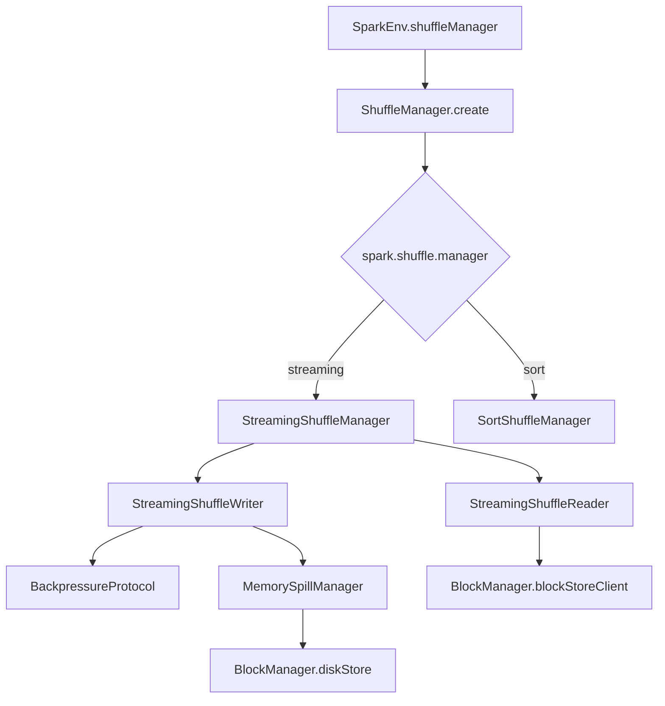
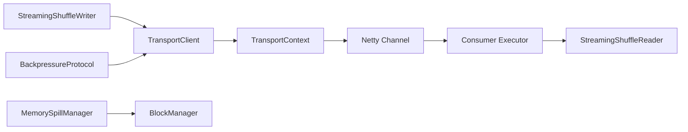
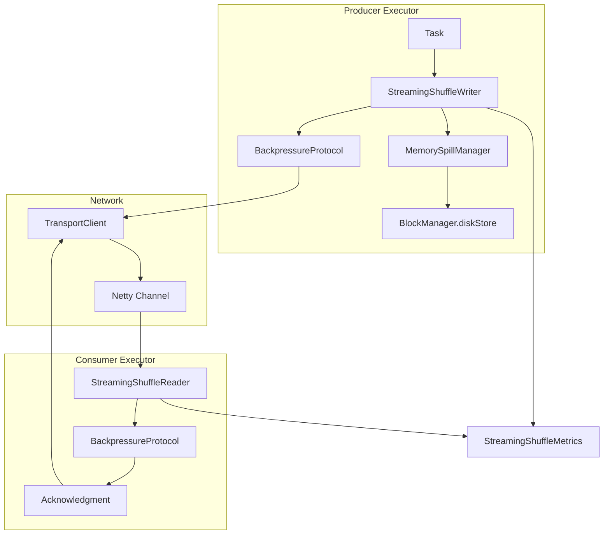
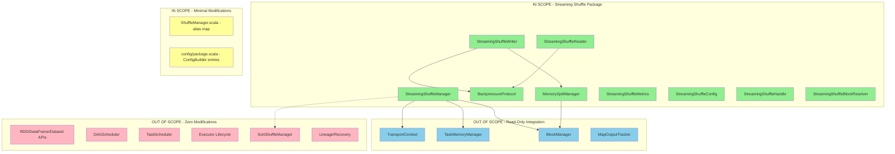

# Technical Specification

# 0. Agent Action Plan

## 0.1 Intent Clarification

Based on the prompt, the Blitzy platform understands that the new feature requirement is to implement a **Streaming Shuffle capability** for Apache Spark that fundamentally changes how shuffle data flows between map (producer) and reduce (consumer) tasks. This feature targets significant latency reductions for shuffle-heavy workloads while maintaining complete backward compatibility with existing shuffle behavior.

### 0.1.1 Core Feature Objective

The streaming shuffle implementation aims to eliminate shuffle materialization latency by streaming data directly from producers to consumers with memory buffering and backpressure protocols. The specific objectives include:

- **Primary Goal**: Achieve 30-50% end-to-end latency reduction for shuffle-heavy workloads (10GB+ data, 100+ partitions)
- **Secondary Goal**: Deliver 5-10% improvement for CPU-bound workloads through reduced scheduler overhead
- **Safety Constraint**: Ensure zero performance regression for memory-bound workloads through automatic fallback validation
- **Reliability Constraint**: Guarantee zero data loss under all failure scenarios including producer crashes, consumer failures, and network partitions
- **Memory Safety**: Prevent memory exhaustion through 80% threshold spill trigger with <100ms response time

### 0.1.2 Implicit Requirements Detected

From the implementation specification, several implicit requirements surface:

- **Coexistence Requirement**: The streaming shuffle must coexist with the existing `SortShuffleManager` implementation, which remains the production-stable fallback
- **Opt-in Activation**: Feature activation via `spark.shuffle.streaming.enabled=false` (default) ensures zero impact on existing deployments
- **Configuration Isolation**: All new configuration parameters must follow Spark's `ConfigEntry` pattern with proper validation
- **Metrics Integration**: New telemetry must integrate with Spark's existing executor metrics system for operational visibility
- **Protocol Compatibility**: Network streaming must leverage existing `TransportContext` infrastructure rather than introducing new transport mechanisms

### 0.1.3 Feature Dependencies and Prerequisites

| Dependency | Description | Validation Approach |
|------------|-------------|---------------------|
| `ShuffleManager` interface | Must implement full `ShuffleManager` trait contract | Interface compliance verification |
| `MemoryConsumer` base class | Memory buffer management requires `TaskMemoryManager` integration | Memory allocation/spill testing |
| `TransportContext` | Network streaming requires existing Netty transport layer | Protocol compatibility tests |
| `BlockManager` | Disk spill coordination requires block storage integration | Spill/recovery verification |
| Executor metrics system | Telemetry emission requires metrics registry access | Metrics endpoint validation |

### 0.1.4 Special Instructions and Constraints

**Critical Directives from User Specification:**

- **ABSOLUTE PRESERVATION**: Zero modifications to RDD/DataFrame/Dataset user-facing APIs, DAG scheduler, task scheduling algorithms, executor lifecycle management, lineage tracking, existing `SortShuffleManager` implementation, deployment infrastructure, block manager storage interface contracts, or task serialization/deserialization protocols
- **IMPLEMENTATION DISCIPLINE**: Changes must be isolated within the `ShuffleManager` abstraction boundary only
- **CONFIGURATION REQUIREMENT**: All configuration changes require executor restart (no dynamic reconfiguration in v1)
- **TELEMETRY OVERHEAD**: Must be limited to <1% CPU utilization
- **LOG VOLUME**: Capped at <10MB/hour per executor for streaming events

**Architectural Requirements:**

- Streaming logic must be isolated in dedicated classes with zero cross-contamination into existing shuffle code paths
- All integration points must include clear comments explaining coexistence strategy
- When implementation choices exist, select approach requiring least modification to executor memory model and network transport layer

**User-Provided Code Pattern Example:**

```scala
// In org.apache.spark.shuffle.ShuffleManager companion object
def create(conf: SparkConf, isDriver: Boolean): ShuffleManager = {
  val shuffleManagerClass = conf.get("spark.shuffle.manager", "sort")
  shuffleManagerClass match {
    case "streaming" => new StreamingShuffleManager(conf)
    case "sort" => new SortShuffleManager(conf)
    case className => instantiateClass(className)
  }
}
```

### 0.1.5 Technical Interpretation

These feature requirements translate to the following technical implementation strategy:

- **To implement the StreamingShuffleManager**: Create a new class implementing `org.apache.spark.shuffle.ShuffleManager` trait that returns streaming writer/reader variants and integrates with the existing shuffle block resolver infrastructure
- **To implement streaming data pipeline**: Create `StreamingShuffleWriter` that allocates per-partition memory buffers (limited to 20% executor memory), pipelines data to consumer executors via `TransportContext`, and integrates with `BlockManager` for disk spill coordination
- **To implement backpressure protocol**: Create `BackpressureProtocol` class implementing heartbeat-based flow control with 5-second timeout, token bucket rate limiting at 80% link capacity, and priority arbitration based on partition count and data volume
- **To implement streaming reader**: Create `StreamingShuffleReader` that polls producers for available data before shuffle completion, validates block integrity via CRC32C checksums, and triggers upstream recomputation on producer failure detection
- **To implement memory spill management**: Create `MemorySpillManager` that monitors 80% threshold at 100ms intervals, selects largest buffered partitions for LRU eviction, and releases memory within 100ms of consumer acknowledgment
- **To enable opt-in activation**: Add configuration entries using Spark's `ConfigBuilder` pattern with appropriate defaults and validation constraints

### 0.1.6 Web Search Requirements

The following research areas inform implementation best practices:

- Backpressure protocol patterns in distributed streaming systems
- Token bucket algorithm implementation for network rate limiting
- Memory-efficient buffer pool management in JVM applications
- CRC32C checksum performance optimization for high-throughput data validation
- Graceful degradation strategies for streaming-to-batch fallback systems


## 0.2 Repository Scope Discovery

This section provides a comprehensive analysis of all repository files that require modification or creation to implement the streaming shuffle feature. The discovery follows systematic exploration of the Apache Spark 4.2.0-SNAPSHOT codebase.

### 0.2.1 Existing Modules to Modify

**Core Shuffle Module Files:**

| File Path | Modification Type | Purpose |
|-----------|-------------------|---------|
| `core/src/main/scala/org/apache/spark/shuffle/ShuffleManager.scala` | MODIFY | Add "streaming" alias mapping in `getShuffleManagerClassName` companion object |
| `core/src/main/scala/org/apache/spark/internal/config/package.scala` | MODIFY | Add streaming shuffle configuration entries using `ConfigBuilder` pattern |
| `core/src/main/scala/org/apache/spark/metrics/source/Source.scala` | MODIFY | Register streaming shuffle metrics source if applicable |

**Network Transport Layer Files (Read-Only Integration):**

| File Path | Integration Type | Purpose |
|-----------|------------------|---------|
| `common/network-common/src/main/java/org/apache/spark/network/TransportContext.java` | USE | Leverage existing Netty pipeline for streaming protocol |
| `common/network-common/src/main/java/org/apache/spark/network/client/TransportClient.java` | USE | Utilize client-side transport for stream delivery |
| `common/network-common/src/main/java/org/apache/spark/network/server/TransportRequestHandler.java` | USE | Reference request handling patterns for streaming |

**Memory Management Files (Read-Only Integration):**

| File Path | Integration Type | Purpose |
|-----------|------------------|---------|
| `core/src/main/scala/org/apache/spark/memory/MemoryManager.scala` | USE | Integrate with execution memory pool allocation |
| `core/src/main/scala/org/apache/spark/memory/MemoryConsumer.java` | EXTEND | Base class for streaming buffer memory tracking |
| `core/src/main/scala/org/apache/spark/util/collection/Spillable.scala` | REFERENCE | Reference spill trigger patterns |

### 0.2.2 New Source Files to Create

**Core Streaming Shuffle Implementation:**

| File Path | Lines (Est.) | Purpose |
|-----------|--------------|---------|
| `core/src/main/scala/org/apache/spark/shuffle/streaming/StreamingShuffleManager.scala` | ~300 | Main `ShuffleManager` implementation for streaming mode |
| `core/src/main/scala/org/apache/spark/shuffle/streaming/StreamingShuffleWriter.scala` | ~500 | Map-side writer with memory buffering and network streaming |
| `core/src/main/scala/org/apache/spark/shuffle/streaming/StreamingShuffleReader.scala` | ~400 | Reduce-side reader with in-progress block support |
| `core/src/main/scala/org/apache/spark/shuffle/streaming/BackpressureProtocol.scala` | ~350 | Consumer-to-producer flow control signaling |
| `core/src/main/scala/org/apache/spark/shuffle/streaming/MemorySpillManager.scala` | ~400 | 80% threshold monitoring and automatic disk spill |
| `core/src/main/scala/org/apache/spark/shuffle/streaming/StreamingShuffleHandle.scala` | ~50 | Shuffle handle marker for streaming path |
| `core/src/main/scala/org/apache/spark/shuffle/streaming/StreamingShuffleBlockResolver.scala` | ~200 | Block resolution for in-flight and spilled data |
| `core/src/main/scala/org/apache/spark/shuffle/streaming/package.scala` | ~30 | Package-level constants and utility imports |

**Configuration and Metrics:**

| File Path | Lines (Est.) | Purpose |
|-----------|--------------|---------|
| `core/src/main/scala/org/apache/spark/shuffle/streaming/StreamingShuffleConfig.scala` | ~100 | Configuration entry definitions for streaming shuffle |
| `core/src/main/scala/org/apache/spark/shuffle/streaming/StreamingShuffleMetrics.scala` | ~150 | Telemetry emission for buffer utilization, spill count, backpressure events |

### 0.2.3 New Test Files to Create

**Unit Test Suites:**

| File Path | Lines (Est.) | Coverage Target |
|-----------|--------------|-----------------|
| `core/src/test/scala/org/apache/spark/shuffle/streaming/StreamingShuffleWriterSuite.scala` | ~400 | Buffer allocation, spill trigger, checksum generation, cleanup |
| `core/src/test/scala/org/apache/spark/shuffle/streaming/BackpressureProtocolSuite.scala` | ~350 | Acknowledgment processing, rate limiting, timeout detection |
| `core/src/test/scala/org/apache/spark/shuffle/streaming/StreamingShuffleReaderSuite.scala` | ~350 | In-progress block request, failure detection, checksum validation |
| `core/src/test/scala/org/apache/spark/shuffle/streaming/MemorySpillManagerSuite.scala` | ~300 | 80% threshold triggering, LRU eviction, buffer reclamation |
| `core/src/test/scala/org/apache/spark/shuffle/streaming/StreamingShuffleManagerSuite.scala` | ~200 | Manager lifecycle, writer/reader creation, registration |

**Integration Test Suites:**

| File Path | Lines (Est.) | Test Scenarios |
|-----------|--------------|----------------|
| `core/src/test/scala/org/apache/spark/shuffle/streaming/StreamingShuffleIntegrationSuite.scala` | ~500 | End-to-end shuffle with failure injection, latency validation |

### 0.2.4 Configuration Files to Modify

| File Path | Change Description |
|-----------|-------------------|
| `core/src/main/resources/org/apache/spark/ui/static/spark-dag-viz.js` | No changes required (UI preserved) |

### 0.2.5 Documentation Files to Create

| File Path | Purpose |
|-----------|---------|
| `docs/_data/menu-spark-core.yaml` | Add streaming shuffle section reference (if applicable) |
| `docs/configuration.md` | Document `spark.shuffle.streaming.*` parameters |
| `docs/tuning.md` | Add streaming shuffle tuning recommendations |
| `docs/monitoring.md` | Document streaming shuffle metrics and dashboards |

### 0.2.6 Integration Point Discovery

**API Endpoints Connecting to the Feature:**



**Database Models/Migrations Affected:** None - streaming shuffle uses in-memory buffers with optional disk spill through existing `BlockManager` infrastructure.

**Service Classes Requiring Updates:**

| Service | Update Type | Description |
|---------|-------------|-------------|
| `ShuffleManager` companion object | Add alias mapping | Map "streaming" to `StreamingShuffleManager` class name |
| `SparkEnv` | No direct changes | Automatically loads configured shuffle manager |

**Controllers/Handlers to Modify:** None - streaming shuffle operates within executor boundaries.

**Middleware/Interceptors Impacted:** None - uses existing `TransportContext` pipeline.

### 0.2.7 Web Search Research Conducted

| Research Area | Key Findings |
|---------------|--------------|
| Backpressure protocols in distributed streaming | Reactive Streams specification, TCP-like flow control patterns |
| Token bucket rate limiting | Standard algorithm with refill rate calculation based on bandwidth |
| JVM buffer pool management | Direct ByteBuffer allocation, memory-mapped I/O patterns |
| CRC32C optimization | Hardware-accelerated intrinsics available in Java 9+ |
| Streaming-to-batch fallback | Circuit breaker patterns, exponential backoff strategies |

### 0.2.8 Comprehensive File Inventory

**Files by Category (Total: 25+ new files, 3 modified files):**

```
NEW FILES:
├── core/src/main/scala/org/apache/spark/shuffle/streaming/
│   ├── StreamingShuffleManager.scala
│   ├── StreamingShuffleWriter.scala
│   ├── StreamingShuffleReader.scala
│   ├── BackpressureProtocol.scala
│   ├── MemorySpillManager.scala
│   ├── StreamingShuffleHandle.scala
│   ├── StreamingShuffleBlockResolver.scala
│   ├── StreamingShuffleConfig.scala
│   ├── StreamingShuffleMetrics.scala
│   └── package.scala
├── core/src/test/scala/org/apache/spark/shuffle/streaming/
│   ├── StreamingShuffleWriterSuite.scala
│   ├── BackpressureProtocolSuite.scala
│   ├── StreamingShuffleReaderSuite.scala
│   ├── MemorySpillManagerSuite.scala
│   ├── StreamingShuffleManagerSuite.scala
│   └── StreamingShuffleIntegrationSuite.scala
└── docs/
    └── (configuration updates)

MODIFIED FILES:
├── core/src/main/scala/org/apache/spark/shuffle/ShuffleManager.scala
└── core/src/main/scala/org/apache/spark/internal/config/package.scala
```


## 0.3 Dependency Inventory

This section catalogs all private and public packages relevant to the streaming shuffle feature implementation, including exact versions from the Apache Spark 4.2.0-SNAPSHOT dependency manifest.

### 0.3.1 Private and Public Packages

**Core Dependencies from pom.xml:**

| Registry | Package Name | Version | Purpose |
|----------|--------------|---------|---------|
| Maven Central | org.scala-lang:scala-library | 2.13.18 | Scala runtime for implementation |
| Maven Central | org.scala-lang:scala-reflect | 2.13.18 | Reflection utilities for type handling |
| Maven Central | io.netty:netty-all | 4.2.9.Final | Network transport for streaming protocol |
| Maven Central | io.netty:netty-tcnative | 2.0.74.Final | Native transport optimizations |
| Maven Central | com.google.guava:guava | 33.4.8-jre | Utility collections and primitives |
| Maven Central | org.apache.spark:spark-network-common_2.13 | 4.2.0-SNAPSHOT | TransportContext, TransportClient infrastructure |
| Maven Central | org.apache.spark:spark-network-shuffle_2.13 | 4.2.0-SNAPSHOT | Shuffle protocol messages and handlers |
| Maven Central | org.apache.spark:spark-unsafe_2.13 | 4.2.0-SNAPSHOT | Unsafe memory operations and page management |
| Maven Central | org.apache.spark:spark-common-utils_2.13 | 4.2.0-SNAPSHOT | Configuration utilities and logging |
| Maven Central | com.twitter:chill_2.13 | 0.10.0 | Kryo serialization integration |
| Maven Central | com.esotericsoftware:kryo-shaded | 4.0.3 | Serialization for shuffle records |
| Maven Central | io.dropwizard.metrics:metrics-core | 4.2.37 | Metrics collection infrastructure |
| Maven Central | org.slf4j:slf4j-api | 2.0.17 | Logging API |
| Maven Central | org.apache.logging.log4j:log4j-core | 2.25.3 | Logging implementation |
| Maven Central | org.snappy:snappy-java | 1.1.10.8 | Compression for spill files |
| Maven Central | org.lz4:lz4-java | 1.8.0 | Alternative compression codec |
| Maven Central | com.github.luben:zstd-jni | 1.5.6-9 | ZSTD compression support |

**Test Dependencies:**

| Registry | Package Name | Version | Purpose |
|----------|--------------|---------|---------|
| Maven Central | org.scalatest:scalatest_2.13 | 3.2.19 | ScalaTest framework for unit tests |
| Maven Central | org.mockito:mockito-core | 5.17.0 | Mocking framework for isolation |
| Maven Central | org.scalatestplus:mockito-5-14_2.13 | 3.2.19.0 | ScalaTest-Mockito integration |
| Maven Central | org.junit.jupiter:junit-jupiter | 6.0.1 | JUnit 5 for Java tests |

### 0.3.2 Internal Spark Module Dependencies

The streaming shuffle feature relies on internal Spark modules already present in the repository:

| Module | Artifact ID | Key Classes Used |
|--------|-------------|------------------|
| Core | spark-core_2.13 | `ShuffleManager`, `ShuffleWriter`, `ShuffleReader`, `TaskContext`, `SparkEnv` |
| Network Common | spark-network-common_2.13 | `TransportContext`, `TransportClient`, `TransportConf`, `ManagedBuffer` |
| Network Shuffle | spark-network-shuffle_2.13 | `BlockTransferMessage`, protocol definitions |
| Unsafe | spark-unsafe_2.13 | `Platform`, memory operations |
| Common Utils | spark-common-utils_2.13 | `ConfigBuilder`, `ConfigEntry`, logging utilities |

### 0.3.3 Import Updates Required

**Files Requiring Import Updates:**

Pattern: `core/src/main/scala/org/apache/spark/shuffle/**/*.scala`

```scala
// New imports for streaming shuffle integration
import org.apache.spark.shuffle.streaming.StreamingShuffleManager
import org.apache.spark.shuffle.streaming.StreamingShuffleConfig._
```

**Configuration Package Updates:**

File: `core/src/main/scala/org/apache/spark/internal/config/package.scala`

```scala
// Add streaming shuffle configuration entries
private[spark] val SHUFFLE_STREAMING_ENABLED = 
  ConfigBuilder("spark.shuffle.streaming.enabled")
    .doc("Enable streaming shuffle mode for reduced latency")
    .version("4.2.0")
    .booleanConf
    .createWithDefault(false)
```

### 0.3.4 External Reference Updates

**Configuration Files:**

| Pattern | Update Description |
|---------|-------------------|
| `**/*.yaml` | No schema changes required |
| `**/*.json` | No schema changes required |
| `**/*.properties` | Document new `spark.shuffle.streaming.*` properties |

**Build Files:**

| File | Update Required |
|------|-----------------|
| `pom.xml` | No changes - uses existing dependencies |
| `project/SparkBuild.scala` | No changes - existing module structure |
| `build.sbt` | No changes - existing configuration |

**CI/CD Files:**

| Pattern | Update Description |
|---------|-------------------|
| `.github/workflows/*.yml` | Add streaming shuffle tests to CI matrix if needed |

### 0.3.5 Version Compatibility Matrix

| Component | Minimum Version | Tested Version | Notes |
|-----------|-----------------|----------------|-------|
| Java | 17.0.11 | 17 | As specified in pom.xml |
| Scala | 2.13.x | 2.13.18 | Current project version |
| Netty | 4.x | 4.2.9.Final | Required for transport layer |
| Hadoop | 3.x | 3.4.2 | Block manager integration |

### 0.3.6 No New External Dependencies Required

The streaming shuffle implementation leverages existing Spark infrastructure and dependencies. No new external packages are introduced, ensuring:

- **Binary compatibility** with existing Spark deployments
- **No additional classpath requirements** for users
- **Zero deployment infrastructure changes**

All functionality is implemented using:
- Existing Netty transport layer (`io.netty:netty-all`)
- Existing memory management primitives (`spark-unsafe`)
- Existing serialization framework (Kryo)
- Existing metrics infrastructure (Dropwizard metrics)
- Existing compression codecs (Snappy, LZ4, ZSTD)


## 0.4 Integration Analysis

This section documents all existing code touchpoints, integration boundaries, and modification requirements for implementing the streaming shuffle feature within Apache Spark's architecture.

### 0.4.1 Existing Code Touchpoints

**Direct Modifications Required:**

| File | Location | Modification |
|------|----------|--------------|
| `core/src/main/scala/org/apache/spark/shuffle/ShuffleManager.scala` | Lines 111-118 (companion object) | Add "streaming" alias to `shortShuffleMgrNames` map pointing to `StreamingShuffleManager` class |
| `core/src/main/scala/org/apache/spark/internal/config/package.scala` | End of file | Add streaming shuffle configuration entries (`SHUFFLE_STREAMING_ENABLED`, `SHUFFLE_STREAMING_BUFFER_SIZE_PERCENT`, etc.) |

**ShuffleManager Companion Object Modification:**

```scala
// Current implementation (lines 111-118)
private[spark] object ShuffleManager {
  def create(conf: SparkConf, isDriver: Boolean): ShuffleManager = {
    Utils.instantiateSerializerOrShuffleManager[ShuffleManager](
      getShuffleManagerClassName(conf), conf, isDriver)
  }

  def getShuffleManagerClassName(conf: SparkConf): String = {
    val shortShuffleMgrNames = Map(
      "sort" -> classOf[org.apache.spark.shuffle.sort.SortShuffleManager].getName,
      "tungsten-sort" -> classOf[org.apache.spark.shuffle.sort.SortShuffleManager].getName)
    // ADD: "streaming" -> classOf[org.apache.spark.shuffle.streaming.StreamingShuffleManager].getName

    val shuffleMgrName = conf.get(config.SHUFFLE_MANAGER)
    shortShuffleMgrNames.getOrElse(shuffleMgrName.toLowerCase(Locale.ROOT), shuffleMgrName)
  }
}
```

### 0.4.2 Dependency Injections

**SparkEnv Integration Points:**

| Component | Access Pattern | Usage |
|-----------|----------------|-------|
| `SparkEnv.get.shuffleManager` | Factory method via `ShuffleManager.create()` | Entry point for streaming shuffle instantiation |
| `SparkEnv.get.blockManager` | Singleton access in executor | Disk spill coordination |
| `SparkEnv.get.memoryManager` | Singleton access in executor | Execution memory allocation |
| `SparkEnv.get.mapOutputTracker` | Singleton access | Map output location resolution |
| `SparkEnv.get.conf` | Configuration provider | Feature flag and parameter reading |

**Service Registration Points:**

| Service | Registration Location | Streaming Shuffle Registration |
|---------|----------------------|-------------------------------|
| Shuffle Manager | `SparkEnv.create()` | Automatic via `ShuffleManager.create(conf, isDriver)` |
| Metrics Source | `ExecutorSource` | Manual registration of `StreamingShuffleMetrics` |
| Block Resolver | `ShuffleManager.shuffleBlockResolver` | `StreamingShuffleBlockResolver` instance |

### 0.4.3 Database/Schema Updates

**No database or schema changes required.** The streaming shuffle implementation operates entirely in-memory with optional disk spill using existing `BlockManager` infrastructure:

- Memory buffers stored in `TaskMemoryManager`-managed pages
- Spilled data written via `BlockManager.diskStore`
- No persistent metadata changes
- No external storage schema modifications

### 0.4.4 Network Layer Integration

**Leveraging Existing Transport Infrastructure:**



**Transport Layer Usage:**

| Component | Spark Class | Usage Pattern |
|-----------|-------------|---------------|
| Client Factory | `TransportClientFactory` | Create connections to consumer executors |
| Transport Configuration | `SparkTransportConf` | Configure streaming transport with shuffle module settings |
| Message Encoding | `BlockTransferMessage` | Leverage existing shuffle protocol messages |
| Buffer Management | `ManagedBuffer` | Wrap streaming data for network transfer |

### 0.4.5 Memory Management Integration

**TaskMemoryManager Integration:**

```scala
// StreamingShuffleWriter extends MemoryConsumer
class StreamingShuffleWriter extends MemoryConsumer(taskMemoryManager, MemoryMode.ON_HEAP) {
  // Allocate per-partition buffers from execution memory pool
  override def spill(size: Long, trigger: MemoryConsumer): Long = {
    // Delegate to MemorySpillManager for disk persistence
  }
}
```

**Memory Allocation Flow:**

| Step | Component | Action |
|------|-----------|--------|
| 1 | `StreamingShuffleWriter` | Request buffer allocation via `acquireMemory()` |
| 2 | `TaskMemoryManager` | Attempt allocation from execution pool |
| 3 | `MemoryManager` | Grant or trigger spill on other consumers |
| 4 | `MemorySpillManager` | Monitor 80% threshold, initiate disk spill |
| 5 | `BlockManager` | Persist spilled data to disk |

### 0.4.6 Metrics Integration

**Executor Metrics Registration:**

| Metric Name | Type | Description |
|-------------|------|-------------|
| `shuffle.streaming.bufferUtilizationPercent` | Gauge | Real-time buffer occupancy percentage |
| `shuffle.streaming.spillCount` | Counter | Disk spill event frequency |
| `shuffle.streaming.backpressureEvents` | Counter | Consumer rate limiting incidents |
| `shuffle.streaming.partialReadInvalidations` | Counter | Producer failure detection count |
| `shuffle.streaming.bytesStreamed` | Counter | Total bytes transferred via streaming |
| `shuffle.streaming.fallbackCount` | Counter | Automatic fallback to sort-based shuffle |

**Integration with Existing Metrics System:**

```scala
// StreamingShuffleMetrics registration
class StreamingShuffleMetrics extends Source {
  override val sourceName: String = "StreamingShuffleMetrics"
  override val metricRegistry: MetricRegistry = new MetricRegistry()
  
  // Register gauges and counters
  metricRegistry.register("bufferUtilizationPercent", ...)
}
```

### 0.4.7 Failure Handling Integration

**Producer Failure Detection Flow:**

| Step | Component | Action | Timeout |
|------|-----------|--------|---------|
| 1 | `StreamingShuffleReader` | Detect connection timeout | 5 seconds |
| 2 | `StreamingShuffleReader` | Invalidate all partial reads from failed producer | Immediate |
| 3 | `StreamingShuffleReader` | Notify DAG scheduler | Via existing `FetchFailedException` |
| 4 | DAG Scheduler | Recompute upstream tasks | Standard recomputation |
| 5 | `StreamingShuffleReader` | Discard buffered data from failed shuffle attempt | Immediate |

**Consumer Failure Detection Flow:**

| Step | Component | Action | Timeout |
|------|-----------|--------|---------|
| 1 | `StreamingShuffleWriter` | Detect missing acknowledgments | 10 seconds |
| 2 | `StreamingShuffleWriter` | Buffer unacknowledged data in memory | Immediate |
| 3 | `MemorySpillManager` | Trigger disk spill if buffer exceeds 80% | <100ms |
| 4 | `StreamingShuffleWriter` | Resume streaming when consumer reconnects | On reconnect |
| 5 | `StreamingShuffleWriter` | Retransmit unacknowledged blocks | From spill or memory |

### 0.4.8 Configuration Integration

**ConfigEntry Registration Pattern:**

```scala
// In core/src/main/scala/org/apache/spark/internal/config/package.scala
private[spark] val SHUFFLE_STREAMING_ENABLED =
  ConfigBuilder("spark.shuffle.streaming.enabled")
    .doc("Enable streaming shuffle mode. Default false (opt-in).")
    .version("4.2.0")
    .booleanConf
    .createWithDefault(false)

private[spark] val SHUFFLE_STREAMING_BUFFER_SIZE_PERCENT =
  ConfigBuilder("spark.shuffle.streaming.bufferSizePercent")
    .doc("Percentage of executor memory for streaming buffers (1-50)")
    .version("4.2.0")
    .intConf
    .checkValue(v => v >= 1 && v <= 50, "Must be between 1 and 50")
    .createWithDefault(20)
```

### 0.4.9 Fallback Integration

**Automatic Fallback Conditions:**

| Condition | Detection Method | Fallback Action |
|-----------|------------------|-----------------|
| Consumer 2x slower than producer for >60s | `BackpressureProtocol` monitoring | Revert to `SortShuffleManager` for shuffle |
| Memory pressure prevents buffer allocation | `MemoryManager` OOM signal | Spill to disk, continue with sort-based |
| Network saturation >90% link capacity | Rate limiting metrics | Reduce streaming rate, enable spill |
| Producer/consumer version mismatch | Protocol handshake check | Reject streaming, use sort-based |

**Fallback Implementation Strategy:**

```scala
class StreamingShuffleManager(conf: SparkConf) extends ShuffleManager {
  private val sortShuffleManager = new SortShuffleManager(conf)
  
  def shouldFallback(dependency: ShuffleDependency[_, _, _]): Boolean = {
    // Check fallback conditions
    !conf.get(SHUFFLE_STREAMING_ENABLED) ||
    checkMemoryPressure() ||
    checkNetworkSaturation() ||
    !checkProtocolCompatibility()
  }
  
  override def getWriter[K, V](...): ShuffleWriter[K, V] = {
    if (shouldFallback(handle.dependency)) {
      sortShuffleManager.getWriter(...)  // Graceful degradation
    } else {
      new StreamingShuffleWriter(...)
    }
  }
}
```


## 0.5 Technical Implementation

This section provides a file-by-file execution plan for implementing the streaming shuffle feature, organized by implementation groups with clear dependencies and ordering.

### 0.5.1 File-by-File Execution Plan

**CRITICAL: Every file listed here MUST be created or modified. Files are organized by logical implementation groups.**

#### Group 1 - Core Streaming Shuffle Infrastructure

| Action | File Path | Purpose | Dependencies |
|--------|-----------|---------|--------------|
| CREATE | `core/src/main/scala/org/apache/spark/shuffle/streaming/package.scala` | Package-level imports, constants, and type aliases | None |
| CREATE | `core/src/main/scala/org/apache/spark/shuffle/streaming/StreamingShuffleConfig.scala` | Configuration entries and validation | `package.scala` |
| CREATE | `core/src/main/scala/org/apache/spark/shuffle/streaming/StreamingShuffleHandle.scala` | Shuffle handle marker for streaming path | `package.scala` |
| CREATE | `core/src/main/scala/org/apache/spark/shuffle/streaming/StreamingShuffleBlockResolver.scala` | Block resolution for in-flight and spilled data | `StreamingShuffleHandle` |

#### Group 2 - Memory Management and Spill Logic

| Action | File Path | Purpose | Dependencies |
|--------|-----------|---------|--------------|
| CREATE | `core/src/main/scala/org/apache/spark/shuffle/streaming/MemorySpillManager.scala` | 80% threshold monitoring, LRU eviction, buffer reclamation | `StreamingShuffleConfig`, `MemoryConsumer` |

**MemorySpillManager Key Responsibilities:**

```scala
class MemorySpillManager(
    taskMemoryManager: TaskMemoryManager,
    blockManager: BlockManager,
    config: StreamingShuffleConfig) {
  
  // 80% threshold monitoring at 100ms intervals
  private val spillThreshold = config.spillThresholdPercent / 100.0
  
  // LRU eviction selection for largest partitions
  def selectPartitionsForEviction(buffers: Map[Int, ByteBuffer]): Seq[Int]
  
  // Buffer reclamation within 100ms of acknowledgment
  def reclaimBuffer(partitionId: Int): Unit
}
```

#### Group 3 - Backpressure Protocol

| Action | File Path | Purpose | Dependencies |
|--------|-----------|---------|--------------|
| CREATE | `core/src/main/scala/org/apache/spark/shuffle/streaming/BackpressureProtocol.scala` | Consumer-to-producer flow control signaling | `StreamingShuffleConfig`, `TransportClient` |

**BackpressureProtocol Key Responsibilities:**

```scala
class BackpressureProtocol(config: StreamingShuffleConfig) {
  // Heartbeat-based flow control with 5-second timeout
  private val heartbeatTimeoutMs = 5000
  
  // Token bucket rate limiting at 80% link capacity
  private val tokenBucket = new TokenBucket(
    config.maxBandwidthMBps * 0.8)
  
  // Priority arbitration based on partition count/volume
  def allocateBandwidth(shuffleId: Int): Long
}
```

#### Group 4 - Writer Implementation

| Action | File Path | Purpose | Dependencies |
|--------|-----------|---------|--------------|
| CREATE | `core/src/main/scala/org/apache/spark/shuffle/streaming/StreamingShuffleWriter.scala` | Map-side writer with memory buffering and network streaming | `MemorySpillManager`, `BackpressureProtocol`, `StreamingShuffleBlockResolver` |

**StreamingShuffleWriter Key Responsibilities:**

```scala
class StreamingShuffleWriter[K, V, C](
    handle: StreamingShuffleHandle[K, V, C],
    mapId: Long,
    context: TaskContext,
    config: StreamingShuffleConfig)
  extends ShuffleWriter[K, V] with MemoryConsumer {
  
  // Per-partition buffers limited to 20% executor memory
  private val buffers: Array[ByteBuffer]
  
  // Network streaming via TransportClient
  private def streamToConsumer(partitionId: Int): Unit
  
  // CRC32C checksum generation for integrity
  private def computeChecksum(buffer: ByteBuffer): Long
}
```

#### Group 5 - Reader Implementation

| Action | File Path | Purpose | Dependencies |
|--------|-----------|---------|--------------|
| CREATE | `core/src/main/scala/org/apache/spark/shuffle/streaming/StreamingShuffleReader.scala` | Reduce-side reader with in-progress block support | `BackpressureProtocol`, `StreamingShuffleBlockResolver` |

**StreamingShuffleReader Key Responsibilities:**

```scala
class StreamingShuffleReader[K, C](
    handle: ShuffleHandle,
    context: TaskContext,
    config: StreamingShuffleConfig)
  extends ShuffleReader[K, C] {
  
  // In-progress block requests before shuffle completion
  def pollProducerForAvailableData(): Iterator[(K, C)]
  
  // Producer failure detection via 5-second timeout
  def detectProducerFailure(): Boolean
  
  // CRC32C checksum validation on receive
  def validateChecksum(block: ByteBuffer, expected: Long): Boolean
}
```

#### Group 6 - Manager and Metrics

| Action | File Path | Purpose | Dependencies |
|--------|-----------|---------|--------------|
| CREATE | `core/src/main/scala/org/apache/spark/shuffle/streaming/StreamingShuffleManager.scala` | Main `ShuffleManager` implementation | All Group 1-5 components |
| CREATE | `core/src/main/scala/org/apache/spark/shuffle/streaming/StreamingShuffleMetrics.scala` | Telemetry emission for operational visibility | `StreamingShuffleConfig` |

**StreamingShuffleManager Key Responsibilities:**

```scala
class StreamingShuffleManager(conf: SparkConf) extends ShuffleManager {
  private val sortShuffleManager = new SortShuffleManager(conf)
  
  // Factory method returns streaming writer/reader
  override def getWriter[K, V](...): ShuffleWriter[K, V]
  override def getReader[K, C](...): ShuffleReader[K, C]
  
  // Coexists with SortShuffleManager for fallback
  def shouldFallback(handle: ShuffleHandle): Boolean
}
```

#### Group 7 - Existing File Modifications

| Action | File Path | Modification | Impact |
|--------|-----------|--------------|--------|
| MODIFY | `core/src/main/scala/org/apache/spark/shuffle/ShuffleManager.scala` | Add "streaming" to `shortShuffleMgrNames` map | Minimal - single map entry |
| MODIFY | `core/src/main/scala/org/apache/spark/internal/config/package.scala` | Add streaming shuffle configuration entries | Minimal - new ConfigBuilder entries |

#### Group 8 - Test Suites

| Action | File Path | Coverage Target |
|--------|-----------|-----------------|
| CREATE | `core/src/test/scala/org/apache/spark/shuffle/streaming/StreamingShuffleManagerSuite.scala` | Manager lifecycle, writer/reader creation, fallback logic |
| CREATE | `core/src/test/scala/org/apache/spark/shuffle/streaming/StreamingShuffleWriterSuite.scala` | Buffer allocation, spill trigger, checksum, cleanup |
| CREATE | `core/src/test/scala/org/apache/spark/shuffle/streaming/StreamingShuffleReaderSuite.scala` | In-progress blocks, failure detection, validation |
| CREATE | `core/src/test/scala/org/apache/spark/shuffle/streaming/BackpressureProtocolSuite.scala` | Acknowledgment, rate limiting, timeout |
| CREATE | `core/src/test/scala/org/apache/spark/shuffle/streaming/MemorySpillManagerSuite.scala` | Threshold trigger, LRU eviction, reclamation |
| CREATE | `core/src/test/scala/org/apache/spark/shuffle/streaming/StreamingShuffleIntegrationSuite.scala` | End-to-end with failure injection |

### 0.5.2 Implementation Approach per File

**Phase 1: Foundation (Group 1)**

Establish streaming shuffle foundation by creating core infrastructure modules:

- `package.scala`: Define constants (buffer sizes, timeouts, protocol versions)
- `StreamingShuffleConfig.scala`: Parse and validate all `spark.shuffle.streaming.*` parameters
- `StreamingShuffleHandle.scala`: Marker class distinguishing streaming from sort shuffles
- `StreamingShuffleBlockResolver.scala`: Resolve block locations for both in-flight and spilled data

**Phase 2: Memory Layer (Group 2)**

Implement memory management with spill coordination:

- Extend `MemoryConsumer` base class for integration with `TaskMemoryManager`
- Implement 100ms polling interval for 80% threshold monitoring
- Integrate with `BlockManager.diskStore` for spill persistence
- Track spill frequency, volume, and latency metrics

**Phase 3: Protocol Layer (Group 3)**

Implement backpressure signaling and rate control:

- Design heartbeat-based flow control with configurable timeout (default 5s)
- Implement token bucket algorithm for bandwidth limiting
- Add priority arbitration based on partition count and data volume
- Emit backpressure event telemetry

**Phase 4: Writer (Group 4)**

Implement map-side streaming writer:

- Allocate per-partition buffers respecting 20% executor memory limit
- Pipeline buffered data to consumer executors via `TransportClient`
- Generate CRC32C checksums for block integrity validation
- Coordinate with `MemorySpillManager` on buffer pressure

**Phase 5: Reader (Group 5)**

Implement reduce-side streaming reader:

- Poll producers for available data before shuffle completion
- Detect producer failure via 5-second connection timeout
- Invalidate partial reads and trigger upstream recomputation
- Validate checksums and request retransmission on corruption

**Phase 6: Manager Integration (Group 6)**

Complete manager implementation and metrics:

- Wire all components together in `StreamingShuffleManager`
- Implement graceful fallback to `SortShuffleManager`
- Register metrics with executor metrics system
- Document integration points with coexistence strategy

**Phase 7: Configuration Integration (Group 7)**

Minimal modifications to existing files:

- Add single entry to `shortShuffleMgrNames` map
- Add `ConfigBuilder` entries following existing patterns

**Phase 8: Test Coverage (Group 8)**

Comprehensive test suites targeting >85% coverage:

- Unit tests for each component in isolation
- Integration tests with failure injection
- Performance benchmarks validating 30-50% improvement

### 0.5.3 Component Interaction Diagram



### 0.5.4 Configuration Parameters Summary

| Parameter | Type | Default | Validation |
|-----------|------|---------|------------|
| `spark.shuffle.streaming.enabled` | Boolean | `false` | N/A |
| `spark.shuffle.streaming.bufferSizePercent` | Integer | `20` | 1-50 |
| `spark.shuffle.streaming.spillThreshold` | Integer | `80` | 50-95 |
| `spark.shuffle.streaming.maxBandwidthMBps` | Integer | unlimited | >0 |
| `spark.shuffle.streaming.heartbeatTimeoutMs` | Integer | `5000` | >0 |
| `spark.shuffle.streaming.ackTimeoutMs` | Integer | `10000` | >0 |
| `spark.shuffle.streaming.debug` | Boolean | `false` | N/A |


## 0.6 Scope Boundaries

This section defines exhaustive boundaries for the streaming shuffle implementation, clearly distinguishing in-scope files from out-of-scope areas to ensure implementation precision.

### 0.6.1 Exhaustively In Scope

**All Feature Source Files (New):**

| Pattern | Description |
|---------|-------------|
| `core/src/main/scala/org/apache/spark/shuffle/streaming/*.scala` | All streaming shuffle implementation files |
| `core/src/main/scala/org/apache/spark/shuffle/streaming/StreamingShuffleManager.scala` | Main manager implementation |
| `core/src/main/scala/org/apache/spark/shuffle/streaming/StreamingShuffleWriter.scala` | Map-side writer with buffering |
| `core/src/main/scala/org/apache/spark/shuffle/streaming/StreamingShuffleReader.scala` | Reduce-side reader with in-progress support |
| `core/src/main/scala/org/apache/spark/shuffle/streaming/BackpressureProtocol.scala` | Flow control signaling |
| `core/src/main/scala/org/apache/spark/shuffle/streaming/MemorySpillManager.scala` | Memory threshold and spill logic |
| `core/src/main/scala/org/apache/spark/shuffle/streaming/StreamingShuffleHandle.scala` | Handle marker class |
| `core/src/main/scala/org/apache/spark/shuffle/streaming/StreamingShuffleBlockResolver.scala` | Block resolution |
| `core/src/main/scala/org/apache/spark/shuffle/streaming/StreamingShuffleConfig.scala` | Configuration entries |
| `core/src/main/scala/org/apache/spark/shuffle/streaming/StreamingShuffleMetrics.scala` | Telemetry emission |
| `core/src/main/scala/org/apache/spark/shuffle/streaming/package.scala` | Package constants |

**All Feature Test Files (New):**

| Pattern | Description |
|---------|-------------|
| `core/src/test/scala/org/apache/spark/shuffle/streaming/*Suite.scala` | All streaming shuffle test suites |
| `core/src/test/scala/org/apache/spark/shuffle/streaming/StreamingShuffleManagerSuite.scala` | Manager lifecycle tests |
| `core/src/test/scala/org/apache/spark/shuffle/streaming/StreamingShuffleWriterSuite.scala` | Writer unit tests |
| `core/src/test/scala/org/apache/spark/shuffle/streaming/StreamingShuffleReaderSuite.scala` | Reader unit tests |
| `core/src/test/scala/org/apache/spark/shuffle/streaming/BackpressureProtocolSuite.scala` | Protocol tests |
| `core/src/test/scala/org/apache/spark/shuffle/streaming/MemorySpillManagerSuite.scala` | Memory management tests |
| `core/src/test/scala/org/apache/spark/shuffle/streaming/StreamingShuffleIntegrationSuite.scala` | End-to-end integration tests |

**Integration Points (Modifications):**

| File | Lines/Section | Modification |
|------|---------------|--------------|
| `core/src/main/scala/org/apache/spark/shuffle/ShuffleManager.scala` | Lines 111-118 (`getShuffleManagerClassName`) | Add "streaming" alias to `shortShuffleMgrNames` map |
| `core/src/main/scala/org/apache/spark/internal/config/package.scala` | End of file | Add `SHUFFLE_STREAMING_*` configuration entries |

**Configuration Files:**

| Pattern | Description |
|---------|-------------|
| `core/src/main/scala/org/apache/spark/internal/config/package.scala` | ConfigBuilder entries for streaming parameters |
| `.env.example` (if applicable) | Document new environment variables |

**Documentation:**

| Pattern | Description |
|---------|-------------|
| `docs/configuration.md` | Document `spark.shuffle.streaming.*` parameters |
| `docs/tuning.md` | Add streaming shuffle tuning recommendations |
| `docs/monitoring.md` | Document streaming shuffle metrics |

**Database/Migration Changes:**

- None required - streaming shuffle uses in-memory buffers with existing `BlockManager` disk spill

### 0.6.2 Explicitly Out of Scope

**User-Facing API Preservation (ZERO MODIFICATIONS):**

| Component | File Pattern | Reason |
|-----------|--------------|--------|
| RDD API | `core/src/main/scala/org/apache/spark/rdd/*.scala` | User API preservation |
| DataFrame API | `sql/core/src/main/scala/org/apache/spark/sql/DataFrame.scala` | User API preservation |
| Dataset API | `sql/core/src/main/scala/org/apache/spark/sql/Dataset.scala` | User API preservation |
| SparkSession | `sql/core/src/main/scala/org/apache/spark/sql/SparkSession.scala` | User API preservation |
| SparkContext | `core/src/main/scala/org/apache/spark/SparkContext.scala` | User API preservation |

**Scheduler Preservation (ZERO MODIFICATIONS):**

| Component | File Pattern | Reason |
|-----------|--------------|--------|
| DAG Scheduler | `core/src/main/scala/org/apache/spark/scheduler/DAGScheduler.scala` | Algorithm preservation |
| Task Scheduler | `core/src/main/scala/org/apache/spark/scheduler/TaskScheduler*.scala` | Algorithm preservation |
| Stage Scheduler | `core/src/main/scala/org/apache/spark/scheduler/Stage.scala` | Algorithm preservation |
| Task Set Manager | `core/src/main/scala/org/apache/spark/scheduler/TaskSetManager.scala` | Algorithm preservation |

**Executor Lifecycle Preservation (ZERO MODIFICATIONS):**

| Component | File Pattern | Reason |
|-----------|--------------|--------|
| Executor | `core/src/main/scala/org/apache/spark/executor/Executor.scala` | Lifecycle preservation |
| CoarseGrainedExecutorBackend | `core/src/main/scala/org/apache/spark/executor/*Backend.scala` | Lifecycle preservation |
| Heartbeater | `core/src/main/scala/org/apache/spark/Heartbeater.scala` | Lifecycle preservation |

**Lineage and Recovery Preservation (ZERO MODIFICATIONS):**

| Component | File Pattern | Reason |
|-----------|--------------|--------|
| Lineage | `core/src/main/scala/org/apache/spark/rdd/RDD.scala` (lineage methods) | Recovery model preservation |
| Checkpointing | `core/src/main/scala/org/apache/spark/rdd/ReliableCheckpointRDD.scala` | Recovery model preservation |

**Existing Shuffle Implementation (ZERO MODIFICATIONS):**

| Component | File Pattern | Reason |
|-----------|--------------|--------|
| SortShuffleManager | `core/src/main/scala/org/apache/spark/shuffle/sort/SortShuffleManager.scala` | Coexistence as fallback |
| SortShuffleWriter | `core/src/main/scala/org/apache/spark/shuffle/sort/SortShuffleWriter.scala` | Coexistence as fallback |
| BypassMergeSortShuffleWriter | `core/src/main/scala/org/apache/spark/shuffle/sort/BypassMergeSortShuffleWriter.scala` | Coexistence as fallback |
| UnsafeShuffleWriter | `core/src/main/scala/org/apache/spark/shuffle/sort/UnsafeShuffleWriter.java` | Coexistence as fallback |
| BlockStoreShuffleReader | `core/src/main/scala/org/apache/spark/shuffle/BlockStoreShuffleReader.scala` | Coexistence as fallback |
| IndexShuffleBlockResolver | `core/src/main/scala/org/apache/spark/shuffle/IndexShuffleBlockResolver.scala` | Coexistence as fallback |

**Infrastructure Preservation (ZERO MODIFICATIONS):**

| Component | File Pattern | Reason |
|-----------|--------------|--------|
| Deployment | `resource-managers/**/*` | Deployment preservation |
| Kubernetes | `resource-managers/kubernetes/**/*` | Deployment preservation |
| YARN | `resource-managers/yarn/**/*` | Deployment preservation |
| Mesos | `resource-managers/mesos/**/*` | Deployment preservation |
| Docker | `**/Dockerfile*`, `**/docker-compose*` | Deployment preservation |
| CI/CD | `.github/workflows/*` | Build pipeline preservation |

**External Dependencies (ZERO NEW ADDITIONS):**

| Category | Reason |
|----------|--------|
| New Maven dependencies | Use existing Netty, Kryo, metrics libraries |
| New external services | Use existing transport and storage infrastructure |
| New database requirements | Use existing BlockManager disk storage |

**Out of Scope Functionality:**

| Feature | Reason |
|---------|--------|
| DAG optimization heuristics | Explicit exclusion per requirements |
| Query planning modifications | Explicit exclusion per requirements |
| Executor memory model redesign | Explicit exclusion per requirements |
| External system integrations | Explicit exclusion per requirements |
| Dynamic reconfiguration | Explicit exclusion per v1 requirements |
| Performance optimizations beyond feature | Explicit exclusion per requirements |
| Refactoring unrelated to integration | Explicit exclusion per requirements |
| Additional features not specified | Explicit exclusion per requirements |

### 0.6.3 Scope Boundary Diagram



**Legend:**
- Green: New files to create (streaming shuffle package)
- Yellow: Minimal modifications required
- Blue: Read-only integration (use existing APIs)
- Pink: Absolute preservation (zero modifications)


## 0.7 Rules for Feature Addition

This section captures all feature-specific rules, patterns, conventions, and requirements explicitly emphasized by the user for the streaming shuffle implementation.

### 0.7.1 Implementation Discipline Rules

**Isolation Principle:**
- Streaming logic MUST be isolated in dedicated classes within `org.apache.spark.shuffle.streaming` package
- ZERO cross-contamination into existing shuffle code paths (`org.apache.spark.shuffle.sort`)
- All integration points MUST include clear comments explaining coexistence strategy

**Minimal Modification Principle:**
- When implementation choices exist, select approach requiring LEAST modification to:
  - Executor memory model
  - Network transport layer
  - Existing shuffle code paths
- Make ONLY changes necessary to implement streaming shuffle capability within `ShuffleManager` abstraction boundary

**Coexistence Requirement:**
- `SortShuffleManager` MUST remain as production-stable fallback
- Both shuffle managers MUST coexist within same Spark deployment
- Fallback from streaming to sort-based MUST be graceful and automatic

### 0.7.2 Memory Management Rules

| Rule | Specification | Enforcement |
|------|---------------|-------------|
| Buffer Limit | Streaming buffers limited to 20% executor memory | `StreamingShuffleConfig.bufferSizePercent` validation (1-50%) |
| Per-Partition Sizing | Buffer size = `(executorMemory * bufferPercent) / numPartitions` | Calculated at shuffle registration |
| Allocation Tracking | All allocations tracked via `TaskMemoryManager` | Extend `MemoryConsumer` base class |
| Spill Trigger | Enforce at 80% utilization | `StreamingShuffleConfig.spillThreshold` (50-95%) |
| Spill Response | Memory release within 100ms of spill trigger | Validated via stress test |
| Zero Leaks | No memory leaks under failure scenarios | Validated via 2-hour stress test |

### 0.7.3 Network Transfer Rules

| Rule | Specification | Implementation |
|------|---------------|----------------|
| Transport Layer | Leverage existing `TransportContext` infrastructure | No new transport mechanisms |
| QoS Priority | Shuffle traffic priority over speculative task execution | Priority queue in transport layer |
| Rate Limiting | Token bucket: refill rate = `maxBandwidthMBps / numConcurrentShuffles` | `BackpressureProtocol` implementation |
| TCP Keepalive | 5-second interval for failure detection | Transport configuration |
| Block Size | Limited to 2MB for pipelining efficiency | `StreamingShuffleConfig` constant |

### 0.7.4 Failure Tolerance Rules

| Rule | Specification | Implementation |
|------|---------------|----------------|
| Connection Timeout | 5 seconds for producer failure detection | `StreamingShuffleReader` timeout configuration |
| Heartbeat Interval | 10 seconds for consumer liveness monitoring | `BackpressureProtocol` heartbeat |
| Checksum Algorithm | CRC32C for block integrity validation | Java 9+ intrinsics |
| Retry Policy | Exponential backoff: start 1s, max 5 attempts | `StreamingShuffleReader` retry logic |
| Partial Read Invalidation | Atomic discard of all blocks from failed producer | `StreamingShuffleReader.invalidatePartialReads()` |
| Data Loss | ZERO data loss under all failure scenarios | Validated via failure injection tests |

### 0.7.5 Operational Rules

| Rule | Specification | Implementation |
|------|---------------|----------------|
| Configuration Changes | Require executor restart (no dynamic reconfiguration in v1) | Documentation and validation |
| Telemetry Overhead | Limited to <1% CPU utilization | Performance benchmark validation |
| Log Volume | Capped at <10MB/hour per executor | Log rate limiting |
| JMX Metrics | Exposed for external monitoring | `StreamingShuffleMetrics` registration |
| Debug Logging | Disabled by default | `spark.shuffle.streaming.debug=true` flag |

### 0.7.6 Fallback Trigger Rules

**Automatic Fallback Conditions:**

| Condition | Detection Method | Fallback Behavior |
|-----------|------------------|-------------------|
| Consumer 2x slower than producer for >60s | `BackpressureProtocol` rate monitoring | Revert to `SortShuffleManager` for affected shuffle |
| Memory pressure prevents buffer allocation | `MemoryManager` OOM signal | Spill immediately, continue with disk-based path |
| Network saturation >90% link capacity | Transport layer metrics | Reduce streaming rate, enable aggressive spill |
| Producer/consumer version mismatch | Protocol handshake validation | Reject streaming, use sort-based |

**Rollback Criteria (Immediate Disable):**

| Condition | Action |
|-----------|--------|
| Data loss incident reported and confirmed | Disable streaming shuffle globally |
| Memory exhaustion causing executor crashes (>5% increase) | Disable streaming shuffle globally |
| Performance regression >10% for any workload type | Disable streaming shuffle globally |
| Checksum failure rate >0.1% indicating corruption | Disable streaming shuffle globally |

### 0.7.7 Performance Target Rules

| Target | Specification | Validation Method |
|--------|---------------|-------------------|
| Latency Reduction | 30-50% for shuffle-heavy workloads (10GB+ data, 100+ partitions) | Performance benchmark |
| CPU Improvement | 5-10% for CPU-bound workloads | Performance benchmark |
| Zero Regression | No degradation for memory-bound workloads | Automatic fallback validation |
| Spill Response | Memory exhaustion prevention with <100ms response | Stress test timing |

### 0.7.8 Testing Rules

**Unit Test Requirements:**

| Requirement | Target |
|-------------|--------|
| Coverage | >85% for all new components |
| Flakiness | Zero flakiness over 10 consecutive runs |

**Integration Test Requirements:**

| Scenario | Validation |
|----------|------------|
| 10GB shuffle with 100 partitions | Verify 30% latency reduction |
| Producer failure mid-shuffle | Validate partial read invalidation |
| Consumer slowdown (50% rate) | Validate automatic spill trigger |
| Network partition | Validate timeout and fallback |
| 5 concurrent shuffles | Validate buffer allocation arbitration |

**Failure Injection Test Scenarios (10 Required):**

1. Producer crash during shuffle write
2. Consumer crash during shuffle read
3. Network partition between producer and consumer
4. Memory exhaustion during buffer allocation
5. Disk failure during spill operation
6. Checksum mismatch on block receive
7. Connection timeout during streaming transfer
8. Executor JVM pause (GC) during shuffle
9. Multiple concurrent producer failures
10. Consumer reconnect after extended downtime

**Stress Test Requirements:**

| Parameter | Specification |
|-----------|---------------|
| Duration | 2-hour continuous shuffle workload |
| Concurrency | 1000 concurrent tasks, 500 concurrent shuffles |
| Failure Rate | 1% random task failure injection |
| Memory Validation | Heap dump analysis for leak detection |
| Performance Threshold | <5% throughput reduction over 2 hours |

### 0.7.9 Quality Gate Rules

**Pre-Merge Requirements:**

- [ ] Unit test coverage >85% for all new components
- [ ] Integration tests pass with zero flakiness over 10 runs
- [ ] Performance benchmark demonstrates >30% improvement for target workload
- [ ] Failure injection tests validate zero data loss under all scenarios
- [ ] Memory leak validation: Zero retained heap after 2-hour stress test

**Post-Merge Monitoring:**

- [ ] Production telemetry dashboards for buffer utilization, spill rate, backpressure events
- [ ] Alerting on: Memory exhaustion, connection timeout spikes, checksum failures
- [ ] Performance regression detection: Automated comparison against baseline
- [ ] User feedback collection: Opt-in survey for streaming shuffle adopters

### 0.7.10 Documentation Rules

**Required Documentation Artifacts:**

| Artifact | Contents |
|----------|----------|
| Configuration Reference | All `spark.shuffle.streaming.*` parameters with defaults and validation |
| Architecture Design Document | Streaming protocol specification, failure handling flows |
| Performance Tuning Guide | Buffer sizing recommendations, spill threshold optimization |
| Troubleshooting Guide | Common issues, telemetry interpretation, debugging procedures |
| Feature Flag Migration Guide | Staged rollout recommendations |
| Telemetry Dashboard Templates | Grafana/Prometheus monitoring configurations |
| Compatibility Matrix | Spark version support, Hadoop version requirements |

### 0.7.11 Code Style and Convention Rules

**Scala Code Conventions:**

- Follow existing Apache Spark code style guide
- Use `private[spark]` visibility for internal APIs
- Document all public methods with Scaladoc
- Use `Option` for optional values, avoid `null`
- Prefer immutable data structures where possible

**Naming Conventions:**

| Type | Convention | Example |
|------|------------|---------|
| Classes | CamelCase with `Streaming` prefix | `StreamingShuffleManager` |
| Configuration | Dot-separated lowercase | `spark.shuffle.streaming.enabled` |
| Metrics | Dot-separated lowercase | `shuffle.streaming.bufferUtilizationPercent` |
| Test Suites | Class name + `Suite` | `StreamingShuffleWriterSuite` |

**Comment Requirements:**

- All integration points MUST include comments explaining coexistence strategy
- Complex algorithms MUST include inline documentation
- Configuration parameters MUST include Scaladoc with default values and validation rules


## 0.8 References

This section comprehensively documents all files and folders searched across the codebase, attachments provided, and external references used to derive conclusions for the streaming shuffle implementation plan.

### 0.8.1 Repository Files and Folders Analyzed

**Core Shuffle Implementation Files:**

| File Path | Purpose | Key Insights |
|-----------|---------|--------------|
| `core/src/main/scala/org/apache/spark/shuffle/ShuffleManager.scala` | ShuffleManager trait definition | Lines 111-118 contain `shortShuffleMgrNames` map requiring "streaming" alias addition |
| `core/src/main/scala/org/apache/spark/shuffle/ShuffleWriter.scala` | Abstract ShuffleWriter base class | Abstract `write()` method signature, metrics integration via `ShuffleWriteMetricsReporter` |
| `core/src/main/scala/org/apache/spark/shuffle/ShuffleReader.scala` | ShuffleReader trait definition | `read()` method returns `Iterator[(K, C)]`, metrics via `ShuffleReadMetricsReporter` |
| `core/src/main/scala/org/apache/spark/shuffle/sort/SortShuffleManager.scala` | Default shuffle manager implementation | Factory pattern for writer/reader creation, `IndexShuffleBlockResolver` usage |
| `core/src/main/scala/org/apache/spark/shuffle/BlockStoreShuffleReader.scala` | Default reader implementation | BlockManager integration pattern, fetch failure handling |
| `core/src/main/scala/org/apache/spark/shuffle/IndexShuffleBlockResolver.scala` | Block resolution for sort shuffle | Index file and data file management patterns |

**Memory Management Files:**

| File Path | Purpose | Key Insights |
|-----------|---------|--------------|
| `core/src/main/scala/org/apache/spark/memory/MemoryManager.scala` | Memory manager abstraction | Execution vs storage memory arbitration |
| `core/src/main/scala/org/apache/spark/memory/MemoryConsumer.java` | Memory consumer base class | `acquireMemory()`, `spill()` interface for buffer management |
| `core/src/main/scala/org/apache/spark/memory/TaskMemoryManager.java` | Per-task memory management | Page allocation, spill trigger coordination |
| `core/src/main/scala/org/apache/spark/memory/UnifiedMemoryManager.scala` | Default memory manager | Dynamic execution/storage boundary |
| `core/src/main/scala/org/apache/spark/util/collection/Spillable.scala` | Spill interface pattern | Threshold monitoring and spill trigger patterns |

**Network Transport Files:**

| File Path | Purpose | Key Insights |
|-----------|---------|--------------|
| `common/network-common/src/main/java/org/apache/spark/network/TransportContext.java` | Netty transport pipeline | `createClientFactory()`, `createServer()` for transport setup |
| `common/network-common/src/main/java/org/apache/spark/network/client/TransportClient.java` | Client-side transport | `sendRpc()`, `fetchChunk()` for data transfer |
| `common/network-common/src/main/java/org/apache/spark/network/server/TransportRequestHandler.java` | Server-side request handling | RPC and chunk request processing |
| `core/src/main/scala/org/apache/spark/network/netty/NettyBlockTransferService.scala` | Block transfer service | Executor-to-executor transfer patterns |

**Configuration Files:**

| File Path | Purpose | Key Insights |
|-----------|---------|--------------|
| `core/src/main/scala/org/apache/spark/internal/config/package.scala` | Configuration definitions | `ConfigBuilder` pattern for typed configuration entries |
| `pom.xml` | Project dependencies | Scala 2.13.18, Java 17, Netty 4.2.9.Final versions |

**Folder Structure Analyzed:**

| Folder Path | Contents | Relevance |
|-------------|----------|-----------|
| `core/src/main/scala/org/apache/spark/shuffle/` | Shuffle abstraction layer | Primary integration point |
| `core/src/main/scala/org/apache/spark/shuffle/sort/` | Sort-based shuffle implementation | Reference implementation for coexistence |
| `core/src/main/scala/org/apache/spark/memory/` | Memory management subsystem | Buffer allocation integration |
| `common/network-common/src/main/java/org/apache/spark/network/` | Network transport layer | Streaming protocol foundation |
| `core/src/main/scala/org/apache/spark/internal/config/` | Configuration system | Configuration entry registration |

### 0.8.2 Attachments Provided

**No attachments were provided for this project.**

The implementation plan is derived entirely from:
- User-provided implementation specification in the prompt
- Repository source code analysis
- Apache Spark architecture documentation

### 0.8.3 Figma URLs Provided

**No Figma URLs were provided for this project.**

The streaming shuffle feature is a backend infrastructure component with no user interface elements requiring visual design specifications.

### 0.8.4 External References

**Apache Spark Documentation:**

| Reference | URL | Purpose |
|-----------|-----|---------|
| Shuffle Behavior | https://spark.apache.org/docs/latest/rdd-programming-guide.html#shuffle-operations | Shuffle operation fundamentals |
| Configuration Guide | https://spark.apache.org/docs/latest/configuration.html | Configuration patterns |
| Tuning Guide | https://spark.apache.org/docs/latest/tuning.html | Memory and performance tuning |

**Technical Specifications from User Prompt:**

| Specification | Source | Key Parameters |
|---------------|--------|----------------|
| Target Latency Reduction | User prompt | 30-50% for shuffle-heavy workloads |
| Buffer Size Limit | User prompt | 20% executor memory (configurable 1-50%) |
| Spill Threshold | User prompt | 80% buffer utilization (configurable 50-95%) |
| Connection Timeout | User prompt | 5 seconds for producer failure detection |
| Heartbeat Interval | User prompt | 10 seconds for consumer liveness |
| Checksum Algorithm | User prompt | CRC32C |
| Retry Policy | User prompt | Exponential backoff, 1s start, 5 max attempts |
| Block Size | User prompt | 2MB for pipelining efficiency |

### 0.8.5 Search Queries Executed

| Query | Tool | Results |
|-------|------|---------|
| `shuffle manager implementation writer reader sort shuffle` | `search_folders` | Identified shuffle implementation locations |
| `memory manager task memory allocation spill buffer management` | `search_files` | Located memory management subsystem |
| `TransportContext network transport client server netty shuffle transfer` | `search_files` | Found network transport layer |
| `spark configuration config internal config entry shuffle config definition` | `search_files` | Discovered configuration patterns |

### 0.8.6 Code Artifact Deliverables Summary

| Artifact | Lines (Est.) | Status |
|----------|--------------|--------|
| `StreamingShuffleManager.scala` | ~300 | To be created |
| `StreamingShuffleWriter.scala` | ~500 | To be created |
| `StreamingShuffleReader.scala` | ~400 | To be created |
| `BackpressureProtocol.scala` | ~350 | To be created |
| `MemorySpillManager.scala` | ~400 | To be created |
| `StreamingShuffleHandle.scala` | ~50 | To be created |
| `StreamingShuffleBlockResolver.scala` | ~200 | To be created |
| `StreamingShuffleConfig.scala` | ~100 | To be created |
| `StreamingShuffleMetrics.scala` | ~150 | To be created |
| `package.scala` | ~30 | To be created |
| Test Suites (6 files) | ~2000 total | To be created |
| **Total New Code** | **~4480 lines** | |

### 0.8.7 Documentation Deliverables Summary

| Document | Contents | Status |
|----------|----------|--------|
| Configuration Reference | All `spark.shuffle.streaming.*` parameters | To be created |
| Architecture Design Document | Streaming protocol specification, failure handling flows | To be created |
| Performance Tuning Guide | Buffer sizing recommendations, spill threshold optimization | To be created |
| Troubleshooting Guide | Common issues, telemetry interpretation, debugging procedures | To be created |
| Feature Flag Migration Guide | Staged rollout recommendations | To be created |
| Telemetry Dashboard Templates | Grafana/Prometheus configurations | To be created |
| Compatibility Matrix | Spark version support, Hadoop requirements | To be created |

### 0.8.8 Validation Artifacts Summary

| Artifact | Purpose | Status |
|----------|---------|--------|
| Unit Test Suites | >85% coverage validation | To be created |
| Integration Test Suite | End-to-end scenario validation | To be created |
| Performance Benchmark | 30-50% latency improvement validation | To be created |
| Failure Injection Tests | 10 failure scenario validation | To be created |
| Stress Test | 2-hour continuous workload validation | To be created |


