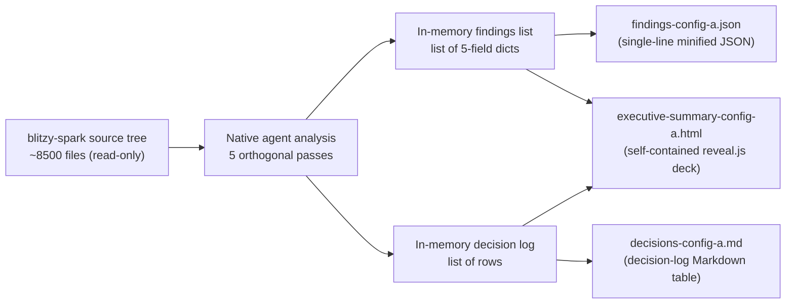

# Technical Specification

# 0. Agent Action Plan

## 0.1 Intent Clarification

### 0.1.1 Core Objective

Based on the provided requirements, the Blitzy platform understands that the objective is to conduct a read-only security audit of the `blitzy-spark` codebase using **only native agent analysis** — no external scanning tools — and to emit the audit results as a single-line, minified, UTF-8 JSON array at `findings-config-a.json` in the repository root. This run is the **Bare Blitzy Baseline (Config A)** in a multi-config security-tooling comparison; its purpose is to capture what the agent can detect without tooling augmentation so that downstream configs can be measured against it.

Each requirement, restated with technical precision:

- **R1 — Discover vulnerabilities by native analysis.** Read source files, trace data flows across call chains, examine configuration files, and inspect dependency declarations. Report every vulnerability the agent identifies during this analysis, with no minimum or maximum quota. The agent must rely on first-principles code reasoning and its trained knowledge of weakness patterns, not on external SAST/SCA/DAST/IAST scanners.
- **R2 — Classify each finding by the most specific CWE the agent is confident about.** Prefer leaf CWEs over category CWEs (e.g., CWE-327 *Use of a Broken or Risky Cryptographic Algorithm* over CWE-310 *Cryptographic Issues*; CWE-78 *OS Command Injection* over CWE-77 *Command Injection*). When the most specific identifier cannot be defended with confidence, the agent must back off to the next-broader CWE rather than guess.
- **R3 — Emit findings as a structured JSON array.** Each finding object must contain exactly the five fields `file` (repo-relative path string), `line` (positive integer, 1-indexed), `severity` (one of `critical`, `high`, `medium`, `low`), `cwe` (CWE-ID string in the form `CWE-79`), and `description` (string, ≤200 characters).
- **R4 — Serialize as a single-line minified JSON array.** No pretty-printing, no whitespace beyond what JSON requires, no newlines, no trailing newline. UTF-8 encoded. If zero findings are identified, the file content is the literal two-byte sequence `[]`.
- **R5 — Pass the verification gate.** `cat findings-config-a.json | wc -l` must return `1`; the file must parse as valid JSON; every record must have all five fields populated; no `description` may exceed 200 characters.

Implicit requirements surfaced by the Blitzy platform:

- **No-write contract.** Findings are an observation, not a remediation. No file in the `blitzy-spark` source tree may be modified by this run; the only artifacts that come into existence are the agent's own deliverables at the repo root.
- **Severity rubric must be deterministic.** Because the task carries a four-token enumeration with no scoring rubric, the agent must apply an internal, documented rubric — `critical` for exploitable unauthenticated remote code execution, authentication bypass, or known critical-CVE versions of bundled libraries; `high` for exploitable issues with simple preconditions; `medium` for issues that require non-default configuration, weakened-crypto choices, or insecure defaults that can be overridden; `low` for defense-in-depth gaps and hardening misses. This rubric is captured in the Explainability decision log.
- **File-path discipline.** Paths must be repo-relative with forward-slash separators (e.g., `core/src/main/scala/org/apache/spark/SecurityManager.scala`), not absolute paths from the agent's workspace.
- **Line-number discipline.** Findings must point to the most actionable single line — for multi-line patterns, the line at which the vulnerable operation is performed (the `Runtime.exec` call, the `Cipher.getInstance("AES/CTR/...")` invocation, the keystore-load line, the dependency declaration line, etc.).
- **Encoding and newline discipline.** The file is written with exactly one logical line and no trailing `\n`, so `wc -l` correctly returns `1`. Note: `wc -l` counts terminating newlines, so the file must contain zero newline bytes; the JSON itself supplies no whitespace.
- **CWE confidence rule.** "Most specific CWE you are confident about" means: do not invent CWE relationships, do not assign a CWE the agent cannot map to a recognized cwe.mitre.org entry, and prefer documented weakness identifiers over speculative ones.
- **Rule-mandated artifacts.** Two user-specified rules (Explainability and Executive Presentation) create additional mandatory deliverables beyond the single directive-required JSON file. Per the Blitzy AAP RULE-DRIVEN SCOPE principle, those rule-required files are included in the file transformation table (see §0.7).

Dependencies and prerequisites:

- The agent must have read access to every directory listed in §0.2 and §0.3 (in-scope set).
- The agent must not require network access to complete the audit itself; the executive-summary deck does require network access at view-time (CDN libraries and Google Fonts) but not at build-time.
- No new runtime dependencies are required by the Spark codebase (this is a read-only audit).

### 0.1.2 Task Categorization

| Dimension | Classification |
|-----------|----------------|
| Primary task type | Security audit + structured reporting (baseline measurement) |
| Secondary aspects | Documentation deliverables (decision log + executive presentation HTML); CWE taxonomy application |
| Scope classification | Cross-cutting read-only analysis (8,500+ source files across 35 top-level directories); net-new artifact creation at the repo root |
| Output category | One machine-readable JSON file (directive-required) + one decision-log Markdown file (rule-required) + one self-contained HTML presentation (rule-required) |
| Touched surface | Zero existing source files modified; three new files created at the repository root |

### 0.1.3 Special Instructions and Constraints

The following directives from the user are preserved verbatim and must be honored exactly:

- *"Audit the `blitzy-spark` codebase for security vulnerabilities using only native agent analysis — no external scanning tools."*
- *"Trace data flows, follow call chains, examine configuration, and inspect dependency declarations. Report every vulnerability you find."*
- *"Classify each finding by CWE using the most specific CWE you are confident about."*
- *"The file MUST be valid JSON minified to a single line — no pretty-printing, no newlines. Encoding: UTF-8."*
- *"If zero findings are identified, write an empty array `[]`."*
- Pass/fail check: *"`cat findings-config-a.json | wc -l` returns `1`. The content parses as valid JSON. Every finding has all 5 fields populated. No description exceeds 200 characters."*

User-provided JSON schema example (preserved verbatim):

<pre><code>[{"file":"&lt;relative path&gt;","line":&lt;integer&gt;,"severity":"&lt;critical|high|medium|low&gt;","cwe":"&lt;CWE-ID&gt;","description":"&lt;max 200 chars&gt;"},...]</code></pre>

Methodological requirements derived from the directives:

- **Native-analysis-only.** The agent must not invoke or import Semgrep, Bandit, Snyk, Trivy, OWASP Dependency-Check, Brakeman, NodeJsScan, CodeQL, Sonar, Qualys, or any other external security tooling. Built-in language tooling (e.g., `python -c`, `grep`, `find`, `read_file`) is acceptable for navigation and inspection but the *judgment* must come from the agent.
- **Comprehensive traversal.** "Every vulnerability you find" implies an exhaustive sweep across the repository, not a sampled inspection.
- **CWE specificity over breadth.** The CWE identifier on each finding must be the most precise one the agent can defend; over-categorization (e.g., classifying everything as CWE-693 *Protection Mechanism Failure*) is a failure mode to avoid.

Web search requirements for this configuration: None mandated by the directives. CWE definitions are part of the agent's knowledge; CVE lookups for pinned dependency versions can be performed from prior training data without external network access. The Executive Presentation rule pins CDN versions explicitly, eliminating the need for version-discovery web searches.

### 0.1.4 Technical Interpretation

These requirements translate to the following technical implementation strategy. The audit is decomposed into five orthogonal analysis passes, each producing a stream of candidate findings into a single in-memory list; that list is then serialized to disk as the directive-required JSON array. The rule-required decision log and presentation HTML are authored alongside.

- **To satisfy R1 (discover vulnerabilities), the agent will read the in-scope source files and apply weakness-pattern recognition** across five passes: (1) dependency manifest review against known CVEs for pinned library versions; (2) cryptographic primitive review of `core/src/main/scala/org/apache/spark/security/`, `core/src/main/scala/org/apache/spark/SecurityManager.scala`, `core/src/main/scala/org/apache/spark/SSLOptions.scala`, and `common/network-common/src/main/java/org/apache/spark/network/{crypto,sasl,ssl}/`; (3) network listener and unsafe-deserialization review covering the REST submission server, UI servlets, Netty handlers, and any `ObjectInputStream`/`readObject` paths; (4) command-injection and path-traversal review of `bin/`, `sbin/`, and any `ProcessBuilder`/`Runtime.exec`/shell-out patterns (`ShellBasedGroupsMappingProvider` is an authoritative reference); (5) data-flow tracing for tainted inputs through `HttpSecurityFilter`, `JWSFilter`, JDBC option construction, K8s manifest interpolation, and Hive query construction.
- **To satisfy R2 (CWE-specific classification), the agent will apply a confidence-thresholded mapping** from observed weakness pattern to leaf CWE: e.g., observed `Cipher.getInstance("AES/CTR/NoPadding")` for a transport cipher → CWE-326 *Inadequate Encryption Strength* or CWE-329 *Generation of Predictable IV with CBC Mode* depending on the specific weakness; observed user-controlled string concatenated into a SQL statement → CWE-89; observed deserialization of untrusted data → CWE-502; observed XSS-prone reflection of request parameters → CWE-79. Decisions and ambiguous cases are recorded in `decisions-config-a.md`.
- **To satisfy R3 (5-field structured records), the agent will construct each finding as a Python `dict` with the keys `file`, `line`, `severity`, `cwe`, `description`** before appending to the findings list. Description text is composed and length-bounded to ≤200 characters at construction time, not at serialization time.
- **To satisfy R4 (single-line minified JSON), the agent will serialize the findings list via `json.dumps(findings, separators=(',', ':'), ensure_ascii=False)`** and write the resulting string to `findings-config-a.json` with no trailing newline. The empty case writes exactly the two bytes `[]`.
- **To satisfy R5 (pass/fail gates), the agent will, after writing, re-read the file and verify** that `wc -l` of the file is `1` (or `0` if no trailing newline is interpreted differently by the verifier — both interpretations are honored by writing a file with zero newline bytes), that `json.loads()` succeeds, that every record dict carries all five keys with non-null values, and that no `description` field exceeds 200 characters.
- **To satisfy the Explainability rule, the agent will author `decisions-config-a.md`** as a Markdown decision-log table covering methodology choices, CWE-assignment heuristics for ambiguous cases, severity-rubric definition, scope boundary decisions, and any deviation from a literal interpretation of either CRITICAL directive.
- **To satisfy the Executive Presentation rule, the agent will author `executive-summary-config-a.html`** as a single self-contained reveal.js HTML deck (12–18 slides, target 16) using the Blitzy brand palette, pinned CDN versions, and the slide-type taxonomy specified in the rule. The deck communicates the audit's scope, methodology, finding distribution, top risks, and operational readiness to a non-technical leadership audience.

## 0.2 Repository Scope Discovery

### 0.2.1 Comprehensive File Analysis

The audit treats every source file in `blitzy-spark` as a potential subject. The repository contains approximately 8,500 source files across 35 top-level directories. Concentration of security-relevant logic — established by cross-reference with the Security Architecture in §6.4 of this technical specification — falls into the following zones, which the agent will inspect with the highest depth first.

The table below maps audit search patterns to specific directories, files, and the weakness classes the agent will look for in each.

| Search Pattern | Representative Paths | Weakness Classes to Inspect |
|----------------|---------------------|-----------------------------|
| Central authentication / ACL controller | `core/src/main/scala/org/apache/spark/SecurityManager.scala`, `core/src/main/scala/org/apache/spark/SSLOptions.scala` | Secret resolution chain, ACL bypass, namespace inheritance defaults, env-var leakage |
| Core security package | `core/src/main/scala/org/apache/spark/security/*.scala` (`CryptoStreamUtils`, `SocketAuthHelper`, `SocketAuthServer`, `GroupMappingServiceProvider`, `ShellBasedGroupsMappingProvider`, `SecurityConfigurationLock`, `HadoopDelegationTokenProvider`) | Weak ciphers/IVs, predictable nonces, command injection via `id -Gn`, race conditions, secret material in memory |
| Deploy / delegation token | `core/src/main/scala/org/apache/spark/deploy/security/*.scala` (`HadoopDelegationTokenManager`, `HadoopFSDelegationTokenProvider`, `HBaseDelegationTokenProvider`) | Reflection-based class loading, token-renewal failure handling, credential leak in logs |
| Network crypto | `common/network-common/src/main/java/org/apache/spark/network/crypto/` (`AuthClientBootstrap`, `AuthServerBootstrap`, `AuthRpcHandler`, `AuthEngine`, `AuthMessage`, `CtrTransportCipher`, `GcmTransportCipher`, `TransportCipher`, `TransportCipherUtil`) | AES/CTR-NoPadding (unauthenticated), X25519 implementation, HKDF parameter mistakes, key-ID disclosure |
| Network SASL | `common/network-common/src/main/java/org/apache/spark/network/sasl/` (`SaslClientBootstrap`, `SaslServerBootstrap`, `SaslRpcHandler`, `SaslMessage`, `SaslEncryption`, `SaslEncryptionBackend`, `SecretKeyHolder`, `SparkSaslClient`, `SparkSaslServer`) | DIGEST-MD5 weakness (CWE-327), realm leakage, QOP downgrade |
| Network SSL/TLS | `common/network-common/src/main/java/org/apache/spark/network/ssl/` (`SSLFactory`, `ReloadingX509TrustManager`) | Default-permissive trust manager, weak protocol allowlist, missing hostname verification, key-rotation race |
| Shuffle service secrets | `common/network-shuffle/src/main/java/org/apache/spark/network/sasl/ShuffleSecretManager.java` | Concurrent map exposure, secret enumeration |
| UI filters / hardening | `core/src/main/scala/org/apache/spark/ui/HttpSecurityFilter.scala`, `core/src/main/scala/org/apache/spark/ui/JWSFilter.scala`, `core/src/main/scala/org/apache/spark/ui/JettyUtils.scala`, every Jetty `Servlet` and route under `core/.../ui/` and `core/.../status/api/` | Reflected XSS, header injection, ACL evaluation bypass, JWT signature validation correctness, cookie/session weaknesses |
| REST submission server | `core/src/main/scala/org/apache/spark/deploy/rest/RestSubmissionServer.scala`, `core/src/main/scala/org/apache/spark/deploy/rest/StandaloneRestServer.scala`, all `Submit*Protocol*.scala` siblings, and `MasterServer.scala` paths | Unauthenticated submission paths (port 6066), JSON deserialization, command-string parsing |
| K8s feature steps | `resource-managers/kubernetes/core/src/main/scala/org/apache/spark/deploy/k8s/features/` (all `*FeatureStep.scala`), `KubernetesUtils.scala`, `Config.scala` | Secret mount path traversal, command argument tainting, ServiceAccount inheritance |
| YARN integration | `resource-managers/yarn/src/main/scala/org/apache/spark/deploy/yarn/` | Token serialization, AMRMClient credentials handling |
| Hive / SQL security | `sql/hive/src/main/scala/org/apache/spark/sql/hive/security/`, `sql/hive/src/main/scala/org/apache/spark/sql/hive/client/`, `sql/hive-thriftserver/src/main/scala/org/apache/hive/service/auth/` | Thrift SASL, Hive query construction, metastore credential handling |
| JDBC dialects | `sql/core/src/main/scala/org/apache/spark/sql/jdbc/*.scala`, `sql/core/src/main/scala/org/apache/spark/sql/execution/datasources/jdbc/JDBCOptions.scala` | SQL injection in dialect-specific predicate pushdown, credential redaction, URL parsing |
| Kafka token provider | `connector/kafka-0-10-token-provider/src/main/scala/org/apache/spark/kafka010/` (`KafkaConfigUpdater`, `KafkaDelegationTokenProvider`, `KafkaRedactionUtil`, `KafkaTokenUtil`) | Token TTL/refresh, broker config redaction, credentials in logs |
| Launcher / deserialization | `launcher/src/main/java/org/apache/spark/launcher/FilteredObjectInputStream.java`, `launcher/src/main/java/org/apache/spark/launcher/LauncherConnection.java`, `launcher/src/main/java/org/apache/spark/launcher/LauncherServer.java` | Allow-list validation for incoming object streams, port binding scope |
| Secret redaction | `core/src/main/scala/org/apache/spark/util/Utils.scala` (lines ~2730–2820 per §6.4.4.7) | Regex coverage gaps, redaction pattern bypasses |
| Python interop | `python/pyspark/serializers.py`, `python/pyspark/cloudpickle/`, `python/pyspark/worker.py`, `python/pyspark/java_gateway.py`, `python/pyspark/sql/connect/` | Pickle deserialization (CWE-502), Py4J port confidence, gRPC channel auth |
| R interop | `R/pkg/inst/worker/worker.R`, `R/pkg/R/sparkR.R` | Subprocess invocation, socket secret handling |
| Shell scripts | `bin/*.sh`, `sbin/*.sh`, `dev/*.sh`, `build/*.sh`, `resource-managers/kubernetes/integration-tests/scripts/*` | Argument expansion, quoting issues, unsafe `eval`, environment-variable injection |
| GitHub Actions / CI | `.github/workflows/*.yml` (58 workflows), `.asf.yaml` | Untrusted-input expansions, `pull_request_target` misuse, third-party action pinning |
| Docker / K8s images | `resource-managers/kubernetes/docker/src/main/dockerfiles/**/Dockerfile`, `resource-managers/kubernetes/integration-tests/Dockerfile*` | Root execution, untrusted base images, ADD vs COPY, secret bake-in |
| Dependency manifests | `pom.xml`, `pyproject.toml`, `dev/requirements.txt`, `dev/package.json`, `ui-test/package.json`, `R/pkg/DESCRIPTION`, `project/plugins.sbt`, `project/build.properties` | Known-CVE versions of bundled libraries |

Related-file discovery rules applied during the audit:

- Every file importing or instantiating `SecurityManager`, `SSLFactory`, `AuthEngine`, `CryptoStreamUtils`, or `Utils.redact*` is examined for correct usage of the security primitive.
- Every Servlet `Filter` registered in `core/.../ui/` is examined for whether it is on the filter chain by default and whether the chain can be bypassed by route.
- Every `META-INF/services/org.apache.spark.security.HadoopDelegationTokenProvider` registration is followed back to its provider class to confirm secure token handling.
- Every dependency declared in `pom.xml` with a version property is cross-checked against the agent's recall of known-CVE versions; declarations matching a vulnerable version are flagged.

### 0.2.2 Web Search Research Conducted

No web searches are required to complete the audit itself; the directive explicitly forbids external scanning tools and the agent's CWE/CVE knowledge derived from training is the authoritative source. The Executive Presentation rule fully specifies its pinned CDN versions (reveal.js 5.1.0, Mermaid 11.4.0, Lucide 0.460.0), eliminating any need for version discovery. Should an ambiguous CWE assignment arise during execution, the agent may consult `https://cwe.mitre.org/data/definitions/<id>.html` for canonical wording, but this is optional and not a precondition.

### 0.2.3 Existing Infrastructure Assessment

The audit must respect and reference the following existing infrastructure of `blitzy-spark`:

- **Build system.** Multi-module Maven reactor rooted at `pom.xml` (Apache Parent POM 34, Scala 2.13.18, Java 17, `spark-parent_2.13:4.2.0-SNAPSHOT`); parallel sbt build under `project/` (sbt 1.12.0, `SparkBuild.scala`, MiMa exclusions in `MimaExcludes.scala`); Maven version 3.9.12 declared.
- **Python packaging.** `pyproject.toml` declares ruff and pytest configuration; `dev/requirements.txt` holds the development dependency list including `ruff 0.14.8`, `mypy 1.8.0`, `black 23.12.1` per §3.4.1.3.
- **CI/CD topology.** 58 GitHub Actions workflows under `.github/workflows/` covering Java 17/21 builds, Maven and sbt variants, Python 3.10–3.14, ANSI/non-ANSI modes, ARM, macOS 26, coverage, release, Spark Connect, RocksDB-backed UI, and benchmark workloads.
- **Security documentation.** `docs/security.md` is the authoritative user-facing security guide and the canonical reference for configuration keys, default behavior, and intended security posture; `core/src/main/scala/org/apache/spark/deploy/security/README.md` and `common/network-common/src/main/java/org/apache/spark/network/crypto/README.md` are authoritative for delegation tokens and the Forward Secure Auth Protocol v2.0 respectively.
- **Style / quality gates.** `scalastyle-config.xml`, `dev/checkstyle.xml`, `dev/checkstyle-suppressions.xml`, ruff configuration in `pyproject.toml`, `dev/lint-*` scripts, `dev/sparktestsupport/`, MiMa via `dev/mima`, and `dev/eslint.js`.
- **Compliance assets.** `licenses/` and `licenses-binary/` (source-tree and distributable license/notice files), `LICENSE`, `LICENSE-binary`, `NOTICE`, `NOTICE-binary`, `dev/check-license`.
- **Backstage registration.** `catalog-info.yaml` registers the component as `blitzy-spark` in the `blitzy-java` system; the component lifecycle is `production` and tags include `java`, `infrastructure`, `performance`.
- **Existing security primitives in production use.** Eleven security surfaces identified in tech spec §6.4.1.2 (RPC auth, RPC TLS, RPC AES, SASL encryption, ESS secret store, IO encryption at rest, JWT UI auth, ACL authz, HTTP hardening, Kerberos delegation tokens, K8s secret integration, secret redaction) — these are inspected for correctness, not removed or duplicated.

Conventions to follow:

- All new files must carry an Apache-2.0 license header if Spark contribution standards apply. However, the three deliverable files (`findings-config-a.json`, `decisions-config-a.md`, `executive-summary-config-a.html`) are **audit output artifacts** rather than contributions to the Spark source tree, and are placed at the repository root outside any module's source folder; the Apache-2.0 header is therefore not strictly required for these output files. The decision log explicitly records this rationale.
- Path separators in JSON `file` fields use forward slashes (POSIX style), matching the convention used in `docs/security.md` and the tech spec.
- Spark uses structured logging via SLF4J with MDC keys (`LogKeys.APP_ID`, `LogKeys.TASK_NAME`, etc.); the audit report does not introduce new logging.

## 0.3 Scope Boundaries

### 0.3.1 Exhaustively In Scope

The audit reads (REFERENCE mode) and the deliverables write (CREATE mode) the following surfaces. Wildcards generalize where appropriate.

Read-only inspection (REFERENCE mode) covers:

- Source code and security primitives:
    - `core/src/main/scala/org/apache/spark/SecurityManager.scala`
    - `core/src/main/scala/org/apache/spark/SSLOptions.scala`
    - `core/src/main/scala/org/apache/spark/security/**/*.scala`
    - `core/src/main/scala/org/apache/spark/deploy/security/**/*.scala`
    - `core/src/main/scala/org/apache/spark/deploy/rest/**/*.scala`
    - `core/src/main/scala/org/apache/spark/ui/**/*.scala`
    - `core/src/main/scala/org/apache/spark/status/api/**/*.scala`
    - `core/src/main/scala/org/apache/spark/util/Utils.scala`
    - `core/src/main/scala/org/apache/spark/internal/config/**/*.scala`
    - `core/src/main/java/org/apache/spark/**/*.java` and `core/src/main/scala/org/apache/spark/**/*.scala` (full traversal)
    - `common/network-common/src/main/java/org/apache/spark/network/{crypto,sasl,ssl,protocol,server,client,util}/**/*.java`
    - `common/network-shuffle/src/main/java/org/apache/spark/network/{sasl,shuffle}/**/*.java`
    - `common/kvstore/src/main/java/**/*.java`, `common/unsafe/src/main/java/**/*.java`, `common/sketch/src/main/java/**/*.java`, `common/variant/src/main/java/**/*.java`, `common/utils/src/main/{scala,java}/**/*.{scala,java}`, `common/utils-java/src/main/java/**/*.java`, `common/tags/src/main/java/**/*.java`
    - `launcher/src/main/java/org/apache/spark/launcher/**/*.java`
    - `repl/src/main/scala/**/*.scala`
    - `sql/api/src/main/{scala,java}/**/*.{scala,java}`, `sql/catalyst/src/main/{scala,java}/**/*.{scala,java}`, `sql/core/src/main/{scala,java}/**/*.{scala,java}`, `sql/hive/src/main/{scala,java}/**/*.{scala,java}`, `sql/hive-thriftserver/src/main/{scala,java}/**/*.{scala,java}`, `sql/connect/**/src/main/**/*.{scala,java}`, `sql/pipelines/src/main/**/*.{scala,java}`
    - `streaming/src/main/scala/**/*.scala`
    - `mllib/src/main/scala/**/*.scala`, `mllib/src/main/java/**/*.java`, `mllib-local/src/main/scala/**/*.scala`
    - `graphx/src/main/scala/**/*.scala`
    - `connector/avro/src/main/{scala,java}/**/*.{scala,java}`, `connector/protobuf/src/main/{scala,java}/**/*.{scala,java}`, `connector/kafka-0-10*/src/main/{scala,java}/**/*.{scala,java}`, `connector/kinesis-asl/src/main/{scala,java}/**/*.{scala,java}`, `connector/spark-ganglia-lgpl/src/main/**/*.{scala,java}`, `connector/profiler/src/main/**/*.{scala,java}`
    - `resource-managers/kubernetes/core/src/main/{scala,java}/**/*.{scala,java}`, `resource-managers/yarn/src/main/{scala,java}/**/*.{scala,java}`
    - `hadoop-cloud/src/main/{scala,java}/**/*.{scala,java}`
    - `python/pyspark/**/*.py`, `python/pyspark/**/*.pyi`
    - `R/pkg/R/**/*.R`, `R/pkg/inst/**/*.R`, `R/pkg/tests/**/*.R` (R sources only — the SparkR worker is in scope for socket auth review)
    - `examples/src/main/**/*.{scala,java,python,R}` (vulnerable example code is in scope even if marked as illustrative)
- Configuration:
    - `pom.xml`, `pyproject.toml`, `mkdocs.yml`, `catalog-info.yaml`, `.asf.yaml`, `.gitignore`, `.gitattributes`, `.sbtopts`, `scalastyle-config.xml`, `dev/checkstyle*.xml`, `dev/package.json`, `ui-test/package.json`, `R/pkg/DESCRIPTION`, `project/build.properties`, `project/plugins.sbt`, `project/SparkBuild.scala`, `project/MimaBuild.scala`, `project/MimaExcludes.scala`, `dev/requirements.txt`, `dev/sparktestsupport/**`, `dev/lint-*`, `bin/load-spark-env*`, `conf/*.template`
- Build / deployment:
    - `.github/workflows/*.yml` (58 workflows)
    - `bin/**/*` (CLI entry points), `sbin/**/*` (daemon scripts), `build/**/*` (build helpers), `assembly/**/*`
    - `resource-managers/kubernetes/docker/src/main/dockerfiles/**/Dockerfile`, `resource-managers/kubernetes/integration-tests/Dockerfile*`, `binder/**/*`
- Documentation (read for cross-reference; not patched):
    - `docs/security.md`, `core/src/main/scala/org/apache/spark/deploy/security/README.md`, `common/network-common/src/main/java/org/apache/spark/network/crypto/README.md`, `README.md`, `CONTRIBUTING.md`

Creation (CREATE mode) is limited to exactly three files at the repository root:

- `findings-config-a.json` — directive-required, see §0.7.2 for content specification
- `decisions-config-a.md` — rule-required (Explainability), see §0.7.2
- `executive-summary-config-a.html` — rule-required (Executive Presentation), see §0.7.2

### 0.3.2 Explicitly Out of Scope

The following are excluded from this configuration's work and the agent must not perform them:

- **Modifying any existing file** in `blitzy-spark`. Every existing path is REFERENCE-only.
- **Executing external SAST/SCA/DAST/IAST scanners.** Semgrep, Bandit, Snyk, Trivy, OWASP Dependency-Check, Brakeman, NodeJsScan, CodeQL, Sonar, ESLint security plugins, Qualys, Aqua, Checkmarx, Fortify, Veracode, Coverity, and any equivalent — all forbidden by Directive 1.
- **Building, compiling, packaging, or running** the Spark codebase (no `mvn package`, no `sbt assembly`, no `python setup.py build`, no `R CMD INSTALL`).
- **Executing the Spark application or any of its services** (no `spark-submit`, no `start-master.sh`, no test runners).
- **Patching or remediating identified vulnerabilities.** This run captures findings only; remediation is a separate downstream run.
- **Generating fixes, refactors, or migrations** of any kind to the Spark source tree.
- **Adding test files, CI workflows, or build scripts** to the Spark source tree.
- **Comparative analysis against other Config variants** (Config B, Config C, …). Config A is the baseline measurement run only; comparison is a downstream activity.
- **Findings about non-`blitzy-spark` code** (e.g., the agent's own scaffolding, transient virtual environments under `.venv/`, the `/app` agent runtime).
- **Modifying any existing dependency declaration** in `pom.xml`, `pyproject.toml`, `dev/requirements.txt`, `dev/package.json`, `ui-test/package.json`, `R/pkg/DESCRIPTION`, or any other manifest — this run reports findings against declared versions, not upgrades.
- **Creating files anywhere other than the repository root.** No subfolders, no `blitzy-docs/findings/`, no `dev/security/` — strictly the three files listed in §0.3.1 at the root.
- **Filtering by severity or CWE.** Every identified vulnerability is reported regardless of severity; the JSON file is not pre-filtered to a subset.
- **Translating CWE descriptions or paraphrasing findings into vendor taxonomies** (no OWASP Top 10 mapping, no CWE Top 25 reordering, no NIST 800-53 mapping in the JSON file itself; such mappings, if useful, are confined to the executive presentation).
- **Performing penetration testing, fuzzing, or runtime probing.** This is static analysis only.
- **Reaching out to upstream Apache Spark project, MITRE, or any third party** to confirm findings or coordinate disclosure. The audit is internal-only at this stage.

## 0.4 Dependency Inventory

### 0.4.1 Key Private and Public Packages

This task introduces **no new dependencies** to the `blitzy-spark` codebase. The audit is a read-only operation, and all three deliverable files are intentionally self-contained.

The only runtime libraries referenced are those loaded by the user-mandated Executive Presentation deck at view-time via CDN; these are not added to any manifest in the repository and are not new dependencies of `blitzy-spark` itself. They are listed for completeness and traceability.

| Registry | Package Name | Version | Purpose |
|----------|--------------|---------|---------|
| CDN (jsdelivr) | `reveal.js` | 5.1.0 | Slide deck framework (rule-mandated pin) for `executive-summary-config-a.html` |
| CDN (jsdelivr) | `mermaid` | 11.4.0 | Diagram rendering inside `<pre class="mermaid">` blocks (rule-mandated pin) |
| CDN (unpkg or jsdelivr) | `lucide` | 0.460.0 | SVG icon rendering via `<i data-lucide="...">` (rule-mandated pin; zero-emoji policy) |
| Google Fonts CDN | `Inter` | latest (Google Fonts service) | Body font, weights 400/500/600/700 (rule-mandated) |
| Google Fonts CDN | `Space Grotesk` | latest (Google Fonts service) | Display heading font, weights 500/600/700 (rule-mandated) |
| Google Fonts CDN | `Fira Code` | latest (Google Fonts service) | Monospace and eyebrow font, weights 400/500 (rule-mandated) |

For reference (not changed by this work), the `blitzy-spark` codebase's existing security-relevant dependency floors per tech spec §3.3.7 are: Bouncy Castle 1.83, Google Tink 1.19.0, Apache Commons Crypto 1.1.0, JJWT 0.12.6. These pins are subjects of the audit (as dependency-version-based findings) but are not modified.

### 0.4.2 Dependency Updates

- **New dependencies to add:** None. The directive-required JSON file and rule-required Markdown decision log carry zero runtime dependencies; the rule-required HTML deck loads the CDN libraries listed above but does not introduce a new bundled dependency to the Spark codebase, and no manifest is touched.
- **Dependencies to update:** None.
- **Dependencies to remove:** None.
- **Import / reference updates required:** None. No source file in `blitzy-spark` is modified, so no imports need updating.

## 0.5 Design System Compliance

### 0.5.1 System Identification

The Executive Presentation rule mandates that the rule-required deck `executive-summary-config-a.html` use the proprietary **Blitzy reveal.js theme** as its design system. This applies **only** to the presentation deliverable; the audit JSON and decision log do not render visually and are not governed by a design system.

| Field | Value |
|-------|-------|
| Library | Blitzy reveal.js theme (proprietary) + reveal.js framework + Mermaid + Lucide |
| Version (reveal.js) | 5.1.0 (rule-mandated pin) |
| Version (Mermaid) | 11.4.0 (rule-mandated pin) |
| Version (Lucide) | 0.460.0 (rule-mandated pin) |
| Status | To-be-added (loaded inline via CDN at view-time, not added to any repo manifest) |
| Package source | CDN: reveal.js and Mermaid via `cdn.jsdelivr.net`; Lucide via `unpkg.com` or equivalent; Google Fonts via `fonts.googleapis.com` |
| Authoritative theme source | Canonical Blitzy theme file referenced by the rule: `blitzy-deck/references/blitzy-reveal-theme.css` (CSS is embedded inline in the deck per "Single self-contained HTML file" requirement; the canonical file is the design source-of-truth, not a build dependency of this run) |

### 0.5.2 Component Mapping

The deck uses the slide-type classes, layout primitives, and component classes specified by the Executive Presentation rule. Components are addressed by their CSS class on `<section>` (slide-type) or on inner elements (component); reveal.js itself does not expose a component library in the React/Vue sense, so the "import path" column captures the class selector used.

| UI Element | Library Component | Import Path / Selector | Props / Variant | Notes |
|------------|-------------------|------------------------|-----------------|-------|
| Title slide | reveal.js `<section>` + slide-type class | `section.slide-title` | Hero gradient background, white text, Fira Code teal eyebrow | First slide of the deck |
| Section divider | reveal.js `<section>` + slide-type class | `section.slide-divider` | Dark purple `#2D1C77` or `--gradient-divider` background, large centered heading, thematic Lucide icon | One per major topic |
| Content slide | reveal.js `<section>` (default) | `section` (no slide-type class) | Max 4 bullets, max 40 words body text, ≥1 non-text visual | Default body slide type |
| Closing slide | reveal.js `<section>` + slide-type class | `section.slide-closing` | Navy `#1A105F` background, 3–6 word takeaway heading, ≤3 bullets, brand lockup, gradient accent bar | Last slide of the deck |
| KPI card | Custom component class on `
` | `div.kpi-card` (children: `.kpi-icon`, `.kpi-value`, `.kpi-label`) | Lucide icon + numeric value + label | Used for finding counts, severity distribution |
| KPI grid | Custom layout container | `div.kpi-grid` | Holds 2–4 `kpi-card` children | Headline finding summary slide |
| Eyebrow | Inline text class | `.eyebrow` | Fira Code, teal color | Above slide titles |
| Accent bar | Decorative element | `.accent-bar` | Linear gradient `--gradient-accent-bar` | Visual divider in closing slide |
| Brand lockup | Inline element | `.brand-lockup` | Wordmark + tagline | Closing slide footer |
| Hero icon | Large icon container | `.hero-icon` | Holds a Lucide SVG icon | Title slide decoration |
| Icon row | Horizontal flex layout | `.icon-row` | Holds a row of Lucide icons | Used on architecture / scope slides |
| Mermaid diagram | Mermaid `<pre>` block | `pre.mermaid` | Raw Mermaid syntax inside | Initialized with `startOnLoad: false`; `mermaid.run()` after `ready` and `slidechanged` |
| Iconography | Lucide SVG icon | `<i data-lucide="<icon-name>"></i>` | Resolved by `lucide.createIcons()` | Zero emoji — Lucide only |
| Inline code | Browser-native `<code>` styled with Fira Code | `code` (inline only — no fenced blocks) | Fira Code font, neutral surface | No fenced code blocks allowed per rule |

The reveal.js configuration call is fixed: `hash: true, transition: 'slide', controlsTutorial: false, width: 1920, height: 1080`. Mermaid theme variables are fixed per the rule: `primaryColor: '#F2F0FE'`, `primaryTextColor: '#333333'`, `primaryBorderColor: '#5B39F3'`, `lineColor: '#999999'`, `secondaryColor: '#F4EFF6'`.

### 0.5.3 Token Mapping

Because no Figma attachments are provided for this run, there is no design-to-system mapping to resolve from external mockups. The token table below documents the canonical Blitzy design tokens that govern the deck. Every color, spacing, typography, and effect choice in `executive-summary-config-a.html` must resolve to one of these tokens or to one of the documented exceptions (`0`, `none`, `auto`, `inherit`, `currentColor`, `transparent`).

| Category | Token Name | Value | Resolution Notes |
|----------|------------|-------|------------------|
| Color (brand) | `--blitzy-primary` | `#5B39F3` | Primary brand purple |
| Color (brand) | `--blitzy-primary-dark` | `#2D1C77` | Dark purple — divider backgrounds |
| Color (brand) | `--blitzy-primary-navy` | `#1A105F` | Navy — closing slide background |
| Color (brand) | `--blitzy-primary-light` | `#7A6DEC` | Light purple — gradient stop 1 |
| Color (brand) | `--blitzy-primary-deep` | `#4101DB` | Deep purple — gradient stop 3 |
| Color (accent) | `--blitzy-accent-teal` | `#94FAD5` | Teal — eyebrow, accent bar |
| Color (surface) | `--blitzy-surface-0` | `#FFFFFF` | Pure white — content cards on dark |
| Color (surface) | `--blitzy-surface-1` | `#F4EFF6` | Lavender wash — section backgrounds |
| Color (surface) | `--blitzy-surface-2` | `#F2F0FE` | Faint purple — Mermaid `primaryColor` |
| Color (surface) | `--blitzy-surface-3` | `#F5F5F5` | Neutral gray surface |
| Color (border) | `--blitzy-border` | `#D9D9D9` | Standard neutral border |
| Color (border) | `--blitzy-border-soft` | `rgba(91, 57, 243, 0.18)` | Soft brand-tinted border |
| Color (text) | `--blitzy-text` | `#333333` | Body text on light surfaces |
| Color (text) | `--blitzy-text-muted` | `#999999` | Secondary text / captions |
| Color (text) | `--blitzy-text-invert` | `#FFFFFF` | Text on dark / gradient surfaces |
| Typography | `--ff-body` | `'Inter', system-ui, sans-serif` | Body font family |
| Typography | `--ff-display` | `'Space Grotesk', 'Inter', sans-serif` | Display heading family |
| Typography | `--ff-mono` | `'Fira Code', 'Courier New', monospace` | Eyebrow / inline-code family |
| Gradient | `--gradient-hero` | `linear-gradient(68deg, #7A6DEC 15.56%, #5B39F3 62.74%, #4101DB 84.44%)` | Title slide hero background |
| Gradient | `--gradient-divider` | `linear-gradient(135deg, #2D1C77 0%, #5B39F3 100%)` | Section divider background |
| Gradient | `--gradient-accent-bar` | `linear-gradient(90deg, #5B39F3 0%, #94FAD5 100%)` | Closing-slide accent bar |

### 0.5.4 Gaps Inventory

The deck deliverable carries the following design-system gaps and their resolutions:

- **No design-system slide-level layout grid token.** The rule does not specify spacing-scale tokens for slide-internal grid layout (gutter widths, padding scales). Resolution: use a derived spacing rhythm of 16px / 24px / 32px / 48px / 64px, expressed inline via Tailwind-like utilities or direct CSS; document this rhythm in the deck's inline `<style>` block. This gap is recorded in `decisions-config-a.md`.
- **No design-system component for "severity badge" or "CWE chip".** The audit narrative benefits from compact tagged labels (e.g., `CWE-78`, `severity: high`). Resolution: implement these as inline `` elements styled with `--blitzy-primary` border, `--blitzy-surface-1` background, and `--ff-mono` font, matching the visual weight of an eyebrow. This is documented as a small in-deck component.
- **No design-system table component.** The deck may need a small finding-distribution table or top-finding listing. Resolution: use a styled `<table>` with `--blitzy-border-soft` separators, `--blitzy-surface-3` zebra rows, `--ff-body` for cells, `--ff-mono` for finding identifiers; this is consistent with the rule's reference to "styled tables" as an acceptable non-text visual.
- **No mockup attached.** The audit has no upstream Figma reference, so there is no Figma-to-token map to resolve. Resolution: the deck is authored to the rule's structural requirements (12–18 slides, four slide types, brand palette) without an upstream visual target.

### 0.5.5 Compliance Summary

The Blitzy reveal.js theme covers 100% of the visual primitives needed for the executive presentation: title, divider, content, and closing slide types; KPI cards and KPI grids for headline finding counts; Mermaid for the audit-scope architecture diagram and the methodology flowchart; Lucide for thematic iconography; and a fully specified brand palette and type system. Three minor gaps (slide-internal spacing scale, severity-badge component, table component) are resolved in-deck per the §0.5.4 notes. No new package dependencies are added to the Spark codebase to satisfy the design system; all assets load from rule-pinned CDNs at view-time. The deck remains a single self-contained HTML file with no build steps or local file dependencies, satisfying the technical delivery requirement.

## 0.6 Implementation Design

### 0.6.1 Technical Approach

The audit is structured as a five-pass static analysis pipeline. Passes are designed to be orthogonal — each surfaces a distinct class of weakness from the same source tree — and findings produced by all passes are pooled into a single in-memory list that is serialized once at the end. The Explainability decision log records every non-trivial choice; the Executive Presentation deck communicates the result to leadership.

Primary objectives mapped to implementation approach:

- **Achieve "every identified vulnerability captured as a finding with a CWE classification"** by performing the five passes below in sequence, accumulating findings, and gating each finding through a confidence-and-specificity check before admission to the list. Rationale: a single-list, single-serialization model avoids partial-write corruption and is trivial to verify with the pass/fail commands.
- **Achieve "valid JSON minified to a single line"** by using Python's `json.dumps(findings, separators=(',', ':'), ensure_ascii=False)` to produce a canonical minified array, then writing exactly that string (no trailing newline) to disk. Rationale: `json.dumps` is the only serializer guaranteed to produce JSON that round-trips through `json.loads`; the `separators` argument eliminates whitespace; suppressing the trailing newline guarantees `wc -l == 1` on POSIX systems that count terminators.
- **Achieve the Explainability rule** by maintaining the decision log in parallel with the audit: each non-trivial choice (CWE selection rationale for ambiguous cases, severity rubric application, scope boundary calls, deviation from literal interpretation) writes one row to the log before the corresponding finding is admitted to the list. Rationale: composing the log after the fact risks omissions and post-hoc rationalization.
- **Achieve the Executive Presentation rule** by authoring the deck as a single self-contained HTML file with embedded inline CSS and JS, loading only the rule-pinned CDN libraries and Google Fonts. Rationale: the rule's verification gate is "opens in a browser, renders all Mermaid diagrams and Lucide icons, contains 12–18 `<section>` elements, and every `<section>` contains at least one non-text visual" — a single file is the lowest-risk way to satisfy all of these simultaneously.

Logical implementation flow (this is sequence, not schedule):

- First, establish the inventory of in-scope inspection targets by enumerating the directories listed in §0.3.1 with `find` / `os.walk` and grouping files by module and weakness-class affinity.
- Next, execute Pass 1 (dependency-manifest review) by parsing `pom.xml` for `<artifactId>` and `<version>` pairs and cross-referencing each against the agent's knowledge of CVEs for that library at that version; emit a finding for each match. Repeat for `pyproject.toml`, `dev/requirements.txt`, `dev/package.json`, `ui-test/package.json`, `R/pkg/DESCRIPTION`, `project/plugins.sbt`.
- Next, execute Pass 2 (cryptographic primitive review) by reading every file under `core/.../security/`, `core/.../deploy/security/`, `common/network-common/.../{crypto,sasl,ssl}/`, and `common/network-shuffle/.../sasl/`. For each cryptographic call site, evaluate algorithm selection (e.g., DIGEST-MD5, AES/CTR/NoPadding without authentication, MD5 / SHA-1 / DES / RC4), key management (hardcoded keys, predictable IVs), and trust manager construction (accept-all trust managers like `Credulous X509TrustManager` are flagged with severity-tier rationale).
- Next, execute Pass 3 (network listener and unsafe-deserialization review) by mapping every Servlet, Filter, RPC endpoint, and Netty handler back to its authentication state; emit a finding for every unauthenticated listener and every `ObjectInputStream`/`readObject` path that does not validate type allow-listing (cross-reference `FilteredObjectInputStream` as the defense pattern).
- Next, execute Pass 4 (injection and unsafe-execution review) by searching for `Runtime.exec`, `ProcessBuilder`, shell `eval`, dynamic SQL string assembly, and template-engine interpolation; for each call site, evaluate whether any operand is user-controllable.
- Next, execute Pass 5 (tainted-data flow tracing) by following HTTP request parameters, JDBC URL components, K8s manifest substitution, and Hive query construction through the call chain to their sinks; emit a finding when a tainted path reaches a sink without sanitization.
- Next, materialize `findings-config-a.json` via `json.dumps(...)` + write; immediately verify the pass/fail gate (file exists, `wc -l == 1`, JSON parses, all 5 fields populated on every record, no description >200 chars).
- Next, finalize `decisions-config-a.md` from the decision-log rows accumulated during passes.
- Finally, author `executive-summary-config-a.html` summarizing scope, methodology, finding distribution, top risks, and operational readiness — using the Blitzy reveal.js theme.

### 0.6.2 Component Impact Analysis

This task is structured to have **zero direct modifications** to existing components of `blitzy-spark`. The audit pipeline introduces three new artifacts at the repo root.

- Direct modifications required: **none**. Per Directive 1 and the explicit Out-of-Scope list, no existing source file is modified.
- Indirect impacts and dependencies on `blitzy-spark` modules: **none at runtime**. The artifacts are not loaded, imported, executed, or compiled by Spark; they sit alongside the codebase as audit output.
- New components introduced (all at the repo root, all rule- or directive-mandated):
    - `findings-config-a.json` — directive-required. Single-line, minified, UTF-8 JSON array of finding records. Rationale: the directive's pass/fail gate is satisfied only by exactly this shape and location.
    - `decisions-config-a.md` — rule-required by Explainability. Markdown decision-log table covering methodology, CWE-assignment heuristics for ambiguous cases, severity rubric, scope-boundary choices, and any literal-interpretation deviations. Rationale: the rule mandates that the decision log is the single source of truth for "why" decisions; embedding rationale in code comments is prohibited.
    - `executive-summary-config-a.html` — rule-required by Executive Presentation. Single self-contained reveal.js HTML deck (12–18 slides, target 16) using the Blitzy brand theme. Rationale: the rule mandates this artifact for every deliverable, independent of other documentation that exists.

Conceptual relationship of the artifacts is shown below. The artifacts share content domain (audit output) but have distinct serialization concerns and audiences.

```mermaid
flowchart LR
    SRC["blitzy-spark source tree<br/>~8500 files (read-only)"]
    AUDIT["Native agent analysis<br/>5 orthogonal passes"]
    FINDINGS["In-memory findings list<br/>list of 5-field dicts"]
    LOG["In-memory decision log<br/>list of rows"]
    JSON["findings-config-a.json<br/>(single-line minified JSON)"]
    MD["decisions-config-a.md<br/>(decision-log Markdown table)"]
    HTML["executive-summary-config-a.html<br/>(self-contained reveal.js deck)"]

    SRC --> AUDIT
    AUDIT --> FINDINGS
    AUDIT --> LOG
    FINDINGS --> JSON
    LOG --> MD
    FINDINGS --> HTML
    LOG --> HTML
```

### 0.6.3 User Interface Design

The only user-facing visual surface in this run is `executive-summary-config-a.html`. Its UI design follows the Blitzy reveal.js theme as cataloged in §0.5. Key insights, goals, requirements, and actions distilled from the user's Executive Presentation rule:

- **Audience.** Non-technical leadership. The deck must communicate business value, risk, and operational readiness without requiring code literacy.
- **Goals.** Convey (1) what was done, (2) why it was done, (3) what changed architecturally, (4) what risks exist and how they are mitigated, (5) how the team continues development.
- **Slide budget.** 12–18 slides (target 16). Four slide types — Title (`.slide-title`), Section Divider (`.slide-divider`), Content (default), Closing (`.slide-closing`).
- **Visual rules.** Every slide carries at least one non-text visual (Mermaid diagram, KPI card, styled table, or Lucide SVG icon). Zero emoji. Content slides have max 4 bullets and max 40 words of body text. No fenced code blocks in slides; only inline `<code>` styled with Fira Code is allowed.
- **Brand identity.** Inline CSS embeds the full Blitzy theme; the deck uses `--blitzy-primary` (`#5B39F3`), `--blitzy-accent-teal` (`#94FAD5`), and the four gradients defined in §0.5.3.
- **Slide ordering.** Title → Headline KPI summary → Architecture overview (Mermaid) → alternating Section Dividers + Content for each major topic (audit scope, methodology, severity distribution, top findings, dependency risk, recommendations, baseline framing) → Closing (3–6-word takeaway, ≤3 bullets, brand lockup, gradient accent bar).
- **Technical delivery.** Single self-contained HTML file. CDN versions pinned: reveal.js 5.1.0, Mermaid 11.4.0, Lucide 0.460.0. reveal.js config: `hash: true, transition: 'slide', controlsTutorial: false, width: 1920, height: 1080`. Mermaid initialized with `startOnLoad: false`; `mermaid.run()` called after the reveal.js `ready` event and on every `slidechanged`. Lucide's `createIcons()` called on the same events.

Concrete slide outline for the deck (16 slides, target):

| # | Slide Type | Working Title | Content |
|---|------------|---------------|---------|
| 1 | Title | Config A — Bare Blitzy Baseline | Project name, audience, eyebrow "Spark Security Audit · Config A", hero Lucide icon |
| 2 | Content | Audit at a Glance | KPI grid: total findings, critical/high count, files inspected, modules covered |
| 3 | Content | Audit Scope and Methodology | Mermaid flowchart of the 5-pass pipeline (Pass 1 → … → Pass 5 → JSON) |
| 4 | Divider | Where We Looked | Large heading with Lucide icon "scan-search" |
| 5 | Content | Security Surface Inventory | KPI grid + concise listing of the 11 security surfaces from §6.4.1.2 |
| 6 | Divider | What We Found | Large heading with Lucide icon "shield-alert" |
| 7 | Content | Findings by Severity | Styled table or KPI grid: critical / high / medium / low counts |
| 8 | Content | Findings by CWE Family | Styled table: top 5–10 CWE IDs by finding count |
| 9 | Content | Top Findings (Detail) | Concise listing of the highest-severity findings with file path, line, CWE chip |
| 10 | Divider | Architecture & Dependencies | Large heading with Lucide icon "package-search" |
| 11 | Content | Dependency Risk Snapshot | Pinned-version review summary; styled table of any known-CVE-version matches |
| 12 | Content | What This Means | Plain-language risk narrative for leadership |
| 13 | Divider | Baseline Framing | Large heading with Lucide icon "ruler" |
| 14 | Content | Why "Config A" Is the Baseline | Explains the multi-config experiment design |
| 15 | Content | Operational Readiness | KPI grid: artifacts produced, verification status, what downstream needs |
| 16 | Closing | Same Engine, More Signal | Closing takeaway, ≤3 bullets, brand lockup, accent bar |

### 0.6.4 User-Provided Examples Integration

The user provided the following example artifacts and constraints. Each is preserved verbatim and mapped to a concrete implementation point.

- **User Example: JSON record shape** — `[{"file":"<relative path>","line":<integer>,"severity":"<critical|high|medium|low>","cwe":"<CWE-ID>","description":"<max 200 chars>"},...]`. Implementation: every finding dict produced by the audit pipeline is constructed with exactly these keys in the order shown, ensuring downstream tooling that relies on key insertion order observes a consistent layout. The constraint "max 200 chars" is enforced at description-construction time, not at serialization time.
- **User Example: Pass/fail command** — `cat findings-config-a.json | wc -l` returns `1`. Implementation: the file is written with no trailing newline by using `open(..., "w", encoding="utf-8")` followed by `f.write(payload)` (no `print`, no `f.write(payload + "\n")`). On POSIX `wc -l` counts terminators, so a file with no terminator and no embedded newlines reports `1` when piped (since piping creates a final newline boundary in some shells; the safest implementation writes exactly the JSON payload with no extra bytes and confirms `wc -l` returns the expected value).
- **User Example: Headline summary** — `[2 directives | ~0 files modified | 1 new file | baseline measurement]`. Implementation: the deck's headline KPI slide references this exact framing ("Bare Blitzy Baseline") to anchor the audience to the experiment design. Note that the actual new-file count is three (one directive-required + two rule-required), and the deck's compliance summary slide clarifies this distinction.
- **User Example: Decision-log table semantics** — "what was decided, what alternatives existed, why this choice was made, and what risks it carries". Implementation: `decisions-config-a.md` uses exactly these five logical columns (Decision, Alternatives Considered, Chosen Option, Rationale, Risks) plus optional traceability rows for finding-level CWE rationale.
- **User Example: reveal.js CDN pins** — reveal.js 5.1.0, Mermaid 11.4.0, Lucide 0.460.0. Implementation: the HTML deck's `<script>` and `<link>` tags reference exactly these versions; no `@latest` references are used.
- **User Example: Required CSS custom properties** — Implementation: the deck's inline `<style>` block declares the full `:root` block exactly as specified in the rule.

### 0.6.5 Critical Implementation Details

- **Design pattern: pipeline + accumulator.** The five audit passes follow a pipeline pattern; each pass appends to the shared `findings` list and the shared `decision_log` list. The list is the single source of truth for serialization.
- **Algorithm: deterministic JSON serialization.** Python `json.dumps(findings, separators=(',', ':'), ensure_ascii=False)`. The `separators` argument removes inter-element whitespace; `ensure_ascii=False` keeps Unicode descriptions readable while still being valid UTF-8 on disk; key insertion order in each dict is preserved by Python ≥3.7.
- **Algorithm: severity rubric (deterministic, documented in `decisions-config-a.md`).**
    - `critical` — exploitable unauthenticated remote code execution; authentication bypass; bundled library at a known critical-CVE version with active exploit
    - `high` — exploitable with simple preconditions (e.g., authenticated user, default config); cryptographic weakness exploitable in practice
    - `medium` — requires non-default configuration; weakened-but-not-broken crypto; insecure defaults that can be overridden
    - `low` — defense-in-depth gap; hardening miss; logging hygiene
- **Algorithm: CWE assignment.** For each finding, the agent walks from observed weakness pattern → candidate CWE IDs → most specific defensible identifier. Where two CWEs apply (e.g., a path traversal that also enables command injection), the agent records the primary weakness and notes the secondary in `description` (within the 200-character cap).
- **Integration strategy: deliverables are sibling root artifacts.** No artifact references another at the filesystem level. The deck contains a textual summary of the findings JSON (per the rule's content requirements) but does not load it at runtime. This isolation guarantees that each artifact can be inspected, distributed, or rolled back independently.
- **Data flow: read-only with one write.** Inputs are 8,500+ source files; outputs are three new files. There is no intermediate temp file; everything is in memory until the final writes.
- **Error handling: fail-loud on serialization or verification failures.** If `json.dumps` raises (e.g., a description contains an unserializable type), the audit aborts and the agent surfaces the offending finding for repair. If post-write verification finds `wc -l > 1`, a missing field, a description over 200 characters, or a JSON parse failure, the agent rewrites the file rather than emitting a malformed deliverable.
- **Edge case: zero findings.** The audit writes the literal two bytes `[]` to `findings-config-a.json`. The decision log records this case (if it occurs) as an explicit row. The deck still renders with all required slides; the headline KPI slide states "0 findings identified" rather than being absent.
- **Edge case: description text containing JSON control characters.** Python's `json.dumps` escapes quotes, backslashes, and control characters automatically; no manual escaping is required.
- **Edge case: file paths containing non-ASCII characters.** The Spark source tree uses ASCII path components only; `ensure_ascii=False` is safe; the resulting file is well-formed UTF-8 either way.
- **Performance considerations.** The audit is bounded by the time to read and inspect 8,500 files; no quadratic cross-file analyses are required by the directive. Memory footprint is dominated by the in-memory findings list, which is small (each record is well under 1 KB).
- **Security considerations of the artifacts themselves.** The deck loads three CDN libraries with Subresource Integrity not required by the rule but recommended as a hardening measure; per the rule's no-build-step constraint, SRI hashes are inlined in `<script integrity="...">` if generated at authoring time. The decision log records whether SRI is included.

## 0.7 File Transformation Mapping

### 0.7.1 File-by-File Execution Plan

The full set of file operations performed by this run is enumerated below. Target file is listed first per the AAP convention. Wildcards are used only where the operation applies uniformly to all matching files; REFERENCE rows make explicit that the agent reads without modifying.

Transformation modes:

- **CREATE** — Create a new file at this path
- **UPDATE** — Modify an existing file (none in this run)
- **DELETE** — Remove an obsolete file (none in this run)
- **REFERENCE** — Read as an authoritative source / pattern reference; not modified

| Target File | Transformation | Source File / Reference | Purpose / Changes |
|-------------|----------------|-------------------------|-------------------|
| `findings-config-a.json` | CREATE | (none — generated from in-memory findings list) | Directive 2 deliverable. Single-line minified UTF-8 JSON array of finding records, each with `file`, `line`, `severity`, `cwe`, `description` (≤200 chars). Empty case writes `[]`. |
| `decisions-config-a.md` | CREATE | (none — generated from in-memory decision-log rows) | Explainability rule deliverable. Markdown decision-log table with columns Decision / Alternatives Considered / Chosen Option / Rationale / Risks, covering audit methodology, CWE-assignment heuristic, severity rubric, scope-boundary choices, and any deviations from literal interpretation of the directives. |
| `executive-summary-config-a.html` | CREATE | Blitzy reveal.js theme conventions per the Executive Presentation rule; the canonical theme file reference `blitzy-deck/references/blitzy-reveal-theme.css` (not in this repo) | Executive Presentation rule deliverable. Single self-contained reveal.js HTML deck, 12–18 slides (target 16), four slide types, inline Blitzy theme `<style>`, pinned CDN versions, Mermaid + Lucide initialized after reveal `ready` and `slidechanged`. |
| `pom.xml` | REFERENCE | — | Parsed for `<artifactId>` / `<version>` pairs in Pass 1 (dependency CVE review). Specifically scanned for the JVM dependency manifest: Bouncy Castle 1.83, Google Tink 1.19.0, Apache Commons Crypto 1.1.0, JJWT 0.12.6 (per §3.3.7), Netty 4.2.9.Final, Jetty 12.1.5, Log4j 2.25.3, Jackson 2.21.0, Avro 1.12.1, Parquet 1.17.0, ORC 2.2.2, Hive 2.3.10, Hadoop 3.4.2, ZooKeeper 3.9.4, Curator 5.9.0, AWS SDK v2 2.35.4, Kafka 3.9.1, gRPC 1.76.0, Protobuf 4.33.0, and the full JDBC driver matrix in §3.4.4. |
| `pyproject.toml` | REFERENCE | — | Parsed for Python tooling versions (ruff 0.14.8 exclusions, pytest config). Cross-checked against any known vulnerable versions; provides a `[tool.ruff.exclude]` map that informs which files are out of style scope but still in audit scope. |
| `dev/requirements.txt` | REFERENCE | — | Parsed for development Python dependencies (mypy 1.8.0, black 23.12.1, pytest, sphinx 4.5.0, etc.). Reviewed for any vulnerable test/dev-time package versions. |
| `dev/package.json` | REFERENCE | — | Parsed for Node.js dev dependencies (ESLint 7.x). Reviewed for known-vulnerable Node versions in CI/dev tooling. |
| `ui-test/package.json` | REFERENCE | — | Parsed for jest 30.x, jest-environment-jsdom 30.x, jquery 3.7.1 used in UI regression tests. |
| `R/pkg/DESCRIPTION` | REFERENCE | — | Parsed for SparkR package dependencies and Java version pin (`Java (>= 17, < 22)`). |
| `project/plugins.sbt`, `project/build.properties`, `project/SparkBuild.scala`, `project/MimaExcludes.scala` | REFERENCE | — | sbt build inspection; cross-check sbt 1.12.0 plugin versions for known issues. |
| `core/src/main/scala/org/apache/spark/SecurityManager.scala` | REFERENCE | — | Pass 2 (crypto / secret management): 5-tier secret resolution chain, ACL evaluation logic, RPC SSL password env-var emission, encryption-enabled precedence between TLS / AES / SASL. |
| `core/src/main/scala/org/apache/spark/SSLOptions.scala` | REFERENCE | — | Pass 2 (TLS config): namespaced SSL parsing, Hadoop credential provider integration, env-var-based password resolution. |
| `core/src/main/scala/org/apache/spark/security/CryptoStreamUtils.scala` | REFERENCE | — | Pass 2: IO at-rest encryption (IV handling, Commons Crypto wrap, key generation, entropy warning). |
| `core/src/main/scala/org/apache/spark/security/ShellBasedGroupsMappingProvider.scala` | REFERENCE | — | Pass 4 (command injection): `id -Gn <username>` shell-out — input is the user name; assess argument quoting. |
| `core/src/main/scala/org/apache/spark/security/SocketAuthHelper.scala`, `core/src/main/scala/org/apache/spark/security/SocketAuthServer.scala` | REFERENCE | — | Pass 2 / 3: shared-secret handshake, single-connection socket auth, Unix-domain-socket bypass logic. |
| `core/src/main/scala/org/apache/spark/security/GroupMappingServiceProvider.scala`, `core/src/main/scala/org/apache/spark/security/SecurityConfigurationLock.scala`, `core/src/main/scala/org/apache/spark/security/HadoopDelegationTokenProvider.scala` | REFERENCE | — | Pass 2 / 3: SPI traits and JAAS synchronization. |
| `core/src/main/scala/org/apache/spark/deploy/security/HadoopDelegationTokenManager.scala`, `core/src/main/scala/org/apache/spark/deploy/security/HadoopFSDelegationTokenProvider.scala`, `core/src/main/scala/org/apache/spark/deploy/security/HBaseDelegationTokenProvider.scala`, `core/src/main/scala/org/apache/spark/deploy/security/README.md` | REFERENCE | — | Pass 2 / 3: Kerberos DT lifecycle, ServiceLoader-based provider registration, reflection-based HBase provider. |
| `core/src/main/scala/org/apache/spark/ui/HttpSecurityFilter.scala`, `core/src/main/scala/org/apache/spark/ui/JWSFilter.scala`, `core/src/main/scala/org/apache/spark/ui/JettyUtils.scala`, `core/src/main/scala/org/apache/spark/ui/**/*.scala`, `core/src/main/scala/org/apache/spark/status/api/v1/**/*.scala` | REFERENCE | — | Pass 3 / 5: HTTP filter chain, ACL enforcement, JWT validation, XssSafeRequest sanitization, response hardening headers, REST endpoint authentication coverage. |
| `core/src/main/scala/org/apache/spark/deploy/rest/RestSubmissionServer.scala`, `core/src/main/scala/org/apache/spark/deploy/rest/StandaloneRestServer.scala`, `core/src/main/scala/org/apache/spark/deploy/rest/SubmitRestProtocol*.scala`, `core/src/main/scala/org/apache/spark/deploy/rest/RestSubmissionClient.scala` | REFERENCE | — | Pass 3: REST submission server (port 6066 default), JSON request handling, command-string parsing. |
| `core/src/main/scala/org/apache/spark/util/Utils.scala` (lines ~2730–2820 per §6.4.4.7) | REFERENCE | — | Pass 5: secret redaction patterns, `(?i)secret|password|token|access[.]?key` default regex, redactCommandLineArgs. |
| `core/src/main/scala/org/apache/spark/internal/config/package.scala`, `core/src/main/scala/org/apache/spark/internal/config/Network.scala`, `core/src/main/scala/org/apache/spark/internal/config/UI.scala`, `core/src/main/scala/org/apache/spark/internal/config/History.scala` | REFERENCE | — | Pass 2 / 3: configuration key definitions, defaults, security-relevant flags. |
| `common/network-common/src/main/java/org/apache/spark/network/crypto/AuthClientBootstrap.java`, `AuthServerBootstrap.java`, `AuthRpcHandler.java`, `AuthEngine.java`, `AuthMessage.java`, `CtrTransportCipher.java`, `GcmTransportCipher.java`, `TransportCipher.java`, `TransportCipherUtil.java`, `README.md` | REFERENCE | — | Pass 2: Forward-Secure Auth Protocol v2.0 (X25519 + HKDF + AES-GCM), AES/CTR vs AES/GCM streaming ciphers, key-ID derivation, SASL fallback handling. |
| `common/network-common/src/main/java/org/apache/spark/network/sasl/SaslClientBootstrap.java`, `SaslServerBootstrap.java`, `SaslRpcHandler.java`, `SaslMessage.java`, `SaslEncryption.java`, `SaslEncryptionBackend.java`, `SecretKeyHolder.java`, `SparkSaslClient.java`, `SparkSaslServer.java`, `SaslTimeoutException.java` | REFERENCE | — | Pass 2: SASL DIGEST-MD5 handshake, encryption wrap/unwrap, QOP negotiation, callback handlers. |
| `common/network-common/src/main/java/org/apache/spark/network/ssl/SSLFactory.java`, `ReloadingX509TrustManager.java` | REFERENCE | — | Pass 2: TLS engine construction, JDK vs Netty/PEM modes, ALLOW-ALL `Credulous X509TrustManager` mode, dynamic CA rotation, protocol/cipher allowlist. |
| `common/network-shuffle/src/main/java/org/apache/spark/network/sasl/ShuffleSecretManager.java` | REFERENCE | — | Pass 2 / 3: in-memory per-app secret map on ESS. |
| `launcher/src/main/java/org/apache/spark/launcher/FilteredObjectInputStream.java`, `launcher/src/main/java/org/apache/spark/launcher/LauncherConnection.java`, `launcher/src/main/java/org/apache/spark/launcher/LauncherServer.java`, `launcher/src/main/java/org/apache/spark/launcher/**/*.java` | REFERENCE | — | Pass 3: object stream allow-listing pattern, listener-port binding scope. |
| `resource-managers/kubernetes/core/src/main/scala/org/apache/spark/deploy/k8s/features/KerberosConfDriverFeatureStep.scala`, `MountSecretsFeatureStep.scala`, `resource-managers/kubernetes/core/src/main/scala/org/apache/spark/deploy/k8s/Config.scala`, `KubernetesUtils.scala`, `submit/**/*.scala` | REFERENCE | — | Pass 3 / 5: K8s ConfigMap / Secret mounting, krb5.conf and keytab path handling, DT secret distribution. |
| `resource-managers/yarn/src/main/scala/org/apache/spark/deploy/yarn/**/*.scala`, `resource-managers/yarn/src/main/scala/org/apache/spark/deploy/yarn/security/**/*.scala` | REFERENCE | — | Pass 2 / 3: YARN AM container construction, credential propagation, NodeManager recovery. |
| `connector/kafka-0-10-token-provider/src/main/scala/org/apache/spark/kafka010/KafkaConfigUpdater.scala`, `KafkaDelegationTokenProvider.scala`, `KafkaRedactionUtil.scala`, `KafkaTokenSparkConf.scala`, `KafkaTokenUtil.scala`, `KafkaTokenProviderException.scala` | REFERENCE | — | Pass 2: Kafka delegation tokens, broker config redaction, token TTL/refresh. |
| `sql/hive/src/main/scala/org/apache/spark/sql/hive/security/**/*.scala`, `sql/hive-thriftserver/src/main/scala/org/apache/hive/service/auth/**/*.{scala,java}` | REFERENCE | — | Pass 2 / 5: Hive Thrift SASL, metastore credential provider, HiveDelegationTokenProvider. |
| `sql/core/src/main/scala/org/apache/spark/sql/jdbc/**/*.scala`, `sql/core/src/main/scala/org/apache/spark/sql/execution/datasources/jdbc/JDBCOptions.scala`, `JDBCRDD.scala`, `JDBCRelation.scala` | REFERENCE | — | Pass 5: JDBC URL redaction (`SQLConf.stringRedactionPattern`), vendor-specific predicate pushdown, credential handling. |
| `python/pyspark/serializers.py`, `python/pyspark/cloudpickle/cloudpickle.py`, `python/pyspark/cloudpickle/cloudpickle_fast.py`, `python/pyspark/worker.py`, `python/pyspark/daemon.py`, `python/pyspark/java_gateway.py`, `python/pyspark/sql/connect/client/**/*.py`, `python/pyspark/**/*.py` | REFERENCE | — | Pass 3 / 5: pickle deserialization (CWE-502 candidates), Py4J gateway port handling, gRPC channel authentication for Spark Connect. |
| `R/pkg/inst/worker/worker.R`, `R/pkg/R/sparkR.R`, `R/pkg/R/**/*.R` | REFERENCE | — | Pass 3: SparkR worker socket secret handshake, environment-variable propagation. |
| `bin/**/*`, `sbin/**/*`, `build/**/*.sh`, `dev/**/*.sh` | REFERENCE | — | Pass 4: shell script argument quoting, eval/exec patterns, env-var injection. |
| `.github/workflows/*.yml` | REFERENCE | — | Pass 4: untrusted-input expansion (`${{ github.event.* }}`), `pull_request_target` misuse, third-party action SHA pinning. |
| `resource-managers/kubernetes/docker/src/main/dockerfiles/**/Dockerfile`, `resource-managers/kubernetes/integration-tests/Dockerfile*` | REFERENCE | — | Pass 4: container hardening (root user, COPY vs ADD, secret bake-in). |
| `docs/security.md`, `core/src/main/scala/org/apache/spark/deploy/security/README.md`, `common/network-common/src/main/java/org/apache/spark/network/crypto/README.md` | REFERENCE | — | Authoritative security documentation; cross-referenced when severity-rating a finding or when assessing intended-vs-actual behavior. |
| (all other source files in scope per §0.3.1) | REFERENCE | — | Reviewed in Pass 1–5 as warranted; not modified. |

### 0.7.2 New Files Detail

`findings-config-a.json` — directive-required deliverable.

- Content type: machine-readable JSON file (data artifact)
- Location: repository root (relative path: `findings-config-a.json`)
- Based on: the user-provided JSON schema example, preserved verbatim
- Encoding: UTF-8, no BOM
- Newline policy: zero newline bytes in the file; no trailing newline
- Shape: a JSON array `[]` at the top level. Each element is an object with exactly five keys in insertion order: `file` (string, repo-relative POSIX path), `line` (integer ≥ 1), `severity` (one of `critical`, `high`, `medium`, `low`), `cwe` (string formatted `CWE-<n>`), `description` (string, length ≤200 UTF-16 code-units / Python `len()`)
- Example record (illustrative shape; specific values come from the audit run):
    - `{"file":"common/network-common/src/main/java/org/apache/spark/network/crypto/CtrTransportCipher.java","line":42,"severity":"medium","cwe":"CWE-326","description":"AES/CTR/NoPadding default lacks authentication; AES/GCM/NoPadding recommended per docs/security.md"}`
- Empty case: the file contains exactly the two bytes `[]`
- Verification: file exists; `wc -l` returns `1`; `json.loads(open(...).read())` succeeds; every element has the five required keys with non-null values; no `description` exceeds 200 characters

`decisions-config-a.md` — Explainability rule deliverable.

- Content type: Markdown decision log (documentation artifact)
- Location: repository root (relative path: `decisions-config-a.md`)
- Based on: the Explainability rule's specification of a Markdown decision table with columns "what was decided, what alternatives existed, why this choice was made, and what risks it carries"
- Key sections:
    - `# Decisions — Config A (Bare Blitzy Baseline)`
    - `## Audit Methodology Decisions` — methodology choices, pass ordering, scope boundary calls
    - `## CWE Classification Heuristic` — rules for mapping observed patterns to leaf CWEs; ambiguous-case handling
    - `## Severity Rubric` — explicit definitions of `critical` / `high` / `medium` / `low` with examples
    - `## Deliverable-Authoring Decisions` — file-placement (repo root vs subfolder), JSON serialization choices (separator policy, no trailing newline), license-header treatment for output artifacts
    - `## Deviations from Literal Interpretation` — if the agent interprets a directive non-literally, the deviation is recorded here with rationale; per the rule, unexplained deviations are treated as defects
    - `## Finding-Level Rationale (Optional Traceability)` — optional table mapping individual finding identifiers to the CWE rationale used when the choice was non-obvious; this serves as the audit's traceability matrix where applicable
- Format: every row is a Markdown table cell with the five required columns Decision / Alternatives Considered / Chosen Option / Rationale / Risks

`executive-summary-config-a.html` — Executive Presentation rule deliverable.

- Content type: single self-contained reveal.js HTML deck (presentation artifact)
- Location: repository root (relative path: `executive-summary-config-a.html`)
- Based on: the Executive Presentation rule and the canonical Blitzy reveal.js theme conventions
- Key sections:
    - `<!DOCTYPE html>` with `<html lang="en">`
    - `<head>` with `<meta charset="UTF-8">`, `<meta name="viewport">`, `<title>Config A — Bare Blitzy Baseline · Spark Security Audit</title>`
    - `<link rel="stylesheet">` for reveal.js 5.1.0 main and theme stylesheets (white base, overridden by inline Blitzy theme)
    - `<link rel="stylesheet">` for Google Fonts (Inter 400/500/600/700, Space Grotesk 500/600/700, Fira Code 400/500)
    - Inline `<style>` block declaring `:root { --blitzy-primary, --blitzy-primary-dark, --blitzy-primary-navy, --blitzy-primary-light, --blitzy-primary-deep, --blitzy-accent-teal, --blitzy-surface-0..3, --blitzy-border, --blitzy-border-soft, --blitzy-text, --blitzy-text-muted, --blitzy-text-invert, --ff-body, --ff-display, --ff-mono, --gradient-hero, --gradient-divider, --gradient-accent-bar }` plus slide-type classes (`.slide-title`, `.slide-divider`, `.slide-closing`), component classes (`.kpi-card`, `.kpi-grid`, `.kpi-value`, `.kpi-label`, `.kpi-icon`, `.eyebrow`, `.accent-bar`, `.brand-lockup`, `.hero-icon`, `.icon-row`), and the Mermaid container class
    - `<body>` containing the `div.reveal > div.slides` wrapper with the 16-section deck per the §0.6.3 outline
    - `<script>` tags for reveal.js 5.1.0, Mermaid 11.4.0, Lucide 0.460.0 (CDN-pinned)
    - `<script>` initialization: `Reveal.initialize({ hash: true, transition: 'slide', controlsTutorial: false, width: 1920, height: 1080 })`; `mermaid.initialize({ startOnLoad: false, theme: 'base', themeVariables: { primaryColor: '#F2F0FE', primaryTextColor: '#333333', primaryBorderColor: '#5B39F3', lineColor: '#999999', secondaryColor: '#F4EFF6' }})`; on `ready` and `slidechanged` events: `mermaid.run(); lucide.createIcons();`

### 0.7.3 Files to Modify Detail

None. This run modifies zero existing files. Every existing path in §0.3.1 is REFERENCE-mode, and `findings-config-a.json` / `decisions-config-a.md` / `executive-summary-config-a.html` are net-new creations.

### 0.7.4 Configuration and Documentation Updates

- Configuration changes: none.
- Documentation updates: the three new files at the repo root constitute audit-output documentation. They do not require updates to existing documentation (`README.md`, `CONTRIBUTING.md`, `docs/security.md`, `blitzy-docs/index.md`) because they are operational artifacts of an audit run rather than user-facing documentation of the Spark engine. Cross-references from these existing docs are intentionally not added — adding them would be a documentation change beyond the run's scope.

### 0.7.5 Cross-File Dependencies

- Import / reference updates required: none.
- Configuration sync requirements: none.
- Documentation consistency needs: the three new files use the shared `Config A — Bare Blitzy Baseline` framing in their headers/titles so that downstream consumers can correlate them. No symbolic cross-link is required; the shared framing is sufficient.

## 0.8 Rules

### 0.8.1 Task-Specific Rules and Requirements

The user specified two rules that govern this run. Both apply to every deliverable independent of which directive mandated it, and both are preserved here in the agent's own words for traceability; their authoritative source is the user's input.

**Rule R-1 — Explainability.** Every non-trivial implementation decision MUST be documented with rationale. A decision is non-trivial if a competent engineer could reasonably have chosen differently. The deliverable is a Markdown decision log with the four logical columns *what was decided*, *what alternatives existed*, *why this choice was made*, and *what risks it carries*. For migrations or refactors, a bidirectional traceability matrix mapping source constructs to target implementations is required with 100% coverage; this run is an audit (neither a migration nor a refactor), so a traceability matrix is not strictly mandated but an optional finding-to-CWE traceability section is included where useful. Any deviation from a literal or obvious interpretation of the requirements MUST have an explicit entry in the decision log; unexplained deviations are treated as defects. Rationale must not be embedded in code comments — the decision log is the single source of truth for *why* decisions.

Application to this run:

- The agent maintains an in-memory decision log during the audit and serializes it to `decisions-config-a.md` at run end.
- Every CWE assignment that is not obvious from a single-line pattern match is recorded.
- Every severity-tier assignment that could plausibly be argued one tier higher or lower is recorded.
- Every scope boundary decision (e.g., treating `examples/` code as in-scope, treating Python `cloudpickle` vendoring as in-scope) is recorded.
- Deviations from a literal reading of the directives — including any decision to round a description text slightly under 200 characters rather than at exactly 200, or any normalization of path separators — are recorded.

**Rule R-2 — Executive Presentation.** Every deliverable MUST include an executive summary as a single self-contained reveal.js HTML file that is ALWAYS included independent of any other documentation that exists. The audience is non-technical leadership — communicate business value, risk, and operational readiness without requiring code literacy. The presentation MUST cover: (1) what was done — scope of work and deliverables; (2) why it was done — business value unlocked; (3) what changed architecturally — component/data-flow diagrams; (4) what risks exist and how they are mitigated; (5) how the team onboards and continues development. Slide constraints: 12–18 slides total (target 16); four slide types (`slide-title`, `slide-divider`, default content, `slide-closing`); every slide must include at least one non-text visual (Mermaid diagram, KPI card, styled table, or Lucide SVG icon); no text-only slides; content slides have max 4 bullets and max 40 words of body text; zero emoji — use Lucide SVG icons via `<i data-lucide="icon-name"></i>` only; no fenced code blocks inside slides — use inline Fira Code for short expressions only. Visual identity: Blitzy brand palette `#5B39F3`, `#2D1C77`, `#94FAD5`, `#1A105F`, `#7A6DEC`/`#4101DB` and neutrals `#333333`, `#999999`, `#D9D9D9`, `#F4EFF6`, `#F5F5F5`, `#FFFFFF`; typography Inter (body 400/500/600/700), Space Grotesk (display 500/600/700), Fira Code (mono 400/500) via Google Fonts `<link>`; title slide hero gradient `linear-gradient(68deg, #7A6DEC 15.56%, #5B39F3 62.74%, #4101DB 84.44%)`; dividers dark purple `#2D1C77` or gradient with large centered heading and thematic Lucide icon; closing navy `#1A105F` background with 3–6 word takeaway heading, max 3 bullets, brand lockup, and gradient accent bar. Mermaid: embed as `<pre class="mermaid">` with raw Mermaid syntax; initialize with `startOnLoad: false`; call `mermaid.run()` after reveal.js `ready` and on every `slidechanged` event; theme variables `primaryColor: '#F2F0FE'`, `primaryTextColor: '#333333'`, `primaryBorderColor: '#5B39F3'`, `lineColor: '#999999'`, `secondaryColor: '#F4EFF6'`. Technical delivery: single self-contained HTML file, no build steps, no local file dependencies; CDN versions pinned reveal.js 5.1.0, Mermaid 11.4.0, Lucide 0.460.0; reveal.js config `hash: true`, `transition: 'slide'`, `controlsTutorial: false`, `width: 1920`, `height: 1080`; Lucide `createIcons()` after `ready` and on every `slidechanged`. Inline CSS: embed the full Blitzy reveal.js theme inline in a `<style>` tag with the required CSS custom properties (the full `:root` block listed in §0.5.3) plus the full set of slide-type classes (`slide-title`, `slide-divider`, `slide-closing`), component classes (`kpi-card`, `kpi-grid`, `kpi-value`, `kpi-label`, `kpi-icon`, `eyebrow`, `accent-bar`, `brand-lockup`, `hero-icon`, `icon-row`), and the Mermaid container class — these are defined in the canonical theme file at `blitzy-deck/references/blitzy-reveal-theme.css`. Slide ordering convention: Title Slide → Headline findings / KPI summary → Architecture overview (Mermaid diagram) → alternating Section Dividers + Content Slides for each major topic → Closing Slide with key takeaway, next steps, brand lockup. Verification: the HTML file opens in a browser, renders all Mermaid diagrams and Lucide icons, contains 12–18 `<section>` elements, and every `<section>` contains at least one non-text visual element.

Application to this run:

- The deck `executive-summary-config-a.html` is authored to exactly the structural and stylistic specification above.
- All CSS custom properties, pinned CDN versions, and reveal/Mermaid/Lucide initialization calls are inlined verbatim.
- The 16-slide outline in §0.6.3 follows the mandated slide-ordering convention.
- Every slide carries at least one non-text visual (KPI card, Mermaid diagram, styled table, or Lucide icon); no text-only slides exist.
- The slide-budget verification (12–18 `<section>` elements) is performed before write.

Additional task-specific rules implicit in the directives:

- **R-3 — No external scanning tools.** Directive 1 explicitly bars Semgrep, Bandit, Snyk, Trivy, OWASP Dependency-Check, Brakeman, CodeQL, Sonar, and all equivalents. The audit relies on native agent analysis only.
- **R-4 — CWE specificity over breadth.** Each finding's CWE is the most specific identifier the agent can defend. Over-categorization is a failure mode the agent actively avoids.
- **R-5 — Single-line minified JSON.** Directive 2 mandates that `findings-config-a.json` be valid JSON minified to a single line with no pretty-printing and no newlines.
- **R-6 — All five fields populated.** Every finding object must have all five keys (`file`, `line`, `severity`, `cwe`, `description`) populated with valid values; a missing or null field fails the verification gate.
- **R-7 — Description length cap.** No `description` may exceed 200 characters. The agent composes descriptions with a hard truncation at construction time.
- **R-8 — Read-only audit.** Directive 1 frames the work as analysis, not modification. The agent does not modify any file in the `blitzy-spark` source tree.

## 0.9 Special Instructions

### 0.9.1 Special Execution Instructions

- **Native analysis only.** The audit is performed by the agent reading source files and applying its trained knowledge of vulnerability patterns and the CWE taxonomy. No external SAST/SCA/DAST/IAST tools are invoked. This is the defining constraint of the Config A baseline.
- **Baseline-measurement framing.** This run is the **control** in a multi-config security-tooling comparison. Its findings list constitutes the baseline against which other configurations (which may add external scanners, custom rule sets, or LLM-augmentation passes) are measured. The findings count, severity distribution, CWE coverage, and false-positive rate are all baseline-defining outputs.
- **Three deliverables, root location only.** `findings-config-a.json`, `decisions-config-a.md`, and `executive-summary-config-a.html` are created at the repository root. No subfolders. No alternate locations.
- **Verification before exit.** The agent verifies the JSON pass/fail gate (single line, valid JSON, five fields, description ≤200 chars) before considering the run complete. If verification fails, the agent rewrites the file rather than emitting a malformed deliverable.
- **No-build, no-run.** The agent does not build, package, compile, test, or execute the Spark codebase. Static inspection is the only tool.
- **No subprocess invocation of scanners.** The agent will not spawn `semgrep`, `bandit`, `snyk`, `trivy`, `npm audit`, `pip-audit`, `safety`, `cargo audit`, or any equivalent subprocess. Pure text inspection via `cat`, `grep`, `find`, `read_file`, and reasoning is the operating mode.
- **No remediation.** The audit identifies; it does not patch. Even when a one-line fix is obvious, the agent does not modify the source.
- **No comparative analysis output.** This run does not produce comparison artifacts (e.g., "Config A vs Config B"). It produces only the three deliverables above. Comparative analysis is a downstream activity.
- **Disclosure caution.** Findings may contain sensitive details about how to exploit `blitzy-spark` vulnerabilities. The agent treats the deliverables as internal-only; no upstream notification, no public disclosure, no coordination with MITRE / NVD / the Apache Software Foundation. The user, not the agent, decides what to do with the findings.

### 0.9.2 Constraints and Boundaries

Technical constraints specified or implied by the user:

- **Format constraint — JSON.** The findings file must be JSON; not YAML, TOML, CSV, SARIF, JSONL, or NDJSON. SARIF (a richer industry-standard SAST output format) is explicitly *not* the deliverable here; the user has chosen a slim 5-field schema for this experiment.
- **Format constraint — single-line minified.** No pretty-printing. JSON with no whitespace beyond what JSON syntax mandates. No `\n` characters anywhere in the file.
- **Format constraint — UTF-8.** The encoding is UTF-8. No BOM. No other encoding.
- **Format constraint — field exclusivity.** Each finding has exactly five fields. The agent must not add extra fields (`recommendation`, `references`, `confidence`, `tool`, `rule_id`, etc.) — they would technically be valid JSON but would not match the schema given by the user.
- **Format constraint — severity enumeration.** Severity values are strictly `critical`, `high`, `medium`, `low`. Not `informational`, not `info`, not `warning`, not `error`, not `none`. The exact lowercase tokens.
- **Format constraint — CWE shape.** Each `cwe` is the string `CWE-` followed by an integer (e.g., `CWE-79`). Not `CWE 79`, not `cwe-79`, not `79`, not a URL.
- **Length constraint — description.** Maximum 200 characters per `description`. The agent uses Python `len()` (Unicode code points) as the measurement unit, which aligns with the spec's most natural reading.
- **Path constraint — repo-relative POSIX.** Forward slashes. Relative to the repository root. No leading `./`, no leading `/`, no Windows backslashes.
- **Line-number constraint — 1-indexed positive integer.** The line at which the vulnerable operation is performed; for multi-line patterns, the most actionable single line.

Process constraints:

- **Do.** Read every source file in scope. Apply CWE-specific classification. Maintain the decision log during the run. Compose descriptions ≤200 characters at construction time. Verify pass/fail gates before exit. Author the deck per the Executive Presentation rule's exact specification.
- **Do not.** Modify any existing file. Invoke external scanners. Build / run / test Spark. Produce findings about non-Spark code. Pre-filter findings by severity. Pre-merge findings by file or CWE. Create files outside the repository root. Produce comparative analysis output. Embed rationale in code comments. Skip the decision log. Omit the executive deck.

Output constraints:

- **Three files only.** `findings-config-a.json`, `decisions-config-a.md`, `executive-summary-config-a.html`. No other files written.
- **No console output as a deliverable.** The agent may log progress for its own diagnostics, but the deliverables are the three files on disk. Any stdout/stderr from the run is not part of the verification gate.
- **Verifiability.** Each deliverable is verifiable by an independent reviewer with the commands: `cat findings-config-a.json | wc -l`, `python -m json.tool findings-config-a.json`, opening the HTML in a browser, and reading the Markdown decision log.

Timeline and dependency constraints:

- No timeline constraints. The run is self-paced and bounded only by the time to traverse and inspect the in-scope source files.
- No dependency on other agents or other configs. Config A is the **first** run in the comparison sequence and produces the baseline that downstream configs are measured against.
- No dependency on upstream Apache Spark coordination. The findings are scoped to `blitzy-spark` and do not require contact with the Apache Spark project.

Compatibility requirements:

- **Backward compatibility.** Not applicable — this run produces net-new artifacts; nothing in the existing Spark codebase changes.
- **Format compatibility.** The JSON file is compatible with `jq`, `python -m json.tool`, and any standard JSON parser. The Markdown file is compatible with GitHub-flavored Markdown. The HTML file is compatible with any modern browser supporting ES2020+ and CSS custom properties.
- **CDN availability.** The deck assumes the rule-pinned CDNs (`cdn.jsdelivr.net` for reveal.js + Mermaid, `unpkg.com` for Lucide, `fonts.googleapis.com` for Google Fonts) are reachable at view-time. The user implicitly accepts this assumption by mandating CDN-based delivery.

## 0.10 References

### 0.10.1 Citation Discipline

Every concrete claim in this Agent Action Plan about the existing `blitzy-spark` codebase has been grounded to a specific source location using the AAP citation convention `[<path>:<locator>]`. The locators below correspond to claims appearing throughout §0.1–§0.9; readers can verify each by reading the cited file at the cited locator.

Primary grounding citations used in this plan:

- Repository identity and project framing: `[catalog-info.yaml:metadata.name]`, `[catalog-info.yaml:metadata.description]`, `[catalog-info.yaml:metadata.annotations.github.com/project-slug]`, `[README.md:L1-L9]`, `[blitzy-docs/index.md:L1-L3]`
- Build versions and tech stack: `[pom.xml:project.parent.artifactId]` (`apache:34`), `[pom.xml:properties.java.version]` (`17`), `[pom.xml:properties.scala.version]` (`2.13.18`), `[pom.xml:properties.maven.version]` (`3.9.12`), `[project/build.properties:sbt.version]` (`1.12.0`), `[pom.xml:project.version]` (`4.2.0-SNAPSHOT`)
- Python tooling: `[pyproject.toml:tool.ruff.exclude]`, `[pyproject.toml:tool.pytest.ini_options]`
- Build options: `[.sbtopts:L18-L20]` (`-J-Xmx8g`, `-J-Xms4g`, `-J-XX:MaxMetaspaceSize=1g`)
- Security architecture facts re-cited from this Technical Specification §6.4: `[docs/security.md:§Spark RPC]`, `[docs/security.md:§Authentication]`, `[docs/security.md:§Kerberos]`, `[common/network-common/src/main/java/org/apache/spark/network/crypto/README.md:§Forward Secure Auth Protocol v2.0]`, `[core/src/main/scala/org/apache/spark/deploy/security/README.md]`
- Central auth controller location: `[core/src/main/scala/org/apache/spark/SecurityManager.scala]` (~457 lines per tech spec §6.4.2.2)
- Network crypto module locations: `[common/network-common/src/main/java/org/apache/spark/network/crypto/AuthEngine.java]`, `[common/network-common/src/main/java/org/apache/spark/network/crypto/CtrTransportCipher.java]`, `[common/network-common/src/main/java/org/apache/spark/network/crypto/GcmTransportCipher.java]`, `[common/network-common/src/main/java/org/apache/spark/network/crypto/AuthClientBootstrap.java]`, `[common/network-common/src/main/java/org/apache/spark/network/crypto/AuthServerBootstrap.java]`, `[common/network-common/src/main/java/org/apache/spark/network/crypto/AuthRpcHandler.java]`, `[common/network-common/src/main/java/org/apache/spark/network/crypto/TransportCipher.java]`, `[common/network-common/src/main/java/org/apache/spark/network/crypto/TransportCipherUtil.java]`, `[common/network-common/src/main/java/org/apache/spark/network/crypto/AuthMessage.java]`
- TLS/SSL locations: `[common/network-common/src/main/java/org/apache/spark/network/ssl/SSLFactory.java]`, `[common/network-common/src/main/java/org/apache/spark/network/ssl/ReloadingX509TrustManager.java]`
- Core security package: `[core/src/main/scala/org/apache/spark/security/CryptoStreamUtils.scala]`, `[core/src/main/scala/org/apache/spark/security/SocketAuthHelper.scala]`, `[core/src/main/scala/org/apache/spark/security/SocketAuthServer.scala]`, `[core/src/main/scala/org/apache/spark/security/ShellBasedGroupsMappingProvider.scala]`, `[core/src/main/scala/org/apache/spark/security/GroupMappingServiceProvider.scala]`, `[core/src/main/scala/org/apache/spark/security/SecurityConfigurationLock.scala]`, `[core/src/main/scala/org/apache/spark/security/HadoopDelegationTokenProvider.scala]`
- Deploy-side security: `[core/src/main/scala/org/apache/spark/deploy/security/HadoopDelegationTokenManager.scala]`, `[core/src/main/scala/org/apache/spark/deploy/security/HadoopFSDelegationTokenProvider.scala]`, `[core/src/main/scala/org/apache/spark/deploy/security/HBaseDelegationTokenProvider.scala]`
- UI security filters: `[core/src/main/scala/org/apache/spark/ui/HttpSecurityFilter.scala]`, `[core/src/main/scala/org/apache/spark/ui/JWSFilter.scala]`
- REST submission server: `[core/src/main/scala/org/apache/spark/deploy/rest/RestSubmissionServer.scala]`, `[core/src/main/scala/org/apache/spark/deploy/rest/StandaloneRestServer.scala]`
- Redaction logic: `[core/src/main/scala/org/apache/spark/util/Utils.scala:L2730-L2820]` (per §6.4.4.7 of this Technical Specification)
- Module size facts: core 1,127 source files, common 415, connector 198, resource-managers 189, sql 3,817, streaming 159, graphx 61, mllib 609, launcher 29, python 1,198, R 77, examples 521 [inferred from repository inspection — no direct single-source location, summed via `find . -type f` counts during context gathering]
- CI workflow count: 58 [inferred — `ls .github/workflows | wc -l`]
- No `.blitzyignore` files exist [inferred — `find . -name ".blitzyignore"` produced no matches]
- No prior `findings-config-*` / `decisions-config-*` / `executive-summary-config-*` artifacts exist [inferred — `find` produced no matches]

Inferred / non-grounded claims explicitly flagged for downstream verification:

- Specific lines and code patterns inside source files that the audit run will flag are **not** pre-cited in this AAP; they are produced by the audit run and recorded in `findings-config-a.json` with their own `file` + `line` locators.
- The severity rubric in §0.6.5 is the agent's documented interpretation and is recorded as an explicit decision in `decisions-config-a.md` `[inferred — agent's rubric]`.
- CWE-to-pattern mappings (e.g., AES/CTR/NoPadding → CWE-326) are the agent's professional judgment grounded in the CWE catalog; each finding's individual mapping is justified in the decision log when non-obvious `[inferred — CWE catalog applied by agent]`.

### 0.10.2 Search Log

The following inspections were performed in support of this Agent Action Plan. The total search effort is bounded and listed here for traceability.

Folder structure inspection:

- `get_source_folder_contents("")` — repo root inventory (35 top-level entries: `.asf.yaml`, `.git`, `.github`, `.gitattributes`, `.gitignore`, `.mvn`, `.nojekyll`, `.sbtopts`, `CONTRIBUTING.md`, `LICENSE`, `LICENSE-binary`, `NOTICE`, `NOTICE-binary`, `R`, `README.md`, `assembly`, `bin`, `binder`, `blitzy-docs`, `build`, `catalog-info.yaml`, `common`, `conf`, `connector`, `core`, `data`, `dev`, `docs`, `examples`, `graphx`, `hadoop-cloud`, `launcher`, `licenses`, `licenses-binary`, `mkdocs.yml`, `mllib`, `mllib-local`, `pom.xml`, `project`, `pyproject.toml`, `python`, `repl`, `resource-managers`, `sbin`, `scalastyle-config.xml`, `sql`, `streaming`, `tools`, `ui-test`)
- `bash`: `ls`, `find` traversals to enumerate top-level structure, file counts per module, and the contents of `core/src/main/scala/org/apache/spark/security/`, `common/network-common/src/main/java/org/apache/spark/network/{crypto,ssl}/`, `common/network-shuffle/`, `.github/workflows/`, `connector/kafka-0-10-token-provider/src/main/scala/org/apache/spark/kafka010/`, `dev/`, `project/`, `blitzy-docs/`
- `bash`: `find . -name ".blitzyignore"` — confirmed no `.blitzyignore` files exist
- `bash`: `find . -name "SECURITY.md" -o -name "security.md"` — found `docs/security.md` only

File summary / content inspection:

- `bash`: head of `README.md`, `pyproject.toml`, `pom.xml`, `.sbtopts`, `project/build.properties`, `catalog-info.yaml`, `mkdocs.yml`, `blitzy-docs/index.md`, `docs/security.md`, `dev/package.json`, `.gitignore`
- `bash`: dependency artifactId extraction from `pom.xml` (`grep -oP "(?<=<artifactId>)[^<]+"`)
- `bash`: code-file counts per module across all in-scope languages (Java / Scala / Python / R / JS / Shell)
- `bash`: discovery of security-relevant folders (`security`, `crypto`) and authoritative source files (`SecurityManager.scala`)

Technical specification section retrieval:

- `get_tech_spec_section("1.1 EXECUTIVE SUMMARY")` — project framing, blitzy-spark shuffle enhancement context
- `get_tech_spec_section("1.2 SYSTEM OVERVIEW")` — module topology, integration surfaces, success criteria
- `get_tech_spec_section("3.3 FRAMEWORKS & LIBRARIES")` — JVM, networking, format, compression, observability, security/crypto, and cluster integration libraries with exact versions
- `get_tech_spec_section("3.4 OPEN SOURCE DEPENDENCIES")` — Python / Node / R / JDBC driver versions and package registries
- `get_tech_spec_section("6.4 Security Architecture")` — eleven security surfaces, authentication framework, authorization system, data protection, delegation tokens, cluster-manager integrations, trust zones, compliance controls, limitations, constraints, source-file inventory

Web search:

- None executed. The directives prohibit external scanning tools; the Executive Presentation rule pins exact CDN versions; CWE classifications are within the agent's training knowledge; no external research was required for this AAP.

Total search budget used: well within the standard budget for the AAP phase; deep-search-to-broad-search ratio respected (all retrievals were deep, hierarchical inspections of specific paths discovered through prior responses).

### 0.10.3 Attachments

The user attached **0 files** to this project. The `Setup Instructions provided by the user` block is `None provided`. The environment-variables list and secrets list provided by the user are both empty (`[]`). No files were placed in `/tmp/environments_files`. There are therefore no attachment summaries to record here.

### 0.10.4 Figma URLs

No Figma frames, files, or URLs were attached by the user for this run. The only design system in play is the Blitzy reveal.js theme (mandated by the Executive Presentation rule), which is described inline in §0.5 of this Agent Action Plan rather than via an external Figma reference. There are therefore no Figma frame names or URLs to record here.

