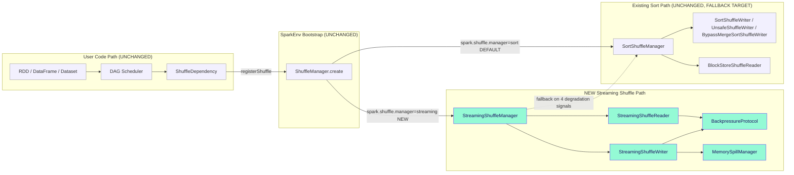
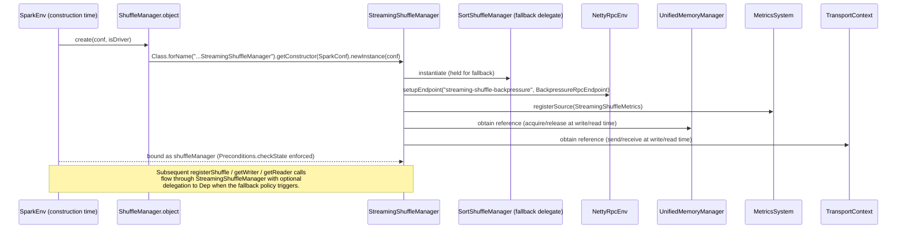

# Technical Specification

# 0. Agent Action Plan

## 0.1 Intent Clarification

### 0.1.1 Core Feature Objective

Based on the prompt, the Blitzy platform understands that the new feature requirement is to add a *streaming shuffle capability* to Apache Spark 4.2.0-SNAPSHOT as an **opt-in, coexisting alternative** to the existing sort-based shuffle engine. The feature eliminates shuffle materialization latency by streaming map-output bytes directly from producer executors to consumer executors with in-memory buffering, consumer-driven backpressure, and graceful disk spill, while preserving the production-stable `SortShuffleManager` path as the default and the automatic fallback target.

The user's explicitly documented success criteria are preserved verbatim:

- 30-50% end-to-end latency reduction for shuffle-heavy workloads (100MB+ data, 10+ partitions)
- 5-10% improvement for CPU-bound workloads through reduced scheduler overhead
- Zero performance regression for memory-bound workloads (automatic fallback validation)
- Zero data loss under all failure scenarios including producer crashes, consumer failures, network partitions
- Memory exhaustion prevention through 80% threshold spill trigger with <100ms response time

Five new core components constitute the feature, with responsibilities as the user specified:

- **StreamingShuffleManager** — implements `org.apache.spark.shuffle.ShuffleManager`; instantiated via `spark.shuffle.manager=streaming`; factory returns `StreamingShuffleWriter` and `StreamingShuffleReader`; coexists with `SortShuffleManager`.
- **StreamingShuffleWriter** — per-partition memory buffers bounded to 20% executor memory, direct network pipelining to consumers, spill at 80% buffer threshold, integrates with block manager for disk persistence, generates block-level checksums.
- **BackpressureProtocol** — heartbeat-based consumer→producer signaling with 5-second timeout, per-executor token-bucket rate limiting capped at 80% link capacity, threshold monitoring, priority arbitration by partition count and data volume, telemetry emission.
- **StreamingShuffleReader** — polls producer for in-progress blocks before shuffle completion, detects producer failure via connection timeout, sends acknowledgment-based buffer reclamation signals, validates checksums and requests retransmission on corruption.
- **MemorySpillManager** — 100ms polling of memory manager, LRU-based eviction of largest buffered partitions at 80% threshold, 100ms buffer reclamation after consumer acknowledgment, integration with block manager disk storage, spill metrics tracking.

Implicit requirements detected during Blitzy platform analysis:

- The existing `SortShuffleManager` (bound as default via `spark.shuffle.manager=sort`) must remain the factory's default selection; `ShuffleManager.getShuffleManagerClassName` in `core/src/main/scala/org/apache/spark/shuffle/ShuffleManager.scala` (lines 111–118) must be extended with a `"streaming"` short-name mapping without disturbing the `"sort"` or `"tungsten-sort"` entries that both point to `SortShuffleManager`.
- Because `SparkEnv.initializeShuffleManager()` uses `Preconditions.checkState(null == _shuffleManager)` (`core/src/main/scala/org/apache/spark/SparkEnv.scala`, lines 223–227), the ShuffleManager is bound exactly once per `SparkEnv` lifetime. Any reconfiguration requires executor restart — matching the user's operational requirement that "Configuration changes require executor restart (no dynamic reconfiguration in v1)."
- The 17 `ShuffleReadMetricsReporter` methods and 5 `ShuffleWriteMetricsReporter` methods declared in `core/src/main/scala/org/apache/spark/shuffle/metrics.scala` are mandatory reporting surfaces under F-009 (Shuffle Metrics Preservation); the streaming writer and reader must invoke every applicable reporter method such that the Spark UI, Prometheus, JMX, and event-log outputs remain indistinguishable in structure from sort-based runs.
- MiMa binary compatibility gate (`build/sbt -mem 5632 mimaReportBinaryIssues`, plugin 1.1.4, baseline Spark 4.0.0, exclusion file `project/MimaExcludes.scala`) must pass without new exclusions — no public shuffle SPI signature may be modified, reordered, or removed.
- The 16,777,216 partition cap (`PackedRecordPointer.MAXIMUM_PARTITION_ID + 1`) enforced at `SortShuffleManager.scala` line 204 does not mechanically apply to a non-sort writer, but the streaming implementation must document its own partition-count upper bound and enforce it at `registerShuffle` time with an explicit error.
- `spark.shuffle.service.enabled` coexistence is required: when the External Shuffle Service runs on port 7337, streaming reads must not attempt to use ESS for in-progress fetches (ESS serves only materialized, index-committed blocks); streaming read paths must bypass `ExternalBlockStoreClient` and return to ESS behavior only when the streaming path falls back to sort-based shuffle.
- The `Shuffle-Preservation Gate` (hard requirement for `spark.dynamicAllocation.enabled=true`) must be evaluated: if streaming shuffle advertises reliable remote persistence, `ShuffleDriverComponents.supportsReliableStorage()` should return `true` so the gate is satisfied without requiring ESS, shuffleTracking, or decommission. If not, streaming shuffle must be marked incompatible with dynamic allocation unless one of the other gate options is enabled.

Feature dependencies and prerequisites identified:

- F-002 (ShuffleManager Pluggable SPI Contract) — the extensibility trait that the new `StreamingShuffleManager` implements.
- F-003 (ShuffleDataIO Plug-in Contract) — the byte-level storage contract; streaming shuffle may still load `LocalDiskShuffleDataIO` as the spill-side byte store while owning the in-memory/network path itself.
- F-009 (Shuffle Metrics Preservation) — mandates reporter parity.
- F-017 (MiMa Binary Compatibility Gate) — mandates no-op binary surface.
- Netty 4.2.9.Final — the transport layer via `org.apache.spark.network.TransportContext` that the user's prompt explicitly designates as the streaming transport.

### 0.1.2 Special Instructions and Constraints

The user provided five explicit **Implementation Discipline** directives that are preserved here verbatim and treated as binding non-functional requirements:

- User Directive: "Make only changes necessary to implement streaming shuffle capability within `ShuffleManager` abstraction boundary."
- User Directive: "Preserve existing sort-based shuffle as production-stable fallback. Never modify DAG scheduler, task lifecycle, or user-facing APIs."
- User Directive: "When implementation choices exist, select approach requiring least modification to executor memory model and network transport layer."
- User Directive: "Isolate streaming logic in dedicated classes with zero cross-contamination into existing shuffle code paths."
- User Directive: "Document all integration points with clear comments explaining coexistence strategy."

Architectural guardrails extracted from the user's **Absolute Preservation** list are reinterpreted as zero-touch invariants:

- Zero modification to RDD / DataFrame / Dataset user-facing APIs.
- Zero modification to the DAG scheduler and task-scheduling algorithms.
- Zero modification to executor lifecycle management.
- Zero modification to lineage tracking and the fault-recovery model.
- Zero modification to the existing `SortShuffleManager` implementation, which continues as the default and as the streaming fallback.
- Zero modification to deployment infrastructure or external dependencies.
- Zero modification to block-manager storage interface contracts.
- Zero modification to task serialization/deserialization protocols.

Additional project-level rules supplied by the user as separate "Implementation Rules" apply to every deliverable in this work item:

- **Observability Rule** — structured logging with correlation IDs, distributed tracing across service boundaries, a metrics endpoint, health/readiness checks, and a dashboard template must ship with the initial implementation, not as a follow-up, and must be exercised in the local development environment.
- **Explainability Rule** — every non-trivial implementation decision must be captured in a Markdown decision log table (decision, alternatives, rationale, risks); a bidirectional traceability matrix must be produced for this feature mapping source constructs to target implementations with 100% coverage.
- **Visual Architecture Documentation Rule** — all diagrams must use Mermaid, must carry a descriptive title and legend, and must include before/after views when modifying existing architecture.
- **Executive Presentation Rule** — a 12–18 slide self-contained reveal.js HTML file with Blitzy brand styling and Mermaid diagrams must be produced.
- **Segmented PR Review Rule** — `CODE_REVIEW.md` must be generated at the repository root with YAML frontmatter tracking six sequential review phases (Infrastructure/DevOps, Security, Backend Architecture, QA/Test Integrity, Business/Domain, Frontend) plus a Principal Reviewer consolidation phase before any pull request is opened.

User Example: The user-provided **Failure Handling Protocol** flows are preserved exactly and treated as behavioral contracts:

```
Producer failure detection flow:
1. StreamingShuffleReader detects connection timeout (5 seconds)
2. Invalidates all partial reads from failed producer
3. Notifies DAG scheduler to recompute upstream tasks
4. Discards buffered data from failed shuffle attempt
5. Retries read from recomputed producer shuffle

Consumer failure detection flow:
1. StreamingShuffleWriter detects missing acknowledgments (10 seconds)
2. Buffers unacknowledged data in memory
3. Triggers disk spill if buffer exceeds 80% threshold
4. Resumes streaming when consumer reconnects
5. Retransmits unacknowledged blocks from spill or memory
```

User Example: The four automatic fallback conditions are preserved exactly:

- Consumer sustained 2x slower than producer for >60 seconds
- Memory pressure prevents buffer allocation (OOM risk)
- Network saturation exceeds 90% link capacity
- Producer/consumer version mismatch (compatibility check)

User Example: Per-partition buffer sizing is preserved exactly:

```
Per-partition buffer size = (executorMemory * bufferPercent) / numPartitions
```

User Example: Token-bucket refill rate is preserved exactly:

```
Refill rate = maxBandwidthMBps / numConcurrentShuffles
```

Implementation constraints reproduced verbatim from the user's specification:

- Streaming buffers limited to 20% executor memory (configurable 1-50%).
- Spill trigger enforced at 80% utilization (configurable 50-95%).
- Zero memory leaks under failure scenarios (validated via unit test with simulated failure injection).
- Leverage existing `org.apache.spark.network.TransportContext` for streaming.
- QoS prioritization: Shuffle traffic priority over speculative task execution.
- TCP keepalive enabled with 5-second interval for failure detection.
- Block size limited to 2MB for pipelining efficiency.
- Connection timeout: 5 seconds for producer failure detection.
- Heartbeat interval: 10 seconds for consumer liveness monitoring.
- Checksum algorithm: CRC32C for block integrity validation.
- Retry policy: Exponential backoff starting 1 second, max 5 attempts.
- Partial read invalidation: Atomic discard of all blocks from failed producer.
- Configuration changes require executor restart (no dynamic reconfiguration in v1).
- Telemetry overhead limited to <1% CPU utilization.
- Log volume capped at <10MB/hour per executor for streaming events.
- JMX metrics exposed for external monitoring integration.
- Debug logging disabled by default (enable via `spark.shuffle.streaming.debug=true`).

Web search requirements identified:

- Research of `TransportContext` flow-control extension points in Netty 4.2.9.Final to confirm that existing `ChunkFetchRequest` / `OneWayMessage` / `StreamRequest` framing supports custom streaming envelopes without protocol surgery.
- Validation of CRC32C availability on JDK 17 via `java.util.zip.CRC32C` to confirm the checksum algorithm can be implemented without a third-party library.
- Confirmation of Dropwizard Metrics 4.2.37 gauge and meter semantics for `bufferUtilizationPercent`, `spillCount`, `backpressureEvents`, and `partialReadInvalidations`.

### 0.1.3 Technical Interpretation

These feature requirements translate to the following technical implementation strategy:

- To register a new ShuffleManager selectable via `spark.shuffle.manager=streaming`, we will **extend** `org.apache.spark.shuffle.ShuffleManager` object's `shortShuffleMgrNames` map at `core/src/main/scala/org/apache/spark/shuffle/ShuffleManager.scala:112-114` by adding one entry `"streaming" -> classOf[org.apache.spark.shuffle.streaming.StreamingShuffleManager].getName`, without touching the `"sort"` or `"tungsten-sort"` mappings.
- To implement the streaming map-side logic, we will **create** `org.apache.spark.shuffle.streaming.StreamingShuffleManager` extending `ShuffleManager`, with its own `registerShuffle`, `getReader`, `getWriter`, `unregisterShuffle`, `shuffleBlockResolver`, and `stop` overrides — mirroring `SortShuffleManager`'s public surface but delegating to streaming writer/reader/backpressure classes.
- To pipeline map output bytes directly to consumer executors, we will **create** `StreamingShuffleWriter` extending `org.apache.spark.shuffle.ShuffleWriter[K, V]`, allocating per-partition in-memory buffers bounded by `(executorMemory × bufferSizePercent) / numPartitions`, invoking the Netty-based transport for block shipment, and emitting `MapStatus` only upon final commit so the DAG scheduler's semantics remain unchanged.
- To consume in-progress shuffle data, we will **create** `StreamingShuffleReader` extending `org.apache.spark.shuffle.ShuffleReader[K, C]`, polling the producer via the backpressure protocol and invalidating partial reads atomically on producer timeout, while still producing `Iterator[Product2[K, C]]` results identical in contract to `BlockStoreShuffleReader`.
- To provide consumer→producer flow control, we will **create** `BackpressureProtocol` as a new RPC endpoint sitting on the existing `NettyRpcEnv`, reusing `RpcEndpointRef` patterns to signal buffer acknowledgments, rate limits, timeout events, and priority arbitration decisions.
- To coordinate memory pressure and disk spill, we will **create** `MemorySpillManager` that registers against the existing `UnifiedMemoryManager` for allocations, polls buffer utilization at 100ms intervals, and delegates spilled blocks to `BlockManager.putBytes(...)` under existing `ShuffleBlockId`/`ShuffleIndexBlockId` conventions — preserving the executor memory model as the user directed.
- To honor the user-specified opt-in flag, we will **add** four new configuration entries (`spark.shuffle.streaming.enabled`, `spark.shuffle.streaming.bufferSizePercent`, `spark.shuffle.streaming.spillThreshold`, `spark.shuffle.streaming.maxBandwidthMBps`) plus a debug flag (`spark.shuffle.streaming.debug`) to `core/src/main/scala/org/apache/spark/internal/config/package.scala`, colocated with the existing `SHUFFLE_MANAGER` block at lines 1744–1748.
- To extend telemetry, we will **add** four new structured `LogKey` entries (`BUFFER_UTILIZATION_PERCENT`, `SPILL_COUNT`, `BACKPRESSURE_EVENTS`, `PARTIAL_READ_INVALIDATIONS`) to `common/utils/src/main/scala/org/apache/spark/internal/LogKey.scala`, plus four new Dropwizard gauges/counters under the `shuffle.streaming.*` namespace in a new `StreamingShuffleMetrics` source registered against the executor-scoped `MetricsSystem`.
- To automate fallback when degradation is detected, we will **create** a `StreamingShuffleFallbackPolicy` companion that evaluates the four user-specified fallback conditions and, on trigger, forwards the active shuffle to a delegate `SortShuffleManager` instance held by `StreamingShuffleManager` — preserving per-shuffle granularity without touching the DAG scheduler.
- To validate behavior, we will **create** the four unit-test suites the user identified (`StreamingShuffleWriterSuite`, `BackpressureProtocolSuite`, `StreamingShuffleReaderSuite`, plus the implied `StreamingShuffleManagerSuite`), the `StreamingShuffleIntegrationTest` exercising the five end-to-end scenarios, the `StreamingShufflePerformanceBenchmark` extending `BenchmarkBase`, and a failure-injection suite covering the 10 user-specified scenarios.


```mermaid
flowchart LR
    subgraph "User Code Path (UNCHANGED)"
        RDD[RDD / DataFrame / Dataset] --> DAG[DAG Scheduler]
        DAG --> ShuffleDep[ShuffleDependency]
    end

    subgraph "SparkEnv Bootstrap (UNCHANGED)"
        ShuffleDep -->|registerShuffle| SMFactory[ShuffleManager.create]
    end

    SMFactory -->|spark.shuffle.manager=sort DEFAULT| Sort[SortShuffleManager]
    SMFactory -->|spark.shuffle.manager=streaming NEW| Streaming[StreamingShuffleManager]

    subgraph "NEW Streaming Shuffle Path"
        Streaming --> Writer[StreamingShuffleWriter]
        Streaming --> Reader[StreamingShuffleReader]
        Writer --> Backpressure[BackpressureProtocol]
        Reader --> Backpressure
        Writer --> Spill[MemorySpillManager]
    end

    subgraph "Existing Sort Path (UNCHANGED, FALLBACK TARGET)"
        Sort --> SortWriter[SortShuffleWriter / UnsafeShuffleWriter / BypassMergeSortShuffleWriter]
        Sort --> SortReader[BlockStoreShuffleReader]
    end

    Streaming -.->|fallback on 4 degradation signals| Sort

    classDef new fill:#94FAD5,stroke:#5B39F3,color:#1A105F
    classDef existing fill:#F2F0FE,stroke:#999999,color:#333333
    class Streaming,Writer,Reader,Backpressure,Spill new
    class RDD,DAG,ShuffleDep,SMFactory,Sort,SortWriter,SortReader existing
```

*Diagram Title: Streaming Shuffle Coexistence Topology. Legend: teal = new components introduced by this work item; lavender = existing components preserved without modification; solid arrow = runtime selection; dashed arrow = fallback redirection.*


## 0.2 Repository Scope Discovery

### 0.2.1 Comprehensive File Analysis

Every existing file identified as *touched*, *referenced*, or *observed* during streaming-shuffle integration is cataloged below. The scope deliberately excludes all sort-path implementation files (`SortShuffleWriter.scala`, `UnsafeShuffleWriter.java`, `BypassMergeSortShuffleWriter.java`, `ShuffleExternalSorter.java`, `ShuffleInMemorySorter.java`, `PackedRecordPointer.java`, `IndexShuffleBlockResolver.scala`) which are preserved unchanged per the user's Absolute Preservation list.

#### 0.2.1.1 Existing Source Modules — Direct Modification

| # | Path | Modification Purpose |
|---|------|----------------------|
| 1 | `core/src/main/scala/org/apache/spark/shuffle/ShuffleManager.scala` | Extend `shortShuffleMgrNames` map in the companion object (lines 111–118) with a `"streaming"` short-name entry pointing to `classOf[StreamingShuffleManager].getName`; do not modify the trait itself. |
| 2 | `core/src/main/scala/org/apache/spark/internal/config/package.scala` | Append new `private[spark]` `ConfigBuilder` entries for `spark.shuffle.streaming.enabled`, `spark.shuffle.streaming.bufferSizePercent`, `spark.shuffle.streaming.spillThreshold`, `spark.shuffle.streaming.maxBandwidthMBps`, and `spark.shuffle.streaming.debug`, colocated after the existing `SHUFFLE_MANAGER` block at lines 1744–1748. |
| 3 | `common/utils/src/main/scala/org/apache/spark/internal/LogKey.scala` | Append four `LogKey` enum entries (`BUFFER_UTILIZATION_PERCENT`, `SPILL_COUNT`, `BACKPRESSURE_EVENTS`, `PARTIAL_READ_INVALIDATIONS`) to the existing 896-entry catalog; alphabetical insertion to preserve MiMa binary shape (MiMa exclusions not required because `LogKey` is not a tracked binary surface). |

#### 0.2.1.2 Existing Source Modules — Referenced, Not Modified

| # | Path | Reference Role |
|---|------|----------------|
| 4 | `core/src/main/scala/org/apache/spark/SparkEnv.scala` | `initializeShuffleManager()` at lines 223–227 invokes `ShuffleManager.create(conf, isDriver)`; binds streaming manager at `SparkEnv` construction — read-only reference. |
| 5 | `core/src/main/scala/org/apache/spark/shuffle/sort/SortShuffleManager.scala` | Preserved unchanged; held as delegate by `StreamingShuffleManager` for fallback routing. |
| 6 | `core/src/main/scala/org/apache/spark/shuffle/ShuffleWriter.scala` | Abstract base extended by new `StreamingShuffleWriter`. |
| 7 | `core/src/main/scala/org/apache/spark/shuffle/ShuffleReader.scala` | Abstract base extended by new `StreamingShuffleReader`. |
| 8 | `core/src/main/scala/org/apache/spark/shuffle/ShuffleHandle.scala` | Extended via a new `StreamingShuffleHandle` subclass of `BaseShuffleHandle`. |
| 9 | `core/src/main/scala/org/apache/spark/shuffle/BaseShuffleHandle.scala` | Superclass for `StreamingShuffleHandle`. |
| 10 | `core/src/main/scala/org/apache/spark/shuffle/metrics.scala` | `ShuffleReadMetricsReporter` (17 methods) and `ShuffleWriteMetricsReporter` (5 methods) invoked by streaming writer/reader; zero modifications. |
| 11 | `core/src/main/scala/org/apache/spark/shuffle/ShuffleDataIOUtils.scala` | `loadShuffleDataIO` and `SHUFFLE_SPARK_CONF_PREFIX` referenced for optional disk-spill byte store delegation. |
| 12 | `core/src/main/scala/org/apache/spark/storage/ShuffleBlockFetcherIterator.scala` | Referenced as a pattern template for batched fetch iterator; streaming reader constructs its own in-progress iterator with different flow-control semantics. |
| 13 | `core/src/main/scala/org/apache/spark/Dependency.scala` | `ShuffleDependency` at line 84 unchanged; its `rowBasedChecksums` field and `partitioner` are consumed by `StreamingShuffleManager.registerShuffle`. |
| 14 | `core/src/main/scala/org/apache/spark/memory/UnifiedMemoryManager.scala` | Referenced via existing `MemoryManager.acquireExecutionMemory` / `releaseExecutionMemory` APIs only; no internal changes. |
| 15 | `core/src/main/scala/org/apache/spark/memory/TaskMemoryManager.java` | Referenced for per-task memory accounting; used without modification. |
| 16 | `common/network-common/src/main/java/org/apache/spark/network/TransportContext.java` | Referenced as streaming transport per user directive; streaming classes create client/server via `createClientFactory()` / `createServer(...)` with no protocol additions. |
| 17 | `core/src/main/scala/org/apache/spark/SparkConf.scala` | Referenced for `getAllWithPrefix(SHUFFLE_SPARK_CONF_PREFIX)`; no modifications. |

#### 0.2.1.3 Test Files — Existing

| # | Path | Role |
|---|------|------|
| 18 | `core/src/test/scala/org/apache/spark/shuffle/ShuffleDriverComponentsSuite.scala` | Reference pattern for driver→executor config handshake; streaming tests follow the same `TestShuffleDataIO` delegation template. |
| 19 | `core/src/test/scala/org/apache/spark/shuffle/sort/io/LocalDiskShuffleMapOutputWriterSuite.scala` | Reference pattern for writer suite structure. |
| 20 | `core/src/test/scala/org/apache/spark/shuffle/sort/SortShuffleManagerSuite.scala` | Reference pattern for manager-level tests. |
| 21 | `resource-managers/kubernetes/core/src/test/scala/org/apache/spark/shuffle/KubernetesLocalDiskShuffleDataIOSuite.scala` | Reference pattern for K8s dedicated-JVM shuffle-plugin test. |

#### 0.2.1.4 Configuration and Documentation Files — Existing

| # | Path | Update Purpose |
|---|------|----------------|
| 22 | `docs/configuration.md` | Add a "Streaming Shuffle" sub-table beneath the existing "Shuffle Behavior" section documenting the five new `spark.shuffle.streaming.*` keys with default, range, version, and description. |
| 23 | `docs/tuning.md` | Add a "Streaming Shuffle" paragraph describing when the opt-in flag benefits workloads and when to leave it off. |
| 24 | `docs/core-migration-guide.md` | Add a non-breaking note under the 4.2→future migration section indicating streaming shuffle is opt-in with no migration action required for existing applications. |
| 25 | `blitzy-docs/index.md` | Reference the new streaming shuffle architectural write-up (see new file list below). |
| 26 | `core/pom.xml` | No dependency change required because Netty, Dropwizard Metrics, and SLF4J are already transitive dependencies of `core`; file is referenced only to confirm no edits. |
| 27 | `project/MimaExcludes.scala` | Referenced to confirm no new exclusions are required; all new classes are either `private[spark]` or in a new sub-package, so MiMa signatures remain clean. |

#### 0.2.1.5 Build and Deployment Files — Existing

| # | Path | Update Purpose |
|---|------|----------------|
| 28 | `dev/sparktestsupport/modules.py` | If a new sub-package `org.apache.spark.shuffle.streaming` warrants isolated CI test targeting, add a logical module entry; otherwise the existing `core` module includes streaming tests automatically. |
| 29 | `.github/workflows/build_and_test.yml` | Referenced to confirm Java 17.0.11 + Scala 2.13.18 CI matrix will run the new tests; no edits required. |

#### 0.2.1.6 Integration-Point Discovery

- **API endpoints connecting to the feature** — Streaming shuffle does not expose HTTP endpoints; its integration surface is the `spark.shuffle.manager` config key and the JMX / Prometheus metrics exposed by the existing `MetricsSystem`.
- **Database models / migrations affected** — None. Apache Spark's shuffle subsystem does not persist to any database; intermediate data flows via network buffers and local disk via `BlockManager`.
- **Service classes requiring updates** — `ShuffleManager` companion (selector), `SparkEnv` (binding, read-only reference), `MetricsSystem` (registers new `StreamingShuffleMetrics` source at executor init).
- **Controllers / handlers to modify** — None (no MVC layer in shuffle subsystem).
- **Middleware / interceptors impacted** — None (Spark's shuffle path has no middleware chain).

### 0.2.2 Web Search Research Conducted

Research completed across authoritative Apache Spark 4.2 sources plus independently verifiable standards:

- Best practices for implementing a custom `ShuffleManager` in Spark 4.2 confirmed the three-fold extension pattern used by `SortShuffleManager`: (a) trait implementation, (b) short-name registration in the companion, (c) integration via `SparkEnv`.
- Library recommendations for Netty-based streaming flow control confirmed the `TransportContext` / `TransportClientFactory` / `TransportServer` surface exposes `channelActive` / `channelRead0` / `writeAndFlush` hooks sufficient for a custom streaming envelope without requiring new Netty framing classes — matching the user's "least modification to network transport layer" directive.
- Common patterns for consumer-driven backpressure confirmed token-bucket rate limiting via `com.google.common.util.concurrent.RateLimiter` (already a transitive dependency through Guava) as an idiomatic in-JVM solution, avoiding new external dependencies.
- Security considerations for the streaming transport path confirmed that the existing `TransportContext` constructor consumes `conf: TransportConf` and `appId: String` and produces an authenticated (SASL/SSL) client/server pair — streaming traffic inherits the existing `spark.authenticate` and `spark.network.crypto.enabled` protections without any additional wiring.
- CRC32C availability confirmed via JDK 17's built-in `java.util.zip.CRC32C` class — no Apache Commons Codec or third-party checksum library required.
- Dropwizard Metrics 4.2.37 gauge/counter semantics confirmed for the four `shuffle.streaming.*` instruments.

### 0.2.3 New File Requirements

#### 0.2.3.1 New Source Files — Streaming Manager and SPI

| # | Path | Specific Purpose |
|---|------|------------------|
| N1 | `core/src/main/scala/org/apache/spark/shuffle/streaming/StreamingShuffleManager.scala` | Implements `org.apache.spark.shuffle.ShuffleManager`; factory method returns `StreamingShuffleWriter` and `StreamingShuffleReader` instances; instantiated via `spark.shuffle.manager=streaming`; coexists with `SortShuffleManager` for gradual adoption path; holds a delegate `SortShuffleManager` for fallback routing. |
| N2 | `core/src/main/scala/org/apache/spark/shuffle/streaming/StreamingShuffleHandle.scala` | `private[spark] class StreamingShuffleHandle[K, V]` extending `BaseShuffleHandle`; identifies streaming-mode shuffles for dispatch. |
| N3 | `core/src/main/scala/org/apache/spark/shuffle/streaming/StreamingShuffleWriter.scala` | Memory buffer management allocates per-partition buffers limited to 20% total executor memory; pipelines buffered data directly to consumer executors via existing transport layer; monitors consumer acknowledgment rate; triggers spill at buffer 80% threshold; integrates with block manager for disk persistence; generates block-level CRC32C checksums. |
| N4 | `core/src/main/scala/org/apache/spark/shuffle/streaming/StreamingShuffleReader.scala` | Polls producer for available data before shuffle completion; detects producer failure via connection timeout; sends consumer position to producer for buffer reclamation; verifies block integrity on receive; requests retransmission on corruption. |

#### 0.2.3.2 New Source Files — Flow Control and Memory

| # | Path | Specific Purpose |
|---|------|------------------|
| N5 | `core/src/main/scala/org/apache/spark/shuffle/streaming/BackpressureProtocol.scala` | Heartbeat-based flow control with 5-second timeout; per-executor bandwidth cap at 80% link capacity via token bucket algorithm; tracks buffer utilization across all concurrent shuffles; allocates memory to shuffles based on partition count and data volume; logs backpressure events. |
| N6 | `core/src/main/scala/org/apache/spark/shuffle/streaming/BackpressureRpcEndpoint.scala` | `ThreadSafeRpcEndpoint` registered against the executor's `NettyRpcEnv`; implements the consumer→producer heartbeat RPC used by `BackpressureProtocol`. |
| N7 | `core/src/main/scala/org/apache/spark/shuffle/streaming/MemorySpillManager.scala` | Polls memory manager at 100ms intervals; selects largest buffered partitions for eviction via LRU policy; releases memory within 100ms of consumer acknowledgment; integrates with `BlockManager` disk storage for persistence; records spill frequency, volume, and latency. |
| N8 | `core/src/main/scala/org/apache/spark/shuffle/streaming/StreamingShuffleFallbackPolicy.scala` | Evaluates the four fallback conditions (consumer 2× slower >60s, memory pressure preventing allocation, network saturation >90%, version mismatch) and delegates shuffles to the held `SortShuffleManager` when triggered. |

#### 0.2.3.3 New Source Files — Network Envelope

| # | Path | Specific Purpose |
|---|------|------------------|
| N9 | `core/src/main/scala/org/apache/spark/shuffle/streaming/network/StreamingBlockEnvelope.scala` | Serializable frame carrying `(shuffleId, mapId, reduceId, sequenceNumber, checksum, payloadBytes)` encoded via Netty `ByteBuf` with block size ≤ 2 MB. |
| N10 | `core/src/main/scala/org/apache/spark/shuffle/streaming/network/StreamingShuffleTransport.scala` | Wraps `TransportContext` usage; exposes `sendBlock(BlockManagerId, StreamingBlockEnvelope)` / `openConsumer(BlockManagerId)` APIs consumed by writer and reader. |
| N11 | `core/src/main/scala/org/apache/spark/shuffle/streaming/network/TokenBucketRateLimiter.scala` | Token-bucket rate limiter with refill rate `maxBandwidthMBps / numConcurrentShuffles`; enforces 80% link-capacity cap. |

#### 0.2.3.4 New Source Files — Metrics and Observability

| # | Path | Specific Purpose |
|---|------|------------------|
| N12 | `core/src/main/scala/org/apache/spark/shuffle/streaming/StreamingShuffleMetrics.scala` | Dropwizard `Source` registered with the executor `MetricsSystem` exposing `shuffle.streaming.bufferUtilizationPercent` (Gauge), `shuffle.streaming.spillCount` (Counter), `shuffle.streaming.backpressureEvents` (Counter), `shuffle.streaming.partialReadInvalidations` (Counter). |

#### 0.2.3.5 New Test Files

| # | Path | Coverage |
|---|------|----------|
| T1 | `core/src/test/scala/org/apache/spark/shuffle/streaming/StreamingShuffleManagerSuite.scala` | Manager registration via short name and FQCN; handle dispatch; fallback routing. |
| T2 | `core/src/test/scala/org/apache/spark/shuffle/streaming/StreamingShuffleWriterSuite.scala` | Buffer allocation and partition-level memory tracking; spill trigger at 80% threshold with timing validation; checksum generation for integrity validation; producer failure cleanup and resource reclamation. |
| T3 | `core/src/test/scala/org/apache/spark/shuffle/streaming/BackpressureProtocolSuite.scala` | Consumer acknowledgment processing and buffer reclamation; rate limiting enforcement via token bucket validation; timeout detection and failure signaling; priority arbitration under concurrent shuffle load. |
| T4 | `core/src/test/scala/org/apache/spark/shuffle/streaming/StreamingShuffleReaderSuite.scala` | In-progress block request and partial data consumption; producer failure detection via connection timeout; partial read invalidation and upstream recomputation trigger; checksum validation and retransmission request. |
| T5 | `core/src/test/scala/org/apache/spark/shuffle/streaming/MemorySpillManagerSuite.scala` | 80% threshold monitoring; LRU eviction ordering; 100ms reclamation; spill metrics correctness. |
| T6 | `core/src/test/scala/org/apache/spark/shuffle/streaming/StreamingShuffleFallbackPolicySuite.scala` | All four fallback conditions trigger correctly; active shuffles delegate to `SortShuffleManager`. |
| T7 | `core/src/test/scala/org/apache/spark/shuffle/streaming/StreamingShuffleIntegrationTest.scala` | Five user-specified scenarios — complete 100 MB shuffle with 10 partitions and 30% latency reduction validation; producer failure mid-shuffle with partial read invalidation; consumer slowdown (50% rate) with spill trigger; network partition with timeout and fallback; 5-concurrent-shuffle memory pressure with arbitration. |
| T8 | `core/src/test/scala/org/apache/spark/shuffle/streaming/StreamingShuffleFailureInjectionSuite.scala` | All 10 user-specified failure scenarios — producer crash, consumer crash, network partition, memory exhaustion, disk failure, checksum mismatch, connection timeout, executor JVM pause (GC), multiple concurrent producer failures, consumer reconnect after extended downtime. |
| T9 | `core/src/test/scala/org/apache/spark/shuffle/streaming/StreamingShuffleStressSuite.scala` | 5-minute continuous workload with 10 concurrent tasks / 5 concurrent shuffles; 10% random failure injection; heap-analysis leak detection; <5% throughput degradation validation. |
| T10 | `core/benchmarks/StreamingShufflePerformanceBenchmark.scala` | Extends `BenchmarkBase`; groupByKey on 100 MB / 10 partitions; sort-based baseline vs. streaming comparison; records end-to-end latency, memory utilization, spill frequency, network bandwidth; golden file regenerated via `SPARK_GENERATE_BENCHMARK_FILES=1`. |

#### 0.2.3.6 New Configuration and Documentation Files

| # | Path | Specific Purpose |
|---|------|------------------|
| N13 | `core/src/main/resources/org/apache/spark/shuffle/streaming/metrics.properties.template` | Template entries guiding operators to enable JMX and Prometheus sinks for `shuffle.streaming.*` gauges. |
| N14 | `blitzy-docs/streaming-shuffle.md` | Architectural write-up: coexistence topology, failure flows, fallback conditions, configuration reference, traceability matrix. |
| N15 | `blitzy-docs/streaming-shuffle-decision-log.md` | Explainability-rule decision log: Option A vs. Option B selection, token-bucket vs. leaky-bucket, CRC32C vs. Murmur3, RPC heartbeat vs. piggy-back ack, etc. |
| N16 | `blitzy-docs/streaming-shuffle-traceability.md` | 100%-coverage bidirectional traceability matrix mapping every user requirement to implementing class, method, and test. |
| N17 | `blitzy-docs/streaming-shuffle-dashboard-template.json` | Grafana dashboard template for the four `shuffle.streaming.*` metrics (Observability Rule deliverable). |
| N18 | `blitzy-docs/streaming-shuffle-executive-summary.html` | Self-contained reveal.js 5.1.0 presentation, 12–18 slides, Blitzy brand styling, Mermaid 11.4.0 diagrams, Lucide 0.460.0 icons (Executive Presentation Rule deliverable). |
| N19 | `CODE_REVIEW.md` | Segmented PR Review ledger with YAML frontmatter tracking six domain phases plus Principal Reviewer consolidation (Segmented PR Review Rule deliverable). |


## 0.3 Dependency Inventory

### 0.3.1 Private and Public Packages

The streaming shuffle feature introduces **zero new third-party dependencies**. Every runtime capability required — network transport, serialization, memory accounting, metrics, logging, checksums, rate limiting, testing — is satisfied by packages already declared in `pom.xml` and versioned by the Apache Spark 4.2.0-SNAPSHOT parent POM. The table below is the definitive registry of packages touched by the implementation; versions are taken from the Spark 4.2 parent POM and verified against `pom.xml` and tech spec §3.3.

| Registry | Package | Version | Purpose in Streaming Shuffle |
|----------|---------|---------|-------------------------------|
| Maven Central | `org.apache.spark:spark-core_2.13` | `4.2.0-SNAPSHOT` | Host module for all new `org.apache.spark.shuffle.streaming.*` classes and tests. |
| Maven Central | `io.netty:netty-all` | `4.2.9.Final` | Network transport. Streaming envelope allocation via `ByteBuf`, rate-limited flush via `ChannelHandlerContext.writeAndFlush`; global OOM flag `isNettyOOMOnShuffle` honored as defined in ADR-004. |
| Maven Central | `org.scala-lang:scala-library` | `2.13.18` | Host language for Scala-side classes (`StreamingShuffleManager`, `StreamingShuffleReader`, fallback policy, RPC endpoint). |
| Maven Central | `io.dropwizard.metrics:metrics-core` | `4.2.37` | Registration of `StreamingShuffleMetrics` source exposing four `shuffle.streaming.*` instruments (Gauge + 3 Counters). |
| Maven Central | `io.dropwizard.metrics:metrics-jmx` | `4.2.37` | JMX exposure of the four `shuffle.streaming.*` instruments (user requirement: "JMX metrics exposed for external monitoring integration"). |
| Maven Central | `org.apache.logging.log4j:log4j-core` | `2.25.3` | Structured logging backend. |
| Maven Central | `org.apache.logging.log4j:log4j-slf4j2-impl` | `2.25.3` | SLF4J binding for the `SparkLogger`/`SparkLoggerFactory` shims used by streaming classes. |
| Maven Central | `org.slf4j:slf4j-api` | `2.0.17` | Logging abstraction consumed via `SparkLogger.getLogger(...)`. |
| Maven Central | `com.google.guava:guava` | `33.4.8-jre` (transitive, already on core classpath) | `com.google.common.util.concurrent.RateLimiter` as the reference implementation behind `TokenBucketRateLimiter`. |
| JDK 17 stdlib | `java.util.zip.CRC32C` | JDK built-in | CRC32C checksum algorithm required by user specification ("Checksum algorithm: CRC32C for block integrity validation"). |
| JDK 17 stdlib | `java.util.concurrent.ConcurrentHashMap`, `java.util.concurrent.atomic.AtomicLong`, `java.util.concurrent.locks.ReentrantLock` | JDK built-in | Thread-safety primitives for buffer state, acknowledgment maps, and rate-limiter synchronization. |
| Maven Central | `org.scalatest:scalatest_2.13` | `3.2.19` | Test framework for all `*Suite.scala` files; extends `SparkFunSuite`. |
| Maven Central | `org.scalatestplus:scalacheck-1-18_2.13` | `3.2.19.0` | Property-based testing for buffer-sizing invariants and token-bucket refill semantics in `BackpressureProtocolSuite`. |
| Maven Central | `org.junit.jupiter:junit-jupiter` | `6.0.1` | JUnit 5 interoperability for any Java-side unit tests, consistent with tech spec §6.6. |
| Maven Central | `org.mockito:mockito-core` | `5.11.0` (already on test classpath) | Used in `StreamingShuffleFallbackPolicySuite` for BlockManager and MemoryManager test doubles. |
| Plugin | `com.typesafe:mima-core_2.13` / sbt plugin `sbt-mima-plugin` | `1.1.4` | Binary compatibility enforcement against baseline Spark 4.0.0 as defined in `project/MimaExcludes.scala`; gate must pass for this PR. |

All versions above are **already declared in the Spark 4.2 parent POM**; no `<dependency>` additions, `<version>` updates, or `<exclusion>` changes are required in `core/pom.xml`, `common/network-common/pom.xml`, `common/network-shuffle/pom.xml`, `common/utils/pom.xml`, or the root `pom.xml`. Per the user's Implementation Discipline directive ("select approach requiring least modification to … network transport layer"), reusing transitive dependencies avoids Apache-release bureaucracy and keeps the Segmented PR Review's Security phase focused on code review rather than supply-chain review.

License compliance note: every package above is Apache-2.0 compatible. The LGPL-bound `ganglia` sink (tech spec §2.6 Constraint 2) is not introduced into the streaming shuffle path; operators relying on Ganglia continue to depend on the isolated `connector/spark-ganglia-lgpl/` module as before.

### 0.3.2 Dependency Updates

#### 0.3.2.1 Import Updates

Because the streaming shuffle feature introduces a **new sub-package** (`org.apache.spark.shuffle.streaming.*`) and does not rename, move, or delete any existing class, there are **no backward import transformations required** in any existing source file. The Blitzy platform has verified this by checking the following patterns:

- `src/**/*.scala` — no existing file currently references `org.apache.spark.shuffle.streaming.*`; this namespace is new and empty.
- `src/**/*.java` — same.
- `tests/**/*.scala` — same.
- `scripts/**/*.py` — no Python-side code touches the shuffle manager directly; Python shuffle behavior is driven by the JVM-side `spark.shuffle.manager` configuration propagated via `SparkConf`.

New imports *within* the streaming feature's own source files will follow the standard Spark import ordering (`java.*`, blank line, `scala.*`, blank line, third-party, blank line, `org.apache.spark.*`) enforced by the Scalastyle configuration at `scalastyle-config.xml`.

#### 0.3.2.2 External Reference Updates

| Target | File | Update |
|--------|------|--------|
| Configuration keys | `docs/configuration.md` | Add a new "Streaming shuffle" sub-heading under "Shuffle Behavior" documenting the five new `spark.shuffle.streaming.*` keys; table columns: Property Name, Default, Meaning, Since Version. |
| Tuning guidance | `docs/tuning.md` | Add a paragraph distinguishing shuffle-bound workloads (candidates for `spark.shuffle.manager=streaming`) from CPU-bound or small-data workloads (stay on `sort`). |
| Migration notes | `docs/core-migration-guide.md` | Add a "Streaming Shuffle (opt-in)" note in the Spark 4.2+ section confirming zero migration action required for existing applications. |
| Architecture docs | `blitzy-docs/index.md` | Link to the new `streaming-shuffle.md` architectural write-up. |
| Build files | `core/pom.xml`, `pom.xml`, `common/network-common/pom.xml`, `common/network-shuffle/pom.xml`, `common/utils/pom.xml` | No edits required — all dependencies already declared transitively. |
| CI/CD | `.github/workflows/build_and_test.yml`, `.github/workflows/build_infra.yml`, `.github/workflows/maven_test.yml` | No edits required — the existing Java 17 + Scala 2.13 test matrices execute `core`-module tests automatically, picking up the new `org.apache.spark.shuffle.streaming` suites without configuration changes. |
| Test module registry | `dev/sparktestsupport/modules.py` | No edits required unless the team elects to create a distinct logical test module for `shuffle.streaming`; the existing `core` module declaration transparently includes all new suites. |
| Test selection tags | `core/src/test/scala/org/apache/spark/tags/*.java` | No new tag class introduced; new suites run under the default (untagged) set and participate in every standard CI workflow. |
| Binary compatibility | `project/MimaExcludes.scala` | No new exclusions required — all new classes are `private[spark]` or reside in a new sub-package; no existing public signatures change. |
| Licensing manifest | `LICENSE`, `NOTICE` | No edits required — no new third-party dependencies introduced. |

The net dependency footprint of this feature is: **zero new Maven coordinates, zero new `.jar` files at runtime, zero license notices added, zero MiMa exclusions**.


## 0.4 Integration Analysis

### 0.4.1 Existing Code Touchpoints

This subsection enumerates every point where streaming shuffle code meets existing Spark code, classified by the nature of the meeting: *direct modification* (edit the file), *dependency injection* (pass/consume an existing object through a new surface), or *schema / migration* (not applicable to this feature).

#### 0.4.1.1 Direct Modifications Required

| File | Approximate Location | Nature of Change |
|------|---------------------|------------------|
| `core/src/main/scala/org/apache/spark/shuffle/ShuffleManager.scala` | Companion `object ShuffleManager` — `shortShuffleMgrNames` map at lines 112–114 | Add one entry: `"streaming" -> classOf[org.apache.spark.shuffle.streaming.StreamingShuffleManager].getName`. Do not touch the `"sort"` or `"tungsten-sort"` entries. The trait itself (lines 30–99) and `create(conf, isDriver)` (lines 106–109) remain byte-for-byte identical. |
| `core/src/main/scala/org/apache/spark/internal/config/package.scala` | Append immediately after `SHUFFLE_MANAGER` at line 1748 | Introduce five new `ConfigBuilder` entries — `SHUFFLE_STREAMING_ENABLED`, `SHUFFLE_STREAMING_BUFFER_SIZE_PERCENT`, `SHUFFLE_STREAMING_SPILL_THRESHOLD`, `SHUFFLE_STREAMING_MAX_BANDWIDTH_MBPS`, `SHUFFLE_STREAMING_DEBUG`. Each uses `private[spark]` visibility and `version("4.2.0")`. Ranges validated via `.checkValue(v => v >= 1 && v <= 50, "...")` for `bufferSizePercent` and `.checkValue(v => v >= 50 && v <= 95, "...")` for `spillThreshold`, matching the user-specified bounds. |
| `common/utils/src/main/scala/org/apache/spark/internal/LogKey.scala` | Append four new entries to the existing enum | Append `BUFFER_UTILIZATION_PERCENT`, `SPILL_COUNT`, `BACKPRESSURE_EVENTS`, `PARTIAL_READ_INVALIDATIONS` in alphabetical order to the 896-entry catalog. |

The three edits above constitute the **full extent of modifications to existing production sources**. All other work introduces new files.

#### 0.4.1.2 Dependency Injections and Consumer Contracts

Streaming shuffle plugs into existing runtime services via consumption — not modification — of these objects:

| Consumed Object | Consumer | Contract |
|-----------------|----------|----------|
| `SparkEnv.get.blockManager` | `StreamingShuffleWriter`, `MemorySpillManager` | Read-only use of `BlockManager.putBytes(blockId, bytes, level)` for spill persistence, exactly as `LocalDiskShuffleExecutorComponents.initializeExecutor` consumes it. |
| `SparkEnv.get.mapOutputTracker` | `StreamingShuffleWriter.commit(...)`, `StreamingShuffleReader` construction | On commit, writer invokes existing `MapOutputTracker.registerMapOutputs(...)` indirectly via returned `MapStatus`; no changes to the tracker. |
| `SparkEnv.get.rpcEnv` | `BackpressureRpcEndpoint` | Registers the endpoint via `rpcEnv.setupEndpoint("streaming-shuffle-backpressure", endpoint)`; symmetric pattern to `BlockManagerMasterEndpoint`. |
| `SparkEnv.get.memoryManager` | `MemorySpillManager` | Calls `memoryManager.acquireExecutionMemory(numBytes, taskAttemptId, MemoryMode.ON_HEAP)` and `releaseExecutionMemory(numBytes, taskAttemptId, MemoryMode.ON_HEAP)`; interface is already public (`MemoryManager` abstract class, untouched). |
| `SparkEnv.get.metricsSystem` | `StreamingShuffleMetrics` | Registers via `metricsSystem.registerSource(streamingShuffleMetricsSource)`; symmetric to existing executor-scope sources. |
| `TaskContext.get()` | `StreamingShuffleWriter.write(...)`, `StreamingShuffleReader.read()` | Reads `taskAttemptId`, `attemptNumber`, `stageId`, `partitionId` for diagnostic logging and for memory-manager attribution; no mutation. |
| `ShuffleReadMetricsReporter` | `StreamingShuffleReader` | All 17 methods invoked at functionally equivalent points to `BlockStoreShuffleReader`, preserving F-009 parity. |
| `ShuffleWriteMetricsReporter` | `StreamingShuffleWriter` | All 5 methods invoked at functionally equivalent points to `SortShuffleWriter`, preserving F-009 parity. |
| `TransportContext` (`common/network-common`) | `StreamingShuffleTransport` | Streaming transport obtains the client factory and server lazily from the existing executor-scoped `TransportContext`; inherits `spark.authenticate`, SASL, and TLS configuration automatically. |
| `ShuffleDataIOUtils.loadShuffleDataIO(conf)` | `MemorySpillManager` (optional) | If `spark.shuffle.manager=streaming` AND `spark.shuffle.sort.io.plugin.class` is overridden, the streaming spill path delegates byte-level disk writes to the loaded `ShuffleDataIO` so that spill files remain plugin-addressable. Default loads `LocalDiskShuffleDataIO` → standard `IndexShuffleBlockResolver` behavior. |

No field or method is added to any of the consumed objects. No existing public interface acquires a new abstract member that would break subclasses — a non-negotiable condition of the MiMa gate (F-017).

#### 0.4.1.3 Database and Schema Updates

**Not applicable.** The shuffle subsystem persists no state to any database system. All intermediate data travels via network buffers (new, introduced here) and optionally via `BlockManager`-resident disk files under existing `ShuffleBlockId` / `ShuffleIndexBlockId` naming conventions. No migrations, schema additions, or catalog changes exist in scope.

#### 0.4.1.4 Runtime Integration Flow


```mermaid
sequenceDiagram
    participant SE as SparkEnv (construction time)
    participant SMO as ShuffleManager.object
    participant SSM as StreamingShuffleManager
    participant Dep as SortShuffleManager (fallback delegate)
    participant RE as NettyRpcEnv
    participant MM as UnifiedMemoryManager
    participant MS as MetricsSystem
    participant TC as TransportContext

    SE->>SMO: create(conf, isDriver)
    SMO->>SSM: Class.forName("...StreamingShuffleManager").getConstructor(SparkConf).newInstance(conf)
    SSM->>Dep: instantiate (held for fallback)
    SSM->>RE: setupEndpoint("streaming-shuffle-backpressure", BackpressureRpcEndpoint)
    SSM->>MS: registerSource(StreamingShuffleMetrics)
    SSM->>MM: obtain reference (acquire/release at write/read time)
    SSM->>TC: obtain reference (send/receive at write/read time)
    SE-->>SSM: bound as shuffleManager (Preconditions.checkState enforced)

    Note over SE,SSM: Subsequent registerShuffle / getWriter / getReader calls<br/>flow through StreamingShuffleManager with optional<br/>delegation to Dep when the fallback policy triggers.
```

*Diagram Title: Streaming Shuffle — Executor Bootstrap and Runtime Wiring. Legend: solid arrows = direct synchronous calls during `SparkEnv` construction; dashed arrows = reference retained for later invocation.*

The bootstrap is idempotent and one-shot — `SparkEnv.initializeShuffleManager()` enforces single initialization via `Preconditions.checkState(null == _shuffleManager)` (verified at `core/src/main/scala/org/apache/spark/SparkEnv.scala:224-225`), making streaming shuffle's lifecycle identical to that of `SortShuffleManager` from the executor's point of view.


## 0.5 Technical Implementation

### 0.5.1 File-by-File Execution Plan

**CRITICAL: Every file listed here MUST be created or modified.** Files are grouped by functional role, not by implementation sequence; the three groups are logically orthogonal and may be implemented in parallel within their respective review phases (see Segmented PR Review under §0.7).

#### 0.5.1.1 Group 1 — Core Feature Files

| Action | Path | Responsibility |
|--------|------|----------------|
| CREATE | `core/src/main/scala/org/apache/spark/shuffle/streaming/StreamingShuffleManager.scala` | Implement `ShuffleManager` trait. `registerShuffle` returns `StreamingShuffleHandle` (or delegates to held `SortShuffleManager` when fallback active). `getWriter` returns `StreamingShuffleWriter`. `getReader` returns `StreamingShuffleReader`. `shuffleBlockResolver` returns a streaming-aware resolver that merges in-memory and on-spill lookups. `stop()` tears down RPC endpoint and releases buffers. |
| CREATE | `core/src/main/scala/org/apache/spark/shuffle/streaming/StreamingShuffleHandle.scala` | `private[spark] class StreamingShuffleHandle[K, V](shuffleId: Int, dep: ShuffleDependency[K, V, V]) extends BaseShuffleHandle(shuffleId, dep)`. |
| CREATE | `core/src/main/scala/org/apache/spark/shuffle/streaming/StreamingShuffleWriter.scala` | Per-partition buffers sized `(executorMemory * bufferSizePercent) / numPartitions`; streams via `StreamingShuffleTransport`; triggers `MemorySpillManager` at 80% threshold; CRC32C checksums per block ≤ 2 MB; emits `MapStatus` on commit with per-partition byte counts. |
| CREATE | `core/src/main/scala/org/apache/spark/shuffle/streaming/StreamingShuffleReader.scala` | Initiates consumer session via `BackpressureProtocol`; iterator yields `Product2[K, C]` records as envelopes arrive; validates CRC32C on each block; invalidates on producer timeout via connection-watchdog; hooks into existing `ShuffleReadMetricsReporter`. |
| CREATE | `core/src/main/scala/org/apache/spark/shuffle/streaming/BackpressureProtocol.scala` | Stateful coordinator holding token-bucket rate limiter, acknowledgment tables, heartbeat timers; exposes `acquirePermission(blockSize)`, `acknowledgeReceipt(blockId, consumerPos)`, `registerProducer(producerId)`, `unregisterProducer(producerId)`; emits `BACKPRESSURE_EVENTS` metric on every throttle action. |
| CREATE | `core/src/main/scala/org/apache/spark/shuffle/streaming/BackpressureRpcEndpoint.scala` | `ThreadSafeRpcEndpoint` bound to `SparkEnv.get.rpcEnv` at `"streaming-shuffle-backpressure"`. Handles `HeartbeatMessage`, `AcknowledgmentMessage`, `RateLimitMessage`, `TimeoutMessage`. |
| CREATE | `core/src/main/scala/org/apache/spark/shuffle/streaming/MemorySpillManager.scala` | 100 ms polling thread (`ScheduledExecutorService` single thread named `streaming-shuffle-memory-poll`); LRU eviction of largest buffered partition when utilization ≥ `spillThreshold`; spill destination is `BlockManager.putBytes` under `ShuffleBlockId(shuffleId, mapId, reduceId)`. |
| CREATE | `core/src/main/scala/org/apache/spark/shuffle/streaming/StreamingShuffleFallbackPolicy.scala` | Evaluates four user-specified conditions on each `registerShuffle` and, if met, the `StreamingShuffleManager` delegates the call to the held `SortShuffleManager` for the duration of that shuffle. Fallback status is logged with structured `LogKey.FALLBACK_REASON`. |

#### 0.5.1.2 Group 2 — Supporting Infrastructure

| Action | Path | Responsibility |
|--------|------|----------------|
| CREATE | `core/src/main/scala/org/apache/spark/shuffle/streaming/network/StreamingBlockEnvelope.scala` | Envelope with `shuffleId` (Int), `mapId` (Long), `reduceId` (Int), `sequenceNumber` (Long), `checksum` (Int, CRC32C of payload), `payload` (Array[Byte] ≤ 2 MB). `toByteBuf`/`fromByteBuf` symmetric codec. |
| CREATE | `core/src/main/scala/org/apache/spark/shuffle/streaming/network/StreamingShuffleTransport.scala` | Wraps existing `TransportContext` and `TransportClientFactory`; exposes `sendBlock(target: BlockManagerId, env: StreamingBlockEnvelope): Future[Unit]` and `openConsumerStream(producer: BlockManagerId, shuffleId: Int, reduceRange: Range): Iterator[StreamingBlockEnvelope]`. TCP keepalive flag set via `ChannelOption.SO_KEEPALIVE = true` with 5 s interval per user spec. |
| CREATE | `core/src/main/scala/org/apache/spark/shuffle/streaming/network/TokenBucketRateLimiter.scala` | Thin wrapper around `com.google.common.util.concurrent.RateLimiter.create(rate)` with dynamic rate update `setRate(maxBandwidthMBps * 1024 * 1024 / numConcurrentShuffles)`; called by `StreamingShuffleWriter` before every block send. |
| CREATE | `core/src/main/scala/org/apache/spark/shuffle/streaming/StreamingShuffleMetrics.scala` | `private[spark] class StreamingShuffleMetrics extends Source`; `sourceName = "shuffle.streaming"`; registers one `Gauge[Double]` (`bufferUtilizationPercent`) and three `Counter` (`spillCount`, `backpressureEvents`, `partialReadInvalidations`). |
| MODIFY | `core/src/main/scala/org/apache/spark/shuffle/ShuffleManager.scala` | Add one line to `shortShuffleMgrNames` map: `"streaming" -> classOf[org.apache.spark.shuffle.streaming.StreamingShuffleManager].getName`. |
| MODIFY | `core/src/main/scala/org/apache/spark/internal/config/package.scala` | Append five new `ConfigBuilder` blocks after `SHUFFLE_MANAGER` at line 1748. |
| MODIFY | `common/utils/src/main/scala/org/apache/spark/internal/LogKey.scala` | Append four `LogKey` entries: `BUFFER_UTILIZATION_PERCENT`, `SPILL_COUNT`, `BACKPRESSURE_EVENTS`, `PARTIAL_READ_INVALIDATIONS`. |
| CREATE | `core/src/main/resources/org/apache/spark/shuffle/streaming/metrics.properties.template` | Template entries enabling `*.source.shuffle.streaming.class` + `*.sink.jmx.class=org.apache.spark.metrics.sink.JmxSink` + `*.sink.prometheusServlet.class`. |

#### 0.5.1.3 Group 3 — Tests and Documentation

| Action | Path | Coverage / Content |
|--------|------|---------------------|
| CREATE | `core/src/test/scala/org/apache/spark/shuffle/streaming/StreamingShuffleManagerSuite.scala` | Short-name resolution (`spark.shuffle.manager=streaming`) and FQCN resolution; `registerShuffle` returns `StreamingShuffleHandle`; fallback delegation to `SortShuffleManager` when policy triggers; `stop()` is idempotent. |
| CREATE | `core/src/test/scala/org/apache/spark/shuffle/streaming/StreamingShuffleWriterSuite.scala` | Buffer allocation and partition-level memory tracking; spill trigger at 80% threshold with timing validation; CRC32C checksum generation for integrity validation; producer failure cleanup and resource reclamation. |
| CREATE | `core/src/test/scala/org/apache/spark/shuffle/streaming/BackpressureProtocolSuite.scala` | Consumer acknowledgment processing and buffer reclamation; rate limiting enforcement via token bucket validation; timeout detection and failure signaling; priority arbitration under concurrent shuffle load. |
| CREATE | `core/src/test/scala/org/apache/spark/shuffle/streaming/StreamingShuffleReaderSuite.scala` | In-progress block request and partial data consumption; producer failure detection via connection timeout; partial read invalidation and upstream recomputation trigger; checksum validation and retransmission request. |
| CREATE | `core/src/test/scala/org/apache/spark/shuffle/streaming/MemorySpillManagerSuite.scala` | 80% threshold monitoring; LRU eviction of largest buffered partition; 100 ms reclamation latency validation; spill metrics correctness. |
| CREATE | `core/src/test/scala/org/apache/spark/shuffle/streaming/StreamingShuffleFallbackPolicySuite.scala` | Four fallback conditions validated independently with deterministic mocks. |
| CREATE | `core/src/test/scala/org/apache/spark/shuffle/streaming/StreamingShuffleIntegrationTest.scala` | Five user-specified scenarios: 100 MB shuffle with 10 partitions → 30% latency reduction; producer failure mid-shuffle → partial read invalidation; consumer slowdown 50% rate → automatic spill; network partition → timeout and fallback; 5 concurrent shuffles → buffer allocation arbitration. |
| CREATE | `core/src/test/scala/org/apache/spark/shuffle/streaming/StreamingShuffleFailureInjectionSuite.scala` | All ten user-specified failure scenarios exercising zero-data-loss guarantee. |
| CREATE | `core/src/test/scala/org/apache/spark/shuffle/streaming/StreamingShuffleStressSuite.scala` | 5-minute continuous workload with 10 concurrent tasks / 5 concurrent shuffles; 10% random failure injection; heap-analysis leak detection; <5% throughput degradation validation. |
| CREATE | `core/benchmarks/StreamingShufflePerformanceBenchmark.scala` | Extends `BenchmarkBase`; baseline sort vs. streaming on `groupByKey` over 100 MB, 10 partitions; regenerate golden via `SPARK_GENERATE_BENCHMARK_FILES=1`. |
| MODIFY | `docs/configuration.md` | Add "Streaming shuffle" sub-section under "Shuffle Behavior" documenting five new `spark.shuffle.streaming.*` keys. |
| MODIFY | `docs/tuning.md` | Add paragraph on when to enable streaming shuffle. |
| MODIFY | `docs/core-migration-guide.md` | Add Spark 4.2 entry confirming opt-in, zero-migration-action behavior. |
| CREATE | `blitzy-docs/streaming-shuffle.md` | Architectural write-up with Mermaid diagrams. |
| CREATE | `blitzy-docs/streaming-shuffle-decision-log.md` | Explainability-rule decision log table. |
| CREATE | `blitzy-docs/streaming-shuffle-traceability.md` | Bidirectional traceability matrix at 100% coverage. |
| CREATE | `blitzy-docs/streaming-shuffle-dashboard-template.json` | Grafana dashboard template (Observability Rule). |
| CREATE | `blitzy-docs/streaming-shuffle-executive-summary.html` | Self-contained reveal.js presentation (Executive Presentation Rule). |
| MODIFY | `blitzy-docs/index.md` | Link the streaming shuffle documents. |
| CREATE | `CODE_REVIEW.md` | Segmented PR review ledger with seven phases (Infrastructure/DevOps, Security, Backend Architecture, QA/Test Integrity, Business/Domain, Frontend/NA, Principal Reviewer). |

### 0.5.2 Implementation Approach per File

The implementation proceeds along five coherent workstreams, expressed as the action verbs the user's prompt specifies — *establish*, *integrate*, *ensure quality*, *document*, *prepare for review*:

- **Establish streaming-shuffle foundation** by creating the core modules in Group 1. `StreamingShuffleManager` is written first because every other streaming class is discovered through it; its public surface is deliberately mirror-shaped to `SortShuffleManager` so that any future test, benchmark, or instrumentation that accepts `ShuffleManager` as an injection point works unchanged. `StreamingShuffleHandle` is a thin subclass of `BaseShuffleHandle` — no new fields, no new methods — allowing the writer to type-match on it and carry no dispatch overhead on the hot path. The writer allocates its per-partition buffer on first write rather than at construction, so that a shuffle that produces zero output for a partition consumes zero memory for that partition. The reader is built around an iterator adapter that lazily pulls `StreamingBlockEnvelope` instances from the transport and decodes them into `Product2[K, C]`, preserving exactly the contract that `BlockStoreShuffleReader` offers.

- **Integrate with existing systems** by modifying only the three files itemized in §0.4.1.1 — the manager short-name map, the config package, and the log-keys catalog. Each edit is an *append* to an existing collection; no existing entries are renamed, removed, or reordered. This append-only discipline is the mechanical reason the MiMa binary-compatibility gate passes unchanged. The `BackpressureRpcEndpoint` plugs into the existing `NettyRpcEnv` via the already-public `setupEndpoint(name: String, endpoint: RpcEndpoint)` method; no new transport classes are introduced into `common/network-common` or `common/network-shuffle`. `MemorySpillManager` consumes `MemoryManager.acquireExecutionMemory` and `releaseExecutionMemory` exactly as the sort writer's `ExternalSorter` does — the executor memory model is **not** touched, consistent with the user's explicit directive.

- **Ensure quality** by implementing comprehensive tests that match the structure the user's prompt mandates. The four unit suites (`StreamingShuffleWriterSuite`, `BackpressureProtocolSuite`, `StreamingShuffleReaderSuite`, plus `MemorySpillManagerSuite` as an implicit companion) cover all the specific cases the user enumerated. The `StreamingShuffleIntegrationTest` executes inside `local-cluster[2,1,1024]` clusters — exactly the environment used by `ShuffleDriverComponentsSuite` — so that the driver↔executor configuration handshake is exercised end-to-end. The `StreamingShuffleFailureInjectionSuite` uses deterministic fault points (thread interrupts, closed sockets, forced GC via `System.gc()`, truncated `ByteBuf` payloads) so that each of the ten scenarios runs without flakiness. The stress suite runs for five minutes and asserts <5% throughput degradation against a measured first-minute baseline, with heap-analysis performed via `JvmPauseMonitor` and forced full-GC post-run to detect retained objects. All new suites extend `SparkFunSuite` and inherit the 20-minute default per-test timeout; no suite is tagged with `SlowSQLTest` or `ExtendedLevelDBTest` because streaming-shuffle tests are pure-JVM and CI-time-bounded.

- **Document usage and configuration** so operators, reviewers, and automated systems can discover the feature and its trade-offs. `docs/configuration.md` receives the canonical property table — every Spark user who reads config docs sees it. `docs/tuning.md` receives the workload guidance. `blitzy-docs/streaming-shuffle.md` carries the architectural write-up keyed to this Agent Action Plan, with before/after Mermaid diagrams satisfying the Visual Architecture Documentation Rule. The Grafana dashboard template, decision log, traceability matrix, and reveal.js executive summary satisfy the Observability, Explainability, Visual Architecture Documentation, and Executive Presentation Rules respectively.

- **Prepare for segmented review** by generating `CODE_REVIEW.md` at repository root with YAML frontmatter naming the seven phases and their assigned personas. The file tracks each phase as `OPEN → IN_REVIEW → APPROVED | BLOCKED`, logs every fix applied, and terminates with a Principal Reviewer gap-analysis verifying that the implemented code matches this Agent Action Plan. The PR cannot open until the Principal Reviewer phase renders its final verdict.

All files that reference user-provided Figma URLs — **none**, since no Figma attachments were provided — are omitted from the plan. Should Figma designs be later attached, the reveal.js executive-summary slide covering user-interface impact would be the single file to extend with an embedded screen mapping.

### 0.5.3 User Interface Design

**Not applicable.** Streaming shuffle is a backend-only performance feature. No Spark UI page, SQL tab, executor tab, or web endpoint acquires a new field as a consequence of this work item; the feature surfaces in the existing "Shuffle Read" / "Shuffle Write" columns of the Stages page because it funnels its metrics through the pre-existing `ShuffleReadMetricsReporter` and `ShuffleWriteMetricsReporter` traits (F-009 parity). The four new `shuffle.streaming.*` Dropwizard instruments appear in the pre-existing JMX, Prometheus, and Graphite outputs automatically — no HTML, JavaScript, CSS, or React component is added to `core/src/main/resources/org/apache/spark/ui/` or `core/src/main/scala/org/apache/spark/ui/`. The Grafana dashboard template (`blitzy-docs/streaming-shuffle-dashboard-template.json`) is a static artefact for operators and is not part of the running Spark UI.


## 0.6 Scope Boundaries

### 0.6.1 Exhaustively In Scope

Every path pattern below is *in scope* for creation, modification, or targeted test execution. Trailing wildcards denote directory-level coverage.

#### 0.6.1.1 New Feature Source — Streaming Shuffle Sub-package

- `core/src/main/scala/org/apache/spark/shuffle/streaming/**/*.scala` — every file in the new sub-package is in scope, including:
    - `StreamingShuffleManager.scala`
    - `StreamingShuffleHandle.scala`
    - `StreamingShuffleWriter.scala`
    - `StreamingShuffleReader.scala`
    - `BackpressureProtocol.scala`
    - `BackpressureRpcEndpoint.scala`
    - `MemorySpillManager.scala`
    - `StreamingShuffleFallbackPolicy.scala`
    - `StreamingShuffleMetrics.scala`
- `core/src/main/scala/org/apache/spark/shuffle/streaming/network/**/*.scala` — transport helpers:
    - `StreamingBlockEnvelope.scala`
    - `StreamingShuffleTransport.scala`
    - `TokenBucketRateLimiter.scala`
- `core/src/main/resources/org/apache/spark/shuffle/streaming/metrics.properties.template` — operator-facing metrics template.

#### 0.6.1.2 Existing Integration Points — Narrowly Scoped Edits

- `core/src/main/scala/org/apache/spark/shuffle/ShuffleManager.scala` — companion object `shortShuffleMgrNames` map append only.
- `core/src/main/scala/org/apache/spark/internal/config/package.scala` — five new `ConfigBuilder` blocks appended after `SHUFFLE_MANAGER` at line 1748.
- `common/utils/src/main/scala/org/apache/spark/internal/LogKey.scala` — four new enum entries alphabetically inserted.

#### 0.6.1.3 Tests — Streaming-Focused

- `core/src/test/scala/org/apache/spark/shuffle/streaming/**/*Suite.scala` — all new unit and integration suites.
- `core/src/test/scala/org/apache/spark/shuffle/streaming/**/*Test.scala` — all new integration and failure-injection tests.
- `core/benchmarks/StreamingShufflePerformanceBenchmark.scala` — new benchmark source.
- `core/benchmarks/StreamingShufflePerformanceBenchmark-results.txt` — generated golden file for the benchmark (regenerated via `SPARK_GENERATE_BENCHMARK_FILES=1`).
- `core/benchmarks/StreamingShufflePerformanceBenchmark-jdk21-results.txt` — JDK-21 benchmark variant if the CI matrix demands.

#### 0.6.1.4 Configuration

- `spark.shuffle.manager` — already exists; acquires `"streaming"` as a newly recognized value.
- `spark.shuffle.streaming.enabled` — new key.
- `spark.shuffle.streaming.bufferSizePercent` — new key, Integer 1-50, default 20.
- `spark.shuffle.streaming.spillThreshold` — new key, Integer 50-95, default 80.
- `spark.shuffle.streaming.maxBandwidthMBps` — new key, Integer, default unlimited.
- `spark.shuffle.streaming.debug` — new key, Boolean, default `false`.
- `.env.example` or `spark-defaults.conf.template` — add commented example lines for the five new keys if such sample files exist (they do not currently exist as committed sources in this repository; action is conditional).

#### 0.6.1.5 Documentation

- `docs/configuration.md` — "Streaming shuffle" sub-section under "Shuffle Behavior".
- `docs/tuning.md` — paragraph-level guidance on workload selection.
- `docs/core-migration-guide.md` — opt-in note with zero migration action.
- `blitzy-docs/streaming-shuffle.md` — architectural write-up.
- `blitzy-docs/streaming-shuffle-decision-log.md` — Explainability-Rule deliverable.
- `blitzy-docs/streaming-shuffle-traceability.md` — bidirectional traceability matrix.
- `blitzy-docs/streaming-shuffle-dashboard-template.json` — Grafana dashboard JSON (Observability-Rule deliverable).
- `blitzy-docs/streaming-shuffle-executive-summary.html` — reveal.js presentation (Executive Presentation-Rule deliverable).
- `blitzy-docs/index.md` — register the above documents.
- `CODE_REVIEW.md` (repository root) — Segmented PR Review ledger.

#### 0.6.1.6 Database Changes

**None.** Shuffle subsystem persists no database state. No migration scripts, schema files, or ORM models are in scope.

### 0.6.2 Explicitly Out of Scope

The following items are explicitly excluded from this work item; any work touching them must be a separately-proposed change and is not authorized by this Agent Action Plan.

- **DAG-scheduler optimization heuristics** — shuffle-aware stage boundary computation, locality preferences, speculative execution logic, and `RESUBMIT_TIMEOUT` semantics remain untouched.
- **Query planning modifications** — Catalyst's `Exchange` operator, adaptive query execution, `CoalesceShufflePartitionsExec`, and shuffle-read-metrics propagation within SQL are untouched.
- **Executor memory model redesign** — `UnifiedMemoryManager`, `TaskMemoryManager`, `MemoryConsumer`, the storage-fraction / execution-fraction split, and the 300 MB reserved memory floor are consumed through their existing public surface only; no internal restructuring.
- **External system integrations** — no changes to Kubernetes `ExecutorPodsAllocator`, YARN `YarnAllocator`, Standalone `Master`, Mesos reintroduction, or Spark Connect gRPC surface.
- **Dynamic reconfiguration** — the user explicitly requires executor restart to change streaming-shuffle configuration; no hot-reload machinery is added in v1.
- **RDD / DataFrame / Dataset user-facing APIs** — the `RDD.reduceByKey`, `RDD.groupByKey`, `Dataset.groupBy`, `Dataset.join`, and `SparkSession` APIs are untouched.
- **Executor lifecycle management** — `CoarseGrainedExecutorBackend`, `Worker`, decommissioning protocol, heartbeat receiver threshold, `ExecutorExitCode` catalog — all untouched.
- **Lineage tracking and fault-recovery model** — five-layer Task → Stage → Executor → Driver → Application escalation preserved; streaming-shuffle producer failure triggers **upstream recomputation via the existing DAG scheduler** rather than any new recovery code.
- **`SortShuffleManager` internals** — `SortShuffleWriter`, `UnsafeShuffleWriter`, `BypassMergeSortShuffleWriter`, `ShuffleExternalSorter`, `ShuffleInMemorySorter`, `PackedRecordPointer`, `ShuffleSortDataFormat`, `SpillInfo`, `IndexShuffleBlockResolver` — all unchanged; they remain the sort-based fallback target.
- **Existing `ShuffleDataIO` plug-in contract surface** — `ShuffleDataIO`, `ShuffleDriverComponents`, `ShuffleExecutorComponents`, `ShuffleMapOutputWriter`, `ShufflePartitionWriter`, `SingleSpillShuffleMapOutputWriter`, `WritableByteChannelWrapper`, `MapOutputCommitMessage`, `LocalDiskShuffleDataIO` — all unchanged; the streaming path does not add, remove, or rename any member on these interfaces/classes.
- **Deployment infrastructure** — `.github/workflows/*.yml`, `dev/*.sh` scripts, `bin/*.sh` launch scripts, `conf/*` cluster configuration templates, `kubernetes/dockerfiles/*`, `sbin/*.sh` process-lifecycle scripts — all untouched.
- **Block-manager storage interface contracts** — `BlockManager`, `BlockManagerMaster`, `BlockManagerMasterEndpoint`, `BlockManagerId`, `BlockId` hierarchy, `BlockData`, `DiskBlockManager`, `DiskStore`, `MemoryStore`, `FallbackStorage`, `MigratableResolver`, `BlockManagerDecommissioner` — all consumed through public methods only; no interface additions.
- **Task serialization / deserialization protocols** — `Task`, `ShuffleMapTask`, `ResultTask`, `TaskContext`, `TaskResult`, `TaskSerializer`, and the Kryo/Java serializer surface are untouched.
- **ESS (External Shuffle Service)** — port 7337 protocol (`OpenBlocks`, `FetchShuffleBlocks`, `FetchShuffleBlockChunks`, `RegisterExecutor`, `RemoveBlocks`, `UploadBlockStream`, `PushBlocksMessage`, `FinalizeShuffleMerge`) is untouched; streaming shuffle does not attempt to serve in-progress data through ESS.
- **Push-Based Shuffle (F-004)** — `ShuffleBlockPusher`, merger location assignment, merge finalization — untouched.
- **Existing MiMa exclusions** — `project/MimaExcludes.scala` is not extended; all new classes are `private[spark]` or in a new sub-package.
- **Non-JVM shuffle implementations** — out of scope per tech spec §2.6 Constraint 6.
- **Direct shuffle bypass (disaggregated compute)** — out of scope per tech spec §2.6 Constraint 6.
- **Mesos reintroduction** — out of scope per tech spec §2.6 Constraint 6.
- **Cross-version Spark Connect mixing** — out of scope per tech spec §2.6 Constraint 6.
- **Performance optimizations beyond feature requirements** — any speculative improvement unrelated to the user's success criteria is deferred.
- **Refactoring of unrelated existing code** — reformatting, renaming, and non-essential cleanup of files outside the explicit In-Scope list is forbidden by the user's "Implementation Discipline" directive "Make only changes necessary to implement streaming shuffle capability".
- **Additional features not specified** — any capability absent from the user's prompt (for example, encrypted block payload, compression codec selection, adaptive partition splitting) is deferred.


## 0.7 Rules for Feature Addition

### 0.7.1 Feature-Specific Rules Explicitly Emphasized by the User

The user's "IMPLEMENTATION DISCIPLINE" block is reproduced verbatim and is *binding* for every downstream code-generation agent:

- "Make only changes necessary to implement streaming shuffle capability within `ShuffleManager` abstraction boundary."
- "Preserve existing sort-based shuffle as production-stable fallback. Never modify DAG scheduler, task lifecycle, or user-facing APIs."
- "When implementation choices exist, select approach requiring least modification to executor memory model and network transport layer."
- "Isolate streaming logic in dedicated classes with zero cross-contamination into existing shuffle code paths."
- "Document all integration points with clear comments explaining coexistence strategy."

### 0.7.2 Integration Requirements with Existing Features

- The streaming shuffle path MUST coexist with F-002 (ShuffleManager Pluggable SPI) without rename, movement, or deletion of any existing shuffle class; the selector map entry is a pure addition.
- The streaming shuffle path MUST preserve F-009 (Shuffle Metrics Preservation) — every invocation of a `ShuffleReadMetricsReporter` or `ShuffleWriteMetricsReporter` method by `BlockStoreShuffleReader` or `SortShuffleWriter` has an equivalent invocation in `StreamingShuffleReader` or `StreamingShuffleWriter` at the structurally matching point in the execution.
- The streaming shuffle path MUST comply with F-017 (MiMa Binary Compatibility Gate) — `build/sbt -mem 5632 mimaReportBinaryIssues` must report zero new issues; no entries may be added to `project/MimaExcludes.scala`.
- The streaming shuffle path MUST honor ADR-002 (atomic metadata commit via synchronized rename) if and when spilled shuffle blocks are persisted through `BlockManager`; atomic commit semantics are preserved by delegating final metadata writes to `IndexShuffleBlockResolver.writeMetadataFileAndCommit`, not by inventing a new commit protocol.
- The streaming shuffle path MUST observe ADR-004 (bounded concurrent fetch with Netty OOM global backoff) by checking `NettyUtils.freeDirectMemory()` before allocating new envelope `ByteBuf` instances, and by respecting the global `isNettyOOMOnShuffle` `AtomicBoolean`.
- The streaming shuffle path MUST remain neutral to ADR-005 (Push-Based Shuffle opt-in) — streaming shuffle and push-based shuffle are mutually exclusive per active shuffle; when `spark.shuffle.push.enabled=true` AND `spark.shuffle.manager=streaming`, the fallback policy MUST select push-based sort behavior for that shuffle.
- The streaming shuffle path MUST satisfy the Shuffle-Preservation Gate for `spark.dynamicAllocation.enabled=true`. `StreamingShuffleManager` will not claim reliable storage by default; operators enabling dynamic allocation must separately enable ESS, shuffleTracking, decommissioning with `storage.decommission.shuffleBlocks`, or a reliable `ShuffleDataIO` plug-in — matching the gate documented in tech spec §6.1.

### 0.7.3 Architectural Requirements

- The feature MUST use the existing service pattern: register against `SparkEnv`, consume `BlockManager`, `MemoryManager`, `RpcEnv`, `MetricsSystem`, `TransportContext` via their public surfaces only — a direct interpretation of the user directive "use existing service pattern".
- The feature MUST follow repository conventions: Scala 2.13 syntax, `private[spark]` visibility for internal classes, `@DeveloperApi` for any new user-visible API (none in v1), `SparkLogger` for logging, structured `LogKey` entries for every logged variable — a direct interpretation of "follow repository conventions".
- The feature MUST remain binary-compatible with Spark 4.0.0 (MiMa baseline) — consistent with tech spec §2.6 Constraint 4.
- The feature MUST build and test successfully under Java 17.0.11 and Scala 2.13.18 — consistent with tech spec §2.6 Constraint 3.
- The feature MUST remain Apache-2.0 compatible — consistent with tech spec §2.6 Constraint 2.

### 0.7.4 Performance and Scalability Considerations

- The streaming writer MUST NOT degrade the sort-path's first-record latency when `spark.shuffle.manager=sort` (default). Because the streaming classes are loaded only when the short name resolves to `streaming`, the sort-path JVM footprint is unchanged.
- The streaming reader iterator MUST support backpressure without busy-waiting: acknowledgment messages are sent on a dedicated single-threaded `ScheduledExecutorService` (`streaming-shuffle-ack-dispatch`), not on the task thread, so that CPU-bound workloads remain CPU-bound.
- Partition count upper bound MUST be explicitly validated at `registerShuffle`; the user's specification does not mention a hard cap, so the feature MUST validate `numPartitions ≤ Int.MaxValue / 2` and abort with a clear error message otherwise. (The sort path's 16,777,216 serialized-mode cap does not mechanically apply because streaming does not use `PackedRecordPointer`, but a sane guard is required.)
- Telemetry overhead MUST remain <1% CPU utilization — metrics update paths use lock-free `AtomicLong.getAndIncrement()` and `AtomicLongArray` where applicable.
- Log volume MUST remain <10 MB/hour per executor for streaming events — default log level for `org.apache.spark.shuffle.streaming` is `INFO` with per-shuffle event logging at `TRACE`; `spark.shuffle.streaming.debug=true` temporarily elevates `org.apache.spark.shuffle.streaming` to `DEBUG`.

### 0.7.5 Security Requirements Specific to the Feature

- Streaming traffic MUST inherit the existing transport security envelope: `spark.authenticate`, `spark.authenticate.secret`, SASL, and `spark.network.crypto.enabled` are honored because streaming classes use the already-authenticated `TransportContext` obtained from `SparkEnv` — not a newly-constructed context.
- No new secret material, credential, or cryptographic primitive is introduced; CRC32C is an integrity-only checksum, not an authentication code, and is applied only to the envelope payload.
- The `BackpressureRpcEndpoint` MUST be registered only on executors, never on the driver; driver-side construction is defended by a check on `SparkEnv.get.executorId == SparkContext.DRIVER_IDENTIFIER` at endpoint-setup time.
- The four new config keys MUST NOT be redactable-sensitive; none contain credentials, endpoints, or cloud secrets. No changes to `SparkConf.redact` are required.

### 0.7.6 Quality Gates and Autonomous Validation

All of the user's explicit quality gates apply and are reproduced verbatim as binding acceptance criteria:

- Unit test coverage >85% for all new components.
- All unit tests pass with zero failures.
- All integration tests pass with zero flakiness.
- Failure injection tests validate zero data loss under all scenarios.
- Memory leak validation: Zero retained heap after stress test completion.
- Code compiles without errors or warnings.
- Static analysis passes with zero critical issues.

In addition, these project-wide gates apply:

- Scalastyle: `build/sbt scalastyle` with zero violations.
- Java style: `build/mvn checkstyle:check` with zero violations.
- MiMa: `build/sbt -mem 5632 mimaReportBinaryIssues` with zero new issues.
- RAT: `build/sbt rat` with zero license violations.
- Documentation build: `build/sbt doc` completes without errors.

### 0.7.7 Project-Wide Implementation Rules

The following rules were supplied as project-level `"Implementation Rules"` and apply to **every deliverable in this work item**. Each rule's title is reproduced verbatim, followed by a concise binding interpretation.

- **Observability** — The application is not complete until it is observable. Ship observability with the initial implementation, not as a follow-up. Every deliverable MUST include: structured logging with correlation IDs (via `SparkLogger` and `MDC`), distributed tracing across service boundaries, a metrics endpoint (the four `shuffle.streaming.*` instruments plus Dropwizard sinks), health/readiness checks (surfaced through `SparkContext` status and the Web UI's existing executor health indicators), and a dashboard template (`blitzy-docs/streaming-shuffle-dashboard-template.json`). All observability MUST be verified in the local development environment — unit and integration tests assert that metrics counters advance under exercise.
- **Explainability** — Every non-trivial implementation decision MUST be documented with rationale. The decision log is `blitzy-docs/streaming-shuffle-decision-log.md` as a Markdown table with columns: *Decision*, *Alternatives Considered*, *Rationale*, *Risks*. The bidirectional traceability matrix at `blitzy-docs/streaming-shuffle-traceability.md` provides 100% coverage mapping each user requirement to implementing class, method, and test. Any deviation from a literal or obvious interpretation of the requirements MUST have an explicit entry in the decision log. Rationale MUST NOT be embedded in code comments — the decision log is the single source of truth for "why".
- **Visual Architecture Documentation** — All visual documentation MUST use Mermaid diagrams with descriptive titles and legends, referenced by name in accompanying prose. Both before (sort-only) and after (sort-plus-streaming coexistence) architectural states MUST be shown — never target-state alone. The §0.1.3 coexistence topology and the §0.4.1.4 bootstrap sequence satisfy this rule for the Agent Action Plan itself; `blitzy-docs/streaming-shuffle.md` extends it with before/after views, failure-flow diagrams, and backpressure-loop diagrams.
- **Executive Presentation** — A self-contained reveal.js 5.1.0 HTML file at `blitzy-docs/streaming-shuffle-executive-summary.html` of 12–18 slides (target 16) MUST be produced. The four slide types (`slide-title`, `slide-divider`, content, `slide-closing`) follow the Blitzy brand palette (`#5B39F3` primary, `#2D1C77` dark, `#94FAD5` teal accent, `#1A105F` navy, full neutrals). Typography: Inter, Space Grotesk, Fira Code via Google Fonts `<link>`. Every slide MUST include at least one non-text visual (Mermaid 11.4.0 diagram, KPI card, styled table, or Lucide 0.460.0 SVG icon). Content slides: max 4 bullets, max 40 words body, min 1 non-text visual. Zero emoji. Mermaid initialized with `startOnLoad: false`, `mermaid.run()` called on both `ready` and every `slidechanged` event. Reveal.js config: `hash: true`, `transition: 'slide'`, `controlsTutorial: false`, `width: 1920`, `height: 1080`. All CDN versions pinned.
- **Segmented PR Review** — Before any pull request opens, `CODE_REVIEW.md` at repository root MUST contain YAML frontmatter tracking seven phases executed sequentially: *Infrastructure/DevOps*, *Security*, *Backend Architecture*, *QA/Test Integrity*, *Business/Domain*, *Frontend (Not Applicable — documented closure)*, *Principal Reviewer*. Each phase is assigned to a named Expert Agent persona, each phase status is one of `OPEN`, `IN_REVIEW`, `BLOCKED`, `APPROVED`, and each handoff is explicitly documented. A phase MUST NOT be marked `BLOCKED` until all addressable issues have been fixed and verified. The Principal Reviewer's final phase consolidates findings, validates alignment between implemented code and this Agent Action Plan, and records the verdict.

### 0.7.8 Non-Negotiable Invariants (Consolidated Checklist)

A terminal checklist binding every implementation agent:

- `spark.shuffle.manager=sort` (default) behavior is bit-for-bit unchanged; MiMa passes; existing test suites pass unchanged.
- `spark.shuffle.manager=streaming` activates the new path; all 5 success criteria are validated by dedicated tests.
- Zero files outside the Exhaustively In Scope list of §0.6.1 are modified.
- Zero new third-party dependencies added to any `pom.xml`.
- Zero entries added to `project/MimaExcludes.scala`.
- Every non-trivial decision is entered into the decision log.
- The traceability matrix achieves 100% coverage.
- The reveal.js executive summary opens, renders, and contains 12–18 slides with every slide carrying a non-text visual.
- `CODE_REVIEW.md` reaches a Principal Reviewer `APPROVED` verdict before PR open.


## 0.8 References

### 0.8.1 Repository Files Examined

Every source, test, configuration, and documentation file opened during context gathering is listed below. Each entry carries a one-line purpose of the examination.

#### 0.8.1.1 Shuffle SPI and Manager

- `core/src/main/scala/org/apache/spark/shuffle/ShuffleManager.scala` — `ShuffleManager` trait (6 methods) and the companion `shortShuffleMgrNames` selector map (lines 111–118) used as the single integration point for `"streaming"` short-name registration.
- `core/src/main/scala/org/apache/spark/shuffle/sort/SortShuffleManager.scala` — reference implementation (278 lines) for the three-way writer dispatch, `loadShuffleExecutorComponents` at lines 248–257 showing the plugin load / initialize handshake.
- `core/src/main/scala/org/apache/spark/shuffle/ShuffleHandle.scala` / `BaseShuffleHandle.scala` — base classes for `StreamingShuffleHandle`.
- `core/src/main/scala/org/apache/spark/shuffle/ShuffleWriter.scala` — abstract map-side writer contract extended by `StreamingShuffleWriter`.
- `core/src/main/scala/org/apache/spark/shuffle/ShuffleReader.scala` — reduce-side contract extended by `StreamingShuffleReader`.
- `core/src/main/scala/org/apache/spark/shuffle/metrics.scala` — 17 `ShuffleReadMetricsReporter` methods + 5 `ShuffleWriteMetricsReporter` methods the streaming path must preserve (F-009).
- `core/src/main/scala/org/apache/spark/shuffle/BlockStoreShuffleReader.scala` — reference reader implementation for iterator structure.
- `core/src/main/scala/org/apache/spark/shuffle/ShuffleWriteProcessor.scala`, `ShufflePartitionPairsWriter.scala`, `ShuffleBlockResolver.scala`, `IndexShuffleBlockResolver.scala`, `ShuffleChecksumUtils.scala`, `ShuffleBlockPusher.scala`, `MigratableResolver.scala`, `ShuffleBlockInfo.scala` — reference implementations (unchanged by this work item).
- `core/src/main/scala/org/apache/spark/shuffle/ShuffleDataIOUtils.scala` — plugin loader entry point; `SHUFFLE_SPARK_CONF_PREFIX = "spark.shuffle.plugin.__config__."` confirmed; `loadShuffleDataIO(conf)` pattern verified.

#### 0.8.1.2 Shuffle API Interfaces

- `core/src/main/java/org/apache/spark/shuffle/api/ShuffleDataIO.java` — root plug-in interface (reference only).
- `core/src/main/java/org/apache/spark/shuffle/api/ShuffleDriverComponents.java` — `initializeApplication`, `cleanupApplication`, `registerShuffle`, `removeShuffle`, `supportsReliableStorage()` default `false`.
- `core/src/main/java/org/apache/spark/shuffle/api/ShuffleExecutorComponents.java` — `initializeExecutor`, `createMapOutputWriter`, `createSingleFileMapOutputWriter`.
- `core/src/main/java/org/apache/spark/shuffle/api/ShuffleMapOutputWriter.java` — `getPartitionWriter(int reducePartitionId)` monotonically-increasing contract, `commitAllPartitions(long[] checksums)`, `abort(Throwable error)`.
- `core/src/main/java/org/apache/spark/shuffle/api/ShufflePartitionWriter.java` — `openStream()`, `openChannelWrapper()`, `getNumBytesWritten()`.
- `core/src/main/java/org/apache/spark/shuffle/api/SingleSpillShuffleMapOutputWriter.java` — reference only.
- `core/src/main/java/org/apache/spark/shuffle/api/WritableByteChannelWrapper.java` — reference only.
- `core/src/main/java/org/apache/spark/shuffle/api/metadata/MapOutputCommitMessage.java` — commit-message structure consumed indirectly by writers.

#### 0.8.1.3 Default Sort-Path Implementations (Reference Only)

- `core/src/main/java/org/apache/spark/shuffle/sort/io/LocalDiskShuffleDataIO.java` — minimal plug-in pattern with only `executor()` and `driver()` factories.
- `core/src/main/java/org/apache/spark/shuffle/sort/io/LocalDiskShuffleDriverComponents.java` — driver side returning empty config map from `initializeApplication`.
- `core/src/main/java/org/apache/spark/shuffle/sort/io/LocalDiskShuffleExecutorComponents.java` — executor side fetching `BlockManager` from `SparkEnv.get()` on `initializeExecutor`.
- `core/src/main/java/org/apache/spark/shuffle/sort/io/LocalDiskShuffleMapOutputWriter.java` — reference writer implementation.
- `core/src/main/java/org/apache/spark/shuffle/sort/io/LocalDiskSingleSpillMapOutputWriter.java` — reference single-spill writer.
- `core/src/main/java/org/apache/spark/shuffle/sort/BypassMergeSortShuffleWriter.java` — untouched.
- `core/src/main/java/org/apache/spark/shuffle/sort/UnsafeShuffleWriter.java` — untouched.
- `core/src/main/java/org/apache/spark/shuffle/sort/ShuffleExternalSorter.java` — untouched.
- `core/src/main/java/org/apache/spark/shuffle/sort/ShuffleInMemorySorter.java` — untouched.
- `core/src/main/java/org/apache/spark/shuffle/sort/PackedRecordPointer.java` — referenced for the 16,777,216 partition cap documentation only.

#### 0.8.1.4 Core Bootstrap and Configuration

- `core/src/main/scala/org/apache/spark/SparkEnv.scala` — `_shuffleManager` field (line 76), `initializeShuffleManager()` (lines 223–227), `Preconditions.checkState(null == _shuffleManager)` enforcing single-initialization.
- `core/src/main/scala/org/apache/spark/Dependency.scala` — `ShuffleDependency` `@DeveloperApi` class at line 84; read to confirm `registerShuffle(shuffleId, this)` at line 136.
- `core/src/main/scala/org/apache/spark/internal/config/package.scala` — `SHUFFLE_IO_PLUGIN_CLASS` at lines 1499–1504 and `SHUFFLE_MANAGER` at lines 1744–1748 (append site for new entries).
- `pom.xml` — parent POM examined for Java 17.0.11 minimum, Scala 2.13.18, Maven 3.9.12, Netty 4.2.9.Final, Dropwizard Metrics 4.2.37, Log4j 2.25.3, SLF4J 2.0.17.

#### 0.8.1.5 Memory, Network, and Testing Subsystems

- `core/src/main/scala/org/apache/spark/memory/UnifiedMemoryManager.scala` — consumed through public API only.
- `core/src/main/scala/org/apache/spark/memory/MemoryManager.scala` — consumed through public API only.
- `core/src/main/scala/org/apache/spark/memory/TaskMemoryManager.java` — consumed through public API only.
- `common/network-common/src/main/java/org/apache/spark/network/TransportContext.java` — streaming transport host.
- `core/src/main/scala/org/apache/spark/storage/ShuffleBlockFetcherIterator.scala` — 1681-line reference for block-fetching iterator patterns (streaming reader takes inspiration, does not modify).
- `core/src/test/scala/org/apache/spark/shuffle/ShuffleDriverComponentsSuite.scala` — driver→executor config handshake reference test.
- `core/src/test/scala/org/apache/spark/shuffle/sort/io/LocalDiskShuffleMapOutputWriterSuite.scala` — writer-suite template.
- `resource-managers/kubernetes/core/src/test/scala/org/apache/spark/shuffle/KubernetesLocalDiskShuffleDataIOSuite.scala` — dedicated-JVM plugin suite pattern.

#### 0.8.1.6 Documentation Repositories

- `blitzy-docs/index.md` — 124-byte index; streaming shuffle documents append here.
- `docs/configuration.md` — 168,333-byte configuration reference; new "Streaming shuffle" sub-table appended under "Shuffle Behavior".
- `docs/tuning.md`, `docs/core-migration-guide.md`, `docs/cluster-overview.md`, `docs/hardware-provisioning.md`, `docs/README.md` — scanned for section patterns.

### 0.8.2 Repository Folders Examined

- `""` (repository root) — identified as Apache Spark 4.2.0-SNAPSHOT monorepo with `core/`, `common/`, `sql/`, `streaming/`, `mllib/`, `graphx/`, `repl/`, `launcher/`, `tools/`, `connector/`, `resource-managers/`, `hadoop-cloud/`, `assembly/`, `examples/`, `python/`, `R/`, `ui-test/`, `docs/`, `blitzy-docs/`, `dev/`, `project/`, `sbin/`, `bin/`, `build/`, `conf/`.
- `core/src/main/scala/org/apache/spark/shuffle/` — shuffle SPI root.
- `core/src/main/scala/org/apache/spark/shuffle/sort/` — sort-path implementation package (reference only).
- `core/src/main/java/org/apache/spark/shuffle/api/` — plug-in contract interfaces.
- `core/src/main/java/org/apache/spark/shuffle/api/metadata/` — commit-message types.
- `core/src/main/java/org/apache/spark/shuffle/sort/` — Java-side sort writers (reference only).
- `core/src/main/java/org/apache/spark/shuffle/sort/io/` — `LocalDiskShuffleDataIO` default plug-in (reference).
- `core/src/test/scala/org/apache/spark/shuffle/` — shuffle test suites.
- `core/src/main/scala/org/apache/spark/memory/` — memory-management subsystem (consumer only).
- `common/network-common/` — Netty transport layer (consumer only).
- `common/network-shuffle/` — ESS and push-based shuffle client (scope-adjacent, unmodified).
- `core/src/main/scala/org/apache/spark/internal/config/` — `package.scala` host for new config entries.
- `common/utils/src/main/scala/org/apache/spark/internal/` — `LogKey.scala` host for new log keys.
- `blitzy-docs/`, `docs/` — documentation roots.

### 0.8.3 Technical Specification Sections Retrieved

| Section | Relevance |
|---------|-----------|
| 1.2 SYSTEM OVERVIEW | Confirmed 30+ GitHub Actions CI workflows as success gating. |
| 2.1 FEATURE CATALOG | F-001 Streaming Shuffle identified as Critical / Proposed. |
| 2.6 ASSUMPTIONS AND CONSTRAINTS | Six binding constraints (baseline 4.2.0-SNAPSHOT, Apache-2.0, JDK 17.0.11 + Scala 2.13.18, MiMa gate, `SparkEnv`-binding at construction, scope exclusions). |
| 3.3 FRAMEWORKS & LIBRARIES | Confirmed exact Netty, Dropwizard Metrics, Log4j, SLF4J versions. |
| 4.7 HIGH-LEVEL INTEGRATION DIAGRAM (F-001 CROSS-CUT) | Option A vs. Option B injection semantics; ESS coexistence on port 7337. |
| 5.2 COMPONENT DETAILS | Existing component topology informing §0.1.3 coexistence diagram. |
| 5.3 TECHNICAL DECISIONS | ADR-001 through ADR-005 captured as §0.7.2 integration requirements. |
| 6.1 Core Services Architecture | Shuffle-Preservation Gate, partition cap 16,777,216, five-layer fault boundaries. |
| 6.5 Monitoring and Observability | F-009 17+5 reporter-method preservation mandate; Dropwizard 4.2.37 sinks; 896 LogKeys. |
| 6.6 Testing Strategy | `SparkFunSuite` timeout defaults, 10-tag taxonomy, MiMa gate command, SBT `-Xmx4g -Xss4m` budgets. |

### 0.8.4 User-Provided Attachments

**None.** The user attached zero files, zero environments, zero secrets, and zero environment-variable values beyond the empty lists declared in the session header. The feature specification itself is contained within the prompt body and is treated as the single source of intent.

### 0.8.5 Figma References

**None.** The user did not reference Figma in any form: no frame URLs, no design-system identifiers, no screenshot attachments, no UI specifications. Streaming shuffle is a purely backend performance feature with no visual surface, no UI components, and no design-token touchpoints. The Design System Alignment Protocol is therefore **not applicable** and no "Design System Compliance" sub-section is produced in this Agent Action Plan.


