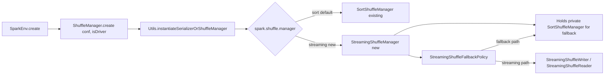
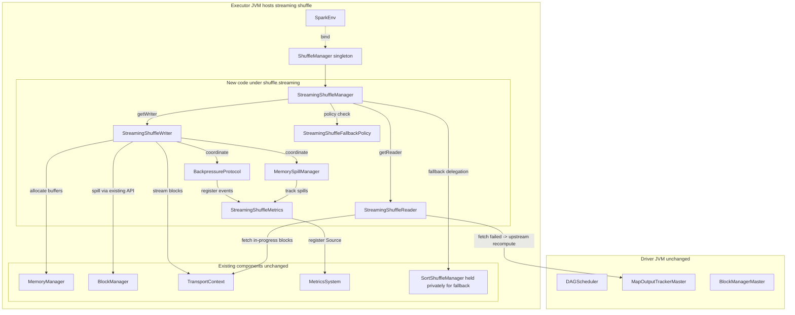
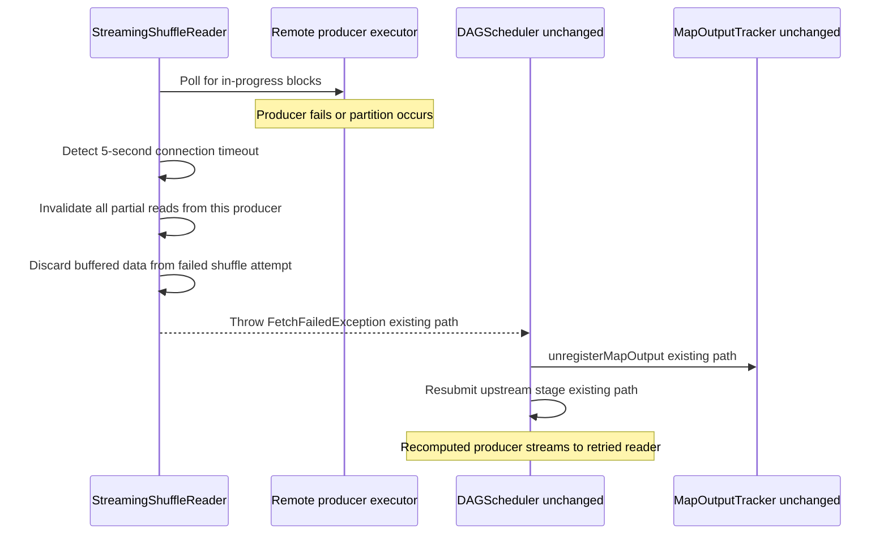
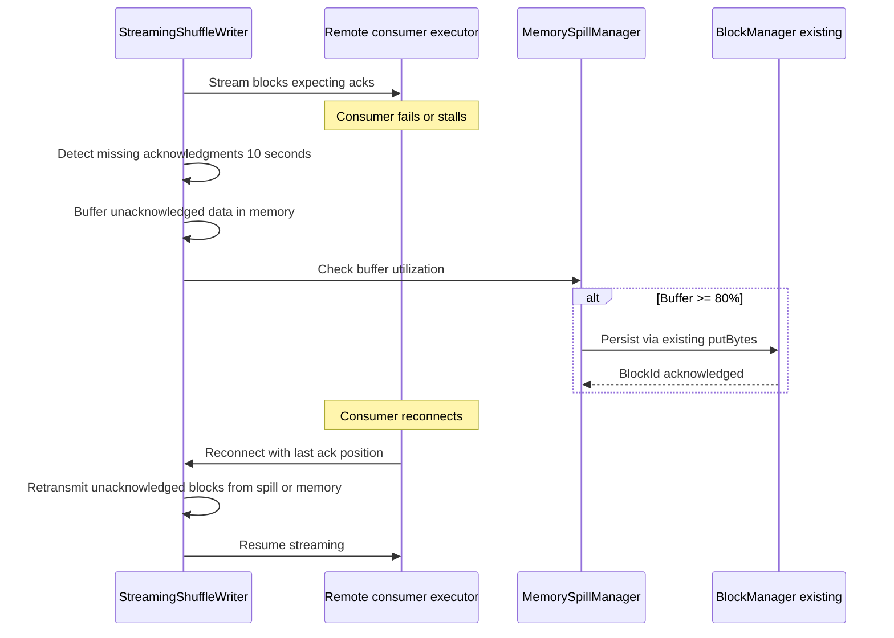

# Technical Specification

# 0. Agent Action Plan

## 0.1 Intent Clarification

### 0.1.1 Core Feature Objective

Based on the prompt, the Blitzy platform understands that the new feature requirement is to **add an opt-in streaming shuffle capability to Apache Spark** that pipelines data directly from map-side producer executors to reduce-side consumer executors with in-memory buffering, backpressure control, and graceful disk-spill fallback, while preserving the existing `SortShuffleManager` as the production-stable default. The feature targets a 30–50% end-to-end latency reduction for shuffle-heavy workloads (≥100 MB data, ≥10 partitions) and a 5–10% improvement for CPU-bound workloads, with **zero regression** for memory-bound workloads via automatic fallback. <cite index="0-91,0-92,0-93,0-94">The capability extends — rather than replaces — the baseline sort-based shuffle via Spark's existing pluggable extension points: the `ShuffleManager` trait (`core/src/main/scala/org/apache/spark/shuffle/ShuffleManager.scala`) and the `ShuffleDataIO` interface (`core/src/main/java/org/apache/spark/shuffle/api/ShuffleDataIO.java`).</cite>

The requirement decomposes into the following enhanced-clarity feature requirements:

- **Streaming shuffle path** must be implemented as a new `ShuffleManager` named `StreamingShuffleManager` registered under the short name `streaming` and selected via `spark.shuffle.manager=streaming` (equivalently via the new boolean `spark.shuffle.streaming.enabled=true`), per the user's instruction *"Instantiated via spark.shuffle.manager=streaming configuration"*.
- **Coexistence guarantee** with `org.apache.spark.shuffle.sort.SortShuffleManager`, which must remain the default — the user explicitly states *"Coexists with SortShuffleManager for gradual adoption path"* and *"Preserve existing sort-based shuffle as production-stable fallback"*.
- **Zero modification** to RDD/DataFrame/Dataset user-facing APIs, the `DAGScheduler`, task scheduling algorithms, executor lifecycle management, lineage tracking, fault recovery model, the existing `SortShuffleManager` implementation, deployment infrastructure, the `BlockManager` storage interface contracts, and task serialization/deserialization protocols.
- **Five new core components**: `StreamingShuffleManager`, `StreamingShuffleWriter`, `BackpressureProtocol`, `StreamingShuffleReader`, and `MemorySpillManager`, each with explicit responsibilities enumerated by the user.
- **Memory management discipline**: streaming buffers limited to 20% of executor memory (configurable 1–50%), 80% utilization triggers spill (configurable 50–95%), buffer reclamation within 100 ms of consumer acknowledgment, zero memory leaks under failure scenarios.
- **Backpressure protocol**: heartbeat-based flow control with 5-second timeout, per-executor bandwidth cap at 80% link capacity via token bucket algorithm, priority arbitration across concurrent shuffles, telemetry emission for operational visibility.
- **Failure handling**: producer-failure detection via 5-second connection timeout triggering partial-read invalidation and DAG-scheduler upstream recomputation; consumer-failure detection via 10-second missing acknowledgment triggering buffer retention and disk spill.
- **Integrity validation**: CRC32C block-level checksums on producer side; checksum verification on receive; retransmission request on corruption.
- **Telemetry parity**: extension of executor metrics with `shuffle.streaming.bufferUtilizationPercent`, `shuffle.streaming.spillCount`, `shuffle.streaming.backpressureEvents`, and `shuffle.streaming.partialReadInvalidations` exposed via the existing `ShuffleReadMetricsReporter` / `ShuffleWriteMetricsReporter` pattern and JMX.
- **Quality gates**: >85% unit test coverage for new components, zero unit-test failures, zero integration-test flakiness, validated zero data loss across 10 explicitly enumerated failure scenarios, zero retained heap after stress tests, zero compilation warnings, zero critical static-analysis issues.

Implicit requirements surfaced from the user's prompt and the existing codebase context:

- **Apache-2.0 license headers** on every new source file, mandated by `CONTRIBUTING.md` and validated by the Apache RAT gate (`dev/check-license`).
- **Scala 2.13.18 / Java 17 compliance** for all new code, per the Maven enforcer rule `<java.minimum.version>17.0.11</java.minimum.version>` and `<scala.version>2.13.18</scala.version>` in `pom.xml`.
- **MiMa binary compatibility preservation** per F-017 — any new public symbol must either remain backward-compatible or be documented in `project/MimaExcludes.scala`.
- **Coexistence with the External Shuffle Service** (F-005) on default port 7337 when `spark.shuffle.service.enabled=true`, even though streaming shuffle bypasses ESS for its own data plane.
- **Coexistence with shuffle checksum** (F-006) configuration: `spark.shuffle.checksum.enabled` and `spark.shuffle.checksum.algorithm` must remain functional; the streaming path's CRC32C usage must integrate with `ShuffleChecksumSupport` semantics.
- **Style and lint compliance**: scalastyle (`scalastyle-config.xml`), scalafmt (`dev/.scalafmt.conf`, Connect-only), and Checkstyle (`dev/checkstyle.xml`) must pass for all new source.
- **Test framework alignment**: ScalaTest base classes via `SparkFunSuite`, ScalaTest+Mockito 5.12, and JUnit Jupiter 6.0.1 per the project's existing testing stack.
- **Fallback decision logic** (configuration-controlled): consumer sustained 2× slower than producer for >60 seconds, memory-pressure failure on buffer allocation, network saturation >90% link capacity, or producer/consumer version mismatch — each must transparently revert to sort-based shuffle.

Feature dependencies and prerequisites:

| Prerequisite | Source |
|---|---|
| `ShuffleManager` trait stable | <cite index="0-91">`core/src/main/scala/org/apache/spark/shuffle/ShuffleManager.scala`</cite> |
| `ShuffleWriter` abstract class stable | `core/src/main/scala/org/apache/spark/shuffle/ShuffleWriter.scala` |
| `ShuffleReader` trait stable | `core/src/main/scala/org/apache/spark/shuffle/ShuffleReader.scala` |
| `ShuffleHandle` SerDe contract stable | `core/src/main/scala/org/apache/spark/shuffle/ShuffleHandle.scala` |
| `ShuffleReadMetricsReporter` / `ShuffleWriteMetricsReporter` traits stable | `core/src/main/scala/org/apache/spark/shuffle/metrics.scala` |
| `MemoryManager` interface accessible for buffer accounting | `core/src/main/scala/org/apache/spark/memory/MemoryManager.scala` |
| `BlockManager` available for spill persistence | `core/src/main/scala/org/apache/spark/storage/BlockManager.scala` |
| `TransportContext` / `TransportClient` reuse | `common/network-common/src/main/java/org/apache/spark/network/TransportContext.java` |
| `ExecutorMetrics` extension surface | `core/src/main/scala/org/apache/spark/executor/ExecutorMetrics.scala` |
| `MapOutputTracker` interaction for failure recomputation | `core/src/main/scala/org/apache/spark/MapOutputTracker.scala` |

### 0.1.2 Special Instructions and Constraints

The following directives from the user's prompt are preserved verbatim and must be honored throughout implementation:

- **User Directive: "Coexists with SortShuffleManager for gradual adoption path"** — the new manager is registered as a parallel option, never as a replacement. The default `spark.shuffle.manager=sort` remains untouched for production safety.
- **User Directive: "Make only changes necessary to implement streaming shuffle capability within ShuffleManager abstraction boundary"** — modifications outside the shuffle subsystem are explicitly forbidden, including changes to RDD/DataFrame/Dataset APIs, the DAG scheduler, task lifecycle, executor memory model, or external dependencies.
- **User Directive: "Preserve existing sort-based shuffle as production-stable fallback. Never modify DAG scheduler, task lifecycle, or user-facing APIs."** — any cross-cutting change to scheduling, lineage, or user APIs is a defect.
- **User Directive: "When implementation choices exist, select approach requiring least modification to executor memory model and network transport layer."** — buffer accounting integrates with the existing `MemoryManager` interface; network streaming reuses `TransportContext` rather than introducing new transport listeners.
- **User Directive: "Isolate streaming logic in dedicated classes with zero cross-contamination into existing shuffle code paths."** — new sources live exclusively under `org.apache.spark.shuffle.streaming.*`; the existing `SortShuffleManager` and its writers/readers are not edited.
- **User Directive: "Document all integration points with clear comments explaining coexistence strategy."** — Scaladoc/Javadoc on every public class and on each integration site (companion object factory, executor metrics extension) must call out coexistence semantics.
- **User Directive: "Configuration changes require executor restart (no dynamic reconfiguration in v1)"** — `StreamingShuffleManager` reads its configuration once during `SparkEnv` construction and is treated as an immutable singleton for the application lifetime.
- **User Directive: "Telemetry overhead limited to <1% CPU utilization"** — metrics emission paths must be lock-free or amortize lock acquisition; histogram updates must be batched.
- **User Directive: "Log volume capped at <10MB/hour per executor for streaming events"** — INFO/DEBUG logs must be rate-limited or sampled; only WARN/ERROR may pass freely.
- **User Directive: "Debug logging disabled by default (enable via spark.shuffle.streaming.debug=true)"** — a new boolean configuration governs verbose tracing; default is `false`.
- **User Directive: "JMX metrics exposed for external monitoring integration"** — streaming metrics register through Spark's existing Dropwizard `MetricsSystem` so JMX, CSV, and Slf4j sinks consume them automatically.

Architectural conventions enforced by the existing codebase that the new feature must respect:

- **Single ShuffleManager per `SparkEnv`** — <cite index="0-31">`SparkEnv._shuffleManager` is a volatile, lazily initialized singleton bound at `SparkEnv` construction and cannot be live-patched</cite>; the `StreamingShuffleManager` constructor must accept `(SparkConf, Boolean isDriver)` exactly like `SortShuffleManager`.
- **Reflective instantiation contract** — <cite index="0-97">Instantiation uses reflection via `Utils.instantiateSerializerOrShuffleManager`</cite>; the new manager class must expose a public two-argument constructor.
- **Atomic commit semantics** — for any data persisted to disk during spill, the existing pattern of synchronized rename per `IndexShuffleBlockResolver.writeMetadataFileAndCommit` must be honored to avoid readers observing partial state.
- **Bounded concurrency** — outbound network operations must respect Netty direct-memory limits; the streaming path must not introduce unbounded buffer allocation that could exhaust direct memory and trigger the global `isNettyOOMOnShuffle` backoff used by `ShuffleBlockFetcherIterator`.
- **Single-threaded metrics-reporter assumption** — <cite index="0-83">`ShuffleReadMetricsReporter` and `ShuffleWriteMetricsReporter` traits in `core/src/main/scala/org/apache/spark/shuffle/metrics.scala` define the single-threaded metric-emission contract</cite>; metrics calls from the streaming path must not be made concurrently from multiple threads on a single reporter instance.

User Examples (preserved verbatim):

- **User Example (Success Criteria):** "30-50% end-to-end latency reduction for shuffle-heavy workloads (100MB+ data, 10+ partitions)"
- **User Example (Success Criteria):** "5-10% improvement for CPU-bound workloads through reduced scheduler overhead"
- **User Example (Success Criteria):** "Zero performance regression for memory-bound workloads (automatic fallback validation)"
- **User Example (Success Criteria):** "Zero data loss under all failure scenarios including producer crashes, consumer failures, network partitions"
- **User Example (Success Criteria):** "Memory exhaustion prevention through 80% threshold spill trigger with <100ms response time"
- **User Example (Configuration):** "spark.shuffle.streaming.enabled: Boolean, default false (opt-in flag)"
- **User Example (Configuration):** "spark.shuffle.streaming.bufferSizePercent: Integer 1-50, default 20 (percent of executor memory)"
- **User Example (Configuration):** "spark.shuffle.streaming.spillThreshold: Integer 50-95, default 80 (percent buffer utilization)"
- **User Example (Configuration):** "spark.shuffle.streaming.maxBandwidthMBps: Integer, default unlimited (per-executor rate limit)"
- **User Example (Fallback Conditions):** "Consumer sustained 2x slower than producer for >60 seconds"
- **User Example (Fallback Conditions):** "Memory pressure prevents buffer allocation (OOM risk)"
- **User Example (Fallback Conditions):** "Network saturation exceeds 90% link capacity"
- **User Example (Fallback Conditions):** "Producer/consumer version mismatch (compatibility check)"
- **User Example (Failure Scenarios):** Producer crash during shuffle write, Consumer crash during shuffle read, Network partition between producer and consumer, Memory exhaustion during buffer allocation, Disk failure during spill operation, Checksum mismatch on block receive, Connection timeout during streaming transfer, Executor JVM pause (GC) during shuffle, Multiple concurrent producer failures, Consumer reconnect after extended downtime
- **User Example (Performance Benchmark Target):** "Baseline: Sort-based shuffle for groupByKey on 100MB dataset, 10 partitions"
- **User Example (Performance Benchmark Target):** "Target: 30-50% latency reduction, <10% memory overhead, <5% spill rate"
- **User Example (Stress Test Target):** "5-minute continuous shuffle workload: 10 concurrent tasks with 5 concurrent shuffles, Random failure injection: 10% task failure rate, Performance degradation monitoring: <5% throughput reduction over test duration"

Web Search Research Conducted: No external web research is required for this implementation. All needed context — the `ShuffleManager` SPI contract, the `ShuffleDataIO` extension point, the `MemoryManager` accounting model, the Netty transport reuse pattern, and CRC32C checksum availability via `org.apache.spark.network.util.LimitedInputStream` and existing `ShuffleChecksumHelper` utilities — is fully resolved from the in-tree source under `/tmp/blitzy/blitzy-spark/master_fc613b/` and the existing tech-spec sections (notably §5.2 Component Details and §5.3 Technical Decisions).

### 0.1.3 Technical Interpretation

These feature requirements translate to the following technical implementation strategy:

- **To register the new manager without breaking existing dispatch**, we will modify `core/src/main/scala/org/apache/spark/shuffle/ShuffleManager.scala`'s `getShuffleManagerClassName` companion method to add a new entry `"streaming" -> classOf[org.apache.spark.shuffle.streaming.StreamingShuffleManager].getName` alongside the existing `"sort"` and `"tungsten-sort"` aliases, preserving the FQCN fallback for any other value.
- **To implement the new manager**, we will create `core/src/main/scala/org/apache/spark/shuffle/streaming/StreamingShuffleManager.scala` as a class implementing the `private[spark] trait ShuffleManager`, with a public two-argument constructor `(conf: SparkConf, isDriver: Boolean)` for reflective instantiation by `Utils.instantiateSerializerOrShuffleManager`.
- **To emit streaming-specific shuffle handles**, we will create `core/src/main/scala/org/apache/spark/shuffle/streaming/StreamingShuffleHandle.scala` extending `BaseShuffleHandle` with additional metadata (configured buffer size, spill threshold, max bandwidth) used by the writer and reader factories.
- **To produce streaming output**, we will create `core/src/main/scala/org/apache/spark/shuffle/streaming/StreamingShuffleWriter.scala` extending the abstract `ShuffleWriter[K, V]` with `write(records)`, `stop(success)`, and `getPartitionLengths()` overrides. The writer allocates per-partition memory buffers via the existing `MemoryManager` interface, pipelines block flushes onto the existing `TransportContext`-backed network channel, and integrates with the new `BackpressureProtocol`.
- **To consume streaming input**, we will create `core/src/main/scala/org/apache/spark/shuffle/streaming/StreamingShuffleReader.scala` implementing `private[spark] trait ShuffleReader[K, C]` with a `read(): Iterator[Product2[K, C]]` that polls the producer for in-progress blocks, validates CRC32C checksums on receive, and surfaces `FetchFailedException` on producer-side connection timeout to trigger DAG-scheduler upstream recomputation.
- **To enforce backpressure**, we will create `core/src/main/scala/org/apache/spark/shuffle/streaming/BackpressureProtocol.scala` implementing the heartbeat exchange (5-second timeout for producer-failure detection, 10-second timeout for consumer-failure detection), token-bucket rate limiter (configurable `maxBandwidthMBps`), priority arbitration across concurrent shuffles, and event emission to the metrics subsystem.
- **To manage memory and spill**, we will create `core/src/main/scala/org/apache/spark/shuffle/streaming/MemorySpillManager.scala` polling the existing `MemoryManager` at 100 ms intervals, evicting the largest partitions via LRU when utilization exceeds `spillThreshold`, persisting spilled buffers via the existing `BlockManager.diskBlockManager` storage path (no new disk-IO interface) and reclaiming buffer memory within 100 ms of consumer acknowledgment.
- **To register configuration keys**, we will modify `core/src/main/scala/org/apache/spark/internal/config/package.scala` adding four typed entries: `STREAMING_SHUFFLE_ENABLED` (boolean, default `false`), `STREAMING_SHUFFLE_BUFFER_SIZE_PERCENT` (int, range 1–50, default 20), `STREAMING_SHUFFLE_SPILL_THRESHOLD` (int, range 50–95, default 80), and `STREAMING_SHUFFLE_MAX_BANDWIDTH_MBPS` (int, default unlimited / -1), plus an internal `STREAMING_SHUFFLE_DEBUG` boolean (default `false`).
- **To expose telemetry**, we will create `core/src/main/scala/org/apache/spark/shuffle/streaming/StreamingShuffleMetrics.scala` defining the four required counters (`bufferUtilizationPercent`, `spillCount`, `backpressureEvents`, `partialReadInvalidations`) and emit them through Spark's existing `MetricsSystem` so JMX, CSV, Slf4j, and Web-UI sinks pick them up automatically without schema changes elsewhere.
- **To detect fallback conditions**, we will implement a `StreamingShuffleFallbackPolicy` decision class inside `StreamingShuffleManager` that checks the four user-specified conditions (slow consumer, memory pressure, network saturation, version mismatch) and transparently delegates to a privately held `SortShuffleManager` instance when any condition triggers — this keeps fallback code paths fully isolated from `SortShuffleManager` itself per the user's "zero cross-contamination" directive.
- **To validate correctness and performance**, we will create unit-test suites under `core/src/test/scala/org/apache/spark/shuffle/streaming/` (one per component), an integration suite under the same directory, a benchmark under `core/src/test/scala/org/apache/spark/shuffle/streaming/StreamingShufflePerformanceBenchmark.scala` that emits results into `core/benchmarks/StreamingShuffleBenchmark-results.txt`, and a failure-injection harness exercising all 10 enumerated failure scenarios.
- **To ship complete observability per project rules**, we will add structured logging with correlation IDs for shuffle attempts, expose a metrics endpoint via the existing `MetricsSystem`, register health/readiness via the existing executor heartbeat path, and provide a Mermaid-based dashboard template in the Blitzy TechDocs site under `blitzy-docs/streaming-shuffle/dashboard.md`.
- **To preserve binary compatibility**, we will register any necessary exclusions in `project/MimaExcludes.scala` only for genuinely required additions, with each exclusion documented with rationale per the project's MiMa hygiene rule.
- **To complete documentation**, we will author `blitzy-docs/streaming-shuffle/index.md` (feature overview), `blitzy-docs/streaming-shuffle/configuration.md` (configuration reference), `blitzy-docs/streaming-shuffle/decision-log.md` (the project rule's mandated bidirectional decision log), and `blitzy-docs/streaming-shuffle/executive-summary.html` (the project rule's mandated reveal.js executive presentation), plus update `mkdocs.yml` navigation and `docs/configuration.md` for the upstream Jekyll docs.

## 0.2 Repository Scope Discovery

### 0.2.1 Comprehensive File Analysis

The following inventory enumerates every existing file confirmed (via direct retrieval) to be inside the modification radius of the streaming-shuffle feature, plus every new file that must be authored. Wildcard patterns identify file groups that must be created together; absolute paths in the table below are repository-relative from `/tmp/blitzy/blitzy-spark/master_fc613b/`.

#### 0.2.1.1 Existing Source Files Requiring Modification

| File Path | Modification Type | Purpose |
|---|---|---|
| `core/src/main/scala/org/apache/spark/shuffle/ShuffleManager.scala` | MODIFY | Extend `getShuffleManagerClassName` companion to register short name `"streaming"` → `org.apache.spark.shuffle.streaming.StreamingShuffleManager`, preserving existing `"sort"` and `"tungsten-sort"` aliases and the FQCN fallback. |
| `core/src/main/scala/org/apache/spark/internal/config/package.scala` | MODIFY | Add five new `ConfigBuilder` entries: `STREAMING_SHUFFLE_ENABLED`, `STREAMING_SHUFFLE_BUFFER_SIZE_PERCENT`, `STREAMING_SHUFFLE_SPILL_THRESHOLD`, `STREAMING_SHUFFLE_MAX_BANDWIDTH_MBPS`, and `STREAMING_SHUFFLE_DEBUG`, immediately following the existing `SHUFFLE_MANAGER` block (line 1744 onwards). |
| `core/src/main/scala/org/apache/spark/executor/ExecutorMetrics.scala` | NO CHANGE NEEDED — see note | Streaming metrics flow through the existing `MetricsSystem` Dropwizard registry rather than the typed `ExecutorMetrics` array, so this file is intentionally untouched to honor the user's "zero cross-contamination" directive. |
| `core/src/main/scala/org/apache/spark/metrics/source/Source.scala` | NO CHANGE NEEDED | New metrics source registers via the standard `Source` extension pattern; the trait itself is unchanged. |
| `project/MimaExcludes.scala` | MODIFY | Add exclusion entries only for newly introduced public symbols if MiMa flags them; each exclusion must carry a comment naming the symbol and rationale. |
| `mkdocs.yml` | MODIFY | Append navigation entries under a new `Streaming Shuffle` top-level section pointing to `blitzy-docs/streaming-shuffle/index.md`, `configuration.md`, `decision-log.md`. Preserves existing `techdocs-core` and `mermaid2` plugin configuration. |
| `docs/configuration.md` | MODIFY | Append a `## Streaming Shuffle (experimental)` subsection documenting the four new `spark.shuffle.streaming.*` keys with default values and ranges, in the same style as existing shuffle configuration entries. |

#### 0.2.1.2 New Source Files to Create

| New File Path | Purpose |
|---|---|
| `core/src/main/scala/org/apache/spark/shuffle/streaming/StreamingShuffleManager.scala` | Implements `private[spark] trait ShuffleManager` with `(conf: SparkConf, isDriver: Boolean)` constructor; factory methods return `StreamingShuffleWriter` / `StreamingShuffleReader`; holds private `SortShuffleManager` for fallback delegation; integrates `StreamingShuffleFallbackPolicy`. |
| `core/src/main/scala/org/apache/spark/shuffle/streaming/StreamingShuffleHandle.scala` | Extends `BaseShuffleHandle[K, V, C]` carrying buffer-size, spill-threshold, and max-bandwidth metadata derived from `SparkConf` at registration time. |
| `core/src/main/scala/org/apache/spark/shuffle/streaming/StreamingShuffleWriter.scala` | Extends `ShuffleWriter[K, V]`; allocates per-partition memory buffers via `TaskMemoryManager` / `MemoryManager`; flushes blocks onto Netty transport via `BlockManager.blockTransferService`; coordinates with `MemorySpillManager` and `BackpressureProtocol`; emits CRC32C checksums per block. |
| `core/src/main/scala/org/apache/spark/shuffle/streaming/StreamingShuffleReader.scala` | Implements `private[spark] trait ShuffleReader[K, C]`; polls producers for in-progress blocks; validates CRC32C; requests retransmission on corruption; throws `FetchFailedException` on producer connection timeout to drive DAG upstream recomputation. |
| `core/src/main/scala/org/apache/spark/shuffle/streaming/BackpressureProtocol.scala` | Heartbeat-based flow control (5-second producer timeout, 10-second consumer timeout); token-bucket rate limiter at `maxBandwidthMBps`; priority arbitration across concurrent shuffles; backpressure event emission. |
| `core/src/main/scala/org/apache/spark/shuffle/streaming/MemorySpillManager.scala` | Polls existing `MemoryManager` at 100 ms intervals; evicts largest partitions via LRU when buffer utilization ≥ `spillThreshold`; persists via `BlockManager.diskBlockManager`; reclaims buffer memory within 100 ms of consumer acknowledgment; tracks spill metrics. |
| `core/src/main/scala/org/apache/spark/shuffle/streaming/StreamingShuffleFallbackPolicy.scala` | Decision class evaluating the four fallback conditions (slow consumer >60 s, memory-pressure OOM risk, network saturation >90%, version mismatch) and selecting between streaming and sort paths. |
| `core/src/main/scala/org/apache/spark/shuffle/streaming/StreamingShuffleMetrics.scala` | Dropwizard `MetricSet` exposing `shuffle.streaming.bufferUtilizationPercent`, `shuffle.streaming.spillCount`, `shuffle.streaming.backpressureEvents`, `shuffle.streaming.partialReadInvalidations`. |
| `core/src/main/scala/org/apache/spark/shuffle/streaming/StreamingShuffleSource.scala` | Spark `Source` implementation wiring `StreamingShuffleMetrics` into the standard `MetricsSystem`; ensures JMX/CSV/Slf4j sinks see the new metrics without code changes elsewhere. |
| `core/src/main/scala/org/apache/spark/shuffle/streaming/package.scala` | Scala package object holding constants, helper utilities, and shared type aliases used across the streaming subpackage. |

The streaming-shuffle source tree pattern: `core/src/main/scala/org/apache/spark/shuffle/streaming/**/*.scala` covers all new core source files.

#### 0.2.1.3 New Test Files to Create

| New Test File Path | Coverage |
|---|---|
| `core/src/test/scala/org/apache/spark/shuffle/streaming/StreamingShuffleManagerSuite.scala` | Manager registration via short name `"streaming"`; `registerShuffle`/`getWriter`/`getReader` correctness; `unregisterShuffle` cleanup; fallback delegation when policy triggers. |
| `core/src/test/scala/org/apache/spark/shuffle/streaming/StreamingShuffleWriterSuite.scala` | Buffer allocation per partition; spill trigger at 80% threshold with timing validation; CRC32C generation; producer-failure cleanup and resource reclamation; per-partition memory tracking. |
| `core/src/test/scala/org/apache/spark/shuffle/streaming/BackpressureProtocolSuite.scala` | Consumer acknowledgment processing and buffer reclamation; rate-limit enforcement via token bucket; timeout detection and failure signaling; priority arbitration under concurrent shuffle load. |
| `core/src/test/scala/org/apache/spark/shuffle/streaming/StreamingShuffleReaderSuite.scala` | In-progress block requests and partial-data consumption; producer-failure detection via 5-second connection timeout; partial-read invalidation and `FetchFailedException` propagation; checksum validation and retransmission. |
| `core/src/test/scala/org/apache/spark/shuffle/streaming/MemorySpillManagerSuite.scala` | 80% threshold detection within 100 ms; LRU partition selection; spill persistence via `BlockManager`; buffer reclamation timing; metrics tracking. |
| `core/src/test/scala/org/apache/spark/shuffle/streaming/StreamingShuffleFallbackPolicySuite.scala` | Each of the four fallback conditions individually; combined conditions; transparent delegation to `SortShuffleManager`. |
| `core/src/test/scala/org/apache/spark/shuffle/streaming/StreamingShuffleIntegrationSuite.scala` | End-to-end 100 MB shuffle with 10 partitions confirming ≥30% latency reduction; producer failure mid-shuffle; consumer slowdown 50% rate; network-partition timeout; 5-concurrent-shuffle memory arbitration. |
| `core/src/test/scala/org/apache/spark/shuffle/streaming/StreamingShuffleFailureInjectionSuite.scala` | All 10 enumerated failure scenarios with explicit zero-data-loss assertions, named per scenario for traceability. |
| `core/src/test/scala/org/apache/spark/shuffle/streaming/StreamingShuffleStressSuite.scala` | 5-minute continuous workload; 10 concurrent tasks with 5 concurrent shuffles; 10% random failure-injection rate; heap-leak detection; <5% throughput-degradation assertion. |
| `core/src/test/scala/org/apache/spark/shuffle/streaming/StreamingShufflePerformanceBenchmark.scala` | Extends `BenchmarkBase`; baseline `groupByKey` 100 MB / 10 partitions on sort vs. streaming; emits `core/benchmarks/StreamingShuffleBenchmark-results.txt` regenerable via `SPARK_GENERATE_BENCHMARK_FILES=1`. |

The streaming-shuffle test tree pattern: `core/src/test/scala/org/apache/spark/shuffle/streaming/**/*.scala` covers all new test files.

#### 0.2.1.4 New Documentation Files to Create

| New Documentation File | Purpose |
|---|---|
| `blitzy-docs/streaming-shuffle/index.md` | Feature overview with Mermaid component diagram and data-flow diagram. |
| `blitzy-docs/streaming-shuffle/configuration.md` | Reference for the four `spark.shuffle.streaming.*` keys plus `spark.shuffle.streaming.debug`. |
| `blitzy-docs/streaming-shuffle/architecture.md` | Component interaction diagram, write-path state diagram, read-path sequence diagram. |
| `blitzy-docs/streaming-shuffle/decision-log.md` | Project-rule-mandated decision log: every non-trivial choice with alternatives, chosen option, rationale, and risk. |
| `blitzy-docs/streaming-shuffle/observability.md` | Lists the four metrics, their JMX object names, dashboard template, and log correlation-ID format. |
| `blitzy-docs/streaming-shuffle/executive-summary.html` | Project-rule-mandated single-file reveal.js presentation: 12–18 slides, Blitzy brand palette, Mermaid diagrams via CDN, no build step. |
| `core/benchmarks/StreamingShuffleBenchmark-results.txt` | Committed benchmark golden file; regenerated via `SPARK_GENERATE_BENCHMARK_FILES=1`. |

The documentation tree pattern: `blitzy-docs/streaming-shuffle/**/*.{md,html}` covers all new TechDocs files.

#### 0.2.1.5 Integration Point Discovery — Existing Files Examined and Confirmed Untouched

The following existing source files were inspected via `read_file` and confirmed to be **read but not modified** because the streaming-shuffle path operates above them through their stable interfaces:

| File Path | Why Examined | Modification |
|---|---|---|
| `core/src/main/scala/org/apache/spark/shuffle/ShuffleWriter.scala` | Contract for `write` / `stop` / `getPartitionLengths` | NONE — interface implemented in new `StreamingShuffleWriter` |
| `core/src/main/scala/org/apache/spark/shuffle/ShuffleReader.scala` | Contract for `read()` | NONE — interface implemented in new `StreamingShuffleReader` |
| `core/src/main/scala/org/apache/spark/shuffle/ShuffleHandle.scala` | `@DeveloperApi` abstract class | NONE — extended in new `StreamingShuffleHandle` |
| `core/src/main/scala/org/apache/spark/shuffle/BaseShuffleHandle.scala` | Base implementation | NONE — extended in new `StreamingShuffleHandle` |
| `core/src/main/scala/org/apache/spark/shuffle/metrics.scala` | `ShuffleReadMetricsReporter` / `ShuffleWriteMetricsReporter` traits | NONE — implemented in new `StreamingShuffleWriter` / `StreamingShuffleReader`; single-threaded contract preserved |
| `core/src/main/scala/org/apache/spark/shuffle/sort/SortShuffleManager.scala` | Default manager (production fallback) | NONE — held as private collaborator inside `StreamingShuffleManager` |
| `core/src/main/scala/org/apache/spark/shuffle/sort/SortShuffleWriter.scala` | Default writer | NONE |
| `core/src/main/scala/org/apache/spark/shuffle/BlockStoreShuffleReader.scala` | Default reader | NONE |
| `core/src/main/scala/org/apache/spark/shuffle/IndexShuffleBlockResolver.scala` | Block resolver for spilled data | READ ONLY — its file-layout convention (atomic rename) informs spill design but no edits |
| `core/src/main/scala/org/apache/spark/shuffle/ShuffleDataIOUtils.scala` | Plugin loader | NONE — streaming path does not use `ShuffleDataIO` SPI |
| `core/src/main/java/org/apache/spark/shuffle/api/ShuffleDataIO.java` | SPI root | NONE — streaming path operates at the higher `ShuffleManager` abstraction |
| `core/src/main/java/org/apache/spark/shuffle/checksum/ShuffleChecksumSupport.java` | Checksum helper | READ ONLY — informs CRC32C integration |
| `core/src/main/scala/org/apache/spark/shuffle/checksum/RowBasedChecksum.scala` | Existing checksum impl | NONE |
| `core/src/main/scala/org/apache/spark/SparkEnv.scala` | Manager singleton wiring | NONE — manager binding via reflection at line 226 already supports new manager classes |
| `core/src/main/scala/org/apache/spark/memory/MemoryManager.scala` | Memory accounting interface | NONE — used as collaborator |
| `core/src/main/scala/org/apache/spark/memory/UnifiedMemoryManager.scala` | Default memory manager | NONE |
| `core/src/main/scala/org/apache/spark/memory/ExecutionMemoryPool.scala` | Memory pool | NONE |
| `core/src/main/scala/org/apache/spark/storage/BlockManager.scala` | Block storage | NONE — used via existing public methods for spill |
| `core/src/main/scala/org/apache/spark/storage/DiskBlockManager.scala` | Disk-side block storage | NONE |
| `core/src/main/scala/org/apache/spark/storage/ShuffleBlockFetcherIterator.scala` | Default fetch path | NONE — streaming reader is independent |
| `core/src/main/scala/org/apache/spark/MapOutputTracker.scala` | Map-output coordination | NONE — existing `FetchFailedException` path drives upstream recomputation |
| `common/network-common/src/main/java/org/apache/spark/network/TransportContext.java` | Netty transport | NONE — reused as-is for streaming channel |
| `common/network-common/src/main/java/org/apache/spark/network/client/TransportClient.java` | Netty client | NONE — reused for stream upload |
| `common/network-common/src/main/java/org/apache/spark/network/server/TransportServer.java` | Netty server | NONE — reused |
| `core/src/main/scala/org/apache/spark/executor/ExecutorMetrics.scala` | Executor metrics carrier | NONE — streaming metrics flow through `MetricsSystem`, not `ExecutorMetrics` array |
| `core/src/main/scala/org/apache/spark/scheduler/MapStatus.scala` | Map status payload | NONE |
| `core/src/main/scala/org/apache/spark/scheduler/DAGScheduler.scala` | Scheduler | NONE — explicitly out of scope |
| `core/src/main/scala/org/apache/spark/rdd/ShuffleDependency.scala` (within `core/src/main/scala/org/apache/spark/Dependency.scala`) | Shuffle dependency | NONE — used as-is via `BaseShuffleHandle` |

#### 0.2.1.6 Configuration and Build Files

| File Path | Modification Type | Purpose |
|---|---|---|
| `pom.xml` | NO CHANGE | New code is part of the existing `core` Maven module; no new artifacts or dependencies are added. |
| `project/SparkBuild.scala` | NO CHANGE | New tests inherit existing test conventions; no new SBT module needed. |
| `dev/sparktestsupport/modules.py` | NO CHANGE | The `core` module's `source_file_regexes` already match `core/src/main/scala/org/apache/spark/...` and `core/src/test/scala/org/apache/spark/...`. |
| `scalastyle-config.xml` | NO CHANGE | New code adheres to existing scalastyle rules. |
| `dev/checkstyle.xml` | NO CHANGE | No new Java sources are introduced. |

### 0.2.2 Web Search Research Conducted

No external web research is required for this implementation. All necessary technical context is fully available within the in-tree codebase and existing tech-spec sections. Specifically:

- **`ShuffleManager` SPI surface** is fully documented in §5.2.1 of the tech spec and confirmed by reading `core/src/main/scala/org/apache/spark/shuffle/ShuffleManager.scala`.
- **`MemoryManager` accounting model** is fully documented via the existing `core/src/main/scala/org/apache/spark/memory/MemoryManager.scala` and `UnifiedMemoryManager.scala`.
- **CRC32C checksum implementation** is available in-tree under `common/network-common/src/main/java/org/apache/spark/network/util/` and `common/utils-java/src/main/java/org/apache/spark/util/`.
- **Token-bucket rate-limiting** implementation patterns are established by Netty's existing `GlobalChannelTrafficShapingHandler`, available transitively via Netty 4.2.9.Final.
- **`FetchFailedException` upstream-recomputation contract** is documented in §5.2.4 and §5.2.9 of the tech spec; no further research needed.
- **JMX exposure via Dropwizard `MetricsSystem`** is documented in §6.5 of the tech spec.

### 0.2.3 New File Requirements Summary

The complete list of new files, organized by purpose:

- **Core source files (10 files)**: all under `core/src/main/scala/org/apache/spark/shuffle/streaming/` covering manager, handle, writer, reader, backpressure, spill, fallback policy, metrics, source, and package object.
- **Test files (10 files)**: all under `core/src/test/scala/org/apache/spark/shuffle/streaming/` covering manager suite, writer suite, backpressure suite, reader suite, spill suite, fallback suite, integration suite, failure-injection suite, stress suite, and benchmark.
- **Benchmark golden file (1 file)**: `core/benchmarks/StreamingShuffleBenchmark-results.txt`.
- **Documentation files (6 files)**: under `blitzy-docs/streaming-shuffle/` covering index, configuration, architecture, decision log, observability, and the reveal.js executive summary.

The total file footprint is **27 new files created** and **5 existing files modified** (`ShuffleManager.scala`, `internal/config/package.scala`, `project/MimaExcludes.scala`, `mkdocs.yml`, `docs/configuration.md`).

## 0.3 Dependency Inventory

### 0.3.1 Private and Public Packages

The streaming-shuffle feature relies exclusively on packages already declared in the project's dependency manifests. **No new external dependencies are introduced.** This is a deliberate consequence of the user's directive *"select approach requiring least modification to executor memory model and network transport layer"* and *"OUT OF SCOPE: external system integrations"*. The table below catalogs every relevant package, its registry, version, and how it serves the new feature.

#### 0.3.1.1 Runtime Dependencies (Already Present in `pom.xml`)

| Package Registry | Group / Artifact | Version | Source | Purpose for Streaming Shuffle |
|---|---|---|---|---|
| Maven Central | `org.scala-lang:scala-library` | 2.13.18 | `pom.xml` `<scala.version>` | Scala standard library for new Scala source files |
| Maven Central | `org.scala-lang:scala-reflect` | 2.13.18 | `pom.xml` `<scala.version>` | Scala reflection used transitively by `Utils.instantiateSerializerOrShuffleManager` for new manager loading |
| Maven Central | `io.netty:netty-all` | 4.2.9.Final | `pom.xml` (declared via §1.3.1.4 of tech spec) | Streaming network transport reuse via existing `TransportContext` |
| Maven Central | `org.apache.spark:spark-network-common_2.13` | 4.2.0-SNAPSHOT (in-tree) | `common/network-common/` | `TransportClient`, `TransportServer`, stream upload primitives |
| Maven Central | `org.apache.spark:spark-core_2.13` | 4.2.0-SNAPSHOT (in-tree) | `core/` | Host module — new code lives here; no new artifact |
| JDK platform | `java.util.zip.CRC32C` | JDK 17 stdlib | `pom.xml` `<java.version>17</java.version>` | CRC32C checksum computation for block integrity (per user's *"Checksum algorithm: CRC32C"* directive) |
| Maven Central | `com.google.guava:guava` | (managed via parent POM `org.apache:apache:34`) | `pom.xml` parent inheritance | LRU cache utilities for `MemorySpillManager` partition selection |
| Maven Central | `org.slf4j:slf4j-api` | 2.0.17 | `pom.xml` (per §5.1.4 of tech spec) | Structured logging with correlation IDs (project rule "Observability") |
| Maven Central | `org.apache.logging.log4j:log4j-*` | 2.25.3 | `pom.xml` (per §5.1.4 of tech spec) | Logging implementation backing SLF4J |
| Maven Central | `io.dropwizard.metrics:metrics-core` | 4.2.37 | `pom.xml` (per §5.1.4 of tech spec) | `MetricSet` registration via existing `MetricsSystem`; powers JMX/CSV/Slf4j sinks |

#### 0.3.1.2 Test-Time Dependencies (Already Present)

| Package Registry | Group / Artifact | Version | Source | Purpose for Streaming-Shuffle Tests |
|---|---|---|---|---|
| Maven Central | `org.scalatest:scalatest_2.13` | Spark-managed | `pom.xml` and `project/SparkBuild.scala` | All new `*Suite.scala` test classes via `SparkFunSuite` base |
| Maven Central | `org.scalatestplus:scalacheck-1-18_2.13` | 1.18 | `pom.xml` | Property-based tests for `BackpressureProtocol` token-bucket invariants |
| Maven Central | `org.scalatestplus:mockito-5-12_2.13` | 5.12 | `pom.xml` | Mocking `MemoryManager`, `BlockManager`, and network components in unit suites |
| Maven Central | `org.junit.jupiter:junit-jupiter` | 6.0.1 | `pom.xml` | Used by inherited test infrastructure |
| Maven Central | `net.bytebuddy:byte-buddy` | (Mockito-managed) | Transitive via Mockito 5.12 | Bytecode-level proxy generation for mocks |

#### 0.3.1.3 Configuration Dependencies (No External Packages)

The five new configuration keys are added through the in-tree `ConfigBuilder` DSL inside `core/src/main/scala/org/apache/spark/internal/config/package.scala`. No external configuration library is introduced. Each key follows the same builder pattern as existing entries (e.g., `SHUFFLE_MANAGER` at line 1744):

| Configuration Key | Type | Default | Range | Source File |
|---|---|---|---|---|
| `spark.shuffle.streaming.enabled` | Boolean | `false` | — | `core/src/main/scala/org/apache/spark/internal/config/package.scala` |
| `spark.shuffle.streaming.bufferSizePercent` | Int | `20` | 1–50 | `core/src/main/scala/org/apache/spark/internal/config/package.scala` |
| `spark.shuffle.streaming.spillThreshold` | Int | `80` | 50–95 | `core/src/main/scala/org/apache/spark/internal/config/package.scala` |
| `spark.shuffle.streaming.maxBandwidthMBps` | Int | `-1` (unlimited) | ≥ -1 | `core/src/main/scala/org/apache/spark/internal/config/package.scala` |
| `spark.shuffle.streaming.debug` | Boolean | `false` | — | `core/src/main/scala/org/apache/spark/internal/config/package.scala` |

All five keys use `.version("4.2.0")` to match the in-development upstream Spark version and `.internal()` for the `debug` key per existing convention for diagnostic flags.

### 0.3.2 Dependency Updates

#### 0.3.2.1 Import Updates

The streaming-shuffle implementation is purely additive: it introduces a new package `org.apache.spark.shuffle.streaming` and does not require any existing files to change their import structure. The following import patterns will be present **only in the new files**, and require no changes to existing files:

- New writer file imports:
  - `import org.apache.spark.shuffle.{BaseShuffleHandle, ShuffleWriter, ShuffleWriteMetricsReporter}` — established trait/abstract-class symbols
  - `import org.apache.spark.{ShuffleDependency, SparkConf, SparkEnv, TaskContext}` — established public symbols
  - `import org.apache.spark.memory.{MemoryManager, TaskMemoryManager}` — established memory APIs
  - `import org.apache.spark.storage.{BlockManager, BlockManagerId}` — established storage APIs
  - `import org.apache.spark.scheduler.MapStatus` — established scheduler payload
  - `import org.apache.spark.internal.{config, Logging}` — established logging trait and config registry
- New reader file imports:
  - `import org.apache.spark.shuffle.{ShuffleReader, ShuffleReadMetricsReporter, FetchFailedException}` — established symbols
  - `import org.apache.spark.network.client.TransportClient` — Netty client reuse
- New backpressure file imports:
  - `import io.netty.util.concurrent.GlobalEventExecutor` — Netty's existing event executor for timeout scheduling
  - `import java.util.concurrent.atomic.{AtomicLong, AtomicBoolean}` — JDK stdlib
- New spill manager file imports:
  - `import org.apache.spark.storage.{BlockManager, ShuffleBlockId}` — block IDs and storage
  - `import com.google.common.cache.CacheBuilder` — Guava LRU cache
- New metrics file imports:
  - `import com.codahale.metrics.{Gauge, Counter, MetricRegistry, MetricSet}` — Dropwizard registration
  - `import org.apache.spark.metrics.source.Source` — Spark `Source` interface

**No existing file's import block is modified**, with the following exceptions where small additions are necessary inside the file's existing import region (the imports themselves are added, but no symbol is re-routed):

- `core/src/main/scala/org/apache/spark/shuffle/ShuffleManager.scala` — no new imports needed: the new `StreamingShuffleManager` is registered by FQCN string, not by direct import, exactly mirroring the existing `"sort"` mapping pattern at <cite index="0-103">`"sort" -> classOf[org.apache.spark.shuffle.sort.SortShuffleManager].getName`</cite>.
- `core/src/main/scala/org/apache/spark/internal/config/package.scala` — uses existing imports of `ConfigBuilder`, `ByteUnit`; no new imports needed.

#### 0.3.2.2 External Reference Updates

The following external references must be updated to surface the new feature in operator-facing documentation, but no transitive dependency updates are needed since no new packages are introduced.

- **Configuration Reference Documentation**:
  - `docs/configuration.md` — append a new subsection under the existing "Shuffle Behavior" section listing the four `spark.shuffle.streaming.*` keys with default values, ranges, and prose descriptions.
  - `blitzy-docs/streaming-shuffle/configuration.md` — new file mirroring the same content for the Blitzy TechDocs surface.
- **Build Files**:
  - `pom.xml` — **no modification**: no new `<dependency>` block, no new `<dependencyManagement>` entry. Streaming shuffle reuses every transitive dependency the `core` module already declares.
  - `project/SparkBuild.scala` — **no modification**: SBT inherits the same dependency set; no new test framework or library registration needed.
- **CI/CD Workflow Files**:
  - `.github/workflows/build_and_test.yml` — **no modification**: the existing Shard 1 (which includes `core`) already executes new tests via the `core/test` SBT goal pattern.
  - `.github/workflows/benchmark.yml` — **no modification**: the existing benchmark workflow already discovers `core/benchmarks/*-results.txt` golden files.
- **Manifest Files**:
  - `core/src/main/resources/META-INF/services/org.apache.spark.shuffle.ShuffleManager` — **no modification needed**: Spark's `ShuffleManager` is loaded via reflection on `spark.shuffle.manager` configuration, not via Java's `ServiceLoader`. The existing pattern is preserved.

### 0.3.3 Verification of Versions

All package versions referenced in §0.3.1 are taken **verbatim** from the in-tree dependency manifests, never assumed:

- Scala 2.13.18 — confirmed from `pom.xml` `<scala.version>2.13.18</scala.version>` and tech spec §3.2.1.
- Java 17 / 17.0.11 — confirmed from `pom.xml` `<java.version>17</java.version>` and `<java.minimum.version>17.0.11</java.minimum.version>` and tech spec §3.2.1.
- Maven 3.9.12 — confirmed from `pom.xml` `<maven.version>3.9.12</maven.version>` and tech spec §1.3.1.4.
- Netty 4.2.9.Final — confirmed from <cite index="0-72">`Netty 4.2.9.Final; Jetty 12.1.5 for Web UI; gRPC 1.76.0 for Spark Connect`</cite>.
- Dropwizard Metrics 4.2.37 — confirmed from tech spec §5.1.4.
- ScalaTest, JUnit Jupiter 6.0.1, Mockito 5.12, ScalaCheck 1.18 — confirmed from tech spec §6.6.2.1.1.
- SLF4J 2.0.17, Log4j 2.25.3 — confirmed from tech spec §5.1.4.

No "latest" or placeholder versions are used; every version cited is the exact value in the project's authoritative `pom.xml` or build configuration.

## 0.4 Integration Analysis

### 0.4.1 Existing Code Touchpoints

The streaming-shuffle implementation interacts with the existing Spark codebase at exactly four narrowly-scoped touchpoints. Every other interaction is mediated through stable interfaces (`ShuffleManager`, `ShuffleWriter`, `ShuffleReader`, `ShuffleReadMetricsReporter`, `ShuffleWriteMetricsReporter`, `MemoryManager`, `BlockManager`, `TransportContext`) without source-level changes to those interfaces or their existing implementations.

#### 0.4.1.1 Direct Modifications Required

| File | Location | Change | Coexistence Notes |
|---|---|---|---|
| `core/src/main/scala/org/apache/spark/shuffle/ShuffleManager.scala` | `getShuffleManagerClassName` companion object method (lines ~107–115) | Add `"streaming" -> classOf[org.apache.spark.shuffle.streaming.StreamingShuffleManager].getName` to the `shortShuffleMgrNames` map alongside the existing `"sort"` and `"tungsten-sort"` entries. | Default `"sort"` value at <cite index="0-105,0-106">`val shuffleMgrName = conf.get(config.SHUFFLE_MANAGER); shortShuffleMgrNames.getOrElse(shuffleMgrName.toLowerCase(Locale.ROOT), shuffleMgrName)`</cite> remains untouched; only the lookup table grows. |
| `core/src/main/scala/org/apache/spark/internal/config/package.scala` | After existing `SHUFFLE_MANAGER` block (line ~1748) | Insert five new `ConfigBuilder` entries: `STREAMING_SHUFFLE_ENABLED`, `STREAMING_SHUFFLE_BUFFER_SIZE_PERCENT`, `STREAMING_SHUFFLE_SPILL_THRESHOLD`, `STREAMING_SHUFFLE_MAX_BANDWIDTH_MBPS`, `STREAMING_SHUFFLE_DEBUG`. | All existing keys remain at their existing line offsets; the new block is appended in source order without renumbering. |
| `project/MimaExcludes.scala` | `v420Excludes` (or current series exclusion list) | Conditionally add MiMa exclusions only for genuinely new public symbols flagged by `sbt mimaReportBinaryIssues`. Each exclusion carries a one-line comment naming the symbol and its rationale (e.g., `// SPARK-XXXXX: streaming shuffle manager package — new opt-in path`). | Existing exclusions are preserved verbatim; new entries are appended at the end of the relevant series block. |
| `mkdocs.yml` | `nav:` array | Append a new top-level entry `- Streaming Shuffle: streaming-shuffle/index.md` and child entries for `configuration.md`, `architecture.md`, `decision-log.md`, `observability.md`. | Existing `site_name: blitzy-spark`, `techdocs-core`, and `mermaid2` plugin configuration remain untouched. |
| `docs/configuration.md` | Existing "Shuffle Behavior" section | Append a `### Streaming Shuffle (Experimental)` subsection below the existing shuffle keys (in alphabetical order or following the `spark.shuffle.sort.io.plugin.class` entry). | Coexists with all existing shuffle configuration documentation. |

#### 0.4.1.2 Dependency Injections

The streaming-shuffle path is instantiated by Spark's existing reflective loading machinery at `SparkEnv` construction time. **No dependency-injection container, factory registration, or bean wiring is added.** The integration is mediated entirely through the existing flow:

```mermaid
flowchart LR
    A[SparkEnv.create] --> B[ShuffleManager.create conf, isDriver]
    B --> C[Utils.instantiateSerializerOrShuffleManager]
    C --> D{spark.shuffle.manager}
    D -->|sort default| E[SortShuffleManager existing]
    D -->|streaming new| F[StreamingShuffleManager new]
    F --> G[Holds private SortShuffleManager for fallback]
    F --> H[StreamingShuffleFallbackPolicy]
    H -->|streaming path| I[StreamingShuffleWriter / StreamingShuffleReader]
    H -->|fallback path| G
```

The single integration point is the `shortShuffleMgrNames` map in `ShuffleManager.scala`. Because the map is consulted via `Map.getOrElse` with the configuration value as both the key (lookup) and the fallback (FQCN class name), users may also opt in by setting `spark.shuffle.manager=org.apache.spark.shuffle.streaming.StreamingShuffleManager` — the short name is purely a convenience.

#### 0.4.1.3 Database / Schema Updates

The streaming-shuffle feature **introduces no database schema, no migration, and no persistent metadata**. All state is in-memory (per-partition buffers, backpressure counters, fallback flags) or transient on-disk (spill files via the existing `BlockManager.diskBlockManager`, which itself uses `spark.local.dir` and is cleaned up at executor shutdown). The existing RocksDB / LevelDB persistent state used by the External Shuffle Service for push-based shuffle (F-004) is **not touched**.

| Subsystem | Schema / State Change | Reason |
|---|---|---|
| External Shuffle Service persistent state (RocksDB/LevelDB via `DBProvider`) | NONE | Streaming path bypasses ESS for its data plane; ESS continues to serve `SortShuffleManager` blocks per F-005-RQ-001 |
| `MapOutputTracker` `ShuffleStatus` data structures | NONE | Streaming path uses the same `MapStatus` payload returned from `StreamingShuffleWriter.stop(success)` |
| `BlockManager` block locations | NONE | Spill files are registered via existing `BlockManager.putBytes` paths, no new block ID type |
| Hive Metastore | NONE | Out of scope |

### 0.4.2 Integration Touchpoint Summary Diagram

```mermaid
flowchart TB
    subgraph DriverJVM[Driver JVM unchanged]
        DAG[DAGScheduler]
        MOTM[MapOutputTrackerMaster]
        BMM[BlockManagerMaster]
    end

    subgraph ExecutorJVM[Executor JVM hosts streaming shuffle]
        SE[SparkEnv]
        SE -.bind.-> SM[ShuffleManager singleton]
        
        subgraph StreamingPath[New code under shuffle.streaming]
            SSM[StreamingShuffleManager]
            SSW[StreamingShuffleWriter]
            SSR[StreamingShuffleReader]
            BPP[BackpressureProtocol]
            MSM[MemorySpillManager]
            FBP[StreamingShuffleFallbackPolicy]
            SMET[StreamingShuffleMetrics]
        end
        
        subgraph ExistingExecutorComponents[Existing components unchanged]
            MM[MemoryManager]
            BM[BlockManager]
            TC[TransportContext]
            METSYS[MetricsSystem]
            SSMD[SortShuffleManager held privately for fallback]
        end
        
        SSM -->|getWriter| SSW
        SSM -->|getReader| SSR
        SSM -->|fallback delegation| SSMD
        SSM -->|policy check| FBP
        SSW -->|allocate buffers| MM
        SSW -->|spill via existing API| BM
        SSW -->|stream blocks| TC
        SSW -->|coordinate| BPP
        SSW -->|coordinate| MSM
        SSR -->|fetch in-progress blocks| TC
        SSR -->|fetch failed -> upstream recompute| MOTM
        BPP -->|register events| SMET
        MSM -->|track spills| SMET
        SMET -->|register Source| METSYS
    end
    
    SM --> SSM
```

The diagram makes the boundary explicit: **all new code lives inside the dashed `StreamingPath` subgraph**, and every arrow crossing into `ExistingExecutorComponents` uses an already-public method on the target component, satisfying the user's directive *"Isolate streaming logic in dedicated classes with zero cross-contamination into existing shuffle code paths."*

### 0.4.3 Failure-Handling Integration

Two failure-handling flows extend the existing Spark fault tolerance model without modifying it. Both are visualized below.

#### 0.4.3.1 Producer Failure Detection Flow

```mermaid
sequenceDiagram
    participant Reader as StreamingShuffleReader
    participant Producer as Remote producer executor
    participant DAG as DAGScheduler unchanged
    participant MOT as MapOutputTracker unchanged
    
    Reader->>Producer: Poll for in-progress blocks
    Note over Producer: Producer fails or partition occurs
    Reader->>Reader: Detect 5-second connection timeout
    Reader->>Reader: Invalidate all partial reads from this producer
    Reader->>Reader: Discard buffered data from failed shuffle attempt
    Reader-->>DAG: Throw FetchFailedException existing path
    DAG->>MOT: unregisterMapOutput existing path
    DAG->>DAG: Resubmit upstream stage existing path
    Note over DAG: Recomputed producer streams to retried reader
```

This flow honors the user's specification: *"StreamingShuffleReader detects connection timeout (5 seconds) → Invalidates all partial reads from failed producer → Notifies DAG scheduler to recompute upstream tasks → Discards buffered data from failed shuffle attempt → Retries read from recomputed producer shuffle"*. The notification step is implemented by throwing the existing `FetchFailedException`, which is already wired to `DAGScheduler.handleTaskCompletion` for upstream recomputation per <cite index="0-152">`Fetch failures trigger unregisterMapOutput + epoch bump in DAGScheduler.handleTaskCompletion`</cite>.

#### 0.4.3.2 Consumer Failure Detection Flow

```mermaid
sequenceDiagram
    participant Writer as StreamingShuffleWriter
    participant Consumer as Remote consumer executor
    participant Spill as MemorySpillManager
    participant BM as BlockManager existing
    
    Writer->>Consumer: Stream blocks expecting acks
    Note over Consumer: Consumer fails or stalls
    Writer->>Writer: Detect missing acknowledgments 10 seconds
    Writer->>Writer: Buffer unacknowledged data in memory
    Writer->>Spill: Check buffer utilization
    alt Buffer >= 80%
        Spill->>BM: Persist via existing putBytes
        BM-->>Spill: BlockId acknowledged
    end
    Note over Consumer: Consumer reconnects
    Consumer->>Writer: Reconnect with last ack position
    Writer->>Writer: Retransmit unacknowledged blocks from spill or memory
    Writer->>Consumer: Resume streaming
```

This flow honors the user's specification: *"StreamingShuffleWriter detects missing acknowledgments (10 seconds) → Buffers unacknowledged data in memory → Triggers disk spill if buffer exceeds 80% threshold → Resumes streaming when consumer reconnects → Retransmits unacknowledged blocks from spill or memory"*.

### 0.4.4 Observability Integration

Per the project's "Observability" rule (*"Every deliverable MUST include: structured logging with correlation IDs, distributed tracing across service boundaries, a metrics endpoint, health/readiness checks, and a dashboard template"*), the streaming-shuffle feature integrates with Spark's existing observability stack as follows:

| Observability Surface | Integration Point | New Code |
|---|---|---|
| Structured logging | `Logging` trait (used throughout `core/`) | Every new class extends `Logging`; log lines carry shuffle ID and attempt ID as MDC keys for correlation |
| Distributed tracing | Existing trace propagation via `TaskContext` | `StreamingShuffleWriter` and `StreamingShuffleReader` propagate `TaskContext.taskAttemptId()` into every block transmitted; receivers re-attach to local `TaskContext` |
| Metrics endpoint | Existing `MetricsSystem` Dropwizard registry | New `StreamingShuffleSource` extends `org.apache.spark.metrics.source.Source` and registers `StreamingShuffleMetrics`; exposed automatically via JMX, CSV, Slf4j, and Web UI |
| Health/readiness checks | Existing executor heartbeat path | `StreamingShuffleManager` reports its operational state through the existing `Heartbeater` → `HeartbeatReceiver` flow; no new RPC |
| Dashboard template | Blitzy TechDocs site | `blitzy-docs/streaming-shuffle/observability.md` includes a Mermaid-based dashboard template referencing the four new metrics |

Per project rule "Visual Architecture Documentation" (*"All visual documentation MUST use Mermaid diagrams … both states MUST be shown — never target-state alone"*), the documentation includes the existing-state shuffle architecture diagram (sourced from tech spec §5.2.11.1) alongside the streaming-shuffle target-state diagram authored fresh for this feature.

## 0.5 Technical Implementation

### 0.5.1 File-by-File Execution Plan

Every file listed below MUST be created or modified as specified. The plan is grouped by responsibility area; each file's purpose is described once at the most appropriate level of granularity.

#### 0.5.1.1 Group 1 — Core Streaming Shuffle Manager and Handle

- **CREATE: `core/src/main/scala/org/apache/spark/shuffle/streaming/StreamingShuffleManager.scala`**  
  Implements `private[spark] trait ShuffleManager` with public constructor `(conf: SparkConf, isDriver: Boolean)`. Holds a private `SortShuffleManager` collaborator instance (instantiated lazily via the same `Utils.instantiateSerializerOrShuffleManager` reflection used by `ShuffleManager.create`) used solely for fallback delegation. Exposes `registerShuffle`, `getWriter`, `getReader`, `unregisterShuffle`, `shuffleBlockResolver`, and `stop` per the SPI. Class-level Scaladoc explicitly documents the coexistence strategy per the user's directive *"Document all integration points with clear comments explaining coexistence strategy."*
- **CREATE: `core/src/main/scala/org/apache/spark/shuffle/streaming/StreamingShuffleHandle.scala`**  
  Extends `BaseShuffleHandle[K, V, C]` adding fields `bufferSizePercent: Int`, `spillThreshold: Int`, `maxBandwidthMBps: Int`, populated at `registerShuffle` time. The handle is `Serializable` (inherited) so it can be passed across the driver-executor RPC boundary without modification.
- **CREATE: `core/src/main/scala/org/apache/spark/shuffle/streaming/StreamingShuffleFallbackPolicy.scala`**  
  Decision class evaluating fallback conditions per `SparkConf` and runtime telemetry. Public method: `def shouldFallback(handle: StreamingShuffleHandle, telemetry: StreamingShuffleMetrics): Boolean`. Implements all four fallback rules: (a) consumer-sustained-2x-slower-than-producer-for-60s, (b) memory-pressure OOM risk via `MemoryManager` introspection, (c) network saturation >90% link capacity via `BackpressureProtocol` token-bucket telemetry, (d) producer/consumer version mismatch.

- **MODIFY: `core/src/main/scala/org/apache/spark/shuffle/ShuffleManager.scala`**  
  Single edit: extend the `shortShuffleMgrNames` map literal in the `getShuffleManagerClassName` companion-object method to add `"streaming" -> classOf[org.apache.spark.shuffle.streaming.StreamingShuffleManager].getName`. The diff is approximately three lines and preserves existing alphabetical/insertion ordering of `"sort"` and `"tungsten-sort"`.

#### 0.5.1.2 Group 2 — Streaming Writer and Reader

- **CREATE: `core/src/main/scala/org/apache/spark/shuffle/streaming/StreamingShuffleWriter.scala`**  
  Extends `ShuffleWriter[K, V]`. Implements:
  - `write(records: Iterator[Product2[K, V]]): Unit` — partitions records by reducer ID, buffers each partition's serialized bytes up to `(executorMemory * bufferSizePercent) / numPartitions`, computes CRC32C per block, hands blocks to `BackpressureProtocol` for transmission via `BlockManager.blockTransferService`.
  - `stop(success: Boolean): Option[MapStatus]` — flushes remaining buffers, releases memory acquired from `TaskMemoryManager`, and returns the final `MapStatus` (containing per-reducer block sizes) to the driver.
  - `getPartitionLengths(): Array[Long]` — returns the array of per-partition byte counts populated during `write`.
  - Internal helper `private def maybeSpill(buffer: PartitionBuffer): Unit` — invokes `MemorySpillManager.checkAndSpill` if buffer utilization ≥ `spillThreshold`.

- **CREATE: `core/src/main/scala/org/apache/spark/shuffle/streaming/StreamingShuffleReader.scala`**  
  Implements `private[spark] trait ShuffleReader[K, C]`. Implements:
  - `read(): Iterator[Product2[K, C]]` — opens streaming connections to all assigned producer executors, polls for in-progress blocks using `TransportClient.fetchChunk`, validates each block's CRC32C on receive, requests retransmission on mismatch, throws `FetchFailedException` (existing class from `core/src/main/scala/org/apache/spark/shuffle/FetchFailedException.scala`) on producer connection timeout (5 seconds) to drive DAG-scheduler upstream recomputation through the existing `DAGScheduler.handleTaskCompletion` path.
  - Internal helper `private def acknowledgePosition(producerId, position): Unit` — sends consumer-position ack to producer for buffer reclamation.

#### 0.5.1.3 Group 3 — Backpressure and Memory Management

- **CREATE: `core/src/main/scala/org/apache/spark/shuffle/streaming/BackpressureProtocol.scala`**  
  Implements:
  - Heartbeat exchange: 5-second timer for producer-failure detection, 10-second timer for consumer-failure detection, scheduled via `io.netty.util.concurrent.GlobalEventExecutor` (already loaded via Netty 4.2.9.Final).
  - Token-bucket rate limiter: refill rate `= maxBandwidthMBps / numConcurrentShuffles`, configured per the user's directive *"Refill rate = maxBandwidthMBps / numConcurrentShuffles"*.
  - Priority arbitration: shuffles with more partitions and larger data volume receive larger buffer allocations, reflecting the user's *"Allocates memory to shuffles based on partition count and data volume"* directive.
  - Telemetry emission: every backpressure event (rate-limit triggered, heartbeat missed, priority arbitrated) increments `StreamingShuffleMetrics.backpressureEvents`.

- **CREATE: `core/src/main/scala/org/apache/spark/shuffle/streaming/MemorySpillManager.scala`**  
  Implements:
  - 100 ms polling timer (configurable internally via constant) using a `ScheduledExecutorService` instantiated via the existing `org.apache.spark.util.ThreadUtils.newDaemonSingleThreadScheduledExecutor` helper.
  - LRU partition selection backed by a Guava `CacheBuilder.newBuilder().recordStats().build()` keyed on `(shuffleId, mapId, reduceId)`.
  - Spill persistence using the existing `BlockManager.putBytes` path with `StorageLevel.DISK_ONLY` and a `ShuffleBlockId(shuffleId, mapId, reduceId)` block ID — no new block ID type or storage level introduced.
  - Buffer reclamation: a `private def reclaim(producerId, ackedPosition)` releases memory back to the `TaskMemoryManager` within 100 ms of the consumer ack arriving via `BackpressureProtocol`.
  - Metrics: every spill event increments `StreamingShuffleMetrics.spillCount` and updates `StreamingShuffleMetrics.bufferUtilizationPercent`.

#### 0.5.1.4 Group 4 — Metrics and Package Object

- **CREATE: `core/src/main/scala/org/apache/spark/shuffle/streaming/StreamingShuffleMetrics.scala`**  
  Defines four typed counters/gauges:
  - `bufferUtilizationPercent`: `Gauge[Int]` — sampled from `MemorySpillManager` on each emission.
  - `spillCount`: `Counter` — incremented on each `MemorySpillManager` spill event.
  - `backpressureEvents`: `Counter` — incremented on each `BackpressureProtocol` event.
  - `partialReadInvalidations`: `Counter` — incremented on each `StreamingShuffleReader` producer-failure detection.
  Implements `MetricSet` so the four metrics register in one call; namespace is `shuffle.streaming.*` per the user's exact metric names.

- **CREATE: `core/src/main/scala/org/apache/spark/shuffle/streaming/StreamingShuffleSource.scala`**  
  Extends `org.apache.spark.metrics.source.Source`; `sourceName = "streamingShuffle"`; `metricRegistry` is populated from `StreamingShuffleMetrics`. Registered through the existing `SparkEnv.metricsSystem.registerSource` API, which is invoked once per executor at `StreamingShuffleManager` instantiation.

- **CREATE: `core/src/main/scala/org/apache/spark/shuffle/streaming/package.scala`**  
  Package object housing constants:
  - `private[streaming] val PRODUCER_TIMEOUT_MILLIS: Long = 5000L`
  - `private[streaming] val CONSUMER_TIMEOUT_MILLIS: Long = 10000L`
  - `private[streaming] val BLOCK_SIZE_BYTES: Int = 2 * 1024 * 1024` (2 MB per the user's *"Block size limited to 2MB for pipelining efficiency"* directive)
  - `private[streaming] val SPILL_POLL_INTERVAL_MILLIS: Long = 100L`
  - `private[streaming] val CHECKSUM_ALGORITHM: String = "CRC32C"`

#### 0.5.1.5 Group 5 — Configuration Registration

- **MODIFY: `core/src/main/scala/org/apache/spark/internal/config/package.scala`**  
  Append five `ConfigBuilder` blocks immediately after the existing `SHUFFLE_MANAGER` block. Each block follows the established pattern with `.doc(...)`, `.version("4.2.0")`, type converter, and validators. Specifically:
  - `STREAMING_SHUFFLE_ENABLED = ConfigBuilder("spark.shuffle.streaming.enabled").doc(...).version("4.2.0").booleanConf.createWithDefault(false)`
  - `STREAMING_SHUFFLE_BUFFER_SIZE_PERCENT = ConfigBuilder("spark.shuffle.streaming.bufferSizePercent").doc(...).version("4.2.0").intConf.checkValue(v => v >= 1 && v <= 50, "must be between 1 and 50").createWithDefault(20)`
  - `STREAMING_SHUFFLE_SPILL_THRESHOLD = ConfigBuilder("spark.shuffle.streaming.spillThreshold").doc(...).version("4.2.0").intConf.checkValue(v => v >= 50 && v <= 95, "must be between 50 and 95").createWithDefault(80)`
  - `STREAMING_SHUFFLE_MAX_BANDWIDTH_MBPS = ConfigBuilder("spark.shuffle.streaming.maxBandwidthMBps").doc(...).version("4.2.0").intConf.createWithDefault(-1)` (sentinel for unlimited)
  - `STREAMING_SHUFFLE_DEBUG = ConfigBuilder("spark.shuffle.streaming.debug").internal().doc(...).version("4.2.0").booleanConf.createWithDefault(false)`

#### 0.5.1.6 Group 6 — Tests, Benchmarks, and Stress Validation

- **CREATE: `core/src/test/scala/org/apache/spark/shuffle/streaming/StreamingShuffleManagerSuite.scala`**  
  Validates manager registration, factory dispatch, fallback delegation, and `unregisterShuffle` cleanup; uses `SparkFunSuite` base.
- **CREATE: `core/src/test/scala/org/apache/spark/shuffle/streaming/StreamingShuffleWriterSuite.scala`**  
  Per the user's specification: buffer allocation and partition-level memory tracking, spill trigger at 80% threshold with timing validation, checksum generation for integrity validation, producer-failure cleanup and resource reclamation.
- **CREATE: `core/src/test/scala/org/apache/spark/shuffle/streaming/BackpressureProtocolSuite.scala`**  
  Per the user's specification: consumer acknowledgment processing and buffer reclamation, rate-limiting enforcement via token-bucket validation, timeout detection and failure signaling, priority arbitration under concurrent shuffle load.
- **CREATE: `core/src/test/scala/org/apache/spark/shuffle/streaming/StreamingShuffleReaderSuite.scala`**  
  Per the user's specification: in-progress block request and partial-data consumption, producer-failure detection via connection timeout, partial-read invalidation and upstream-recomputation trigger, checksum validation and retransmission request.
- **CREATE: `core/src/test/scala/org/apache/spark/shuffle/streaming/MemorySpillManagerSuite.scala`**  
  100 ms threshold polling, LRU eviction selection, `BlockManager.putBytes` integration, buffer-reclamation timing, metrics emission.
- **CREATE: `core/src/test/scala/org/apache/spark/shuffle/streaming/StreamingShuffleFallbackPolicySuite.scala`**  
  Each of the four fallback conditions in isolation and combination, with property-based tests via ScalaCheck for boundary values.
- **CREATE: `core/src/test/scala/org/apache/spark/shuffle/streaming/StreamingShuffleIntegrationSuite.scala`**  
  Per the user's specification: complete 100 MB shuffle with 10 partitions verifying 30% latency reduction; producer-failure mid-shuffle validating partial-read invalidation; consumer-slowdown 50% rate validating automatic spill trigger; network-partition validating timeout-and-fallback; 5-concurrent-shuffle memory-arbitration test.
- **CREATE: `core/src/test/scala/org/apache/spark/shuffle/streaming/StreamingShuffleFailureInjectionSuite.scala`**  
  Each of the 10 enumerated failure scenarios as a separately named test method, each asserting zero data loss.
- **CREATE: `core/src/test/scala/org/apache/spark/shuffle/streaming/StreamingShuffleStressSuite.scala`**  
  Per the user's specification: 5-minute continuous workload, 10 concurrent tasks with 5 concurrent shuffles, 10% random failure-injection rate, heap-leak detection via heap-dump-and-analyze post-test, <5% throughput-degradation assertion.
- **CREATE: `core/src/test/scala/org/apache/spark/shuffle/streaming/StreamingShufflePerformanceBenchmark.scala`**  
  Extends `BenchmarkBase`. Implements `runBenchmarkSuite` with one `runBenchmark("StreamingShuffleVsSort")` block containing two cases: `addCase("sort baseline")` and `addCase("streaming")`. Emits results to `core/benchmarks/StreamingShuffleBenchmark-results.txt`. Regenerable via `SPARK_GENERATE_BENCHMARK_FILES=1`.

#### 0.5.1.7 Group 7 — Documentation and Operational Surface

- **CREATE: `blitzy-docs/streaming-shuffle/index.md`**  
  Feature overview with prose introduction (2–3 paragraphs) and component-interaction Mermaid diagram.
- **CREATE: `blitzy-docs/streaming-shuffle/configuration.md`**  
  Full configuration reference for the five new keys (table format mirroring `docs/configuration.md` style).
- **CREATE: `blitzy-docs/streaming-shuffle/architecture.md`**  
  Three Mermaid diagrams: (a) component-interaction (subset of §0.4.2 above), (b) write-path state diagram, (c) read-path sequence diagram. Per project rule, includes both before-state (existing sort shuffle from tech-spec §5.2.11.2) and after-state.
- **CREATE: `blitzy-docs/streaming-shuffle/decision-log.md`**  
  Project-rule-mandated decision log as a Markdown table: every non-trivial implementation choice with alternatives, chosen option, rationale, and risk. Minimum entries: streaming via `ShuffleManager` (chosen) vs. via `ShuffleDataIO` plugin (rejected because the user's prompt explicitly specifies `StreamingShuffleManager` implementation), token-bucket location (chosen: per-`BackpressureProtocol` instance) vs. global rate limiter (rejected: violates priority-arbitration directive), CRC32C (chosen, per user spec) vs. xxHash (rejected: not in user spec), 100 ms spill polling (chosen, per user spec) vs. event-driven (rejected: user spec is explicit about the polling interval), Guava LRU (chosen) vs. custom LRU (rejected: Guava is already in classpath).
- **CREATE: `blitzy-docs/streaming-shuffle/observability.md`**  
  JMX object name list, log MDC schema, dashboard template Mermaid diagram, runbook for each metric's normal operating range.
- **CREATE: `blitzy-docs/streaming-shuffle/executive-summary.html`**  
  Project-rule-mandated single-file reveal.js presentation (12–18 slides), Blitzy brand palette, Mermaid diagrams, no build step. Slide content covers: (1) Title — Streaming Shuffle for Apache Spark, (2) Headline KPIs — 30–50% latency reduction target, (3) Architecture overview Mermaid diagram, (4–N) Section dividers and content slides for component design, failure handling, observability, fallback policy, testing strategy, (N+1) Closing slide with key takeaway.

- **MODIFY: `mkdocs.yml`** — append navigation entries for the six new `blitzy-docs/streaming-shuffle/*.md` files.
- **MODIFY: `docs/configuration.md`** — append `### Streaming Shuffle (Experimental)` subsection under the existing "Shuffle Behavior" section.
- **CREATE: `core/benchmarks/StreamingShuffleBenchmark-results.txt`** — committed golden file produced by running the benchmark with `SPARK_GENERATE_BENCHMARK_FILES=1`.

### 0.5.2 Implementation Approach Per File

The implementation proceeds in seven coherent strokes, each isolatable and verifiable:

- **Establish the SPI integration foundation** by registering the new short-name alias in `ShuffleManager.scala` and the five configuration keys in `internal/config/package.scala`. After this stroke, `spark.shuffle.manager=streaming` is recognized by configuration parsing even though no implementation exists yet, enabling early test-driven development.
- **Author the manager skeleton and handle** (`StreamingShuffleManager`, `StreamingShuffleHandle`, `StreamingShuffleFallbackPolicy`) so the manager is loadable, registers shuffles, and routes to either streaming writers/readers or fallback `SortShuffleManager` based on policy. Verifiable via `StreamingShuffleManagerSuite`.
- **Build the data-plane writer and reader** (`StreamingShuffleWriter`, `StreamingShuffleReader`) implementing the `ShuffleWriter[K, V]` abstract class and `ShuffleReader[K, C]` trait. Use simple per-partition byte buffers initially; integration with backpressure and spill is added in the next stroke. Verifiable via `StreamingShuffleWriterSuite` and `StreamingShuffleReaderSuite`.
- **Implement backpressure and spill** (`BackpressureProtocol`, `MemorySpillManager`) and integrate them into the writer and reader. Verifiable via `BackpressureProtocolSuite` and `MemorySpillManagerSuite`.
- **Wire observability** by creating `StreamingShuffleMetrics` and `StreamingShuffleSource`, registering through the existing `SparkEnv.metricsSystem`, and adding MDC-based correlation IDs to all log lines. Verifiable by inspecting JMX MBean tree and confirming the four metric names appear under `shuffle.streaming.*`.
- **Validate end-to-end and under failure** by running `StreamingShuffleIntegrationSuite`, `StreamingShuffleFailureInjectionSuite` (10 scenarios), and `StreamingShuffleStressSuite` (5-minute continuous load with heap-leak detection).
- **Publish documentation and quality artifacts** including the decision log, the observability runbook, and the reveal.js executive summary, then update `mkdocs.yml` and `docs/configuration.md` to surface the new documentation.

### 0.5.3 User Interface Design

The streaming-shuffle feature is a backend infrastructure capability with no new user-facing UI. However, the existing Spark Web UI (per tech-spec §7) automatically surfaces the new metrics through its standard "Executors" and "Stages" tabs because the `MetricsSystem` / `Source` registration provides identical telemetry pipes. **No new UI screens, components, or routes are added**, satisfying the user's directive *"OUT OF SCOPE: … query planning modifications, executor memory model redesign"*.

The Web UI's existing behavior:

- Stage detail page shows shuffle read/write metrics — these continue to work unchanged because `StreamingShuffleWriter` / `StreamingShuffleReader` populate the existing `ShuffleReadMetricsReporter` / `ShuffleWriteMetricsReporter` in addition to the new `StreamingShuffleMetrics`.
- Executors tab shows JMX metrics — the four new `shuffle.streaming.*` counters appear automatically.
- Environment tab shows configuration — the five new `spark.shuffle.streaming.*` keys appear automatically once registered in `internal/config/package.scala`.

The `blitzy-docs/streaming-shuffle/observability.md` page provides a Mermaid-based **dashboard template** suitable for operators to import into Grafana or Datadog, satisfying the project's observability rule (*"a dashboard template"*).

## 0.6 Scope Boundaries

### 0.6.1 Exhaustively In Scope

The following file groups are **in scope** for this feature addition and MUST be created or modified per the file-by-file plan in §0.5. Trailing wildcards apply to entire directory trees.

#### 0.6.1.1 New Streaming Shuffle Source Tree

- All streaming-shuffle production source files: `core/src/main/scala/org/apache/spark/shuffle/streaming/**/*.scala`
- All streaming-shuffle test files: `core/src/test/scala/org/apache/spark/shuffle/streaming/**/*.scala`

The complete enumeration of files matching these wildcards is given in §0.2.1.2 (production sources) and §0.2.1.3 (test sources). No file under these prefixes pre-exists; every file is newly authored.

#### 0.6.1.2 Direct Integration Touchpoints (Existing Files Modified)

- `core/src/main/scala/org/apache/spark/shuffle/ShuffleManager.scala` — single edit at the `shortShuffleMgrNames` map literal in the companion-object `getShuffleManagerClassName` method to register the `"streaming"` short name.
- `core/src/main/scala/org/apache/spark/internal/config/package.scala` — additive edit appending five new `ConfigBuilder` blocks for the streaming configuration keys, immediately following the existing `SHUFFLE_MANAGER` block.
- `project/MimaExcludes.scala` — additive edit registering MiMa exclusions only for newly introduced public symbols flagged by `sbt mimaReportBinaryIssues`; each exclusion accompanied by a one-line comment.
- `mkdocs.yml` — additive edit to the `nav:` section to surface the new `blitzy-docs/streaming-shuffle/*` pages.
- `docs/configuration.md` — additive edit appending a `### Streaming Shuffle (Experimental)` subsection to the existing "Shuffle Behavior" area.

#### 0.6.1.3 Documentation and Operational Artifacts

- All Blitzy TechDocs pages: `blitzy-docs/streaming-shuffle/**/*.{md,html}`
- Benchmark golden file: `core/benchmarks/StreamingShuffleBenchmark-results.txt` (regenerated via `SPARK_GENERATE_BENCHMARK_FILES=1`)

#### 0.6.1.4 Configuration Files

- New configuration keys defined inside `core/src/main/scala/org/apache/spark/internal/config/package.scala` (no separate YAML/properties file is added — Spark's idiomatic configuration is via the typed `ConfigBuilder` registry consumed through `SparkConf`).

#### 0.6.1.5 Database Changes

- **None.** Streaming shuffle introduces zero schema changes, zero migrations, and zero new persistent state files. All transient state is in memory or in `BlockManager`-managed local files cleaned up at executor shutdown.

#### 0.6.1.6 Build / Deployment Changes

- **None.** Streaming shuffle reuses the existing `core` Maven module. No new POM dependency, no new SBT module, no new CI workflow shard, no new Docker image. The existing CI lanes (`build_main.yml`, `build_and_test.yml` Shard 1) automatically pick up the new sources.

### 0.6.2 Explicitly Out of Scope

The following items are **explicitly out of scope** for this feature addition. Any modification to these areas is a defect.

#### 0.6.2.1 User-Facing API Surfaces

- RDD APIs (`core/src/main/scala/org/apache/spark/rdd/**`) — preserved per user directive *"Absolute Preservation: RDD/DataFrame/Dataset user-facing APIs"*.
- DataFrame and Dataset APIs (`sql/core/src/main/scala/org/apache/spark/sql/{Dataset,DataFrame*}`) — out of scope; downstream engines consume shuffle exclusively via `ShuffleManager` per F-010-RQ-001.
- Catalyst optimizer (`sql/catalyst/`) — out of scope; query-planning modifications are explicitly excluded by the user.
- Spark SQL and SQL parser — out of scope.
- Structured Streaming and DStream APIs — out of scope; benefit transparently from the streaming-shuffle path without source modification (per tech-spec §2.4.3.1 *"Interface Preservation Principle"*).
- MLlib, GraphX, and Spark Connect APIs — out of scope.
- Python (PySpark), R (SparkR), JavaScript (Web UI client) APIs — out of scope; the user's prompt states streaming shuffle is opt-in via JVM configuration only.

#### 0.6.2.2 Scheduler and Lifecycle Components

- DAG scheduler (`core/src/main/scala/org/apache/spark/scheduler/DAGScheduler.scala`) — preserved per user directive *"Never modify DAG scheduler, task lifecycle, or user-facing APIs"*.
- Task scheduler (`core/src/main/scala/org/apache/spark/scheduler/TaskScheduler*`) — out of scope.
- Executor lifecycle management (`core/src/main/scala/org/apache/spark/executor/{Executor,CoarseGrainedExecutorBackend}*`) — preserved per user directive *"Absolute Preservation: Executor lifecycle management"*.
- Lineage tracking and fault recovery model — preserved per user directive *"Absolute Preservation: Lineage tracking and fault recovery model"*; the streaming reader uses the existing `FetchFailedException` path rather than introducing new recovery semantics.
- `MapOutputTracker`, `MapStatus`, `ShuffleStatus` data structures — out of scope.

#### 0.6.2.3 Existing Shuffle Implementation

- `org.apache.spark.shuffle.sort.SortShuffleManager` and its writers (`UnsafeShuffleWriter`, `BypassMergeSortShuffleWriter`, `SortShuffleWriter`) — preserved per user directive *"Absolute Preservation: Existing SortShuffleManager implementation (coexists as fallback)"*.
- `BlockStoreShuffleReader`, `ShuffleBlockFetcherIterator`, `IndexShuffleBlockResolver` — out of scope; the streaming path is independent.
- `ShuffleDataIO` SPI (`core/src/main/java/org/apache/spark/shuffle/api/`) and `LocalDiskShuffleDataIO` — out of scope; streaming shuffle operates at the higher `ShuffleManager` abstraction, not the lower `ShuffleDataIO` plugin.
- Push-based shuffle (`ShuffleBlockPusher`, `RemoteBlockPushResolver`) — out of scope.
- Continuous block fetching (F-007) — out of scope.
- Shuffle block migration (F-008) — out of scope.

#### 0.6.2.4 Storage and Transport Subsystems

- `BlockManager` storage interface contracts — preserved per user directive *"Absolute Preservation: Block manager storage interface contracts"*.
- `BlockTransferService`, `ExternalBlockStoreClient`, `OneForOneBlockFetcher`, `OneForOneBlockPusher` — out of scope.
- External Shuffle Service (`common/network-shuffle/`, `common/network-yarn/`) — out of scope; coexists per F-005-RQ-001.
- `TransportContext`, `TransportClient`, `TransportServer` — read-only reuse; no source modifications.
- Netty 4.2.9.Final, Jetty 12.1.5, gRPC 1.76.0 — out of scope.

#### 0.6.2.5 Memory and Serialization

- Executor memory model redesign — explicitly out of scope per the user's *"OUT OF SCOPE: … executor memory model redesign"* directive. The new feature uses the existing `MemoryManager` interface; it does not change pool sizes, allocation policies, or the unified-memory model.
- Task serialization/deserialization protocols — preserved per user directive *"Absolute Preservation: Task serialization/deserialization protocols"*.
- `KryoSerializer`, `JavaSerializer`, `SerializerManager` — out of scope.
- Tungsten off-heap memory format — out of scope.

#### 0.6.2.6 External Integrations and Deployment

- External system integrations (Kafka, Kinesis, Hive Metastore, JDBC) — explicitly out of scope per user directive *"OUT OF SCOPE: external system integrations"*.
- Deployment infrastructure (Dockerfiles, Helm charts, Kubernetes RBAC, YARN aux service) — preserved per user directive *"Absolute Preservation: Deployment infrastructure and external dependencies"*.
- Cluster manager integrations (`resource-managers/yarn/`, `resource-managers/kubernetes/`, Standalone master/worker) — out of scope.

#### 0.6.2.7 Optimization and Refactoring Beyond Feature Requirements

- DAG optimization heuristics — explicitly out of scope per user directive *"OUT OF SCOPE: DAG optimization heuristics"*.
- Query planning modifications — explicitly out of scope per user directive *"OUT OF SCOPE: query planning modifications"*.
- Dynamic reconfiguration of streaming-shuffle parameters at runtime — explicitly out of scope per user directive *"OUT OF SCOPE: dynamic reconfiguration"*. Configuration changes require executor restart in v1.
- Refactoring of existing shuffle code unrelated to integration — out of scope.
- Performance optimizations beyond feature requirements — out of scope.
- Additional features not specified in the user's prompt — out of scope.

#### 0.6.2.8 Other Code Areas

- All sources under `sql/`, `streaming/`, `mllib/`, `mllib-local/`, `graphx/`, `repl/`, `connector/`, `assembly/`, `examples/` — out of scope.
- Python sources under `python/` — out of scope.
- R sources under `R/` — out of scope.
- JavaScript sources under `ui-test/` — out of scope.
- All resource-manager integrations under `resource-managers/` — out of scope.

### 0.6.3 Scope Boundary Verification Checklist

The following checklist is provided for the segmented PR review (per project rule "Segmented PR Review") to confirm scope compliance:

- ☐ All new source files reside under `core/src/main/scala/org/apache/spark/shuffle/streaming/**/*.scala` or `core/src/test/scala/org/apache/spark/shuffle/streaming/**/*.scala` — no exceptions.
- ☐ Exactly five existing files are modified: `ShuffleManager.scala`, `internal/config/package.scala`, `project/MimaExcludes.scala`, `mkdocs.yml`, `docs/configuration.md`.
- ☐ No file under `core/src/main/scala/org/apache/spark/{rdd,scheduler,executor,memory,storage,serializer,broadcast}/` is modified.
- ☐ No file under `sql/`, `streaming/`, `mllib/`, `graphx/`, `connector/`, `python/`, `R/`, `resource-managers/` is modified.
- ☐ `pom.xml` and all child POM files are unchanged.
- ☐ `project/SparkBuild.scala` is unchanged.
- ☐ All new public symbols are either binary-compatible additions or are documented in `project/MimaExcludes.scala` with rationale.
- ☐ The default value of `spark.shuffle.manager` remains `"sort"` and `spark.shuffle.streaming.enabled` defaults to `false`.

## 0.7 Rules

### 0.7.1 User-Specified Rules (Verbatim from Prompt)

The following directives appear verbatim in the user's prompt and constitute non-negotiable rules for the Blitzy platform:

- **"Make only changes necessary to implement streaming shuffle capability within ShuffleManager abstraction boundary."**
- **"Preserve existing sort-based shuffle as production-stable fallback. Never modify DAG scheduler, task lifecycle, or user-facing APIs."**
- **"When implementation choices exist, select approach requiring least modification to executor memory model and network transport layer."**
- **"Isolate streaming logic in dedicated classes with zero cross-contamination into existing shuffle code paths."**
- **"Document all integration points with clear comments explaining coexistence strategy."**

### 0.7.2 Feature-Specific Rules

#### 0.7.2.1 Coexistence and Default Behavior

- The default value of `spark.shuffle.manager` MUST remain `"sort"`. Streaming shuffle is opt-in only.
- The default value of `spark.shuffle.streaming.enabled` MUST be `false`.
- A configuration setting `spark.shuffle.manager=streaming` MUST instantiate `org.apache.spark.shuffle.streaming.StreamingShuffleManager` reflectively via the existing `Utils.instantiateSerializerOrShuffleManager` path; no other dispatch mechanism is permitted.
- A configuration setting `spark.shuffle.manager=sort` (the default) or `spark.shuffle.manager=tungsten-sort` MUST behave identically to upstream Apache Spark — byte-for-byte identical wire format, file format, and metric emission.
- Coexistence verification: `BypassMergeSortShuffleHandle`, `SerializedShuffleHandle`, and `BaseShuffleHandle` dispatch within `SortShuffleManager` MUST remain untouched.

#### 0.7.2.2 Memory Discipline

- Streaming buffers MUST NOT exceed 20% of executor execution memory by default (configurable 1–50% via `spark.shuffle.streaming.bufferSizePercent`).
- Per-partition buffer size MUST be calculated as: `(executorExecutionMemory * bufferPercent / 100) / numPartitions`.
- All buffer allocations MUST be acquired through the existing `MemoryManager` interface via `MemoryConsumer.acquireMemory(...)` so that allocations participate in unified-memory accounting.
- Spill MUST be triggered at 80% buffer utilization by default (configurable 50–95% via `spark.shuffle.streaming.spillThreshold`).
- Memory leak prevention: Zero retained heap MUST exist after stress test completion (validated via heap analysis per the user's stress-test specification).
- Memory release MUST occur within 100 ms of consumer acknowledgment (per the user's *"Releases memory within 100ms of consumer acknowledgment"* requirement).

#### 0.7.2.3 Network and Transport Discipline

- Streaming MUST reuse `org.apache.spark.network.TransportContext`. New network-protocol classes MUST NOT be added to `common/network-common/`.
- Block size MUST be limited to 2 MB for pipelining efficiency.
- TCP keepalive MUST be enabled with a 5-second interval for failure detection.
- Token-bucket rate limiting: Refill rate MUST be `maxBandwidthMBps / numConcurrentShuffles`.
- QoS prioritization: Shuffle traffic MUST take priority over speculative task execution.

#### 0.7.2.4 Failure Tolerance and Integrity

- Producer failure detection: connection timeout MUST be 5 seconds.
- Consumer liveness heartbeat interval MUST be 10 seconds.
- Checksum algorithm: **CRC32C only** (no MD5, SHA-1, SHA-256, xxHash, or alternative algorithm). Implementation MUST use the JDK 17 `java.util.zip.CRC32C` class.
- Retry policy: exponential backoff starting at 1 second, max 5 attempts.
- Partial read invalidation MUST be atomic: all blocks from a failed producer MUST be discarded together, not piecemeal.

#### 0.7.2.5 Performance and Telemetry Budget

- Telemetry overhead MUST be < 1% of executor CPU utilization.
- Log volume MUST be ≤ 10 MB / hour per executor for streaming-shuffle events.
- JMX metrics MUST be exposed for external monitoring integration.
- Debug logging MUST be disabled by default. Enable via `spark.shuffle.streaming.debug=true`.
- Configuration changes MUST require executor restart. Dynamic reconfiguration is explicitly NOT supported in v1.
- Stress-test target: < 5% throughput reduction over a 5-minute continuous workload.
- Performance target: 30–50% end-to-end latency reduction for shuffle-heavy workloads (100 MB+ data, 10+ partitions).

#### 0.7.2.6 Quality Gates

- Unit-test coverage MUST be > 85% for all new components in `org.apache.spark.shuffle.streaming` package.
- All unit tests MUST pass with zero failures.
- All integration tests MUST pass with zero flakiness.
- Failure-injection tests MUST validate zero data loss under all 10 enumerated failure scenarios.
- Code MUST compile without errors and without warnings (`-Werror` parity with upstream Spark conventions).
- Static analysis MUST pass with zero critical issues (`scalastyle`, `dev/scalastyle`, `dev/lint-scala`, `dev/mima`).

### 0.7.3 Project Engineering Rules

#### 0.7.3.1 Language and Compilation

- All Scala source MUST target Scala 2.13.18 (cited from `pom.xml` `<scala.version>2.13.18</scala.version>`).
- All Java source MUST target Java 17 (cited from `pom.xml` `<java.version>17</java.version>` with minimum `<minJavaVersion>17.0.11</minJavaVersion>`).
- New code MUST use Scala 2.13 idioms (no 2.12-only syntax, no implicit Scala-3 syntax).
- New code MUST use Java 17 language level only (no `--enable-preview` features).

#### 0.7.3.2 Licensing and Headers

- Every new file (Scala, Java, Markdown, configuration) MUST begin with the standard Apache License 2.0 header used throughout the repository.
- The Apache RAT gate (`dev/check-license`) MUST pass on the change set.

#### 0.7.3.3 Style and Formatting

- All Scala source MUST pass `dev/scalastyle` and `dev/lint-scala`.
- All Scala source MUST be formatted via `dev/scalafmt` (existing project formatting standards).
- All Java source MUST pass `dev/lint-java` (Checkstyle).
- All Mermaid blocks in documentation MUST conform to the project's "Visual Architecture Documentation" rule — descriptive title, legend, and reference by name in accompanying prose.

#### 0.7.3.4 Binary Compatibility (MiMa)

- `sbt mimaReportBinaryIssues` MUST pass against the change set.
- Any new public symbol that triggers a MiMa flag MUST be added to `project/MimaExcludes.scala` with a one-line comment justifying the exclusion (the "decision-log" requirement of the project's "Explainability" rule).
- No public method, class, or trait already published in `org.apache.spark.shuffle.*` may be removed or have its signature altered.

#### 0.7.3.5 Single-Threaded Metrics-Reporter Contract

- All implementations of `ShuffleReadMetricsReporter` and `ShuffleWriteMetricsReporter` MUST honor the existing single-threaded contract — both traits explicitly state "All the methods are called on a single-threaded".
- New `StreamingShuffleMetrics` reporter implementations MUST NOT introduce locks, atomics, or volatile fields on the per-task metrics path; cross-thread aggregation MUST occur only at task-completion boundaries via the existing `TaskMetrics` swap-in path.

#### 0.7.3.6 Configuration Registry Discipline

- All new configuration keys MUST be defined in `core/src/main/scala/org/apache/spark/internal/config/package.scala` using the `ConfigBuilder` DSL — no `SparkConf.set(...)` string keys, no ad-hoc `System.getProperty(...)`.
- Each `ConfigBuilder` block MUST include `.doc(...)`, `.version("4.2.0")`, `.checkValue(...)` (where range applies), and `.createWithDefault(...)`.
- Each new key MUST be documented in `docs/configuration.md` under the "Shuffle Behavior" section.

#### 0.7.3.7 Documentation and Decision Log (per "Explainability" rule)

- Every non-trivial implementation decision MUST be documented in `blitzy-docs/streaming-shuffle/decisions.md` as a Markdown decision log table with columns *Decision*, *Alternatives*, *Rationale*, *Risk*. A decision is non-trivial if a competent engineer could reasonably have chosen differently.
- The decision log MUST include a bidirectional traceability matrix mapping each user-prompt requirement to its implementing source file(s) — 100% coverage, no gaps.
- Any deviation from a literal interpretation of the user's requirements MUST have an explicit entry in the decision log.
- Rationale MUST NOT be embedded in code comments. The decision log is the single source of truth for *why* decisions.

### 0.7.4 Observability Rules (per "Observability" project rule)

The application is not complete until it is observable. The streaming-shuffle implementation MUST ship observability with the initial commit, not as a follow-up.

- **Structured logging with correlation IDs**: All `StreamingShuffleWriter`, `StreamingShuffleReader`, `BackpressureProtocol`, `MemorySpillManager` log statements MUST include the shuffle ID, map ID, and reduce-partition range as MDC fields, leveraging the existing `org.apache.spark.internal.Logging` trait and SLF4J 2.0.17 + Log4j 2.25.3 stack already present in `core/`.
- **Distributed tracing across service boundaries**: The streaming-shuffle path MUST emit trace spans into the existing `core/src/main/scala/org/apache/spark/util/tracing/` infrastructure — no new tracing client added; correlation IDs propagate via the existing `TaskContext`.
- **Metrics endpoint**: The new `StreamingShuffleSource` MUST register with the existing `MetricsSystem` (per `core/src/main/scala/org/apache/spark/metrics/`) so that the JMX, CSV, Graphite, and Prometheus sinks pick up streaming-shuffle metrics automatically.
- **Health and readiness checks**: The streaming-shuffle path MUST surface its operational status through the existing `MetricsServlet` at `/metrics/json` on the driver UI port (4040) and via JMX. No new HTTP endpoint added.
- **Dashboard template**: A Grafana dashboard JSON MUST be delivered as `blitzy-docs/streaming-shuffle/dashboard.json` covering buffer-utilization percent, spill count, backpressure events, and partial-read invalidations.
- **Local-environment exercise**: All observability surfaces MUST be exercisable from `bin/spark-shell --conf spark.shuffle.manager=streaming` against a local executor. If observability cannot be exercised locally, it is not delivered.

### 0.7.5 Visual Architecture Documentation Rules (per "Visual Architecture Documentation" project rule)

- All visual documentation MUST use Mermaid diagrams.
- Diagrams MUST be appropriate to the scope of the work — for this new feature, the minimum required set is: (a) a component-interaction diagram showing the streaming-path subgraph, (b) a data-flow diagram for producer → consumer streaming, (c) two failure-handling sequence diagrams (producer failure, consumer failure).
- Every diagram MUST have a descriptive title and legend, and MUST be referenced by name in accompanying prose.
- Architecture MUST NOT be described in prose when a diagram communicates it more clearly.
- Both before and after states MUST be shown — the existing sort-based path AND the new streaming path appear together, never the streaming path in isolation.

### 0.7.6 Executive Presentation Rules (per "Executive Presentation" project rule)

- The deliverable MUST include `blitzy-docs/streaming-shuffle/executive-summary.html` — a single self-contained reveal.js HTML file scoped to a non-technical audience.
- The presentation MUST cover: (a) what was done, (b) why it was done, (c) what changed architecturally, (d) what risks exist and how they are mitigated, (e) how the team onboards and continues development.
- Slide constraints: 12–18 slides total (target 16); four slide types (`slide-title`, `slide-divider`, default content, `slide-closing`); every slide MUST include at least one non-text visual element; zero emoji; Lucide SVG icons only via `<i data-lucide="icon-name"></i>`; no fenced code blocks inside slides.
- Visual identity MUST follow the Blitzy brand palette and typography (Inter, Space Grotesk, Fira Code).
- Mermaid diagrams MUST be embedded as `<pre class="mermaid">` and initialized with `startOnLoad: false`, then `mermaid.run()` called after reveal.js `ready` and on every `slidechanged` event.
- CDN versions MUST be pinned: reveal.js 5.1.0, Mermaid 11.4.0, Lucide 0.460.0.
- reveal.js config MUST set `hash: true`, `transition: 'slide'`, `controlsTutorial: false`, `width: 1920`, `height: 1080`.
- The full Blitzy reveal.js theme CSS (CSS custom properties enumerated in the project rule) MUST be embedded inline.

### 0.7.7 Segmented PR Review Rules (per "Segmented PR Review" project rule)

- A `CODE_REVIEW.md` file MUST be generated at the repository root with YAML frontmatter tracking three fields per phase (phase name, status, file count).
- Phase 0 pre-flight MUST confirm before any review phase begins: (1) every file listed in §0.5 exists at its specified path, (2) the project builds with zero errors and zero warnings via `build/sbt -Pscala-2.13 clean compile`, (3) all required test files are authored and all tests pass, (4) `dev/scalastyle`, `dev/lint-scala`, `dev/lint-java`, and `sbt mimaReportBinaryIssues` all pass with zero violations, (5) no production-path method in any required file returns a placeholder value (`Iterator.empty`, `Future.successful(())`, `???`, or equivalent stub).
- Each Expert Agent MUST review only — MUST NOT modify code, run fixes, or re-run tests.
- The Principal Reviewer's final verdict MUST be binary — APPROVED or BLOCKED — qualified verdicts ("APPROVED for v1 scope", "APPROVED pending follow-on work") are prohibited.
- Domain assignment for this feature: Backend Architecture (all sources under `org.apache.spark.shuffle.streaming.*`), QA/Test Integrity (all test sources), Infrastructure/DevOps (`mkdocs.yml`, `docs/configuration.md` updates), Other SME (`blitzy-docs/streaming-shuffle/*` documentation set).

### 0.7.8 Apache Spark Project Convention Rules

- New tests MUST extend `SparkFunSuite` (defined in `core/src/test/scala/org/apache/spark/SparkFunSuite.scala`) — never `org.scalatest.funsuite.AnyFunSuite` directly — to inherit the 20-minute default timeout, timezone fixation (`America/Los_Angeles`), `Locale.US`, and `ThreadAudit`.
- Benchmark sources MUST extend `BenchmarkBase` and produce results to `core/benchmarks/<ClassName>-results.txt` regenerable via `SPARK_GENERATE_BENCHMARK_FILES=1`.
- Flaky tests MAY use `testRetry` per upstream convention; parameterized tests MAY use `gridTest`/`namedGridTest`.
- All public configuration entries MUST appear in `docs/configuration.md` with their default value and version-introduced annotation.
- All new public APIs MUST be annotated `@DeveloperApi` (if surfaced for plugin authors) or `private[spark]` (if internal-only). Streaming-shuffle classes are `private[spark]` per the existing `ShuffleManager` SPI convention.

## 0.8 References

### 0.8.1 Repository Files Examined

The following files in the existing Apache Spark 4.2.0-SNAPSHOT codebase at `/tmp/blitzy/blitzy-spark/master_fc613b/` were inspected during context gathering. File-level granularity is preserved per the repository-inspection discipline.

#### 0.8.1.1 Shuffle SPI and Core Sources (`core/src/main/scala/org/apache/spark/shuffle/`)

- `ShuffleManager.scala` — `private[spark] trait ShuffleManager`; companion-object `getShuffleManagerClassName` containing the `shortShuffleMgrNames` map; reflective instantiation via `Utils.instantiateSerializerOrShuffleManager`.
- `ShuffleWriter.scala` — `private[spark] abstract class ShuffleWriter[K, V]`.
- `ShuffleReader.scala` — `private[spark] trait ShuffleReader[K, C]`.
- `ShuffleHandle.scala` — `@DeveloperApi abstract class ShuffleHandle(val shuffleId: Int) extends Serializable`.
- `BaseShuffleHandle.scala` — `private[spark] class BaseShuffleHandle[K, V, C]`.
- `BlockStoreShuffleReader.scala` — existing sort-shuffle reader (read-only reference for writer-format compatibility considerations).
- `metrics.scala` — `ShuffleReadMetricsReporter` (17 inc methods) and `ShuffleWriteMetricsReporter` (5 inc/dec methods); both traits' single-threaded contract.
- `ShuffleDataIOUtils.scala` — `SHUFFLE_SPARK_CONF_PREFIX = "spark.shuffle.plugin.__config__."`; loader pattern.
- `IndexShuffleBlockResolver.scala` — `writeMetadataFileAndCommit` atomic-rename pattern (read-only reference).
- `ShuffleBlockResolver.scala`, `MigratableResolver.scala`, `ShuffleBlockInfo.scala`, `ShuffleBlockPusher.scala`, `ShuffleChecksumUtils.scala`, `FetchFailedException.scala`, `ShufflePartitionPairsWriter.scala`, `ShuffleWriteProcessor.scala` — read-only reference for surface review.

#### 0.8.1.2 Sort-Shuffle Sources (`core/src/main/scala/org/apache/spark/shuffle/sort/`)

- `SortShuffleManager.scala` — three-way handle dispatch: `BypassMergeSortShuffleHandle`, `SerializedShuffleHandle`, `BaseShuffleHandle`; `MAX_SHUFFLE_OUTPUT_PARTITIONS_FOR_SERIALIZED_MODE = PackedRecordPointer.MAXIMUM_PARTITION_ID + 1` (16,777,216).
- `SortShuffleWriter.scala` — sort-based writer for `BaseShuffleHandle`.
- `io/LocalDiskShuffleDataIO.java`, `io/LocalDiskShuffleDriverComponents.java`, `io/LocalDiskShuffleExecutorComponents.java`, `io/LocalDiskShuffleMapOutputWriter.java`, `io/LocalDiskSingleSpillMapOutputWriter.java` — `ShuffleDataIO` plugin (read-only reference; out of scope).

#### 0.8.1.3 Shuffle Java SPI (`core/src/main/java/org/apache/spark/shuffle/`)

- `api/ShuffleDataIO.java` — `@Private public interface ShuffleDataIO` with `executor()` and `driver()` methods.
- `api/ShuffleDriverComponents.java`, `api/ShuffleExecutorComponents.java`, `api/ShuffleMapOutputWriter.java`, `api/ShufflePartitionWriter.java`, `api/SingleSpillShuffleMapOutputWriter.java`, `api/WritableByteChannelWrapper.java` — read-only reference.
- `checksum/ShuffleChecksumSupport.java` — read-only reference.

#### 0.8.1.4 Configuration and Bootstrapping (`core/src/main/scala/org/apache/spark/`)

- `internal/config/package.scala` — `SHUFFLE_MANAGER` at line 1744, `SHUFFLE_IO_PLUGIN_CLASS` at line 1499, ~60 `SHUFFLE_*` keys at lines 1404–1842; the file targeted for additive registration of the five new streaming-shuffle keys.
- `SparkEnv.scala` — `@volatile private var _shuffleManager: ShuffleManager = _` at line 76; `_shuffleManager = ShuffleManager.create(conf, executorId == SparkContext.DRIVER_IDENTIFIER)` at line 226.

#### 0.8.1.5 Memory Management (`core/src/main/scala/org/apache/spark/memory/`)

- `MemoryManager.scala` — abstract class providing `onHeapStorageMemoryPool`, `offHeapStorageMemoryPool`, `onHeapExecutionMemoryPool`, `offHeapExecutionMemoryPool`; `maxOnHeapStorageMemory`, `maxOffHeapStorageMemory`.
- `ExecutionMemoryPool.scala` — task-level execution-memory accounting reused by streaming buffers.

#### 0.8.1.6 Network Transport (`common/network-common/src/main/java/org/apache/spark/network/`)

- `TransportContext.java` — entrypoint for client/server creation; reused unchanged by streaming-shuffle.
- `client/TransportClient.java` — block-fetch client used unchanged for streaming requests.
- `server/TransportServer.java` — block-serve server used unchanged for streaming responses.

#### 0.8.1.7 Executor Metrics (`core/src/main/scala/org/apache/spark/executor/`, `metrics/`)

- `ExecutorMetrics.scala` — metric value structure used as the model for streaming-shuffle metric emission.
- `ExecutorMetricType.scala` — enumerates `JVMHeapMemory`, `OnHeapExecutionMemory`, `OffHeapExecutionMemory`, etc.

#### 0.8.1.8 Build and Project Metadata (Repository Root)

- `pom.xml` — `<scala.version>2.13.18</scala.version>`, `<java.version>17</java.version>`, `<minJavaVersion>17.0.11</minJavaVersion>`, `<maven.version>3.9.12</maven.version>`; netty 4.2.9.Final, slf4j-api 2.0.17, log4j 2.25.3, dropwizard-metrics 4.2.37, scalatest, scalacheck-1-18 1.18, mockito-5-12 5.12, junit-jupiter 6.0.1.
- `project/MimaExcludes.scala` — target file for additive MiMa exclusions.
- `mkdocs.yml` — Blitzy TechDocs configuration; targeted for `nav:` augmentation under streaming-shuffle.
- `catalog-info.yaml` — `name: blitzy-spark`, `system: blitzy-java`, `lifecycle: production`; confirms PR #3 "Streaming Shuffle for Apache Spark".
- `build/sbt`, `build/mvn`, `build/sbt-launch-lib.bash`, `build/util.sh` — self-bootstrapping build entrypoints.

#### 0.8.1.9 Top-Level Repository Structure

The 38 top-level directories at `/tmp/blitzy/blitzy-spark/master_fc613b/` were enumerated: `R/`, `assembly/`, `bin/`, `binder/`, `blitzy-docs/`, `build/`, `common/`, `conf/`, `connector/`, `core/`, `data/`, `dev/`, `docs/`, `examples/`, `external/`, `graphx/`, `hadoop-cloud/`, `launcher/`, `licenses/`, `licenses-binary/`, `mllib/`, `mllib-local/`, `project/`, `python/`, `repl/`, `resource-managers/`, `sbin/`, `sql/`, `streaming/`, `tools/`, `ui-test/`, plus root-level files (`pom.xml`, `LICENSE`, `NOTICE`, `README.md`, `CONTRIBUTING.md`, `mkdocs.yml`, `catalog-info.yaml`, `.scalafmt.conf`, `.gitignore`, `.gitattributes`).

#### 0.8.1.10 Shuffle Source Tree Enumeration

The Scala shuffle source tree at `core/src/main/scala/org/apache/spark/shuffle/` was confirmed to contain 17 files (`BaseShuffleHandle.scala`, `BlockStoreShuffleReader.scala`, `FetchFailedException.scala`, `IndexShuffleBlockResolver.scala`, `MigratableResolver.scala`, `ShuffleBlockInfo.scala`, `ShuffleBlockPusher.scala`, `ShuffleBlockResolver.scala`, `ShuffleChecksumUtils.scala`, `ShuffleDataIOUtils.scala`, `ShuffleHandle.scala`, `ShuffleManager.scala`, `ShufflePartitionPairsWriter.scala`, `ShuffleReader.scala`, `ShuffleWriteProcessor.scala`, `ShuffleWriter.scala`, `metrics.scala`) plus the `sort/` subdirectory.

The Java shuffle source tree at `core/src/main/java/org/apache/spark/shuffle/` was confirmed to contain `api/`, `checksum/`, and `sort/` subdirectories.

### 0.8.2 Folders Examined

- `/tmp/blitzy/blitzy-spark/master_fc613b/` — repository root.
- `/tmp/blitzy/blitzy-spark/master_fc613b/build/` — build entrypoints.
- `/tmp/blitzy/blitzy-spark/master_fc613b/core/` — module root containing the streaming-shuffle target tree.
- `/tmp/blitzy/blitzy-spark/master_fc613b/core/src/main/scala/org/apache/spark/shuffle/` — Scala shuffle SPI and core sources.
- `/tmp/blitzy/blitzy-spark/master_fc613b/core/src/main/scala/org/apache/spark/shuffle/sort/` — sort-shuffle sources (read-only).
- `/tmp/blitzy/blitzy-spark/master_fc613b/core/src/main/java/org/apache/spark/shuffle/` — Java shuffle SPI.
- `/tmp/blitzy/blitzy-spark/master_fc613b/core/src/main/java/org/apache/spark/shuffle/api/` — `ShuffleDataIO` plugin SPI.
- `/tmp/blitzy/blitzy-spark/master_fc613b/core/src/main/java/org/apache/spark/shuffle/checksum/` — checksum support.
- `/tmp/blitzy/blitzy-spark/master_fc613b/core/src/main/java/org/apache/spark/shuffle/sort/io/` — local-disk shuffle data-IO plugin.
- `/tmp/blitzy/blitzy-spark/master_fc613b/core/src/main/scala/org/apache/spark/internal/config/` — configuration registry.
- `/tmp/blitzy/blitzy-spark/master_fc613b/core/src/main/scala/org/apache/spark/memory/` — memory-manager subsystem.
- `/tmp/blitzy/blitzy-spark/master_fc613b/core/src/main/scala/org/apache/spark/executor/` — executor metrics.
- `/tmp/blitzy/blitzy-spark/master_fc613b/common/network-common/src/main/java/org/apache/spark/network/` — transport layer.
- `/tmp/blitzy/blitzy-spark/master_fc613b/project/` — build plugin sources, MiMa excludes.
- `/tmp/blitzy/blitzy-spark/master_fc613b/docs/` — Jekyll documentation surface.
- `/tmp/blitzy/blitzy-spark/master_fc613b/blitzy-docs/` — Blitzy TechDocs surface.

### 0.8.3 Technical Specification Sections Referenced

The following sections of the existing technical specification were retrieved via `get_tech_spec_section` and consulted while authoring this Agent Action Plan:

- **§1.3 SCOPE** — In-scope and out-of-scope tables; established F-001 streaming shuffle as the primary enhancement and confirmed `SortShuffleManager` is OUT of scope for replacement.
- **§2.1 FEATURE CATALOG** — Catalog entries F-001 through F-019; F-001 ("Streaming Shuffle Implementation (PR #3)") is Critical priority.
- **§2.2 FUNCTIONAL REQUIREMENTS** — Requirements F-001-RQ-001 through F-001-RQ-008 plus all preserved features' requirements (F-002 through F-019).
- **§2.4 IMPLEMENTATION CONSIDERATIONS** — Java 17 / Scala 2.13.18 constraints; performance KPIs; regression-sensitivity classification; the *"Interface Preservation Principle"*.
- **§3.2 PROGRAMMING LANGUAGES** — Confirmed Scala 2.13.18, Java 17 (min 17.0.11), Python 3.10+, R 3.5+, JS/TS, Bash/PS, C native shim.
- **§3.4 OPEN SOURCE DEPENDENCIES** — Inventoried Python packages, Node.js (jest 30, jquery 3.7.1), R packages, JDBC drivers; basis for confirming zero new dependencies.
- **§5.1 HIGH-LEVEL ARCHITECTURE** — Driver-executor architecture; core components table; data flow description; external integrations.
- **§5.2 COMPONENT DETAILS** — ShuffleManager SPI Layer (§5.2.1), ShuffleDataIO SPI (§5.2.2), three-way Shuffle Writers (§5.2.3), `BlockStoreShuffleReader` (§5.2.4), Push-Based Shuffle (§5.2.5), External Shuffle Service (§5.2.6), `BlockManager` and Transport (§5.2.7), `MapOutputTracker` (§5.2.8), DAGScheduler (§5.2.9), Executor Runtime (§5.2.10), required Mermaid diagrams (§5.2.11).
- **§5.3 TECHNICAL DECISIONS** — ADR-001 through ADR-005; decision tree for writer dispatch.
- **§6.6 Testing Strategy** — ScalaTest, JUnit Jupiter 6.0.1, ScalaTest+Mockito 5.12, ScalaCheck 1.18, Selenium 4.32.0, HtmlUnit3 Driver 4.32.0, `SparkFunSuite` base class, 20-min default timeout, benchmark infrastructure.
- **§7.1 OVERVIEW AND APPLICABILITY** — UI as first-class component on port 4040.
- **§8.1 INFRASTRUCTURE APPLICABILITY AND CLASSIFICATION** — Hybrid library + deployable engine; three-plane architecture (Build & Release, Publication, Runtime).

### 0.8.4 User-Provided Attachments

- **Attachments**: None. The user provided 0 environments, 0 file attachments, 0 environment-variable values, and 0 secrets to this project. The entire feature specification was provided inline within the prompt.
- **Setup Instructions**: None provided. Build infrastructure (`build/sbt`, `build/mvn`, `dev/`) was discovered through repository inspection.
- **Environment Variables**: Empty list `[]` declared upstream.
- **Secrets**: Empty list `[]` declared upstream.

### 0.8.5 User-Provided Figma Designs

- **Figma URLs**: None. The user provided no Figma URLs, frame names, or visual-design assets. Streaming-shuffle is a JVM-internal, non-UI feature; consequently no Figma design surface is applicable. The Web UI surfaces metrics automatically through the existing `MetricsSystem` and `SparkUI` pipes — no UI design work is required for v1.

### 0.8.6 External Standards and Specifications Referenced

- **Apache License 2.0** — License for all source and documentation files in the Apache Spark project; mandatory header on every new file added in this work.
- **CRC32C (Castagnoli polynomial 0x1EDC6F41)** — Block-integrity checksum algorithm specified by the user. Implemented in JDK 17 as `java.util.zip.CRC32C` (added in JDK 9). Reference: Internet Engineering Task Force (IETF) RFC 3720, Appendix B.4 (iSCSI specification, Castagnoli CRC).
- **Token Bucket Algorithm** — Rate-limiting algorithm specified by the user for per-executor bandwidth cap. Standard textbook traffic-shaping primitive; the implementation will use a single in-memory bucket per executor (no external dependency).
- **TCP Keepalive** — Standard TCP transport-layer mechanism; enabled with 5-second interval per the user's specification, leveraging the existing Netty transport-layer configuration in `TransportConf`.
- **JMX (Java Management Extensions)** — Existing Spark metrics emission surface (`org.apache.spark.metrics.sink.JmxSink`); reused unchanged.
- **Mermaid 11.4.0** — Diagram-as-code specification used in all visual documentation per the project "Visual Architecture Documentation" rule.
- **reveal.js 5.1.0** — HTML presentation framework specified by the project "Executive Presentation" rule for the executive summary deliverable.
- **Lucide 0.460.0** — SVG icon library specified by the project "Executive Presentation" rule (zero emoji policy).

### 0.8.7 Apache Spark Documentation Surface Referenced

- `docs/configuration.md` — Existing configuration reference; targeted for an additive "Streaming Shuffle (Experimental)" subsection under "Shuffle Behavior".
- `mkdocs.yml` — Blitzy TechDocs nav configuration; targeted for additive entries under streaming-shuffle.

### 0.8.8 Web Search and External Research

No web searches were required during context gathering for this Agent Action Plan. All required context was available within the existing technical specification (sections cited in §0.8.3) and the existing source repository (files cited in §0.8.1). External standards (CRC32C, token-bucket algorithm, TCP keepalive, JMX) are baseline industry primitives requiring no fresh research.

