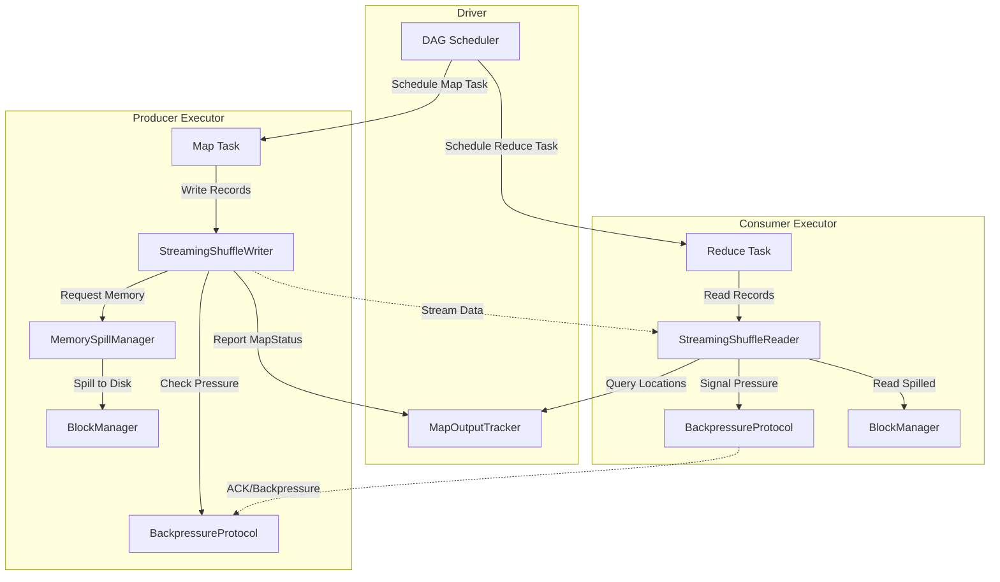
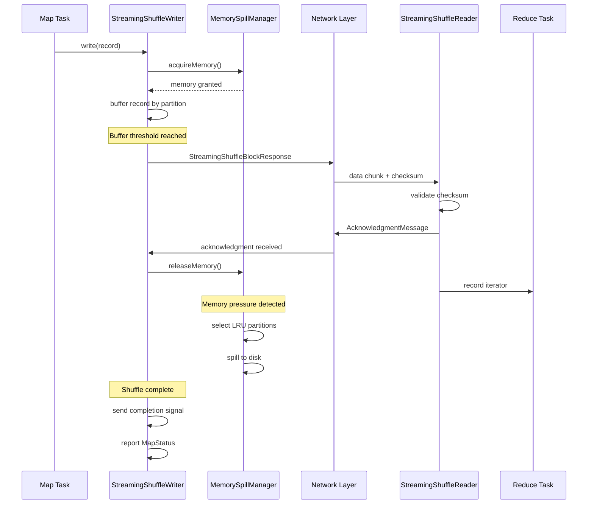
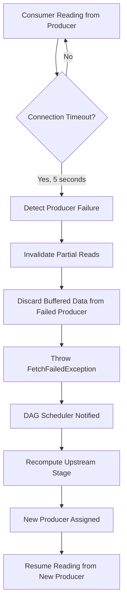
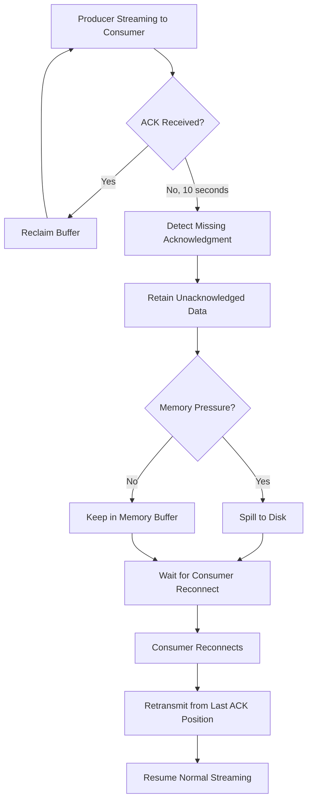
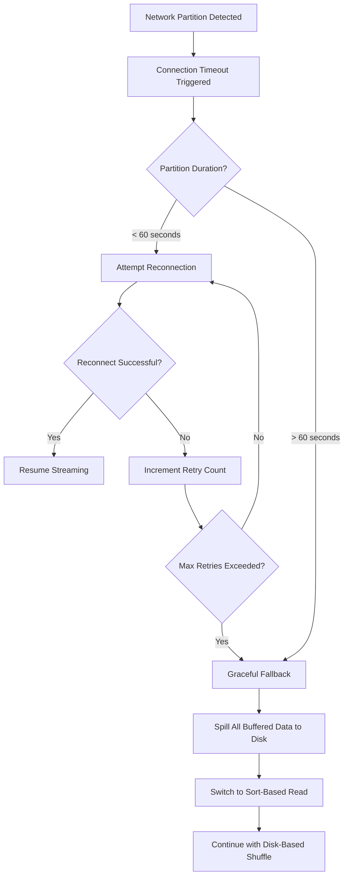
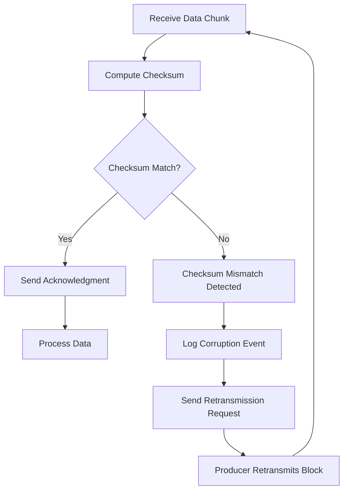

* This will become a table of contents (this text will be scraped).
{:toc}

# Overview

The streaming shuffle feature introduces an **opt-in alternative shuffle mechanism** alongside Spark's
existing sort-based shuffle. Instead of fully materializing shuffle output to disk before consumers
can read, streaming shuffle **streams data directly from map (producer) tasks to reduce (consumer)
tasks** as it becomes available, eliminating shuffle materialization latency.

## Key Benefits

- **Reduced End-to-End Latency**: Target 30-50% latency reduction for shuffle-heavy workloads
  (example: 10GB+ data, 100+ partitions) by overlapping producer writes with consumer reads
- **Improved Resource Utilization**: Consumers can begin processing data before producers complete,
  enabling better pipeline parallelism
- **Graceful Degradation**: Automatic fallback to disk-based spilling when memory pressure exceeds
  configurable thresholds (default 80%)
- **Fault Tolerance**: Zero data loss under all failure scenarios including producer crashes,
  consumer failures, and network partitions
- **Backward Compatibility**: Zero performance regression for existing workloads through automatic
  fallback and full coexistence with sort-based shuffle

## Enabling Streaming Shuffle

To enable streaming shuffle, configure both the shuffle manager and the streaming flag:


val conf = new SparkConf()
  .set("spark.shuffle.manager", "streaming")
  .set("spark.shuffle.streaming.enabled", "true")


Alternatively, when submitting an application:


spark-submit --conf spark.shuffle.manager=streaming \
             --conf spark.shuffle.streaming.enabled=true \
             your-application.jar


# Core Components

The streaming shuffle implementation consists of six core components that work together to provide
low-latency shuffle data transfer with robust failure handling.

## StreamingShuffleManager

The `StreamingShuffleManager` is the main entry point that implements the `ShuffleManager` trait.
It is responsible for:

- **Shuffle Registration**: Creating `StreamingShuffleHandle` instances for eligible shuffles and
  falling back to `BaseShuffleHandle` when streaming is not appropriate
- **Writer/Reader Factory**: Returning `StreamingShuffleWriter` or `StreamingShuffleReader` instances
  based on the handle type
- **Resource Management**: Coordinating shuffle resources and cleanup across executors
- **Eligibility Determination**: Checking whether a shuffle can use streaming mode based on
  serializer compatibility, dependency characteristics, and configuration


// Example: StreamingShuffleManager factory pattern
class StreamingShuffleManager(conf: SparkConf) extends ShuffleManager {
  override def registerShuffle[K, V, C](
      shuffleId: Int,
      dependency: ShuffleDependency[K, V, C]): ShuffleHandle = {
    if (canUseStreamingShuffle(dependency)) {
      new StreamingShuffleHandle(shuffleId, dependency)
    } else {
      new BaseShuffleHandle(shuffleId, dependency)
    }
  }
}


## StreamingShuffleWriter

The `StreamingShuffleWriter` extends `ShuffleWriter[K, V]` and handles the producer side of streaming
shuffle. Its responsibilities include:

- **Per-Partition Buffering**: Allocating memory buffers for each output partition using
  `TaskMemoryManager` and the `MemoryConsumer` interface
- **Streaming Output**: Pipelining buffered data directly to consumer executors as buffers fill
- **Backpressure Handling**: Monitoring consumer acknowledgment rates and triggering disk spill
  at the 80% memory threshold
- **Checksum Generation**: Computing block-level checksums (CRC32C) for integrity validation
- **Block Manager Integration**: Coordinating with BlockManager for disk persistence when memory
  pressure requires spilling

Buffer memory is limited to a configurable percentage of executor memory (default 20%), with
per-partition allocation calculated as:

```
partitionBufferSize = (executorMemory × bufferSizePercent) / numPartitions
```

## StreamingShuffleReader

The `StreamingShuffleReader` implements `ShuffleReader[K, C]` and handles the consumer side of
streaming shuffle. Its responsibilities include:

- **Partial Data Polling**: Requesting available data from producers before shuffle completion,
  enabling early consumption of ready partitions
- **Producer Failure Detection**: Detecting producer failures via connection timeout (default 5
  seconds) and invalidating partial reads
- **Acknowledgment Sending**: Communicating consumer position to producers to enable buffer
  reclamation
- **Checksum Validation**: Verifying block integrity on receive and requesting retransmission
  on corruption
- **Failure Recovery**: Triggering upstream recomputation via `FetchFailedException` when
  producers fail

## BackpressureProtocol

The `BackpressureProtocol` implements consumer-to-producer flow control to prevent memory
exhaustion and optimize data transfer. Its responsibilities include:

- **Heartbeat-Based Flow Control**: Maintaining connection liveness with configurable heartbeat
  interval (default 10 seconds)
- **Token-Bucket Rate Limiting**: Enforcing per-executor bandwidth caps at 80% link capacity
- **Buffer Utilization Tracking**: Monitoring buffer usage across all concurrent shuffles on
  an executor
- **Memory Arbitration**: Allocating memory to shuffles based on partition count and data volume
- **Event Logging**: Emitting backpressure events for operational visibility and debugging

## MemorySpillManager

The `MemorySpillManager` extends `MemoryConsumer` to integrate with Spark's memory management
system. Its responsibilities include:

- **Threshold Monitoring**: Tracking memory usage and triggering spill when the configured
  threshold (default 80%) is exceeded
- **LRU-Based Eviction**: Selecting the largest and least-recently-used partitions for eviction
  when memory pressure occurs
- **Disk Coordination**: Writing spilled data to disk via BlockManager with proper block ID
  management
- **Memory Accounting**: Accurately tracking acquired and released memory to prevent leaks
- **Spill Response Time**: Completing spill operations within 100ms target to maintain streaming
  performance


// Example: MemorySpillManager integration
class MemorySpillManager(taskMemoryManager: TaskMemoryManager, conf: SparkConf)
  extends MemoryConsumer(taskMemoryManager, 
    taskMemoryManager.pageSizeBytes(), MemoryMode.ON_HEAP) {
  
  private val spillThreshold = conf.get(SHUFFLE_STREAMING_SPILL_THRESHOLD) / 100.0
  
  override def spill(size: Long, trigger: MemoryConsumer): Long = {
    // Select largest partitions via LRU policy
    // Spill to disk via BlockManager
    // Return bytes freed within 100ms target
  }
}


## StreamingShuffleBlockResolver

The `StreamingShuffleBlockResolver` implements `ShuffleBlockResolver` to handle block resolution
for streaming shuffle. Its responsibilities include:

- **Block Location Tracking**: Maintaining mappings between shuffle blocks and their locations
  (in-memory buffers or spill files)
- **Streaming Block Access**: Providing access to partially-complete blocks for streaming reads
- **Spill File Management**: Managing temporary spill files and cleanup after shuffle completion
- **External Shuffle Service Compatibility**: Supporting integration with external shuffle services
  when enabled

# Streaming Protocol Specification

The streaming shuffle protocol defines how data flows between producers and consumers, the message
types used for coordination, and the integrity mechanisms that ensure reliable data transfer.

## Data Flow

The streaming shuffle data flow follows these stages:

```
1. Producer buffers records per partition in memory
2. When buffer reaches threshold, producer streams chunk to consumer
3. Consumer receives chunk and validates checksum
4. Consumer sends acknowledgment to producer
5. Producer reclaims buffer memory after acknowledgment
6. Repeat until all records are processed
7. Producer sends completion signal
8. Consumer finalizes partition read
```

This pipelined approach allows consumers to begin processing data while producers are still
writing, significantly reducing end-to-end latency compared to the traditional approach where
consumers must wait for all producers to complete.

## Protocol Messages

The streaming shuffle protocol uses four message types for coordination:

### StreamingShuffleBlockRequest

Sent from consumer to producer to request available data for a specific partition.

| Field | Type | Description |
|-------|------|-------------|
| shuffleId | int | Unique identifier for the shuffle |
| mapId | long | Map task ID (producer) |
| reduceId | int | Reduce partition ID (consumer) |
| startOffset | long | Byte offset to resume from (for retries) |
| maxBytes | long | Maximum bytes to return in response |

### StreamingShuffleBlockResponse

Sent from producer to consumer containing partition data.

| Field | Type | Description |
|-------|------|-------------|
| shuffleId | int | Unique identifier for the shuffle |
| mapId | long | Map task ID (producer) |
| reduceId | int | Reduce partition ID (consumer) |
| data | ByteBuffer | Serialized partition data |
| checksum | long | CRC32C checksum of data |
| isComplete | boolean | Whether this is the final chunk |
| totalBytes | long | Total bytes for this partition (in final chunk) |

### BackpressureSignal

Sent from consumer to producer to signal buffer pressure and control data flow.

| Field | Type | Description |
|-------|------|-------------|
| shuffleId | int | Unique identifier for the shuffle |
| executorId | String | Consumer executor identifier |
| bufferUtilization | float | Current buffer utilization (0.0-1.0) |
| requestedRate | long | Requested data rate in bytes/second |
| isPaused | boolean | Whether consumer requests pause |

### AcknowledgmentMessage

Sent from consumer to producer to confirm receipt and enable buffer reclamation.

| Field | Type | Description |
|-------|------|-------------|
| shuffleId | int | Unique identifier for the shuffle |
| mapId | long | Map task ID (producer) |
| reduceId | int | Reduce partition ID (consumer) |
| acknowledgedOffset | long | Byte offset confirmed received |
| checksumValid | boolean | Whether checksum validation passed |

## Checksum Validation

Data integrity is ensured through CRC32C checksums computed at multiple levels:

1. **Block-Level Checksums**: Each data chunk includes a CRC32C checksum computed over the
   serialized bytes
2. **Validation on Receive**: Consumers validate checksums immediately upon receiving data
3. **Retransmission on Mismatch**: If checksum validation fails, consumers request retransmission
   from the producer (data is retained until acknowledged)
4. **No Silent Corruption**: Checksum mismatches always result in explicit error handling, never
   silent data corruption

# Component Interactions

The following diagram illustrates how streaming shuffle components interact across the Driver and
Executor processes:



## Interaction Sequence

The typical streaming shuffle interaction follows this sequence:

1. **Task Scheduling**: DAG Scheduler schedules map tasks on producer executors and reduce tasks
   on consumer executors
2. **Writer Initialization**: Map task creates `StreamingShuffleWriter`, which allocates buffers
   via `MemorySpillManager`
3. **Data Writing**: Map task writes records to `StreamingShuffleWriter`, which buffers them by
   partition
4. **Location Query**: Consumer queries `MapOutputTracker` for producer locations
5. **Streaming Transfer**: As buffers fill, producer streams data to consumers
6. **Backpressure**: Consumers signal buffer utilization via `BackpressureProtocol`
7. **Acknowledgment**: Consumers acknowledge received data, enabling producer buffer reclamation
8. **Spill on Pressure**: When memory threshold is exceeded, `MemorySpillManager` spills to disk
9. **Status Reporting**: Producer reports `MapStatus` to `MapOutputTracker` upon completion
10. **Cleanup**: Resources are released after shuffle completion

## Data Flow Diagram

The following diagram shows the detailed data flow during streaming shuffle:



# Failure Handling Flows

The streaming shuffle implementation handles multiple failure scenarios while maintaining the
guarantee of zero data loss. Each failure type has a specific detection mechanism and recovery
procedure.

## Producer Failure

When a producer (map task) fails during streaming shuffle:



**Detection**: Consumer detects producer failure via connection timeout (configurable, default 5
seconds). If no data or heartbeat is received within the timeout period, the producer is
considered failed.

**Recovery Steps**:

1. **Invalidation**: All partial reads from the failed producer are immediately invalidated
2. **Buffer Discard**: Any buffered data from the failed shuffle attempt is discarded
3. **Exception Propagation**: `FetchFailedException` is thrown to notify the DAG scheduler
4. **Upstream Recomputation**: DAG scheduler triggers recomputation of the upstream stage
5. **Resume**: Consumer resumes reading from the recomputed producer

## Consumer Failure

When a consumer (reduce task) fails during streaming shuffle:



**Detection**: Producer detects consumer failure via missing acknowledgments (configurable,
default 10 seconds). If acknowledgments are not received within the timeout period, the consumer
is considered stalled or failed.

**Recovery Steps**:

1. **Buffer Retention**: Unacknowledged data is retained in producer memory
2. **Spill if Needed**: If buffer exceeds 80% threshold, data is spilled to disk
3. **Wait for Reconnect**: Producer waits for consumer reconnection
4. **Retransmit**: When consumer reconnects, producer retransmits from last acknowledged position
5. **Resume**: Normal streaming resumes after retransmission

## Network Partition

When a network partition occurs between producer and consumer:



**Detection**: Network partitions are detected through connection timeouts and failed heartbeats.

**Recovery Steps**:

1. **Reconnection Attempts**: The system attempts reconnection with exponential backoff
2. **Retry Limit**: Maximum retry attempts (configurable, default 5) before fallback
3. **Graceful Fallback**: If partition persists beyond 60 seconds or retries exhausted:
   - All buffered data is spilled to disk
   - Consumer switches to reading from disk (sort-based shuffle behavior)
   - Shuffle continues with degraded but functional performance

## Checksum Mismatch

When data corruption is detected through checksum validation:



**Detection**: Checksums are validated immediately upon receiving each data chunk.

**Recovery Steps**:

1. **Logging**: Corruption event is logged for operational visibility
2. **No Silent Corruption**: Mismatched data is never processed
3. **Retransmission Request**: Consumer requests retransmission from producer
4. **Producer Response**: Producer retransmits the block from buffer or disk
5. **Revalidation**: Consumer validates the retransmitted data

# Memory Management

The streaming shuffle integrates with Spark's existing memory management infrastructure to ensure
efficient buffer allocation while preventing out-of-memory conditions.

## Buffer Allocation Strategy

Streaming shuffle allocates memory buffers through the `TaskMemoryManager` and `MemoryConsumer`
interface, following Spark's unified memory management model:

- **Memory Pool**: Streaming shuffle buffers are allocated from the execution memory pool
- **Per-Task Tracking**: Each map task's `StreamingShuffleWriter` has an associated
  `MemorySpillManager` that extends `MemoryConsumer`
- **On-Demand Allocation**: Memory is requested as records are written, not pre-allocated
- **Cooperative Release**: When memory pressure occurs, the `MemorySpillManager.spill()` method
  is called to free memory

## Buffer Size Configuration

The total memory available for streaming shuffle buffers is controlled by
`spark.shuffle.streaming.bufferSizePercent` (default 20%, range 1-50%):

```
maxStreamingBufferMemory = executorMemory × (bufferSizePercent / 100)
```

Per-partition buffer allocation is calculated as:

```
partitionBufferSize = maxStreamingBufferMemory / numOutputPartitions
```

This ensures fair allocation across partitions while preventing any single partition from
consuming excessive memory.

## Spill Threshold Monitoring

The `MemorySpillManager` continuously monitors memory utilization and triggers spilling when
the configured threshold is exceeded:

- **Threshold**: Configurable via `spark.shuffle.streaming.spillThreshold` (default 80%, range
  50-95%)
- **Monitoring Frequency**: Memory utilization is checked after each buffer write operation
- **Proactive Spilling**: Spilling begins before OOM to ensure graceful degradation

When memory utilization exceeds the threshold:


if (currentUtilization > spillThreshold) {
  // Select partitions for eviction using LRU policy
  val partitionsToSpill = selectLRUPartitions(targetBytesToFree)
  
  // Spill selected partitions to disk
  for (partition <- partitionsToSpill) {
    spillPartitionToDisk(partition)
    releasedBytes += partition.size
  }
}


## LRU-Based Partition Eviction

When spilling is required, the `MemorySpillManager` selects partitions for eviction based on:

1. **Size**: Larger partitions are preferred to free more memory with fewer spill operations
2. **Access Time**: Least-recently-accessed partitions are preferred (LRU policy)
3. **Acknowledgment Status**: Partitions with acknowledged data are preferred since they can
   be safely discarded rather than spilled

The eviction algorithm balances these factors to minimize:
- Spill I/O overhead
- Consumer read latency
- Memory fragmentation

## Integration with Spark Memory Model

Streaming shuffle memory management integrates with Spark's existing memory infrastructure:

| Component | Integration Point |
|-----------|-------------------|
| TaskMemoryManager | Per-task memory coordination and spill triggering |
| ExecutionMemoryPool | Buffer allocation from execution memory |
| MemoryConsumer | Base class for memory tracking and spill callbacks |
| BlockManager | Disk spill coordination and block storage |
| DiskBlockManager | Temporary spill file management |

This integration ensures that streaming shuffle:
- Respects Spark's memory fraction configuration
- Cooperates with other memory consumers (sorts, aggregations, caches)
- Does not require separate memory configuration beyond streaming-specific parameters

# Automatic Fallback Conditions

The streaming shuffle automatically falls back to sort-based shuffle behavior under certain
conditions to ensure stability and prevent performance degradation. Fallback is designed to be
transparent to the application.

## Fallback Triggers

| Condition | Threshold | Detection | Action |
|-----------|-----------|-----------|--------|
| Consumer Slowdown | 2× slower than producer for >60 seconds | Backpressure monitoring | Spill to disk, switch to sort-based read |
| Memory Pressure | Unable to allocate buffer | Memory allocation failure | Use sort-based write path |
| Network Saturation | >90% link capacity | Bandwidth monitoring | Reduce streaming rate or fallback |
| Version Mismatch | Producer/consumer incompatible | Protocol handshake | Use sort-based shuffle |
| Serializer Incompatibility | Non-relocatable serializer | Registration check | Use sort-based shuffle |

## Consumer Slowdown Fallback

When a consumer processes data significantly slower than the producer generates it:

1. **Detection**: Backpressure signals indicate consumer is processing at less than 50% of
   producer rate
2. **Grace Period**: Condition must persist for more than 60 seconds
3. **Action**: Producer transitions to disk-based buffering, consumer reads from disk
4. **Logging**: Fallback event is logged with metrics for debugging

## Memory Pressure Fallback

When memory allocation fails:

1. **Detection**: `MemorySpillManager.acquireMemory()` returns insufficient memory
2. **Immediate Response**: Current batch is written using sort-based path
3. **Future Batches**: Subsequent batches attempt streaming again
4. **Persistent Pressure**: If failures persist, shuffle degrades to sort-based mode

## Network Saturation Fallback

When network bandwidth is exhausted:

1. **Detection**: Measured throughput indicates >90% link utilization
2. **Rate Limiting**: Streaming rate is reduced via backpressure
3. **Fallback**: If rate limiting is insufficient, fallback to disk-based transfer
4. **Recovery**: Streaming can resume when network pressure reduces

## Version Mismatch Handling

When producer and consumer use incompatible protocol versions:

1. **Detection**: Protocol handshake includes version exchange
2. **Compatibility Check**: Versions are compared during shuffle registration
3. **Action**: Incompatible pairs use sort-based shuffle
4. **Logging**: Version mismatch is logged for cluster management

# Coexistence with Sort Shuffle

The streaming shuffle is designed to coexist with Spark's existing sort-based shuffle without
any modifications to the sort shuffle code path.

## Shuffle Manager Selection

Spark selects the shuffle manager based on configuration:

| Configuration | Result |
|---------------|--------|
| `spark.shuffle.manager=sort` (default) | Use SortShuffleManager |
| `spark.shuffle.manager=streaming` | Use StreamingShuffleManager |

When `StreamingShuffleManager` is selected, it can still delegate to sort-based behavior for
individual shuffles that are ineligible for streaming.

## Handle-Based Routing

The `StreamingShuffleManager` uses different handle types to route shuffle operations:


def registerShuffle[K, V, C](
    shuffleId: Int,
    dependency: ShuffleDependency[K, V, C]): ShuffleHandle = {
  if (conf.get(SHUFFLE_STREAMING_ENABLED) && canUseStreamingShuffle(dependency)) {
    // Streaming path
    new StreamingShuffleHandle(shuffleId, dependency)
  } else {
    // Sort-based fallback
    new BaseShuffleHandle(shuffleId, dependency)
  }
}

def getWriter[K, V](
    handle: ShuffleHandle,
    mapId: Long,
    context: TaskContext,
    metrics: ShuffleWriteMetricsReporter): ShuffleWriter[K, V] = {
  handle match {
    case h: StreamingShuffleHandle[K, V, _] =>
      new StreamingShuffleWriter(h, mapId, context, metrics)
    case h: BaseShuffleHandle[K, V, _] =>
      // Delegate to sort-based writer
      new SortShuffleWriter(h, mapId, context, metrics)
  }
}


## Eligibility Criteria

A shuffle is eligible for streaming mode when all conditions are met:

1. **Configuration Enabled**: `spark.shuffle.streaming.enabled=true`
2. **Serializer Compatible**: Serializer supports relocation (most serializers do)
3. **Sufficient Memory**: Executor has adequate memory for buffer allocation
4. **No Aggregation in Map Side**: Map-side combine is not enabled (or uses compatible combiner)

## Zero Modification Guarantee

The streaming shuffle implementation maintains strict isolation from sort shuffle code:

- **Separate Package**: All streaming shuffle code resides in
  `org.apache.spark.shuffle.streaming`
- **No Sort Shuffle Changes**: Zero modifications to `SortShuffleManager`,
  `SortShuffleWriter`, or related classes
- **Interface Compliance**: All streaming components implement existing Spark interfaces
- **Independent Testing**: Streaming shuffle has dedicated test suites without affecting
  sort shuffle tests

This design ensures that:
- Sort shuffle remains production-stable as fallback
- Streaming shuffle bugs cannot affect sort shuffle behavior
- Users can safely enable/disable streaming shuffle without risk

# Related Documentation

- [Streaming Shuffle Tuning Guide](streaming-shuffle-tuning.html) - Performance optimization
  recommendations
- [Streaming Shuffle Troubleshooting](streaming-shuffle-troubleshooting.html) - Common issues
  and debugging procedures
- [Spark Configuration](configuration.html) - Complete configuration reference including
  streaming shuffle parameters
- [Tuning Spark](tuning.html) - General Spark tuning guide
- [Job Scheduling](job-scheduling.html) - Spark job and resource scheduling
