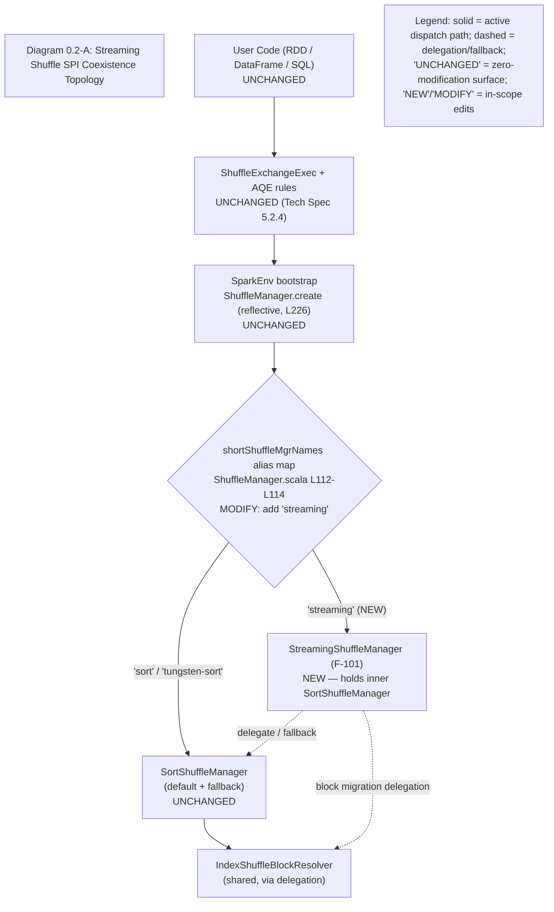
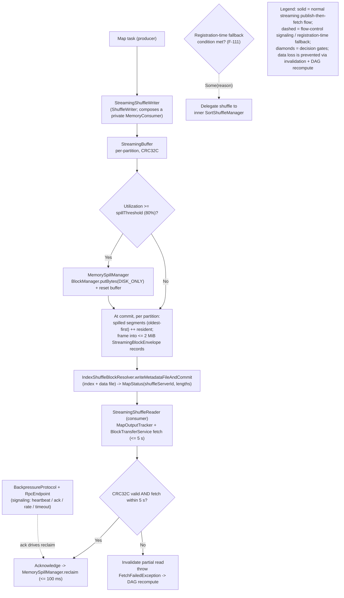

* Table of contents
{:toc}

Streaming Shuffle is an **opt-in, pluggable** shuffle subsystem whose goal is to move shuffle
data from producer (map) tasks to consumer (reduce) tasks through bounded in-memory buffers
governed by a backpressure protocol, minimizing the write-to-disk-then-fetch materialization
cost of the default sort-based shuffle. In its v1 form (detailed in [Overview](#overview) and the
[Producer-to-Consumer Data Flow](#producer-to-consumer-data-flow)), the producer holds output in
those buffers — spilling to disk only under memory pressure — and, at task commit, **frames and
publishes** each partition to a single shuffle file through the shared `IndexShuffleBlockResolver`;
the consumer then fetches that published output over Spark's existing map-output path
(`MapOutputTracker` + `BlockTransferService`). It targets a **30–50% end-to-end latency
reduction** for shuffle-heavy workloads, with **zero regression** and **zero data loss**
guaranteed by automatic graceful degradation back to the sort-based shuffle. The feature is
delivered as a new `ShuffleManager` Service Provider Interface (SPI) implementation that
**coexists with — and never replaces —** the default `SortShuffleManager`. For
instructions on enabling it, see the [Streaming Shuffle Guide](streaming-shuffle-guide.html); for
tuning, see [Streaming Shuffle Tuning](streaming-shuffle-tuning.html); for day-to-day operations,
see [Streaming Shuffle Troubleshooting](streaming-shuffle-troubleshooting.html).

## Overview

In the default sort-based shuffle, each map task sorts and **materializes its output to local
disk**, and only then can reduce tasks fetch it over the network. This write-then-fetch sequence
is a hard materialization barrier: the entire map stage must finish writing before the reduce
stage can begin reading, which adds latency that dominates short, shuffle-heavy stages.

Streaming Shuffle attacks that barrier. Instead of sorting and spilling every record to disk as
it is produced, the producer accumulates output in **per-partition in-memory buffers**, using
**backpressure-based flow control** to keep fast producers from overwhelming slower consumers, and
spills to disk **only under memory pressure** rather than on every shuffle. At task commit it
frames each partition's buffered (and any spilled) bytes into self-describing envelopes and
**publishes them to a single shuffle file through the shared `IndexShuffleBlockResolver`**, so the
output is fetchable over Spark's standard map-output path. The reduce side then fetches those
published blocks through `MapOutputTracker` and `BlockTransferService` — exactly as the sort path
does — rather than receiving a live socket stream: the dedicated network data-plane is deferred,
and the v1 transport (`StreamingShuffleTransport`) is a **logging-only stub**. By default, these
buffers are capped at 20% of executor memory in aggregate and begin spilling to disk at 80%
utilization.

The subsystem is strictly **opt-in** and is gated by a **dual-flag activation contract**. It
engages only when **both** of the following are set:

* `spark.shuffle.manager=streaming` — selects the streaming manager, and
* `spark.shuffle.streaming.enabled=true` — turns the streaming data path on (default `false`).

If either flag is unset, Spark behaves exactly as before: `spark.shuffle.manager` retains its
default of `sort`, and the sort-based shuffle remains the active path. A minimal opt-in looks like
this:

```bash
# Opt in to streaming shuffle. BOTH flags are required; the default is still "sort".
spark-submit \
  --conf spark.shuffle.manager=streaming \
  --conf spark.shuffle.streaming.enabled=true \
  ...
```

The streaming-specific configuration keys are summarized below; full tuning guidance lives in the
[Streaming Shuffle Tuning](streaming-shuffle-tuning.html) page and the
[Spark Configuration — Shuffle Behavior](configuration.html#shuffle-behavior) reference.

<table class="spark-config">
<thead><tr><th>Property Name</th><th>Default</th><th>Meaning</th><th>Since Version</th></tr></thead>
<tr>
  <td><code>spark.shuffle.streaming.enabled</code></td>
  <td>false</td>
  <td>
    Opt-in master switch for the streaming data path. Must be <code>true</code> <em>and</em>
    <code>spark.shuffle.manager</code> must be set to <code>streaming</code> for streaming shuffle
    to engage. When <code>false</code>, behavior is identical to the default sort-based shuffle.
  </td>
  <td>4.2.0</td>
</tr>
<tr>
  <td><code>spark.shuffle.streaming.bufferSizePercent</code></td>
  <td>20</td>
  <td>
    Per-executor in-memory buffer budget expressed as a percentage of executor memory
    (valid range 1–50).
  </td>
  <td>4.2.0</td>
</tr>
<tr>
  <td><code>spark.shuffle.streaming.spillThreshold</code></td>
  <td>80</td>
  <td>
    Buffer-utilization percentage at which the largest partitions are spilled to disk
    (valid range 50–95).
  </td>
  <td>4.2.0</td>
</tr>
<tr>
  <td><code>spark.shuffle.streaming.maxBandwidthMBps</code></td>
  <td>0 (unlimited)</td>
  <td>
    Per-executor streaming rate limit in MB/s; <code>0</code> means unlimited. The effective rate
    is capped at 80% of this value to leave headroom for control traffic.
  </td>
  <td>4.2.0</td>
</tr>
<tr>
  <td><code>spark.shuffle.streaming.debug</code></td>
  <td>false</td>
  <td>
    Enables verbose streaming-shuffle debug logging.
  </td>
  <td>4.2.0</td>
</tr>
</table>

## SPI Coexistence

Spark selects a `ShuffleManager` implementation through the `spark.shuffle.manager` short-name
alias map. That map now resolves `"streaming"` to the streaming manager alongside the existing
`"sort"` and `"tungsten-sort"` aliases. The selected manager is **instantiated reflectively during
`SparkEnv` bootstrap**, so introducing the new alias requires **no scheduler or bootstrap changes**.

`StreamingShuffleManager` holds an inner `SortShuffleManager` **by composition** and delegates to
it for two purposes: as the automatic **fallback** path when streaming cannot proceed safely, and
for **block migration** during decommissioning. Both managers share the same
`IndexShuffleBlockResolver`, so migration and recovery behave identically regardless of which
manager is active.

The change is additive at the SPI boundary only. The following surfaces form a strict
**zero-modification boundary** and remain **unchanged**:

* user-facing RDD / DataFrame / Dataset APIs,
* the DAG scheduler,
* task scheduling and the task lifecycle,
* lineage tracking and fault recovery,
* `ShuffleExchangeExec`, and
* all Adaptive Query Execution (AQE) rules.

**Diagram 0.2-A — Streaming Shuffle SPI Coexistence Topology** below shows how the new manager
plugs into the unchanged dispatch boundary and coexists with the sort path. It mirrors the
canonical, rendered diagram in the companion TechDocs
([`blitzy-docs/streaming-shuffle/architecture.md`](https://github.com/apache/spark/blob/master/blitzy-docs/streaming-shuffle/architecture.md)).


```mermaid
flowchart TB
    title["Diagram 0.2-A: Streaming Shuffle SPI Coexistence Topology"]
    UserCode["User Code (RDD / DataFrame / SQL)<br/>UNCHANGED"]
    Exchange["ShuffleExchangeExec + AQE rules<br/>UNCHANGED (Tech Spec 5.2.4)"]
    SparkEnvBoot["SparkEnv bootstrap<br/>ShuffleManager.create (reflective, L226)<br/>UNCHANGED"]
    Factory{"shortShuffleMgrNames alias map<br/>ShuffleManager.scala L112-L114<br/>MODIFY: add 'streaming'"}
    Sort["SortShuffleManager<br/>(default + fallback)<br/>UNCHANGED"]
    Streaming["StreamingShuffleManager (F-101)<br/>NEW — holds inner SortShuffleManager"]
    SharedResolver["IndexShuffleBlockResolver<br/>(shared, via delegation)"]
    UserCode --> Exchange --> SparkEnvBoot --> Factory
    Factory -->|"'sort' / 'tungsten-sort'"| Sort
    Factory -->|"'streaming' (NEW)"| Streaming
    Streaming -. "delegate / fallback" .-> Sort
    Streaming -. "block migration delegation" .-> SharedResolver
    Sort --> SharedResolver
    legend["Legend: solid = active dispatch path; dashed = delegation/fallback;<br/>'UNCHANGED' = zero-modification surface; 'NEW'/'MODIFY' = in-scope edits"]
```

The solid edges are the active dispatch path: `"sort"` / `"tungsten-sort"` resolve to the unchanged
`SortShuffleManager`, while the new `"streaming"` alias resolves to `StreamingShuffleManager`. The
dashed edges show that the streaming manager delegates to — and falls back to — the inner
`SortShuffleManager`, and delegates block-migration calls to the shared `IndexShuffleBlockResolver`.

## Core Components

The streaming subsystem is isolated in a dedicated package and is composed of the following
classes. Names are given exactly as they appear in the implementation.

| Component | Responsibility |
|-----------|----------------|
| `StreamingShuffleManager` | SPI entry point; performs dispatch and lifecycle management; composes an inner `SortShuffleManager` for delegation and fallback; registers metrics; performs an ordered shutdown (Backpressure → Spill → inner Sort). |
| `StreamingShuffleHandle` | A `BaseShuffleHandle` subtype that carries the tuning values (`bufferSizePercent`, `spillThreshold`, `maxBandwidthMBps`); acts as the dispatch discriminator that distinguishes the streaming path from the sort path. |
| `StreamingShuffleWriter` | Producer-side writer that **implements `ShuffleWriter`** and **composes a private `MemoryConsumer`** for execution-memory accounting; maintains the per-partition in-memory buffers; spills at the configured threshold; generates CRC32C checksums; and, at task commit, frames each partition into `StreamingBlockEnvelope` records and **publishes them through the shared `IndexShuffleBlockResolver`** so the output is fetchable over the standard map-output path. |
| `StreamingShuffleReader` | Consumer-side reader; mirrors the existing `BlockStoreShuffleReader` read flow (honoring the aggregator, key ordering, and map-side combine); **fetches the published shuffle blocks through `MapOutputTracker` and `BlockTransferService`** and decodes the `StreamingBlockEnvelope` frames; validates a CRC32C per block and re-fetches a corrupt block (bounded retransmission) within the producer deadline; on a persistent checksum mismatch, a structural decode error, or a 5 s producer timeout it invalidates partial reads and throws `FetchFailedException` to trigger recomputation. |
| `StreamingShuffleBlockResolver` | Maintains a 3-level block index; implements `MigratableResolver` by delegating to the shared `IndexShuffleBlockResolver`, preserving block-migration and decommission behavior. |
| `StreamingBuffer` | Per-partition buffer (a byte-array output stream) with CRC32C, LRU tracking, and atomic counters. |
| `BackpressureProtocol` | Consumer-to-producer token-bucket plus heartbeat flow control; performs a monotonic acknowledgment merge. |
| `BackpressureRpcEndpoint` | A `ThreadSafeRpcEndpoint` (executor-only; it refuses to register on the driver) that carries heartbeat, acknowledgment, rate, and timeout messages across executors. |
| `MemorySpillManager` | Polls buffer utilization every 100 ms; spills the largest partitions to disk (LRU) at the threshold via `BlockManager.putBytes(..., DISK_ONLY)`; reclaims buffers within 100 ms of acknowledgment; tracks metrics. |
| `TokenBucketRateLimiter` | Wraps the Guava `RateLimiter` (1 permit = 1 byte); caps throughput at 80% of link capacity. |
| `StreamingShuffleFallbackPolicy` | Evaluates the four automatic fallback conditions. |
| `StreamingShuffleMetrics` / `StreamingShuffleSource` | The four metrics under the `shuffle.streaming.` namespace, registered with the existing `MetricsSystem` through a `Source` named `streamingShuffle`. |
| `StreamingShuffleConfig` | Typed configuration accessors, range validation, and the effective-bandwidth (80% factor) computation. |
| `StreamingShuffleTransport` | A v1 **logging-only stub** that reuses the executor's existing `BlockTransferService`; the full Netty data-plane transport is deferred beyond v1. |
| `StreamingBlockEnvelope` | The self-describing wire envelope: a 32-byte big-endian header plus a payload ≤ 2 MiB, protected by CRC32C. |

## Producer-to-Consumer Data Flow

At run time, a map task hands its records to the `StreamingShuffleWriter`, which appends them to
the appropriate per-partition `StreamingBuffer`. The writer composes a private `MemoryConsumer`
so the buffers participate in Spark's cooperative execution-memory accounting. While buffer
utilization stays below the spill threshold (80%), records simply accumulate in memory; when
utilization reaches the threshold, the `MemorySpillManager` spills the largest partitions to disk
(`DISK_ONLY`) and resets those buffers to release heap. **At task commit**, the writer assembles
each partition's bytes (spilled segments oldest-first, then the resident buffer), frames them into
`StreamingBlockEnvelope` records (≤ 2 MiB each, CRC32C-protected), and **publishes them to a single
shuffle file through `IndexShuffleBlockResolver.writeMetadataFileAndCommit`** — producing a
`MapStatus` exactly as the sort path does. Because the v1 network transport is a logging-only stub,
the consumer does not receive a live socket stream; instead the `StreamingShuffleReader` **fetches
the published blocks through `MapOutputTracker` and `BlockTransferService`** and decodes the
envelopes frame-by-frame. The reader validates each block's CRC32C; a corrupt block is re-fetched
(bounded retransmission) within the producer deadline, and a valid block is acknowledged, which
drives reclamation of the producer-side buffer. A persistent checksum mismatch, a structural
decode error, or an exceeded 5 s producer timeout invalidates the partial read and raises
`FetchFailedException`, which the existing DAG scheduler resolves by recomputing the upstream
stage. The `BackpressureProtocol` runs **alongside** this path as a flow-control signaling channel
(heartbeat / ack / rate / timeout over the executor-only `BackpressureRpcEndpoint`) rather than as
a gate every block traverses, and automatic fallback to the inner `SortShuffleManager` is decided
**when the shuffle is registered** (not mid-stream).

**Diagram 0.5-A — Streaming Shuffle Producer-to-Consumer Data Flow** below traces this path,
including the spill, publication, and fallback branches. It mirrors the canonical, rendered diagram
in the companion TechDocs
([`blitzy-docs/streaming-shuffle/architecture.md`](https://github.com/apache/spark/blob/master/blitzy-docs/streaming-shuffle/architecture.md)).


```mermaid
flowchart TD
    Map["Map task (producer)"] --> Writer["StreamingShuffleWriter<br/>(ShuffleWriter; composes a private MemoryConsumer)"]
    Writer --> Buffer["StreamingBuffer<br/>per-partition, CRC32C"]
    Buffer --> Util{"Utilization >= spillThreshold (80%)?"}
    Util -->|"Yes"| Spill["MemorySpillManager<br/>BlockManager.putBytes(DISK_ONLY) + reset buffer"]
    Util -->|"No"| Commit
    Spill --> Commit["At commit, per partition:<br/>spilled segments (oldest-first) ++ resident;<br/>frame into <= 2 MiB StreamingBlockEnvelope records"]
    Commit --> Publish["IndexShuffleBlockResolver.writeMetadataFileAndCommit<br/>(index + data file) -> MapStatus(shuffleServerId, lengths)"]
    Publish --> Fetch["StreamingShuffleReader (consumer)<br/>MapOutputTracker + BlockTransferService fetch (<= 5 s)"]
    Fetch --> Validate{"CRC32C valid AND fetch within 5 s?"}
    Validate -->|"Yes"| Ack["Acknowledge -> MemorySpillManager.reclaim (<= 100 ms)"]
    Validate -->|"No"| Invalidate["Invalidate partial read<br/>throw FetchFailedException -> DAG recompute"]
    BPGate["BackpressureProtocol + RpcEndpoint<br/>(signaling: heartbeat / ack / rate / timeout)"] -. "ack drives reclaim" .-> Ack
    Reg{"Registration-time fallback<br/>condition met? (F-111)"} -. "Some(reason)" .-> Fallback["Delegate shuffle to<br/>inner SortShuffleManager"]
    legendNode["Legend: solid = normal streaming publish-then-fetch flow;<br/>dashed = flow-control signaling / registration-time fallback;<br/>diamonds = decision gates; data loss is prevented via invalidation + DAG recompute"]
```

The per-partition buffer budget is derived from the executor memory and the configured buffer
percentage, divided evenly across the shuffle's partitions:

```text
perPartitionBudget = (executorMemory × bufferSizePercent / 100) / numPartitions
```

Output is framed at a 2 MB block size, so each partition's budget bounds how much resident data it
may hold in memory before the spill manager offloads it to disk.

## Wire Format

On-the-wire blocks are framed by the `StreamingBlockEnvelope`. Each envelope consists of a
**32-byte big-endian header** followed by a **payload of at most 2 MiB (≤ 2 MiB)**. The payload is protected
by a **CRC32C** checksum that the reader validates on a per-block basis. If the computed checksum
does not match the header, the block is treated as corrupt and **retransmitted**; a persistent
mismatch escalates to partial-read invalidation and recomputation (see
[Fault Tolerance and Zero Data Loss](#fault-tolerance-and-zero-data-loss)).

## Flow Control and Memory Management

Flow control and memory pressure are handled by two cooperating mechanisms.

**Backpressure.** The `BackpressureProtocol` applies token-bucket rate limiting that is capped at
**80% of link capacity**, leaving headroom for control traffic. Consumers emit a **5 s heartbeat**
liveness signal back to producers, and the protocol continuously monitors buffer-utilization
thresholds, performs priority arbitration across competing partitions, and emits telemetry for the
metrics described in [Observability](#observability).

**Memory management.** The `MemorySpillManager` **polls buffer utilization every 100 ms**. When
utilization reaches the **80% threshold**, it spills the **largest partitions** to disk in
**LRU** order via `BlockManager.putBytes(..., DISK_ONLY)`. Once a block has been acknowledged by
the consumer, the corresponding buffer is **reclaimed within 100 ms**, returning memory to the
executor for subsequent partitions.

## Fault Tolerance and Zero Data Loss

Streaming Shuffle is designed so that **no failure scenario can lose data**. Each failure mode maps
to a clean recovery that defers to Spark's existing mechanisms.

* **Producer failure** — detected on a **5 s connection timeout**. Any partial reads in flight
  are invalidated and a `FetchFailedException` is thrown, after which the **existing** DAG scheduler
  recomputes the upstream stage. No scheduler modification is involved.
* **Checksum mismatch** — the affected block is **retransmitted**. A persistent failure
  escalates to partial-read invalidation and recomputation, just like a producer failure.
* **Consumer failure** — detected via **missing acknowledgments over a 10 s window**, after
  which the producer-side buffers are reclaimed.

The resulting invariant is **zero data loss under all failure scenarios**: every failure path
either retransmits cleanly or invalidates the partial read and defers to Spark's existing
recomputation, never leaving a partially consumed result in place.

## Coexistence and Automatic Fallback

Streaming Shuffle never displaces the sort-based shuffle; it falls back to it automatically when
streaming cannot proceed safely. The `StreamingShuffleFallbackPolicy` reverts to the inner
`SortShuffleManager` when **any** of the following four conditions holds:

1. The consumer is sustained **2× slower** than the producer for **more than 60 s**.
2. **Memory pressure** prevents buffer allocation (OOM risk).
3. **Network saturation** exceeds **90% of link capacity**.
4. There is a **producer/consumer version mismatch**.

On any of these conditions, the subsystem reverts to the inner `SortShuffleManager` automatically
and transparently, preserving correctness with no user action required. Operational detail on
diagnosing and responding to fallbacks lives in the
[Streaming Shuffle Troubleshooting](streaming-shuffle-troubleshooting.html) page.

## Observability

Streaming Shuffle emits four metrics under the `shuffle.streaming.` namespace. They are registered
through the existing `MetricsSystem` via a `Source` named `streamingShuffle`, and are therefore
surfaced through the existing **JMX**, **Prometheus**, **CSV**, and **SLF4J** sinks without any new
endpoint.

| Metric | Type | Meaning |
|--------|------|---------|
| `bufferUtilizationPercent` | Gauge | Current buffer fill level, as a percentage. |
| `spillCount` | Counter | Number of disk spill events. |
| `backpressureEvents` | Counter | Number of backpressure activations. |
| `partialReadInvalidations` | Counter | Number of partial reads invalidated on producer failure. |

These metrics integrate with the broader Spark telemetry surfaces: see
[Monitoring and Instrumentation](monitoring.html) for the metrics system and sinks, and the
Stages tab in the [Web UI](web-ui.html#stages-tab) for native shuffle read/write/spill columns.
Full metric-by-metric interpretation and alerting guidance live in the
[Streaming Shuffle Troubleshooting](streaming-shuffle-troubleshooting.html) page.

## Related Documentation

* [Streaming Shuffle Guide](streaming-shuffle-guide.html)
* [Streaming Shuffle Tuning](streaming-shuffle-tuning.html)
* [Streaming Shuffle Troubleshooting](streaming-shuffle-troubleshooting.html)
* [Spark Configuration](configuration.html#shuffle-behavior)
* [Monitoring and Instrumentation](monitoring.html)
* [Web UI](web-ui.html)
* [RDD Programming Guide — Shuffle operations](rdd-programming-guide.html#shuffle-operations)
