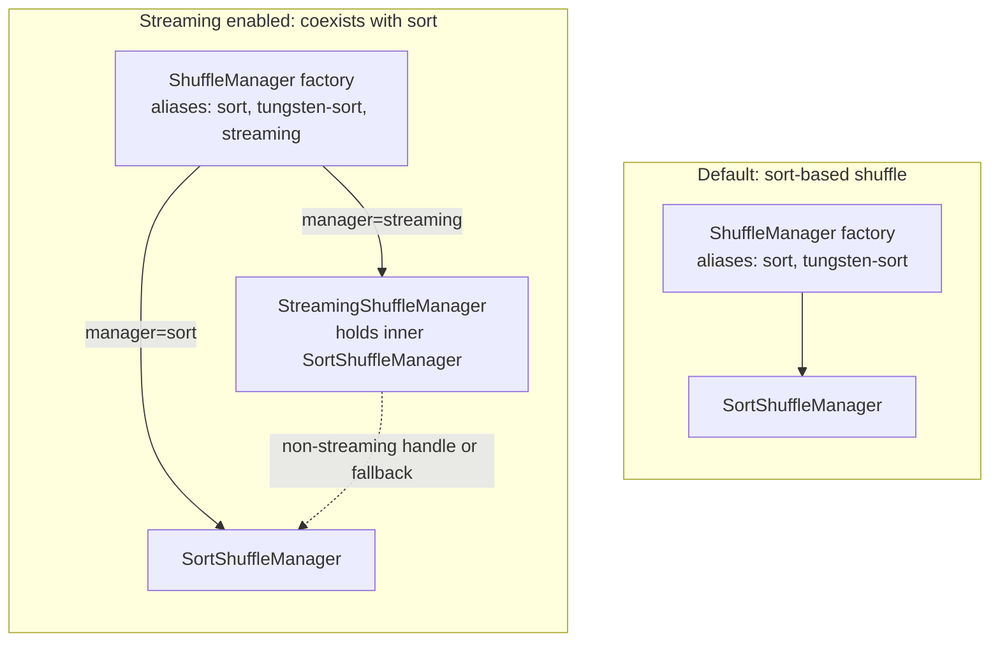
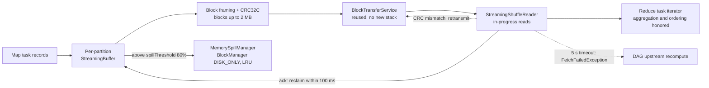

* This will become a table of contents (this text will be scraped).
{:toc}

# Overview

Streaming shuffle is an **opt-in** shuffle backend that pipelines map-output data directly from
producer (map) executors to consumer (reduce) executors through **bounded in-memory buffers governed
by a backpressure protocol**, instead of first materializing shuffle files to local disk. By
overlapping the production and consumption of shuffle data, it removes the shuffle write/read round
trip from the common path and thereby eliminates shuffle-materialization latency for shuffle-heavy
workloads.

Streaming shuffle **coexists with** the default sort-based shuffle (`SortShuffleManager`), which
remains the production-stable default and the automatic fallback. Enabling streaming shuffle never
removes or alters the sort path: whenever streaming is not enabled, or whenever a fallback condition
is detected at runtime, Spark transparently uses sort-based shuffle. There is no behavior change
unless you explicitly opt in.

The design targets the benefits below. These are **goals, not guarantees** — realized improvement
depends on data volume, partition count, cluster hardware, and network conditions:

* **30&ndash;50% end-to-end latency reduction** for shuffle-heavy workloads (100&nbsp;MB+ of shuffle
  data across 10 or more partitions).
* **5&ndash;10% improvement** for CPU-bound workloads, primarily from reduced scheduler overhead.
* **Zero regression** for memory-bound workloads, guaranteed by automatic fallback to the sort path.
* **Zero data loss** under producer, consumer, and network failures, preserved by Spark's existing
  fault-recovery model.

To enable and operate the feature, see the [Streaming Shuffle Guide](streaming-shuffle-guide.html).
For the full list of properties, see the
[Shuffle Behavior](configuration.html#shuffle-behavior) configuration table.

# Design goals and constraints

The streaming shuffle backend is built to the following principles, which shape every design
decision described on this page:

* **Isolation / zero cross-contamination.** All streaming logic lives in a dedicated package,
  `org.apache.spark.shuffle.streaming` (with a `network` subpackage). No streaming code is injected
  into the existing shuffle code paths; the sort path is untouched apart from a single
  manager-registration alias that makes the `streaming` short name resolvable.
* **Composition-based coexistence and fallback.** The streaming manager holds an inner
  `SortShuffleManager` instance and delegates all non-streaming handles and all fallback cases to it.
  Sort-based shuffle remains the production-stable default, which is what makes zero regression
  achievable.
* **Least modification.** The backend reuses Spark's existing subsystems rather than redesigning
  them: the executor memory manager (through `MemoryConsumer`), `BlockManager` and
  `BlockTransferService`, `MapOutputTracker`, the `MetricsSystem`, and the RPC layer. It adds no new
  transport stack and does not change the executor memory model.

# Pluggable ShuffleManager SPI integration

Streaming shuffle is a `ShuffleManager` implementation selected through Spark's existing shuffle SPI.
Set:

```
spark.shuffle.manager=streaming
```

Spark resolves the `streaming` short name through the same `ShuffleManager` factory that already
resolves `sort` and `tungsten-sort`, so **no bootstrap or `SparkEnv` change is required** —
registering the alias is sufficient to wire the new manager. The manager is constructed by the
unchanged `SparkEnv` initialization path and receives the standard `(SparkConf, isDriver)`
constructor arguments that the SPI requires.

The feature is active only under a **dual activation gate**: it is active **if and only if both** of
the following are set:

* `spark.shuffle.manager=streaming`
* `spark.shuffle.streaming.enabled=true` (default `false`)

If only one of the two is set, Spark silently uses the standard sort-based shuffle — there is no
error and no streaming. Requiring both properties is a deliberate, defense-in-depth opt-in that
prevents streaming shuffle from being enabled by accident (for example, by setting the manager alias
alone, or by flipping the `enabled` flag while another shuffle manager is in effect). See the
[Streaming Shuffle Guide](streaming-shuffle-guide.html#enabling-streaming-shuffle) for command-line
and `spark-defaults.conf` examples, and the
[Shuffle Behavior](configuration.html#shuffle-behavior) table for the full configuration contract.

Configuration is **immutable for the lifetime of the application**. There is no dynamic
reconfiguration in this version: every `spark.shuffle.streaming.*` property is read once at executor
startup, so changing any streaming-shuffle setting requires an **executor restart** (start a new
application, or restart the executors).

# Composition-based coexistence with sort shuffle

`StreamingShuffleManager` guarantees zero regression by **pattern-matching on the shuffle handle
type**. When a shuffle is registered:

* If the shuffle is eligible for streaming, `registerShuffle` returns a streaming handle
  (`StreamingShuffleHandle`) that carries the per-shuffle resource envelope — buffer-size percent,
  spill threshold, and bandwidth limit.
* Otherwise it returns a base (sort) handle.

On the read and write paths, the manager inspects the handle: a streaming handle dispatches to the
streaming writer and reader; any other handle — or any triggered fallback condition — is delegated to
the inner `SortShuffleManager`. Because the sort path is invoked unmodified through composition,
non-streaming shuffles and fallbacks behave exactly as they do today. This composition strategy, not
subclassing or forking the sort path, is what allows streaming shuffle to coexist with sort-based
shuffle without touching its internals.

# Shuffle manager selection: before and after

The diagram below contrasts manager selection before and after enabling streaming shuffle. Enabling
streaming adds a new dispatch target alongside sort; it does not replace or modify the sort path.


```mermaid
flowchart TB
    subgraph BEFORE["Default: sort-based shuffle"]
        direction TB
        F1["ShuffleManager factory<br/>aliases: sort, tungsten-sort"]
        S1["SortShuffleManager"]
        F1 --> S1
    end
    subgraph AFTER["Streaming enabled: coexists with sort"]
        direction TB
        F2["ShuffleManager factory<br/>aliases: sort, tungsten-sort, streaming"]
        SS["StreamingShuffleManager<br/>holds inner SortShuffleManager"]
        S2["SortShuffleManager"]
        F2 -->|"manager=sort"| S2
        F2 -->|"manager=streaming"| SS
        SS -.->|"non-streaming handle or fallback"| S2
    end
```

*Figure 1: Shuffle manager selection, before vs. after enabling streaming. Legend: solid arrow = active
dispatch path; dashed arrow = composition-based fallback delegation to the sort path.*

# Producer &rarr; consumer data flow

The streaming data path moves records from map tasks to reduce tasks without a disk round trip:

1. **Buffer.** Map-task records are serialized into a **per-partition in-memory buffer**. Each buffer
   is sized approximately as `(executorMemory × bufferSizePercent / 100) / numPartitions`, with a
   2&nbsp;MB floor per partition. `spark.shuffle.streaming.bufferSizePercent` defaults to `20` and is
   configurable in the range `[1, 50]`.
2. **Frame.** Buffered data is framed into blocks of **at most 2&nbsp;MB** for pipelining efficiency.
   Each block carries a **CRC32C** checksum for corruption detection.
3. **Transfer.** Blocks are transferred by **reusing the executor-scoped `BlockTransferService`**; no
   new network stack is instantiated. The transfer is subject to the backpressure protocol and, when
   a bandwidth limit is configured, to token-bucket rate limiting.
4. **Consume.** The reduce-side **streaming reader** performs **in-progress reads**, polling
   producers for available data before the shuffle has fully completed. It honors the shuffle
   dependency's aggregator, key ordering, and map-side-combine semantics exactly like the sort-based
   reader (`BlockStoreShuffleReader`), composing lazy iterators so that data is not materialized
   eagerly.


```mermaid
flowchart LR
    REC["Map task records"] --> BUF["Per-partition<br/>StreamingBuffer"]
    BUF --> ENV["Block framing + CRC32C<br/>blocks up to 2 MB"]
    ENV --> XFER["BlockTransferService<br/>reused, no new stack"]
    XFER --> RDR["StreamingShuffleReader<br/>in-progress reads"]
    RDR --> OUT["Reduce task iterator<br/>aggregation and ordering honored"]
    BUF -->|"above spillThreshold 80%"| SPILL["MemorySpillManager<br/>BlockManager DISK_ONLY, LRU"]
    RDR -->|"ack: reclaim within 100 ms"| BUF
    RDR -.->|"CRC mismatch: retransmit"| XFER
    RDR -.->|"5 s timeout: FetchFailedException"| RECOMP["DAG upstream recompute"]
```

*Figure 2: Producer &rarr; consumer data flow. Legend: solid arrow = normal streaming data path; dashed
arrow = integrity/failure handling; the reader&rarr;buffer acknowledgment edge is the backpressure loop
that reclaims memory within 100&nbsp;ms of acknowledgment.*

# Backpressure protocol

Flow between producers and consumers is governed by a **backpressure protocol** that combines
token-bucket rate limiting with periodic heartbeats:

* **Token bucket.** When `spark.shuffle.streaming.maxBandwidthMBps` is set to a positive value,
  transfers draw from a token bucket whose effective per-shuffle refill rate is
  `maxBandwidthMBps / numConcurrentShuffles`. The default `0` means unlimited (no rate limiting).
* **Heartbeats and acknowledgments.** Consumers send periodic heartbeats and acknowledgments; a
  consumer acknowledgment refills tokens and lets the producer **reclaim buffer memory within
  100&nbsp;ms**, throttling production to the consumer's sustained rate.
* **Transport.** Backpressure messages are carried by a thread-safe, **executor-only** RPC endpoint
  bound on the existing `RpcEnv`; the endpoint is not bound on the driver.

# Graceful memory spill

To prevent memory exhaustion while streaming, a memory-pressure monitor polls buffer utilization
roughly **every 100&nbsp;ms**. When utilization exceeds the configurable **spill threshold**
(`spark.shuffle.streaming.spillThreshold`, default `80`, range `[50, 95]`), the backend spills the
**largest / least-recently-used** buffered partitions to disk via `BlockManager` using the
`DISK_ONLY` storage level, releasing memory back to the buffer pool.

Spilling keeps the shuffle **on the streaming path** — it is a memory-relief mechanism, not a
fallback. This is distinct from the automatic fallback described below, which switches a shuffle back
to sort-based shuffle entirely. See [Streaming Shuffle Tuning](streaming-shuffle-tuning.html) for
guidance on choosing a spill threshold.

# Block-level integrity

Every block (at most 2&nbsp;MB) is protected by a **CRC32C** checksum computed with the JDK-built-in
`java.util.zip.CRC32C` — the same checksum primitive the sort path uses, with no third-party CRC
dependency. The reader verifies each block's checksum on receipt; a mismatch triggers
**retransmission** of the affected block rather than failing the shuffle.

# Automatic fallback (zero regression)

To guarantee **zero regression**, the engine continuously monitors each streaming shuffle and
automatically reverts the affected shuffle to the sort-based path when **any** of the following four
conditions holds:

1. the consumer is sustained at **2&times; or more slower** than the producer for **more than 60
   seconds**;
2. **memory pressure** would risk an out-of-memory condition when allocating buffers (utilization
   approaching ~95%);
3. **network saturation** is high, approaching ~90% of link capacity; or
4. a **producer/consumer protocol version mismatch** is detected by the compatibility check.

Because fallback is automatic and transparent, memory-bound workloads — and any workload that is not
a good fit — see **no regression** relative to the default sort-based shuffle.

**Fallback is not the same as spilling.** Spilling (at the 80% spill threshold) writes buffered
partitions to disk but keeps the shuffle on the streaming path; fallback abandons streaming for that
shuffle and uses sort-based shuffle instead. In short: spilling is streaming under memory pressure;
fallback is a full switch back to sort-based shuffle. See
[Streaming Shuffle Troubleshooting](streaming-shuffle-troubleshooting.html) for how to confirm and
interpret fallback in practice.

# Failure handling and lineage preservation

Streaming shuffle preserves Spark's existing fault-recovery model; **no DAG scheduler or
lineage-tracking code is modified**.

* **Producer failure and partial-read invalidation.** On a **5-second** producer connection timeout,
  the reader atomically invalidates any partial read and throws the standard `FetchFailedException`.
  Spark's existing DAG scheduler then recomputes the upstream stage exactly as it does for a
  sort-based fetch failure. Producer locations are resolved through the unmodified `MapOutputTracker`.
* **Decommission migration.** Shuffle-block migration during executor decommissioning is preserved:
  the streaming block resolver implements `MigratableResolver` by delegating migration to the sort
  path's `IndexShuffleBlockResolver`, so blocks continue to migrate exactly as they do for
  sort-based shuffle.

# Observability

Streaming shuffle surfaces telemetry through Spark's existing `MetricsSystem`, registered as a
metrics `Source` named **`streamingShuffle`**. Four metrics are exposed:

* `bufferUtilizationPercent` — gauge; current per-executor streaming buffer utilization (0&ndash;100).
* `spillCount` — counter; number of buffered partitions spilled to disk.
* `backpressureEvents` — counter; number of backpressure throttle/timeout events.
* `partialReadInvalidations` — counter; number of in-progress reads invalidated on producer failure.

These metrics surface automatically on all configured sinks (JMX / Prometheus / CSV / Slf4j) and on
the `/metrics/executors/prometheus` endpoint, exposed as
`<application>.<executorId>.streamingShuffle.<metricName>`. They are emitted only when the streaming
backend is active.

Streaming-shuffle components log through Spark's standard logging framework
(`org.apache.spark.internal.Logging`) tagged with MDC (Mapped Diagnostic Context) correlation-ID
keys — `shuffle_id`, `map_id`, `reduce_partition_range`, and `attempt_id` — so operators can correlate
log lines across the producer (map) and consumer (reduce) executor boundaries for a single shuffle.
Set `spark.shuffle.streaming.debug=true` (default `false`) to elevate the streaming-shuffle logger to
`DEBUG`; leave it off in normal operation to limit log volume.

**No new Spark Web UI pages or tabs are added.** Streaming-shuffle metrics appear through pre-existing
channels: the existing Stages tab, the Prometheus endpoint, and — for a purpose-built view — an
external Grafana dashboard. See [Monitoring](monitoring.html) for the full metrics and MDC schema, and
[Streaming Shuffle Troubleshooting](streaming-shuffle-troubleshooting.html) for how to interpret them.

# Component overview

The backend is composed of small, single-purpose classes in the `org.apache.spark.shuffle.streaming`
package:

* `StreamingShuffleManager` — the `ShuffleManager` SPI entry point; performs handle dispatch and holds
  the inner `SortShuffleManager` for composition-based fallback.
* `StreamingShuffleWriter` — the memory-buffered producer; a `MemoryConsumer` that buffers records
  per partition and emits CRC32C-checked blocks.
* `StreamingShuffleReader` — the in-progress consumer; mirrors `BlockStoreShuffleReader` semantics
  (aggregation, ordering, and map-side combine).
* `StreamingShuffleBlockResolver` — the in-memory/spilled block map; delegates migration to the sort
  path's index resolver.
* `StreamingBuffer` — a per-partition buffer holding bytes, a CRC32C checksum, and LRU access time.
* `MemorySpillManager` — the utilization monitor and LRU disk-spill coordinator.
* `BackpressureProtocol` (with `BackpressureRpcEndpoint`) — token-bucket plus heartbeat flow control
  over an executor-only RPC endpoint.
* `StreamingShuffleFallbackPolicy` — the four-condition fallback decision engine.
* `StreamingShuffleMetrics` / `StreamingShuffleSource` — the four metrics and their `MetricsSystem`
  `Source`.
* Transport helpers — `StreamingShuffleTransport` (reuses `BlockTransferService`),
  `StreamingBlockEnvelope` (block framing and CRC32C), and `TokenBucketRateLimiter`.

# Related pages

See also:

* [Streaming Shuffle Guide](streaming-shuffle-guide.html) — how to enable and operate streaming
  shuffle.
* [Streaming Shuffle Tuning](streaming-shuffle-tuning.html) — sizing buffers, the spill threshold,
  and bandwidth.
* [Streaming Shuffle Troubleshooting](streaming-shuffle-troubleshooting.html) — diagnosing spills,
  backpressure, partial-read invalidations, and fallback.
* [Configuration &rarr; Shuffle Behavior](configuration.html#shuffle-behavior) — the five
  `spark.shuffle.streaming.*` properties.
* [Monitoring](monitoring.html) — the streaming metrics and MDC logging schema.

