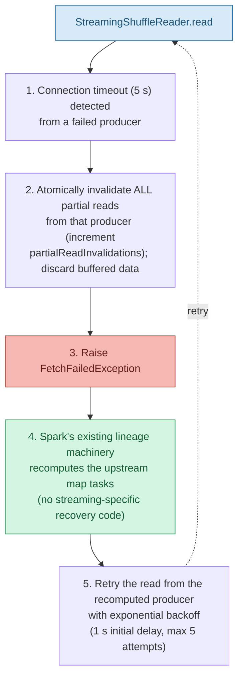

This page helps you diagnose and resolve issues when running Apache Spark with the opt-in streaming
shuffle backend enabled. It explains how to read the backend's diagnostic metrics and logs, how to
recognize the most common symptoms, and what to do about each one. Before troubleshooting, remember
that the streaming backend is designed to **fall back to the sort-based shuffle automatically**
whenever conditions are unfavorable, so many of the "problems" described here are expected, safe
degradations rather than failures. For background on how the backend works, see the
[architecture overview](streaming-shuffle-architecture.html); for how to enable and configure it,
see the [user guide](streaming-shuffle-guide.html); and for performance knobs, see the
[tuning guide](streaming-shuffle-tuning.html).

* This will become a table of contents (this text will be scraped).
{:toc}

# Overview

The streaming shuffle backend is an opt-in alternative to Spark's default sort-based shuffle. When
enabled, it buffers map-side output in memory and pipelines it directly to reduce-side consumers
through the existing network transport, governed by a backpressure protocol, instead of fully
materializing intermediate data to local disk before any fetch begins. The backend is engaged only
when **both** `spark.shuffle.manager=streaming` and `spark.shuffle.streaming.enabled=true` are set;
both default to off, so the default behavior of an existing Spark deployment is unchanged. See the
[user guide](streaming-shuffle-guide.html) for activation details.

A central design goal of the backend is *zero regression*: whenever streaming would be slower or
riskier than the classic path, the manager transparently delegates to the unchanged
`SortShuffleManager` instead. As a result, several conditions that look like failures — fallback to
sort-based shuffle, a `FetchFailedException`, disk spills, or throttled producers — are in fact the
backend's built-in safety mechanisms working as intended, with no data loss and no job failure. This
guide describes how to tell normal, protective behavior apart from a genuine misconfiguration or
infrastructure problem, and how to use the four `shuffle.streaming.*` metrics and the structured logs
to drive each diagnosis.

# Diagnostic metrics

The streaming shuffle backend emits four metrics under the `shuffle.streaming.*` namespace. They are
exposed through Spark's existing `MetricsSystem` (the Dropwizard-based metrics framework), so they are
available over JMX and through the Prometheus endpoint `/metrics/executors/prometheus`, and they also
surface in the **Stages** tab's shuffle columns of the Spark Web UI. No additional metrics
configuration is required beyond what you already use for Spark; see [Monitoring](monitoring.html) for
how to wire up JMX, Prometheus, and other sinks. These four metrics are the primary signals for every
symptom below — most diagnoses start by inspecting how they trend over the lifetime of a shuffle-heavy
stage.

| Metric (`shuffle.streaming.*`) | Type | What it measures | How to use it in diagnosis |
|---|---|---|---|
| `bufferUtilizationPercent` | Gauge | Current fill level of the in-memory per-partition buffers, as a percentage. | Persistently high values near the configured `spillThreshold` (default 80%) indicate memory pressure and an imminent or ongoing spill. Sustained readings above 95% are what trigger the memory-pressure fallback. |
| `spillCount` | Counter | Number of times buffered partitions have been spilled to disk. | A steadily rising count means the buffers are too small for the workload; pair it with `bufferUtilizationPercent` to confirm memory pressure. |
| `backpressureEvents` | Counter | Number of times producers were throttled by the flow-control protocol. | High or rapidly increasing values mean consumers cannot keep up with producers; this is the key signal behind the slow-consumer fallback. |
| `partialReadInvalidations` | Counter | Number of partial reads invalidated because a producer failed or timed out. | Correlates directly with `FetchFailedException` and the resulting upstream recomputes; a rising count points at flaky executors or an unstable network rather than the backend itself. |

Set `spark.shuffle.streaming.debug=true` to enable additional diagnostic logging. The streaming
backend writes structured log lines that carry correlation keys — the shuffle id, map id, reduce
partition range, and task attempt id — so you can follow a single block from a producer to its
consumer across executors. Keep `debug` disabled in production unless you are actively investigating
an issue (see [Logging](#logging)).

# Symptom: the backend fell back to sort-based shuffle

The most common observation is that a job runs to completion but does not appear to use the streaming
path — its behavior, timings, and on-disk shuffle files look like an ordinary sort-based shuffle. This
is almost always the fallback mechanism working as designed. The backend continuously evaluates four
revert conditions, and if **any** of them trips it delegates the shuffle to the unchanged
`SortShuffleManager`. Fallback is transparent and non-fatal: there is **no data loss and no job
failure**, only a return to the well-understood sort-based behavior. The streaming metrics for the
affected shuffle stop advancing once it falls back, and with `spark.shuffle.streaming.debug=true` the
logs record which condition triggered the revert.

The four fallback conditions, and how to recognize and address each, are described below. If fallback
is frequent and undesirable, the [tuning guide](streaming-shuffle-tuning.html) covers how to size
buffers and bandwidth to keep more workloads on the streaming path.

## Slow consumer

**Condition.** A consumer is sustained at roughly 2&times; slower than its producer for more than
60 seconds. The backpressure protocol cannot keep the producer and consumer in balance, so the
backend reverts to sort-based shuffle rather than block the producer indefinitely.

**Diagnose.** Look for a high or steadily climbing `backpressureEvents` count leading up to the
fallback — repeated throttling is the signature of a consumer that cannot keep pace.

**Mitigate.** Cap producer throughput with `spark.shuffle.streaming.maxBandwidthMBps` so producers and
consumers stay closer in rate, reduce the number of concurrent shuffles competing for consumer
capacity, scale up or speed up the reduce-side tasks, or simply accept the fallback if the sort-based
path already meets your latency target.

## Memory pressure (OOM risk)

**Condition.** Buffer allocation cannot proceed safely — buffer utilization is above 95%, so
continuing to stream would risk an out-of-memory error. The backend reverts to sort-based shuffle to
protect the executor.

**Diagnose.** Watch for `bufferUtilizationPercent` pinned near or above the `spillThreshold` together
with a rising `spillCount`; both indicate the in-memory buffers are saturated.

**Mitigate.** Lower `spark.shuffle.streaming.bufferSizePercent` so each shuffle reserves less of the
executor heap, lower `spark.shuffle.streaming.spillThreshold` to spill earlier and reclaim memory
sooner, increase executor memory, or repartition the data to reduce per-partition buffer size. The
[tuning guide](streaming-shuffle-tuning.html) walks through choosing these values for a given workload.

## Network saturation

**Condition.** The network link is more than 90% utilized. Streaming more data onto an already
saturated link would degrade the whole executor, so the backend reverts to sort-based shuffle.

**Mitigate.** Set a `spark.shuffle.streaming.maxBandwidthMBps` cap so the streaming backend leaves
headroom on the link, and investigate competing traffic (other shuffles, replication, or external
services) that may be consuming bandwidth on the same hosts.

## Producer/consumer version mismatch

**Condition.** A producer and consumer are running different Spark versions, so the streaming wire
protocol cannot be negotiated safely. The backend reverts to sort-based shuffle, which is
version-compatible.

**Mitigate.** Ensure every executor in the cluster runs the **same Spark version**. Mismatches
typically arise during rolling upgrades or when executors are launched from inconsistent images; once
all executors are on a single version the streaming path becomes available again after an application
restart.

# Symptom: FetchFailedException and partial reads

Seeing a `FetchFailedException` together with a rising `partialReadInvalidations` counter is the
backend's **normal, safe recovery path** for a producer failure — not a bug in the streaming layer.
Because intermediate data is streamed rather than fully materialized, the reader may be mid-fetch when
a producer becomes unreachable. To guarantee correctness, the reader detects the failure, throws away
any partially read data from that producer, and asks Spark to recompute the lost output. No partial or
corrupt data is ever delivered to a reduce task, so the end result is **zero data loss**.

The **Producer-Failure Detection and Recovery Flow** diagram below shows how the reader detects a failed producer and hands recovery to Spark's existing lineage-driven recompute machinery:

**Legend:** blue = reader entry point; red = failure surfaced to Spark; green = lineage-driven recovery; solid arrows = sequential steps; dotted arrow = bounded retry from the recomputed producer.

Each step reuses Spark's existing fault-tolerance model: the `FetchFailedException` and the
lineage-driven recompute are exactly the same mechanism the sort-based shuffle relies on, which is why
correctness and recovery semantics are unchanged. The retry in step 5 is bounded: reads are retried
with exponential backoff starting at a 1 s initial delay, up to a maximum of 5 attempts, after which
the failure propagates to the scheduler exactly as it would for the sort-based path.

An occasional `FetchFailedException` during executor churn is expected and is recovered automatically.
If it happens **frequently**, the streaming backend is the messenger rather than the cause: investigate
flaky executors, lost nodes, or an unstable network. The Spark Web UI's stage and task pages report the
fetch-failure details — including which executor or host was unreachable — so start there. See the
[Web UI](web-ui.html) guide for reading stage and task error details, and confirm whether the same
executors recur across failures.

# Symptom: frequent disk spills or high disk I/O

If you observe a steadily increasing `spillCount` and unexpectedly high disk I/O on your executors,
the buffers are spilling to disk more often than the workload can comfortably absorb. This is a
protective behavior, not a fault: when buffer utilization reaches the configured `spillThreshold`
(default 80%), the backend spills the largest buffered partitions to disk through the block manager
using the `DISK_ONLY` storage level, reclaiming memory within roughly 100 ms. Streaming then continues
from the spilled data, so no records are lost — but heavy spilling erodes the latency advantage the
streaming path is meant to provide.

**Diagnose.** Track `spillCount` over the stage; a count that climbs throughout the stage (rather than
plateauing) indicates buffers that are chronically undersized. Confirm by watching
`bufferUtilizationPercent` sit at or above the `spillThreshold`.

**Mitigate.** Increase `spark.shuffle.streaming.bufferSizePercent` so more data fits in memory before a
spill is needed (only if the executor has spare memory — raising it too far invites the memory-pressure
fallback described above), reduce the partition count so each partition's buffer is larger, or accept
the spill if disk throughput is adequate. The [tuning guide](streaming-shuffle-tuning.html) explains how
to balance buffer size against spill frequency for your data volume and partition count.

# Symptom: producers throttled (backpressure)

A high or rapidly increasing `backpressureEvents` counter means the flow-control protocol is actively
throttling producers. The backend uses a consumer-to-producer heartbeat (sent on a 10-second interval)
together with token-bucket rate limiting to keep producers from overwhelming consumers. When a consumer
signals that it is falling behind, producers are slowed; each such throttling action increments
`backpressureEvents`. A modest, stable level of backpressure is healthy — it is the mechanism keeping
memory bounded — but sustained, high throttling usually points at one of the following causes:

* **Slow or overloaded consumers** — the reduce-side tasks cannot drain data fast enough. Scale up or
  speed up the consumers, or reduce the work each consumer performs.
* **An overly low bandwidth cap** — `spark.shuffle.streaming.maxBandwidthMBps` is set too conservatively,
  rate-limiting producers below what consumers could actually accept. Raise the cap, or clear it (set it
  to `0` or a non-positive value) to remove the per-executor limit entirely.
* **Too many concurrent shuffles** — multiple shuffles compete for the same per-executor bandwidth
  budget. Reduce shuffle concurrency so each shuffle receives a larger share.

If sustained backpressure cannot be relieved, the backend eventually falls back to sort-based shuffle
via the slow-consumer condition described above, so a persistently throttled job degrades safely rather
than stalling.

# Symptom: streaming shuffle does not appear to be active

If you intended to run with the streaming backend but the metrics never move and the job behaves like
an ordinary sort-based shuffle from the start (as opposed to falling back partway through), the backend
was most likely never engaged. Work through this checklist:

1. **Both activation flags are set.** The streaming path requires **both**
   `spark.shuffle.manager=streaming` **and** `spark.shuffle.streaming.enabled=true`. Both default to off,
   and setting only one has no effect. Verify the effective values in the **Environment** tab of the
   Spark Web UI.
2. **The application was restarted after changing configuration.** Streaming-shuffle configuration is
   immutable for the lifetime of an application in this release — there is no dynamic reconfiguration.
   Changing the flags on a running application has no effect; you must restart the application (and its
   executors) for new values to take hold.
3. **The metrics are non-zero.** Once the backend is active and a shuffle has run, at least some of the
   `shuffle.streaming.*` metrics should be non-zero. If every metric stays at zero across shuffle-heavy
   stages, the backend is not handling the shuffle.
4. **Enable debug logging.** Set `spark.shuffle.streaming.debug=true` and re-run. The structured logs
   record whether `StreamingShuffleManager` was selected, whether streaming was enabled, and — if a
   fallback occurred — which condition triggered it.

For a step-by-step walkthrough of enabling and validating the backend, see the
[user guide](streaming-shuffle-guide.html).

# Configuration reference

The streaming backend is controlled by the `spark.shuffle.manager` alias plus five
`spark.shuffle.streaming.*` properties. All of them are immutable for the lifetime of an application;
change them in your Spark configuration and restart the application to take effect. The table below
summarizes the properties most relevant to troubleshooting; the [user guide](streaming-shuffle-guide.html)
and [tuning guide](streaming-shuffle-tuning.html) describe how to choose values, and the full set of
Spark properties is documented in [Configuration](configuration.html).

<table class="spark-config">
<thead><tr><th>Property Name</th><th>Default</th><th>Meaning</th><th>Since Version</th></tr></thead>
<tr>
  <td><code>spark.shuffle.streaming.enabled</code></td>
  <td>false</td>
  <td>
    Feature flag that opts in to the streaming shuffle backend. Must be set to <code>true</code>
    <em>and</em> combined with <code>spark.shuffle.manager=streaming</code> for streaming to engage.
    When <code>false</code>, the manager delegates every shuffle to the sort-based path.
  </td>
  <td>4.2.0</td>
</tr>
<tr>
  <td><code>spark.shuffle.streaming.bufferSizePercent</code></td>
  <td>20</td>
  <td>
    Percentage of executor memory (1&ndash;50) used for the in-memory shuffle buffers. Per-partition
    buffer size is derived as <code>(executorMemory * bufferSizePercent / 100) / numPartitions</code>
    with a 2&nbsp;MB floor. Raising it reduces spills but increases memory pressure; lowering it does
    the reverse.
  </td>
  <td>4.2.0</td>
</tr>
<tr>
  <td><code>spark.shuffle.streaming.spillThreshold</code></td>
  <td>80</td>
  <td>
    Buffer-utilization percentage (50&ndash;95) at which the largest buffered partitions are spilled to
    disk via the block manager (<code>DISK_ONLY</code>). Lower it to spill earlier and reclaim memory
    sooner under pressure.
  </td>
  <td>4.2.0</td>
</tr>
<tr>
  <td><code>spark.shuffle.streaming.maxBandwidthMBps</code></td>
  <td>-1 (unlimited)</td>
  <td>
    Per-executor streaming bandwidth cap, in MB/s, enforced by the token-bucket rate limiter. The default
    <code>-1</code> (or any non-positive value) means unlimited. Use it to relieve backpressure or to leave headroom on a
    saturated network link.
  </td>
  <td>4.2.0</td>
</tr>
<tr>
  <td><code>spark.shuffle.streaming.debug</code></td>
  <td>false</td>
  <td>
    Enables additional diagnostic logging for the streaming backend, including structured log lines with
    correlation keys (shuffle id, map id, reduce partition range, attempt id). Keep this disabled in
    production to respect the log-volume budget.
  </td>
  <td>4.2.0</td>
</tr>
</table>

# Logging

The streaming backend reuses Spark's existing SLF4J/Log4j2 logging infrastructure; there is no separate
logging framework to configure. On top of the standard log output, the backend emits streaming-specific
**structured logging with correlation IDs** — the shuffle id, map id, reduce partition range, and task
attempt id — so that the lifecycle of an individual block can be traced from a producer to its consumer
across executors. These correlation keys are what make the metric-driven diagnoses above actionable: a
spike in `partialReadInvalidations`, for example, can be tied back to a specific shuffle and producer.

Set `spark.shuffle.streaming.debug=true` to raise verbosity while investigating an issue. Disable it
again in production: the backend is designed to stay within a modest log-volume budget under normal
operation, and leaving debug logging on defeats that. The streaming backend does not change how logging
is configured — adjust levels, appenders, and `log4j2.properties` exactly as you would for any other
Spark component. See the general logging configuration in
[Configuration](configuration.html#configuring-logging).

# Quick reference: symptom to metric to action

The table below ties the page together: match the symptom you observe to the metric that confirms it
and the first action to take. Follow the section links above for the full diagnosis and mitigation
details.

| Symptom | Primary metric(s) | First action |
|---|---|---|
| Fell back to sort-based shuffle (slow consumer) | `backpressureEvents` high | Cap `maxBandwidthMBps`, reduce concurrent shuffles, or scale consumers; otherwise accept the safe fallback. |
| Fell back to sort-based shuffle (memory pressure) | `bufferUtilizationPercent` &gt; 95%, `spillCount` rising | Lower `bufferSizePercent` or `spillThreshold`, increase executor memory, or repartition. |
| Fell back to sort-based shuffle (network saturation) | (link utilization &gt; 90%) | Set a `maxBandwidthMBps` cap and investigate competing network traffic. |
| Fell back to sort-based shuffle (version mismatch) | (none — protocol negotiation) | Ensure all executors run the same Spark version. |
| `FetchFailedException` / partial reads | `partialReadInvalidations` rising | Expected, zero-data-loss recovery; if frequent, investigate flaky executors/network via the [Web UI](web-ui.html). |
| Frequent disk spills / high disk I/O | `spillCount` rising, `bufferUtilizationPercent` near `spillThreshold` | Increase `bufferSizePercent` (if memory allows) or reduce partition count; otherwise accept the spill. |
| Producers throttled (backpressure) | `backpressureEvents` high | Raise or clear `maxBandwidthMBps`, scale consumers, or reduce shuffle concurrency. |
| Streaming shuffle not active | all `shuffle.streaming.*` stay at 0 | Confirm both activation flags, restart the application, and enable `debug` logging. |

# Related documentation

* [Streaming Shuffle Architecture](streaming-shuffle-architecture.html) — how the backend works internally.
* [Streaming Shuffle User Guide](streaming-shuffle-guide.html) — enabling, configuring, and validating the backend.
* [Streaming Shuffle Tuning](streaming-shuffle-tuning.html) — sizing buffers, spill thresholds, and bandwidth.
* [Monitoring and Instrumentation](monitoring.html) — metrics sinks, JMX, and the Prometheus endpoints.
* [Configuration](configuration.html) — the full set of Spark configuration properties.
* [Web UI](web-ui.html) — reading stage and task error details for fetch failures.

